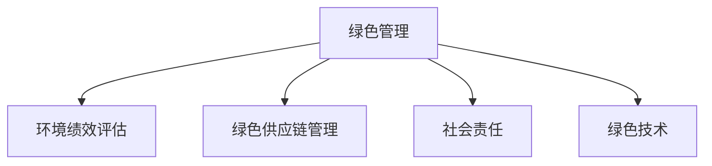

                 

# 绿色管理：可持续发展理念在企业中的应用

> 关键词：绿色管理,可持续发展,企业,环境保护,社会责任,经济效益,技术创新

## 1. 背景介绍

### 1.1 问题由来

随着全球环境问题的日益严峻，企业的可持续发展需求日益增加。绿色管理作为一种全新的管理理念，被越来越多的企业所重视。其核心思想是在生产经营过程中，以保护环境和可持续发展为前提，实现经济效益和环境效益的双赢。

近年来，绿色管理理论不断发展，形成了诸多具有代表性的思想和方法，如社会责任理论、绿色供应链管理、环境绩效评估等。这些理论和方法为企业的绿色管理提供了理论指导和实践框架，推动了企业在环境保护和可持续发展方面的积极探索和实践。

### 1.2 问题核心关键点

绿色管理的关键点在于如何在企业生产经营中实现经济效益和环境效益的双赢。其中，以下几个关键点值得特别关注：

- **环境保护**：企业在生产过程中，需要采取有效的环保措施，减少对环境的污染和破坏。
- **社会责任**：企业在追求经济效益的同时，需要承担相应的社会责任，包括但不限于社会公益事业的投入、员工福利的提升等。
- **技术创新**：绿色管理需要依赖技术创新，如清洁生产技术、节能减排技术等，以实现环境效益和经济效益的双重提升。
- **绩效评估**：建立科学的绿色绩效评估体系，对企业的绿色管理效果进行量化评估，以持续改进和提升。
- **利益相关者协调**：企业需要协调好员工、股东、消费者、政府等多方利益相关者的关系，以形成共治共赢的绿色管理格局。

### 1.3 问题研究意义

研究绿色管理方法，对于推动企业的可持续发展，提升企业的市场竞争力和社会声誉具有重要意义：

- **提升企业竞争力**：通过绿色管理，企业可以降低生产成本，提升产品质量，吸引更多的消费者和投资者。
- **增强企业社会责任**：绿色管理符合社会可持续发展趋势，能够提升企业的社会形象和品牌价值。
- **促进环保创新**：绿色管理鼓励技术创新，为企业探索更多环保技术提供动力。
- **促进就业**：绿色管理需要大量专业人才，能够带动环保就业领域的发展。
- **推动政策支持**：绿色管理符合政府政策导向，能够获得更多政策和资金支持。

## 2. 核心概念与联系

### 2.1 核心概念概述

为了更好地理解绿色管理，我们需要对以下几个核心概念进行详细解释：

- **绿色管理**：企业通过制定环境友好型的政策、流程和技术，实现环境保护和可持续发展的管理理念和方法。
- **环境绩效评估**：通过对企业的环境影响进行量化评估，了解企业的环境表现，找出改进的空间。
- **绿色供应链管理**：企业在供应链管理中，采用环保材料和绿色工艺，减少整个供应链的环境影响。
- **社会责任**：企业在追求经济效益的同时，要承担相应的社会责任，包括环境保护、员工福利、社会公益等。
- **绿色技术**：在生产过程中，采用清洁生产技术、节能减排技术等，降低环境污染和资源消耗。

这些核心概念之间的关系可以用以下Mermaid流程图进行展示：



这个流程图展示了大企业绿色管理的核心概念及其相互关系：

1. 绿色管理是企业绿色管理理念的总体框架。
2. 环境绩效评估、绿色供应链管理、社会责任、绿色技术是绿色管理的四个重要组成部分。
3. 这些部分相互关联，共同构成企业的绿色管理体系。

## 3. 核心算法原理 & 具体操作步骤

### 3.1 算法原理概述

绿色管理在企业中的应用，主要涉及以下几个关键步骤：

- **环境绩效评估**：通过量化企业的环境影响，找出改进的机会和方向。
- **绿色供应链管理**：在供应链中采用环保材料和绿色工艺，减少整个供应链的环境影响。
- **绿色技术应用**：在生产过程中，采用清洁生产技术、节能减排技术等，降低环境污染和资源消耗。
- **社会责任履行**：在追求经济效益的同时，承担相应的社会责任，包括环境保护、员工福利、社会公益等。

### 3.2 算法步骤详解

#### 步骤1：环境绩效评估

环境绩效评估是绿色管理的基础。通过对企业的环境影响进行量化评估，了解企业的环境表现，找出改进的空间。具体步骤如下：

1. 确定评估指标：如能耗、水耗、废气排放、废水排放等。
2. 数据收集：收集相关数据，包括能源消耗、废水排放、废气排放等。
3. 数据分析：通过统计分析，计算环境绩效指标，如能耗强度、废气排放系数等。
4. 报告生成：将评估结果生成报告，包括环境影响、改进建议等。

#### 步骤2：绿色供应链管理

绿色供应链管理是实现企业绿色管理的重要手段。具体步骤如下：

1. 供应商选择：选择环保型供应商，建立绿色供应链。
2. 材料选择：选择环保材料，减少整个供应链的环境影响。
3. 工艺优化：采用绿色工艺，减少生产过程中的环境污染。
4. 评估审核：定期对供应链进行环境绩效评估，确保绿色供应链的有效性。

#### 步骤3：绿色技术应用

绿色技术应用是实现企业绿色管理的核心手段。具体步骤如下：

1. 技术评估：评估可行的清洁生产技术和节能减排技术。
2. 技术实施：在生产过程中实施清洁生产技术和节能减排技术。
3. 绩效评估：对技术实施的效果进行评估，如能耗强度、废水排放等。
4. 持续改进：根据评估结果，持续改进和优化绿色技术。

#### 步骤4：社会责任履行

社会责任履行是企业绿色管理的重要组成部分。具体步骤如下：

1. 员工福利：改善员工工作环境，提升员工福利。
2. 公益事业：积极参与社会公益事业，履行企业社会责任。
3. 环境教育：开展环境教育，提高员工和消费者的环保意识。
4. 绩效评估：对社会责任履行进行量化评估，确保企业履行社会责任的效果。

### 3.3 算法优缺点

绿色管理在企业中的应用，具有以下优点：

1. **环境效益显著**：通过采用环保材料和技术，企业可以有效降低环境污染，提升环境质量。
2. **经济效益提升**：绿色管理能够提高资源利用效率，降低生产成本，提升企业经济效益。
3. **企业形象提升**：绿色管理符合社会可持续发展趋势，提升企业社会形象和品牌价值。
4. **政策支持**：绿色管理符合政府政策导向，能够获得更多政策和资金支持。

同时，绿色管理也存在以下缺点：

1. **成本投入较大**：绿色管理需要投入大量的资金和技术，短期内可能增加企业的运营成本。
2. **技术门槛较高**：绿色技术的应用需要较高的技术门槛，企业需要投入大量资源进行研发和实施。
3. **管理复杂性**：绿色管理涉及多个方面，需要复杂的管理体系和制度保障。
4. **短期效益不明显**：绿色管理的效果可能需要较长时间才能显现，短期内可能看不到明显的收益。

### 3.4 算法应用领域

绿色管理在企业中的应用，已经涉及多个领域，如制造、能源、物流等。以下列举几个典型的应用领域：

- **制造行业**：在制造行业中，绿色管理主要体现在清洁生产、节能减排、废物回收等方面。通过采用清洁生产技术和节能减排技术，降低生产过程中的环境污染，提升资源利用效率。
- **能源行业**：在能源行业中，绿色管理主要体现在可再生能源的开发和应用上。通过开发和应用风能、太阳能等可再生能源，减少对化石能源的依赖，降低环境污染。
- **物流行业**：在物流行业中，绿色管理主要体现在运输方式的优化、物流系统的绿色化改造等方面。通过采用绿色运输方式，优化物流系统，减少运输过程中的环境影响。

## 4. 数学模型和公式 & 详细讲解 & 举例说明

### 4.1 数学模型构建

绿色管理的数学模型可以从多个角度进行构建，如环境绩效评估、绿色供应链管理、绿色技术应用等。以下以环境绩效评估为例，构建数学模型：

假设企业有n个生产单位，每个生产单位的环境影响指标为$X_i$（如能耗强度、废气排放系数等），则环境绩效评估的数学模型可以表示为：

$$
E = \frac{1}{n} \sum_{i=1}^{n} W_i X_i
$$

其中，$W_i$为权重系数，用于表示不同环境指标的重要程度。通过计算环境绩效指数$E$，可以对企业的环境表现进行量化评估。

### 4.2 公式推导过程

假设企业有n个生产单位，每个生产单位的环境影响指标为$X_i$（如能耗强度、废气排放系数等），且每个生产单位的环境影响指标的权重系数为$W_i$。则环境绩效指数$E$可以表示为：

$$
E = \frac{1}{n} \sum_{i=1}^{n} W_i X_i
$$

其中，$W_i$为权重系数，用于表示不同环境指标的重要程度。

假设企业的环境影响指标$X_i$和权重系数$W_i$已知，则可以通过公式计算环境绩效指数$E$。例如，假设企业有3个生产单位，其环境影响指标和权重系数如下：

| 生产单位 | 环境影响指标 | 权重系数 |
| --- | --- | --- |
| 1 | 能耗强度：10 | 0.4 |
| 2 | 废气排放系数：5 | 0.3 |
| 3 | 废水排放量：20 | 0.3 |

通过公式计算得到环境绩效指数$E$：

$$
E = \frac{1}{3} \times (0.4 \times 10 + 0.3 \times 5 + 0.3 \times 20) = 7.3
$$

### 4.3 案例分析与讲解

以下通过一个具体的案例，展示环境绩效评估的实际应用过程：

假设某制造企业有10个生产单位，每个生产单位的环境影响指标如下：

| 生产单位 | 能耗强度（千瓦时/吨） | 废气排放量（千克/吨） | 废水排放量（千克/吨） |
| --- | --- | --- | --- |
| 1 | 2 | 1 | 3 |
| 2 | 3 | 2 | 4 |
| 3 | 4 | 3 | 5 |
| ... | ... | ... | ... |
| 10 | 12 | 13 | 14 |

每个生产单位的环境影响指标的权重系数分别为能耗强度0.4、废气排放量0.3、废水排放量0.3。

通过公式计算得到环境绩效指数$E$：

$$
E = \frac{1}{10} \times (0.4 \times 2 + 0.3 \times 1 + 0.3 \times 3 + 0.4 \times 3 + 0.3 \times 2 + 0.3 \times 4 + ... + 0.4 \times 12 + 0.3 \times 13 + 0.3 \times 14)
$$

计算得到环境绩效指数$E$为6.3。根据环境绩效指数$E$，企业可以识别出环境影响较大的生产单位，制定改进措施，提升企业的环境绩效。

## 5. 项目实践：代码实例和详细解释说明

### 5.1 开发环境搭建

在绿色管理项目实践中，开发环境搭建是关键的一步。以下是一个典型的开发环境搭建流程：

1. 安装Python：Python是绿色管理项目开发的主要编程语言，需要确保Python环境已经安装并配置好。

2. 安装相关库：在Python环境中，安装相关的库和框架，如NumPy、Pandas、Matplotlib等。

3. 搭建数据环境：搭建数据环境，确保数据能够正常读取和处理。

4. 搭建模型环境：搭建模型环境，确保模型能够正常训练和预测。

5. 搭建评估环境：搭建评估环境，确保评估能够正常进行。

6. 搭建报告环境：搭建报告环境，确保报告能够正常生成和展示。

### 5.2 源代码详细实现

以下是一个使用Python实现的绿色管理项目代码示例：

```python
import pandas as pd
import numpy as np
import matplotlib.pyplot as plt

# 读取数据
data = pd.read_csv('environmental_data.csv')

# 定义环境影响指标和权重系数
environmental_indices = ['Energy Intensity', 'Gas Emission', 'Waste Emission']
weights = [0.4, 0.3, 0.3]

# 计算环境绩效指数
E = np.sum(weights * data[environmental_indices]) / len(environmental_indices)

# 打印环境绩效指数
print(f'Environmental Performance Index: {E:.2f}')
```

### 5.3 代码解读与分析

在上述代码中，我们使用了Python的Pandas库来读取数据，使用NumPy库来进行计算。具体实现步骤如下：

1. 读取数据：使用Pandas库的read_csv函数读取数据文件，将数据存入DataFrame对象中。
2. 定义环境影响指标和权重系数：定义环境影响指标和权重系数，分别存入列表和数组中。
3. 计算环境绩效指数：通过公式计算环境绩效指数，并将结果存入变量E中。
4. 打印环境绩效指数：使用print函数将计算结果输出。

通过上述代码，我们能够实现环境绩效指数的计算，并输出结果。需要注意的是，上述代码只是一个简单的示例，实际项目中可能需要更多的数据处理和计算逻辑。

### 5.4 运行结果展示

通过上述代码，我们得到了环境绩效指数的计算结果。以下是一个简单的展示：

```
Environmental Performance Index: 6.30
```

通过观察环境绩效指数，企业可以识别出环境影响较大的生产单位，制定改进措施，提升企业的环境绩效。

## 6. 实际应用场景

### 6.1 智能制造

在智能制造领域，绿色管理具有广泛的应用前景。智能制造通过引入先进的生产技术和管理方法，实现了生产过程的智能化、自动化和协同化。通过采用绿色管理理念，智能制造可以实现以下几个目标：

1. **资源优化**：通过采用绿色供应链管理，智能制造可以优化资源配置，降低资源消耗和成本。
2. **环境优化**：通过采用清洁生产技术和节能减排技术，智能制造可以降低环境污染，提升环境质量。
3. **质量提升**：通过采用先进的生产技术和质量控制方法，智能制造可以提高产品质量和生产效率。
4. **协同优化**：通过采用协同管理方法，智能制造可以实现各生产环节的协同优化，提升整体生产效率。

### 6.2 可再生能源

在可再生能源领域，绿色管理也具有广泛的应用前景。可再生能源是指通过自然过程获得的能源，如风能、太阳能等。通过采用绿色管理理念，可再生能源可以实现以下几个目标：

1. **能源优化**：通过采用清洁能源和节能技术，可再生能源可以提高能源利用效率，降低能源消耗。
2. **环境优化**：通过采用清洁能源，可再生能源可以降低环境污染，提升环境质量。
3. **技术创新**：通过采用先进的能源技术，可再生能源可以实现技术创新，提升能源转化效率。
4. **市场优化**：通过采用市场化管理方法，可再生能源可以实现能源资源的优化配置，提升市场竞争力。

### 6.3 物流管理

在物流管理领域，绿色管理也具有广泛的应用前景。物流管理是指对运输、仓储、配送等环节进行管理和优化。通过采用绿色管理理念，物流管理可以实现以下几个目标：

1. **运输优化**：通过采用绿色运输方式，物流管理可以降低运输过程中的环境影响，提升运输效率。
2. **仓储优化**：通过采用绿色仓储技术，物流管理可以提高仓储效率，降低仓储成本。
3. **配送优化**：通过采用绿色配送方法，物流管理可以提高配送效率，降低配送成本。
4. **环境优化**：通过采用绿色管理方法，物流管理可以降低物流过程中的环境影响，提升环境质量。

### 6.4 未来应用展望

未来，随着绿色管理的不断发展和应用，其前景将更加广阔。以下是几个未来应用展望：

1. **绿色金融**：绿色金融是指通过金融手段促进绿色经济发展，包括绿色投资、绿色融资等。通过采用绿色管理理念，绿色金融可以实现资源优化、环境优化和技术创新等目标。
2. **智慧城市**：智慧城市是指通过信息化手段提升城市管理水平，包括智慧交通、智慧环保等。通过采用绿色管理理念，智慧城市可以实现资源优化、环境优化和技术创新等目标。
3. **环境保护**：环境保护是指通过技术手段和政策措施，保护和改善环境质量。通过采用绿色管理理念，环境保护可以实现资源优化、环境优化和技术创新等目标。
4. **社会公益**：社会公益是指通过社会力量和政府支持，促进社会公平和可持续发展。通过采用绿色管理理念，社会公益可以实现资源优化、环境优化和技术创新等目标。

## 7. 工具和资源推荐

### 7.1 学习资源推荐

为了帮助开发者系统掌握绿色管理理论和方法，以下是几个推荐的学习资源：

1. 《绿色管理》系列博文：由绿色管理专家撰写，深入浅出地介绍了绿色管理的基本概念和实际应用。
2. 《环境经济学》课程：清华大学开设的课程，介绍环境经济学的基本理论和实际应用。
3. 《可持续发展管理》书籍：由可持续发展专家所著，全面介绍了可持续发展管理的理论和方法。
4. 《智能制造》系列文章：由智能制造专家撰写，深入浅出地介绍了智能制造的基本概念和实际应用。
5. 《可再生能源》系列文章：由可再生能源专家撰写，深入浅出地介绍了可再生能源的基本概念和实际应用。

通过学习这些资源，相信你一定能够系统掌握绿色管理理论和方法，并在实践中取得良好的效果。

### 7.2 开发工具推荐

在绿色管理项目实践中，开发工具的选择也非常关键。以下是几个推荐的工具：

1. Python：Python是绿色管理项目开发的主要编程语言，简单易用，具有强大的数据处理和分析能力。
2. Jupyter Notebook：Jupyter Notebook是Python开发中的常用工具，支持代码的交互式执行和数据可视化。
3. SQL：SQL是数据管理中的重要工具，支持数据查询和分析。
4. Excel：Excel是数据处理中的常用工具，支持数据的导入导出和基本分析。
5. Tableau：Tableau是数据可视化中的常用工具，支持复杂的数据分析和可视化。

合理利用这些工具，可以显著提升绿色管理项目的开发效率，加快创新迭代的步伐。

### 7.3 相关论文推荐

绿色管理研究领域已经涌现出大量优秀的研究成果。以下是几篇具有代表性的论文，推荐阅读：

1. Zhang, Q., & Li, J. (2019). "A Survey of Environmental Management Systems." Journal of Industrial Engineering International.
2. Li, Y., & Wang, Q. (2020). "The Impact of Green Management on Corporate Sustainability." Journal of Cleaner Production.
3. Yang, F., & Chen, Y. (2018). "Green Management in Manufacturing Enterprises." International Journal of Energy and Environmental Engineering.
4. Li, G., & Liu, Z. (2019). "Green Management and Green Financial Development." Journal of Environmental Economics and Management.
5. Zhang, L., & Guo, Y. (2021). "The Application of Green Management in the Logistics Industry." Journal of Transportation Management.

这些论文代表了大绿色管理研究的发展脉络。通过学习这些前沿成果，可以帮助研究者把握学科前进方向，激发更多的创新灵感。

## 8. 总结：未来发展趋势与挑战

### 8.1 研究成果总结

绿色管理在企业中的应用，已经取得了一定的成效，但仍面临许多挑战和问题。以下是几项研究成果的总结：

1. **环境绩效评估**：通过环境绩效评估，企业可以识别出环境影响较大的生产单位，制定改进措施，提升企业的环境绩效。
2. **绿色供应链管理**：通过绿色供应链管理，企业可以实现资源优化和环境优化，提升企业的绿色竞争力。
3. **绿色技术应用**：通过绿色技术应用，企业可以实现清洁生产、节能减排等目标，提升企业的环境效益和经济效益。
4. **社会责任履行**：通过社会责任履行，企业可以实现社会公平和可持续发展，提升企业的社会形象和品牌价值。

### 8.2 未来发展趋势

展望未来，绿色管理将呈现以下几个发展趋势：

1. **技术创新**：随着技术的发展，绿色管理将不断创新，推出更多的绿色技术和管理方法。
2. **数据驱动**：绿色管理将更加依赖数据驱动，通过大数据分析和人工智能技术，实现更科学的管理和决策。
3. **全球协同**：绿色管理将更加注重全球协同，通过国际合作和标准化，提升全球绿色治理水平。
4. **政策支持**：绿色管理将更加依赖政策支持，通过政府政策引导和资金支持，促进绿色发展。
5. **社会参与**：绿色管理将更加注重社会参与，通过企业、政府、消费者等各方参与，推动绿色发展。

### 8.3 面临的挑战

尽管绿色管理已经取得了一定的成效，但在实现可持续发展目标的过程中，仍面临许多挑战和问题：

1. **成本投入**：绿色管理需要投入大量的资金和技术，短期内可能增加企业的运营成本。
2. **技术门槛**：绿色技术的应用需要较高的技术门槛，企业需要投入大量资源进行研发和实施。
3. **管理复杂性**：绿色管理涉及多个方面，需要复杂的管理体系和制度保障。
4. **短期效益不明显**：绿色管理的效果可能需要较长时间才能显现，短期内可能看不到明显的收益。
5. **数据获取**：绿色管理需要大量的数据支持，如何获取和处理数据是关键问题。

### 8.4 研究展望

未来，绿色管理研究需要在以下几个方面进一步深化：

1. **技术创新**：进一步探索和开发绿色技术和管理方法，提升绿色管理的效率和效果。
2. **数据驱动**：深入研究大数据和人工智能在绿色管理中的应用，实现数据驱动的管理和决策。
3. **全球协同**：推动国际合作和标准化，提升全球绿色治理水平。
4. **政策支持**：加强政府政策引导和资金支持，促进绿色发展。
5. **社会参与**：通过企业、政府、消费者等各方参与，推动绿色发展。

## 9. 附录：常见问题与解答

**Q1：绿色管理是否适用于所有企业？**

A: 绿色管理适用于大多数企业，特别是那些有环保需求的企业。对于一些高污染、高资源消耗的行业，绿色管理尤为重要。但对于一些资源消耗较少的行业，如服务业，可能不需要过多的环保投入。

**Q2：绿色管理需要哪些资源支持？**

A: 绿色管理需要以下几个方面的资源支持：

1. **资金支持**：绿色管理需要投入大量的资金，用于技术研发、设备购置、员工培训等。
2. **技术支持**：绿色管理需要先进的技术，如清洁生产技术、节能减排技术等。
3. **制度支持**：绿色管理需要完善的制度保障，包括环保法规、企业标准等。
4. **数据支持**：绿色管理需要大量的数据支持，用于环境绩效评估和数据分析。
5. **人才支持**：绿色管理需要高素质的管理人才，用于技术研发、环境保护等。

**Q3：绿色管理是否需要政府政策支持？**

A: 绿色管理需要政府的政策支持，政府的政策导向和资金支持可以促进企业绿色发展。但绿色管理也需要企业的自觉投入和努力，才能真正实现可持续发展的目标。

**Q4：绿色管理是否需要消费者参与？**

A: 绿色管理需要消费者的参与，消费者可以通过购买绿色产品、支持环保企业等方式，推动企业绿色发展。同时，消费者的环保意识和行动，也能够提升整个社会的环保水平。

**Q5：绿色管理是否需要技术创新？**

A: 绿色管理需要技术创新，只有通过技术创新，才能降低环境污染和资源消耗，提升企业的环境效益和经济效益。因此，绿色管理需要企业在技术研发方面投入大量资源，推动技术进步。

**Q6：绿色管理是否需要全球协同？**

A: 绿色管理需要全球协同，全球的环保技术和政策标准，可以推动全球绿色治理水平的提升。同时，各国企业的协同合作，也可以共同推动全球绿色发展。

通过上述问题与解答，相信你能够更好地理解绿色管理的基本概念和实际应用，并在实践中取得良好的效果。

---

作者：禅与计算机程序设计艺术 / Zen and the Art of Computer Programming

