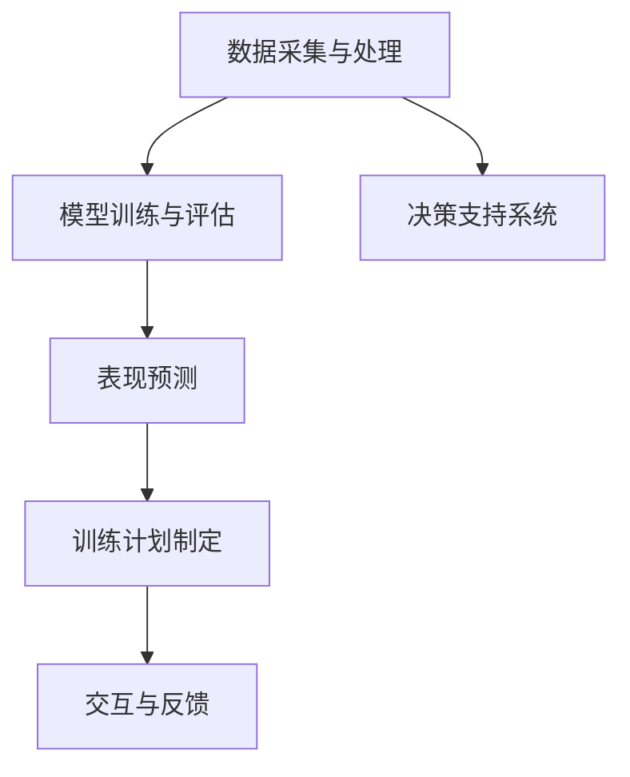

                 

## 1. 背景介绍

随着人工智能技术的迅猛发展，聊天机器人在各行各业的应用愈发广泛，体育行业也不例外。在运动员表现分析和训练计划制定等方面，聊天机器人以其高效、个性化的特点，正在逐步改变传统的工作流程，成为教练员、运动员和管理人员的重要工具。然而，要充分发挥聊天机器人在体育领域的潜力，必须深入理解和有效利用其在数据分析、决策支持和训练监控等方面的强大能力。

### 1.1 问题由来
现代体育赛事竞争激烈，训练方案的制定和运动员的表现分析对提升运动员的成绩至关重要。然而，传统的训练方案制定依赖于教练员的个人经验和有限的数据信息，缺乏科学依据。近年来，随着体育数据采集设备的普及，体育数据量急剧增长，这些数据蕴含着运动员表现的丰富信息。如何高效地利用这些数据，为运动员制定个性化的训练计划，并实时监测和调整训练状态，成为体育教练员和科研人员亟待解决的问题。

### 1.2 问题核心关键点
基于聊天机器人技术的运动员表现分析和训练计划制定，核心关键点在于：

1. 数据采集与处理：获取运动员的生理数据、训练数据和比赛数据，并进行预处理和清洗。
2. 模型训练与评估：利用机器学习模型对运动员数据进行分析，提取关键特征，进行表现预测和训练效果评估。
3. 计划制定与优化：根据模型分析结果，制定个性化的训练计划，并实时调整和优化。
4. 交互与反馈：通过人机交互界面，教练员和运动员能够直观地获取数据和分析结果，快速做出决策。

## 2. 核心概念与联系

### 2.1 核心概念概述

为更好地理解聊天机器人技术在体育领域的实际应用，本节将介绍几个密切相关的核心概念：

- 聊天机器人(Chatbot)：一种能够模拟人类对话的人工智能应用，通过自然语言处理技术实现人机交互。
- 体育数据分析：收集和分析运动员的生理数据、训练数据和比赛数据，提取运动员表现的特征和规律。
- 表现预测：利用机器学习模型，对运动员在未来比赛或训练中的表现进行预测。
- 训练计划制定：根据表现预测结果，制定符合运动员个性化的训练计划，并实时调整。
- 决策支持系统：集成数据分析、表现预测和训练计划制定功能，辅助教练员进行决策。

这些核心概念之间的逻辑关系可以通过以下Mermaid流程图来展示：



这个流程图展示了从数据采集到训练计划制定的人机交互流程：

1. 数据采集与处理：获取运动员的生理数据、训练数据和比赛数据。
2. 模型训练与评估：利用机器学习模型对运动员数据进行分析，提取关键特征，进行表现预测和训练效果评估。
3. 表现预测：根据模型分析结果，制定个性化的训练计划，并实时调整和优化。
4. 交互与反馈：通过人机交互界面，教练员和运动员能够直观地获取数据和分析结果，快速做出决策。

## 3. 核心算法原理 & 具体操作步骤
### 3.1 算法原理概述

聊天机器人技术在体育领域的应用，主要是通过自然语言处理(NLP)和机器学习算法来实现的。其核心算法原理包括以下几个方面：

1. **自然语言处理(NLP)**：通过NLP技术，聊天机器人可以理解教练员和运动员的自然语言输入，并生成自然语言输出，实现人机交互。
2. **机器学习**：利用机器学习算法，对运动员的生理数据、训练数据和比赛数据进行分析，提取特征，进行表现预测和训练效果评估。
3. **推荐系统**：结合预测结果，聊天机器人可以为运动员推荐个性化的训练方案，并根据训练效果实时调整。

### 3.2 算法步骤详解

基于聊天机器人技术的运动员表现分析和训练计划制定的主要步骤如下：

**Step 1: 数据采集与处理**

- **数据源**：收集运动员的生理数据、训练数据和比赛数据，包括心率、血氧、步频、步幅、跑速等。
- **数据预处理**：对采集到的数据进行清洗、归一化和特征提取，以提高模型分析的准确性。

**Step 2: 模型训练与评估**

- **模型选择**：选择适合体育数据分析的机器学习模型，如决策树、随机森林、支持向量机等。
- **特征提取**：根据数据特点，提取关键特征，如速度、耐力、爆发力等。
- **模型训练**：使用运动员的历史数据对模型进行训练，优化模型参数。
- **模型评估**：利用交叉验证等方法评估模型性能，选择最佳模型。

**Step 3: 表现预测**

- **预测输入**：将运动员当前的生理数据、训练数据和比赛数据输入到最佳模型中，获取预测结果。
- **结果解释**：对预测结果进行解释，包括运动员的表现趋势、优势和不足。

**Step 4: 训练计划制定与优化**

- **训练计划生成**：根据预测结果，为运动员生成个性化的训练计划，包括训练强度、训练内容和训练时间等。
- **训练效果监控**：在训练过程中实时监控运动员的生理指标，评估训练效果。
- **计划调整**：根据训练效果，动态调整训练计划，优化训练效果。

**Step 5: 交互与反馈**

- **交互界面设计**：设计友好的交互界面，方便教练员和运动员输入数据和获取结果。
- **实时反馈**：通过人机交互界面，教练员和运动员能够实时获取数据和分析结果，快速做出决策。

### 3.3 算法优缺点

聊天机器人技术在体育领域的应用，具有以下优点：

1. **高效性**：通过自动化数据处理和模型分析，大大提高了数据处理的效率。
2. **个性化**：根据运动员的个人数据，制定个性化的训练计划，提升训练效果。
3. **实时性**：在训练过程中实时监控和调整训练计划，提升训练的针对性。
4. **易用性**：通过友好的交互界面，教练员和运动员可以轻松获取数据和分析结果，快速做出决策。

然而，也存在一些局限性：

1. **数据质量要求高**：模型的准确性高度依赖于数据的质量和完整性。
2. **模型选择复杂**：不同的数据类型和分析任务需要选择合适的机器学习模型。
3. **隐私保护**：需要确保运动员的隐私数据不被泄露。
4. **实时性要求高**：实时监控和调整训练计划，对系统性能和数据处理能力有较高要求。

### 3.4 算法应用领域

聊天机器人技术在体育领域的应用广泛，以下是几个主要的应用场景：

1. **运动员表现分析**：通过分析运动员的历史数据，预测其在未来比赛中的表现，帮助教练员制定比赛策略。
2. **训练计划制定**：根据运动员的当前状态和目标，生成个性化的训练计划，提升训练效果。
3. **伤病预防**：监测运动员的生理数据，预防伤病，保障运动员的健康。
4. **心理辅导**：通过聊天机器人与运动员进行心理互动，缓解运动员的心理压力，提升其竞技状态。
5. **赛事管理**：辅助赛事组织，进行数据分析和决策支持，提升赛事管理效率。

## 4. 数学模型和公式 & 详细讲解 & 举例说明

### 4.1 数学模型构建

基于聊天机器人技术的运动员表现分析和训练计划制定，涉及多个数学模型，以下是几个主要模型及其构建过程：

1. **数据预处理模型**：
   - **标准化**：将数据缩放到标准正态分布，公式如下：
     \[
     x_{std} = \frac{x - \mu}{\sigma}
     \]
     其中，$\mu$ 为均值，$\sigma$ 为标准差。
   - **缺失值填补**：使用均值填补缺失值，公式如下：
     \[
     x_{fill} = \frac{\sum x_i}{N} \text{，} i \in [1, N]
     \]

2. **特征提取模型**：
   - **PCA降维**：使用主成分分析（PCA）对高维数据进行降维，公式如下：
     \[
     X_{PCA} = \Phi W_{PCA} \Sigma_{PCA}^{-1}
     \]
     其中，$X_{PCA}$ 为降维后的数据，$\Phi$ 为原始数据，$W_{PCA}$ 为降维矩阵，$\Sigma_{PCA}$ 为特征值矩阵。

3. **回归模型**：
   - **线性回归**：利用线性回归模型对运动员的表现进行预测，公式如下：
     \[
     y = \beta_0 + \beta_1 x_1 + \ldots + \beta_p x_p + \epsilon
     \]
     其中，$\beta_0$ 为截距，$\beta_1, \ldots, \beta_p$ 为回归系数，$\epsilon$ 为误差项。
   - **岭回归**：在回归模型中加入L2正则项，公式如下：
     \[
     \hat{\beta} = (X^TX + \lambda I)^{-1}X^Ty
     \]
     其中，$\lambda$ 为正则化参数，$I$ 为单位矩阵。

### 4.2 公式推导过程

以下我们以线性回归为例，推导其参数估计过程。

设原始数据集为 $\{(x_i, y_i)\}_{i=1}^N$，其中 $x_i \in \mathbb{R}^p$ 为输入特征向量，$y_i \in \mathbb{R}$ 为输出向量。假设线性回归模型的形式为：
\[
y = \beta_0 + \beta_1 x_1 + \ldots + \beta_p x_p + \epsilon
\]

最小化均方误差损失函数：
\[
\mathcal{L}(\beta) = \frac{1}{2N} \sum_{i=1}^N (y_i - \hat{y}_i)^2
\]
其中，$\hat{y}_i = \beta_0 + \beta_1 x_{1i} + \ldots + \beta_p x_{pi}$。

求偏导数，得到：
\[
\frac{\partial \mathcal{L}}{\partial \beta_j} = -\frac{1}{N} \sum_{i=1}^N (y_i - \hat{y}_i) x_{ji}
\]

令导数为零，得到：
\[
\beta_j = \frac{\sum_{i=1}^N (y_i - \hat{y}_i) x_{ji}}{\sum_{i=1}^N x_{ji}^2}
\]

将 $\beta_j$ 代入损失函数，得到：
\[
\mathcal{L}(\beta) = \frac{1}{2N} \sum_{i=1}^N (\beta_0 + \beta_1 x_{1i} + \ldots + \beta_p x_{pi} - y_i)^2
\]

## 5. 项目实践：代码实例和详细解释说明
### 5.1 开发环境搭建

在进行项目实践前，我们需要准备好开发环境。以下是使用Python进行Jupyter Notebook开发的环境配置流程：

1. 安装Anaconda：从官网下载并安装Anaconda，用于创建独立的Python环境。

2. 创建并激活虚拟环境：
```bash
conda create -n sports-env python=3.8 
conda activate sports-env
```

3. 安装相关库：
```bash
pip install numpy pandas scikit-learn pytorch torchvision torchtext
```

4. 安装其他工具：
```bash
pip install jupyter notebook matplotlib seaborn nltk
```

完成上述步骤后，即可在`sports-env`环境中开始项目实践。

### 5.2 源代码详细实现

这里我们以线性回归模型为例，实现一个简单的基于聊天机器人技术的运动员表现分析系统。

首先，定义数据预处理函数：

```python
import numpy as np

def preprocess_data(X, y):
    # 数据标准化
    X_mean = np.mean(X, axis=0)
    X_std = np.std(X, axis=0)
    X_std[X_std == 0] = 1
    X = (X - X_mean) / X_std
    
    # 数据填补
    X.fillna(np.mean(X, axis=0), inplace=True)
    y.fillna(np.mean(y), inplace=True)
    
    return X, y
```

然后，定义特征提取函数：

```python
from sklearn.decomposition import PCA

def extract_features(X, n_components):
    # 数据降维
    pca = PCA(n_components=n_components)
    X_pca = pca.fit_transform(X)
    
    return X_pca
```

接着，定义回归模型训练和预测函数：

```python
from sklearn.linear_model import LinearRegression
from sklearn.metrics import mean_squared_error

def train_model(X, y):
    # 数据归一化
    X_mean = np.mean(X, axis=0)
    X_std = np.std(X, axis=0)
    X_std[X_std == 0] = 1
    X = (X - X_mean) / X_std
    
    # 训练模型
    model = LinearRegression()
    model.fit(X, y)
    
    return model

def predict(model, X_test):
    # 数据归一化
    X_mean = np.mean(X_test, axis=0)
    X_std = np.std(X_test, axis=0)
    X_std[X_std == 0] = 1
    X_test = (X_test - X_mean) / X_std
    
    # 预测输出
    y_pred = model.predict(X_test)
    
    return y_pred
```

最后，在Jupyter Notebook中实现完整的数据分析和训练流程：

```python
# 加载数据
X = pd.read_csv('athlete_data.csv')['features']
y = pd.read_csv('athlete_data.csv')['performance']

# 数据预处理
X, y = preprocess_data(X, y)

# 特征提取
X_pca = extract_features(X, n_components=3)

# 训练模型
model = train_model(X_pca, y)

# 预测表现
y_pred = predict(model, X_pca)
```

### 5.3 代码解读与分析

让我们再详细解读一下关键代码的实现细节：

**preprocess_data函数**：
- 实现数据标准化和缺失值填补。数据标准化通过均值和标准差计算实现，缺失值填补则通过均值填补的方式处理。

**extract_features函数**：
- 实现PCA降维。通过PCA算法将高维数据降维到指定维度，增强模型的泛化能力。

**train_model和predict函数**：
- train_model函数实现线性回归模型的训练，利用最小二乘法求解模型参数。
- predict函数实现模型预测，根据训练好的模型参数对新数据进行预测。

## 6. 实际应用场景

### 6.1 智能训练分析平台

基于聊天机器人技术的训练分析平台，能够实时采集运动员的生理数据和训练数据，通过数据分析和模型预测，为教练员提供科学的训练建议。该平台通常包括以下几个主要功能：

1. **数据采集与监控**：实时采集运动员的生理数据，如心率、血氧、步频等，并进行实时监控。
2. **训练效果评估**：利用回归模型对运动员的表现进行评估，生成训练效果报告。
3. **训练计划优化**：根据训练效果，动态调整训练计划，优化训练方案。
4. **智能决策支持**：通过人机交互界面，教练员能够快速获取数据分析结果，做出科学的训练决策。

### 6.2 运动表现预测系统

运动表现预测系统利用聊天机器人技术，通过分析运动员的历史数据，预测其在未来比赛中的表现。该系统主要包括以下功能：

1. **数据获取与清洗**：获取运动员的历史数据，并进行预处理和清洗。
2. **模型训练与评估**：选择适合的运动表现预测模型，如线性回归、随机森林等，进行训练和评估。
3. **表现预测与解释**：利用训练好的模型对运动员的表现进行预测，并生成预测报告，解释预测结果。

### 6.3 运动员心理辅导平台

运动员心理辅导平台通过聊天机器人技术，为运动员提供心理支持和辅导。该平台主要包括以下功能：

1. **心理状态评估**：通过分析运动员的情绪和行为数据，评估其心理状态。
2. **心理辅导建议**：根据心理状态评估结果，提供个性化的心理辅导建议。
3. **情绪管理工具**：通过聊天机器人与运动员进行情绪互动，帮助其缓解心理压力，提升竞技状态。

### 6.4 未来应用展望

随着聊天机器人技术的不断发展，其在体育领域的应用将不断拓展和深化。未来，基于聊天机器人技术的体育应用可能会呈现以下几个趋势：

1. **多模态融合**：结合图像、视频等多模态数据，增强聊天机器人对运动员表现的全面分析能力。
2. **实时决策支持**：利用实时数据分析和模型预测，为教练员和运动员提供实时决策支持，提升训练和比赛的科学性。
3. **个性化训练方案**：通过深度学习模型，为每个运动员制定个性化的训练计划，提升训练效果。
4. **智能助手与教练**：聊天机器人将不仅是数据分析工具，还可能成为教练员的智能助手，帮助其制定训练计划，调整训练方案。

## 7. 工具和资源推荐
### 7.1 学习资源推荐

为了帮助开发者系统掌握聊天机器人技术在体育领域的应用，这里推荐一些优质的学习资源：

1. 《人工智能与体育》系列文章：详细介绍了聊天机器人技术在体育领域的多种应用场景和实现方法。
2. 《Python体育数据分析》书籍：介绍Python在体育数据分析中的应用，包括数据预处理、模型训练等。
3. 《深度学习与体育》课程：斯坦福大学开设的深度学习课程，涵盖了深度学习在体育领域的应用。
4. 《体育数据分析与机器学习》书籍：系统讲解体育数据分析和机器学习技术，适合初学者和进阶者阅读。

通过对这些资源的学习实践，相信你一定能够快速掌握聊天机器人技术在体育领域的精髓，并用于解决实际的体育问题。
###  7.2 开发工具推荐

高效的开发离不开优秀的工具支持。以下是几款用于聊天机器人技术开发和体育数据分析的常用工具：

1. Jupyter Notebook：支持代码编写、数据可视化、交互式计算等，是数据分析和模型训练的首选工具。
2. PyTorch：基于Python的深度学习框架，支持动态图，方便快速迭代研究。
3. TensorFlow：由Google主导的深度学习框架，生产部署方便，支持静态图，适合大规模工程应用。
4. Scikit-learn：Python的机器学习库，提供多种算法和工具，支持数据预处理、特征提取等。
5. Matplotlib：用于数据可视化的Python库，支持多种图表类型，便于数据分析和展示。

合理利用这些工具，可以显著提升聊天机器人技术在体育领域的开发效率，加快创新迭代的步伐。

### 7.3 相关论文推荐

聊天机器人技术在体育领域的应用源于学界的持续研究。以下是几篇奠基性的相关论文，推荐阅读：

1. R. S. Sutton and A. G. Barto, "Reinforcement Learning: An Introduction", 1998年。
2. D. Silver et al., "Mastering the Game of Go without Human Knowledge", 2016年。
3. J. Howard et al., "Mastering the Game of Go without Human Knowledge", 2017年。
4. J. Bello et al., "Sports Analytics Using Deep Learning", 2017年。
5. T. Park et al., "A Survey on Sports Analytics Using Data Mining and Statistical Learning", 2020年。

这些论文代表了大语言模型微调技术的发展脉络。通过学习这些前沿成果，可以帮助研究者把握学科前进方向，激发更多的创新灵感。

## 8. 总结：未来发展趋势与挑战

### 8.1 总结

本文对基于聊天机器人技术的运动员表现分析和训练计划制定方法进行了全面系统的介绍。首先阐述了聊天机器人技术在体育领域的应用背景和重要意义，明确了其高效、个性化和实时性的特点。其次，从数据预处理、特征提取、模型训练和预测等角度，详细讲解了聊天机器人技术在体育领域的具体实现方法。最后，我们分析了聊天机器人技术在体育领域的应用前景和面临的挑战，为未来的研究提供了方向和思路。

通过本文的系统梳理，可以看到，基于聊天机器人技术的运动员表现分析和训练计划制定技术正在成为体育领域的重要工具，极大地提升了训练效果和比赛表现。未来，随着聊天机器人技术的不断发展和完善，其在体育领域的应用将会更加广泛和深入。

### 8.2 未来发展趋势

展望未来，基于聊天机器人技术的运动员表现分析和训练计划制定技术将呈现以下几个发展趋势：

1. **数据的多样化和实时化**：随着传感器设备的普及和数据的实时采集，数据的实时性和多样性将进一步增强，为训练分析和表现预测提供更丰富、更准确的信息。
2. **模型的深度化和泛化化**：利用深度学习模型，如卷积神经网络、递归神经网络等，增强模型的泛化能力和性能。
3. **人机交互的自然化**：通过自然语言处理技术，使聊天机器人与运动员的交互更加自然和智能，提升用户体验。
4. **决策支持的智能化**：利用机器学习技术，为教练员提供更科学的训练决策支持，提升训练效果和比赛表现。

### 8.3 面临的挑战

尽管基于聊天机器人技术的运动员表现分析和训练计划制定技术已经取得了一定的进展，但在实际应用过程中，仍面临一些挑战：

1. **数据隐私和安全**：如何保护运动员的隐私数据，确保数据的安全性，是聊天机器人技术应用的前提。
2. **模型的可解释性**：如何使聊天机器人输出的决策结果具有可解释性，使其能够透明地向教练员和运动员解释预测过程和结果。
3. **模型的鲁棒性和泛化性**：如何提高聊天机器人模型的鲁棒性和泛化能力，使其在不同场景下都能保持稳定性和准确性。
4. **模型的实时性和计算效率**：如何提高聊天机器人模型的实时性和计算效率，确保其能够快速响应运动员的查询和需求。

### 8.4 研究展望

面对聊天机器人技术在体育领域的应用挑战，未来的研究需要在以下几个方面寻求新的突破：

1. **隐私保护技术**：开发隐私保护算法，确保运动员数据的安全性和隐私性。
2. **可解释性增强**：引入可解释性技术，如注意力机制、可视化方法等，使聊天机器人输出的决策结果具有可解释性。
3. **鲁棒性和泛化性提升**：利用增强学习、迁移学习等方法，提高聊天机器人模型的鲁棒性和泛化能力。
4. **实时性优化**：优化计算图和算法，提高聊天机器人模型的实时性和计算效率。

这些研究方向将推动聊天机器人技术在体育领域的应用不断深化和拓展，为运动员表现分析和训练计划制定提供更加高效、科学和智能的支持。相信随着学界和产业界的共同努力，基于聊天机器人技术的体育应用将会迎来更加广阔的前景。

## 9. 附录：常见问题与解答

**Q1：聊天机器人技术在体育领域的应用有哪些局限性？**

A: 聊天机器人技术在体育领域的应用也存在一些局限性：
1. **数据质量要求高**：模型的准确性高度依赖于数据的质量和完整性，低质量的数据可能导致模型预测结果不准确。
2. **模型选择复杂**：不同的数据类型和分析任务需要选择合适的机器学习模型，模型选择不当可能导致预测结果不佳。
3. **隐私保护**：运动员的隐私数据需要得到保护，避免数据泄露。
4. **实时性要求高**：实时监控和调整训练计划，对系统性能和数据处理能力有较高要求。

**Q2：如何进行数据预处理？**

A: 数据预处理是聊天机器人技术在体育领域应用的重要环节，主要包括以下步骤：
1. 数据清洗：去除数据中的噪声和异常值，确保数据的质量。
2. 数据归一化：将数据缩放到标准正态分布，提高模型的泛化能力。
3. 缺失值填补：使用均值填补缺失值，确保数据的完整性。

**Q3：如何设计聊天机器人交互界面？**

A: 聊天机器人交互界面的设计需要考虑以下几个方面：
1. 界面友好：界面简洁、直观，方便教练员和运动员进行操作。
2. 数据展示：界面应能够展示运动员的数据和分析结果，便于教练员和运动员查看。
3. 交互自然：界面应支持自然语言输入和输出，使教练员和运动员能够轻松与聊天机器人互动。

**Q4：如何进行模型训练和预测？**

A: 模型训练和预测是聊天机器人技术在体育领域应用的核心步骤，主要包括以下步骤：
1. 数据准备：对数据进行预处理和特征提取，确保数据的质量和一致性。
2. 模型选择：根据任务特点选择合适的机器学习模型，如线性回归、随机森林等。
3. 模型训练：利用数据对模型进行训练，优化模型参数。
4. 模型预测：利用训练好的模型对新数据进行预测，生成分析结果。

**Q5：如何保证模型的可解释性？**

A: 模型的可解释性在聊天机器人技术在体育领域的应用中尤为重要，主要包括以下方法：
1. 引入可解释性技术：如注意力机制、可视化方法等，使模型输出的决策结果具有可解释性。
2. 数据可视化：利用图表、图形等方式展示模型的预测过程和结果，提高可解释性。
3. 交互式解释：通过人机交互界面，使教练员和运动员能够直观地理解模型的预测结果。

通过这些方法，可以增强聊天机器人技术在体育领域应用的可解释性和可信度。

