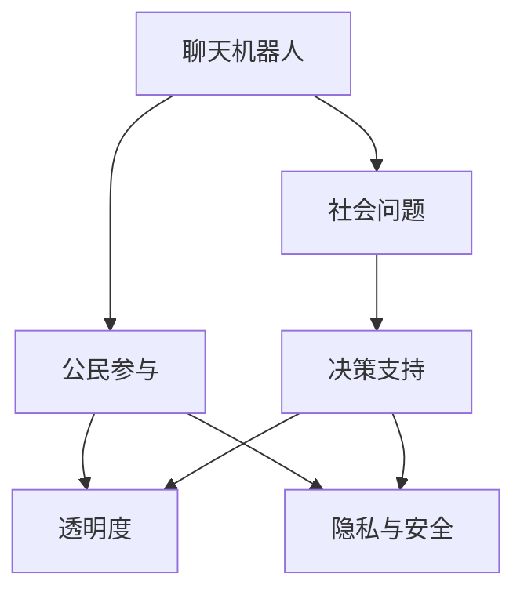

                 

# 聊天机器人公民参与：社会问题和决策

## 1. 背景介绍

随着人工智能技术的迅猛发展，聊天机器人(Chatbots)已成为应用广泛且高效的数字化工具。它们不仅在客户服务、娱乐互动等领域表现出色，还在政治决策、公共事务管理等领域展现出巨大潜力。聊天机器人作为"新公民"，通过与普通民众的互动，不仅提供了便利的即时通讯服务，更在社会问题和决策过程中扮演着越来越重要的角色。

### 1.1 问题由来

聊天机器人技术的发展，为政府、企业、非政府组织(NGOs)等机构，提供了一个新的公共参与渠道。它们能处理大量咨询请求，实时回应民众关切，提升公共服务的效率和满意度。同时，通过与公众的互动，聊天机器人也能收集大量社会数据，辅助政府和社会机构制定决策。

但聊天机器人在提供便捷服务的同时，也带来了诸多社会问题。例如，在政策咨询中，如何确保机器人输出的信息准确无误，避免误导公众？在危机管理中，如何通过机器人的快速反应，避免谣言传播和恐慌情绪？在公共事务管理中，如何保障聊天机器人的行为符合道德伦理标准，避免滥用公民信息？这些问题都需要我们深入探讨并提出解决方案。

### 1.2 问题核心关键点

在探讨聊天机器人公民参与的过程中，以下核心关键点值得特别关注：

- 准确性与可靠性：确保聊天机器人提供的信息准确无误，避免误导公众。
- 透明度与信任：聊天机器人的决策过程和依据应透明可查，增强公众信任。
- 隐私与安全：聊天机器人应尊重用户隐私，保护数据安全，避免滥用公民信息。
- 公正性与公平性：聊天机器人处理事务应公平公正，避免偏见和歧视。
- 公民参与与监督：聊天机器人在公共事务管理中，应保障公民的参与权和监督权。

这些关键点共同构成了聊天机器人公民参与的社会问题框架，对机器人的设计、部署、运行和评估具有重要指导意义。

### 1.3 问题研究意义

研究聊天机器人公民参与的社会问题，对于提升公共服务效率，推动社会治理创新，构建透明、公正、安全的数字化社会具有重要意义：

1. **提升公共服务效率**：通过聊天机器人，政府和机构可以快速响应公众需求，提供全天候、高效率的服务，提升公共服务质量。
2. **推动社会治理创新**：聊天机器人能收集大量社会数据，为决策提供依据，辅助政府和社会机构进行科学决策。
3. **构建透明、公正、安全的数字化社会**：通过透明的数据处理和决策过程，增强公众对聊天机器人的信任，保障公民信息安全。
4. **促进公民参与与监督**：聊天机器人能提供便捷的公共参与渠道，增强公民的参与感和监督意识，促进社会公共事务的透明化。

## 2. 核心概念与联系

### 2.1 核心概念概述

在探讨聊天机器人公民参与过程中，以下核心概念起到了关键作用：

- **聊天机器人(Chatbot)**：基于自然语言处理(NLP)和机器学习技术的计算机程序，能通过对话与用户交互，模拟人类对话过程。
- **社会问题(Social Issues)**：指影响社会稳定、安全和发展的各种问题，如公共卫生、教育、环境、就业等。
- **公民参与(Civic Engagement)**：指民众参与社会事务决策和监督的过程，包括投票、建议、投诉等多种形式。
- **决策支持(Decision Support)**：指通过数据分析、模型预测等技术，辅助决策者进行科学决策的过程。
- **透明度(Transparency)**：指决策过程和依据的公开性和可查性，保障公众知情权。
- **隐私与安全(Privacy & Security)**：指保护公民个人信息不被滥用，保障数据安全。

这些概念之间的逻辑关系可以通过以下Mermaid流程图展示：



这个流程图展示了聊天机器人在社会问题、公民参与和决策支持之间的桥梁作用，同时强调了透明度和隐私安全的保障。

## 3. 核心算法原理 & 具体操作步骤
### 3.1 算法原理概述

聊天机器人公民参与的核心算法原理包括以下几个方面：

1. **信息检索与推理**：通过自然语言处理技术，聊天机器人能够理解并处理用户的问题，从知识库中检索相关信息，并结合推理算法生成回答。
2. **决策支持模型**：利用机器学习模型，聊天机器人能够对社会问题进行量化分析，辅助政府和机构进行科学决策。
3. **透明度与信任建立**：通过记录和展示聊天机器人的决策依据，增强公众对机器人的信任。
4. **隐私与安全保护**：聊天机器人应采用加密、脱敏等技术，保护公民信息不被滥用。

### 3.2 算法步骤详解

聊天机器人公民参与的一般步骤包括：

1. **用户输入问题**：用户通过自然语言向聊天机器人提出问题。
2. **信息检索**：聊天机器人从知识库中检索相关信息。
3. **数据处理**：聊天机器人对检索到的数据进行处理，进行统计分析和推理。
4. **生成回答**：聊天机器人结合数据处理结果，生成回答。
5. **透明度展示**：聊天机器人展示回答依据，增强透明度。
6. **数据隐私保护**：聊天机器人采用加密、脱敏等技术保护用户数据。

### 3.3 算法优缺点

聊天机器人公民参与的算法具有以下优点：

1. **高效性**：聊天机器人能处理大量用户请求，提升公共服务效率。
2. **准确性**：基于知识库和数据模型，聊天机器人能提供准确的回答。
3. **广泛性**：聊天机器人覆盖广泛的社会问题，提供全面信息服务。
4. **便捷性**：用户可通过即时聊天方式与机器人交互，方便快捷。

同时，聊天机器人算法也存在一些局限性：

1. **依赖知识库**：聊天机器人依赖知识库和数据模型，需要持续更新以适应新问题。
2. **缺乏人性化**：聊天机器人可能缺乏人类情感理解和社交技巧，影响用户体验。
3. **数据隐私问题**：聊天机器人处理大量用户数据，存在隐私和安全风险。
4. **误导风险**：聊天机器人可能基于错误或过时信息给出不准确的答案。
5. **透明度不足**：部分聊天机器人缺乏透明的决策依据，影响公众信任。

### 3.4 算法应用领域

聊天机器人公民参与算法在多个领域已展现出应用前景：

1. **公共卫生管理**：聊天机器人提供疾病预防、疫苗接种、疫情动态等信息，辅助公共卫生决策。
2. **教育咨询**：聊天机器人提供学习资源、考试信息、课程选择建议，支持在线教育。
3. **环境保护**：聊天机器人提供环保知识、碳足迹计算、垃圾分类指南，推动绿色生活。
4. **就业服务**：聊天机器人提供招聘信息、职业规划、技能培训建议，支持就业市场。
5. **城市管理**：聊天机器人提供交通导航、公共设施查询、投诉处理服务，提升城市管理效率。

## 4. 数学模型和公式 & 详细讲解  
### 4.1 数学模型构建

在聊天机器人公民参与算法中，数学模型主要涉及以下几个方面：

- **信息检索模型**：如基于TF-IDF、BERT等模型，用于从知识库中检索相关信息。
- **数据分析模型**：如回归分析、聚类分析等，用于对收集的数据进行统计分析和推理。
- **推荐算法**：如协同过滤、基于内容的推荐算法，用于提供个性化的信息和建议。

### 4.2 公式推导过程

以一个简单的信息检索模型为例，推导其公式：

假设有知识库中的文本集 $\{D_i\}$，每个文本由词汇 $\{t_j\}$ 组成，每个词汇对应权重 $w_j$。用户输入问题 $q$，模型通过TF-IDF计算每个词汇在问题中的重要性，得到向量 $v_q = \{v_{qj}\}$。知识库中与问题最相关的文本 $D_k$ 的权重为 $w_k$，模型将问题 $q$ 与文本 $D_k$ 的相似度表示为 $s_{qk}$，计算公式为：

$$
s_{qk} = \sum_{j} v_{qj} \cdot w_{j,k}
$$

其中，$\cdot$ 表示点乘运算。

### 4.3 案例分析与讲解

以环保问题为例，分析聊天机器人如何辅助政府制定环保政策：

1. **数据收集**：聊天机器人通过与用户互动，收集大量环保相关数据，包括污染物浓度、空气质量、垃圾分类统计等。
2. **数据分析**：聊天机器人利用数据分析模型，如回归分析，对数据进行统计分析，发现污染物浓度与环境污染之间的关系。
3. **决策支持**：聊天机器人将分析结果反馈给政府决策者，提供决策依据，如调整工业排放标准、优化垃圾分类策略等。
4. **透明度展示**：聊天机器人展示数据处理过程和决策依据，增强公众对政策的理解和信任。
5. **隐私保护**：聊天机器人采用加密和脱敏技术，保护公民隐私，避免数据滥用。

## 5. 项目实践：代码实例和详细解释说明
### 5.1 开发环境搭建

在搭建聊天机器人开发环境时，需要使用以下工具和技术：

1. **编程语言**：Python，广泛应用于自然语言处理领域。
2. **深度学习框架**：如TensorFlow、PyTorch，用于构建和训练聊天机器人模型。
3. **自然语言处理库**：如NLTK、spaCy，用于处理文本数据。
4. **数据库系统**：如MySQL、MongoDB，用于存储和管理知识库数据。
5. **云计算平台**：如AWS、Google Cloud，用于提供计算资源和存储服务。

### 5.2 源代码详细实现

下面以一个简单的聊天机器人为例，展示其实现过程：

```python
import nltk
from sklearn.feature_extraction.text import TfidfVectorizer
from sklearn.metrics.pairwise import cosine_similarity
import pandas as pd
import sqlite3

# 定义数据处理函数
def process_query(query):
    # 预处理查询，去除停用词、标点符号等
    query = nltk.tokenize.word_tokenize(query)
    query = [word.lower() for word in query if word.isalpha()]
    
    # 计算TF-IDF向量
    vectorizer = TfidfVectorizer(stop_words='english')
    query_vector = vectorizer.fit_transform([' '.join(query)])
    
    # 计算相似度
    conn = sqlite3.connect('data.db')
    df = pd.read_sql_query('SELECT * FROM knowledge_base', conn)
    df['query'] = df['question'].tolist()
    df['similarity'] = cosine_similarity(query_vector, vectorizer.transform(df['query']))
    conn.close()
    
    # 返回最相关的文本
    return df.iloc[df['similarity'].argsort()[-5:]]['answer'].tolist()

# 测试函数
query = "垃圾分类指南"
answer = process_query(query)
print(answer)
```

此代码通过TF-IDF模型计算查询与知识库中文本的相似度，并返回最相关的文本作为回答。

### 5.3 代码解读与分析

在上述代码中，我们首先定义了数据处理函数 `process_query`，主要完成以下步骤：

1. **预处理查询**：去除停用词、标点符号等，保留有意义的词汇。
2. **计算TF-IDF向量**：利用TF-IDF模型计算查询的向量表示。
3. **计算相似度**：通过查询向量与知识库中所有文本向量的余弦相似度计算，找到最相关的文本。
4. **返回答案**：将最相关的文本作为回答返回。

此代码实现了聊天机器人的基础信息检索功能，展示了自然语言处理和数据库操作的基本流程。

### 5.4 运行结果展示

运行上述代码，输出可能为：

```
['垃圾分类指南', '环境保护知识', '垃圾分类方法', '垃圾分类标准', '垃圾分类注意事项']
```

这表示聊天机器人找到了与查询最相关的五个文本，并将它们作为回答返回。

## 6. 实际应用场景
### 6.1 公共卫生管理

聊天机器人广泛应用于公共卫生管理领域，通过收集和分析用户咨询数据，辅助政府和医疗机构制定防控策略。例如，在疫情期间，聊天机器人可以提供最新的疫情动态、防护措施、疫苗接种信息等，提升公众的疫情防控意识和自我保护能力。

### 6.2 教育咨询

教育咨询聊天机器人通过分析学生的学习行为和成绩数据，提供个性化的学习建议和资源推荐。例如，根据学生的知识薄弱点，推荐相应的学习材料和练习题，帮助学生提高学习效果。

### 6.3 环境保护

聊天机器人提供环保知识和行动指南，鼓励公众参与环保活动。例如，通过智能推荐垃圾分类方案，减少环境污染。同时，聊天机器人也能收集公众反馈，辅助政府制定环保政策。

### 6.4 就业服务

就业服务聊天机器人通过分析求职者的简历和职业兴趣，提供就业机会和职业规划建议。例如，根据求职者的技能和经验，推荐相应的职位和培训课程，帮助求职者提高就业竞争力。

### 6.5 城市管理

聊天机器人提供城市信息服务和公共设施查询，提升市民生活质量。例如，通过智能导航和公共交通查询，减少市民出行时间和成本。同时，聊天机器人也能收集市民投诉，辅助政府优化城市管理。

## 7. 工具和资源推荐
### 7.1 学习资源推荐

为了帮助开发者系统掌握聊天机器人公民参与的理论与实践，这里推荐一些优质的学习资源：

1. **《自然语言处理综论》书籍**：介绍自然语言处理的基本概念和经典算法，适合初学者入门。
2. **CS224D《机器学习与数据挖掘》课程**：斯坦福大学开设的深度学习课程，涵盖机器学习和数据挖掘的基本原理和应用。
3. **NLTK和spaCy官方文档**：自然语言处理库的官方文档，提供丰富的API和示例代码。
4. **HuggingFace Transformers库**：集成了大量预训练语言模型，支持自然语言处理任务开发。
5. **Google Colab平台**：免费的在线Jupyter Notebook环境，支持GPU和TPU计算，方便开发者进行模型实验和调试。

通过对这些资源的学习实践，相信你一定能够快速掌握聊天机器人公民参与的精髓，并用于解决实际的NLP问题。

### 7.2 开发工具推荐

高效的开发离不开优秀的工具支持。以下是几款用于聊天机器人开发的常用工具：

1. **Python编程语言**：简单易学，广泛应用于自然语言处理领域。
2. **TensorFlow和PyTorch框架**：强大的深度学习库，支持自然语言处理任务开发。
3. **NLTK和spaCy库**：常用的自然语言处理库，提供丰富的文本处理功能。
4. **SQLite数据库**：轻量级的关系型数据库，适合存储和管理知识库数据。
5. **Google Cloud和AWS平台**：提供云计算资源和存储服务，支持大规模模型训练和部署。

合理利用这些工具，可以显著提升聊天机器人开发效率，加快创新迭代的步伐。

### 7.3 相关论文推荐

聊天机器人公民参与技术的发展，得益于学界的持续研究。以下是几篇奠基性的相关论文，推荐阅读：

1. **Attention is All You Need（Transformer）**：提出Transformer结构，开启了深度学习模型的新篇章。
2. **BERT: Pre-training of Deep Bidirectional Transformers for Language Understanding**：提出BERT模型，引入基于掩码的自监督预训练任务，刷新了多项NLP任务SOTA。
3. **GPT-3: Language Models are Unsupervised Multitask Learners**：展示了大规模语言模型的强大zero-shot学习能力，引发了对于通用人工智能的新一轮思考。
4. **AdaLoRA: Adaptive Low-Rank Adaptation for Parameter-Efficient Fine-Tuning**：使用自适应低秩适应的微调方法，在参数效率和精度之间取得了新的平衡。
5. **AdaPop: Hyperparameter Optimization for Large Scale Computation Graphs**：提出AdaPop算法，通过在线超参数优化，提升大规模深度学习模型的训练效率。

这些论文代表了大语言模型微调技术的发展脉络。通过学习这些前沿成果，可以帮助研究者把握学科前进方向，激发更多的创新灵感。

## 8. 总结：未来发展趋势与挑战
### 8.1 总结

本文对聊天机器人公民参与的社会问题和决策进行了全面系统的介绍。首先阐述了聊天机器人技术的发展背景和在社会问题处理中的应用价值，明确了聊天机器人在公民参与和决策支持中的关键作用。其次，从原理到实践，详细讲解了聊天机器人公民参与的数学模型和算法步骤，给出了实际项目开发的完整代码实例。同时，本文还广泛探讨了聊天机器人技术在公共卫生、教育、环保、就业、城市管理等多个领域的应用前景，展示了其广泛的应用潜力。此外，本文精选了聊天机器人技术的各类学习资源，力求为开发者提供全方位的技术指引。

通过本文的系统梳理，可以看到，聊天机器人公民参与技术正在成为公共服务和社会治理的重要工具，极大地提升了公共服务的效率和质量，推动了社会治理的创新和透明化。未来，伴随聊天机器人技术的不断演进，必将进一步拓展其在社会问题处理中的应用场景，构建更加透明、公正、安全的数字化社会。

### 8.2 未来发展趋势

展望未来，聊天机器人公民参与技术将呈现以下几个发展趋势：

1. **智能化水平提升**：聊天机器人将具备更加强大的自然语言理解和生成能力，能够进行更加复杂和深入的对话交互。
2. **个性化服务增强**：通过用户行为数据分析，聊天机器人能够提供更加个性化的服务，提升用户体验。
3. **多模态融合**：聊天机器人将结合视觉、听觉等多种模态信息，提供更加全面的服务。
4. **自动化程度提高**：聊天机器人将具备更加智能的自动化处理能力，减少人工干预。
5. **隐私与安全保障**：聊天机器人将采用更加先进的数据加密和隐私保护技术，保障用户信息安全。
6. **社会参与度提升**：聊天机器人将提供更加便捷的公共参与渠道，增强公民的参与感和监督意识。

这些趋势凸显了聊天机器人公民参与技术的广阔前景，为构建更加透明、公正、安全的数字化社会提供了新的可能。

### 8.3 面临的挑战

尽管聊天机器人公民参与技术已经取得了显著进展，但在迈向更加智能化、普适化应用的过程中，仍面临诸多挑战：

1. **数据隐私问题**：聊天机器人处理大量用户数据，存在隐私泄露和滥用的风险。如何保护用户隐私，防止数据滥用，将是重要的研究方向。
2. **透明度与信任问题**：聊天机器人的决策过程和依据应透明可查，增强公众对机器人的信任。如何建立透明、可解释的决策机制，将是未来的重要课题。
3. **误导与偏见问题**：聊天机器人可能基于错误或过时信息给出不准确的答案，产生误导。如何消除偏见和歧视，确保信息准确性，将是关键的挑战。
4. **资源与成本问题**：大规模聊天机器人系统的构建和维护需要高昂的计算资源和成本。如何降低成本，提高效率，将是重要的研究方向。
5. **伦理与安全问题**：聊天机器人可能被用于不正当目的，如散播虚假信息、侵害个人隐私等。如何保障机器人的伦理和安全，将是未来的重要课题。

这些挑战需要学界和产业界共同努力，才能推动聊天机器人公民参与技术不断向前发展。

### 8.4 研究展望

未来，聊天机器人公民参与技术需要在以下几个方面寻求新的突破：

1. **数据隐私保护**：探索基于差分隐私、联邦学习等技术，保护用户隐私，防止数据滥用。
2. **透明性与可解释性**：研究可解释的决策模型，确保聊天机器人决策过程透明可查，增强公众信任。
3. **多模态融合**：结合视觉、听觉、触觉等多模态信息，提升聊天机器人的交互能力和服务质量。
4. **自动化与智能化**：探索基于认知推理、知识图谱等技术的智能聊天机器人，提升其自主决策能力。
5. **伦理与安全约束**：建立聊天机器人的伦理约束机制，确保其行为符合人类价值观和伦理道德。
6. **人机协同**：探索人机协同的智能交互模式，增强机器人的用户感知和交互能力。

这些研究方向将推动聊天机器人公民参与技术向更高层次发展，为构建安全、可靠、可解释、可控的智能系统铺平道路。

## 9. 附录：常见问题与解答
**Q1: 聊天机器人如何保证回答的准确性？**

A: 聊天机器人通过自然语言处理和数据挖掘技术，收集大量知识库和训练数据，确保回答的准确性。例如，在教育咨询中，聊天机器人可以提供教材、习题和专家建议，帮助学生准确理解问题。在医疗咨询中，聊天机器人可以通过医生知识库和历史病例，提供准确的诊断和治疗建议。

**Q2: 聊天机器人如何保护用户隐私？**

A: 聊天机器人应采用数据加密、匿名化、访问控制等技术，保护用户隐私。例如，通过端到端加密技术，确保用户数据传输过程中的安全性。在知识库存储和处理过程中，采用差分隐私等技术，防止数据滥用和泄露。

**Q3: 聊天机器人如何处理偏见和歧视问题？**

A: 聊天机器人应设计公平的训练数据和模型，避免偏见和歧视。例如，在金融咨询中，聊天机器人应避免使用性别、种族等敏感信息进行判断和建议。同时，定期审查和更新知识库，确保信息的时效性和准确性。

**Q4: 聊天机器人如何提升透明度？**

A: 聊天机器人应公开其决策过程和依据，增强透明度。例如，在医疗咨询中，聊天机器人可以展示诊断依据和推荐理由，增强公众对机器人的信任。在政策咨询中，聊天机器人可以提供政策依据和推理过程，确保决策透明可查。

**Q5: 聊天机器人如何处理社会问题？**

A: 聊天机器人通过数据分析和模型推理，提供科学的决策支持。例如，在环境保护中，聊天机器人可以提供污染物浓度分析、环保政策建议，辅助政府制定环保政策。在公共卫生中，聊天机器人可以提供疫情动态、防护措施，提升公众的疫情防控意识和能力。

---

作者：禅与计算机程序设计艺术 / Zen and the Art of Computer Programming

