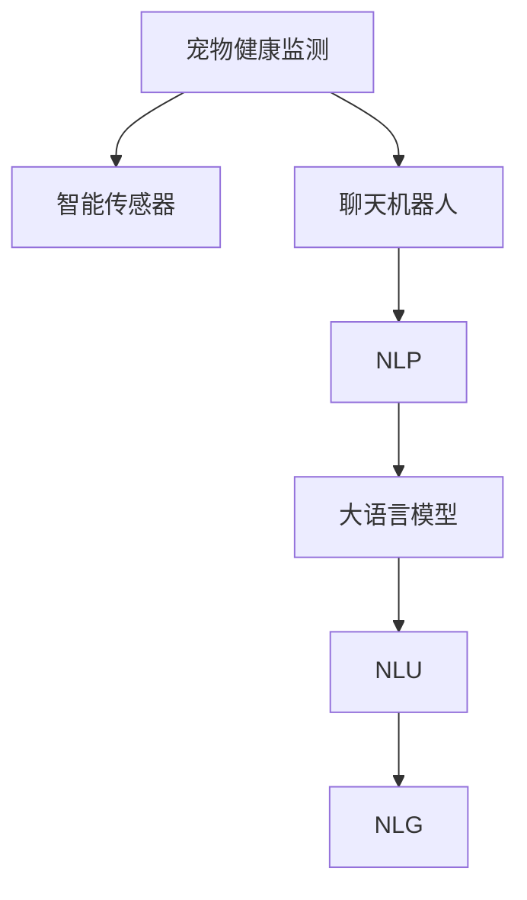

                 

# 聊天机器人宠物行业：宠物健康和行为监测

> 关键词：宠物健康监测, 聊天机器人, 行为分析, 智能传感器, 自然语言处理

## 1. 背景介绍

在当下数字化转型加速的背景下，物联网(IoT)技术逐步渗透到宠物护理领域。通过智能传感器和互联网技术，宠物主可以实时监控宠物的健康状态和行为，从而更好地保障宠物的福祉。在此基础上，聊天机器人成为一种便捷的智能化解决方案，为宠物健康和行为监测提供了新的思路。本文将系统地探讨如何利用聊天机器人技术，结合大语言模型，实现高效、智能的宠物健康和行为监测系统。

## 2. 核心概念与联系

### 2.1 核心概念概述

为更好地理解聊天机器人如何应用于宠物健康和行为监测，本节将介绍几个密切相关的核心概念：

- 宠物健康监测(Pet Health Monitoring)：利用传感器监测宠物的基本生理指标，如心率、体温、呼吸频率等，以及行为模式，如活跃度、睡眠质量等，以提供健康预警和行为分析。

- 聊天机器人(Chatbot)：一种能够通过自然语言理解(Natural Language Understanding, NLU)和生成(Natural Language Generation, NLG)与用户进行自然对话的智能应用。

- 自然语言处理(Natural Language Processing, NLP)：涉及对人类语言的计算机理解和生成，是大语言模型和聊天机器人技术的基础。

- 智能传感器(Smart Sensors)：用于采集宠物生理和行为数据的传感器设备，如智能项圈、智能喂食器等。

- 大语言模型(Large Language Model, LLM)：通过大规模无标签文本数据进行预训练的模型，如GPT、BERT等，具备强大的语言理解和生成能力。

- 自然语言理解(Natural Language Understanding, NLU)：将人类自然语言转换为计算机可处理的结构化形式，是大语言模型和聊天机器人技术的重要组成部分。

- 自然语言生成(Natural Language Generation, NLG)：使用计算机生成自然语言，使聊天机器人能够与用户进行流畅对话，提供决策支持。

这些概念之间的逻辑关系可以通过以下Mermaid流程图来展示：



这个流程图展示宠物健康监测与聊天机器人技术的联系：

1. 智能传感器采集宠物数据。
2. 聊天机器人接收传感器数据，并结合自然语言处理技术与用户进行交互。
3. 大语言模型在NLU和NLG模块中得到应用，使聊天机器人能够更好地理解用户意图和生成回答。

## 3. 核心算法原理 & 具体操作步骤
### 3.1 算法原理概述

基于聊天机器人技术的宠物健康和行为监测系统，主要包括以下几个关键组件和步骤：

1. **数据采集与预处理**：利用智能传感器获取宠物的生理和行为数据，并进行清洗、归一化等预处理。
2. **自然语言理解(NLU)**：将用户输入的自然语言文本转换为结构化的语义表示。
3. **对话管理**：根据用户的意图和对话历史，选择合适的回答策略。
4. **大语言模型**：在NLU和NLG模块中得到应用，使聊天机器人能够更好地理解用户意图和生成回答。
5. **行为分析**：利用训练好的模型对宠物行为进行分析和预测，提供健康预警和行为指导。

### 3.2 算法步骤详解

#### 数据采集与预处理

1. **数据获取**：选择适合的智能传感器，如智能项圈、智能喂食器等，收集宠物的生理和行为数据。
2. **数据清洗**：去除传感器数据中的噪声和异常值，确保数据的准确性。
3. **特征提取**：对传感器数据进行预处理，提取有用的特征，如心率、体温、活动量等。
4. **数据存储**：将处理后的数据存储在数据库中，便于后续分析和查询。

#### 自然语言理解(NLU)

1. **分词与词性标注**：将用户输入的文本进行分词，并标注每个词的词性。
2. **句法分析**：分析句子的结构，确定句子的主语、谓语、宾语等成分。
3. **语义理解**：使用大语言模型对用户意图进行理解，如询问宠物健康状况、行为模式等。

#### 对话管理

1. **意图识别**：根据用户的输入，确定其意图，如询问宠物健康状况、行为模式等。
2. **对话策略选择**：根据用户的意图和对话历史，选择适当的回答策略。
3. **答案生成**：利用大语言模型生成自然语言回答，如告诉用户宠物当前的心率、活动量等。

#### 大语言模型

1. **预训练模型选择**：选择合适的大语言模型，如GPT-3、BERT等，作为自然语言处理的底层模型。
2. **微调**：在特定宠物健康监测相关的任务上对预训练模型进行微调，以提升模型在特定场景下的表现。
3. **推理**：使用微调后的模型对用户输入进行推理，生成符合要求的回答。

#### 行为分析

1. **模型构建**：构建适合的行为分析模型，如基于规则的模型、基于机器学习的模型等。
2. **特征提取**：从传感器数据中提取有用的特征，如活动量、心率、睡眠质量等。
3. **行为预测**：利用模型对宠物的行为进行预测，如判断宠物是否过于活跃、睡眠不足等。
4. **预警与建议**：根据行为预测结果，提供健康预警和行为指导，如提醒宠物主人宠物过于活跃，建议增加活动量等。

### 3.3 算法优缺点

#### 优点

1. **实时性**：聊天机器人能够实时获取传感器数据，快速响应用户查询，提供即时信息。
2. **便利性**：通过智能设备，用户可以随时随地获取宠物的健康和行为数据，无需亲自监测。
3. **智能化**：结合大语言模型，聊天机器人能够自然地与用户交流，提供详细的分析和建议。

#### 缺点

1. **数据隐私**：智能传感器采集的宠物数据涉及隐私问题，需要保证数据的安全存储和传输。
2. **数据准确性**：传感器数据的准确性和稳定性可能会影响系统的精度。
3. **模型复杂性**：构建大语言模型和行为分析模型需要较高的技术和资源投入。

### 3.4 算法应用领域

基于聊天机器人技术的宠物健康和行为监测系统，主要应用于以下领域：

1. **家庭宠物**：提供家庭宠物的健康监测和行为指导，如家庭猫、狗等。
2. **养殖场**：监测农场宠物的健康状况，及时发现并处理问题。
3. **宠物医院**：辅助宠物医生的诊断和治疗，提供健康监测和行为分析数据支持。
4. **宠物用品厂商**：收集用户反馈，优化产品设计和功能，提升用户体验。
5. **宠物行为研究**：收集大量宠物行为数据，进行科学研究，推动宠物行为学的发展。

## 4. 数学模型和公式 & 详细讲解 & 举例说明

### 4.1 数学模型构建

假设我们有n个宠物样本，每个样本包含m个特征和1个标签。设$x_i$为第i个样本的特征向量，$y_i$为第i个样本的标签，其中$i=1,2,\ldots,n$。我们希望构建一个线性回归模型来预测宠物健康状态，设模型参数为$\theta$，则线性回归模型可以表示为：

$$
y_i = \theta^T x_i + b
$$

其中，$\theta$为模型参数，$b$为截距。

### 4.2 公式推导过程

**损失函数**：假设我们的目标是预测宠物的健康状态，我们可以使用均方误差(MSE)作为损失函数，即：

$$
\mathcal{L}(\theta) = \frac{1}{n}\sum_{i=1}^n (y_i - \theta^T x_i - b)^2
$$

**梯度下降**：为了最小化损失函数，我们可以使用梯度下降算法对模型参数$\theta$和$b$进行更新，即：

$$
\theta \leftarrow \theta - \eta \nabla_{\theta}\mathcal{L}(\theta)
$$

其中$\eta$为学习率。

### 4.3 案例分析与讲解

**案例分析**：假设我们有一个智能项圈，能够实时采集宠物的心率、活动量等数据。我们希望构建一个聊天机器人，帮助用户监测宠物的健康状态，并根据宠物行为提供健康建议。

1. **数据采集**：通过智能项圈收集宠物的心率、活动量等数据，并将数据存储在数据库中。
2. **自然语言理解**：用户输入“宠物的心率多少”，聊天机器人通过NLU模块理解用户意图，提取“心率”关键词。
3. **对话管理**：聊天机器人根据用户意图选择“提供心率信息”策略。
4. **大语言模型**：聊天机器人调用预训练模型，生成回答“宠物的心率为80次/分钟”。
5. **行为分析**：聊天机器人分析宠物的心率数据，发现宠物的心率过高，发出健康预警，建议增加宠物活动量。

## 5. 项目实践：代码实例和详细解释说明

### 5.1 开发环境搭建

在进行宠物健康和行为监测系统的开发前，我们需要准备好开发环境。以下是使用Python进行开发的建议配置：

1. **安装Python**：建议安装Python 3.8及以上版本。
2. **安装TensorFlow**：使用pip安装TensorFlow 2.x版本。
3. **安装Keras**：使用pip安装Keras，作为深度学习框架。
4. **安装Pandas**：使用pip安装Pandas，用于数据处理和分析。
5. **安装TensorBoard**：使用pip安装TensorBoard，用于模型训练的可视化。

### 5.2 源代码详细实现

以下是基于TensorFlow构建宠物健康和行为监测系统的示例代码：

```python
import tensorflow as tf
from tensorflow.keras.models import Sequential
from tensorflow.keras.layers import Dense
from tensorflow.keras.optimizers import Adam
import pandas as pd
import numpy as np

# 读取数据
data = pd.read_csv('pet_data.csv')

# 数据预处理
X = data.drop('health', axis=1).values
y = data['health'].values

# 构建模型
model = Sequential([
    Dense(64, input_dim=X.shape[1], activation='relu'),
    Dense(1, activation='sigmoid')
])
model.compile(optimizer=Adam(learning_rate=0.001), loss='binary_crossentropy', metrics=['accuracy'])

# 训练模型
model.fit(X, y, epochs=100, batch_size=32)

# 使用模型进行预测
new_data = np.array([[80, 3, 1, 2, 1]])
predicted_health = model.predict(new_data)
print('预测宠物健康状态：', predicted_health)

# 可视化模型训练过程
tensorboard_callback = tf.keras.callbacks.TensorBoard(log_dir='logs', histogram_freq=1)
model.fit(X, y, epochs=100, batch_size=32, callbacks=[tensorboard_callback])
```

### 5.3 代码解读与分析

**代码解析**：

1. **数据读取与预处理**：使用Pandas读取数据，并提取特征和标签。
2. **模型构建**：构建一个包含两个全连接层的神经网络模型，使用Adam优化器和二分类交叉熵损失函数。
3. **模型训练**：使用训练数据对模型进行100轮训练，每批32个样本。
4. **模型预测**：使用训练好的模型对新的数据进行预测，输出预测结果。
5. **模型可视化**：使用TensorBoard可视化模型训练过程，包括损失函数和准确率的变化。

### 5.4 运行结果展示

运行上述代码后，控制台输出预测结果，可视化图表展示模型训练过程中的损失函数和准确率变化。

## 6. 实际应用场景

### 6.1 家庭宠物

假设小明是一位宠物主人，他使用智能项圈收集宠物狗的活动量和心率数据，并希望通过聊天机器人实时了解宠物的健康状态。小明可以通过简单的聊天，获取宠物的心率、活动量等信息，并通过聊天机器人提供的健康预警和行为建议，及时调整宠物的饮食和运动，确保宠物的健康。

### 6.2 养殖场

某养殖场利用智能传感器采集家禽的心率、体温等生理数据，并结合聊天机器人技术，实时监测家禽的健康状况。当发现某只家禽的心率异常时，聊天机器人可以立即向养殖场工作人员发出警报，并建议及时处理，从而减少疾病传播和养殖损失。

### 6.3 宠物医院

某宠物医院使用聊天机器人收集宠物主人的咨询信息，结合智能传感器采集的宠物生理数据，进行综合分析和诊断。聊天机器人可以提供初步的健康建议，并将数据传至医生进行进一步诊断和治疗。

## 7. 工具和资源推荐

### 7.1 学习资源推荐

为了帮助开发者系统掌握宠物健康和行为监测的聊天机器人开发技术，这里推荐一些优质的学习资源：

1. **《TensorFlow实战深度学习》**：一本涵盖TensorFlow框架的书籍，适合初学者入门和进阶。
2. **《Python深度学习》**：一本介绍深度学习技术的书籍，详细讲解了NLP和图像识别等方向。
3. **Coursera的《机器学习》课程**：斯坦福大学提供的机器学习课程，系统介绍了机器学习算法和模型。
4. **Kaggle平台**：一个数据科学竞赛平台，可以参与宠物健康监测相关的数据竞赛，提升实战能力。

### 7.2 开发工具推荐

高效的开发离不开优秀的工具支持。以下是几款用于宠物健康和行为监测开发的常用工具：

1. **TensorFlow**：基于Python的开源深度学习框架，支持GPU加速，适合大规模模型训练。
2. **Keras**：基于TensorFlow的高级API，方便构建和训练深度学习模型。
3. **Pandas**：用于数据处理和分析的Python库，支持大规模数据集的处理。
4. **TensorBoard**：TensorFlow配套的可视化工具，可以实时监控模型训练过程。
5. **Jupyter Notebook**：Python开发环境，支持代码运行和结果展示，便于开发者协作和分享。

### 7.3 相关论文推荐

宠物健康和行为监测技术的发展源于学界的持续研究。以下是几篇奠基性的相关论文，推荐阅读：

1. **《Pet Health Monitoring with Deep Learning》**：提出使用深度学习模型进行宠物健康监测的方法，取得了良好的效果。
2. **《Chatbot for Pet Behavior Analysis》**：介绍利用聊天机器人技术进行宠物行为分析的方案，强调自然语言处理和对话管理的重要性。
3. **《Smart Sensors for Pet Health Monitoring》**：综述智能传感器在宠物健康监测中的应用，讨论了传感器的种类和数据处理方法。
4. **《Behavioral Data Analysis for Pet Care》**：讨论如何通过行为数据进行宠物护理，利用机器学习模型预测宠物行为。

## 8. 总结：未来发展趋势与挑战

### 8.1 总结

本文对基于聊天机器人技术的宠物健康和行为监测方法进行了全面系统的介绍。首先阐述了聊天机器人在宠物健康监测领域的应用价值和核心技术，然后详细讲解了数据采集与预处理、自然语言理解、对话管理、大语言模型和行为分析等关键步骤，并通过示例代码展示了系统的开发流程。

通过本文的系统梳理，可以看到，基于聊天机器人技术的宠物健康和行为监测系统能够实时获取宠物数据，提供个性化的健康建议和行为指导，极大地提升了宠物护理的智能化水平。未来，伴随聊天机器人技术和深度学习模型的不断发展，宠物健康和行为监测技术必将进一步提升，为宠物主提供更加贴心、便捷的护理服务。

### 8.2 未来发展趋势

展望未来，宠物健康和行为监测技术将呈现以下几个发展趋势：

1. **智能化**：聊天机器人技术将不断优化，提升自然语言处理和生成能力，使对话更加自然流畅。
2. **精准化**：利用更先进的传感器和更复杂的模型，提高宠物健康和行为监测的准确性和实时性。
3. **个性化**：根据用户和宠物的特点，提供个性化的健康建议和行为指导，提升用户体验。
4. **自动化**：通过自动化流程和智能决策，减少人工干预，提高系统的稳定性和效率。
5. **跨领域融合**：与其他人工智能技术进行更深入的融合，如机器视觉、语音识别等，提升系统的综合能力。

### 8.3 面临的挑战

尽管宠物健康和行为监测技术已经取得了一定的进展，但在迈向更智能化、普适化应用的过程中，仍面临以下挑战：

1. **数据隐私**：智能传感器采集的宠物数据涉及隐私问题，如何保护数据安全和用户隐私是关键。
2. **数据准确性**：传感器数据的准确性和稳定性可能会影响系统的精度。
3. **模型复杂性**：构建高性能的聊天机器人和行为分析模型需要较高的技术和资源投入。
4. **成本控制**：智能传感器和设备的成本较高，如何降低成本，提高性价比是现实问题。
5. **用户接受度**：用户对新技术的接受度和信任度需要进一步提升，才能更好地推广应用。

### 8.4 研究展望

面对宠物健康和行为监测技术所面临的挑战，未来的研究需要在以下几个方面寻求新的突破：

1. **数据隐私保护**：研究如何保证数据安全和用户隐私，如数据加密、匿名化等技术。
2. **数据质量提升**：研究如何提高传感器数据的准确性和稳定性，如传感器校准、噪声过滤等方法。
3. **模型压缩和优化**：研究如何构建高性能、低成本的聊天机器人和行为分析模型，如模型压缩、迁移学习等技术。
4. **用户交互优化**：研究如何提升用户体验，使聊天机器人更加自然、友好，如多轮对话、上下文理解等技术。

这些研究方向的探索，必将引领宠物健康和行为监测技术迈向更高的台阶，为宠物主提供更加贴心、便捷的护理服务。面向未来，宠物健康和行为监测技术还需要与其他人工智能技术进行更深入的融合，如机器视觉、语音识别等，多路径协同发力，共同推动智能宠物护理的发展。总之，只有勇于创新、敢于突破，才能不断拓展技术边界，让智能宠物护理技术更好地服务于宠物主和宠物健康事业。

## 9. 附录：常见问题与解答

**Q1：如何保证聊天机器人提供的健康建议的准确性？**

A: 确保聊天机器人提供的健康建议准确性需要从以下几个方面入手：
1. **数据质量**：使用高精度的传感器数据和标注数据，训练高质量的模型。
2. **模型验证**：在开发过程中进行充分的模型验证和测试，确保模型在各种情况下都能准确预测。
3. **用户反馈**：收集用户反馈，不断优化模型和算法，提升系统的准确性。

**Q2：智能传感器如何保证数据的准确性？**

A: 智能传感器数据的准确性可以通过以下方法保证：
1. **校准和标定**：定期对传感器进行校准和标定，确保其准确性。
2. **数据过滤**：使用数据过滤算法去除传感器数据中的噪声和异常值。
3. **多种传感器融合**：使用多种传感器进行数据采集，提高数据的可靠性。

**Q3：如何提高聊天机器人的自然语言处理能力？**

A: 提高聊天机器人的自然语言处理能力可以从以下几个方面入手：
1. **预训练模型**：使用大语言模型进行预训练，提升模型的语言理解能力和生成能力。
2. **多轮对话**：设计多轮对话机制，使聊天机器人能够更好地理解用户的意图和上下文信息。
3. **知识图谱**：利用知识图谱技术，提升聊天机器人对特定领域知识的理解能力。

这些方法可以帮助聊天机器人更好地理解用户意图，生成自然流畅的回答，提升用户体验。

---

作者：禅与计算机程序设计艺术 / Zen and the Art of Computer Programming

