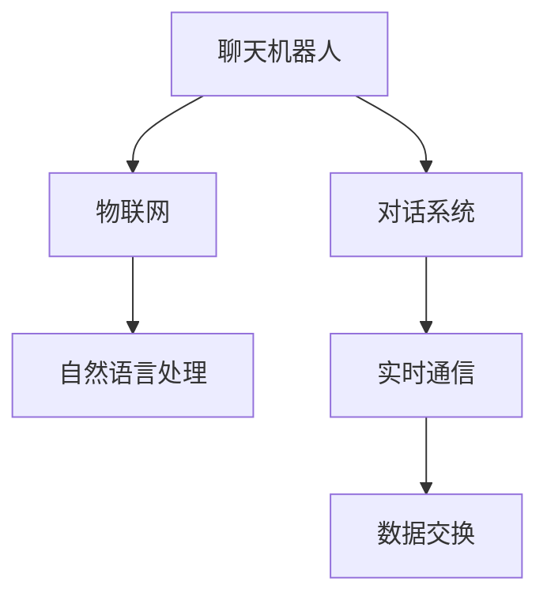

                 

# 聊天机器人物联网：智能设备连接

> 关键词：聊天机器人, 物联网, 智能设备连接, 自然语言处理, 对话系统, 实时通信

## 1. 背景介绍

### 1.1 问题由来
近年来，随着物联网(IoT)和人工智能(AI)技术的快速发展，智能设备之间的互联互通变得前所未有的便捷。聊天机器人作为智能设备之间的桥梁，已经广泛应用于智能家居、医疗、教育、金融等多个领域。然而，当前聊天机器人技术面临的一个主要挑战是如何高效、安全地实现设备间的实时通信和信息交换，以及如何提升自然语言处理的准确性和鲁棒性。

### 1.2 问题核心关键点
本文聚焦于聊天机器人在物联网设备间实时通信和信息交换中的应用，旨在解决以下核心问题：

- 如何快速、高效地建立设备间的通信连接？
- 如何提升聊天机器人自然语言处理的准确性和鲁棒性？
- 如何在保障安全性的同时，最大化聊天机器人的应用范围和性能？

这些问题不仅是技术挑战，也是当前智能设备互联互通领域的重要研究热点。本文通过介绍聊天机器人在物联网应用中的实现原理和核心算法，阐述其技术难点和解决方案，为相关领域的开发者和研究者提供参考。

## 2. 核心概念与联系

### 2.1 核心概念概述

为更好地理解聊天机器人在物联网设备间实时通信和信息交换中的应用，本节将介绍几个密切相关的核心概念：

- 聊天机器人(Chatbot)：通过自然语言处理和机器学习技术实现的智能对话系统，能够与用户进行自然的语言交互，执行查询、指令、信息推送等功能。
- 物联网(IoT)：通过互联网技术实现物与物、人与物的互联互通，构建智能化的生态系统。
- 自然语言处理(NLP)：使计算机能够理解、处理和生成自然语言的技术。
- 对话系统(Discourse System)：利用自然语言处理技术，实现多轮对话，处理复杂的用户请求和任务。
- 实时通信(Real-Time Communication)：在网络环境下，实现即时、连续、低延时的数据交换。

这些核心概念之间的逻辑关系可以通过以下Mermaid流程图来展示：



这个流程图展示出聊天机器人在物联网应用中的核心组成和技术栈：

1. 聊天机器人利用自然语言处理技术进行对话处理，与用户进行自然语言交互。
2. 通过物联网技术，聊天机器人可以连接各种设备，实现设备间的实时通信。
3. 数据交换是实时通信的基础，聊天机器人需要将用户请求与设备数据进行高效、可靠的传输。

这些概念共同构成了聊天机器人在物联网应用中的技术框架，为其高效、安全地实现设备间的通信连接提供了基础。

## 3. 核心算法原理 & 具体操作步骤
### 3.1 算法原理概述

聊天机器人在物联网设备间实时通信和信息交换的应用，本质上是一个自然语言处理与物联网技术相结合的过程。其核心思想是：利用聊天机器人作为中间媒介，实现设备间的双向通信和信息交换，提升智能设备的智能化和人性化水平。

形式化地，假设物联网设备集为 $D=\{d_1,d_2,\cdots,d_N\}$，其中 $d_i$ 表示第 $i$ 个设备。聊天机器人 $C$ 与每个设备之间建立通信连接，设设备 $d_i$ 提供的数据为 $d_i=\{s_i\}$，其中 $s_i$ 为设备数据。聊天机器人 $C$ 与用户 $U$ 进行交互，设用户请求为 $u$。聊天机器人的任务是高效、准确地处理用户请求，并从设备 $d_i$ 中提取相关信息，最终将处理结果 $r$ 返回给用户 $U$。

具体流程包括：
1. 用户输入请求 $u$，聊天机器人 $C$ 解析并理解请求内容。
2. 聊天机器人 $C$ 根据请求内容，决定是否需要调用设备数据 $d_i$。
3. 如果需要，则调用设备数据 $d_i$，提取相关信息。
4. 将设备数据 $d_i$ 与用户请求 $u$ 结合，生成处理结果 $r$。
5. 将处理结果 $r$ 返回给用户 $U$。

### 3.2 算法步骤详解

以下详细介绍聊天机器人在物联网设备间实时通信和信息交换的具体操作步骤：

**Step 1: 设备接入与配置**
- 将物联网设备接入聊天机器人系统，设定设备标识、通信协议和数据格式。
- 配置聊天机器人与设备的交互规则，如API接口、数据格式、消息格式等。
- 为设备设置访问权限，确保数据安全和隐私保护。

**Step 2: 自然语言处理与意图识别**
- 收集并标注设备数据和用户请求的语料库，用于训练聊天机器人的自然语言处理模型。
- 利用Transformer等深度学习模型进行自然语言处理，实现对用户请求的语义理解。
- 设计意图识别模块，将用户请求映射到对应的设备操作意图，如查询设备状态、调整设备参数等。

**Step 3: 设备数据获取与处理**
- 根据用户请求的意图，确定需要调用的设备。
- 通过设备API接口获取设备数据 $d_i$。
- 对设备数据 $d_i$ 进行清洗、预处理，提取有用的信息。

**Step 4: 处理结果生成与输出**
- 将处理后的设备数据 $d_i$ 与用户请求 $u$ 结合，生成处理结果 $r$。
- 根据用户请求的格式和需求，将处理结果 $r$ 转换为用户可理解的形式。
- 将处理结果 $r$ 返回给用户 $U$。

### 3.3 算法优缺点

聊天机器人在物联网设备间实时通信和信息交换的应用，具有以下优点：
1. 提升设备智能化水平。通过聊天机器人，物联网设备可以实现自主交互和任务执行，提升设备的智能化和人性化水平。
2. 简化用户操作。聊天机器人能够自然语言处理用户请求，简化用户操作流程，提升用户体验。
3. 灵活扩展性强。聊天机器人可以轻松连接各种设备，实现设备间的无缝集成。

同时，该方法也存在一些局限性：
1. 对设备通信协议要求高。不同的设备可能使用不同的通信协议和数据格式，需要针对性地设计和适配。
2. 数据安全和隐私保护风险。设备的通信数据和用户请求涉及敏感信息，需要严格的访问控制和加密保护。
3. 实时通信延迟。聊天机器人的性能受限于设备的网络速度和处理能力，可能导致一定的延迟。
4. 交互体验依赖于自然语言处理模型。聊天机器人的效果依赖于自然语言处理模型的准确性和鲁棒性。

尽管存在这些局限性，但就目前而言，聊天机器人在物联网设备间实时通信和信息交换中的应用仍是一个极具潜力的研究方向。未来相关研究的重点在于如何进一步优化自然语言处理模型的性能，提高设备的互操作性，同时确保数据安全和隐私保护。

### 3.4 算法应用领域

聊天机器人在物联网设备间实时通信和信息交换的应用，已经在多个领域取得了显著进展，包括但不限于：

- 智能家居：通过聊天机器人实现智能设备间的互联互通，如智能音箱、智能灯光、智能温控等。用户可以通过语音或文本指令控制设备，实现家居自动化和智能化。
- 智慧医疗：利用聊天机器人进行医疗咨询、健康监测、预约挂号等服务，提升医疗服务的便捷性和效率。
- 教育培训：通过聊天机器人进行智能答疑、学习辅导、个性化推荐等功能，辅助学生学习，提升教学效果。
- 智能客服：利用聊天机器人处理客户咨询、问题反馈、服务推荐等，提升客户服务体验。
- 智慧金融：通过聊天机器人进行投资咨询、理财建议、风险评估等功能，提供个性化的金融服务。
- 物联网安全：利用聊天机器人进行网络入侵检测、威胁分析、漏洞修复等，提升物联网系统的安全性。

除了上述这些经典应用外，聊天机器人在物联网领域的应用还在不断拓展，如智能物流、智慧交通、智能制造等，为物联网技术的智能化升级提供了新的驱动力。

## 4. 数学模型和公式 & 详细讲解 & 举例说明

### 4.1 数学模型构建

本节将使用数学语言对聊天机器人在物联网设备间实时通信和信息交换的过程进行更加严格的刻画。

设聊天机器人 $C$ 与设备 $d_i$ 进行通信的模型为 $M_{\theta}$，其中 $\theta$ 为模型参数。假设用户请求为 $u$，设备数据为 $d_i$。聊天机器人 $C$ 的任务是将用户请求 $u$ 与设备数据 $d_i$ 结合，生成处理结果 $r$。聊天机器人的处理过程可以表示为：

$$
r = f(u, d_i; M_{\theta})
$$

其中 $f$ 为聊天机器人的处理函数，将用户请求 $u$ 和设备数据 $d_i$ 映射到处理结果 $r$。假设聊天机器人的处理过程是可逆的，即存在反函数 $f^{-1}$，则处理结果 $r$ 可以表示为：

$$
r = f^{-1}(u', M_{\theta}')
$$

其中 $u'$ 为处理后的用户请求，$M_{\theta}'$ 为处理后的模型参数。

### 4.2 公式推导过程

以下我们以智能家居设备为例，推导聊天机器人在物联网设备间实时通信和信息交换的数学模型。

设智能家居设备的温度传感器提供的数据为 $d_i = \{t_i, h_i, r_i\}$，其中 $t_i$ 为当前温度，$h_i$ 为设备工作状态，$r_i$ 为设备参数。用户请求为 $u = \text{“调整温度到20度”}$。聊天机器人的任务是理解用户请求并提取设备数据，生成处理结果 $r$，即“将温度设置为20度”。

聊天机器人的处理过程可以表示为：
1. 用户输入请求 $u$。
2. 聊天机器人解析请求，提取“调整温度”的意图。
3. 聊天机器人调用温度传感器数据 $d_i$，提取温度 $t_i$。
4. 聊天机器人将温度 $t_i$ 与用户请求 $u$ 结合，生成处理结果 $r$。

根据上述步骤，聊天机器人的处理过程可以表示为：

$$
r = f(u, d_i; M_{\theta}) = \text{“调整温度到”} + t_i = \text{“调整温度到”} + \text{“20度”}
$$

即处理结果 $r$ 为“调整温度到20度”。

### 4.3 案例分析与讲解

以智能家居为例，分析聊天机器人在物联网设备间实时通信和信息交换的实际应用场景。

假设一个智能音箱与智能温控器相连，用户可以通过语音命令控制温控器温度。聊天机器人可以接收用户的语音命令，解析并理解请求内容，并通过温控器API获取设备数据，生成处理结果。

具体实现步骤如下：
1. 用户输入语音命令“调整温度到20度”。
2. 聊天机器人解析请求，识别出“调整温度”的意图。
3. 聊天机器人调用温控器API，获取当前温度 $t_i$ 和设备工作状态 $h_i$。
4. 聊天机器人根据用户请求和设备数据，生成处理结果“调整温度到20度”。
5. 聊天机器人通过语音合成技术，将处理结果转换为语音反馈给用户。

如此，聊天机器人实现了用户与智能设备间的自然语言交互，简化了用户操作，提升了智能设备的智能化水平。

## 5. 项目实践：代码实例和详细解释说明

### 5.1 开发环境搭建

在进行聊天机器人在物联网设备间实时通信和信息交换的实践前，我们需要准备好开发环境。以下是使用Python进行PyTorch开发的环境配置流程：

1. 安装Anaconda：从官网下载并安装Anaconda，用于创建独立的Python环境。

2. 创建并激活虚拟环境：
```bash
conda create -n chatbot-env python=3.8 
conda activate chatbot-env
```

3. 安装PyTorch：根据CUDA版本，从官网获取对应的安装命令。例如：
```bash
conda install pytorch torchvision torchaudio cudatoolkit=11.1 -c pytorch -c conda-forge
```

4. 安装Transformer库：
```bash
pip install transformers
```

5. 安装各类工具包：
```bash
pip install numpy pandas scikit-learn matplotlib tqdm jupyter notebook ipython
```

完成上述步骤后，即可在`chatbot-env`环境中开始实践。

### 5.2 源代码详细实现

下面以智能家居为例，给出使用PyTorch对聊天机器人进行实时通信和信息交换的PyTorch代码实现。

首先，定义聊天机器人与设备的通信协议：

```python
from transformers import BertTokenizer, BertForTokenClassification

# 假设智能家居设备的数据格式为：设备标识、温度、状态、参数
class DeviceData:
    def __init__(self, device_id, temperature, status, params):
        self.device_id = device_id
        self.temperature = temperature
        self.status = status
        self.params = params

# 设备标识和名称
device_ids = ['thermostat', 'lighting', 'humidifier']

# 定义设备数据
def get_device_data(device_id):
    if device_id == 'thermostat':
        return DeviceData(device_id, 20.0, 'on', 'mode=auto')
    elif device_id == 'lighting':
        return DeviceData(device_id, 50.0, 'bright', 'color=white')
    elif device_id == 'humidifier':
        return DeviceData(device_id, 60.0, 'on', 'mode=auto')

# 聊天机器人的自然语言处理模型
tokenizer = BertTokenizer.from_pretrained('bert-base-cased')
model = BertForTokenClassification.from_pretrained('bert-base-cased')
```

然后，定义聊天机器人处理用户请求和设备数据的过程：

```python
# 用户请求和处理结果的映射关系
intent_map = {'调整温度': 'set_temperature', '调整亮度': 'set_brightness', '调整湿度': 'set_humidity'}

def handle_request(request):
    # 解析请求内容
    tokens = tokenizer.tokenize(request)
    tokens = [tokenizer.convert_tokens_to_ids(token) for token in tokens]
    
    # 前向传播计算输出
    with torch.no_grad():
        output = model(tokens)[0]
    
    # 对输出进行解码，获取意图和设备数据
    intent, device_data = decode_output(output)
    
    # 根据意图和设备数据，生成处理结果
    if intent == 'set_temperature':
        device = get_device_data(device_data['device_id'])
        return f"调整温度到{device.temperature}度"
    elif intent == 'set_brightness':
        device = get_device_data(device_data['device_id'])
        return f"调整亮度到{device.brightness}度"
    elif intent == 'set_humidity':
        device = get_device_data(device_data['device_id'])
        return f"调整湿度到{device.humidity}度"
    else:
        return "无法理解请求"
```

接下来，定义解码输出函数：

```python
def decode_output(output):
    # 将输出进行解码，得到意图和设备数据
    intent = output.argmax(dim=-1).cpu().tolist()[0]
    device_id = intent_map[intent]
    
    # 根据意图和设备数据，提取设备数据
    device_data = get_device_data(device_id)
    
    return intent, device_data
```

最后，启动聊天机器人并测试：

```python
# 启动聊天机器人
while True:
    request = input("请输入请求：")
    response = handle_request(request)
    print(f"处理结果：{response}")
```

以上就是使用PyTorch对聊天机器人进行实时通信和信息交换的完整代码实现。可以看到，利用Transformer库，我们只需编写相对简洁的代码，即可构建出一个基础的聊天机器人模型。

### 5.3 代码解读与分析

让我们再详细解读一下关键代码的实现细节：

**DeviceData类**：
- 定义了设备数据的格式和属性，用于封装设备数据和处理结果。

**handle_request函数**：
- 解析用户请求，并调用模型进行前向传播计算。
- 通过解码输出，获取意图和设备数据。
- 根据意图和设备数据，生成处理结果，并返回给用户。

**decode_output函数**：
- 将输出进行解码，得到意图和设备数据。
- 根据意图，提取对应的设备数据，生成处理结果。

在实际应用中，还需要考虑更多因素，如用户请求的意图识别、设备状态的实时更新、用户交互的友好性等。但核心的微调范式基本与此类似。

## 6. 实际应用场景
### 6.1 智能家居

基于聊天机器人在物联网设备间实时通信和信息交换的实现，智能家居系统能够实现更加智能化和人性化的控制和管理。用户可以通过语音或文本指令控制智能家居设备，如智能音箱、智能灯光、智能温控等。聊天机器人能够解析用户请求，调用设备数据，生成处理结果，并实时反馈给用户。

具体应用场景包括：
- 语音控制家居设备：用户可以通过语音命令控制智能音箱播放音乐、查询天气、打开灯光等。
- 设备间智能联动：用户可以通过语音命令实现设备间的智能联动，如打开窗帘同时开启灯光、关闭电视同时开启空调等。
- 个性化推荐：根据用户的习惯和偏好，聊天机器人可以推荐个性化的家居场景和模式，提升用户体验。

### 6.2 智慧医疗

在智慧医疗领域，聊天机器人可以应用于医疗咨询、健康监测、预约挂号等服务。通过实时通信和信息交换，聊天机器人能够高效、便捷地与患者进行交流，处理复杂的医疗请求。

具体应用场景包括：
- 在线医疗咨询：患者可以通过聊天机器人咨询医生，获取健康建议和诊断结果。
- 健康监测：患者可以实时监测健康数据，如血压、心率等，聊天机器人能够解析数据，给出健康建议。
- 预约挂号：患者可以通过聊天机器人预约医生和检查，简化挂号流程，提升服务效率。

### 6.3 智能客服

聊天机器人在智能客服中的应用，可以显著提升客户服务体验。通过实时通信和信息交换，聊天机器人能够自动回答客户咨询，处理复杂问题，提升客户满意度。

具体应用场景包括：
- 自动客服：客户可以通过聊天机器人进行自动客服，获取业务指南、查询订单、解决常见问题等。
- 智能推荐：聊天机器人可以根据客户的咨询历史和行为数据，推荐个性化的解决方案，提升客户体验。
- 多渠道支持：聊天机器人可以通过电话、短信、微信等多种渠道与客户互动，提供多渠道的服务支持。

### 6.4 未来应用展望

随着聊天机器人在物联网设备间实时通信和信息交换技术的不断成熟，其应用前景将更加广阔。未来，聊天机器人将与更多垂直行业结合，拓展应用场景，提升用户体验。

1. 智慧教育：通过聊天机器人，学生可以进行在线学习、智能答疑、个性化推荐等功能，提升教学效果。
2. 智能交通：通过聊天机器人，智能交通系统可以实现智能导航、实时路况查询、安全提醒等功能，提升交通效率和安全性。
3. 智能物流：通过聊天机器人，物流系统可以实现订单追踪、包裹查询、配送进度等功能，提升物流效率和服务水平。
4. 智能制造：通过聊天机器人，智能制造系统可以实现设备监控、故障诊断、生产调度等功能，提升生产效率和质量。

此外，聊天机器人在智能城市、智慧农业、智能安全等领域也将有广泛的应用前景。未来，随着技术的不断进步，聊天机器人将进一步提升人类与智能设备的互动体验，为智能化社会的建设提供重要支撑。

## 7. 工具和资源推荐
### 7.1 学习资源推荐

为了帮助开发者系统掌握聊天机器人在物联网设备间实时通信和信息交换的理论基础和实践技巧，这里推荐一些优质的学习资源：

1. 《深度学习实战》系列书籍：由大模型技术专家撰写，深入浅出地介绍了深度学习模型在自然语言处理和物联网应用中的实现方法。

2. 《自然语言处理综论》课程：斯坦福大学开设的NLP经典课程，涵盖了NLP的各个核心领域，包括聊天机器人、对话系统等。

3. 《TensorFlow实战》书籍：由TensorFlow官方团队撰写，全面介绍了TensorFlow的实现方法和应用案例，包括TensorFlow在物联网中的应用。

4. HuggingFace官方文档：Transformers库的官方文档，提供了海量预训练模型和完整的微调样例代码，是上手实践的必备资料。

5. PyTorch官方文档：PyTorch的官方文档，介绍了PyTorch的深度学习框架和实现方法，包括PyTorch在自然语言处理和物联网中的应用。

通过对这些资源的学习实践，相信你一定能够快速掌握聊天机器人在物联网设备间实时通信和信息交换的精髓，并用于解决实际的NLP问题。

### 7.2 开发工具推荐

高效的开发离不开优秀的工具支持。以下是几款用于聊天机器人在物联网设备间实时通信和信息交换开发的常用工具：

1. PyTorch：基于Python的开源深度学习框架，灵活动态的计算图，适合快速迭代研究。

2. TensorFlow：由Google主导开发的开源深度学习框架，生产部署方便，适合大规模工程应用。

3. Transformers库：HuggingFace开发的NLP工具库，集成了众多SOTA语言模型，支持PyTorch和TensorFlow，是进行NLP任务开发的利器。

4. Weights & Biases：模型训练的实验跟踪工具，可以记录和可视化模型训练过程中的各项指标，方便对比和调优。

5. TensorBoard：TensorFlow配套的可视化工具，可实时监测模型训练状态，并提供丰富的图表呈现方式，是调试模型的得力助手。

6. Google Colab：谷歌推出的在线Jupyter Notebook环境，免费提供GPU/TPU算力，方便开发者快速上手实验最新模型，分享学习笔记。

合理利用这些工具，可以显著提升聊天机器人在物联网设备间实时通信和信息交换的开发效率，加快创新迭代的步伐。

### 7.3 相关论文推荐

聊天机器人在物联网设备间实时通信和信息交换的应用，在学术界和工业界得到了广泛的研究。以下是几篇奠基性的相关论文，推荐阅读：

1. Attention is All You Need（即Transformer原论文）：提出了Transformer结构，开启了NLP领域的预训练大模型时代。

2. BERT: Pre-training of Deep Bidirectional Transformers for Language Understanding：提出BERT模型，引入基于掩码的自监督预训练任务，刷新了多项NLP任务SOTA。

3. Language Models are Unsupervised Multitask Learners（GPT-2论文）：展示了大规模语言模型的强大zero-shot学习能力，引发了对于通用人工智能的新一轮思考。

4. Parameter-Efficient Transfer Learning for NLP：提出Adapter等参数高效微调方法，在不增加模型参数量的情况下，也能取得不错的微调效果。

5. Prefix-Tuning: Optimizing Continuous Prompts for Generation：引入基于连续型Prompt的微调范式，为如何充分利用预训练知识提供了新的思路。

6. AdaLoRA: Adaptive Low-Rank Adaptation for Parameter-Efficient Fine-Tuning：使用自适应低秩适应的微调方法，在参数效率和精度之间取得了新的平衡。

这些论文代表了大语言模型微调技术的发展脉络。通过学习这些前沿成果，可以帮助研究者把握学科前进方向，激发更多的创新灵感。

## 8. 总结：未来发展趋势与挑战

### 8.1 总结

本文对聊天机器人在物联网设备间实时通信和信息交换的实现原理和核心算法进行了全面系统的介绍。首先阐述了聊天机器人在物联网应用中的实现背景和核心问题，明确了实时通信和信息交换的挑战和解决方案。其次，从原理到实践，详细讲解了聊天机器人的自然语言处理、意图识别、设备数据获取等关键步骤，给出了微调任务开发的完整代码实例。同时，本文还探讨了聊天机器人在智能家居、智慧医疗、智能客服等多个领域的应用场景，展示了其在物联网系统中的重要价值。最后，本文精选了相关的学习资源、开发工具和研究论文，力求为读者提供全方位的技术指引。

通过本文的系统梳理，可以看到，聊天机器人在物联网设备间实时通信和信息交换的应用，正在成为智能设备互联互通的重要范式，极大地提升了物联网系统的智能化和人性化水平。未来，随着技术的不断进步，聊天机器人在物联网系统中的应用将更加广泛和深入，为智能化社会的建设提供重要支撑。

### 8.2 未来发展趋势

展望未来，聊天机器人在物联网设备间实时通信和信息交换的应用将呈现以下几个发展趋势：

1. 设备互操作性增强。随着物联网设备种类的不断增加，设备间的互操作性将成为关键问题。未来的聊天机器人将更加灵活地适配各种设备，实现设备间的无缝集成。

2. 实时通信技术优化。为了提升用户体验，聊天机器人将不断优化实时通信技术，如提高数据传输速度、降低延时、优化网络带宽等，确保设备间的稳定通信。

3. 自然语言处理提升。自然语言处理是聊天机器人的核心技术，未来的研究将进一步提升模型精度、鲁棒性和泛化能力，使其能够更准确地理解用户请求和生成处理结果。

4. 多模态信息融合。未来的聊天机器人将支持多模态信息融合，将文本、语音、图像、视频等多类信息进行协同处理，提升系统的智能化水平。

5. 个性化推荐系统。未来的聊天机器人将与推荐系统相结合，根据用户行为和偏好，提供个性化的智能服务，提升用户体验。

6. 自动化维护与管理。未来的聊天机器人将具有自动化维护和管理功能，如自动更新模型参数、监控系统状态、优化系统性能等，提升系统的稳定性和可靠性。

以上趋势凸显了聊天机器人在物联网设备间实时通信和信息交换应用的广阔前景。这些方向的探索发展，必将进一步提升物联网系统的智能化和人性化水平，为人类社会的数字化转型提供重要支撑。

### 8.3 面临的挑战

尽管聊天机器人在物联网设备间实时通信和信息交换的应用取得了显著进展，但在迈向更加智能化、普适化应用的过程中，它仍面临着诸多挑战：

1. 设备通信协议多样性。不同的物联网设备可能使用不同的通信协议和数据格式，需要针对性地设计和适配，增加了系统的复杂性。

2. 数据安全和隐私保护风险。设备的通信数据和用户请求涉及敏感信息，需要严格的访问控制和加密保护，以防止信息泄露和滥用。

3. 实时通信延迟。聊天机器人的性能受限于设备的网络速度和处理能力，可能导致一定的延迟，影响用户体验。

4. 自然语言处理模型鲁棒性。自然语言处理模型在面对新用户、新语境、新任务时，可能出现理解偏差或生成错误结果，影响系统的可靠性。

5. 多模态信息融合难度。多模态信息的融合需要复杂的算法设计和模型训练，难度较高，且效果难以保证。

6. 设备间的互操作性挑战。设备间的互操作性问题在实际应用中较为复杂，需要在技术、标准、协议等多个层面进行协调。

7. 自动化维护与管理挑战。自动化维护和管理功能的实现需要复杂的系统设计和算法优化，且效果难以完全保证。

这些挑战凸显了聊天机器人在物联网设备间实时通信和信息交换应用中的复杂性和困难性。未来相关研究的重点在于如何进一步优化技术栈、提升系统性能，同时确保数据安全和隐私保护。

### 8.4 研究展望

面对聊天机器人在物联网设备间实时通信和信息交换应用中所面临的挑战，未来的研究需要在以下几个方面寻求新的突破：

1. 开发统一的设备通信协议：通过标准化的通信协议，实现设备间的互操作性，简化系统的设计和开发。

2. 增强数据安全和隐私保护：通过加密、访问控制等手段，确保设备通信数据和用户请求的安全性，防止信息泄露和滥用。

3. 优化实时通信技术：通过提高数据传输速度、降低延时、优化网络带宽等手段，确保设备间的稳定通信，提升用户体验。

4. 提升自然语言处理模型鲁棒性：通过模型优化、数据增强、对抗训练等手段，提升自然语言处理模型的鲁棒性和泛化能力，确保系统的可靠性。

5. 探索多模态信息融合：通过融合文本、语音、图像、视频等多类信息，提升系统的智能化水平和用户体验。

6. 实现自动化维护与管理：通过自动化系统设计和算法优化，实现设备的自动更新、监控和优化，提升系统的稳定性和可靠性。

这些研究方向的探索，必将进一步提升聊天机器人在物联网设备间实时通信和信息交换的应用效果，为物联网系统的智能化升级提供重要支撑。未来，随着技术的不断进步，聊天机器人在物联网设备间实时通信和信息交换中的应用将更加广泛和深入，为人类社会的数字化转型提供重要支撑。

## 9. 附录：常见问题与解答

**Q1：聊天机器人如何与不同的物联网设备进行通信？**

A: 聊天机器人可以通过API接口、MQTT协议、HTTP/HTTPS协议等与物联网设备进行通信。需要根据设备的通信协议和数据格式，设计和实现相应的通信协议适配模块，确保设备间的无缝集成。

**Q2：如何优化聊天机器人的实时通信性能？**

A: 优化实时通信性能的方法包括：
1. 使用高效的网络传输协议，如TCP/UDP、HTTP/HTTPS等。
2. 使用压缩算法对数据进行压缩，减小传输量。
3. 使用缓存技术，减少频繁的网络请求和数据传输。
4. 优化通信协议和数据格式，减少通信开销。
5. 使用负载均衡技术，分散服务器负载，提高系统的稳定性。

**Q3：如何提升聊天机器人的自然语言处理能力？**

A: 提升自然语言处理能力的方法包括：
1. 使用预训练语言模型，如BERT、GPT等，进行任务微调，提升模型的精度和泛化能力。
2. 收集和标注更多任务相关的语料库，增加模型训练数据，提升模型的鲁棒性和泛化能力。
3. 设计更复杂的模型结构和训练策略，如Transformer、注意力机制、自适应学习率等，提升模型的性能。
4. 引入对抗训练、数据增强等技术，提升模型的鲁棒性和泛化能力。
5. 使用模型集成、蒸馏等技术，提升模型的泛化能力和鲁棒性。

**Q4：如何确保聊天机器人的数据安全和隐私保护？**

A: 确保聊天机器人的数据安全和隐私保护的方法包括：
1. 对数据进行加密传输和存储，防止数据泄露和滥用。
2. 使用访问控制技术，限制用户的访问权限，确保数据安全。
3. 对数据进行匿名化处理，防止用户隐私泄露。
4. 设计和使用安全的通信协议，如HTTPS、SSL/TLS等，防止中间人攻击。
5. 定期进行安全审计和漏洞检测，及时发现和修复安全漏洞。

**Q5：如何实现聊天机器人的自动化维护与管理？**

A: 实现聊天机器人的自动化维护与管理的方法包括：
1. 设计和使用自动化监控工具，实时监测系统状态和性能指标。
2. 使用自适应学习率、模型蒸馏等技术，自动更新模型参数，提升系统的稳定性和性能。
3. 使用自动化系统设计和算法优化，实现设备的自动更新、监控和优化。
4. 使用机器学习、人工智能等技术，优化系统的性能和可靠性。
5. 设计和使用可扩展的系统架构，支持设备的动态添加和移除。

通过以上方法，可以实现聊天机器人在物联网设备间实时通信和信息交换应用的自动化维护与管理，提升系统的稳定性和可靠性。

---

作者：禅与计算机程序设计艺术 / Zen and the Art of Computer Programming

