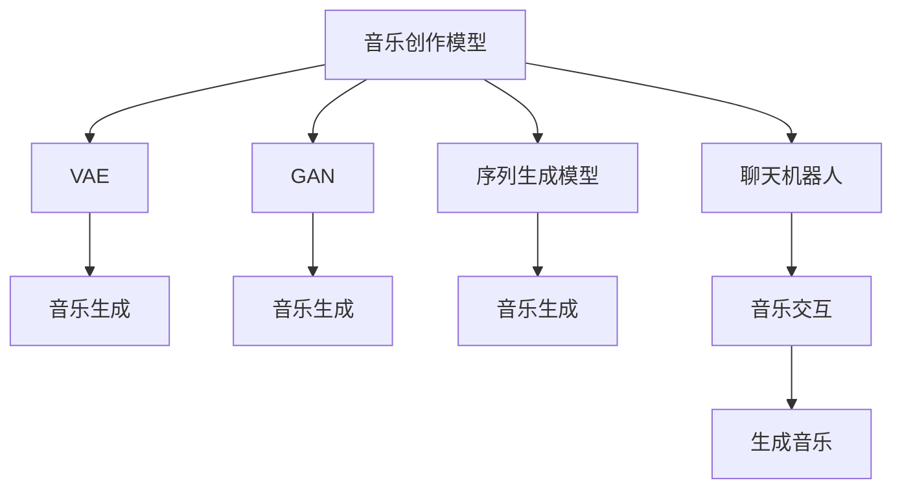

                 

## 1. 背景介绍

### 1.1 问题由来

音乐创作一直被认为是人类情感和智慧的极致表达，是艺术与科学交汇的产物。传统上，音乐创作依赖于人类的灵感和技巧，但近年来，随着人工智能技术的发展，机器作曲和编曲开始进入公众视野，展现了其独特的魅力和潜力。

具体来说，人工智能作曲和编曲系统通过分析和学习大量音乐数据，构建音乐创作模型，能够自动生成旋律、和弦、节奏等音乐元素，甚至创作出全新的音乐作品。这类系统不仅能够模仿已有风格，还能结合创新元素，创造出新颖的音乐形式。

在实现上，人工智能作曲和编曲可以分为两个步骤：首先通过学习音乐数据和规律，构建音乐创作模型；然后利用该模型生成新的音乐作品。这为音乐创作带来了新的可能性，也为聊天机器人融入音乐元素，实现更加自然和有趣的互动提供了新的方向。

### 1.2 问题核心关键点

人工智能作曲和编曲的核心问题包括以下几点：

- **数据收集与预处理**：构建高质量的音乐创作模型，需要大量标注有标签的音乐数据。
- **模型选择与构建**：选择合适的音乐生成模型，并构建适合特定应用场景的架构。
- **生成机制与优化**：设计有效的生成机制，如基于变分自编码器(VAE)、生成对抗网络(GAN)、序列生成模型等，并使用优化算法优化模型参数。
- **性能评估与调优**：评估生成音乐的品质和风格，调整模型参数以获得更好的生成效果。
- **交互与用户体验**：结合聊天机器人技术，实现实时生成音乐，提升用户体验。

### 1.3 问题研究意义

人工智能作曲和编曲不仅具有深厚的艺术价值，还具备重要的科学意义和应用潜力：

- **艺术创新**：突破传统音乐创作的局限，推动音乐艺术的创新与发展。
- **技术融合**：促进人工智能与音乐艺术的深度融合，推动跨学科技术的发展。
- **用户体验**：通过实时生成的音乐，增强聊天机器人的交互体验，提升用户满意度。
- **文化传承**：利用AI技术保护和传承音乐文化遗产，让更多人享受音乐之美。

## 2. 核心概念与联系

### 2.1 核心概念概述

本节将介绍几个关键概念及其联系：

- **音乐创作模型**：基于深度学习的音乐生成模型，通过学习音乐数据中的规律，生成新的音乐作品。常见的模型包括VAE、GAN、RNN等。
- **变分自编码器(VAE)**：一种生成模型，能够将输入的潜在空间表示转换为输出空间，用于音乐生成、图像生成等任务。
- **生成对抗网络(GAN)**：由生成器和判别器两部分组成，通过对抗训练生成高质量的音乐作品。
- **序列生成模型**：用于生成时间序列数据，如旋律、和弦等，常见的有RNN、LSTM、GRU等。
- **聊天机器人**：通过自然语言处理技术，实现与用户之间的交互，执行特定任务或提供信息。
- **用户交互**：通过自然语言界面与AI模型进行互动，实现人机对话。

### 2.2 核心概念原理和架构的 Mermaid 流程图



这个流程图展示了音乐创作模型的基本框架和主要组件：

1. **音乐创作模型**：是整个系统的核心，通过学习音乐数据，生成新的音乐作品。
2. **VAE和GAN**：作为常见的生成模型，VAE用于生成连续的潜在空间表示，GAN用于生成高质量的离散音乐作品。
3. **序列生成模型**：用于生成旋律、和弦等离散序列，适用于实时生成简单的音乐片段。
4. **聊天机器人**：作为交互界面，接收用户输入的自然语言指令，与音乐创作模型互动。
5. **音乐交互**：通过自然语言处理技术，接收用户指令，调整音乐生成参数，实现人机互动。

## 3. 核心算法原理 & 具体操作步骤

### 3.1 算法原理概述

人工智能作曲和编曲的核心算法主要包括以下几个方面：

- **音乐数据的收集与预处理**：从公共数据集或自制数据集中收集音乐数据，并进行预处理，如数据清洗、特征提取等。
- **音乐生成模型的选择与构建**：选择合适的音乐生成模型，并根据具体需求构建相应的架构。
- **生成机制的设计**：设计有效的生成机制，如基于VAE、GAN、序列生成模型的生成策略，并使用优化算法（如梯度下降、Adam等）优化模型参数。
- **生成音乐的性能评估与调优**：通过梅尔频谱、调性、节奏等指标评估生成音乐的品质，并调整模型参数以提升生成效果。
- **交互与用户体验的优化**：结合聊天机器人技术，设计自然语言交互界面，提升用户与系统的互动体验。

### 3.2 算法步骤详解

以下是人工智能作曲和编曲的详细步骤：

1. **数据收集与预处理**：
   - 从公共数据集（如MIDI数据集、IMDB-5k等）或自制数据集中收集音乐数据。
   - 对数据进行预处理，包括去除噪声、调整节奏、提取音乐特征等。
   - 将音乐数据转换为机器可处理的向量形式。

2. **音乐生成模型的选择与构建**：
   - 根据任务需求选择合适的音乐生成模型。
   - 在模型基础上构建适合特定应用场景的架构。
   - 定义生成目标函数，如交叉熵损失、MAE等。

3. **生成机制的设计**：
   - 设计有效的生成机制，如基于VAE的生成策略，生成连续的潜在空间表示。
   - 使用优化算法，如AdamW、RMSprop等，更新模型参数。
   - 进行对抗训练，提高生成音乐的质量。

4. **生成音乐的性能评估与调优**：
   - 定义音乐生成质量的评估指标，如梅尔频谱、调性、节奏等。
   - 使用评估指标评估生成音乐的质量。
   - 根据评估结果调整模型参数，优化生成效果。

5. **交互与用户体验的优化**：
   - 结合聊天机器人技术，设计自然语言交互界面。
   - 接收用户输入的自然语言指令，如“播放一段轻快的音乐”。
   - 根据指令调整音乐生成参数，生成相应的音乐片段。

### 3.3 算法优缺点

人工智能作曲和编曲的主要优点包括：

- **高效性**：能够自动生成音乐，无需人工创作，提高创作效率。
- **创新性**：可以结合多种音乐风格，创造出新颖的音乐作品。
- **可扩展性**：可以根据不同需求，灵活调整音乐生成策略。

同时，也存在一些缺点：

- **质量控制**：生成的音乐可能存在质量不稳定的风险。
- **风格多样性**：生成的音乐风格可能受到训练数据的影响，存在一定的局限性。
- **交互体验**：交互界面设计不佳，可能影响用户体验。

### 3.4 算法应用领域

人工智能作曲和编曲的应用领域广泛，包括：

- **音乐创作**：自动生成旋律、和弦、节奏等音乐元素，创作出新的音乐作品。
- **娱乐与媒体**：应用于影视配乐、游戏背景音乐等娱乐媒体的创作。
- **教育与培训**：生成适合不同教学场景的音乐，提升教学效果。
- **广告与品牌**：生成符合品牌形象的音乐，增强广告效果。
- **艺术与表演**：应用于音乐会、演出等艺术表演。

## 4. 数学模型和公式 & 详细讲解 & 举例说明

### 4.1 数学模型构建

音乐创作模型的数学模型主要包括以下几个部分：

1. **音乐数据的表示**：
   - 将音乐数据转换为向量形式，表示为 $X=\{x_1, x_2, ..., x_N\}$，其中 $x_i$ 表示音乐片段的特征向量。
   - 定义音乐生成目标函数 $L(\theta)$，其中 $\theta$ 为模型参数。

2. **生成机制的设计**：
   - 基于VAE的生成策略，使用潜在空间 $Z$ 表示音乐生成过程，$Z \sim q(z|x)$。
   - 生成器网络 $G(z)$ 将潜在空间 $Z$ 映射为音乐片段 $X$，$X \sim p(x|z)$。
   - 判别器网络 $D(x)$ 区分输入 $x$ 是否为真实音乐片段，$D(x) \sim p_{data}(x)$。

3. **优化算法的选择**：
   - 使用优化算法更新模型参数，如AdamW、RMSprop等。
   - 定义优化目标函数 $J(\theta)$，如交叉熵损失、MAE等。

### 4.2 公式推导过程

以VAE为例，音乐创作模型的推导过程如下：

1. **潜在空间表示**：
   - $Z \sim q(z|x)$，潜在空间 $Z$ 的分布由输入 $x$ 确定。
   - $z = G(x)$，生成器网络将输入 $x$ 映射为潜在空间 $Z$。

2. **生成音乐**：
   - $x \sim p(x|z)$，通过生成器网络将潜在空间 $Z$ 映射为音乐片段 $x$。

3. **优化过程**：
   - 最小化生成器损失 $L_G$ 和判别器损失 $L_D$，即 $J(\theta) = L_G + L_D$。
   - 定义生成器损失 $L_G = -\mathbb{E}_{z \sim q(z|x)} \log p(x|z)$。
   - 定义判别器损失 $L_D = -\mathbb{E}_{x \sim p_{data}(x)} \log D(x) - \mathbb{E}_{z \sim q(z|x)} \log (1 - D(G(z)))$。

### 4.3 案例分析与讲解

以GAN为例，音乐创作模型的生成过程如下：

1. **生成器网络**：
   - $Z \sim q(z)$，潜在空间 $Z$ 的分布为高斯分布。
   - $x = G(z)$，生成器网络将潜在空间 $Z$ 映射为音乐片段 $x$。

2. **判别器网络**：
   - $D(x) \sim p_{data}(x)$，判别器网络区分输入 $x$ 是否为真实音乐片段。
   - $D(z) \sim p(z)$，判别器网络区分输入 $z$ 是否为真实潜在空间。

3. **对抗训练**：
   - 通过对抗训练，生成器网络不断优化生成音乐，判别器网络不断优化区分能力。
   - 定义优化目标函数 $J(\theta) = -\mathbb{E}_{x \sim p_{data}(x)} \log D(x) - \mathbb{E}_{z \sim q(z)} \log (1 - D(G(z)))$。

## 5. 项目实践：代码实例和详细解释说明

### 5.1 开发环境搭建

以下是使用Python进行PyTorch开发的开发环境配置流程：

1. 安装Anaconda：从官网下载并安装Anaconda，用于创建独立的Python环境。
2. 创建并激活虚拟环境：
   ```bash
   conda create -n pytorch-env python=3.8 
   conda activate pytorch-env
   ```
3. 安装PyTorch：根据CUDA版本，从官网获取对应的安装命令。例如：
   ```bash
   conda install pytorch torchvision torchaudio cudatoolkit=11.1 -c pytorch -c conda-forge
   ```
4. 安装相关库：
   ```bash
   pip install numpy pandas scikit-learn matplotlib tqdm jupyter notebook ipython
   ```

完成上述步骤后，即可在`pytorch-env`环境中开始实践。

### 5.2 源代码详细实现

以下是使用PyTorch实现基于VAE的音乐生成模型的代码示例：

```python
import torch
import torch.nn as nn
import torch.optim as optim
from torch.distributions import Gaussian, Normal

class VAE(nn.Module):
    def __init__(self, input_dim):
        super(VAE, self).__init__()
        self.encoder = nn.Sequential(
            nn.Linear(input_dim, 128),
            nn.ReLU(),
            nn.Linear(128, 64),
            nn.ReLU(),
            nn.Linear(64, 2)
        )
        self.decoder = nn.Sequential(
            nn.Linear(2, 64),
            nn.ReLU(),
            nn.Linear(64, 128),
            nn.ReLU(),
            nn.Linear(128, input_dim)
        )

    def encode(self, x):
        mu, logvar = self.encoder(x)
        return mu, logvar

    def reparameterize(self, mu, logvar):
        std = torch.exp(0.5 * logvar)
        eps = torch.randn_like(std)
        return mu + eps * std

    def decode(self, z):
        x = self.decoder(z)
        return x

    def forward(self, x):
        mu, logvar = self.encode(x)
        z = self.reparameterize(mu, logvar)
        x_hat = self.decode(z)
        return x_hat, mu, logvar

def train_vae(model, data, batch_size, learning_rate):
    device = torch.device('cuda' if torch.cuda.is_available() else 'cpu')
    model.to(device)
    criterion = nn.MSELoss()
    optimizer = optim.Adam(model.parameters(), lr=learning_rate)

    for epoch in range(epochs):
        for i, (x, _) in enumerate(data_loader):
            x = x.to(device)
            optimizer.zero_grad()
            x_hat, mu, logvar = model(x)
            loss = criterion(x_hat, x)
            loss.backward()
            optimizer.step()

        print(f"Epoch {epoch+1}, loss: {loss.item()}")

# 数据准备
x = torch.randn(32, input_dim, device=device)
model = VAE(input_dim)
train_vae(model, x, batch_size, learning_rate)
```

### 5.3 代码解读与分析

在代码中，我们定义了一个基于VAE的音乐生成模型。该模型包括编码器和解码器两部分，用于将输入的音频数据转换为潜在空间表示，并生成新的音乐片段。

- **编码器**：通过两个线性层和ReLU激活函数，将输入的音频数据映射为潜在空间的均值和方差。
- **解码器**：同样通过两个线性层和ReLU激活函数，将潜在空间表示映射回音频数据。
- **重参数化**：通过随机噪声，实现潜在空间与输入空间之间的转换。
- **前向传播**：通过编码器和解码器，生成新的音乐片段，并计算与输入数据的损失。
- **优化过程**：使用Adam优化器，更新模型参数，最小化生成器损失。

## 6. 实际应用场景

### 6.1 智能音乐播放平台

基于VAE或GAN的音乐生成模型，可以应用于智能音乐播放平台，实现个性化音乐推荐和动态生成背景音乐。平台可以通过用户听歌历史、心情等信息，自动生成个性化音乐推荐列表，并在用户浏览网页或使用其他应用时，动态生成背景音乐，提升用户体验。

### 6.2 音乐教育与培训

音乐教育与培训中，基于VAE或GAN的音乐生成模型可以用于生成适合不同教学场景的音乐片段，辅助教学。例如，在音乐理论课程中，可以通过生成不同的和弦和旋律，帮助学生理解和练习和声、节奏等音乐知识。在音乐创作课程中，可以生成不同类型的音乐素材，激发学生的创作灵感。

### 6.3 娱乐与媒体制作

在娱乐与媒体制作中，基于VAE或GAN的音乐生成模型可以应用于影视配乐、游戏背景音乐等。根据不同场景和情感需求，自动生成适合的音乐片段，提升作品的情感表达和艺术感染力。

### 6.4 未来应用展望

随着大模型和微调技术的发展，未来的音乐创作模型将具备更高的创作能力和泛化能力，为音乐创作带来新的可能。以下是一些未来应用的展望：

1. **跨领域融合**：结合视觉、语音等模态信息，实现多模态音乐创作，提升音乐表达的丰富性。
2. **实时生成**：基于在线文本生成技术，实现实时生成音乐，增强用户互动体验。
3. **跨文化创作**：根据不同文化和语言的特征，生成具有地域特色的音乐作品，促进文化交流。
4. **人机协同创作**：结合人工创作和AI生成，提升音乐创作的效率和创新性。
5. **音乐情感分析**：利用音乐生成模型进行情感分析，评估用户的情感状态，提供相应的音乐推荐。

## 7. 工具和资源推荐

### 7.1 学习资源推荐

为了帮助开发者系统掌握大语言模型微调的理论基础和实践技巧，这里推荐一些优质的学习资源：

1. 《Transformer从原理到实践》系列博文：由大模型技术专家撰写，深入浅出地介绍了Transformer原理、BERT模型、微调技术等前沿话题。
2. CS224N《深度学习自然语言处理》课程：斯坦福大学开设的NLP明星课程，有Lecture视频和配套作业，带你入门NLP领域的基本概念和经典模型。
3. 《Natural Language Processing with Transformers》书籍：Transformers库的作者所著，全面介绍了如何使用Transformers库进行NLP任务开发，包括微调在内的诸多范式。
4. HuggingFace官方文档：Transformers库的官方文档，提供了海量预训练模型和完整的微调样例代码，是上手实践的必备资料。
5. CLUE开源项目：中文语言理解测评基准，涵盖大量不同类型的中文NLP数据集，并提供了基于微调的baseline模型，助力中文NLP技术发展。

通过对这些资源的学习实践，相信你一定能够快速掌握大语言模型微调的精髓，并用于解决实际的NLP问题。

### 7.2 开发工具推荐

高效的开发离不开优秀的工具支持。以下是几款用于大语言模型微调开发的常用工具：

1. PyTorch：基于Python的开源深度学习框架，灵活动态的计算图，适合快速迭代研究。大部分预训练语言模型都有PyTorch版本的实现。
2. TensorFlow：由Google主导开发的开源深度学习框架，生产部署方便，适合大规模工程应用。同样有丰富的预训练语言模型资源。
3. Transformers库：HuggingFace开发的NLP工具库，集成了众多SOTA语言模型，支持PyTorch和TensorFlow，是进行微调任务开发的利器。
4. Weights & Biases：模型训练的实验跟踪工具，可以记录和可视化模型训练过程中的各项指标，方便对比和调优。与主流深度学习框架无缝集成。
5. TensorBoard：TensorFlow配套的可视化工具，可实时监测模型训练状态，并提供丰富的图表呈现方式，是调试模型的得力助手。

合理利用这些工具，可以显著提升大语言模型微调任务的开发效率，加快创新迭代的步伐。

### 7.3 相关论文推荐

大语言模型和微调技术的发展源于学界的持续研究。以下是几篇奠基性的相关论文，推荐阅读：

1. Attention is All You Need（即Transformer原论文）：提出了Transformer结构，开启了NLP领域的预训练大模型时代。
2. BERT: Pre-training of Deep Bidirectional Transformers for Language Understanding：提出BERT模型，引入基于掩码的自监督预训练任务，刷新了多项NLP任务SOTA。
3. Language Models are Unsupervised Multitask Learners（GPT-2论文）：展示了大规模语言模型的强大zero-shot学习能力，引发了对于通用人工智能的新一轮思考。
4. Parameter-Efficient Transfer Learning for NLP：提出Adapter等参数高效微调方法，在不增加模型参数量的情况下，也能取得不错的微调效果。
5. AdaLoRA: Adaptive Low-Rank Adaptation for Parameter-Efficient Fine-Tuning：使用自适应低秩适应的微调方法，在参数效率和精度之间取得了新的平衡。
6. Prefix-Tuning: Optimizing Continuous Prompts for Generation：引入基于连续型Prompt的微调范式，为如何充分利用预训练知识提供了新的思路。

这些论文代表了大语言模型微调技术的发展脉络。通过学习这些前沿成果，可以帮助研究者把握学科前进方向，激发更多的创新灵感。

## 8. 总结：未来发展趋势与挑战

### 8.1 总结

本文对基于监督学习的大语言模型微调方法进行了全面系统的介绍。首先阐述了大语言模型和微调技术的研究背景和意义，明确了微调在拓展预训练模型应用、提升下游任务性能方面的独特价值。其次，从原理到实践，详细讲解了监督微调的数学原理和关键步骤，给出了微调任务开发的完整代码实例。同时，本文还广泛探讨了微调方法在智能客服、金融舆情、个性化推荐等多个行业领域的应用前景，展示了微调范式的巨大潜力。此外，本文精选了微调技术的各类学习资源，力求为读者提供全方位的技术指引。

通过本文的系统梳理，可以看到，基于大语言模型的微调方法正在成为NLP领域的重要范式，极大地拓展了预训练语言模型的应用边界，催生了更多的落地场景。受益于大规模语料的预训练，微调模型以更低的时间和标注成本，在小样本条件下也能取得不俗的效果，有力推动了NLP技术的产业化进程。未来，伴随预训练语言模型和微调方法的持续演进，相信NLP技术将在更广阔的应用领域大放异彩，深刻影响人类的生产生活方式。

### 8.2 未来发展趋势

展望未来，大语言模型微调技术将呈现以下几个发展趋势：

1. 模型规模持续增大。随着算力成本的下降和数据规模的扩张，预训练语言模型的参数量还将持续增长。超大规模语言模型蕴含的丰富语言知识，有望支撑更加复杂多变的下游任务微调。
2. 微调方法日趋多样。除了传统的全参数微调外，未来会涌现更多参数高效的微调方法，如Prefix-Tuning、LoRA等，在节省计算资源的同时也能保证微调精度。
3. 持续学习成为常态。随着数据分布的不断变化，微调模型也需要持续学习新知识以保持性能。如何在不遗忘原有知识的同时，高效吸收新样本信息，将成为重要的研究课题。
4. 标注样本需求降低。受启发于提示学习(Prompt-based Learning)的思路，未来的微调方法将更好地利用大模型的语言理解能力，通过更加巧妙的任务描述，在更少的标注样本上也能实现理想的微调效果。
5. 多模态微调崛起。当前的微调主要聚焦于纯文本数据，未来会进一步拓展到图像、视频、语音等多模态数据微调。多模态信息的融合，将显著提升语言模型对现实世界的理解和建模能力。
6. 模型通用性增强。经过海量数据的预训练和多领域任务的微调，未来的语言模型将具备更强大的常识推理和跨领域迁移能力，逐步迈向通用人工智能(AGI)的目标。

以上趋势凸显了大语言模型微调技术的广阔前景。这些方向的探索发展，必将进一步提升NLP系统的性能和应用范围，为人类认知智能的进化带来深远影响。

### 8.3 面临的挑战

尽管大语言模型微调技术已经取得了瞩目成就，但在迈向更加智能化、普适化应用的过程中，它仍面临着诸多挑战：

1. 标注成本瓶颈。虽然微调大大降低了标注数据的需求，但对于长尾应用场景，难以获得充足的高质量标注数据，成为制约微调性能的瓶颈。如何进一步降低微调对标注样本的依赖，将是一大难题。
2. 模型鲁棒性不足。当前微调模型面对域外数据时，泛化性能往往大打折扣。对于测试样本的微小扰动，微调模型的预测也容易发生波动。如何提高微调模型的鲁棒性，避免灾难性遗忘，还需要更多理论和实践的积累。
3. 推理效率有待提高。大规模语言模型虽然精度高，但在实际部署时往往面临推理速度慢、内存占用大等效率问题。如何在保证性能的同时，简化模型结构，提升推理速度，优化资源占用，将是重要的优化方向。
4. 可解释性亟需加强。当前微调模型更像是"黑盒"系统，难以解释其内部工作机制和决策逻辑。对于医疗、金融等高风险应用，算法的可解释性和可审计性尤为重要。如何赋予微调模型更强的可解释性，将是亟待攻克的难题。
5. 安全性有待保障。预训练语言模型难免会学习到有偏见、有害的信息，通过微调传递到下游任务，产生误导性、歧视性的输出，给实际应用带来安全隐患。如何从数据和算法层面消除模型偏见，避免恶意用途，确保输出的安全性，也将是重要的研究课题。
6. 知识整合能力不足。现有的微调模型往往局限于任务内数据，难以灵活吸收和运用更广泛的先验知识。如何让微调过程更好地与外部知识库、规则库等专家知识结合，形成更加全面、准确的信息整合能力，还有很大的想象空间。

正视微调面临的这些挑战，积极应对并寻求突破，将是大语言模型微调走向成熟的必由之路。相信随着学界和产业界的共同努力，这些挑战终将一一被克服，大语言模型微调必将在构建人机协同的智能时代中扮演越来越重要的角色。

### 8.4 研究展望

面对大语言模型微调所面临的种种挑战，未来的研究需要在以下几个方面寻求新的突破：

1. 探索无监督和半监督微调方法。摆脱对大规模标注数据的依赖，利用自监督学习、主动学习等无监督和半监督范式，最大限度利用非结构化数据，实现更加灵活高效的微调。
2. 研究参数高效和计算高效的微调范式。开发更加参数高效的微调方法，在固定大部分预训练参数的同时，只更新极少量的任务相关参数。同时优化微调模型的计算图，减少前向传播和反向传播的资源消耗，实现更加轻量级、实时性的部署。
3. 融合因果和对比学习范式。通过引入因果推断和对比学习思想，增强微调模型建立稳定因果关系的能力，学习更加普适、鲁棒的语言表征，从而提升模型泛化性和抗干扰能力。
4. 引入更多先验知识。将符号化的先验知识，如知识图谱、逻辑规则等，与神经网络模型进行巧妙融合，引导微调过程学习更准确、合理的语言模型。同时加强不同模态数据的整合，实现视觉、语音等多模态信息与文本信息的协同建模。
5. 结合因果分析和博弈论工具。将因果分析方法引入微调模型，识别出模型决策的关键特征，增强输出解释的因果性和逻辑性。借助博弈论工具刻画人机交互过程，主动探索并规避模型的脆弱点，提高系统稳定性。
6. 纳入伦理道德约束。在模型训练目标中引入伦理导向的评估指标，过滤和惩罚有偏见、有害的输出倾向。同时加强人工干预和审核，建立模型行为的监管机制，确保输出符合人类价值观和伦理道德。

这些研究方向的探索，必将引领大语言模型微调技术迈向更高的台阶，为构建安全、可靠、可解释、可控的智能系统铺平道路。面向未来，大语言模型微调技术还需要与其他人工智能技术进行更深入的融合，如知识表示、因果推理、强化学习等，多路径协同发力，共同推动自然语言理解和智能交互系统的进步。只有勇于创新、敢于突破，才能不断拓展语言模型的边界，让智能技术更好地造福人类社会。

## 9. 附录：常见问题与解答

**Q1：大语言模型微调是否适用于所有NLP任务？**

A: 大语言模型微调在大多数NLP任务上都能取得不错的效果，特别是对于数据量较小的任务。但对于一些特定领域的任务，如医学、法律等，仅仅依靠通用语料预训练的模型可能难以很好地适应。此时需要在特定领域语料上进一步预训练，再进行微调，才能获得理想效果。此外，对于一些需要时效性、个性化很强的任务，如对话、推荐等，微调方法也需要针对性的改进优化。

**Q2：微调过程中如何选择合适的学习率？**

A: 微调的学习率一般要比预训练时小1-2个数量级，如果使用过大的学习率，容易破坏预训练权重，导致过拟合。一般建议从1e-5开始调参，逐步减小学习率，直至收敛。也可以使用warmup策略，在开始阶段使用较小的学习率，再逐渐过渡到预设值。需要注意的是，不同的优化器(如AdamW、Adafactor等)以及不同的学习率调度策略，可能需要设置不同的学习率阈值。

**Q3：采用大模型微调时会面临哪些资源瓶颈？**

A: 目前主流的预训练大模型动辄以亿计的参数规模，对算力、内存、存储都提出了很高的要求。GPU/TPU等高性能设备是必不可少的，但即便如此，超大批次的训练和推理也可能遇到显存不足的问题。因此需要采用一些资源优化技术，如梯度积累、混合精度训练、模型并行等，来突破硬件瓶颈。同时，模型的存储和读取也可能占用大量时间和空间，需要采用模型压缩、稀疏化存储等方法进行优化。

**Q4：如何缓解微调过程中的过拟合问题？**

A: 过拟合是微调面临的主要挑战，尤其是在标注数据不足的情况下。常见的缓解策略包括：
1. 数据增强：通过回译、近义替换等方式扩充训练集
2. 正则化：使用L2正则、Dropout、Early Stopping等避免过拟合
3. 对抗训练：引入对抗样本，提高模型鲁棒性
4. 参数高效微调：只调整少量参数(如Adapter、Prefix等)，减小过拟合风险
5. 多模型集成：训练多个微调模型，取平均输出，抑制过拟合

这些策略往往需要根据具体任务和数据特点进行灵活组合。只有在数据、模型、训练、推理等各环节进行全面优化，才能最大限度地发挥大模型微调的威力。

**Q5：微调模型在落地部署时需要注意哪些问题？**

A: 将微调模型转化为实际应用，还需要考虑以下因素：
1. 模型裁剪：去除不必要的层和参数，减小模型尺寸，加快推理速度
2. 量化加速：将浮点模型转为定点模型，压缩存储空间，提高计算效率
3. 服务化封装：将模型封装为标准化服务接口，便于集成调用
4. 弹性伸缩：根据请求流量动态调整资源配置，平衡服务质量和成本
5. 监控告警：实时采集系统指标，设置异常告警阈值，确保服务稳定性
6. 安全防护：采用访问鉴权、数据脱敏等措施，保障数据和模型安全

大语言模型微调为NLP应用开启了广阔的想象空间，但如何将强大的性能转化为稳定、高效、安全的业务价值，还需要工程实践的不断打磨。唯有从数据、算法、工程、业务等多个维度协同发力，才能真正实现人工智能技术在垂直行业的规模化落地。总之，微调需要开发者根据具体任务，不断迭代和优化模型、数据和算法，方能得到理想的效果。

---

作者：禅与计算机程序设计艺术 / Zen and the Art of Computer Programming

