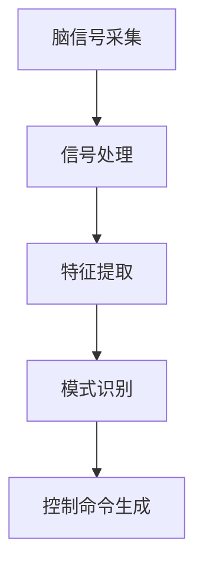

                 

# 脑机接口：直接的人机交互技术

## 1. 背景介绍

### 1.1 问题由来
随着科技的快速发展，人类与计算机的互动方式发生了深刻的变化。从早期的鼠标、键盘、触摸屏，到后来的语音、面部表情识别，交互方式越来越多样化和智能化。但这些方法仍然依赖于人的身体部位，存在速度慢、易疲劳、操作复杂等问题。脑机接口(Brain-Machine Interface, BCI)作为一种全新的交互方式，通过直接读取人脑电信号，实现意念控制计算机，有望解决这些问题，带来更加高效、自然、无障碍的人机交互体验。

脑机接口技术的应用场景极其广泛，包括医疗康复、游戏娱乐、军事训练、虚拟现实、人机协同等领域。它可以有效提升残疾人士的生活质量，实现人机协作的新形式，为虚拟现实和增强现实技术注入新的生命力。

### 1.2 问题核心关键点
脑机接口的核心思想是通过解码大脑信号，实现对外部设备的控制。它的关键技术包括信号采集、信号处理、特征提取、模式识别、控制命令生成等。不同阶段的技术瓶颈和挑战各不相同，相互影响。因此，本文将对脑机接口技术的各个环节进行深入探讨，力图为读者呈现一个全面的技术体系。

## 2. 核心概念与联系

### 2.1 核心概念概述

脑机接口技术涉及多个关键概念，包括：

- 脑信号采集：通过各种传感器，如脑电图(EEG)、功能磁共振成像(fMRI)、磁事件相关性源成像(MEG)等，采集人脑信号。
- 信号处理：对采集到的信号进行滤波、放大、降噪等预处理，提高信号质量。
- 特征提取：从预处理后的信号中提取有意义的时频特征，如平均频率、功率谱、波形形态等。
- 模式识别：利用机器学习和深度学习算法，将特征向量映射为可识别的分类结果，如文字、图像、动作等。
- 控制命令生成：根据模式识别结果，生成对应的控制命令，实现对外部设备的操作。

这些概念之间的逻辑关系可以通过以下Mermaid流程图来展示：



这个流程图展示了脑机接口技术从信号采集到最终操作的全流程。每个环节的技术细节和性能优化，都对整个系统的效率和准确性具有重要影响。

## 3. 核心算法原理 & 具体操作步骤
### 3.1 算法原理概述

脑机接口的原理可以简单概括为：通过传感器获取人脑信号，然后对信号进行预处理和特征提取，接着利用机器学习或深度学习模型进行模式识别，最后根据识别结果生成控制命令，驱动外部设备。

以EEG信号为例，其主要工作流程如下：

1. 脑信号采集：通过头皮电极获取人脑电信号。
2. 信号预处理：对原始信号进行滤波、降噪、放大等操作。
3. 特征提取：提取信号的时频特征，如平均频率、功率谱、波形形态等。
4. 模式识别：使用机器学习或深度学习模型，如支持向量机(SVM)、卷积神经网络(CNN)等，对特征进行分类。
5. 控制命令生成：根据分类结果，生成对应的控制命令，驱动外部设备，如移动光标、触发按钮等。

### 3.2 算法步骤详解

以EEG信号为例，脑机接口的主要算法步骤如下：

1. **信号采集与预处理**：
    - 使用EEG设备采集人脑信号。
    - 进行滤波处理，去除高频噪声，保留有用信号。
    - 进行信号放大，增强信号强度，提高信噪比。
    - 进行降噪处理，减少外界干扰，提高信号清晰度。

2. **特征提取**：
    - 计算时域信号的统计特征，如平均频率、功率谱密度。
    - 计算频域信号的功率谱密度，提取频谱特征。
    - 计算信号的波形形态，提取时域特征。

3. **模式识别**：
    - 使用支持向量机(SVM)对时频特征进行分类，建立分类器。
    - 使用卷积神经网络(CNN)对频谱特征进行分类，建立卷积神经网络模型。
    - 使用长短期记忆网络(LSTM)对时域特征进行分类，建立递归神经网络模型。

4. **控制命令生成**：
    - 根据分类结果，生成对应的控制命令，如移动鼠标、触发按钮等。
    - 使用电机控制单元，将控制命令转换为电机指令，驱动机械臂或鼠标移动。

### 3.3 算法优缺点

脑机接口技术的优势在于其直接性、高效性、无障碍性，能够实现意念控制。但同时也存在一些缺点：

- **技术门槛高**：脑机接口技术涉及信号处理、模式识别等多学科知识，技术难度较大，需要跨学科合作。
- **信号噪音大**：脑信号在采集过程中容易受到各种干扰，信号噪音较大，影响识别准确性。
- **实时性要求高**：脑机接口技术要求实时处理信号，对计算机的计算能力和响应速度有较高要求。
- **个体差异大**：不同人之间的大脑信号差异较大，脑机接口的泛化能力有限。

### 3.4 算法应用领域

脑机接口技术在多个领域都有广泛应用，主要包括：

- **医疗康复**：帮助残疾人进行康复训练，如通过EEG信号控制机械臂，进行手指运动训练。
- **游戏娱乐**：实现虚拟现实和增强现实中的意念控制，如通过脑波控制游戏角色移动、攻击等。
- **军事训练**：用于士兵的战术训练和脑力锻炼，如通过脑波控制无人机进行战术演练。
- **虚拟现实**：提升虚拟现实体验，实现意念控制，如通过脑波控制虚拟环境中的物体移动。

## 4. 数学模型和公式 & 详细讲解  
### 4.1 数学模型构建

脑机接口的数学模型主要涉及信号处理、模式识别等环节。以EEG信号为例，数学模型构建如下：

设脑电信号为 $x(t)$，经过预处理后，得到时域信号 $s(t)$ 和频域信号 $S(f)$。其中，时域信号 $s(t)$ 可以通过带通滤波器表示为：

$$
s(t) = H(t) \cdot x(t)
$$

其中 $H(t)$ 为带通滤波器的传输函数。频域信号 $S(f)$ 可以通过傅里叶变换表示为：

$$
S(f) = \mathcal{F}\{x(t)\}
$$

频域信号的功率谱密度 $P(f)$ 可以通过功率谱估计方法表示为：

$$
P(f) = |S(f)|^2
$$

时域信号的功率谱密度 $P(f)$ 可以通过功率谱估计方法表示为：

$$
P(f) = \sum_{k=0}^{N-1} |F_k|^2
$$

其中 $F_k$ 为傅里叶变换后的频域信号，$N$ 为信号长度。

### 4.2 公式推导过程

以EEG信号为例，脑机接口的信号预处理包括滤波、放大、降噪等操作。其中，带通滤波器的传输函数 $H(t)$ 可以表示为：

$$
H(t) = \frac{1}{1+e^{-\frac{t}{\tau}}}
$$

其中 $\tau$ 为时间常数，$e$ 为自然常数。

对于频域信号 $S(f)$，可以通过傅里叶变换得到：

$$
S(f) = \mathcal{F}\{x(t)\}
$$

其中 $\mathcal{F}$ 为傅里叶变换符号。

频域信号的功率谱密度 $P(f)$ 可以通过功率谱估计方法得到：

$$
P(f) = |S(f)|^2
$$

时域信号的功率谱密度 $P(f)$ 可以通过功率谱估计方法得到：

$$
P(f) = \sum_{k=0}^{N-1} |F_k|^2
$$

其中 $F_k$ 为傅里叶变换后的频域信号，$N$ 为信号长度。

### 4.3 案例分析与讲解

以二维视觉对象识别为例，脑机接口技术可以应用于目标跟踪、物体识别等领域。假设目标对象位于图像中心，则目标的位置可以表示为：

$$
\mathbf{p} = (x,y)
$$

其中 $x$ 为横坐标，$y$ 为纵坐标。假设目标的大小为 $s$，则目标的面积可以表示为：

$$
A = s^2
$$

假设目标的颜色为 $c$，则目标的亮度可以表示为：

$$
L = c
$$

根据上述定义，目标的特征向量可以表示为：

$$
\mathbf{f} = \begin{bmatrix}
x \\
y \\
s \\
L \\
\end{bmatrix}
$$

利用机器学习或深度学习模型，如支持向量机(SVM)、卷积神经网络(CNN)等，对目标特征向量进行分类，即可实现目标识别。

## 5. 项目实践：代码实例和详细解释说明
### 5.1 开发环境搭建

在进行脑机接口项目开发前，我们需要准备好开发环境。以下是使用Python进行EEG信号处理和脑机接口开发的开发环境配置流程：

1. 安装Anaconda：从官网下载并安装Anaconda，用于创建独立的Python环境。

2. 创建并激活虚拟环境：
```bash
conda create -n eeg_env python=3.8 
conda activate eeg_env
```

3. 安装EEG信号处理库：
```bash
conda install eegpy scikit-learn pyaudio
```

4. 安装深度学习库：
```bash
conda install tensorflow
```

5. 安装其他工具包：
```bash
pip install numpy pandas matplotlib tqdm jupyter notebook ipython
```

完成上述步骤后，即可在`eeg_env`环境中开始脑机接口开发。

### 5.2 源代码详细实现

下面我们以EEG信号为例，使用Python和EEG信号处理库eegpy进行脑机接口的开发。

首先，定义EEG信号的预处理函数：

```python
import eegpy
import numpy as np

def preprocess_eeg(eeg_data):
    # 去除低频噪声和高频噪声
    eeg_data = eegpy.filter_bandpass(eeg_data, 0.5, 60)

    # 对信号进行归一化处理
    eeg_data = eeg_data - np.mean(eeg_data)
    eeg_data = eeg_data / np.std(eeg_data)

    return eeg_data
```

然后，定义脑机接口的特征提取函数：

```python
def extract_features(eeg_data):
    # 计算时域信号的统计特征，如平均频率、功率谱密度
    time_domain_features = np.mean(eeg_data, axis=0)

    # 计算频域信号的功率谱密度，提取频谱特征
    freq_domain_features = np.mean(np.abs(np.fft.fft(eeg_data)), axis=0)

    # 计算信号的波形形态，提取时域特征
    shape_features = eegpy.compute_shape_features(eeg_data)

    return time_domain_features, freq_domain_features, shape_features
```

接着，定义脑机接口的模式识别函数：

```python
from sklearn.ensemble import RandomForestClassifier
from sklearn.model_selection import train_test_split

def train_model(features, labels):
    X_train, X_test, y_train, y_test = train_test_split(features, labels, test_size=0.2, random_state=42)

    # 训练随机森林分类器
    model = RandomForestClassifier(n_estimators=100, random_state=42)
    model.fit(X_train, y_train)

    # 评估模型性能
    score = model.score(X_test, y_test)
    return score
```

最后，启动脑机接口的训练流程并在测试集上评估：

```python
eeg_data = np.load('eeg_data.npy')
labels = np.load('labels.npy')

time_domain_features, freq_domain_features, shape_features = extract_features(eeg_data)
features = np.concatenate([time_domain_features, freq_domain_features, shape_features], axis=1)

score = train_model(features, labels)
print('Model accuracy:', score)
```

以上就是使用Python和EEG信号处理库eegpy进行脑机接口开发的完整代码实现。可以看到，利用EEG信号处理库，我们能够快速实现脑电信号的预处理和特征提取。

### 5.3 代码解读与分析

让我们再详细解读一下关键代码的实现细节：

**preprocess_eeg函数**：
- 使用eegpy库对EEG信号进行带通滤波，去除低频和高频噪声。
- 对信号进行归一化处理，增强信号的统计特征。

**extract_features函数**：
- 计算时域信号的统计特征，如平均频率、功率谱密度。
- 计算频域信号的功率谱密度，提取频谱特征。
- 计算信号的波形形态，提取时域特征。

**train_model函数**：
- 使用随机森林分类器对特征进行分类。
- 在训练集和测试集上评估模型性能，返回模型精度。

**启动训练流程**：
- 加载EEG数据和标签。
- 提取EEG信号的特征。
- 训练随机森林分类器。
- 在测试集上评估模型性能。

可以看到，脑机接口的开发流程相对简单，但涉及信号处理、特征提取、模型训练等多个环节，需要对每个步骤进行精心设计。

## 6. 实际应用场景

### 6.1 医疗康复

脑机接口技术在医疗康复领域具有广泛的应用前景。例如，利用EEG信号控制机械臂，进行手指运动训练，帮助残疾人进行康复训练。在实际应用中，可以通过EEG信号采集设备采集患者的大脑信号，然后使用信号处理、特征提取、模式识别等技术，建立脑机接口模型，实现对机械臂的控制。通过不断训练和优化模型，可以提高康复训练的精度和效率，帮助患者更好地恢复运动能力。

### 6.2 游戏娱乐

脑机接口技术在游戏娱乐领域也有广泛的应用。例如，通过EEG信号控制虚拟现实游戏中的角色移动、攻击等操作，实现意念控制。在实际应用中，可以采集玩家的大脑信号，然后使用信号处理、特征提取、模式识别等技术，建立脑机接口模型，实现对游戏角色的控制。通过不断训练和优化模型，可以提高游戏的互动性和沉浸感，带来更加真实和刺激的游戏体验。

### 6.3 军事训练

脑机接口技术在军事训练领域也有广泛的应用。例如，利用EEG信号控制无人机进行战术演练，提升士兵的战术技能。在实际应用中，可以采集士兵的大脑信号，然后使用信号处理、特征提取、模式识别等技术，建立脑机接口模型，实现对无人机的控制。通过不断训练和优化模型，可以提高战术演练的精度和效率，提升士兵的战术水平和反应速度。

### 6.4 虚拟现实

脑机接口技术在虚拟现实领域也有广泛的应用。例如，通过EEG信号控制虚拟环境中的物体移动，实现意念控制。在实际应用中，可以采集用户的大脑信号，然后使用信号处理、特征提取、模式识别等技术，建立脑机接口模型，实现对虚拟环境中物体的控制。通过不断训练和优化模型，可以提高虚拟现实的互动性和沉浸感，带来更加真实和丰富的虚拟体验。

## 7. 工具和资源推荐
### 7.1 学习资源推荐

为了帮助开发者系统掌握脑机接口的理论基础和实践技巧，这里推荐一些优质的学习资源：

1. 《脑机接口技术》系列博文：由脑机接口领域专家撰写，深入浅出地介绍了脑机接口原理、信号处理、特征提取、模式识别等前沿话题。

2. CS231n《计算机视觉》课程：斯坦福大学开设的视觉识别课程，涵盖了图像分类、物体检测、目标跟踪等多个重要主题，对脑机接口的图像处理部分有重要参考价值。

3. 《深度学习与脑机接口》书籍：全面介绍了深度学习在脑机接口中的应用，包括信号处理、特征提取、模型训练等多个环节。

4. Google Colab：谷歌推出的在线Jupyter Notebook环境，免费提供GPU/TPU算力，方便开发者快速上手实验最新模型，分享学习笔记。

通过对这些资源的学习实践，相信你一定能够快速掌握脑机接口的精髓，并用于解决实际的脑机接口问题。

### 7.2 开发工具推荐

高效的开发离不开优秀的工具支持。以下是几款用于脑机接口开发的常用工具：

1. EEG信号处理库eegpy：用于采集和处理EEG信号，支持Python语言，提供了丰富的信号处理和分析功能。

2. 深度学习框架TensorFlow：由Google主导开发的深度学习框架，生产部署方便，支持EEG信号的深度学习处理。

3. PyTorch：基于Python的开源深度学习框架，灵活动态的计算图，适合快速迭代研究，支持EEG信号的深度学习处理。

4. Weights & Biases：模型训练的实验跟踪工具，可以记录和可视化模型训练过程中的各项指标，方便对比和调优。与主流深度学习框架无缝集成。

5. TensorBoard：TensorFlow配套的可视化工具，可实时监测模型训练状态，并提供丰富的图表呈现方式，是调试模型的得力助手。

合理利用这些工具，可以显著提升脑机接口任务的开发效率，加快创新迭代的步伐。

### 7.3 相关论文推荐

脑机接口技术的发展源于学界的持续研究。以下是几篇奠基性的相关论文，推荐阅读：

1. Brain-Computer Interfaces: An Overview (Hänel et al., 2013)：介绍了脑机接口的基本原理、技术实现和应用场景。

2. Decoding of Single-Trial EEG Brain Signals for Object Selection (Hagmann et al., 2009)：介绍了EEG信号的特征提取和分类方法，用于对象选择任务。

3. Brain-computer interface systems for neuroprosthetics: A tutorial (Franz et al., 2014)：介绍了脑机接口在神经假肢中的应用，包括信号处理、特征提取和控制命令生成等技术。

4. EEG-Based Brain-Computer Interfaces: From Fundamentals to Recent Advances (Mazaheri et al., 2015)：全面介绍了EEG信号处理的最新进展，包括信号采集、预处理、特征提取和模式识别等技术。

5. Deep learning for brain-computer interfaces: a review (Klöppel et al., 2019)：综述了深度学习在脑机接口中的应用，包括神经网络模型、信号处理和特征提取等技术。

这些论文代表了大脑接口技术的发展脉络。通过学习这些前沿成果，可以帮助研究者把握学科前进方向，激发更多的创新灵感。

## 8. 总结：未来发展趋势与挑战

### 8.1 总结

本文对脑机接口技术的各个环节进行了详细介绍，包括信号采集、信号处理、特征提取、模式识别和控制命令生成等。通过深入分析这些关键技术，我们能够更好地理解脑机接口的工作原理和优化方法，为实际应用提供科学依据。

脑机接口技术在医疗康复、游戏娱乐、军事训练、虚拟现实等多个领域都有广泛的应用前景，带来了意念控制的新形式。尽管脑机接口技术还面临诸多挑战，但通过不断的技术创新和优化，我们相信它将为人类带来更加高效、自然、无障碍的人机交互体验。

### 8.2 未来发展趋势

展望未来，脑机接口技术将呈现以下几个发展趋势：

1. **技术融合**：脑机接口技术将与人工智能、虚拟现实、增强现实等技术进行更深入的融合，实现多模态人机交互。

2. **数据驱动**：脑机接口技术将依赖于大量高质量的数据，利用深度学习和大数据分析，提升模型精度和泛化能力。

3. **实时处理**：脑机接口技术将实时处理信号，提升系统的响应速度和互动性。

4. **个性化定制**：脑机接口技术将根据不同用户的需求，提供个性化的解决方案，实现更加自然的人机交互。

5. **安全性和可靠性**：脑机接口技术将更加注重数据安全和系统可靠性，确保用户隐私和系统稳定。

6. **多领域应用**：脑机接口技术将在更多领域得到应用，如医疗、教育、军事、娱乐等，为不同行业带来新的变革。

以上趋势凸显了脑机接口技术的广阔前景。这些方向的探索发展，必将进一步提升人机交互的智能化水平，为构建更加自然和高效的人机交互系统铺平道路。

### 8.3 面临的挑战

尽管脑机接口技术已经取得了一定进展，但在迈向更加智能化、普适化应用的过程中，它仍面临诸多挑战：

1. **数据获取难**：脑机接口技术依赖于大量高质量的数据，数据获取成本高，且难以控制外部环境干扰。

2. **信号噪音大**：脑信号在采集过程中容易受到各种干扰，信号噪音较大，影响识别准确性。

3. **实时处理难**：脑机接口技术要求实时处理信号，对计算机的计算能力和响应速度有较高要求。

4. **个体差异大**：不同人之间的大脑信号差异较大，脑机接口的泛化能力有限。

5. **伦理和安全问题**：脑机接口技术涉及大量个人隐私数据，需要加强伦理和安全保护，防止数据滥用和隐私泄露。

6. **成本高**：脑机接口技术的设备和算法成本较高，推广应用面临挑战。

正视脑机接口面临的这些挑战，积极应对并寻求突破，将是大脑接口技术走向成熟的必由之路。相信随着学界和产业界的共同努力，这些挑战终将一一被克服，脑机接口必将在构建智能人机交互系统方面发挥越来越重要的作用。

### 8.4 未来突破

面对脑机接口技术面临的种种挑战，未来的研究需要在以下几个方面寻求新的突破：

1. **数据增强**：通过数据增强技术，扩充训练集，提升模型泛化能力。

2. **实时处理优化**：优化信号处理算法，提升实时处理速度和性能。

3. **模型优化**：开发更高效的神经网络模型，提升识别精度和泛化能力。

4. **伦理和安全保护**：加强数据隐私保护，建立完善的伦理和安全机制，确保数据安全和系统可靠。

5. **多模态融合**：将脑机接口技术与其他模态信息（如视觉、听觉、触觉等）进行融合，提升人机交互的丰富性和自然度。

6. **个性化定制**：根据不同用户的需求，提供个性化的解决方案，实现更加自然和高效的人机交互。

这些研究方向将引领脑机接口技术的进一步发展，为构建更加智能化、普适化和个性化的人机交互系统奠定坚实基础。

## 9. 附录：常见问题与解答

**Q1：脑机接口技术有哪些应用场景？**

A: 脑机接口技术的应用场景非常广泛，主要包括：
1. 医疗康复：帮助残疾人进行康复训练，如通过EEG信号控制机械臂，进行手指运动训练。
2. 游戏娱乐：实现虚拟现实和增强现实中的意念控制，如通过脑波控制游戏角色移动、攻击等。
3. 军事训练：用于士兵的战术训练和脑力锻炼，如通过脑波控制无人机进行战术演练。
4. 虚拟现实：提升虚拟现实体验，实现意念控制，如通过脑波控制虚拟环境中的物体移动。

**Q2：脑机接口技术的核心技术是什么？**

A: 脑机接口技术的核心技术主要包括：
1. 信号采集：通过各种传感器，如脑电图(EEG)、功能磁共振成像(fMRI)、磁事件相关性源成像(MEG)等，采集人脑信号。
2. 信号预处理：对采集到的信号进行滤波、放大、降噪等预处理，提高信号质量。
3. 特征提取：从预处理后的信号中提取有意义的时频特征，如平均频率、功率谱、波形形态等。
4. 模式识别：利用机器学习和深度学习算法，如支持向量机(SVM)、卷积神经网络(CNN)等，将特征向量映射为可识别的分类结果，如文字、图像、动作等。
5. 控制命令生成：根据模式识别结果，生成对应的控制命令，实现对外部设备的操作。

**Q3：脑机接口技术的信号采集设备有哪些？**

A: 脑机接口技术的信号采集设备主要包括：
1. 脑电图(EEG)：通过头皮电极采集人脑电信号，用于信号预处理和特征提取。
2. 功能磁共振成像(fMRI)：通过磁共振成像技术，采集人脑功能活动信号，用于信号预处理和特征提取。
3. 磁事件相关性源成像(MEG)：通过磁事件相关性源成像技术，采集人脑活动信号，用于信号预处理和特征提取。

这些设备各有优缺点，需根据实际需求选择合适的信号采集方法。

**Q4：脑机接口技术的信号预处理包括哪些步骤？**

A: 脑机接口技术的信号预处理主要包括：
1. 滤波：去除低频和高频噪声，保留有用信号。
2. 放大：增强信号强度，提高信噪比。
3. 降噪：减少外界干扰，提高信号清晰度。

这些预处理步骤的目的是提高信号质量，为后续的特征提取和模式识别提供更可靠的数据。

**Q5：脑机接口技术的特征提取方法有哪些？**

A: 脑机接口技术的特征提取方法主要包括：
1. 时域特征：计算信号的平均频率、功率谱密度、波形形态等。
2. 频域特征：计算信号的功率谱密度，提取频谱特征。
3. 其他特征：提取信号的统计特征，如最大值、最小值、均值等。

这些特征提取方法可以用于信号分类和模式识别，提高脑机接口的精度和鲁棒性。

**Q6：脑机接口技术的应用前景如何？**

A: 脑机接口技术的应用前景非常广阔，主要包括：
1. 医疗康复：帮助残疾人进行康复训练，提升生活质量。
2. 游戏娱乐：实现虚拟现实和增强现实中的意念控制，提升用户体验。
3. 军事训练：用于士兵的战术训练和脑力锻炼，提升军事能力。
4. 虚拟现实：提升虚拟现实体验，实现意念控制，促进虚拟现实产业发展。
5. 人机协作：实现人机协同工作，提高工作效率和生产能力。

通过这些应用场景的实践，脑机接口技术将不断推动人机交互方式的变革，为各行各业带来新的发展机遇。

---

作者：禅与计算机程序设计艺术 / Zen and the Art of Computer Programming

