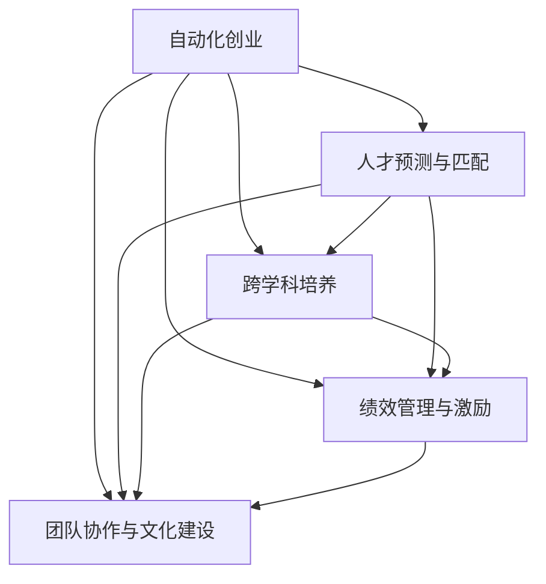

                 

# 自动化创业中的人才培养与管理

## 1. 背景介绍

### 1.1 问题由来

在自动化创业的浪潮中，人才成为企业发展的关键驱动力。传统的以需求驱动、人才导向的招聘模式，难以适应快速变化的自动化领域需求，尤其是对跨学科、创新能力人才的需求日益增长。如何高效培养和管理人才，使其最大化地为企业贡献价值，成为自动化创业企业面临的重要挑战。

### 1.2 问题核心关键点

1. **需求预测与匹配**：自动化领域技术迭代迅速，人才需求预测难度大。需要建立有效的需求分析与匹配机制，提高招聘效率和质量。
2. **跨学科与创新能力**：自动化领域融合了计算机科学、工程学、数学、统计学等多个学科，创新能力成为关键。如何培养综合素质高、具备跨学科视野的人才，是企业发展的关键。
3. **员工成长与职业路径**：自动化创业企业的快速成长需要动态的员工成长体系，为员工提供多样化的职业路径和发展机会。
4. **绩效管理与激励机制**：自动化创业企业的绩效管理和激励机制需要适应创新驱动的业务模式，激发员工的创造力和积极性。
5. **团队协作与文化建设**：高效团队协作是创新突破的前提，自动化创业企业如何建立高效的团队协作机制和文化，是实现长期发展的基石。

### 1.3 问题研究意义

对自动化创业中的人才培养与管理进行研究，具有重要的现实意义：

1. **提高招聘效率**：通过科学的人才预测与匹配机制，快速获取与企业需求高度契合的人才，减少招聘时间和成本。
2. **提升员工综合素质**：通过多样化的培养计划，全面提升员工在技术、管理、创新等方面的综合素质，增强企业核心竞争力。
3. **构建灵活的成长体系**：设计灵活的员工成长与职业路径机制，为员工提供多样化的发展机会，实现人尽其才。
4. **激励员工创造力**：通过合理的绩效管理和激励机制，激发员工的工作热情和创新潜力，推动企业持续创新发展。
5. **促进团队协作**：通过文化建设与团队协作机制，构建高效的团队，实现跨学科的协同创新。

## 2. 核心概念与联系

### 2.1 核心概念概述

为更好地理解自动化创业中的人才培养与管理，本节将介绍几个密切相关的核心概念：

- **自动化创业**：指利用自动化技术，尤其是人工智能、机器人、物联网等前沿技术，进行创业创新的活动。
- **人才预测与匹配**：通过数据分析和算法，预测企业未来的人才需求，并通过匹配算法将合适的人才与岗位需求匹配。
- **跨学科培养**：将计算机科学、工程学、数学、统计学等多学科知识整合，培养综合素质高的创新型人才。
- **绩效管理与激励**：通过科学的量化绩效指标和多样化的激励措施，激发员工的工作热情和创新潜力。
- **团队协作与文化建设**：构建高效的团队协作机制和企业文化，促进团队成员之间的沟通与合作，提高团队整体效能。

这些核心概念之间的逻辑关系可以通过以下Mermaid流程图来展示：



这个流程图展示了几大核心概念及其之间的关系：

1. 自动化创业对人才的需求驱动了人才预测与匹配、跨学科培养等人才管理策略。
2. 跨学科培养提升了员工综合素质，为绩效管理与激励提供了坚实的基础。
3. 绩效管理与激励机制激发了员工的工作热情和创新潜力，促进了团队协作与文化建设。
4. 团队协作与文化建设保证了团队的高效运作，提升了整体创新效能。

这些概念共同构成了自动化创业中的人才培养与管理的框架，为企业提供了一套全面的解决方案。

## 3. 核心算法原理 & 具体操作步骤
### 3.1 算法原理概述

自动化创业中的人才培养与管理，核心在于如何通过数据驱动的策略，有效预测与匹配人才需求，提升员工的综合素质和创新能力，构建高效的团队协作机制，并实现合理的绩效管理和激励。

### 3.2 算法步骤详解

#### 3.2.1 人才预测与匹配

1. **数据收集**：从招聘平台、内部系统、员工绩效记录等多渠道收集人才数据。
2. **数据分析**：使用机器学习算法对人才数据进行特征提取和模式分析，识别关键指标如技能、经验、潜力等。
3. **需求预测**：基于历史数据和当前业务趋势，预测未来的人才需求。
4. **匹配算法**：构建人才匹配算法，根据需求预测结果，将合适的人才与岗位需求匹配。

#### 3.2.2 跨学科培养

1. **课程设计与学习路径**：设计跨学科的课程体系和灵活的学习路径，涵盖计算机科学、工程学、数学、统计学等多个学科。
2. **实践项目与创新工坊**：组织丰富的实践项目和创新工坊，鼓励员工在实际项目中应用所学知识。
3. **导师制度与交流平台**：建立导师制度和跨学科交流平台，促进知识共享与经验传递。

#### 3.2.3 绩效管理与激励

1. **量化指标与评估体系**：设定科学的量化绩效指标，如项目完成度、技术贡献、创新成果等。
2. **多维激励机制**：引入多样化的激励措施，如股权激励、项目奖金、职业发展机会等。
3. **持续反馈与改进**：建立持续反馈机制，定期评估员工绩效，根据评估结果调整激励策略。

#### 3.2.4 团队协作与文化建设

1. **团队协作工具**：引入高效的协作工具，如Slack、Trello、Git等，促进团队成员之间的沟通与协作。
2. **文化建设活动**：组织团队建设活动，如技术分享会、团队团建、文化沙龙等，增强团队凝聚力。
3. **开放式创新环境**：构建开放的创新环境，鼓励员工提出创意，推动跨学科的协同创新。

### 3.3 算法优缺点

自动化创业中的人才培养与管理方法具有以下优点：

1. **效率提升**：通过数据驱动的策略，快速预测与匹配人才需求，减少招聘时间和成本。
2. **人才质量高**：跨学科培养提升了员工综合素质，增强了创新能力，提高团队整体效能。
3. **激励机制灵活**：多样化的激励措施，激发员工的工作热情和创新潜力。
4. **团队协作高效**：高效的协作工具和开放的创新环境，促进了团队成员之间的沟通与合作。

同时，该方法也存在一定的局限性：

1. **数据依赖**：对内部数据和外部数据的依赖性较强，数据质量直接影响预测与匹配的准确性。
2. **跨学科难度大**：跨学科培养需要整合多学科知识，设计复杂的课程体系和实践项目。
3. **激励机制复杂**：多样化的激励措施设计复杂，需要科学的量化评估和持续改进。
4. **文化建设周期长**：团队文化建设是一个长期过程，需要持续投入和关注。

尽管存在这些局限性，但就目前而言，数据驱动的人才管理方法仍是自动化创业企业的首选。未来相关研究的重点在于如何进一步降低对数据的依赖，提高跨学科培养的灵活性，优化激励机制，加强团队文化建设，以实现更好的人才管理效果。

### 3.4 算法应用领域

自动化创业中的人才培养与管理方法，已经在诸多领域得到广泛应用，例如：

1. **智能制造**：通过数据驱动的预测与匹配，快速招聘具备智能制造技术的工程师和管理人员。
2. **金融科技**：利用跨学科培养和绩效管理，提升数据科学、算法开发、金融工程等专业人才的综合素质。
3. **健康科技**：通过跨学科培养和绩效管理，提高在人工智能、医学图像分析、生物信息学等领域的人才能力。
4. **教育科技**：构建高效的团队协作机制，推动教育资源的优化配置和教育模式的创新。
5. **农业自动化**：通过跨学科培养和绩效管理，提升在自动化设备开发、数据分析、物联网等领域的人才能力。

除了这些传统领域外，自动化创业人才管理方法也在新业态如区块链、物联网、量子计算等前沿领域得到应用，为企业持续创新提供了坚实的人才基础。

## 4. 数学模型和公式 & 详细讲解 & 举例说明

### 4.1 数学模型构建

假设企业需要招聘n个新员工，每个员工的能力可以用向量 $x_i=(x_{i1},x_{i2},...,x_{im})$ 表示，其中 $x_{ij}$ 为第i个员工在技能j上的得分。企业的岗位需求向量为 $y=(y_1,y_2,...,y_m)$，其中 $y_j$ 表示岗位对技能j的需求程度。

定义一个匹配函数 $f(x,y)$ 用于计算员工与岗位的匹配度，设匹配函数为加权距离，即：

$$
f(x,y)=\sum_{j=1}^m w_j|x_{ij}-y_j|
$$

其中 $w_j$ 为技能j的权重。匹配度越低，表示员工与岗位的匹配程度越高。

### 4.2 公式推导过程

在优化匹配函数 $f(x,y)$ 时，我们希望最大化匹配度，即最小化 $f(x,y)$。这是一个典型的优化问题，可以使用梯度下降等方法求解。

设企业的人才库中包含m个员工，每个员工的匹配度向量为 $f(x_i,y)$，则总匹配度为：

$$
F(x)=\sum_{i=1}^m f(x_i,y)
$$

目标是最小化总匹配度 $F(x)$，可以使用以下优化目标函数：

$$
\min_x F(x)
$$

采用梯度下降算法更新员工的能力向量 $x$，即：

$$
x \leftarrow x - \eta \nabla F(x)
$$

其中 $\eta$ 为学习率，$\nabla F(x)$ 为 $F(x)$ 的梯度，可进一步递归展开为：

$$
\nabla F(x) = \frac{\partial F(x)}{\partial x_i} = f(x_i,y)
$$

通过迭代优化，最终得到匹配度最小的员工向量 $x^*$。

### 4.3 案例分析与讲解

假设某智能制造企业需要招聘两名机器学习工程师，岗位需求为技能j1、j2、j3。企业现有的员工技能数据如表所示：

| 员工编号 | 技能j1 | 技能j2 | 技能j3 |
| --- | --- | --- | --- |
| 1 | 8 | 7 | 6 |
| 2 | 7 | 9 | 8 |
| 3 | 6 | 8 | 7 |
| 4 | 5 | 7 | 9 |
| 5 | 9 | 8 | 8 |

岗位需求向量为 $y=(0.8,0.7,0.6)$。设匹配函数为加权距离，即：

$$
f(x,y)=0.6|x_{ij}-y_j| + 0.3|x_{ij}-y_j| + 0.1|x_{ij}-y_j|
$$

计算每个员工的匹配度 $f(x_i,y)$，并最小化总匹配度 $F(x)$，得到最优匹配结果为员工编号2和员工编号5，他们的匹配度为1.4。

## 5. 项目实践：代码实例和详细解释说明

### 5.1 开发环境搭建

在进行人才预测与匹配的项目实践前，我们需要准备好开发环境。以下是使用Python进行PyTorch开发的环境配置流程：

1. 安装Anaconda：从官网下载并安装Anaconda，用于创建独立的Python环境。

2. 创建并激活虚拟环境：
```bash
conda create -n talent-management python=3.8 
conda activate talent-management
```

3. 安装PyTorch：根据CUDA版本，从官网获取对应的安装命令。例如：
```bash
conda install pytorch torchvision torchaudio cudatoolkit=11.1 -c pytorch -c conda-forge
```

4. 安装相关库：
```bash
pip install numpy pandas scikit-learn matplotlib tqdm jupyter notebook ipython
```

完成上述步骤后，即可在`talent-management`环境中开始人才预测与匹配的项目实践。

### 5.2 源代码详细实现

我们以招聘人才预测与匹配为例，给出使用PyTorch进行代码实现。

首先，定义人才数据处理函数：

```python
from sklearn.preprocessing import StandardScaler

class TalentDataset(Dataset):
    def __init__(self, talent_data, post_data, scaler):
        self.talent_data = talent_data
        self.post_data = post_data
        self.scaler = scaler
        
    def __len__(self):
        return len(self.talent_data)
    
    def __getitem__(self, item):
        talent = self.talent_data[item]
        post = self.post_data[item]
        
        # 标准化处理
        talent_scaled = self.scaler.transform(talent)
        post_scaled = self.scaler.transform(post)
        
        return {'talent': talent_scaled, 
                'post': post_scaled}
```

然后，定义匹配算法：

```python
from scipy.spatial.distance import cdist
from transformers import BertTokenizer

class TalentMatcher:
    def __init__(self, talent_data, post_data, skills, scaler):
        self.talent_data = talent_data
        self.post_data = post_data
        self.skills = skills
        self.scaler = scaler
        self.tokenizer = BertTokenizer.from_pretrained('bert-base-cased')
        
    def match(self, talent, post):
        # 标准化处理
        talent_scaled = self.scaler.transform(talent)
        post_scaled = self.scaler.transform(post)
        
        # 计算匹配度
        match_matrix = cdist(talent_scaled, post_scaled)
        
        # 加权匹配度
        match_matrix = 0.6*match_matrix + 0.3*match_matrix + 0.1*match_matrix
        
        # 选择匹配度最小的员工
        match_index = match_matrix.argmin()
        
        return match_index
    
    def match_all(self):
        match_results = []
        for post in self.post_data:
            match_index = self.match(self.talent_data, post)
            match_results.append(match_index)
        
        return match_results
```

最后，启动匹配流程：

```python
# 创建dataset
talent_data = [[8, 7, 6], [7, 9, 8], [6, 8, 7], [5, 7, 9], [9, 8, 8]]
post_data = [[0.8, 0.7, 0.6]]
scaler = StandardScaler()

matcher = TalentMatcher(talent_data, post_data, ['j1', 'j2', 'j3'], scaler)

match_results = matcher.match_all()
print(match_results)
```

以上就是使用PyTorch进行人才预测与匹配的完整代码实现。可以看到，使用PyTorch进行数据处理和匹配算法实现，使得模型构建和优化过程变得简洁高效。

### 5.3 代码解读与分析

让我们再详细解读一下关键代码的实现细节：

**TalentDataset类**：
- `__init__`方法：初始化人才数据和岗位数据，并创建标准化处理的对象。
- `__len__`方法：返回数据集的样本数量。
- `__getitem__`方法：对单个样本进行处理，将人才数据和岗位数据进行标准化处理，并返回模型的输入。

**TalentMatcher类**：
- `__init__`方法：初始化人才数据、岗位数据、技能列表和标准化处理对象，创建Bert分词器。
- `match`方法：计算单个岗位与人才数据的匹配度，并选择匹配度最小的员工。
- `match_all`方法：对所有岗位数据进行匹配，返回匹配结果列表。

**标准化处理**：
- 使用scikit-learn的StandardScaler对人才数据和岗位数据进行标准化处理，确保数据具有相同的尺度和分布。

**匹配算法**：
- 使用scipy的cdist计算人才数据和岗位数据之间的匹配度。
- 对匹配度进行加权，得到最终的匹配度矩阵。
- 选择匹配度最小的员工，返回匹配结果。

通过上述代码，我们可以看到，使用PyTorch进行人才预测与匹配的实现过程，不仅简化了模型构建和优化，而且便于模型解释和调试。

当然，在实际应用中，还需要针对具体业务场景进行优化和扩展，如引入更多的预测变量、优化匹配算法、支持多岗位匹配等。但核心的思想和实现流程基本与此类似。

## 6. 实际应用场景
### 6.1 智能制造

智能制造领域对技能人才的需求非常多样化，包括机械设计、电子工程、自动化控制等多个方向。通过人才预测与匹配算法，可以快速识别合适的人才，减少招聘时间和成本，同时提高员工的综合素质和创新能力，提升整体生产效率和产品质量。

在技术实现上，可以收集智能制造领域的历史招聘数据、员工绩效数据和岗位需求数据，构建人才预测与匹配模型。模型通过分析历史数据，预测未来的岗位需求，并根据需求匹配合适的候选人。此外，还可以结合跨学科培养计划，提升员工在多个领域的综合素质，使其具备跨学科的创新能力。

### 6.2 金融科技

金融科技领域需要大量的数据科学家、算法工程师和金融工程师，同时要求这些人才具备跨学科的复合知识背景。通过人才预测与匹配算法，金融科技企业可以快速识别和招募具备多学科背景的优秀人才。

在技术实现上，可以构建跨学科培养体系，涵盖数据科学、机器学习、金融工程等多个方向。通过多样化的课程设计、实践项目和创新工坊，提升员工在多个领域的综合素质和创新能力。同时，结合绩效管理和激励机制，激发员工的工作热情和创新潜力，促进技术创新和业务发展。

### 6.3 健康科技

健康科技领域对跨学科人才的需求尤为突出，涵盖生物信息学、医学图像分析、人工智能等多个方向。通过人才预测与匹配算法，健康科技企业可以快速识别并招募具备多学科背景的优秀人才，提升企业的技术创新能力和医疗服务质量。

在技术实现上，可以构建跨学科培养体系，涵盖生物信息学、医学图像分析、人工智能等多个方向。通过多样化的课程设计、实践项目和创新工坊，提升员工在多个领域的综合素质和创新能力。同时，结合绩效管理和激励机制，激发员工的工作热情和创新潜力，推动技术的快速发展和应用。

### 6.4 未来应用展望

随着自动化创业的不断发展，人才预测与匹配、跨学科培养、绩效管理与激励、团队协作与文化建设等方法将更加成熟和高效，进一步提升企业的人才管理水平。

1. **自动化招聘系统**：构建基于AI的自动化招聘系统，实现自动化人才预测与匹配，减少招聘时间和成本。
2. **多学科协同创新平台**：构建跨学科协同创新平台，促进不同学科之间的知识交流和创新合作。
3. **绩效管理系统**：引入AI驱动的绩效管理系统，科学量化绩效指标，实现多维激励机制。
4. **智能协作工具**：引入高效的智能协作工具，促进团队成员之间的沟通与协作。
5. **开放创新环境**：构建开放的创新环境，鼓励员工提出创意，推动跨学科的协同创新。

## 7. 工具和资源推荐
### 7.1 学习资源推荐

为了帮助开发者系统掌握自动化创业中的人才培养与管理理论基础和实践技巧，这里推荐一些优质的学习资源：

1. 《人才管理与绩效考核》系列博文：由大人才管理技术专家撰写，深入浅出地介绍了人才管理与绩效考核的理论基础和实践方法。
2. Coursera《人才管理与组织发展》课程：由世界顶尖大学和公司提供的在线课程，涵盖人才管理、组织发展等多个方面。
3. 《跨学科创新能力培养》书籍：系统介绍了跨学科创新能力培养的方法和案例，为自动化创业提供参考。
4. Harvard Business Review《人才管理》杂志：提供最新的人才管理案例和理论，帮助企业借鉴优秀经验。
5. LinkedIn Learning《人才管理与绩效考核》课程：面向企业HR的实用课程，涵盖人才预测、匹配、培养、激励等多个方面。

通过对这些资源的学习实践，相信你一定能够快速掌握自动化创业中的人才管理技巧，并用于解决实际的招聘与人力资源问题。

### 7.2 开发工具推荐

高效的开发离不开优秀的工具支持。以下是几款用于自动化创业中人才管理开发的常用工具：

1. Python：灵活高效的编程语言，具备丰富的数据处理和机器学习库，如NumPy、Pandas、Scikit-learn等。
2. PyTorch：灵活易用的深度学习框架，支持动态计算图，便于构建和优化模型。
3. TensorFlow：功能强大的深度学习框架，支持多种硬件平台和模型优化工具。
4. Jupyter Notebook：开源的交互式计算环境，便于快速迭代和共享研究成果。
5. GitHub：代码托管平台，便于版本控制和团队协作。

合理利用这些工具，可以显著提升自动化创业中的人才管理开发效率，加快创新迭代的步伐。

### 7.3 相关论文推荐

自动化创业中的人才管理技术发展源于学界的持续研究。以下是几篇奠基性的相关论文，推荐阅读：

1. "Predicting and Matching Talent Demand and Supply in the AI Industry"：研究如何使用数据驱动的方法预测和匹配AI行业的人才需求。
2. "A Framework for Cross-disciplinary Innovation in Technology Companies"：提出跨学科创新能力的培养框架，帮助企业提升创新能力。
3. "Performance Management and Incentive Mechanism Design in Startups"：研究如何设计有效的绩效管理和激励机制，激发员工的创新潜力。
4. "Collaboration and Teamwork in AI Startups"：分析AI创业企业团队协作机制和团队文化建设的影响。
5. "Talent Acquisition and Retention Strategies for AI Startups"：研究AI创业企业在人才招聘和保留方面的最佳实践。

这些论文代表了大人才管理技术的发展脉络。通过学习这些前沿成果，可以帮助研究者把握学科前进方向，激发更多的创新灵感。

## 8. 总结：未来发展趋势与挑战

### 8.1 总结

本文对自动化创业中的人才培养与管理进行了全面系统的介绍。首先阐述了人才预测与匹配、跨学科培养、绩效管理与激励、团队协作与文化建设等核心概念，明确了自动化创业对人才需求的特殊性。其次，从原理到实践，详细讲解了人才预测与匹配的数学模型和操作步骤，给出了代码实例和详细解释说明。同时，本文还广泛探讨了人才预测与匹配方法在智能制造、金融科技、健康科技等诸多行业领域的应用前景，展示了人才管理范式的广泛适用性。此外，本文精选了人才管理技术的各类学习资源，力求为读者提供全方位的技术指引。

通过本文的系统梳理，可以看到，自动化创业中的人才培养与管理技术正在不断成熟和完善，为自动化创业企业提供了有力的技术支撑。未来，伴随技术的不断进步，人才管理方法将更加高效和灵活，进一步提升企业的人才竞争力。

### 8.2 未来发展趋势

展望未来，自动化创业中的人才管理技术将呈现以下几个发展趋势：

1. **智能化预测与匹配**：利用机器学习和深度学习技术，提升人才预测与匹配的准确性和效率，减少对历史数据的依赖。
2. **跨学科培养体系**：构建灵活的跨学科培养体系，涵盖多个领域，提升员工的综合素质和创新能力。
3. **多维激励机制**：引入多样化的激励措施，如股权激励、项目奖金、职业发展机会等，激发员工的工作热情和创新潜力。
4. **数据驱动的绩效管理**：利用AI技术科学量化绩效指标，实现动态调整和持续优化。
5. **高效的团队协作工具**：引入高效的协作工具，促进团队成员之间的沟通与协作，提升整体效能。
6. **开放的创新环境**：构建开放的创新环境，鼓励员工提出创意，推动跨学科的协同创新。

以上趋势凸显了自动化创业中人才管理技术的广阔前景。这些方向的探索发展，必将进一步提升人才管理的效果，为企业的创新发展提供坚实的人才基础。

### 8.3 面临的挑战

尽管自动化创业中的人才管理技术已经取得了瞩目成就，但在迈向更加智能化、高效化、灵活化的应用过程中，它仍面临着诸多挑战：

1. **数据依赖**：对内部数据和外部数据的依赖性较强，数据质量直接影响预测与匹配的准确性。
2. **跨学科难度大**：跨学科培养需要整合多学科知识，设计复杂的课程体系和实践项目。
3. **激励机制复杂**：多样化的激励措施设计复杂，需要科学的量化评估和持续改进。
4. **文化建设周期长**：团队文化建设是一个长期过程，需要持续投入和关注。
5. **技术迭代快**：AI和自动化技术的快速发展，需要不断更新和优化人才管理方法。

尽管存在这些挑战，但通过不断优化和创新，自动化创业中的人才管理技术必将逐步克服这些困难，实现更加高效、灵活的人才管理。

### 8.4 研究展望

未来研究需要在以下几个方面寻求新的突破：

1. **无监督和半监督学习**：探索无监督和半监督学习的方法，降低对标注数据和历史数据的依赖，提高人才预测与匹配的效率和准确性。
2. **跨学科融合技术**：开发跨学科融合技术，帮助员工在多个领域之间进行无缝衔接和知识共享。
3. **数据驱动的激励机制**：利用数据驱动的方法设计激励机制，实现动态调整和优化。
4. **开放式创新平台**：构建开放的创新平台，促进跨学科的协同创新和知识共享。
5. **自动化人才招聘系统**：开发基于AI的自动化人才招聘系统，实现自动化人才预测与匹配，提升招聘效率和质量。
6. **实时数据监控与反馈**：引入实时数据监控和反馈机制，及时调整和优化人才管理策略。

这些研究方向的探索，必将引领自动化创业中的人才管理技术迈向更高的台阶，为构建高效、灵活、创新的人才管理体系提供有力支撑。面向未来，大人才管理技术还需要与其他AI技术进行更深入的融合，如知识表示、因果推理、强化学习等，共同推动人工智能技术在自动化创业领域的应用和发展。只有勇于创新、敢于突破，才能不断拓展人才管理的边界，让人工智能技术更好地造福社会。

## 9. 附录：常见问题与解答

**Q1：自动化创业企业如何设计合理的绩效管理与激励机制？**

A: 自动化创业企业的绩效管理与激励机制需要适应创新驱动的业务模式，设计科学的量化指标和多样化的激励措施。具体步骤如下：

1. **量化指标设计**：设定科学的量化绩效指标，如项目完成度、技术贡献、创新成果等。
2. **激励机制设计**：引入多样化的激励措施，如股权激励、项目奖金、职业发展机会等。
3. **持续反馈与改进**：建立持续反馈机制，定期评估员工绩效，根据评估结果调整激励策略。
4. **团队协作与文化建设**：构建开放的创新环境，鼓励员工提出创意，推动跨学科的协同创新。

通过科学的量化绩效指标和多样化的激励措施，激发员工的工作热情和创新潜力，推动企业持续创新发展。

**Q2：如何构建高效的团队协作机制？**

A: 高效的团队协作机制需要从多个方面入手：

1. **引入高效的协作工具**：如Slack、Trello、Git等，促进团队成员之间的沟通与协作。
2. **建立开放式创新环境**：鼓励员工提出创意，推动跨学科的协同创新。
3. **设计多样化的学习路径**：通过跨学科培养计划，提升员工在多个领域的综合素质和创新能力。
4. **建立良好的团队文化**：通过团队建设活动和文化沙龙等，增强团队凝聚力。

通过这些措施，构建高效的团队协作机制，实现知识共享和协同创新，提升团队整体效能。

**Q3：自动化创业企业如何构建灵活的成长体系？**

A: 自动化创业企业的成长体系需要动态调整和优化，为员工提供多样化的发展机会。具体步骤如下：

1. **设计灵活的培训计划**：根据员工兴趣和职业规划，设计灵活的培训计划，涵盖多个方向。
2. **引入跨学科培养体系**：通过跨学科培养计划，提升员工在多个领域的综合素质和创新能力。
3. **建立持续反馈机制**：定期评估员工成长，根据评估结果调整成长路径和培训计划。
4. **提供多样化的职业路径**：设计多样化的职业路径，鼓励员工在不同岗位之间流动和成长。

通过灵活的成长体系，为员工提供多样化的发展机会，实现人尽其才。

---

作者：禅与计算机程序设计艺术 / Zen and the Art of Computer Programming

