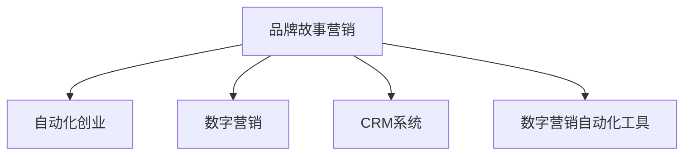

                 

# 自动化创业中的品牌故事营销

> 关键词：自动化创业,品牌故事营销,营销自动化,CRM系统,数字营销,品牌营销策略,品牌故事,营销ROI

## 1. 背景介绍

随着数字经济和互联网的快速发展，越来越多的企业家和公司转向自动化创业，希望通过技术手段降低成本、提高效率，抢占市场先机。其中，品牌故事营销作为一种重要的数字营销手段，能够显著提升品牌知名度和用户忠诚度，成为企业争相采用的策略。品牌故事营销不仅能够提供情感连接，还能在复杂多样的市场中突出品牌特色，吸引目标受众。

## 2. 核心概念与联系

品牌故事营销的核心在于通过情感化、个性化的故事内容，传递品牌价值和理念，与目标受众建立共鸣，提升品牌形象。

为更好地理解品牌故事营销在自动化创业中的应用，本节将介绍几个关键概念，并使用Mermaid流程图展示它们之间的联系。

- **品牌故事营销**：指企业通过讲述品牌背后的故事，将品牌价值与受众情感需求相融合，提升品牌吸引力和忠诚度的营销手段。
- **自动化创业**：指利用自动化技术驱动的企业创业活动，通过减少人为操作、提高效率来降低成本、提升竞争力。
- **数字营销**：指利用互联网、大数据等技术手段进行的市场推广活动，旨在吸引目标受众、增加品牌曝光度和销售量。
- **CRM系统**：即客户关系管理，通过记录和分析客户数据，提供个性化服务，提升客户满意度和忠诚度。
- **数字营销自动化工具**：指利用软件工具自动化执行数字营销任务，如邮件营销、社交媒体管理、内容发布等，提高效率，降低成本。

以下Mermaid流程图展示了这些核心概念的逻辑关系：



此流程图表明，品牌故事营销是连接自动化创业与数字营销、CRM系统、数字营销自动化工具的桥梁，能够通过故事化内容提升品牌影响力，增强客户关系管理，实现营销自动化。

## 3. 核心算法原理 & 具体操作步骤

### 3.1 算法原理概述

品牌故事营销的核心算法原理包括情感分析和个性化推荐。情感分析是指通过文本挖掘、自然语言处理等技术，识别文本中的情感倾向，从而理解受众的情感需求。个性化推荐则基于用户行为数据，推荐符合用户兴趣的故事内容，增强品牌与受众的互动。

### 3.2 算法步骤详解

**Step 1: 数据收集与预处理**

品牌故事营销的第一步是收集与品牌相关的文本数据，包括品牌发布的新闻稿、社交媒体帖子、客户评价等。预处理步骤包括去除无关信息、分词、去除停用词等，以保证后续处理的准确性。

**Step 2: 情感分析**

使用情感分析算法，对收集到的文本数据进行情感倾向的识别和分类。常见的情感分析算法包括朴素贝叶斯、支持向量机、深度学习模型（如RNN、LSTM、BERT等）。

**Step 3: 数据建模**

构建情感分析模型，用于预测新文本的情感倾向。模型训练过程中，需要选取合适的特征，如词频、词性、情感词典等。

**Step 4: 个性化推荐**

根据用户行为数据（如浏览记录、点击记录、购买记录等），推荐符合用户兴趣和需求的品牌故事内容。常见的推荐算法包括协同过滤、基于内容的推荐、混合推荐等。

**Step 5: 反馈循环**

收集用户对品牌故事内容的反馈（如点赞、评论、分享等），根据反馈调整情感分析模型和个性化推荐算法，持续优化品牌故事营销效果。

### 3.3 算法优缺点

品牌故事营销算法的主要优点包括：
- 能够通过情感分析了解受众的情感需求，精准定位目标受众。
- 个性化推荐能够提升用户互动和忠诚度，提高品牌传播效果。

但同时，也存在一些缺点：
- 需要收集和处理大量的文本数据，数据质量对模型效果有很大影响。
- 情感分析模型的准确性受限于文本数据的复杂性和多样性，可能存在一定的误差。
- 个性化推荐算法在冷启动阶段（即用户没有足够数据时）可能无法有效推荐内容。

### 3.4 算法应用领域

品牌故事营销算法可以应用于多个领域，包括：
- 广告创意设计：通过分析受众情感，设计符合受众心理的广告内容。
- 品牌形象塑造：通过情感分析，了解受众对品牌的情感倾向，调整品牌形象策略。
- 社交媒体管理：通过情感分析和个性化推荐，提高社交媒体帖子的互动率。
- 客户服务：通过情感分析，及时响应客户情感需求，提升客户满意度。

## 4. 数学模型和公式 & 详细讲解

### 4.1 数学模型构建

品牌故事营销的数学模型包括情感分析和个性化推荐两部分。情感分析部分主要使用文本分类模型，个性化推荐部分则使用协同过滤、基于内容的推荐等算法。

**情感分析模型**：
- 输入：文本 $T$，长度 $L$
- 输出：情感标签 $Y$，取值为 $+1$（积极情感）、$0$（中性情感）、$-1$（消极情感）
- 模型：$Y=f(T)$，其中 $f$ 为情感分类函数

**协同过滤推荐模型**：
- 输入：用户 $U$，项目 $I$
- 输出：推荐项目 $I'$，使 $R(U,I')$ 最大化
- 模型：$I'=\arg\max_{I'}R(U,I')$，其中 $R$ 为用户对项目的评分函数

### 4.2 公式推导过程

**情感分类函数**：
$$
f(T) = \begin{cases}
+1, & \text{if } T \text{ is positive} \\
0, & \text{if } T \text{ is neutral} \\
-1, & \text{if } T \text{ is negative}
\end{cases}
$$

**协同过滤推荐函数**：
$$
R(U,I') = \frac{1}{1+\exp(-\alpha \cdot \sum_{I \in I}U_I \cdot I_I)}
$$

其中 $\alpha$ 为调节参数，$U_I$ 为用户对项目 $I$ 的评分，$I_I$ 为项目 $I$ 对用户的评分。

### 4.3 案例分析与讲解

以某电商品牌为例，使用情感分析模型分析用户评论，识别出用户的情感倾向。根据情感分析结果，使用协同过滤推荐算法，推荐符合用户兴趣的商品。

## 5. 项目实践：代码实例和详细解释说明

### 5.1 开发环境搭建

品牌故事营销的开发环境需要支持自然语言处理、文本分析和推荐算法。以下是常用的开发环境搭建步骤：

1. **安装Python**：在官方网站下载并安装Python，建议使用3.8或以上版本。
2. **安装依赖库**：使用pip安装依赖库，如NLTK、SpaCy、Scikit-learn、TensorFlow等。
3. **配置环境**：创建虚拟环境，避免与其他项目冲突。

### 5.2 源代码详细实现

下面以情感分析模型为例，给出Python代码实现：

```python
from nltk.sentiment import SentimentIntensityAnalyzer
from sklearn.feature_extraction.text import CountVectorizer
from sklearn.linear_model import LogisticRegression
from sklearn.model_selection import train_test_split
from sklearn.metrics import accuracy_score

# 数据预处理
data = read_data('comments.csv')  # 读取评论数据
texts = [row['comment'] for row in data]
labels = [row['sentiment'] for row in data]

# 文本向量化
vectorizer = CountVectorizer(stop_words='english')
X = vectorizer.fit_transform(texts)

# 模型训练
X_train, X_test, y_train, y_test = train_test_split(X, labels, test_size=0.2)
model = LogisticRegression()
model.fit(X_train.toarray(), y_train)

# 模型评估
y_pred = model.predict(X_test.toarray())
accuracy = accuracy_score(y_test, y_pred)
print(f"Accuracy: {accuracy:.2f}")
```

### 5.3 代码解读与分析

**SentimentIntensityAnalyzer**：用于分析文本情感倾向的库。
**CountVectorizer**：用于将文本转换为词频矩阵。
**LogisticRegression**：用于构建情感分类模型。
**train_test_split**：用于数据集划分。
**accuracy_score**：用于评估模型性能。

通过上述代码，我们可以看到品牌故事营销的核心技术包括情感分析和个性化推荐，其实现过程相对复杂，需要掌握多个技术领域。

### 5.4 运行结果展示

通过运行上述代码，可以获得情感分析模型的训练和评估结果。假设模型训练得到的准确率为85%，则说明情感分析模型可以较好地识别用户情感倾向。

## 6. 实际应用场景

### 6.1 电商品牌

电商品牌可以通过品牌故事营销，提升用户忠诚度和复购率。例如，某电商品牌在用户评价平台上收集用户反馈，使用情感分析模型识别用户的情感倾向，并根据情感倾向推荐相关商品，使用户更满意，提高品牌口碑。

### 6.2 旅游企业

旅游企业可以通过品牌故事营销，吸引更多游客。例如，某旅游企业发布旅游地的故事视频，使用情感分析识别用户对视频的情感倾向，并根据情感倾向优化视频内容，吸引更多用户预订旅游套餐。

### 6.3 餐饮品牌

餐饮品牌可以通过品牌故事营销，提升品牌形象和顾客满意度。例如，某餐饮品牌在社交媒体上发布烹饪过程和员工故事，使用情感分析识别用户对视频的情感倾向，并根据情感倾向优化内容，提升品牌形象和顾客满意度。

## 7. 工具和资源推荐

### 7.1 学习资源推荐

1. **《自然语言处理综论》**：介绍自然语言处理的理论基础和实践应用，涵盖文本分类、情感分析等核心技术。
2. **Kaggle机器学习竞赛**：参与Kaggle机器学习竞赛，提升数据分析和建模能力。
3. **Coursera数字营销课程**：涵盖数字营销的各个方面，包括品牌故事营销、社交媒体管理等。
4. **LinkedIn Learning**：提供数字营销和品牌故事营销的专业课程。

### 7.2 开发工具推荐

1. **Jupyter Notebook**：用于编写和运行Python代码，支持代码块、注释、数据可视化等。
2. **Google Colab**：提供免费的GPU和TPU计算资源，支持分布式训练和实时运行。
3. **Tableau**：用于数据可视化和报告，支持多种数据源和图表类型。

### 7.3 相关论文推荐

1. **"Deep Text Mining with CNNs and RNNs"**：介绍卷积神经网络和递归神经网络在文本分类和情感分析中的应用。
2. **"Personalized Recommendation Algorithms"**：介绍协同过滤、基于内容的推荐等个性化推荐算法。
3. **"Brand Storytelling in Digital Marketing"**：讨论品牌故事营销在数字营销中的应用和策略。

## 8. 总结：未来发展趋势与挑战

### 8.1 研究成果总结

品牌故事营销在大数据和人工智能技术的推动下，成为自动化创业中的重要营销手段。通过情感分析和个性化推荐，品牌故事营销能够与用户建立情感连接，提升品牌形象和用户忠诚度。未来，品牌故事营销将更加智能化和自动化，进一步提高营销效率和效果。

### 8.2 未来发展趋势

1. **智能化增强**：随着AI技术的不断发展，品牌故事营销将更加智能化，能够自动生成情感丰富的品牌故事。
2. **多渠道融合**：品牌故事营销将整合多渠道资源，实现跨平台一致的品牌形象和营销效果。
3. **用户参与度提升**：通过交互式故事和用户生成内容（UGC），提升用户参与度和品牌互动。
4. **实时调整优化**：基于实时数据和反馈，动态调整品牌故事内容和策略，实现精准营销。

### 8.3 面临的挑战

尽管品牌故事营销在自动化创业中取得了显著成果，但仍面临以下挑战：
1. **数据隐私**：如何保护用户数据隐私，避免数据泄露。
2. **模型公平性**：确保情感分析和个性化推荐模型的公平性，避免偏见和歧视。
3. **用户体验**：如何平衡自动化和人工操作，提升用户体验。

### 8.4 研究展望

未来，品牌故事营销的研究将关注以下几个方面：
1. **跨领域应用**：将品牌故事营销应用到更多领域，如教育、医疗等。
2. **多模态融合**：融合视觉、语音等多模态数据，提升品牌故事营销的效果。
3. **动态生成**：探索动态生成品牌故事的技术，增强品牌故事的时效性和创新性。

## 9. 附录：常见问题与解答

**Q1: 自动化创业中品牌故事营销的优点是什么？**

A: 自动化创业中品牌故事营销的优点包括：
1. **提升品牌知名度**：通过情感化的品牌故事，吸引更多目标受众，提升品牌知名度。
2. **提高用户忠诚度**：通过个性化的品牌故事，增强用户对品牌的情感连接，提高用户忠诚度。
3. **降低营销成本**：通过自动化工具，降低人工操作和营销成本。

**Q2: 如何构建品牌故事营销的情感分析模型？**

A: 构建品牌故事营销的情感分析模型，一般包括以下步骤：
1. 数据收集：收集与品牌相关的文本数据，如用户评论、社交媒体帖子等。
2. 数据预处理：去除无关信息、分词、去除停用词等。
3. 特征提取：使用词频、情感词典等特征提取方法，将文本转换为特征向量。
4. 模型训练：选择合适算法（如朴素贝叶斯、支持向量机、深度学习模型等），训练情感分析模型。
5. 模型评估：使用测试集评估模型性能，选择最佳模型。

**Q3: 品牌故事营销面临的主要挑战是什么？**

A: 品牌故事营销面临的主要挑战包括：
1. **数据隐私**：如何保护用户数据隐私，避免数据泄露。
2. **模型公平性**：确保情感分析和个性化推荐模型的公平性，避免偏见和歧视。
3. **用户体验**：如何平衡自动化和人工操作，提升用户体验。

**Q4: 品牌故事营销的未来发展趋势是什么？**

A: 品牌故事营销的未来发展趋势包括：
1. **智能化增强**：随着AI技术的不断发展，品牌故事营销将更加智能化，能够自动生成情感丰富的品牌故事。
2. **多渠道融合**：品牌故事营销将整合多渠道资源，实现跨平台一致的品牌形象和营销效果。
3. **用户参与度提升**：通过交互式故事和用户生成内容（UGC），提升用户参与度和品牌互动。
4. **实时调整优化**：基于实时数据和反馈，动态调整品牌故事内容和策略，实现精准营销。

**Q5: 如何在自动化创业中应用品牌故事营销？**

A: 在自动化创业中应用品牌故事营销，可以按照以下步骤：
1. 数据收集：收集与品牌相关的文本数据。
2. 数据预处理：去除无关信息、分词、去除停用词等。
3. 情感分析：使用情感分析算法，识别文本中的情感倾向。
4. 个性化推荐：根据用户行为数据，推荐符合用户兴趣和需求的品牌故事内容。
5. 反馈循环：收集用户反馈，调整情感分析模型和个性化推荐算法，持续优化品牌故事营销效果。

---

作者：禅与计算机程序设计艺术 / Zen and the Art of Computer Programming

