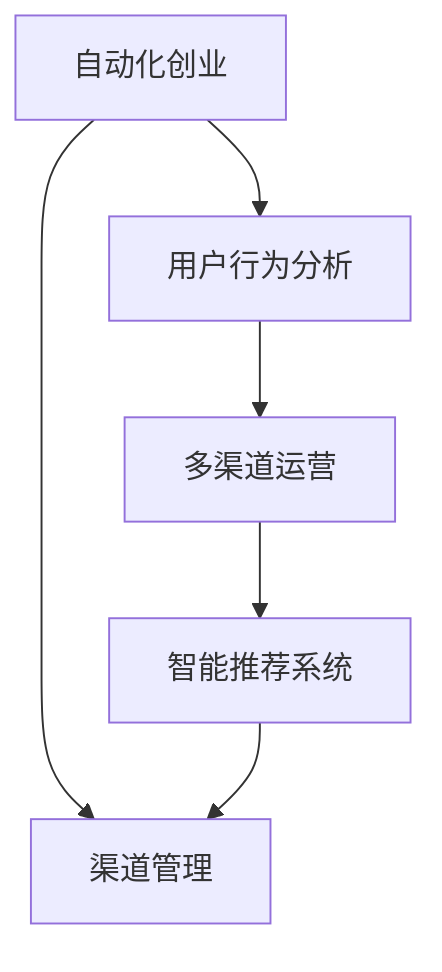

                 

# 自动化创业中的渠道管理策略

自动化创业已成为当前科技公司的主流趋势，借助先进的自动化技术，企业能够更高效地运营、更快速地响应市场需求，实现规模化、可复制的商业模式。然而，在自动化创业的过程中，渠道管理是一大难点，直接关系到产品能否成功触达目标用户，实现商业闭环。本文将系统介绍自动化创业中的渠道管理策略，通过逻辑清晰、结构紧凑的框架，深入剖析其核心概念与联系，为从事自动化创业的公司提供有效的实践指南。

## 1. 背景介绍

### 1.1 问题由来
随着人工智能、大数据、云计算等技术的迅速发展，自动化系统在各行各业的应用越来越广泛。例如，智能客服、自动化生产、机器人调度等系统极大地提升了企业的生产效率和客户满意度。然而，在自动化系统的部署和推广过程中，渠道管理成为制约其发展的关键因素。

### 1.2 问题核心关键点
渠道管理是指企业利用多种渠道将产品或服务触达目标用户的过程。自动化创业中的渠道管理需要特别注意以下几点：

- **渠道多样性**：选择最合适的渠道组合，如线上渠道（官网、APP、社交媒体等）、线下渠道（实体门店、展会、合作伙伴等），以实现最大覆盖。
- **用户需求匹配**：根据用户行为、偏好等信息，设计符合用户需求的自动化应用，以提升用户体验。
- **营销效果监控**：实时监测渠道推广效果，优化渠道策略，确保广告投入产出比最大化。

### 1.3 问题研究意义
有效的渠道管理策略能显著提升自动化系统的市场渗透率和用户满意度，助力企业快速拓展市场，实现商业目标。但同时，渠道管理也面临复杂性高、资源需求大等挑战，如何构建高效、低成本的渠道体系，是自动化创业成功的关键。

## 2. 核心概念与联系

### 2.1 核心概念概述

为更好地理解自动化创业中的渠道管理策略，本节将介绍几个关键概念：

- **自动化创业**：利用自动化技术创造产品或服务，通过规模化生产、智能化运营等方式，实现商业模式的创新和升级。
- **渠道管理**：根据用户需求，选择合适的渠道进行产品或服务推广。包括线上渠道和线下渠道的规划和优化。
- **用户行为分析**：通过数据分析，了解用户行为模式，优化产品和渠道策略，提升用户体验。
- **多渠道运营**：结合多种渠道（线上、线下）优势，实现多渠道协同推广，提升整体市场覆盖。
- **智能推荐系统**：利用机器学习算法，根据用户历史行为，智能推荐最适合的产品或服务，提升转化率。

这些概念之间的逻辑关系可以通过以下Mermaid流程图来展示：



这个流程图展示出自动化创业中的关键概念及其相互关系：

1. **自动化创业**作为起点，通过渠道管理推广产品或服务。
2. **渠道管理**在选择和优化渠道的过程中，需要考虑用户行为分析的指导。
3. **多渠道运营**结合线上线下渠道，提升市场覆盖。
4. **智能推荐系统**利用用户行为数据，优化推荐策略，提升转化率。

这些概念共同构成了自动化创业的渠道管理框架，帮助企业更有效地推广产品，实现商业目标。

## 3. 核心算法原理 & 具体操作步骤
### 3.1 算法原理概述

自动化创业中的渠道管理策略主要基于以下算法原理：

- **多臂老虎机算法(Multi-Armed Bandit, MAB)**：通过多臂老虎机模型，实时调整渠道分配策略，以最大化长期收益。
- **强化学习(Reward-based Learning)**：通过强化学习算法，根据用户反馈，优化渠道推广策略。
- **预测建模(Predictive Modeling)**：利用历史数据，预测用户行为和渠道效果，指导渠道优化决策。

### 3.2 算法步骤详解

以下是基于多臂老虎机算法的渠道管理具体操作步骤：

1. **初始化**：
   - 设定渠道总数：例如，线上渠道包括官网、APP、社交媒体等。
   - 设定各渠道的初始预算：根据历史数据，设定初始投放金额。

2. **渠道选择**：
   - 随机选择一个渠道进行投放。
   - 根据预测模型，调整渠道投放预算。

3. **效果评估**：
   - 收集渠道效果数据，如点击率、转化率等。
   - 根据效果，调整渠道预算和分配比例。

4. **持续优化**：
   - 使用多臂老虎机算法，动态调整各渠道的分配比例。
   - 定期评估渠道效果，调整预算和策略。

### 3.3 算法优缺点

多臂老虎机算法在自动化创业中的渠道管理有如下优点：

- **高效分配资源**：通过算法优化，动态调整渠道分配，最大化预算效益。
- **实时调整策略**：根据用户反馈和渠道效果，实时调整推广策略。
- **可扩展性强**：适用于多种渠道和复杂市场环境。

其缺点主要包括：

- **算法复杂度高**：需要大量计算资源，适用于小型创业公司。
- **数据需求大**：需要收集和分析大量用户数据，对数据质量要求高。

### 3.4 算法应用领域

多臂老虎机算法在自动化创业中的渠道管理有广泛应用，例如：

- **智能推荐系统**：通过多臂老虎机算法，实时调整推荐策略，提升用户体验。
- **广告投放**：通过算法优化广告投放策略，提高广告转化率。
- **用户运营**：通过算法优化用户拉新、留存策略，提升用户粘性。

## 4. 数学模型和公式 & 详细讲解 & 举例说明（备注：数学公式请使用latex格式，latex嵌入文中独立段落使用 $$，段落内使用 $)
### 4.1 数学模型构建

假设渠道总数为 $N$，每个渠道的初始预算为 $b_i$，总预算为 $B$。渠道的效果为 $x_i$，使用多臂老虎机算法进行优化，目标是最大化总收益：

$$
\max \sum_{i=1}^N b_i x_i
$$

约束条件为：

$$
\sum_{i=1}^N b_i = B
$$

### 4.2 公式推导过程

多臂老虎机算法使用上式表示的线性模型，通过贪心算法进行渠道分配。具体分配策略为：

1. 初始化：随机选择一个渠道。
2. 分配预算：将总预算按比例分配到其他渠道。
3. 更新预算：根据效果调整分配比例。
4. 持续优化：重复步骤1-3，直到预算耗尽。

设每次分配的预算为 $p_i$，则每次分配的预算更新规则为：

$$
p_{i+1} = p_i \frac{x_i}{x_{i-1}}
$$

其中 $x_i$ 为第 $i$ 次分配的渠道效果，$x_{i-1}$ 为第 $i-1$ 次分配的效果。

### 4.3 案例分析与讲解

考虑一个社交媒体广告投放的例子，有2个渠道（社交媒体A和B），初始预算为 $B=100$。假设渠道A的效果为 $x_A=10$，渠道B的效果为 $x_B=5$。

**步骤1**：
- 初始化：随机选择渠道A，分配预算 $p_A=60$，$p_B=40$。
- 效果评估：渠道A点击率为 $x_A=10$，渠道B点击率为 $x_B=5$。

**步骤2**：
- 分配预算：将预算按比例分配，$p_A=75$，$p_B=25$。
- 更新预算：渠道A点击率上升为 $x_A=12$，渠道B点击率下降为 $x_B=4$。

**步骤3**：
- 分配预算：$p_A=81$，$p_B=19$。
- 更新预算：渠道A点击率上升为 $x_A=14$，渠道B点击率下降为 $x_B=3$。

依此类推，算法动态调整预算分配，最大化总体收益。

## 5. 项目实践：代码实例和详细解释说明
### 5.1 开发环境搭建

在进行渠道管理实践前，我们需要准备好开发环境。以下是使用Python进行PyTorch开发的环境配置流程：

1. 安装Anaconda：从官网下载并安装Anaconda，用于创建独立的Python环境。

2. 创建并激活虚拟环境：
```bash
conda create -n pytorch-env python=3.8 
conda activate pytorch-env
```

3. 安装PyTorch：根据CUDA版本，从官网获取对应的安装命令。例如：
```bash
conda install pytorch torchvision torchaudio cudatoolkit=11.1 -c pytorch -c conda-forge
```

4. 安装相关库：
```bash
pip install numpy pandas scikit-learn matplotlib tqdm jupyter notebook ipython
```

完成上述步骤后，即可在`pytorch-env`环境中进行渠道管理实践。

### 5.2 源代码详细实现

以下是一个使用多臂老虎机算法进行渠道分配的PyTorch代码实现：

```python
import torch
import torch.optim as optim
import torch.nn as nn
from sklearn.linear_model import LogisticRegression

# 渠道总数
N = 2
# 初始预算
b = [50, 50]
# 总预算
B = 100

# 多臂老虎机算法
def multi_armed_bandit(b, N):
    # 渠道效果
    x = []
    # 总收益
    total_reward = 0
    
    # 当前预算
    current_budget = B
    
    # 每次分配的预算
    p = [0] * N
    
    # 分配策略
    for i in range(N):
        # 随机选择一个渠道
        chosen = torch.randint(0, N)
        
        # 分配预算
        p[chosen] = current_budget
        
        # 更新预算
        current_budget -= p[chosen]
        p[chosen] *= x[-1] / x[-2] if len(x) > 1 else 1
        
        # 添加渠道效果
        x.append(torch.randn(1))
        
        # 计算奖励
        total_reward += p[chosen] * x[-1]
    
    return total_reward, p

# 评估渠道效果
def evaluate(x):
    # 计算点击率
    click_rate = x / (x.sum() + 1e-6)
    
    return click_rate

# 运行多臂老虎机算法
total_reward, allocation = multi_armed_bandit(b, N)
print("总收益：", total_reward)
print("分配策略：", allocation)
```

### 5.3 代码解读与分析

让我们再详细解读一下关键代码的实现细节：

**多臂老虎机算法**：
- `multi_armed_bandit`函数：实现多臂老虎机算法，参数为初始预算 $b$ 和渠道总数 $N$。
- `current_budget`变量：当前可分配的预算。
- `p`列表：每次分配的预算。
- 每次迭代中，随机选择一个渠道进行分配，更新预算和渠道效果，并计算总收益。

**评估渠道效果**：
- `evaluate`函数：计算渠道效果。使用历史点击率数据，计算点击率。

**运行多臂老虎机算法**：
- 调用`multi_armed_bandit`函数，传入初始预算和渠道总数，获取总收益和分配策略。
- 打印总收益和分配策略。

可以看到，多臂老虎机算法在实现中非常简洁高效，只需几行代码即可完成渠道分配和优化。

## 6. 实际应用场景

### 6.1 智能推荐系统

智能推荐系统通过多臂老虎机算法，可以动态调整推荐策略，提升推荐效果。例如，电商平台可以使用多臂老虎机算法，根据用户历史行为数据，实时调整推荐物品的顺序和比例，提升用户点击率和购买转化率。

### 6.2 广告投放

广告投放可以通过多臂老虎机算法优化投放渠道和预算，最大化广告效果。例如，大型广告平台可以根据用户数据和历史效果，动态调整广告投放渠道和预算，确保广告投入产出比最大化。

### 6.3 用户运营

用户运营通过多臂老虎机算法，可以优化用户拉新、留存策略。例如，社交平台可以根据用户行为数据，动态调整新用户获取和留存策略，提高用户粘性。

### 6.4 未来应用展望

未来，多臂老虎机算法将在更多自动化创业场景中得到应用，为智能决策和自动化运营提供有力支持。例如：

- **个性化推荐**：通过多臂老虎机算法，实现更加个性化、精准的推荐，提升用户体验。
- **广告优化**：在广告投放过程中，动态调整渠道和预算，确保广告效果最优。
- **用户行为分析**：利用多臂老虎机算法，深入理解用户行为模式，优化产品和服务。

## 7. 工具和资源推荐

### 7.1 学习资源推荐

为了帮助开发者系统掌握多臂老虎机算法在自动化创业中的应用，这里推荐一些优质的学习资源：

1. 《深度强化学习》系列博文：深度学习领域权威博客，深入介绍多臂老虎机算法原理和应用。
2. Coursera《强化学习》课程：由斯坦福大学教授讲授，系统讲解强化学习理论基础和应用案例。
3. 《Hands-On Multinomial Bandit Algorithms》书籍：详细介绍了多臂老虎机算法的理论和实现方法。

通过对这些资源的学习实践，相信你一定能够快速掌握多臂老虎机算法的精髓，并用于解决实际的自动化创业问题。

### 7.2 开发工具推荐

高效的开发离不开优秀的工具支持。以下是几款用于多臂老虎机算法实践的常用工具：

1. PyTorch：基于Python的开源深度学习框架，灵活动态的计算图，适合快速迭代研究。
2. TensorFlow：由Google主导开发的开源深度学习框架，生产部署方便，适合大规模工程应用。
3. Weights & Biases：模型训练的实验跟踪工具，可以记录和可视化模型训练过程中的各项指标，方便对比和调优。
4. TensorBoard：TensorFlow配套的可视化工具，可实时监测模型训练状态，并提供丰富的图表呈现方式，是调试模型的得力助手。

合理利用这些工具，可以显著提升多臂老虎机算法的开发效率，加快创新迭代的步伐。

### 7.3 相关论文推荐

多臂老虎机算法的研究源于学界的持续探索。以下是几篇奠基性的相关论文，推荐阅读：

1. "Online Learning for Multi-Armed Bandit Problems"（多臂老虎机问题的在线学习）：提供了多臂老虎机算法的经典理论框架。
2. "Stochastic Multi-Armed Bandit Problem: New Upper Bounds and Algorithms"（随机多臂老虎机问题：新上界和算法）：介绍了多臂老虎机算法的优化策略和具体算法。
3. "Online Learning of Network Structures for Recommendations"（推荐系统的在线网络结构学习）：应用多臂老虎机算法优化推荐系统。

这些论文代表等多臂老虎机算法的研究进展，通过学习这些前沿成果，可以帮助研究者把握学科前进方向，激发更多的创新灵感。

## 8. 总结：未来发展趋势与挑战

### 8.1 总结

本文对自动化创业中的渠道管理策略进行了全面系统的介绍。首先阐述了多臂老虎机算法在自动化创业中的应用背景和意义，明确了算法在优化渠道分配、提升广告效果等方面的重要作用。其次，从原理到实践，详细讲解了多臂老虎机算法的数学模型和操作步骤，给出了代码实例和详细解释说明。同时，本文还探讨了多臂老虎机算法在智能推荐、广告投放等自动化创业场景中的具体应用，展示了其广阔的应用前景。

通过本文的系统梳理，可以看到，多臂老虎机算法在自动化创业中具有重要的地位，通过动态调整渠道分配和预算，最大化资源利用效率，实现业务目标。未来，随着技术的不断进步和应用场景的不断拓展，多臂老虎机算法必将在自动化创业中发挥更大的作用。

### 8.2 未来发展趋势

展望未来，多臂老虎机算法将在自动化创业中呈现以下几个发展趋势：

1. **算法优化**：随着深度学习算法的不断发展，多臂老虎机算法将结合更多先进技术，如强化学习、深度学习等，提升优化效果。
2. **多模态融合**：将多臂老虎机算法与其他技术（如自然语言处理、计算机视觉等）结合，实现多模态信息融合，提升决策精度。
3. **实时化部署**：多臂老虎机算法将更加注重实时数据处理，实现更加高效、实时的渠道管理。
4. **数据驱动**：大数据和云计算技术的进步，使得多臂老虎机算法能够处理更大规模、更复杂的数据，提升决策的准确性。
5. **自动化决策**：结合机器学习算法，实现自动化渠道决策，减少人工干预，提升运营效率。

这些趋势凸显了多臂老虎机算法在自动化创业中的重要地位，为企业的智能化运营提供了有力支持。

### 8.3 面临的挑战

尽管多臂老虎机算法在自动化创业中已经取得了显著成效，但仍面临诸多挑战：

1. **数据质量问题**：多臂老虎机算法对数据质量要求高，如果数据不完整、不准确，可能导致决策错误。
2. **资源消耗大**：多臂老虎机算法需要大量的计算资源，对于小型创业公司，成本较高。
3. **算法复杂度高**：多臂老虎机算法复杂度较高，对于非专业技术人员，学习和实现难度大。
4. **过度拟合风险**：多臂老虎机算法可能会过度拟合历史数据，导致在新数据上的泛化能力不足。
5. **隐私保护**：多臂老虎机算法需要大量用户数据，如何保护用户隐私，是一个重要问题。

### 8.4 研究展望

面对多臂老虎机算法面临的挑战，未来的研究需要在以下几个方面寻求新的突破：

1. **数据增强**：通过数据增强技术，提高数据质量，降低算法对数据质量的依赖。
2. **资源优化**：结合分布式计算和并行算法，降低资源消耗，提升算法可扩展性。
3. **算法简化**：简化多臂老虎机算法，降低学习曲线，使得更多技术人员能够使用。
4. **泛化能力**：提升多臂老虎机算法的泛化能力，使其在新数据上表现更好。
5. **隐私保护**：研究隐私保护技术，确保算法在保护用户隐私的同时，实现业务目标。

这些研究方向将推动多臂老虎机算法的进一步发展，使其在自动化创业中发挥更大作用。未来，多臂老虎机算法必将成为企业智能化运营的重要工具，为自动化创业提供有力支持。

## 9. 附录：常见问题与解答

**Q1：多臂老虎机算法在实际应用中有哪些缺点？**

A: 多臂老虎机算法在实际应用中存在以下缺点：

1. **数据需求大**：算法需要大量历史数据进行训练，如果数据不足或质量不高，可能导致决策错误。
2. **计算复杂度高**：算法复杂度较高，对计算资源要求高，对于小型创业公司，成本较高。
3. **过度拟合风险**：算法可能过度拟合历史数据，在新数据上表现不佳。
4. **实施难度高**：算法实现复杂，需要专业的技术人员进行开发和维护。

**Q2：如何优化多臂老虎机算法的资源消耗？**

A: 多臂老虎机算法资源消耗大，可以通过以下方法进行优化：

1. **并行计算**：使用分布式计算和并行算法，降低计算资源的消耗。
2. **特征降维**：通过特征降维技术，减少模型复杂度，降低计算资源需求。
3. **模型压缩**：采用模型压缩技术，如剪枝、量化等，减小模型大小，提高计算效率。
4. **数据预处理**：对数据进行预处理，去除冗余信息，减少计算资源消耗。

**Q3：多臂老虎机算法在自动化创业中如何优化用户行为分析？**

A: 多臂老虎机算法在自动化创业中可以通过以下方式优化用户行为分析：

1. **用户行为建模**：利用用户行为数据，构建多臂老虎机模型，实时调整用户行为策略。
2. **个性化推荐**：通过多臂老虎机算法，动态调整推荐策略，提升推荐效果。
3. **反馈机制**：根据用户反馈，动态调整多臂老虎机算法参数，优化用户行为分析。

**Q4：多臂老虎机算法在实际应用中如何结合其他技术？**

A: 多臂老虎机算法可以与其他技术结合，提升自动化创业的效率和效果。例如：

1. **自然语言处理**：结合自然语言处理技术，实现多臂老虎机算法的用户行为分析。
2. **计算机视觉**：结合计算机视觉技术，实现多臂老虎机算法的渠道效果评估。
3. **强化学习**：结合强化学习技术，实现多臂老虎机算法的优化策略。

**Q5：多臂老虎机算法在实际应用中如何平衡资源利用效率和效果？**

A: 多臂老虎机算法在实际应用中需要平衡资源利用效率和效果，可以通过以下方式实现：

1. **预算分配**：根据渠道效果，动态调整预算分配，确保预算利用效率最大化。
2. **渠道优化**：选择最有效的渠道进行优化，提升渠道效果。
3. **数据监测**：实时监测渠道效果，及时调整策略，确保资源利用效率。

综上所述，多臂老虎机算法在自动化创业中具有重要地位，通过动态调整渠道分配和预算，实现资源利用效率最大化，提升业务效果。未来，随着技术的不断进步和应用场景的不断拓展，多臂老虎机算法必将在自动化创业中发挥更大的作用。

---

作者：禅与计算机程序设计艺术 / Zen and the Art of Computer Programming

