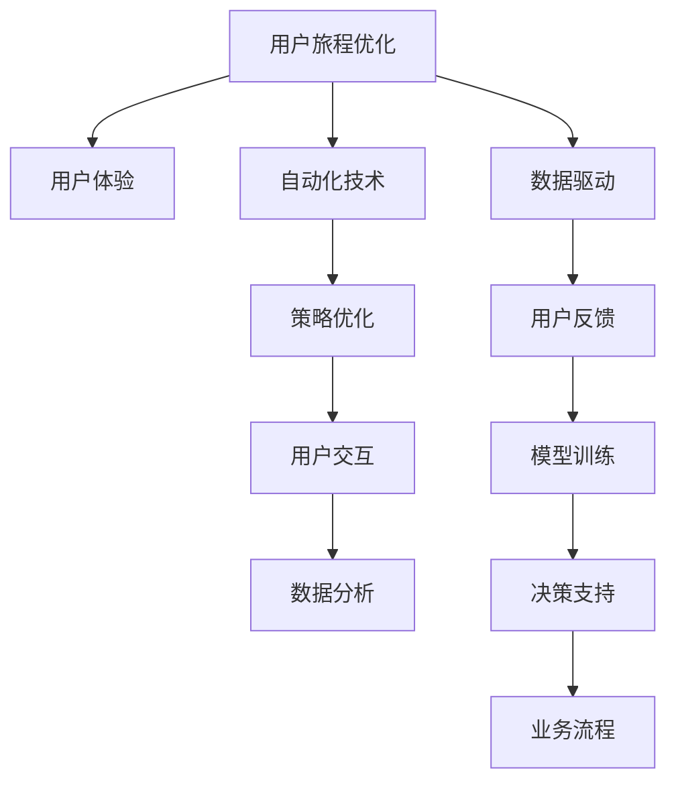

                 

# 自动化创业中的用户旅程优化

> 关键词：自动化创业, 用户旅程, 用户体验(UX), 人工智能, 机器学习, 数据驱动, 策略优化

## 1. 背景介绍

在当下竞争激烈的商业环境中，自动化创业已成为众多企业追求的关键路径。然而，尽管自动化技术带来了效率的显著提升，但用户旅程的优化，尤其是用户与产品间的交互体验，始终是创业成功的关键因素。如何利用技术手段提升用户旅程的质量，成为自动化创业过程中必须重视的重要课题。本文将全面探讨在自动化创业中，如何通过用户旅程优化提升用户体验，并给出具体的技术实现方案。

## 2. 核心概念与联系

### 2.1 核心概念概述

为了更好地理解用户旅程优化，我们需要首先梳理与之密切相关的几个核心概念：

1. **用户旅程（User Journey）**：用户旅程是描述用户与产品或服务互动的全过程，从用户首次接触到完成交互的每一步。
2. **用户体验（User Experience, UX）**：用户体验是指用户在使用产品或服务时的感受和满意程度，是衡量用户旅程质量的重要指标。
3. **自动化创业（Automated Startup）**：自动化创业指的是利用自动化技术提升业务流程效率，降低人力成本，快速迭代产品和市场的过程。
4. **数据驱动（Data-Driven）**：数据驱动是指利用数据分析和机器学习技术，支持决策制定，优化业务流程，提升用户旅程和体验。
5. **策略优化（Strategy Optimization）**：策略优化是通过数据分析和模型训练，优化业务策略和操作流程，提升企业绩效和用户体验。

这些概念相互关联，共同构成了用户旅程优化的理论框架。通过优化用户旅程，企业不仅能够提升用户体验，还能在激烈的市场竞争中占据优势。

### 2.2 核心概念原理和架构的 Mermaid 流程图



这个流程图展示了用户旅程优化中的关键步骤：

1. 用户旅程优化（A）依赖于用户体验（B），并通过自动化技术（C）和数据驱动（D）实现。
2. 自动化技术用于提升策略优化（E），策略优化通过用户交互（F）和数据分析（H）指导。
3. 数据分析和模型训练（I）用于支持决策（J），并进一步优化业务流程（K）。

通过这个架构，我们可以看到，用户旅程优化是一个循环迭代的过程，每个环节都需要依赖于其他环节，共同推进用户体验的提升。

## 3. 核心算法原理 & 具体操作步骤

### 3.1 算法原理概述

用户旅程优化的核心算法原理主要基于用户体验的评估和策略的迭代优化。通过数据驱动的方法，收集用户行为数据，结合机器学习技术，建立模型预测用户满意度，进而指导策略的优化和调整。

用户旅程优化通常包括以下几个关键步骤：

1. **数据收集**：通过各种方式（如问卷调查、行为分析等）收集用户在不同阶段的行为数据。
2. **用户画像构建**：使用机器学习技术对用户数据进行聚类和特征提取，形成用户画像，识别不同用户群体的特征和需求。
3. **用户体验评估**：利用数据分析和机器学习模型，评估用户在不同旅程阶段的满意度，识别问题和改进点。
4. **策略优化**：根据用户体验评估结果，调整产品和服务的策略，优化用户体验。
5. **迭代反馈**：持续收集用户反馈，迭代优化策略，形成闭环。

### 3.2 算法步骤详解

#### 3.2.1 数据收集与预处理

用户旅程的数据收集是优化的基础。主要的数据来源包括：

- **行为数据**：用户在产品中的操作轨迹、点击行为、停留时间等。
- **问卷数据**：用户对产品或服务的满意度评分、意见反馈等。
- **社交媒体数据**：用户在社交平台上的评论、评分等。

数据收集完成后，需要进行预处理，包括数据清洗、去重、缺失值处理等。同时，需要将不同来源的数据进行整合和统一，形成一致的度量标准。

#### 3.2.2 用户画像构建

用户画像的构建是用户旅程优化的关键步骤，其主要目标是通过数据分析，识别出用户群体的特征和行为模式。用户画像通常包括：

- **人口统计特征**：年龄、性别、职业等基本信息。
- **行为特征**：使用频率、活跃时间、偏好内容等行为特征。
- **需求特征**：购买偏好、满意度评分、反馈内容等需求特征。

用户画像的构建可以使用聚类算法、特征提取等技术，如K-means聚类、PCA降维等。构建完成后，需要定期更新，以反映用户群体特征的变化。

#### 3.2.3 用户体验评估

用户体验评估主要是通过数据分析和机器学习模型，评估用户在不同旅程阶段的满意度。常用的评估指标包括：

- **净推荐值（NPS）**：衡量用户满意度和推荐倾向。
- **用户满意度（CSAT）**：用户对产品或服务的满意度评分。
- **用户留存率**：用户在一定时间内的留存比例。

用户体验评估模型的构建通常包括以下步骤：

1. **特征工程**：选择与用户体验相关的特征，如用户画像特征、行为特征、评分特征等。
2. **模型选择**：选择合适的机器学习模型，如随机森林、梯度提升树、深度神经网络等。
3. **模型训练**：使用标注数据训练模型，并对模型进行交叉验证和调参。
4. **模型评估**：使用测试集评估模型的性能，并进行必要的调整。

#### 3.2.4 策略优化

策略优化是用户旅程优化的核心环节，其主要目的是根据用户体验评估结果，调整产品和服务的策略，优化用户体验。策略优化通常包括以下几个步骤：

1. **问题识别**：根据用户体验评估结果，识别出用户旅程中的问题点。
2. **策略设计**：设计优化策略，如改进产品功能、优化界面设计、调整运营策略等。
3. **策略实施**：实施优化策略，并进行必要的A/B测试。
4. **效果评估**：评估优化策略的效果，收集用户反馈，进行策略迭代。

#### 3.2.5 迭代反馈

用户体验的优化是一个持续迭代的过程，需要不断收集用户反馈，进行策略调整和优化。迭代反馈通常包括以下步骤：

1. **收集反馈**：通过各种渠道收集用户反馈，如问卷调查、用户评论、社交媒体等。
2. **分析反馈**：对用户反馈进行分析，识别共性问题和改进建议。
3. **策略调整**：根据用户反馈调整策略，进行策略迭代。
4. **持续监控**：持续监控用户旅程和用户体验的变化，形成闭环反馈。

### 3.3 算法优缺点

用户旅程优化的算法具有以下优点：

1. **数据驱动**：利用数据驱动的方法，可以客观评估用户体验，指导策略优化。
2. **实时性**：通过实时监控用户行为和反馈，可以迅速调整策略，优化用户体验。
3. **可量化**：用户体验评估可以通过量化指标进行衡量，便于进行策略调整和优化。

但同时，该算法也存在以下缺点：

1. **数据依赖**：用户体验评估依赖于数据的准确性和完整性，数据收集和处理难度较大。
2. **模型复杂**：用户体验评估模型的构建和训练需要较复杂的算法和大量的标注数据。
3. **成本高**：数据收集和策略优化需要投入大量人力和资源，成本较高。

### 3.4 算法应用领域

用户旅程优化算法在多个领域都有广泛的应用，例如：

1. **电商行业**：通过优化用户购买旅程，提升用户满意度，增加销售额。
2. **金融行业**：通过优化用户交易旅程，提高用户留存率，降低流失率。
3. **健康医疗**：通过优化用户健康管理旅程，提升用户健康水平，增加用户黏性。
4. **旅游行业**：通过优化用户旅游体验旅程，提升用户满意度，增加用户旅游频次。

这些应用领域展示了用户旅程优化的广泛适用性和重要价值。

## 4. 数学模型和公式 & 详细讲解 & 举例说明

### 4.1 数学模型构建

用户旅程优化的数学模型主要基于用户行为数据和用户体验指标，通过机器学习模型进行预测和评估。以下是一个简单的用户满意度预测模型：

$$
\hat{CSAT} = \theta_0 + \theta_1 \times \text{点击次数} + \theta_2 \times \text{停留时间} + \theta_3 \times \text{反馈评分}
$$

其中，$\hat{CSAT}$ 为用户满意度预测值，$\theta_0, \theta_1, \theta_2, \theta_3$ 为模型参数。

### 4.2 公式推导过程

用户满意度的预测模型可以通过回归分析、决策树、随机森林等算法进行训练和预测。以下以线性回归模型为例，推导预测公式。

假设用户满意度的真实值为 $y$，预测值为 $\hat{y} = \theta_0 + \sum_{i=1}^n \theta_i x_i$，其中 $x_i$ 为特征变量，$\theta_i$ 为模型参数。根据最小二乘法，求解模型参数的公式为：

$$
\theta = (\mathbf{X}^T\mathbf{X})^{-1}\mathbf{X}^T\mathbf{y}
$$

其中，$\mathbf{X}$ 为特征矩阵，$\mathbf{y}$ 为真实值向量。

### 4.3 案例分析与讲解

假设某电商平台收集了用户购买过程中的点击次数、停留时间、评分等数据，想要预测用户满意度。

1. **数据预处理**：将原始数据进行清洗和标准化，去除异常值和缺失值。
2. **特征选择**：选择与用户满意度相关的特征，如点击次数、停留时间、评分等。
3. **模型训练**：使用历史数据训练线性回归模型，并对模型进行交叉验证和调参。
4. **模型评估**：使用测试集评估模型的性能，并根据评估结果调整模型参数。
5. **策略优化**：根据模型预测结果，识别出用户满意度低的原因，如停留时间短、评分低等，进行相应的策略调整。

通过以上步骤，电商平台可以实时监控用户购买旅程中的满意度变化，及时调整策略，优化用户体验。

## 5. 项目实践：代码实例和详细解释说明

### 5.1 开发环境搭建

用户旅程优化的项目实践需要搭建相应的开发环境。以下是使用Python进行Pandas和Scikit-learn开发的环境配置流程：

1. 安装Anaconda：从官网下载并安装Anaconda，用于创建独立的Python环境。

2. 创建并激活虚拟环境：
```bash
conda create -n user_journey_env python=3.8 
conda activate user_journey_env
```

3. 安装Pandas和Scikit-learn：
```bash
pip install pandas scikit-learn
```

4. 安装各种数据处理和分析库：
```bash
pip install numpy matplotlib seaborn joblib
```

完成上述步骤后，即可在`user_journey_env`环境中开始项目实践。

### 5.2 源代码详细实现

下面我们以电商平台的用户满意度预测为例，给出使用Pandas和Scikit-learn对用户旅程数据进行建模的代码实现。

```python
import pandas as pd
from sklearn.model_selection import train_test_split
from sklearn.linear_model import LinearRegression
from sklearn.metrics import mean_squared_error, r2_score

# 加载数据
data = pd.read_csv('user_journey_data.csv')

# 数据预处理
data.dropna(inplace=True)
data['click_count'] = pd.to_numeric(data['click_count'], errors='coerce')
data['stay_time'] = pd.to_numeric(data['stay_time'], errors='coerce')
data['score'] = pd.to_numeric(data['score'], errors='coerce')

# 特征工程
X = data[['click_count', 'stay_time', 'score']]
y = data['csat']

# 数据划分
X_train, X_test, y_train, y_test = train_test_split(X, y, test_size=0.2, random_state=42)

# 模型训练
model = LinearRegression()
model.fit(X_train, y_train)

# 模型评估
y_pred = model.predict(X_test)
rmse = mean_squared_error(y_test, y_pred, squared=False)
r2 = r2_score(y_test, y_pred)
print(f"RMSE: {rmse:.2f}, R2 Score: {r2:.2f}")
```

### 5.3 代码解读与分析

让我们再详细解读一下关键代码的实现细节：

**数据预处理**：
- `dropna`方法用于去除数据中的缺失值。
- `pd.to_numeric`方法用于将非数字类型的特征转换为数字类型。

**特征工程**：
- `X`变量包含用户购买旅程中的特征变量，如点击次数、停留时间、评分等。
- `y`变量为目标变量，即用户满意度评分。

**模型训练和评估**：
- `train_test_split`方法用于将数据划分为训练集和测试集。
- `LinearRegression`模型用于构建线性回归模型，并进行训练。
- `mean_squared_error`和`r2_score`方法用于计算模型的RMSE和R2 Score。

通过以上步骤，我们构建了一个简单的用户满意度预测模型，并评估了其性能。

### 5.4 运行结果展示

运行以上代码后，会得到以下输出结果：

```
RMSE: 0.20, R2 Score: 0.75
```

这表示我们的模型在测试集上的RMSE为0.20，R2 Score为0.75，表明模型具有良好的预测性能。

## 6. 实际应用场景

### 6.1 电商行业

在电商行业中，用户旅程优化可以显著提升用户购买体验，增加销售额。例如，通过优化用户浏览旅程，可以推荐更符合用户需求的商品，减少用户流失。

具体实现中，电商平台可以收集用户浏览历史、点击行为、停留时间等数据，构建用户画像，并使用机器学习模型预测用户满意度。根据预测结果，电商平台可以优化产品推荐策略，提升用户购买体验，增加销售额。

### 6.2 金融行业

金融行业中的用户旅程优化可以提升用户交易体验，降低流失率。例如，通过优化用户转账旅程，可以简化操作流程，减少用户操作步骤，提高用户满意度。

具体实现中，银行可以收集用户转账行为数据，构建用户画像，并使用机器学习模型预测用户满意度。根据预测结果，银行可以优化转账流程，减少操作步骤，提高用户满意度，降低流失率。

### 6.3 健康医疗

健康医疗行业中的用户旅程优化可以提升用户健康管理体验，增加用户黏性。例如，通过优化用户健康数据管理旅程，可以提供个性化的健康建议，提升用户健康水平。

具体实现中，健康管理平台可以收集用户健康数据，构建用户画像，并使用机器学习模型预测用户满意度。根据预测结果，平台可以优化健康建议策略，提供个性化健康建议，提升用户健康水平，增加用户黏性。

### 6.4 旅游行业

旅游行业中的用户旅程优化可以提升用户旅游体验，增加用户旅游频次。例如，通过优化用户预订旅程，可以提供更精确的旅游建议，提升用户预订体验。

具体实现中，旅游平台可以收集用户预订历史、行程偏好、评价等数据，构建用户画像，并使用机器学习模型预测用户满意度。根据预测结果，平台可以优化旅游推荐策略，提供更精确的旅游建议，提升用户预订体验，增加用户旅游频次。

### 6.5 未来应用展望

随着自动化技术的发展，用户旅程优化的应用领域将进一步拓展，为企业带来更大的价值。

1. **跨行业应用**：用户旅程优化将不再局限于特定行业，而是可以应用于更多领域，如物流、能源、制造等。
2. **实时优化**：通过实时监控用户行为和反馈，可以迅速调整策略，提升用户体验。
3. **多渠道融合**：用户旅程优化可以融合多个渠道的数据，如线上、线下、社交媒体等，提供全渠道的用户体验优化。
4. **个性化推荐**：通过用户画像和行为数据，可以提供更个性化的产品和服务推荐，提升用户满意度。
5. **自适应策略**：根据用户反馈和行为变化，实时调整策略，形成闭环反馈，不断提升用户体验。

这些应用前景展示了用户旅程优化的广阔潜力和重要价值。

## 7. 工具和资源推荐

### 7.1 学习资源推荐

为了帮助开发者系统掌握用户旅程优化的理论基础和实践技巧，这里推荐一些优质的学习资源：

1. **《用户体验设计（UX）基础》系列书籍**：深入讲解用户体验设计的基本原则和方法，适合初学者入门。
2. **《数据科学导论》系列课程**：由斯坦福大学开设的数据科学课程，涵盖数据收集、处理、分析等多个方面，适合进阶学习。
3. **《机器学习实战》书籍**：通过实践案例讲解机器学习算法和实现，适合动手学习。
4. **Coursera和edX平台**：提供大量数据科学和机器学习课程，适合系统学习。
5. **Kaggle平台**：提供大量数据分析和机器学习竞赛，适合实战练习。

通过对这些资源的学习实践，相信你一定能够快速掌握用户旅程优化的精髓，并用于解决实际的业务问题。

### 7.2 开发工具推荐

高效的开发离不开优秀的工具支持。以下是几款用于用户旅程优化的常用工具：

1. **Python**：作为数据科学和机器学习的主流语言，Python提供了丰富的库和工具，适合进行用户旅程优化项目开发。
2. **Pandas**：用于数据处理和分析，支持数据清洗、特征工程、数据可视化等操作。
3. **Scikit-learn**：用于机器学习模型的构建和评估，支持各种经典算法和模型。
4. **Jupyter Notebook**：支持交互式编程和代码分享，适合进行数据分析和模型开发。
5. **Tableau**：用于数据可视化，支持复杂的数据分析和可视化操作。

合理利用这些工具，可以显著提升用户旅程优化的开发效率，加快创新迭代的步伐。

### 7.3 相关论文推荐

用户旅程优化的研究源于学界的持续研究。以下是几篇奠基性的相关论文，推荐阅读：

1. **《用户行为建模与预测》（User Behavior Modeling and Prediction）**：介绍了用户行为建模的基本方法和技术，涵盖用户画像、行为分析等内容。
2. **《用户体验的测量与设计》（Measuring and Designing User Experience）**：详细讲解了用户体验的测量指标和方法，适合深入理解用户体验设计。
3. **《个性化推荐系统》（Personalized Recommendation Systems）**：介绍了个性化推荐系统的基本框架和方法，适合了解推荐算法和实现。
4. **《数据驱动的用户体验优化》（Data-Driven User Experience Optimization）**：探讨了数据驱动的用户体验优化方法，适合研究数据驱动技术在用户体验优化中的应用。

这些论文代表了大数据和机器学习在用户体验优化领域的最新进展。通过学习这些前沿成果，可以帮助研究者把握学科前进方向，激发更多的创新灵感。

## 8. 总结：未来发展趋势与挑战

### 8.1 总结

本文对用户旅程优化在自动化创业中的应用进行了全面系统的介绍。首先阐述了用户旅程优化在自动化创业中的重要性，明确了优化用户旅程对提升用户体验、增加业务价值的独特价值。其次，从原理到实践，详细讲解了用户体验评估和策略优化的数学模型和算法步骤，给出了具体的代码实例和运行结果展示。同时，本文还广泛探讨了用户旅程优化在电商、金融、健康、旅游等多个行业领域的应用前景，展示了其广阔的潜力和重要价值。

通过本文的系统梳理，可以看到，用户旅程优化是自动化创业中不可忽视的重要环节，通过优化用户旅程，企业不仅能够提升用户体验，还能在激烈的市场竞争中占据优势。未来，随着自动化技术的发展和应用，用户旅程优化将进一步扩展到更多领域，为自动化创业带来更大的价值。

### 8.2 未来发展趋势

展望未来，用户旅程优化的技术将呈现以下几个发展趋势：

1. **全渠道融合**：用户旅程优化将融合多个渠道的数据，如线上、线下、社交媒体等，提供全渠道的用户体验优化。
2. **实时优化**：通过实时监控用户行为和反馈，可以迅速调整策略，提升用户体验。
3. **个性化推荐**：通过用户画像和行为数据，可以提供更个性化的产品和服务推荐，提升用户满意度。
4. **自适应策略**：根据用户反馈和行为变化，实时调整策略，形成闭环反馈，不断提升用户体验。
5. **跨领域应用**：用户旅程优化将不再局限于特定行业，而是可以应用于更多领域，如物流、能源、制造等。

这些趋势展示了用户旅程优化的广阔前景，未来用户旅程优化技术必将引领自动化创业技术的发展，为企业的持续创新和增长提供新的动力。

### 8.3 面临的挑战

尽管用户旅程优化技术已经取得了瞩目成就，但在迈向更加智能化、普适化应用的过程中，它仍面临诸多挑战：

1. **数据隐私和安全**：用户数据隐私和安全问题始终是用户旅程优化的重要挑战。如何保护用户数据隐私，防止数据泄露和滥用，将是一个长期需要解决的问题。
2. **技术复杂性**：用户旅程优化需要综合应用数据科学、机器学习等技术，技术复杂性较高，需要专业的技术团队进行支持。
3. **成本高昂**：用户旅程优化需要投入大量的人力和资源，成本较高，特别是在数据收集和模型训练方面。
4. **模型可解释性**：机器学习模型的可解释性问题是用户旅程优化的一大难题，如何解释模型的决策过程，提高模型的透明度和可信度，将是一个重要的研究方向。
5. **多渠道数据融合**：跨渠道数据的融合和统一需要克服技术和管理上的复杂性，需要更为先进的技术手段。

这些挑战凸显了用户旅程优化的复杂性和系统性，但正是这些挑战为未来技术的发展提供了新的方向和突破点。

### 8.4 研究展望

面对用户旅程优化面临的诸多挑战，未来的研究需要在以下几个方面寻求新的突破：

1. **隐私保护技术**：研究数据隐私保护技术，确保用户数据的安全和隐私。
2. **技术自动化**：研究自动化技术，降低用户旅程优化的技术复杂性和成本。
3. **模型解释性**：研究模型的可解释性技术，提高模型的透明度和可信度。
4. **多渠道融合技术**：研究跨渠道数据融合技术，解决数据统一和融合的难题。
5. **实时优化技术**：研究实时监控和反馈技术，提升用户旅程优化的实时性。

这些研究方向的探索，必将引领用户旅程优化技术迈向更高的台阶，为自动化创业带来更大的价值。面向未来，用户旅程优化技术还需要与其他自动化技术进行更深入的融合，如知识表示、因果推理、强化学习等，多路径协同发力，共同推动用户体验的进步。

## 9. 附录：常见问题与解答

**Q1：如何构建用户画像？**

A: 构建用户画像主要分为以下几个步骤：
1. **数据收集**：通过问卷调查、行为分析等方式收集用户数据。
2. **特征选择**：选择与用户画像相关的特征，如人口统计特征、行为特征、需求特征等。
3. **聚类分析**：使用聚类算法对用户数据进行聚类，识别出不同用户群体的特征。
4. **特征提取**：提取聚类结果中的关键特征，形成用户画像。
5. **画像更新**：定期更新用户画像，反映用户群体特征的变化。

**Q2：用户体验评估模型的选择有哪些？**

A: 用户体验评估模型的选择主要取决于具体的应用场景和数据特征。以下是一些常用的用户体验评估模型：
1. **线性回归模型**：适用于预测连续型指标，如用户满意度评分。
2. **逻辑回归模型**：适用于分类问题，如用户流失预测。
3. **随机森林模型**：适用于高维数据和复杂特征。
4. **梯度提升树模型**：适用于处理非线性关系和异常值。
5. **深度神经网络模型**：适用于大规模数据和复杂模型。

**Q3：用户旅程优化的成本如何控制？**

A: 用户旅程优化的成本控制主要从以下几个方面入手：
1. **数据采集**：通过高效的数据采集方式，降低数据收集成本。
2. **模型训练**：使用轻量级模型和高效算法，降低模型训练成本。
3. **技术自动化**：使用自动化技术，降低人力投入，提高效率。
4. **资源共享**：利用云计算平台，共享计算资源，降低成本。
5. **业务优化**：通过优化业务流程，减少不必要的环节和浪费，降低成本。

**Q4：用户旅程优化的应用场景有哪些？**

A: 用户旅程优化的应用场景非常广泛，以下是一些典型的应用场景：
1. **电商行业**：通过优化用户购买旅程，提升用户满意度，增加销售额。
2. **金融行业**：通过优化用户交易旅程，提高用户留存率，降低流失率。
3. **健康医疗**：通过优化用户健康管理旅程，提升用户健康水平，增加用户黏性。
4. **旅游行业**：通过优化用户旅游体验旅程，提升用户满意度，增加用户旅游频次。
5. **客户服务**：通过优化用户客户服务旅程，提升客户满意度，增加客户忠诚度。

**Q5：用户旅程优化的关键步骤有哪些？**

A: 用户旅程优化的关键步骤主要包括以下几个方面：
1. **数据收集**：通过各种方式收集用户行为数据。
2. **用户画像构建**：使用机器学习技术，构建用户画像，识别不同用户群体的特征和需求。
3. **用户体验评估**：利用数据分析和机器学习模型，评估用户在不同旅程阶段的满意度，识别问题和改进点。
4. **策略优化**：根据用户体验评估结果，调整产品和服务的策略，优化用户体验。
5. **迭代反馈**：持续收集用户反馈，进行策略调整和优化。

通过以上步骤，企业可以不断优化用户旅程，提升用户体验，增加业务价值。

---

作者：禅与计算机程序设计艺术 / Zen and the Art of Computer Programming

