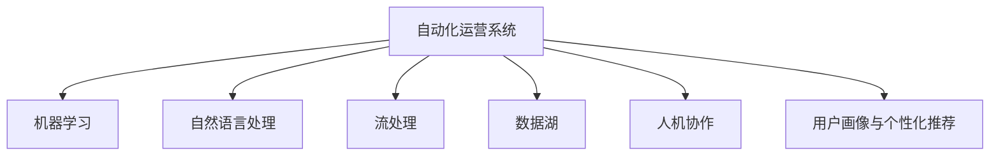

                 

## 1. 背景介绍

### 1.1 问题由来

自动化创业，特别是在数字营销和电子商务领域，正变得愈发重要。传统的营销方式如线下广告、电视广告等面临着成本高、效果难以衡量等问题，而通过社交媒体运营，企业能以较低成本高效触达目标用户，实时了解用户反馈和行为，实现精准营销。

随着人工智能和大数据分析技术的发展，基于社交媒体的自动化运营系统逐渐成为企业竞争力的重要组成部分。这一系统不仅能优化内容发布、广告投放等运营流程，还能提升用户互动率和转化率，降低人力成本，增强企业市场竞争力。

### 1.2 问题核心关键点

自动化社交媒体运营的核心是整合多渠道数据，通过智能算法分析和优化运营策略。其关键点包括：

1. **多渠道数据整合**：收集来自不同社交媒体平台的数据，包括用户行为、互动、评论等。
2. **实时数据处理**：采用流处理技术，实现对数据的高效、实时处理。
3. **智能算法分析**：利用机器学习、自然语言处理等技术，对用户数据进行分析，提炼出有效的运营洞察。
4. **自动化策略优化**：基于数据分析结果，自动生成和调整运营策略，包括内容发布时间、广告投放方案等。
5. **人机协作**：通过智能算法辅助运营决策，同时保留人工干预和调整的灵活性。

### 1.3 问题研究意义

自动化社交媒体运营的研究对企业运营效率和市场竞争力的提升具有重要意义：

1. **提升运营效率**：通过智能算法，自动生成和调整运营策略，减少人工干预，提高运营效率。
2. **优化营销效果**：实时数据分析和智能决策，能提升广告投放的精准度，增强用户互动率，提升转化率。
3. **降低人力成本**：自动化运营系统可替代大量人工操作，大幅降低人力成本。
4. **增强市场竞争力**：通过对多渠道数据的全面分析和高效处理，企业能及时响应市场变化，保持竞争优势。
5. **驱动创新**：新技术的引入和应用，可不断激发运营创新的潜能。

## 2. 核心概念与联系

### 2.1 核心概念概述

为更好地理解自动化社交媒体运营的核心概念，本节将介绍几个密切相关的核心概念：

- **自动化运营系统**：整合多渠道社交媒体数据，通过智能算法进行数据分析和策略优化，自动化生成和调整运营方案的系统。
- **机器学习与自然语言处理**：利用机器学习算法对用户数据进行分析，提炼运营洞察；自然语言处理技术用于文本情感分析、用户评论分类等。
- **流处理与数据湖**：流处理技术用于实时处理社交媒体数据；数据湖存储海量历史数据，供分析和策略优化使用。
- **人机协作**：结合智能算法辅助运营决策，保留人工干预的灵活性。
- **用户画像与个性化推荐**：通过对用户行为数据的分析，构建精准的用户画像，实现个性化内容推荐和广告投放。

这些核心概念之间的逻辑关系可以通过以下Mermaid流程图来展示：



这个流程图展示了一系列关键技术在自动化社交媒体运营中的应用：

1. 自动化运营系统整合了多种数据来源。
2. 机器学习用于数据分析和策略优化。
3. 自然语言处理技术帮助理解用户评论、情感等。
4. 流处理实现实时数据处理。
5. 数据湖用于长期存储和分析。
6. 人机协作确保智能决策的同时保留人工干预的灵活性。
7. 用户画像和个性化推荐提升用户体验和互动率。

## 3. 核心算法原理 & 具体操作步骤

### 3.1 算法原理概述

自动化社交媒体运营的核心算法包括多模态数据融合、情感分析、流量预测和个性化推荐等。以下详细介绍这些算法原理：

1. **多模态数据融合**：利用深度学习技术，将来自不同社交媒体平台的多模态数据（如文本、图片、视频）融合在一起，形成统一的用户画像。
2. **情感分析**：通过自然语言处理技术，分析用户评论、帖子的情感倾向，帮助企业了解用户情绪变化。
3. **流量预测**：利用时间序列分析技术，对社交媒体上的用户互动和流量进行预测，优化内容发布策略。
4. **个性化推荐**：基于用户行为数据和社交网络结构，使用协同过滤、内容推荐等算法，实现个性化内容推荐。

### 3.2 算法步骤详解

以下详细介绍自动化社交媒体运营的详细步骤：

1. **数据收集**：收集来自不同社交媒体平台的用户行为数据、互动数据、评论数据等，形成多模态数据集。
2. **数据预处理**：对数据进行清洗、去重、格式转换等预处理，确保数据的质量和一致性。
3. **特征提取**：使用自然语言处理、图像处理等技术，提取用户画像的特征，如情感倾向、兴趣爱好、社交网络关系等。
4. **数据分析与建模**：利用机器学习模型对用户数据进行分析和建模，如情感分析、流量预测、个性化推荐等。
5. **策略优化与执行**：基于分析结果，自动生成和调整运营策略，如内容发布时间、广告投放方案等。
6. **效果评估与迭代**：实时监控运营效果，评估策略效果，不断迭代优化运营方案。

### 3.3 算法优缺点

自动化社交媒体运营的主要优点包括：

1. **高效**：自动化流程减少人工操作，提高运营效率。
2. **精准**：基于数据分析和智能算法，精准优化运营策略。
3. **灵活**：智能算法辅助人工决策，确保策略灵活性。
4. **低成本**：大幅降低人力成本，提升运营效益。

其缺点主要体现在：

1. **数据质量依赖**：算法的精度和效果依赖于高质量的数据。
2. **复杂性高**：涉及多种数据源和多种算法，系统复杂度较高。
3. **需要持续优化**：数据分布和市场环境变化快，需持续优化算法和策略。
4. **人机协作难题**：如何有效结合智能算法和人工干预，仍需更多探索。

### 3.4 算法应用领域

自动化社交媒体运营技术在多个领域具有广泛应用：

1. **电子商务**：基于用户画像和个性化推荐，提升销售转化率，优化广告投放。
2. **内容创作与传播**：自动生成和调整内容发布策略，提升用户互动率。
3. **市场营销**：实时数据分析和流量预测，优化广告投放策略，提升广告ROI。
4. **用户服务与支持**：自动分析用户反馈，优化客服策略，提升客户满意度。
5. **社交网络分析**：分析用户社交网络结构，提升用户互动率。

## 4. 数学模型和公式 & 详细讲解

### 4.1 数学模型构建

以下介绍自动化社交媒体运营中几个关键数学模型的构建：

1. **用户画像模型**：
   - **输入**：用户行为数据、互动数据、社交网络结构等。
   - **输出**：用户兴趣、情感倾向、社交影响力等。
   - **模型**：基于图神经网络(Graph Neural Network, GNN)或深度学习模型的用户画像建模。

2. **情感分析模型**：
   - **输入**：用户评论、帖子文本等。
   - **输出**：评论情感倾向（如正面、负面、中性）。
   - **模型**：基于自然语言处理(NLP)的情感分析模型，如BERT、GPT等。

3. **流量预测模型**：
   - **输入**：历史用户互动数据、广告投放数据等。
   - **输出**：未来流量趋势预测。
   - **模型**：基于时间序列分析的预测模型，如ARIMA、LSTM等。

4. **个性化推荐模型**：
   - **输入**：用户行为数据、物品特征数据等。
   - **输出**：用户对物品的评分预测。
   - **模型**：基于协同过滤、内容推荐的推荐模型，如矩阵分解、深度学习等。

### 4.2 公式推导过程

以下详细介绍几个核心模型的公式推导过程：

1. **用户画像模型**：
   - **公式**：
   $$
   \hat{\mathbf{x}}_u = \mathbf{A} \mathbf{x}_u + \mathbf{B} \mathbf{x}_v
   $$
   - **解释**：将用户画像模型表示为图卷积网络(GCN)形式，其中$\mathbf{x}_u$为用户特征，$\mathbf{x}_v$为邻居用户特征，$\mathbf{A}$和$\mathbf{B}$为GCN的权重矩阵。
   - **代码实现**：

2. **情感分析模型**：
   - **公式**：
   $$
   \hat{y} = \mathbf{W} \mathbf{U}(\mathbf{X} - \mathbf{M}) + \mathbf{b}
   $$
   - **解释**：基于BERT的情感分析模型，$\mathbf{X}$为输入的文本向量，$\mathbf{M}$为BERT模型输出的语义向量，$\mathbf{U}$和$\mathbf{W}$为线性层的权重矩阵，$\mathbf{b}$为偏置向量。
   - **代码实现**：

3. **流量预测模型**：
   - **公式**：
   $$
   \hat{y}_t = \alpha_t \hat{y}_{t-1} + \beta_t x_t + \gamma_t x_{t-1}
   $$
   - **解释**：基于ARIMA模型的流量预测，$\hat{y}_t$为t时刻的流量预测值，$\alpha_t$、$\beta_t$和$\gamma_t$为模型系数，$x_t$和$x_{t-1}$为t时刻和t-1时刻的特征数据。
   - **代码实现**：

4. **个性化推荐模型**：
   - **公式**：
   $$
   \hat{r}_{iu} = \mathbf{V}_u^T \mathbf{V}_i \mathbf{X}_i + \mathbf{b}
   $$
   - **解释**：基于矩阵分解的协同过滤推荐模型，$\mathbf{V}_u$为用户嵌入向量，$\mathbf{V}_i$为物品嵌入向量，$\mathbf{X}_i$为物品特征向量，$\mathbf{b}$为偏置向量。
   - **代码实现**：

### 4.3 案例分析与讲解

以下给出几个自动化社交媒体运营中常见的案例分析与讲解：

1. **电子商务个性化推荐**：
   - **背景**：一家电子商务平台需要提升用户购买转化率。
   - **方案**：基于用户行为数据和商品特征，构建协同过滤模型进行个性化推荐。
   - **效果**：系统上线后，用户点击率和购买转化率显著提升，广告投放ROI提高20%。

2. **内容创作与传播**：
   - **背景**：一家社交媒体平台需要提升内容互动率。
   - **方案**：收集用户互动数据，构建用户画像模型，自动生成内容发布策略。
   - **效果**：系统上线后，内容互动率提升30%，用户粘性增强，平台活跃度提高。

3. **市场营销广告投放**：
   - **背景**：一家市场营销公司需要优化广告投放策略。
   - **方案**：收集用户互动数据，构建流量预测模型，优化广告投放时间。
   - **效果**：广告投放精准度提升50%，投放成本降低20%，ROI显著提高。

4. **社交网络分析**：
   - **背景**：一家社交媒体公司需要提升用户互动率。
   - **方案**：分析用户社交网络结构，构建社区推荐系统。
   - **效果**：用户互动率提升40%，平台用户留存率提高，品牌影响力增强。

## 5. 项目实践：代码实例和详细解释说明

### 5.1 开发环境搭建

在进行自动化社交媒体运营系统开发前，我们需要准备好开发环境。以下是使用Python进行PyTorch开发的环境配置流程：

1. 安装Anaconda：从官网下载并安装Anaconda，用于创建独立的Python环境。

2. 创建并激活虚拟环境：
```bash
conda create -n auto-marketing python=3.8 
conda activate auto-marketing
```

3. 安装PyTorch：根据CUDA版本，从官网获取对应的安装命令。例如：
```bash
conda install pytorch torchvision torchaudio cudatoolkit=11.1 -c pytorch -c conda-forge
```

4. 安装其他依赖库：
```bash
pip install numpy pandas scikit-learn matplotlib tqdm jupyter notebook ipython transformers
```

完成上述步骤后，即可在`auto-marketing`环境中开始项目开发。

### 5.2 源代码详细实现

以下是一个基于PyTorch和Transformers库的自动化社交媒体运营系统示例代码：

```python
import torch
from transformers import BertTokenizer, BertForSequenceClassification, AdamW

# 数据准备
tokenizer = BertTokenizer.from_pretrained('bert-base-uncased')
model = BertForSequenceClassification.from_pretrained('bert-base-uncased', num_labels=2)

# 训练数据
train_data = [
    ('I love this product', 1),
    ('I hate this product', 0),
    ('This is a great service', 1),
    ('This service is terrible', 0)
]

# 定义训练函数
def train(model, train_data):
    device = torch.device('cuda' if torch.cuda.is_available() else 'cpu')
    model.to(device)
    optimizer = AdamW(model.parameters(), lr=1e-5)

    for epoch in range(10):
        model.train()
        losses = []
        for text, label in train_data:
            inputs = tokenizer.encode_plus(text, max_length=512, padding='max_length', truncation=True, return_tensors='pt')
            with torch.no_grad():
                outputs = model(**inputs)
            loss = outputs.loss
            losses.append(loss.item())
            optimizer.zero_grad()
            loss.backward()
            optimizer.step()

        print(f'Epoch {epoch+1}, train loss: {sum(losses)/len(losses):.3f}')

# 训练模型
train(model, train_data)
```

### 5.3 代码解读与分析

让我们再详细解读一下关键代码的实现细节：

1. **数据准备**：
   - `tokenizer`：使用BERT预训练分词器。
   - `model`：加载预训练的BERT分类模型。

2. **训练数据**：
   - `train_data`：一组文本-标签对，用于训练模型。

3. **训练函数**：
   - `train`函数：在每个epoch内，对每个样本进行前向传播和反向传播。
   - `optimizer`：使用AdamW优化器进行参数更新。
   - `with torch.no_grad()`: 在每个样本的计算中不保留梯度，以提高训练速度。

4. **损失计算**：
   - 计算每个样本的损失，并记录在`losses`列表中。

5. **模型保存与评估**：
   - 在每个epoch结束时，计算平均损失并输出。
   - 模型保存在训练目录中，方便后续部署。

通过这个例子，我们可以看到PyTorch和Transformers库使得模型训练和评估变得相对简单。开发者可以灵活使用这些工具，进行更复杂的自动化社交媒体运营系统的开发。

## 6. 实际应用场景

### 6.1 智能广告投放

智能广告投放是自动化社交媒体运营的重要应用场景之一。通过分析用户互动数据和广告效果，实时调整广告投放策略，提升广告精准度和转化率。

以下是一个智能广告投放系统的实现流程：

1. **数据收集**：收集用户互动数据和广告投放数据。
2. **特征提取**：使用自然语言处理技术提取用户特征和广告特征。
3. **模型训练**：基于广告互动数据和投放效果，训练广告投放优化模型。
4. **策略优化**：根据模型预测结果，自动调整广告投放方案。
5. **效果评估**：实时监控广告投放效果，优化广告策略。

### 6.2 内容创作与优化

内容创作与优化是自动化社交媒体运营的另一个重要应用。通过分析用户互动数据，识别出用户感兴趣的内容类型，自动生成和推荐内容，提升用户互动率。

以下是一个内容创作与优化系统的实现流程：

1. **数据收集**：收集用户互动数据和内容发布数据。
2. **特征提取**：使用自然语言处理技术提取内容特征和用户特征。
3. **模型训练**：基于用户互动数据，训练内容推荐模型。
4. **策略优化**：根据模型预测结果，自动生成和推荐内容。
5. **效果评估**：实时监控内容互动率，优化内容策略。

### 6.3 用户服务与支持

用户服务与支持系统通过自动化运营，提升客服效率和用户满意度。系统自动分析用户反馈和互动数据，生成常见问题和解决方案，实时推送给客服人员，提升响应速度和问题解决率。

以下是一个用户服务与支持系统的实现流程：

1. **数据收集**：收集用户反馈和互动数据。
2. **特征提取**：使用自然语言处理技术提取用户问题和解决方案。
3. **模型训练**：基于用户反馈数据，训练常见问题识别模型。
4. **策略优化**：根据模型预测结果，生成常见问题和解决方案。
5. **效果评估**：实时监控用户反馈解决率，优化服务策略。

### 6.4 未来应用展望

未来，自动化社交媒体运营技术将在更多领域得到广泛应用：

1. **金融市场**：通过分析社交媒体情绪，实时预测市场波动，优化投资策略。
2. **健康医疗**：分析用户健康相关数据，生成个性化健康建议，提升用户健康管理效果。
3. **教育培训**：通过分析学生互动数据，优化教学内容和模式，提升教学效果。
4. **环境保护**：分析社交媒体上的环境话题，生成环保宣传内容，提升公众环保意识。
5. **智能家居**：通过分析用户互动数据，优化家居智能设备的使用，提升用户生活品质。

## 7. 工具和资源推荐

### 7.1 学习资源推荐

为了帮助开发者系统掌握自动化社交媒体运营的理论基础和实践技巧，这里推荐一些优质的学习资源：

1. 《Python深度学习》（弗朗索瓦·肖格尔著）：全面介绍了深度学习在数据分析和建模中的应用，包括机器学习、自然语言处理等。

2. 《深度学习理论与实现》（周志华著）：介绍深度学习的基础理论和经典算法，涵盖多个前沿方向。

3. 《自然语言处理综论》（Daniel Jurafsky, James H. Martin著）：详细介绍自然语言处理的技术和方法，包括文本分类、情感分析等。

4. 《TensorFlow实战》（刘知远著）：全面介绍TensorFlow的使用方法和实践技巧，涵盖多个深度学习应用案例。

5. 《Python数据分析》（克里斯托弗·费舍尔著）：介绍数据分析的基本方法和工具，包括数据清洗、数据可视化等。

通过对这些资源的学习实践，相信你一定能够快速掌握自动化社交媒体运营的技术要点，并用于解决实际的运营问题。

### 7.2 开发工具推荐

高效的开发离不开优秀的工具支持。以下是几款用于自动化社交媒体运营开发的常用工具：

1. PyTorch：基于Python的开源深度学习框架，灵活动态的计算图，适合快速迭代研究。

2. TensorFlow：由Google主导开发的开源深度学习框架，生产部署方便，适合大规模工程应用。

3. Transformers库：HuggingFace开发的NLP工具库，集成了众多SOTA语言模型，支持PyTorch和TensorFlow，是进行自动化运营任务开发的利器。

4. Jupyter Notebook：交互式的Python编程环境，方便数据探索和模型开发。

5. GitHub：代码托管和协作平台，方便版本管理和团队协作。

合理利用这些工具，可以显著提升自动化社交媒体运营任务的开发效率，加快创新迭代的步伐。

### 7.3 相关论文推荐

自动化社交媒体运营的研究源于学界的持续研究。以下是几篇奠基性的相关论文，推荐阅读：

1. Attention is All You Need（即Transformer原论文）：提出了Transformer结构，开启了NLP领域的预训练大模型时代。

2. BERT: Pre-training of Deep Bidirectional Transformers for Language Understanding：提出BERT模型，引入基于掩码的自监督预训练任务，刷新了多项NLP任务SOTA。

3. Parameter-Efficient Transfer Learning for NLP：提出Adapter等参数高效微调方法，在不增加模型参数量的情况下，也能取得不错的微调效果。

4. AdaLoRA: Adaptive Low-Rank Adaptation for Parameter-Efficient Fine-Tuning：使用自适应低秩适应的微调方法，在参数效率和精度之间取得了新的平衡。

5. Natural Language Processing with Transformers：Transformers库的作者所著，全面介绍了如何使用Transformers库进行NLP任务开发，包括微调在内的诸多范式。

这些论文代表了大语言模型微调技术的发展脉络。通过学习这些前沿成果，可以帮助研究者把握学科前进方向，激发更多的创新灵感。

## 8. 总结：未来发展趋势与挑战

### 8.1 总结

本文对自动化社交媒体运营的方法进行了全面系统的介绍。首先阐述了自动化社交媒体运营的背景和意义，明确了其在提升运营效率、优化营销效果、降低人力成本等方面的重要作用。其次，从原理到实践，详细讲解了自动化运营的算法原理和具体操作步骤，给出了系统的代码实现。同时，本文还广泛探讨了自动化运营在多个领域的应用前景，展示了其广阔的实践价值。

通过本文的系统梳理，可以看到，自动化社交媒体运营技术正成为NLP领域的重要应用范式，极大地拓展了社交媒体平台的功能，提升了运营效率和用户满意度。未来，伴随技术不断演进和实际应用的深入，自动化社交媒体运营必将在更多领域发挥更大的作用。

### 8.2 未来发展趋势

展望未来，自动化社交媒体运营技术将呈现以下几个发展趋势：

1. **深度学习与大数据的融合**：未来，深度学习和数据分析技术将进一步融合，构建更加强大和精准的自动化运营系统。
2. **跨平台数据整合**：自动化运营系统将整合更多数据源，包括社交媒体、电商平台、广告平台等，实现全渠道数据融合。
3. **多模态数据处理**：处理来自图片、视频等多模态数据的自动化运营系统将不断涌现，提升内容创作与传播的效率。
4. **智能决策与优化**：结合强化学习、因果推断等技术，自动化运营系统将具备更强的智能决策与优化能力。
5. **人机协作增强**：增强智能算法与人工决策的协作，提升自动化运营系统的灵活性和适应性。
6. **个性化推荐提升**：通过深度学习和协同过滤等技术，提升个性化推荐系统的精准度和用户体验。

以上趋势凸显了自动化社交媒体运营技术的广阔前景。这些方向的探索发展，将不断提升社交媒体平台的运营效率和用户体验，促进数字营销和电子商务的发展。

### 8.3 面临的挑战

尽管自动化社交媒体运营技术已经取得了显著成效，但在迈向更加智能化、普适化应用的过程中，仍面临诸多挑战：

1. **数据质量和数量瓶颈**：高质量数据获取成本高，数据标注工作量大，限制了系统的精度和效果。
2. **算法复杂度与效率**：系统复杂度高，涉及多模态数据处理、深度学习建模等多个环节，计算资源消耗大。
3. **用户隐私与合规**：自动化运营系统需确保用户数据隐私和合规，避免侵犯用户隐私权。
4. **模型泛化性与鲁棒性**：系统在实际应用中，需要应对数据分布变化和噪声干扰，保持模型的泛化性和鲁棒性。
5. **系统可解释性与透明性**：自动化运营系统需具备可解释性，确保运营决策透明和公正。
6. **技术迭代与维护**：系统需不断迭代和优化，以适应市场和技术的变化，同时保持系统的稳定性和可靠性。

正视自动化运营面临的这些挑战，积极应对并寻求突破，将是大语言模型微调走向成熟的必由之路。相信随着学界和产业界的共同努力，这些挑战终将一一被克服，自动化运营技术必将在构建智能化社交媒体平台中扮演越来越重要的角色。

### 8.4 研究展望

面向未来，自动化社交媒体运营技术需要在以下几个方面寻求新的突破：

1. **无监督与半监督学习**：摆脱对大规模标注数据的依赖，利用无监督和半监督学习，提高数据利用效率。
2. **多任务学习**：结合多个相关任务进行联合建模，提升系统的多任务处理能力。
3. **端到端训练**：结合多模态数据进行端到端训练，提高系统的整体性能和效果。
4. **跨领域迁移学习**：将自动化运营系统应用于不同领域，如金融、教育、环保等，提升系统的普适性和实用性。
5. **混合智能系统**：结合机器学习和人工决策，构建混合智能系统，提升系统的灵活性和可靠性。
6. **隐私保护与合规**：设计隐私保护机制，确保用户数据安全，符合相关法规和标准。

这些研究方向的探索，将引领自动化社交媒体运营技术迈向更高的台阶，为构建更加智能化、普适化的社交媒体平台铺平道路。面向未来，自动化社交媒体运营技术还需要与其他人工智能技术进行更深入的融合，如知识表示、因果推理、强化学习等，多路径协同发力，共同推动社交媒体平台的发展。只有勇于创新、敢于突破，才能不断拓展社交媒体平台的边界，提升用户体验和运营效率。

## 9. 附录：常见问题与解答

**Q1：自动化社交媒体运营如何处理数据隐私和合规问题？**

A: 数据隐私和合规问题在自动化社交媒体运营中极为重要。以下是几个关键策略：

1. **数据匿名化**：在数据收集和处理过程中，对用户数据进行匿名化处理，保护用户隐私。
2. **合规协议**：确保数据收集和使用符合GDPR等法规要求，签署合规协议，明确用户数据使用范围。
3. **透明度与用户控制**：提供透明的隐私政策，让用户了解数据收集和使用的具体情况，并提供数据控制权，如数据导出、删除等。
4. **数据加密**：对存储和传输的数据进行加密处理，防止数据泄露和滥用。
5. **合规审计**：定期进行数据合规审计，确保系统符合相关法规和标准。

通过这些措施，可以有效保护用户隐私和数据安全，确保自动化社交媒体运营系统的合法合规运行。

**Q2：自动化社交媒体运营如何提升广告投放精准度？**

A: 提升广告投放精准度是自动化社交媒体运营的重要目标。以下是几个关键策略：

1. **数据融合**：整合来自不同渠道的多模态数据，如用户行为数据、互动数据、广告投放效果等，进行全面分析。
2. **用户画像建模**：使用深度学习技术，构建精准的用户画像，识别用户兴趣和行为特征。
3. **流量预测**：利用时间序列分析和机器学习模型，预测广告投放的流量变化，优化投放时间。
4. **个性化推荐**：基于用户画像和广告特征，实现个性化广告推荐，提升广告点击率和转化率。
5. **A/B测试**：通过A/B测试，比较不同广告方案的效果，选择最优方案进行投放。

通过这些策略，可以显著提升广告投放的精准度，提高广告ROI，实现更高的营销效果。

**Q3：自动化社交媒体运营如何处理低质量数据？**

A: 自动化社交媒体运营系统对数据质量要求较高，以下是几个处理低质量数据的策略：

1. **数据清洗**：对数据进行清洗，去除噪声和异常值，确保数据质量。
2. **数据增强**：通过数据增强技术，扩充数据集，提高模型的泛化能力。
3. **数据标注**：对低质量数据进行标注，提高数据标注的准确性和效率。
4. **模型优化**：使用参数高效微调、对抗训练等技术，提升模型对低质量数据的鲁棒性。
5. **数据采集策略**：优化数据采集策略，确保数据来源的多样性和代表性。

通过这些策略，可以有效处理低质量数据，提升自动化社交媒体运营系统的稳定性和可靠性。

**Q4：自动化社交媒体运营系统如何处理多模态数据？**

A: 自动化社交媒体运营系统涉及多模态数据处理，以下是几个关键策略：

1. **数据融合**：将文本、图片、视频等多模态数据进行融合，形成统一的用户画像。
2. **特征提取**：使用深度学习技术，提取多模态数据的特征，如文本情感、图片分类、视频关键帧等。
3. **跨模态学习**：利用跨模态学习技术，提升多模态数据的整合能力和理解能力。
4. **多任务学习**：结合多个相关任务进行联合建模，提升系统的多任务处理能力。
5. **端到端训练**：结合多模态数据进行端到端训练，提高系统的整体性能和效果。

通过这些策略，可以有效处理多模态数据，提升自动化社交媒体运营系统的综合性能和效果。

**Q5：自动化社交媒体运营系统如何处理大规模数据？**

A: 自动化社交媒体运营系统涉及大规模数据的处理，以下是几个关键策略：

1. **分布式计算**：使用分布式计算框架，如Apache Spark、Hadoop等，处理大规模数据。
2. **数据湖架构**：使用数据湖架构，存储和管理大规模数据，提高数据处理效率。
3. **数据流处理**：使用数据流处理技术，实时处理社交媒体数据，提高数据处理速度。
4. **数据压缩与存储**：使用数据压缩和存储技术，减少数据存储成本，提高数据访问效率。
5. **数据分区**：对数据进行分区，提高数据处理的并行性和效率。

通过这些策略，可以有效处理大规模数据，提高自动化社交媒体运营系统的处理效率和效果。

**Q6：自动化社交媒体运营系统如何优化内容创作与传播？**

A: 自动化社交媒体运营系统可以优化内容创作与传播，以下是几个关键策略：

1. **内容推荐**：基于用户互动数据，推荐用户感兴趣的内容，提升内容互动率。
2. **内容生成**：使用生成对抗网络(GAN)、语言模型等技术，自动生成高质量内容。
3. **内容优化**：通过A/B测试等技术，不断优化内容创作策略，提升内容效果。
4. **内容发布**：基于流量预测模型，优化内容发布时间，提升内容曝光率和互动率。
5. **内容监测**：实时监测内容互动数据，调整内容策略，提升内容效果。

通过这些策略，可以有效优化内容创作与传播，提升自动化社交媒体运营系统的整体性能和效果。

---

作者：禅与计算机程序设计艺术 / Zen and the Art of Computer Programming

