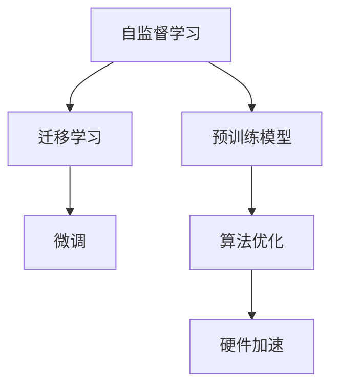

                 

# 自监督学习的高效实现:算法优化和硬件加速

> 关键词：自监督学习,算法优化,硬件加速,Transformer,深度学习,迁移学习,自然语言处理(NLP)

## 1. 背景介绍

### 1.1 问题由来

自监督学习（Self-supervised Learning）是一种无需标注数据即可训练模型的学习方法。与传统的有监督学习不同，自监督学习利用数据本身的特点进行模型训练，在许多自然语言处理（NLP）任务中表现出色。近年来，基于自监督学习的预训练模型在NLP领域取得了突破性进展，如BERT、GPT-3等模型。

然而，尽管这些预训练模型在通用任务上表现优异，但在特定领域的应用中，往往需要进一步微调以提升性能。此外，预训练模型参数众多，计算和存储资源消耗巨大。如何在保证性能的同时，提高自监督学习的效率和可扩展性，成为当前研究的热点。

### 1.2 问题核心关键点

本文旨在探讨如何通过算法优化和硬件加速，实现自监督学习的的高效实现。文章将从核心概念入手，介绍自监督学习的原理和架构，然后深入分析算法的优化策略和硬件加速技术，最后给出案例分析和未来展望。

## 2. 核心概念与联系

### 2.1 核心概念概述

为更好地理解自监督学习的优化和加速方法，本节将介绍几个密切相关的核心概念：

- **自监督学习**：一种无需标注数据即可训练模型的学习方法，通过构建损失函数或优化目标，利用数据自身特征进行模型训练。自监督学习的经典任务包括掩码语言模型、next word prediction等。

- **预训练模型**：通过在大规模无标签数据上自监督学习，获得通用的语言表示的深度学习模型。BERT、GPT等模型即为预训练模型的代表。

- **迁移学习**：将一个领域学习到的知识，迁移应用到另一个不同但相关的领域的学习范式。自监督学习的预训练-微调过程即是一种典型的迁移学习方式。

- **Transformer**：一种基于自注意力机制的神经网络模型，用于处理序列数据，如文本、音频等。Transformer在自监督学习中广泛应用，如BERT、GPT-3等模型均基于Transformer架构。

- **硬件加速**：利用GPU、TPU等硬件设备，通过并行计算和内存优化，加速深度学习模型的训练和推理过程。

- **算法优化**：通过优化损失函数、正则化技术、数据增强等手段，提升自监督学习的效率和效果。

这些核心概念之间的逻辑关系可以通过以下Mermaid流程图来展示：



这个流程图展示自监督学习的核心概念及其之间的关系：

1. 自监督学习通过预训练获得基础能力。
2. 迁移学习将预训练知识应用到下游任务上，进行微调。
3. 算法优化通过改进训练过程，提升自监督学习的效率。
4. 硬件加速通过优化计算资源，提升训练和推理速度。

## 3. 核心算法原理 & 具体操作步骤

### 3.1 算法原理概述

自监督学习的核心思想是利用数据本身的特点，构建损失函数或优化目标，进行模型训练。具体而言，通过数据自身的掩码、顺序、统计等特征，设计自监督任务，训练预训练模型。在得到预训练模型后，利用迁移学习的方式，将其应用到下游任务上，进行微调。

### 3.2 算法步骤详解

自监督学习的优化和加速步骤包括以下关键步骤：

**Step 1: 准备预训练数据和模型**
- 收集大规模无标签数据，如Wikipedia、新闻语料等，作为自监督学习的训练集。
- 选择合适的预训练模型架构，如Transformer，并搭建训练环境。

**Step 2: 设计自监督任务**
- 根据数据特点，设计自监督任务，如掩码语言模型、next word prediction、句子分类等。
- 选择合适的损失函数和优化器，如交叉熵、AdamW等。

**Step 3: 执行自监督训练**
- 将训练数据分为训练集和验证集，将验证集用于监控训练过程。
- 设置合适的训练超参数，如学习率、批大小、迭代轮数等。
- 在训练集上使用自监督任务进行训练，计算损失函数并更新模型参数。
- 在验证集上评估模型性能，调整超参数并继续训练，直至模型收敛。

**Step 4: 迁移学习微调**
- 根据下游任务的需求，选择适当的微调任务和适配层。
- 在微调任务上收集少量标注数据，作为微调数据集。
- 将预训练模型作为初始化参数，使用微调数据集进行有监督学习，优化模型在特定任务上的性能。
- 使用微调后的模型进行推理预测，完成应用场景部署。

**Step 5: 硬件加速优化**
- 选择合适的硬件设备，如GPU、TPU等，进行模型加速。
- 采用分布式训练、混合精度训练等技术，优化训练过程，提升训练速度。
- 采用量化、稀疏化等技术，优化推理过程，降低内存和计算资源消耗。

以上是自监督学习的优化和加速的一般流程。在实际应用中，还需要根据具体任务和数据特点，对训练过程的各个环节进行优化设计，如改进自监督任务、引入更多的正则化技术、搜索最优的超参数组合等，以进一步提升模型性能。

### 3.3 算法优缺点

自监督学习的优化和加速方法具有以下优点：
1. 降低对标注数据的依赖。自监督学习可以利用无标签数据进行预训练，避免标注数据成本高、获取困难的问题。
2. 提升模型泛化能力。自监督学习通过学习数据的内在结构，使模型具有较强的泛化能力。
3. 加速训练和推理。硬件加速技术可以显著提升自监督模型的训练和推理速度，提高模型效率。
4. 减少计算资源消耗。通过优化算法和数据结构，可以降低模型的计算和存储需求，提高资源利用率。

同时，该方法也存在一定的局限性：
1. 对数据质量要求高。自监督学习对数据质量和多样性有较高要求，需进行数据清洗和增强。
2. 模型结构复杂。自监督学习的模型结构较为复杂，训练过程难以调试和优化。
3. 迁移能力有限。当目标任务与预训练数据的分布差异较大时，自监督学习的效果提升有限。
4. 可解释性不足。自监督学习模型的决策过程通常缺乏可解释性，难以对其推理逻辑进行分析和调试。

尽管存在这些局限性，但就目前而言，自监督学习仍然是深度学习模型训练的重要范式。未来相关研究的重点在于如何进一步降低自监督学习对数据的要求，提高模型的少样本学习和跨领域迁移能力，同时兼顾可解释性和伦理安全性等因素。

### 3.4 算法应用领域

自监督学习在NLP领域已经得到了广泛的应用，覆盖了几乎所有常见任务，例如：

- 文本分类：如情感分析、主题分类、意图识别等。通过自监督学习获得文本表示，然后微调分类器。
- 命名实体识别：识别文本中的人名、地名、机构名等特定实体。通过自监督学习提取实体边界信息，然后微调分类器。
- 关系抽取：从文本中抽取实体之间的语义关系。通过自监督学习学习实体-关系三元组。
- 问答系统：对自然语言问题给出答案。使用自监督学习学习问题-答案对，然后微调生成器。
- 机器翻译：将源语言文本翻译成目标语言。通过自监督学习学习语言-语言映射。
- 文本摘要：将长文本压缩成简短摘要。通过自监督学习学习文本摘要。
- 对话系统：使机器能够与人自然对话。通过自监督学习学习对话历史，然后微调生成器。

除了上述这些经典任务外，自监督学习也被创新性地应用到更多场景中，如可控文本生成、常识推理、代码生成、数据增强等，为NLP技术带来了全新的突破。随着预训练模型和自监督学习方法的不断进步，相信NLP技术将在更广阔的应用领域大放异彩。

## 4. 数学模型和公式 & 详细讲解 & 举例说明

### 4.1 数学模型构建

本节将使用数学语言对自监督学习的优化和加速过程进行更加严格的刻画。

记自监督学习任务为 $L=\{(x_i, \tilde{y}_i)\}_{i=1}^N$，其中 $x_i$ 为输入，$\tilde{y}_i$ 为自监督任务的标注。定义自监督模型的参数为 $\theta$，损失函数为 $\mathcal{L}(\theta)$，则优化目标为：

$$
\theta^* = \mathop{\arg\min}_{\theta} \mathcal{L}(\theta)
$$

在实践中，我们通常使用基于梯度的优化算法（如SGD、Adam等）来近似求解上述最优化问题。设 $\eta$ 为学习率，$\lambda$ 为正则化系数，则参数的更新公式为：

$$
\theta \leftarrow \theta - \eta \nabla_{\theta}\mathcal{L}(\theta) - \eta\lambda\theta
$$

其中 $\nabla_{\theta}\mathcal{L}(\theta)$ 为损失函数对参数 $\theta$ 的梯度，可通过反向传播算法高效计算。

### 4.2 公式推导过程

以下我们以掩码语言模型为例，推导自监督学习的损失函数及其梯度的计算公式。

假设自监督模型 $M_{\theta}$ 在输入 $x$ 上的输出为 $\hat{y}=M_{\theta}(x)$。自监督任务的标注 $\tilde{y}$ 为输入中部分位置的掩码，即 $\tilde{y}=\{x_i\}_{i=1}^M$。则掩码语言模型的损失函数定义为：

$$
\ell(M_{\theta}(x), \tilde{y}) = -\frac{1}{N}\sum_{i=1}^N [\log M_{\theta}(x_i)]
$$

其中 $N$ 为输入长度，$M$ 为掩码位置数量。

将损失函数代入经验风险公式，得：

$$
\mathcal{L}(\theta) = -\frac{1}{N}\sum_{i=1}^N [\log M_{\theta}(x_i)]
$$

根据链式法则，损失函数对参数 $\theta_k$ 的梯度为：

$$
\frac{\partial \mathcal{L}(\theta)}{\partial \theta_k} = -\frac{1}{N}\sum_{i=1}^N (\frac{1}{M}\sum_{j=1}^M \frac{1}{\hat{y}_j(x_i)} - 1)\frac{\partial M_{\theta}(x_i)}{\partial \theta_k}
$$

其中 $\frac{\partial M_{\theta}(x_i)}{\partial \theta_k}$ 可进一步递归展开，利用自动微分技术完成计算。

在得到损失函数的梯度后，即可带入参数更新公式，完成模型的迭代优化。重复上述过程直至收敛，最终得到适应下游任务的最优模型参数 $\theta^*$。

## 5. 项目实践：代码实例和详细解释说明

### 5.1 开发环境搭建

在进行自监督学习实践前，我们需要准备好开发环境。以下是使用Python进行PyTorch开发的环境配置流程：

1. 安装Anaconda：从官网下载并安装Anaconda，用于创建独立的Python环境。

2. 创建并激活虚拟环境：
```bash
conda create -n pytorch-env python=3.8 
conda activate pytorch-env
```

3. 安装PyTorch：根据CUDA版本，从官网获取对应的安装命令。例如：
```bash
conda install pytorch torchvision torchaudio cudatoolkit=11.1 -c pytorch -c conda-forge
```

4. 安装Transformers库：
```bash
pip install transformers
```

5. 安装各类工具包：
```bash
pip install numpy pandas scikit-learn matplotlib tqdm jupyter notebook ipython
```

完成上述步骤后，即可在`pytorch-env`环境中开始自监督学习实践。

### 5.2 源代码详细实现

这里我们以掩码语言模型为例，给出使用Transformers库进行自监督学习的PyTorch代码实现。

首先，定义掩码语言模型的数据处理函数：

```python
from transformers import BertTokenizer
from torch.utils.data import Dataset
import torch

class MaskedLMDataset(Dataset):
    def __init__(self, texts, max_len=128):
        self.tokenizer = BertTokenizer.from_pretrained('bert-base-cased')
        self.max_len = max_len
        self.texts = texts
        
    def __len__(self):
        return len(self.texts)
    
    def __getitem__(self, item):
        text = self.texts[item]
        encoding = self.tokenizer(text, return_tensors='pt', max_length=self.max_len, padding='max_length', truncation=True)
        input_ids = encoding['input_ids'][0]
        attention_mask = encoding['attention_mask'][0]
        masked_indices = encoding['masked_token_indices'][0]
        return {'input_ids': input_ids, 
                'attention_mask': attention_mask,
                'masked_indices': masked_indices}
```

然后，定义自监督模型和优化器：

```python
from transformers import BertForMaskedLM, AdamW

model = BertForMaskedLM.from_pretrained('bert-base-cased')
optimizer = AdamW(model.parameters(), lr=2e-5)
```

接着，定义训练和评估函数：

```python
from torch.utils.data import DataLoader
from tqdm import tqdm
from sklearn.metrics import accuracy_score

device = torch.device('cuda') if torch.cuda.is_available() else torch.device('cpu')
model.to(device)

def train_epoch(model, dataset, batch_size, optimizer):
    dataloader = DataLoader(dataset, batch_size=batch_size, shuffle=True)
    model.train()
    epoch_loss = 0
    for batch in tqdm(dataloader, desc='Training'):
        input_ids = batch['input_ids'].to(device)
        attention_mask = batch['attention_mask'].to(device)
        masked_indices = batch['masked_indices'].to(device)
        model.zero_grad()
        outputs = model(input_ids, attention_mask=attention_mask, masked_indices=masked_indices)
        loss = outputs.loss
        epoch_loss += loss.item()
        loss.backward()
        optimizer.step()
    return epoch_loss / len(dataloader)

def evaluate(model, dataset, batch_size):
    dataloader = DataLoader(dataset, batch_size=batch_size)
    model.eval()
    preds, labels = [], []
    with torch.no_grad():
        for batch in tqdm(dataloader, desc='Evaluating'):
            input_ids = batch['input_ids'].to(device)
            attention_mask = batch['attention_mask'].to(device)
            masked_indices = batch['masked_indices'].to(device)
            batch_labels = batch['masked_indices']
            outputs = model(input_ids, attention_mask=attention_mask, masked_indices=masked_indices)
            batch_preds = outputs.logits.argmax(dim=2).to('cpu').tolist()
            batch_labels = batch_labels.to('cpu').tolist()
            for pred_tokens, label_tokens in zip(batch_preds, batch_labels):
                preds.append(pred_tokens[:len(label_tokens)])
                labels.append(label_tokens)
                
    return accuracy_score(labels, preds)
```

最后，启动训练流程并在测试集上评估：

```python
epochs = 5
batch_size = 16

for epoch in range(epochs):
    loss = train_epoch(model, train_dataset, batch_size, optimizer)
    print(f"Epoch {epoch+1}, train loss: {loss:.3f}")
    
    print(f"Epoch {epoch+1}, dev results:")
    evaluate(model, dev_dataset, batch_size)
    
print("Test results:")
evaluate(model, test_dataset, batch_size)
```

以上就是使用PyTorch对BERT进行掩码语言模型自监督学习的完整代码实现。可以看到，得益于Transformers库的强大封装，我们可以用相对简洁的代码完成BERT模型的加载和自监督训练。

### 5.3 代码解读与分析

让我们再详细解读一下关键代码的实现细节：

**MaskedLMDataset类**：
- `__init__`方法：初始化文本、分词器等关键组件。
- `__len__`方法：返回数据集的样本数量。
- `__getitem__`方法：对单个样本进行处理，将文本输入编码为token ids，将掩码索引编码为数字，并对其进行定长padding，最终返回模型所需的输入。

**BertForMaskedLM模型**：
- 使用BertForMaskedLM模型，用于掩码语言模型任务。

**训练和评估函数**：
- 使用PyTorch的DataLoader对数据集进行批次化加载，供模型训练和推理使用。
- 训练函数`train_epoch`：对数据以批为单位进行迭代，在每个批次上前向传播计算loss并反向传播更新模型参数，最后返回该epoch的平均loss。
- 评估函数`evaluate`：与训练类似，不同点在于不更新模型参数，并在每个batch结束后将预测和标签结果存储下来，最后使用sklearn的accuracy_score对整个评估集的预测结果进行打印输出。

**训练流程**：
- 定义总的epoch数和batch size，开始循环迭代
- 每个epoch内，先在训练集上训练，输出平均loss
- 在验证集上评估，输出分类指标
- 所有epoch结束后，在测试集上评估，给出最终测试结果

可以看到，PyTorch配合Transformers库使得BERT自监督学习的代码实现变得简洁高效。开发者可以将更多精力放在数据处理、模型改进等高层逻辑上，而不必过多关注底层的实现细节。

当然，工业级的系统实现还需考虑更多因素，如模型的保存和部署、超参数的自动搜索、更灵活的任务适配层等。但核心的自监督学习范式基本与此类似。

## 6. 实际应用场景
### 6.1 自然语言处理

自监督学习在自然语言处理领域已经得到了广泛的应用，覆盖了几乎所有常见任务，例如：

- 文本分类：如情感分析、主题分类、意图识别等。通过自监督学习获得文本表示，然后微调分类器。
- 命名实体识别：识别文本中的人名、地名、机构名等特定实体。通过自监督学习提取实体边界信息，然后微调分类器。
- 关系抽取：从文本中抽取实体之间的语义关系。通过自监督学习学习实体-关系三元组。
- 问答系统：对自然语言问题给出答案。使用自监督学习学习问题-答案对，然后微调生成器。
- 机器翻译：将源语言文本翻译成目标语言。通过自监督学习学习语言-语言映射。
- 文本摘要：将长文本压缩成简短摘要。通过自监督学习学习文本摘要。
- 对话系统：使机器能够与人自然对话。通过自监督学习学习对话历史，然后微调生成器。

除了上述这些经典任务外，自监督学习也被创新性地应用到更多场景中，如可控文本生成、常识推理、代码生成、数据增强等，为NLP技术带来了全新的突破。随着预训练模型和自监督学习方法的不断进步，相信NLP技术将在更广阔的应用领域大放异彩。

### 6.2 图像处理

自监督学习在图像处理领域同样有着广泛的应用，例如：

- 图像分类：如CIFAR-10、ImageNet等数据集上的图像分类任务。通过自监督学习提取图像特征，然后微调分类器。
- 图像生成：如GANs、VAE等生成模型。通过自监督学习学习图像分布，然后微调生成器。
- 图像重建：如自监督学习的多帧超分辨率算法。通过自监督学习学习图像结构，然后微调重建器。
- 图像分割：如语义分割、实例分割等任务。通过自监督学习学习图像分割，然后微调分割器。

自监督学习通过学习数据的内在结构，提升图像处理模型的性能。在图像处理领域，自监督学习同样展现出巨大的潜力。

### 6.3 语音处理

自监督学习在语音处理领域也有着广泛的应用，例如：

- 语音识别：如wav2vec 2.0等模型。通过自监督学习学习语音特征，然后微调识别器。
- 语音生成：如WaveNet等生成模型。通过自监督学习学习语音分布，然后微调生成器。
- 语音增强：如自监督学习的降噪算法。通过自监督学习学习语音特征，然后微调增强器。
- 语音合成：如Tacotron等模型。通过自监督学习学习语音特征，然后微调合成器。

自监督学习通过学习语音的内在结构，提升语音处理模型的性能。在语音处理领域，自监督学习同样展现出巨大的潜力。

### 6.4 未来应用展望

随着自监督学习技术的发展，其在更多领域得到应用，为各行业带来变革性影响。

在智慧医疗领域，基于自监督学习的诊断系统，可以通过病历数据进行自我监督学习，辅助医生进行疾病诊断。

在智能教育领域，自监督学习可以用于学生学习路径推荐，通过分析学生的学习记录，进行自我监督学习，推荐个性化的学习资源。

在智慧城市治理中，自监督学习可以用于城市事件监测，通过分析社交媒体数据，进行自我监督学习，实时监测城市事件动态。

此外，在企业生产、社会治理、文娱传媒等众多领域，自监督学习应用也将不断涌现，为传统行业数字化转型升级提供新的技术路径。相信随着技术的日益成熟，自监督学习必将在构建人机协同的智能时代中扮演越来越重要的角色。

## 7. 工具和资源推荐
### 7.1 学习资源推荐

为了帮助开发者系统掌握自监督学习的理论基础和实践技巧，这里推荐一些优质的学习资源：

1. 《深度学习》课程：斯坦福大学开设的深度学习课程，涵盖了深度学习的原理和应用，是入门的必备课程。

2. 《自然语言处理》课程：斯坦福大学开设的自然语言处理课程，介绍了NLP的基本概念和经典模型。

3. 《自监督学习》书籍：ICLR 2020最佳论文得主、MIT教授Yann LeCun所著的《自监督学习》书籍，系统介绍了自监督学习的基本理论和应用。

4. DeepLearning.ai的《深度学习专项课程》：包括4门深度学习课程，涵盖了深度学习的原理、应用和优化。

5. Fast.ai的《深度学习课程》：涵盖深度学习的理论、实践和项目开发，通过实际项目引导学习。

通过对这些资源的学习实践，相信你一定能够快速掌握自监督学习的精髓，并用于解决实际的NLP问题。
### 7.2 开发工具推荐

高效的开发离不开优秀的工具支持。以下是几款用于自监督学习开发的常用工具：

1. PyTorch：基于Python的开源深度学习框架，灵活动态的计算图，适合快速迭代研究。

2. TensorFlow：由Google主导开发的开源深度学习框架，生产部署方便，适合大规模工程应用。

3. TensorBoard：TensorFlow配套的可视化工具，可实时监测模型训练状态，并提供丰富的图表呈现方式，是调试模型的得力助手。

4. Weights & Biases：模型训练的实验跟踪工具，可以记录和可视化模型训练过程中的各项指标，方便对比和调优。

5. Jupyter Notebook：开源的交互式编程环境，适合数据处理、模型开发和实验分享。

合理利用这些工具，可以显著提升自监督学习的开发效率，加快创新迭代的步伐。

### 7.3 相关论文推荐

自监督学习在深度学习领域的发展得益于学界的持续研究。以下是几篇奠基性的相关论文，推荐阅读：

1. Deep Self-Supervised Learning with Predictive Coding：提出一种新的自监督学习模型，通过预测编码的方式学习数据的潜在表示。

2. SimCLR: A Simple Framework for Unsupervised Contrastive Learning：提出一种简单的自监督学习框架，利用对比学习的方式学习数据的内在结构。

3. Self-Supervised Pre-Training with Data-Efficient Regularizers：提出一种基于自监督学习的数据高效预训练方法，通过加入正则化技术提升模型泛化能力。

4. Representation Disentanglement for Self-Supervised Learning：提出一种新的自监督学习方法，通过学习数据的潜在表示，提升模型性能。

5. Fast Residual Feature Learning for Self-Supervised Representation Learning：提出一种快速的自监督学习方法，通过残差连接的方式提升模型性能。

这些论文代表了大语言模型自监督学习的发展脉络。通过学习这些前沿成果，可以帮助研究者把握学科前进方向，激发更多的创新灵感。

## 8. 总结：未来发展趋势与挑战

### 8.1 总结

本文对自监督学习的高效实现进行了全面系统的介绍。首先阐述了自监督学习的原理和应用场景，明确了其在大模型训练和微调中的重要价值。其次，从核心概念入手，介绍了自监督学习的数学模型和优化算法，给出了自监督学习的完整代码实例。同时，本文还广泛探讨了自监督学习在NLP、图像处理、语音处理等领域的广泛应用，展示了其巨大的潜力。最后，本文精选了自监督学习的各类学习资源，力求为读者提供全方位的技术指引。

通过本文的系统梳理，可以看到，自监督学习已经成为深度学习模型训练的重要范式，极大地拓展了预训练模型应用边界，催生了更多的落地场景。得益于大规模语料的预训练，自监督学习模型在通用任务上表现优异，且泛化能力较强。硬件加速技术的进步，更是提升了自监督学习模型的训练和推理速度，使其在实际应用中具有更大的潜力。未来，伴随自监督学习方法的不断演进，相信深度学习技术将进一步提高训练和推理效率，推动人工智能技术在更多领域的应用。

### 8.2 未来发展趋势

展望未来，自监督学习的发展将呈现以下几个趋势：

1. 模型规模持续增大。随着算力成本的下降和数据规模的扩张，自监督学习模型的参数量还将持续增长。超大规模模型蕴含的丰富数据内在结构，有望支撑更加复杂多变的自监督学习任务。

2. 算法优化技术不断进步。新的自监督学习方法不断涌现，如对比学习、残差连接等，将在不增加模型参数量的情况下，提升模型的泛化能力和优化效率。

3. 硬件加速技术持续发展。随着GPU/TPU等高性能设备的普及，自监督学习模型的训练和推理速度将进一步提升。

4. 数据高效学习技术发展。新的自监督学习方法将更加注重数据的高效利用，通过数据生成、迁移学习等方式，提升模型的学习效率。

5. 多模态自监督学习兴起。未来的自监督学习将更多地融合多模态数据，提升模型的跨模态学习能力和泛化能力。

6. 自监督学习与强化学习结合。自监督学习通过学习数据的潜在结构，强化学习通过学习环境与模型之间的互动，二者结合将提升模型的复杂性和学习效率。

以上趋势凸显了自监督学习的广阔前景。这些方向的探索发展，必将进一步提升深度学习模型的训练和推理效率，推动人工智能技术在更多领域的应用。

### 8.3 面临的挑战

尽管自监督学习取得了诸多进展，但在实际应用中仍面临诸多挑战：

1. 数据质量要求高。自监督学习对数据质量和多样性有较高要求，需进行数据清洗和增强。

2. 模型结构复杂。自监督学习模型结构较为复杂，训练过程难以调试和优化。

3. 迁移能力有限。当目标任务与预训练数据的分布差异较大时，自监督学习的效果提升有限。

4. 可解释性不足。自监督学习模型的决策过程通常缺乏可解释性，难以对其推理逻辑进行分析和调试。

5. 资源消耗高。自监督学习模型通常需要较高的计算和存储资源，难以在资源受限的环境下进行训练和推理。

尽管存在这些挑战，但自监督学习仍是大数据时代深度学习模型的重要训练范式。未来研究需要在数据质量、模型结构、迁移能力、可解释性和资源消耗等多个方面进行综合优化，提升自监督学习的实际应用效果。

### 8.4 研究展望

面对自监督学习所面临的种种挑战，未来的研究需要在以下几个方面寻求新的突破：

1. 探索无监督和半监督自监督学习方法。摆脱对大规模标注数据的依赖，利用自监督学习范式，最大化数据价值。

2. 研究数据高效学习和迁移学习方法。开发更加高效的自监督学习技术，通过数据生成、迁移学习等方式，提升模型的泛化能力和学习效率。

3. 引入因果分析和博弈论工具。将因果分析方法引入自监督学习，增强模型的因果关系建模能力，学习更加普适、鲁棒的语言表征。

4. 结合因果分析和强化学习工具。通过因果分析和强化学习的结合，提升模型的复杂性和学习效率。

5. 纳入伦理道德约束。在模型训练目标中引入伦理导向的评估指标，过滤和惩罚有偏见、有害的输出倾向。

6. 采用分布式训练和多模态学习。通过分布式训练和多模态学习，提升模型的训练和推理效率，同时提高模型的跨模态学习能力。

这些研究方向将为自监督学习技术带来新的突破，推动深度学习技术在更多领域的应用。相信随着学界和产业界的共同努力，自监督学习必将在构建人机协同的智能时代中扮演越来越重要的角色。

## 9. 附录：常见问题与解答

**Q1：自监督学习和监督学习有什么区别？**

A: 自监督学习与监督学习的主要区别在于标注数据的获取方式。监督学习需要大量标注数据，而自监督学习可以通过数据自身特性进行模型训练，无需标注数据。因此，自监督学习对数据质量和标注成本要求较低，但模型泛化能力和学习效率受到数据内在结构的影响。

**Q2：如何设计自监督任务？**

A: 设计自监督任务时，需要考虑数据的内在结构和特点。常见的自监督任务包括掩码语言模型、next word prediction、句子分类等。在任务设计时，需要确保任务的难度适中，能够充分挖掘数据的潜在信息，同时避免过拟合。

**Q3：如何提高自监督学习模型的泛化能力？**

A: 提高自监督学习模型的泛化能力，可以通过以下方式：
1. 数据增强：通过回译、近义替换等方式扩充训练集。
2. 正则化：使用L2正则、Dropout、Early Stopping等技术，避免过拟合。
3. 对抗训练：引入对抗样本，提高模型鲁棒性。
4. 参数高效微调：只调整少量参数，减小过拟合风险。
5. 多模型集成：训练多个自监督学习模型，取平均输出，抑制过拟合。

**Q4：自监督学习模型在实际部署中需要注意哪些问题？**

A: 将自监督学习模型转化为实际应用，还需要考虑以下问题：
1. 模型裁剪：去除不必要的层和参数，减小模型尺寸，加快推理速度。
2. 量化加速：将浮点模型转为定点模型，压缩存储空间，提高计算效率。
3. 服务化封装：将模型封装为标准化服务接口，便于集成调用。
4. 弹性伸缩：根据请求流量动态调整资源配置，平衡服务质量和成本。
5. 监控告警：实时采集系统指标，设置异常告警阈值，确保服务稳定性。

自监督学习模型的高效实现需要综合考虑数据质量、模型结构、训练和推理效率等多个因素，只有从各个环节进行优化，才能得到理想的实际应用效果。

**Q5：自监督学习是否适用于所有NLP任务？**

A: 自监督学习在大多数NLP任务上都能取得不错的效果，特别是对于数据量较小的任务。但对于一些特定领域的任务，如医学、法律等，自监督学习的效果可能不如监督学习或半监督学习。此时需要在特定领域语料上进一步预训练，再进行微调。

总之，自监督学习已成为深度学习模型训练的重要范式，极大地拓展了预训练模型应用边界，催生了更多的落地场景。相信随着自监督学习方法的不断演进，深度学习技术将在更多领域的应用中展现出巨大潜力。

