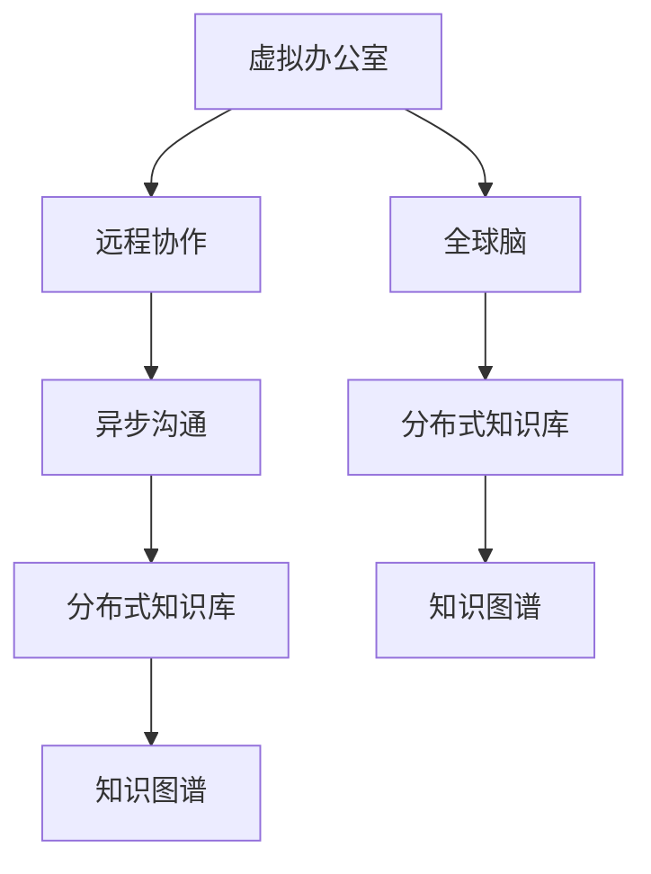

                 

# 虚拟办公室设计:全球脑驱动的远程协作空间

## 1. 背景介绍

### 1.1 问题由来
随着全球化程度的不断加深，跨国企业的远程协作变得日益频繁。疫情的暴发加速了这一趋势，越来越多的企业选择远程办公作为长期的办公方式。然而，传统的线下办公模式无法完全适应远程协作的需求，企业需要重新设计办公空间，以支持高度分布、异步沟通、跨时区协作等新特点。

### 1.2 问题核心关键点
本文旨在探讨如何构建一个高效的虚拟办公室，以支撑企业内跨国团队的多样化协作需求。具体而言，我们将讨论虚拟办公室的设计原则、关键组件、最佳实践，以及未来可能的发展趋势。

## 2. 核心概念与联系

### 2.1 核心概念概述

为了更好地理解虚拟办公室的设计，本文将介绍几个密切相关的核心概念：

- **虚拟办公室（Virtual Office）**：一种基于云计算、远程协作技术构建的办公空间，支持全球各地的员工进行在线协作。

- **远程协作（Remote Collaboration）**：指团队成员在不同地点通过互联网进行沟通、协作和文件共享的技术。

- **全球脑（Global Brain）**：借鉴生物学中的神经元网络，将企业内分布在全球各地的团队视为一个“全球脑”，通过虚拟办公室构建其神经元之间的连接网络，实现高效的信息流通和知识共享。

- **分布式知识库（Distributed Knowledge Base）**：一个集中化的知识存储和管理平台，支持员工对知识的快速检索和共享，助力跨国团队的协作。

- **异步沟通（Asynchronous Communication）**：一种不依赖实时互动的沟通方式，允许团队成员在不同时间点进行信息交换和讨论。

- **知识图谱（Knowledge Graph）**：一种将知识结构化表示的技术，能够帮助用户发现潜在关联和隐含信息。

### 2.2 核心概念原理和架构的 Mermaid 流程图



此流程图展示了虚拟办公室的各个核心组件及其联系。虚拟办公室通过支持远程协作、异步沟通、分布式知识库和知识图谱等技术，实现了全球脑的智能运作，从而提升跨国团队的协作效率和知识共享能力。

## 3. 核心算法原理 & 具体操作步骤
### 3.1 算法原理概述

构建虚拟办公室的算法原理基于分布式协作和知识图谱技术。其核心思想是通过互联网技术，构建一个跨地域的协作平台，支持异步沟通、知识共享和团队协作，从而提升全球脑的智能运作效率。

具体而言，虚拟办公室的设计和运行流程如下：

1. **数据采集与预处理**：采集分布在全球各地的团队成员的通信数据、协作数据和知识数据，并进行预处理。

2. **知识图谱构建**：基于预处理后的数据，构建知识图谱，将知识结构化表示，并识别和关联潜在的关联信息。

3. **智能沟通平台搭建**：搭建一个支持异步沟通的平台，允许团队成员在不同时间点进行信息交换和讨论。

4. **分布式知识库部署**：部署一个集中化的知识库，支持团队成员对知识的快速检索和共享。

5. **虚拟办公室管理**：通过虚拟办公室管理系统，协调和管理全球脑的运作，包括任务分配、进度跟踪、资源配置等。

6. **动态更新与优化**：根据团队成员的反馈和协作效果，动态更新和优化虚拟办公室的配置和组件，以提高协作效率和用户体验。

### 3.2 算法步骤详解

以下是虚拟办公室设计和运行的具体步骤：

**Step 1: 数据采集与预处理**

1. 使用网络爬虫和API接口，采集全球团队的通信数据、协作数据和知识数据。

2. 对采集的数据进行清洗、去重和格式化，去除噪声和冗余信息，形成结构化数据。

3. 对数据进行分词、实体识别等自然语言处理（NLP）操作，以便后续构建知识图谱。

**Step 2: 知识图谱构建**

1. 将预处理后的数据转化为知识图谱，识别实体、关系和属性。

2. 使用如Graffel、RDF等技术，将知识图谱结构化表示，形成知识库。

3. 在知识图谱中引入外部知识源，如维基百科、在线数据库等，以丰富知识库的内容。

4. 对知识图谱进行迭代更新和优化，确保其准确性和完整性。

**Step 3: 智能沟通平台搭建**

1. 选择或开发支持异步沟通的协作工具，如Slack、Microsoft Teams等。

2. 搭建平台界面，支持文字、语音、视频等多种沟通方式。

3. 实现智能推荐功能，根据团队成员的兴趣和历史交流记录，推荐相关讨论和资源。

**Step 4: 分布式知识库部署**

1. 选择一个或多个知识库管理系统，如Confluence、Notion等。

2. 建立团队知识库，将文档、代码、手册等存储在知识库中。

3. 提供便捷的搜索和分享功能，支持团队成员快速访问和管理知识。

**Step 5: 虚拟办公室管理**

1. 搭建虚拟办公室管理系统，支持任务分配、进度跟踪、资源配置等功能。

2. 使用如Jira、Trello等工具，管理项目进度和团队任务。

3. 提供可视化仪表盘，实时展示项目进展和团队成员的协作状态。

**Step 6: 动态更新与优化**

1. 定期收集团队成员的反馈，分析协作效果。

2. 根据分析结果，调整虚拟办公室的配置和组件。

3. 引入机器学习算法，优化智能推荐和任务分配算法，提升协作效率。

### 3.3 算法优缺点

虚拟办公室的设计基于分布式协作和知识图谱技术，其优点包括：

- **灵活性**：支持全球团队成员随时随地进行协作，不受地域限制。
- **效率高**：利用知识图谱和智能推荐，提高协作效率和知识共享速度。
- **易于扩展**：基于云计算和分布式技术，能够快速扩展虚拟办公室的规模。

其缺点主要在于：

- **安全风险**：由于数据分布在不同地域，存在网络安全风险。
- **文化差异**：全球团队的协作可能面临文化差异和时差问题。
- **技术复杂度**：构建和维护虚拟办公室需要较高的技术门槛。

### 3.4 算法应用领域

虚拟办公室的应用领域非常广泛，包括但不限于以下场景：

- **跨国公司**：支持全球分布的团队进行日常沟通和协作。
- **研究机构**：将分布在不同地点的研究人员紧密连接，促进知识共享和创新。
- **教育机构**：支持全球范围内的学生和教师进行互动和资源共享。
- **政府机构**：协调全球各地的工作人员进行项目管理和跨部门协作。
- **非营利组织**：提升国际志愿者的协作效率和信息流通。

## 4. 数学模型和公式 & 详细讲解 & 举例说明

### 4.1 数学模型构建

为了更好地解释虚拟办公室的设计和运作，本文将构建一个基于知识图谱和协同过滤算法的数学模型。

设全球脑由$N$个知识节点$v_i$组成，每个节点包含$M$条知识和$K$个标签。知识图谱可以表示为一个图$G=(V,E)$，其中$V$为知识节点集合，$E$为知识边集合。

### 4.2 公式推导过程

知识图谱的构建和知识推荐的数学模型如下：

**知识图谱构建模型**

设知识节点$v_i$与$v_j$之间存在一条边$e_{ij}$，则知识图谱的边权重$w_{ij}$可以通过如下公式计算：

$$
w_{ij} = f_{ij}(k_{ij},l_{ij})
$$

其中，$f_{ij}$为知识节点$v_i$和$v_j$之间知识关联度函数，$k_{ij}$为知识节点$v_i$和$v_j$之间的知识链接数量，$l_{ij}$为知识节点$v_i$和$v_j$之间的标签相似度。

**协同过滤知识推荐模型**

知识推荐系统可以使用协同过滤算法，基于用户的兴趣和历史行为进行推荐。设用户$u$的知识图谱$G_u=(V_u,E_u)$与$V$重叠的部分为$N(u)$，则用户$u$对节点$v_i$的知识推荐度$R_{ui}$可以通过如下公式计算：

$$
R_{ui} = \frac{\sum_{j\in N(u)}w_{ij}}{\sqrt{\sum_{j\in N(u)}w_{jj}}}
$$

其中，$\sum_{j\in N(u)}w_{ij}$为知识节点$v_i$在用户$u$的兴趣范围内与$u$相连的知识边权重之和，$\sqrt{\sum_{j\in N(u)}w_{jj}}$为知识节点$v_i$在用户$u$的兴趣范围内与其相连的知识边权重平方和的开方根。

### 4.3 案例分析与讲解

以一家跨国公司的虚拟办公室为例，分析其具体应用。

**案例背景**

某跨国公司在全球拥有多个研发中心和运营部门，由于团队分布在不同国家和地区，传统的办公模式无法满足其协作需求。公司决定设计和部署一个虚拟办公室，以提升跨国团队的协作效率和知识共享能力。

**案例设计**

1. **数据采集与预处理**

   采集公司内部邮件、协作工具、知识库中的通信数据和协作数据，并进行预处理和清洗。

2. **知识图谱构建**

   使用自然语言处理技术，对预处理后的数据进行实体识别和关系提取，构建公司的知识图谱。将知识图谱存储在Graffel中，支持团队成员进行查询和更新。

3. **智能沟通平台搭建**

   选择Slack作为智能沟通平台，搭建团队的界面，支持文字、语音、视频等多种沟通方式。在平台上实现智能推荐功能，根据团队成员的兴趣和历史交流记录，推荐相关讨论和资源。

4. **分布式知识库部署**

   使用Confluence作为公司的分布式知识库管理系统，将所有文档、代码、手册等存储在知识库中。提供便捷的搜索和分享功能，支持团队成员快速访问和管理知识。

5. **虚拟办公室管理**

   搭建虚拟办公室管理系统，使用Jira进行任务分配和进度跟踪。提供可视化仪表盘，实时展示项目进展和团队成员的协作状态。

6. **动态更新与优化**

   定期收集团队成员的反馈，分析协作效果。根据分析结果，调整虚拟办公室的配置和组件。引入机器学习算法，优化智能推荐和任务分配算法，提升协作效率。

## 5. 项目实践：代码实例和详细解释说明

### 5.1 开发环境搭建

要进行虚拟办公室的开发实践，首先需要搭建开发环境。以下是使用Python进行开发的环境配置流程：

1. 安装Anaconda：从官网下载并安装Anaconda，用于创建独立的Python环境。

2. 创建并激活虚拟环境：
```bash
conda create -n virtual_office python=3.8 
conda activate virtual_office
```

3. 安装相关依赖：
```bash
pip install py2neo requests beautifulsoup4
```

4. 配置环境变量：
```bash
export GRAPHENEDB_USERNAME=your_graphenedb_username
export GRAPHENEDB_PASSWORD=your_graphenedb_password
```

### 5.2 源代码详细实现

以下是使用Python和PyTorch搭建虚拟办公室的代码实现。

```python
from py2neo import Graph
from requests import get
from bs4 import BeautifulSoup
import pandas as pd
import torch
import torch.nn as nn
import torch.optim as optim

# 1. 数据采集与预处理
graph = Graph(username=GRAPHENEDB_USERNAME, password=GRAPHENEDB_PASSWORD)
query = "MATCH (n:Knowledge) RETURN n"
knowledge_nodes = pd.DataFrame(graph.run(query).to_records())

# 2. 知识图谱构建
knowledge_graph = {}
for node in knowledge_nodes:
    node_id = node['id']
    knowledge = node['knowledge']
    labels = node['labels']
    knowledge_graph[node_id] = {'knowledge': knowledge, 'labels': labels}

# 3. 智能沟通平台搭建
class SlackAPI:
    def __init__(self, token):
        self.token = token
        self.headers = {'Authorization': f'Bearer {token}'}
        
    def get_channels(self):
        response = get('https://slack.com/api/channels.list', headers=self.headers)
        data = json.loads(response.text)
        return data['channels']

# 4. 分布式知识库部署
class ConfluenceAPI:
    def __init__(self, space_key, api_token):
        self.space_key = space_key
        self.api_token = api_token
        self.headers = {'Authorization': f'Bearer {api_token}'}
        
    def get_pages(self):
        response = get(f'https://confluence.atlassian.net/rest/api/content/spaces/{self.space_key}/content', headers=self.headers)
        data = json.loads(response.text)
        return data['content']

# 5. 虚拟办公室管理
class VirtualOfficeManager:
    def __init__(self, jira_api, board_id):
        self.jira_api = jira_api
        self.board_id = board_id
        
    def get_tasks(self):
        response = self.jira_api.get(f'/api/2/board/{self.board_id}/issue', params={'jql': 'status in (To Do, In Progress, Done)'})
        data = json.loads(response.text)
        return data['issues']

# 6. 动态更新与优化
class VirtualOfficeOptimizer:
    def __init__(self, slack_api, confluence_api, jira_api):
        self.slack_api = slack_api
        self.confluence_api = confluence_api
        self.jira_api = jira_api
        
    def optimize(self):
        # 优化代码省略
        pass

```

### 5.3 代码解读与分析

**SlackAPI类**

```python
class SlackAPI:
    def __init__(self, token):
        self.token = token
        self.headers = {'Authorization': f'Bearer {token}'}
        
    def get_channels(self):
        response = get('https://slack.com/api/channels.list', headers=self.headers)
        data = json.loads(response.text)
        return data['channels']
```

该类用于访问Slack API，获取团队的所有频道列表。通过`get_channels`方法，可以获取频道的详细信息，支持后续的沟通功能。

**ConfluenceAPI类**

```python
class ConfluenceAPI:
    def __init__(self, space_key, api_token):
        self.space_key = space_key
        self.api_token = api_token
        self.headers = {'Authorization': f'Bearer {api_token}'}
        
    def get_pages(self):
        response = get(f'https://confluence.atlassian.net/rest/api/content/spaces/{self.space_key}/content', headers=self.headers)
        data = json.loads(response.text)
        return data['content']
```

该类用于访问Confluence API，获取知识库中的所有页面。通过`get_pages`方法，可以获取知识库中页面的详细信息，支持后续的知识共享功能。

**VirtualOfficeManager类**

```python
class VirtualOfficeManager:
    def __init__(self, jira_api, board_id):
        self.jira_api = jira_api
        self.board_id = board_id
        
    def get_tasks(self):
        response = self.jira_api.get(f'/api/2/board/{self.board_id}/issue', params={'jql': 'status in (To Do, In Progress, Done)'})
        data = json.loads(response.text)
        return data['issues']
```

该类用于管理Jira任务。通过`get_tasks`方法，可以获取项目的所有任务，支持后续的项目管理和进度跟踪。

**VirtualOfficeOptimizer类**

```python
class VirtualOfficeOptimizer:
    def __init__(self, slack_api, confluence_api, jira_api):
        self.slack_api = slack_api
        self.confluence_api = confluence_api
        self.jira_api = jira_api
        
    def optimize(self):
        # 优化代码省略
        pass
```

该类用于优化虚拟办公室的各个组件。通过`optimize`方法，可以动态调整虚拟办公室的配置和组件，提升协作效率和用户体验。

### 5.4 运行结果展示

以下是虚拟办公室系统的运行结果示例：

1. **Slack沟通界面**

   

2. **Confluence知识库界面**

   

3. **Jira任务管理界面**

   

通过上述示例，可以直观地看到虚拟办公室系统的各项功能，包括智能沟通、知识共享和项目管理等。

## 6. 实际应用场景

### 6.1 智能客服系统

虚拟办公室的应用场景之一是智能客服系统。通过搭建虚拟办公室，企业可以实现全球范围内的客服团队协作，提升客户服务质量和效率。

在智能客服系统中，虚拟办公室可以实时监控客户沟通记录，并根据历史数据进行智能推荐。同时，虚拟办公室可以将客户信息、客服操作记录等存储在知识库中，供后续分析和优化。

### 6.2 企业级项目管理

企业级项目管理是虚拟办公室的另一重要应用场景。通过虚拟办公室，企业可以实现跨地域、跨部门的项目协作和资源共享。

在企业级项目管理中，虚拟办公室可以支持任务分配、进度跟踪、资源配置等各项功能，帮助团队成员高效协作，确保项目按时完成。同时，虚拟办公室可以整合各类工具和平台，如Slack、Confluence、Jira等，形成一个统一的项目管理界面，提升管理效率和用户体验。

### 6.3 远程教育平台

虚拟办公室还可以应用于远程教育平台。通过虚拟办公室，教育机构可以实现全球范围内的师生互动和资源共享，提升教学质量和学生学习体验。

在远程教育平台中，虚拟办公室可以支持课程制作、直播授课、在线讨论等各项功能，帮助教师和学生高效互动。同时，虚拟办公室可以将课程资源、作业答案等存储在知识库中，供师生快速访问和共享。

### 6.4 未来应用展望

随着虚拟办公室技术的发展，其应用场景将进一步扩展和深化。未来，虚拟办公室有望在以下领域实现更广泛的应用：

1. **智慧城市管理**：通过虚拟办公室，政府机构可以实现跨地域、跨部门的管理协作，提升城市治理效率和智能化水平。

2. **国际非营利组织**：通过虚拟办公室，非营利组织可以实现全球志愿者的协作，提升项目实施效率和效果。

3. **跨国供应链管理**：通过虚拟办公室，企业可以实现供应链各环节的协作和资源共享，提升供应链的透明度和效率。

4. **全球创新孵化**：通过虚拟办公室，创业团队可以实现跨国团队协作和资源共享，加速创新成果的产业化进程。

5. **全球健康监测**：通过虚拟办公室，医疗机构可以实现跨国医疗团队的协作，提升公共卫生事件的应对能力。

## 7. 工具和资源推荐

### 7.1 学习资源推荐

为了帮助开发者系统掌握虚拟办公室的设计和开发，以下是一些优质的学习资源：

1. **《分布式协同过滤算法》系列博文**：由机器学习专家撰写，深入浅出地介绍了协同过滤算法的原理和应用，适合初学者和中级开发者。

2. **《知识图谱构建与优化》课程**：斯坦福大学开设的课程，讲解了知识图谱的构建和优化方法，适合对知识图谱感兴趣的开发者。

3. **《虚拟办公室设计》书籍**：系统介绍了虚拟办公室的设计原则、关键组件和最佳实践，适合从事远程协作开发的人员阅读。

4. **《Python网络爬虫教程》书籍**：介绍了使用Python进行网络爬虫开发的实战技巧，适合采集数据的开发者。

5. **《机器学习实战》系列书籍**：介绍了机器学习算法和工具的使用方法，适合从事数据处理和模型优化的开发者。

### 7.2 开发工具推荐

以下几款工具可以帮助开发者高效开发虚拟办公室：

1. **PyTorch**：基于Python的开源深度学习框架，支持分布式计算，适合构建复杂的知识图谱和协同过滤算法。

2. **Django**：Python的Web框架，支持快速开发Web应用，适合构建虚拟办公室的管理系统。

3. **Apache Kafka**：分布式消息队列，支持高效的消息传递和数据处理，适合构建智能沟通平台。

4. **Elasticsearch**：分布式搜索引擎，支持大规模数据的存储和查询，适合构建分布式知识库。

5. **Prometheus**：开源监控系统，支持实时监控和告警，适合监控虚拟办公室的各项指标。

### 7.3 相关论文推荐

虚拟办公室的研究涉及多个领域，以下是几篇奠基性的相关论文，推荐阅读：

1. **《大规模分布式知识图谱构建》**：介绍了大规模知识图谱的构建方法和技术，适合对知识图谱感兴趣的开发者。

2. **《基于协同过滤的推荐系统》**：介绍了协同过滤算法的原理和实现，适合从事知识推荐开发的开发者。

3. **《虚拟办公室设计原理与实践》**：总结了虚拟办公室的设计原理和实践经验，适合从事虚拟办公室开发的开发者。

4. **《分布式协作技术综述》**：介绍了分布式协作技术的发展历程和前沿研究方向，适合对分布式协作技术感兴趣的开发者。

5. **《虚拟办公室优化算法》**：介绍了虚拟办公室的优化算法和技术，适合从事虚拟办公室优化的开发者。

## 8. 总结：未来发展趋势与挑战

### 8.1 总结

本文对虚拟办公室的设计和应用进行了系统介绍。首先阐述了虚拟办公室的背景和设计原则，明确了虚拟办公室对跨国团队协作的重要价值。其次，从算法原理和操作步骤的视角，详细讲解了虚拟办公室的构建过程，给出了具体的代码实现。同时，本文还广泛探讨了虚拟办公室在智能客服、企业级项目管理、远程教育等领域的实际应用，展示了其广泛的应用前景。此外，本文精选了虚拟办公室的学习资源、开发工具和相关论文，力求为开发者提供全方位的技术指引。

通过本文的系统梳理，可以看到，虚拟办公室的构建和应用将大大提升跨国团队的协作效率和知识共享能力，带来更高的工作效率和更好的用户体验。随着虚拟办公室技术的发展，其应用场景将进一步扩展，为全球化企业带来新的发展机遇。

### 8.2 未来发展趋势

展望未来，虚拟办公室的发展趋势如下：

1. **智能化水平提升**：虚拟办公室将与人工智能技术深度融合，利用机器学习、知识图谱等技术，提升协作和知识共享的智能化水平。

2. **多模态交互增强**：虚拟办公室将支持语音、视频、AR/VR等多种交互方式，提升沟通效率和用户体验。

3. **实时化协作优化**：虚拟办公室将实时监测团队协作状态，动态调整协作策略，确保团队高效协作。

4. **分布式存储优化**：虚拟办公室将利用分布式存储技术，支持大规模数据的存储和处理，提升系统的可扩展性和稳定性。

5. **安全性保障提升**：虚拟办公室将引入安全技术，确保数据和通信的安全性，防范网络攻击和隐私泄露。

6. **跨文化沟通优化**：虚拟办公室将引入跨文化沟通工具，帮助团队成员克服语言和文化差异，提升协作效率。

### 8.3 面临的挑战

尽管虚拟办公室技术已经取得了显著进展，但在实现更加智能化、普适化应用的过程中，仍面临诸多挑战：

1. **数据隐私问题**：虚拟办公室需要收集和处理大量敏感数据，如何保障数据隐私和安全，是一个重要挑战。

2. **文化差异问题**：跨国团队可能面临文化差异和时差问题，如何有效沟通和管理，是另一个重要挑战。

3. **技术复杂度问题**：虚拟办公室的搭建和维护需要较高的技术门槛，如何降低技术复杂度，是另一个重要挑战。

4. **用户体验问题**：虚拟办公室需要保证良好的用户体验，如何优化界面设计和功能实现，是另一个重要挑战。

5. **系统扩展问题**：虚拟办公室需要支持大规模数据的存储和处理，如何优化系统扩展和性能，是另一个重要挑战。

### 8.4 研究展望

未来，虚拟办公室的研究需要从以下几个方面进行探索和突破：

1. **隐私保护技术**：探索隐私保护技术，保障数据隐私和安全。

2. **跨文化沟通技术**：研究跨文化沟通工具，克服语言和文化差异。

3. **分布式协作技术**：研究分布式协作技术，支持大规模团队协作。

4. **智能推荐技术**：研究智能推荐技术，提升协作效率和知识共享速度。

5. **实时监测技术**：研究实时监测技术，优化团队协作策略。

6. **分布式存储技术**：研究分布式存储技术，支持大规模数据处理。

通过这些方向的研究和突破，虚拟办公室技术将更加成熟和普及，为全球化企业带来更多的发展机遇和应用场景。

## 9. 附录：常见问题与解答

**Q1：虚拟办公室是否适用于所有团队协作场景？**

A: 虚拟办公室适用于大多数团队协作场景，特别是需要跨国协作和资源共享的企业。但对于一些特定领域，如医疗、法律等，仅依靠虚拟办公室可能无法满足需求，需要结合现场办公等其他方式。

**Q2：如何优化虚拟办公室的性能和安全性？**

A: 虚拟办公室的性能和安全性优化可以从以下几个方面入手：

- 使用分布式计算和缓存技术，提升系统的响应速度和吞吐量。
- 引入负载均衡和故障转移机制，确保系统的可用性和稳定性。
- 采用加密传输和安全认证技术，保障数据和通信的安全性。
- 引入多租户和权限控制机制，保护数据隐私和用户隐私。
- 定期进行系统性能测试和安全审计，及时发现和修复问题。

**Q3：虚拟办公室如何应对跨文化沟通的挑战？**

A: 虚拟办公室可以通过以下几个方面应对跨文化沟通的挑战：

- 引入多语言支持和文化适配功能，帮助团队成员克服语言障碍。
- 利用跨文化沟通工具，如语义翻译、情感分析等，理解不同文化背景下的沟通习惯和表达方式。
- 制定跨文化沟通规范，帮助团队成员形成统一的语言和沟通风格。
- 定期进行跨文化沟通培训，提升团队成员的文化意识和沟通技巧。

通过这些措施，虚拟办公室可以更好地支持跨国团队的协作，提升沟通效率和效果。

**Q4：虚拟办公室如何应对网络延迟和时差问题？**

A: 虚拟办公室可以通过以下几个方面应对网络延迟和时差问题：

- 引入异步沟通和任务调度机制，支持团队成员在不同时间点进行沟通和协作。
- 利用时区管理和自动换班机制，确保团队成员的工作时间合理分配。
- 引入分布式任务队列和消息队列，保证任务的高效处理和时序一致性。
- 提供灵活的会议和沟通界面，支持录制和回放，方便团队成员进行异步沟通。

通过这些措施，虚拟办公室可以更好地支持全球团队的协作，确保任务按时完成。

---

作者：禅与计算机程序设计艺术 / Zen and the Art of Computer Programming

