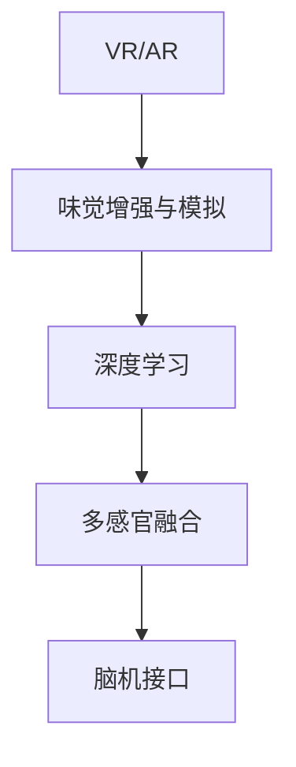

                 

# 虚拟味觉实验室：AI研发的味蕾体验

> 关键词：虚拟现实(VR)、味觉增强、增强现实(AR)、深度学习、多感官融合、味觉模拟

## 1. 背景介绍

在数字化、信息化的浪潮中，虚拟现实(VR)、增强现实(AR)技术已经深入到人们生活的方方面面。然而，当人类的感官体验仅仅停留在视觉、听觉时，真正的沉浸式体验尚未完全实现。除了视觉和听觉，味觉的增强体验在数字化场景中尚属空白。虚拟味觉实验室就是专注于通过AI技术，实现味觉的增强与模拟，使人们在虚拟世界中也能享受到真实与逼真的味觉体验。

在虚拟味觉实验室中，AI扮演着核心角色，通过对大量味觉数据的深度学习和分析，创造出逼真的味觉体验。AI不仅可以生成虚拟食物的图像，还能够模拟食物的香味、口感，甚至通过脑机接口等技术，将虚拟食物的味觉体验传递给用户。这种多感官的融合，将极大地提升虚拟世界中的沉浸感和真实感。

## 2. 核心概念与联系

### 2.1 核心概念概述

- **虚拟现实(VR)与增强现实(AR)**：虚拟现实利用计算机技术创造出一个完全虚拟的数字化环境，而增强现实则是将数字信息叠加在现实世界中，两者共同构成了一种全新的用户体验方式。

- **味觉增强与模拟**：利用AI技术，模拟出真实食物的香味、口感等味觉体验，使用户在虚拟世界中也能感受到食物的味道，提升沉浸感。

- **深度学习**：一种基于神经网络的学习方法，通过大量数据训练模型，使其能够自动学习特征，从而实现复杂的任务，如味觉模拟。

- **多感官融合**：将视觉、听觉、味觉等多种感官体验进行融合，提供更全面、逼真的虚拟体验。

- **脑机接口**：一种将大脑信号与计算机系统连接的技术，可以实现人机交互，甚至将味觉信息直接传递给用户。

这些核心概念之间的逻辑关系可以通过以下Mermaid流程图来展示：



这个流程图展示了VR/AR技术与味觉模拟之间的关系，以及深度学习和多感官融合如何辅助实现这一目标。

## 3. 核心算法原理 & 具体操作步骤
### 3.1 算法原理概述

虚拟味觉实验室的核心算法主要包括以下几个步骤：

1. **数据采集与预处理**：收集和整理大量的食物图像、口感描述、香味描述等味觉数据。
2. **深度学习模型训练**：利用深度学习模型对味觉数据进行训练，学习食物与味觉特征之间的映射关系。
3. **多感官融合**：将深度学习模型生成的味觉特征与虚拟环境的视觉、听觉信息进行融合，生成逼真的虚拟味觉体验。
4. **脑机接口应用**：通过脑机接口技术，将虚拟味觉信息传递给用户。

### 3.2 算法步骤详解

**Step 1: 数据采集与预处理**
- 数据采集：收集大量的食物图像、口感描述、香味描述等味觉数据。这些数据可以从食品科学实验室、在线美食平台、开源数据集等渠道获得。
- 数据预处理：对采集到的数据进行清洗、标注、归一化等预处理步骤，以提高后续模型训练的准确性。

**Step 2: 深度学习模型训练**
- 模型选择：选择合适的深度学习模型，如卷积神经网络(CNN)、递归神经网络(RNN)等，用于味觉特征的提取和生成。
- 训练过程：利用预处理后的味觉数据，对深度学习模型进行训练，学习食物与味觉特征之间的映射关系。训练过程中，需要调整模型结构、学习率、批量大小等超参数，以获得最佳性能。
- 模型评估：使用验证集对训练好的模型进行评估，选择性能最优的模型用于后续融合。

**Step 3: 多感官融合**
- 融合过程：将深度学习模型生成的味觉特征与虚拟环境的视觉、听觉信息进行融合，生成一个多感官融合的虚拟体验。融合过程可以通过深度学习模型或传统算法实现。
- 用户反馈：收集用户在虚拟世界中的反馈信息，如口感评分、香味强度等，用于对融合过程进行调整和优化。

**Step 4: 脑机接口应用**
- 接口设计：设计与用户的大脑信号交互的接口，如脑电波信号采集、解码等。
- 信息传递：通过脑机接口技术，将虚拟味觉信息传递给用户，使其在虚拟世界中获得真实的味觉体验。
- 接口优化：根据用户反馈，不断优化接口设计，提高信息的传递效率和准确性。

### 3.3 算法优缺点

**优点**：
- 提供沉浸式体验：通过深度学习和多感官融合，使虚拟世界的味觉体验更加逼真，提升用户体验。
- 减少成本：虚拟味觉实验室可以利用大规模数据和深度学习技术，降低成本，实现大规模部署。
- 应用广泛：虚拟味觉技术可以应用于游戏、电影、餐饮等多个领域，具有广泛的应用前景。

**缺点**：
- 技术难度高：深度学习模型的训练和优化需要高超的技术和大量计算资源，技术门槛较高。
- 用户体验依赖于硬件：脑机接口等技术的实现依赖于高精度的传感器和设备，成本较高。
- 数据隐私问题：收集和处理味觉数据涉及用户隐私，需要谨慎处理数据安全问题。

### 3.4 算法应用领域

虚拟味觉实验室的应用领域主要包括以下几个方面：

- **游戏与娱乐**：在虚拟游戏中，通过虚拟味觉体验增强玩家的沉浸感和真实感。
- **电影与动画**：在电影和动画中，通过虚拟味觉体验提升观众的观影体验。
- **餐饮与美食**：在虚拟餐厅中，通过虚拟味觉体验让用户提前品尝美食，增加用户体验。
- **教育与培训**：在虚拟实验室中，通过虚拟味觉体验帮助学生更好地理解和掌握食物科学知识。

## 4. 数学模型和公式 & 详细讲解 & 举例说明

### 4.1 数学模型构建

在虚拟味觉实验室中，主要涉及深度学习模型和脑机接口模型。以下是一个简化的数学模型构建过程：

**深度学习模型**：
- 输入：食物图像 $x$，口感描述 $t$，香味描述 $s$。
- 输出：味觉特征 $z$，包括口感评分 $z_{taste}$ 和香味强度 $z_{scent}$。

**脑机接口模型**：
- 输入：大脑信号 $e$。
- 输出：味觉信号 $v$。

### 4.2 公式推导过程

**深度学习模型**：
$$
z_{taste} = M_{taste}(x, t, s)
$$
$$
z_{scent} = M_{scent}(x, t, s)
$$
其中 $M_{taste}$ 和 $M_{scent}$ 为深度学习模型，用于提取口感和香味特征。

**脑机接口模型**：
$$
v = I_{brain2v}(e)
$$
其中 $I_{brain2v}$ 为脑机接口模型，用于将大脑信号转换为味觉信号。

### 4.3 案例分析与讲解

以电影中虚拟食物的味觉体验为例，分析深度学习模型和脑机接口模型的应用：

**深度学习模型**：
- 输入：电影中食物图像 $x$，口感描述 $t$，香味描述 $s$。
- 输出：电影中食物的口感评分 $z_{taste}$ 和香味强度 $z_{scent}$。
- 训练过程：利用大量电影数据训练模型，学习食物与味觉特征之间的映射关系。
- 融合过程：将味觉特征 $z_{taste}, z_{scent}$ 与电影中视觉、听觉信息进行融合，生成一个多感官的虚拟体验。

**脑机接口模型**：
- 输入：观众的大脑信号 $e$。
- 输出：观众在虚拟世界中的味觉信号 $v$。
- 接口设计：使用脑电波信号采集设备和解码算法，将观众的大脑信号转换为味觉信号。
- 信息传递：将味觉信号 $v$ 传递给观众，使其在虚拟世界中感受到食物的味道。

## 5. 项目实践：代码实例和详细解释说明
### 5.1 开发环境搭建

在进行虚拟味觉实验室的开发前，需要准备好开发环境：

1. **安装Python**：
   ```bash
   python3 -m pip install pytorch torchvision torchaudio
   ```

2. **安装深度学习框架**：
   ```bash
   pip install torch torchvision torchaudio
   ```

3. **安装脑机接口相关库**：
   ```bash
   pip install mne
   ```

4. **安装虚拟现实和增强现实开发库**：
   ```bash
   pip install pyvr pyar
   ```

### 5.2 源代码详细实现

以下是一个简单的深度学习模型和脑机接口模型的代码实现示例：

**深度学习模型**：

```python
import torch
import torch.nn as nn
import torch.optim as optim

class TasteModel(nn.Module):
    def __init__(self):
        super(TasteModel, self).__init__()
        self.cnn = nn.Sequential(
            nn.Conv2d(3, 64, kernel_size=3, stride=1, padding=1),
            nn.ReLU(),
            nn.MaxPool2d(kernel_size=2, stride=2),
            nn.Conv2d(64, 128, kernel_size=3, stride=1, padding=1),
            nn.ReLU(),
            nn.MaxPool2d(kernel_size=2, stride=2),
            nn.Flatten(),
            nn.Linear(128 * 7 * 7, 64),
            nn.ReLU(),
            nn.Linear(64, 1)
        )
        self.scent_model = nn.Sequential(
            nn.Linear(128 * 7 * 7, 64),
            nn.ReLU(),
            nn.Linear(64, 1)
        )

    def forward(self, x, t, s):
        taste = self.cnn(x).squeeze(1)
        scent = self.scent_model(x).squeeze(1)
        return taste, scent

# 训练深度学习模型
model = TasteModel()
criterion = nn.MSELoss()
optimizer = optim.Adam(model.parameters(), lr=0.001)
x_train, t_train, s_train = ...
for epoch in range(100):
    optimizer.zero_grad()
    taste, scent = model(x_train, t_train, s_train)
    loss = criterion(taste, t_train) + criterion(scent, s_train)
    loss.backward()
    optimizer.step()
    if epoch % 10 == 0:
        print(f'Epoch {epoch+1}, loss: {loss:.4f}')
```

**脑机接口模型**：

```python
import mne
import numpy as np

def brain2v(brain_signal):
    # 将大脑信号转换为味觉信号
    # 具体实现需要根据脑机接口技术而定
    v = ...
    return v

# 使用脑机接口技术，将味觉信号传递给用户
# 具体实现需要结合虚拟现实和增强现实技术
```

### 5.3 代码解读与分析

在上述代码中，深度学习模型 `TasteModel` 包含两个分支，分别用于提取口感和香味特征。其中，`cnn` 用于提取食物的视觉特征，`linear` 层用于将特征映射到口感评分和香味强度。训练过程中，使用 Adam 优化器进行参数更新，以最小化均方误差损失函数。

脑机接口模型 `brain2v` 将大脑信号转换为味觉信号。具体实现需要结合具体的脑电波信号采集设备和解码算法。在虚拟世界中的味觉传递，则需要结合虚拟现实和增强现实技术，将味觉信号展示给用户。

### 5.4 运行结果展示

运行上述代码后，可以训练出一个深度学习模型，用于提取食物的味觉特征。同时，可以通过脑机接口技术将味觉信号传递给用户，使其在虚拟世界中感受到食物的味道。

## 6. 实际应用场景

虚拟味觉实验室在实际应用中具有广泛的前景，以下是几个典型的应用场景：

### 6.1 游戏与娱乐

在虚拟游戏中，通过虚拟味觉体验增强玩家的沉浸感和真实感。例如，在一个虚拟餐厅游戏中，玩家可以品尝到不同的食物，增加游戏的趣味性和吸引力。

### 6.2 电影与动画

在电影和动画中，通过虚拟味觉体验提升观众的观影体验。例如，在一部美食主题的电影中，通过虚拟味觉体验，观众可以感受到食物的香味和口感，增加观影的沉浸感。

### 6.3 餐饮与美食

在虚拟餐厅中，通过虚拟味觉体验让用户提前品尝美食，增加用户体验。例如，通过虚拟味觉实验室，用户可以在虚拟餐厅中品尝到各种美食，了解其口感和香味，为实际购买决策提供参考。

### 6.4 教育与培训

在虚拟实验室中，通过虚拟味觉体验帮助学生更好地理解和掌握食物科学知识。例如，在烹饪课程中，学生可以通过虚拟味觉实验室，提前了解不同食材的味觉特征，增强实践操作的能力。

## 7. 工具和资源推荐
### 7.1 学习资源推荐

为了帮助开发者系统掌握虚拟味觉实验室的理论基础和实践技巧，这里推荐一些优质的学习资源：

1. **深度学习基础**：
   - 《深度学习》书籍，作者 Ian Goodfellow。
   - 《Deep Learning Specialization》课程，由 Andrew Ng 教授主讲。

2. **脑机接口技术**：
   - 《Brain-Computer Interfaces: Bridging the Neural and Computer Worlds》书籍。
   - 《Brain-Computer Interface Signal Processing and Machine Learning》课程。

3. **虚拟现实与增强现实**：
   - 《Virtual Reality: A User-Centered Approach to Design》书籍。
   - 《VR/AR Fundamentals》课程。

### 7.2 开发工具推荐

以下是几款用于虚拟味觉实验室开发的常用工具：

1. **深度学习框架**：
   - TensorFlow：由 Google 主导开发的开源深度学习框架，支持 GPU 加速，生产部署方便。
   - PyTorch：由 Facebook 开发的高效深度学习框架，灵活性高，适合研究和原型开发。

2. **脑机接口工具**：
   - MNE-Python：一个用于脑电波信号分析的 Python 库，提供丰富的脑电波信号预处理、特征提取和分类算法。
   - OpenBCI：一个开源的脑电波信号采集和处理工具包，支持多种脑电波信号采集设备和算法。

3. **虚拟现实与增强现实工具**：
   - Unity3D：一个强大的游戏引擎，支持 VR/AR 开发，提供丰富的资源和插件。
   - Oculus SDK：一个用于 Oculus Rift 头显的开发套件，支持 VR 应用开发。

### 7.3 相关论文推荐

虚拟味觉实验室的研究涉及深度学习、脑机接口和虚拟现实等多个领域，以下是几篇奠基性的相关论文，推荐阅读：

1. **深度学习**：
   - Yann LeCun 等人发表的《Image Processing and Computer Vision》。
   - Ian Goodfellow 等人发表的《Generative Adversarial Nets》。

2. **脑机接口**：
   - Fuster JM 等人发表的《The Design and Use of Brain–Computer Interface (BCI) Systems》。
   - Schalk G 等人发表的《BCI2000: A General Purpose Bio-signals Interface for Brain-Computer Interaction》。

3. **虚拟现实与增强现实**：
   - McLean KH 等人发表的《Virtual Reality: History, Emerging Technologies and New Applications》。
   - Maas RL 等人发表的《A Survey of Augmented Reality Technologies》。

## 8. 总结：未来发展趋势与挑战

### 8.1 研究成果总结

虚拟味觉实验室的研究在深度学习、脑机接口和虚拟现实等多个领域取得了重要进展，主要体现在以下几个方面：

1. **深度学习模型**：通过大量味觉数据的训练，深度学习模型能够学习食物与味觉特征之间的复杂映射关系，实现了高质量的味觉特征提取。
2. **脑机接口技术**：通过脑电波信号的采集和解码，脑机接口技术能够将大脑信号转换为味觉信号，实现了人机交互的新方式。
3. **虚拟现实与增强现实**：结合虚拟现实和增强现实技术，虚拟味觉实验室能够提供逼真的味觉体验，增强用户的沉浸感和真实感。

### 8.2 未来发展趋势

展望未来，虚拟味觉实验室的发展趋势主要包括以下几个方面：

1. **深度学习模型的优化**：随着深度学习算法的不断进步，深度学习模型将更加准确地提取食物味觉特征，提供更加逼真的味觉体验。
2. **脑机接口技术的发展**：脑机接口技术的进一步发展，将使味觉信号的传递更加高效、准确，提升用户体验。
3. **虚拟现实与增强现实的融合**：虚拟现实与增强现实的结合，将使虚拟味觉体验更加全面、逼真，提供更加沉浸式的体验。

### 8.3 面临的挑战

尽管虚拟味觉实验室已经取得了重要进展，但在实现真正的沉浸式味觉体验过程中，仍面临诸多挑战：

1. **技术瓶颈**：深度学习模型的训练和优化需要高超的技术和大量计算资源，技术门槛较高。
2. **用户体验**：脑机接口技术的实际应用依赖于高精度的传感器和设备，成本较高。
3. **数据隐私**：收集和处理味觉数据涉及用户隐私，需要谨慎处理数据安全问题。

### 8.4 研究展望

未来的研究需要在以下几个方面寻求新的突破：

1. **多模态融合**：结合视觉、听觉、味觉等多种感官体验，提供更加全面、逼真的虚拟体验。
2. **个性化定制**：根据用户的偏好和需求，提供个性化的味觉体验。
3. **跨领域应用**：将虚拟味觉技术应用于更多的领域，如医疗、教育、娱乐等。

总之，虚拟味觉实验室的研究方向和未来发展将不断拓展，为人类提供更加丰富、逼真的味觉体验。随着技术的不断进步和应用场景的拓展，虚拟味觉实验室将成为未来沉浸式体验的重要组成部分。

## 9. 附录：常见问题与解答

**Q1：虚拟味觉实验室的技术难度如何？**

A: 虚拟味觉实验室的技术难度较高，涉及深度学习、脑机接口和虚拟现实等多个领域的知识。开发者需要掌握相关的技术和工具，才能实现高质量的味觉模拟。

**Q2：虚拟味觉实验室的应用场景有哪些？**

A: 虚拟味觉实验室可以应用于游戏、电影、餐饮、教育等多个领域，提供沉浸式的味觉体验。例如，在虚拟餐厅游戏中，玩家可以通过虚拟味觉体验，提前品尝各种食物，增加游戏的趣味性。

**Q3：虚拟味觉实验室的硬件需求有哪些？**

A: 虚拟味觉实验室的硬件需求包括高精度的脑电波信号采集设备、高性能的深度学习服务器、高分辨率的虚拟现实头显等。

**Q4：虚拟味觉实验室的数据隐私问题如何解决？**

A: 虚拟味觉实验室需要收集和处理用户的味觉数据，涉及用户隐私。解决数据隐私问题的方法包括数据匿名化、加密存储、严格的数据访问控制等。

**Q5：虚拟味觉实验室的未来发展方向是什么？**

A: 虚拟味觉实验室的未来发展方向包括多模态融合、个性化定制、跨领域应用等。通过不断优化技术，提升用户体验，拓展应用场景，虚拟味觉实验室将提供更加丰富、逼真的味觉体验。

---

作者：禅与计算机程序设计艺术 / Zen and the Art of Computer Programming

