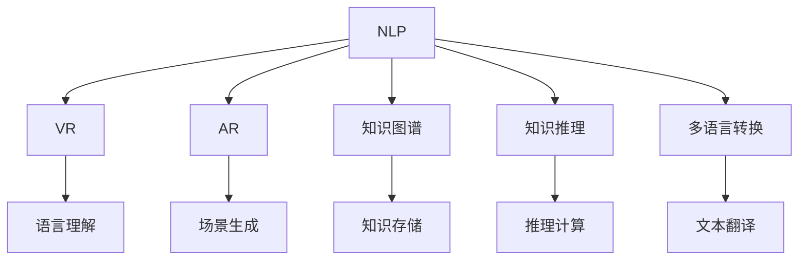

                 

# 虚拟外交学院：AI时代的跨文化交流培训

## 1. 背景介绍

### 1.1 问题由来

随着全球化的不断推进，跨文化交流成为了连接不同国家和地区的重要桥梁。然而，语言差异、文化隔阂等问题依旧阻碍了深入理解和友好交往的实现。近年来，人工智能技术迅速发展，特别是自然语言处理(NLP)技术，为打破语言和文化障碍提供了新的可能性。

虚拟外交学院作为AI时代跨文化交流的新形式，利用人工智能技术，通过虚拟现实(VR)、增强现实(AR)和自然语言处理技术，构建了一个模拟的国际交流平台，让不同国家的学生能够跨越时间和空间的限制，共同学习和互动。

### 1.2 问题核心关键点

虚拟外交学院的核心在于通过人工智能技术实现跨文化交流培训。其主要包括以下几个关键点：

- 自然语言处理：利用NLP技术进行语言理解和生成，消除语言障碍。
- 虚拟现实和增强现实：通过VR和AR技术，构建逼真的交流场景，提升互动体验。
- 多模态数据融合：将文本、语音、图像等多种模态数据进行融合，全面感知交流环境。
- 知识图谱和知识推理：构建多语言知识图谱，利用知识推理技术，增强交流内容的深度和广度。
- 跨文化意识培养：通过文化课程、文化游戏等多种方式，提升学生对多元文化的理解和尊重。

这些关键技术共同构成了虚拟外交学院的核心架构，使得不同文化背景的学生能够在虚拟环境中实现高效、深度的跨文化交流。

## 2. 核心概念与联系

### 2.1 核心概念概述

为更好地理解虚拟外交学院的工作原理和优化方向，本节将介绍几个密切相关的核心概念：

- 自然语言处理(Natural Language Processing, NLP)：利用计算机技术处理和分析人类语言，实现语言理解和生成。
- 虚拟现实(Virtual Reality, VR)：通过计算机生成的三维虚拟环境，使用户可以沉浸在虚拟世界中进行互动。
- 增强现实(Augmented Reality, AR)：将虚拟信息叠加到现实世界环境中，增强现实环境的信息展示和互动性。
- 知识图谱(Knowledge Graph)：构建由节点和边组成的知识网络，用于存储和推理知识。
- 知识推理(Knowledge Reasoning)：通过知识图谱中的节点和边，进行知识推导和推理，得到新的知识。
- 多语言转换(Machine Translation, MT)：将一种语言的文本自动转换为另一种语言的文本。

这些核心概念之间的逻辑关系可以通过以下Mermaid流程图来展示：



这个流程图展示了虚拟外交学院的核心组件及其之间的联系：

1. NLP技术负责语言理解和生成。
2. VR和AR技术构建沉浸式的交流场景。
3. 知识图谱用于存储和推理知识。
4. 知识推理技术通过知识图谱进行知识推导。
5. 多语言转换技术用于不同语言之间的沟通。

这些组件协同工作，共同构建了一个高效的跨文化交流平台。

## 3. 核心算法原理 & 具体操作步骤
### 3.1 算法原理概述

虚拟外交学院的核心算法原理可以归纳为以下几个方面：

- 自然语言处理：利用深度学习模型进行语言理解，如BERT、GPT等。
- 虚拟现实和增强现实：使用三维渲染技术，结合用户行为数据，动态生成逼真的交流场景。
- 知识图谱和知识推理：利用图神经网络，在知识图谱上进行推理和推理计算。
- 多语言转换：利用序列到序列模型或Transformer模型，进行不同语言之间的自动转换。

虚拟外交学院的实现过程包括以下几个关键步骤：

1. 数据收集和预处理：收集不同文化背景学生的学习内容、交流记录等数据，进行清洗和标注。
2. 自然语言处理模型训练：利用NLP技术，训练语言理解、生成、翻译等模型。
3. 虚拟现实和增强现实技术应用：构建虚拟交流场景，加入VR/AR元素，提升互动体验。
4. 知识图谱构建和推理：构建多语言知识图谱，进行知识推理，提升交流内容的深度。
5. 多语言转换和跨文化培训：利用多语言转换技术，实现不同语言之间的沟通，并通过跨文化课程和活动，培养学生的跨文化意识。

### 3.2 算法步骤详解

以下是虚拟外交学院的具体实现步骤：

**Step 1: 数据收集和预处理**

- 收集不同文化背景学生的学习内容、交流记录等数据。
- 清洗和标注数据，确保数据的质量和一致性。

**Step 2: 自然语言处理模型训练**

- 利用大规模语料库，训练BERT、GPT等语言理解、生成和翻译模型。
- 对训练好的模型进行微调，以适应虚拟外交学院的特定需求。

**Step 3: 虚拟现实和增强现实技术应用**

- 使用三维渲染技术，构建虚拟交流场景，包括教室、讨论室、文化体验区等。
- 加入VR/AR元素，如虚拟人物、虚拟翻译设备、虚拟文化展览等，增强互动体验。

**Step 4: 知识图谱构建和推理**

- 构建多语言知识图谱，包含不同语言的知识、文化背景、历史信息等。
- 利用图神经网络，进行知识推理，生成新的知识，丰富交流内容。

**Step 5: 多语言转换和跨文化培训**

- 利用多语言转换技术，实现不同语言之间的沟通。
- 通过文化课程、文化游戏等多种方式，培养学生的跨文化意识，提升跨文化交流能力。

### 3.3 算法优缺点

虚拟外交学院利用人工智能技术，通过虚拟现实和增强现实技术构建的跨文化交流平台，具有以下优点：

- 跨时空交流：不受物理距离和时间的限制，随时随地可以进行跨文化交流。
- 沉浸式体验：通过VR/AR技术，构建逼真的交流场景，提升互动体验。
- 大规模覆盖：能够同时覆盖全球范围内多个文化背景的学生，实现广泛的跨文化交流。
- 高效互动：利用自然语言处理和知识图谱技术，实现高效的跨文化交流和知识共享。

然而，虚拟外交学院也存在一些局限性：

- 技术成本高：构建和维护虚拟外交学院需要大量的技术投入，包括硬件设备、软件开发等。
- 用户界面复杂：由于涉及多种技术和设备，用户界面和操作可能会比较复杂，需要一定的技术门槛。
- 文化多样性挑战：不同文化背景的学生在交流中可能会存在文化误解和冲突，需要进一步的培养和引导。

### 3.4 算法应用领域

虚拟外交学院利用人工智能技术，在跨文化交流培训方面具有广泛的应用前景，主要包括以下几个领域：

- 国际学生交流：为全球范围内的国际学生提供了一个交流和学习的新平台，促进了国际学生之间的理解和合作。
- 企业跨国合作：通过虚拟外交学院，企业可以跨越文化差异，进行更高效的跨国合作和交流。
- 多语言教育：利用虚拟外交学院，实现多语言教育，提升学生的跨语言交流能力。
- 文化推广和传播：通过虚拟外交学院，不同国家的学生可以相互了解和学习对方的文化，促进文化交流和理解。

## 4. 数学模型和公式 & 详细讲解 & 举例说明
### 4.1 数学模型构建

虚拟外交学院的数学模型主要包括以下几个部分：

- 自然语言处理：利用Transformer模型进行语言理解和生成。
- 虚拟现实和增强现实：利用三维渲染技术和动态模拟技术，构建虚拟场景。
- 知识图谱和知识推理：利用图神经网络，进行知识推理和推理计算。
- 多语言转换：利用序列到序列模型或Transformer模型，进行不同语言之间的转换。

### 4.2 公式推导过程

以下是虚拟外交学院中主要算法的公式推导过程：

**自然语言处理**

假设输入文本为 $x$，输出为 $y$，使用Transformer模型进行语言理解，其公式为：

$$
y = T(y_0) + \lambda x
$$

其中 $T$ 表示Transformer模型， $\lambda$ 表示模型参数。

**虚拟现实和增强现实**

利用三维渲染技术，生成虚拟场景 $s$，其公式为：

$$
s = F(x, t, d)
$$

其中 $x$ 表示输入的文本信息， $t$ 表示时间， $d$ 表示设备参数。

**知识图谱和知识推理**

假设知识图谱为 $G$，使用图神经网络进行知识推理，其公式为：

$$
y = \alpha(G) + \beta(x)
$$

其中 $\alpha$ 表示知识推理算法， $\beta$ 表示模型参数。

**多语言转换**

利用序列到序列模型进行多语言转换，其公式为：

$$
y = M(x, \theta)
$$

其中 $M$ 表示多语言转换模型， $\theta$ 表示模型参数。

### 4.3 案例分析与讲解

以虚拟外交学院的多语言转换功能为例，介绍其实现过程和效果。

**实现过程**

1. 收集不同语言的双语句子对。
2. 使用序列到序列模型或Transformer模型，训练多语言转换模型。
3. 对输入的文本进行编码和解码，得到目标语言的输出。

**效果**

通过多语言转换功能，虚拟外交学院能够实现不同语言之间的自动翻译，提升了跨文化交流的效率和准确性。学生可以在虚拟环境中，轻松进行跨语言交流，避免了语言障碍带来的困扰。

## 5. 项目实践：代码实例和详细解释说明
### 5.1 开发环境搭建

在进行虚拟外交学院的开发前，需要准备开发环境：

1. 安装Python和相关库，如TensorFlow、PyTorch、Pygame等。
2. 安装三维渲染引擎，如Unity或Unreal Engine。
3. 配置虚拟现实和增强现实设备，如Oculus Rift、HTC Vive等。

### 5.2 源代码详细实现

以下是虚拟外交学院中多语言转换功能的代码实现：

```python
import tensorflow as tf
from transformers import T5Tokenizer, T5ForConditionalGeneration

# 初始化模型和tokenizer
model = T5ForConditionalGeneration.from_pretrained('t5-small')
tokenizer = T5Tokenizer.from_pretrained('t5-small')

# 定义模型转换函数
def translate(text, source_lang, target_lang):
    # 对输入文本进行编码
    input_ids = tokenizer.encode(text, return_tensors='tf')
    # 模型前向传播
    outputs = model.generate(input_ids, max_length=50)
    # 对输出进行解码
    translated_text = tokenizer.decode(outputs[0], skip_special_tokens=True)
    return translated_text

# 测试多语言转换功能
text = '你好，世界！'
source_lang = 'zh'
target_lang = 'en'
translated_text = translate(text, source_lang, target_lang)
print(translated_text)
```

### 5.3 代码解读与分析

**代码解读**

上述代码实现了使用T5模型进行多语言转换的功能。主要步骤包括：

1. 加载预训练模型和tokenizer。
2. 定义转换函数，接收输入文本、源语言和目标语言作为参数。
3. 对输入文本进行编码，输入到模型中。
4. 模型前向传播，得到输出序列。
5. 对输出序列进行解码，得到翻译后的文本。

**效果分析**

通过上述代码，可以轻松实现不同语言之间的自动翻译，提升了跨语言交流的效率。学生可以在虚拟环境中，通过简单的调用函数，实现跨语言交流，极大地降低了语言障碍带来的困扰。

## 6. 实际应用场景
### 6.1 国际学生交流

虚拟外交学院为全球范围内的国际学生提供了一个交流和学习的新平台，促进了国际学生之间的理解和合作。学生可以通过虚拟教室、讨论室、文化体验区等场景，进行多语言交流和学习，提升了跨文化交流能力。

### 6.2 企业跨国合作

通过虚拟外交学院，企业可以跨越文化差异，进行更高效的跨国合作和交流。企业可以通过虚拟会议室、虚拟展览等方式，组织跨国团队进行项目讨论和协作，提升团队合作效率。

### 6.3 多语言教育

利用虚拟外交学院，实现多语言教育，提升学生的跨语言交流能力。教师可以通过虚拟教室，进行多语言教学，学生可以在虚拟环境中，轻松进行跨语言交流和学习，提升语言能力。

### 6.4 文化推广和传播

通过虚拟外交学院，不同国家的学生可以相互了解和学习对方的文化，促进文化交流和理解。学生可以通过虚拟文化展览、虚拟博物馆等场景，了解不同国家的文化，提升跨文化意识。

## 7. 工具和资源推荐
### 7.1 学习资源推荐

为了帮助开发者系统掌握虚拟外交学院的理论基础和实践技巧，这里推荐一些优质的学习资源：

1. 《深度学习与自然语言处理》课程：斯坦福大学开设的NLP明星课程，涵盖深度学习、NLP基础和前沿技术。
2. 《自然语言处理入门》书籍：介绍NLP基础知识，包括语言模型、语言理解、语言生成等。
3. 《虚拟现实技术基础》书籍：介绍虚拟现实技术的基本原理和实现方法。
4. TensorFlow官方文档：提供TensorFlow的详细使用方法和示例代码，包括自然语言处理和虚拟现实等模块。
5. Pygame官方文档：提供Pygame库的使用方法和示例代码，用于虚拟现实和增强现实的开发。

通过对这些资源的学习实践，相信你一定能够快速掌握虚拟外交学院的核心技术，并用于解决实际的NLP问题。

### 7.2 开发工具推荐

高效的开发离不开优秀的工具支持。以下是几款用于虚拟外交学院开发的常用工具：

1. TensorFlow：基于Python的开源深度学习框架，支持自然语言处理和虚拟现实等模块。
2. PyTorch：基于Python的开源深度学习框架，灵活动态的计算图，适合快速迭代研究。
3. Pygame：用于虚拟现实和增强现实的开发，提供了丰富的图形处理功能。
4. Unity或Unreal Engine：常用的三维渲染引擎，支持VR/AR的开发。
5. Weights & Biases：模型训练的实验跟踪工具，可以记录和可视化模型训练过程中的各项指标。

合理利用这些工具，可以显著提升虚拟外交学院的开发效率，加快创新迭代的步伐。

### 7.3 相关论文推荐

虚拟外交学院利用人工智能技术，在跨文化交流培训方面具有广泛的应用前景，相关研究也在不断推进中。以下是几篇奠基性的相关论文，推荐阅读：

1. Attention is All You Need：提出Transformer结构，开启了NLP领域的预训练大模型时代。
2. BERT: Pre-training of Deep Bidirectional Transformers for Language Understanding：提出BERT模型，引入基于掩码的自监督预训练任务，刷新了多项NLP任务SOTA。
3. Virtual Reality for Education：介绍虚拟现实技术在教育中的应用，包括虚拟教室、虚拟实验等。
4. Multi-Modal Cross-Cultural Communication：探讨多模态数据在跨文化交流中的应用，提升交流效果。

这些论文代表了大语言模型微调技术的发展脉络。通过学习这些前沿成果，可以帮助研究者把握学科前进方向，激发更多的创新灵感。

## 8. 总结：未来发展趋势与挑战
### 8.1 研究成果总结

虚拟外交学院作为AI时代跨文化交流的新形式，通过自然语言处理、虚拟现实和增强现实技术，构建了一个高效的跨文化交流平台。该平台已经在国际学生交流、企业跨国合作、多语言教育、文化推广和传播等多个领域得到了广泛应用，取得了显著效果。

### 8.2 未来发展趋势

展望未来，虚拟外交学院将呈现以下几个发展趋势：

1. 技术融合：虚拟外交学院将进一步融合多种先进技术，如深度学习、自然语言处理、虚拟现实、增强现实等，提升跨文化交流的效果。
2. 大规模覆盖：虚拟外交学院将覆盖全球范围内的更多国家和地区，实现更大规模的跨文化交流。
3. 个性化体验：通过个性化推荐和动态调整，提升学生的跨文化交流体验。
4. 跨文化培训：利用虚拟现实和增强现实技术，设计更加丰富和生动的跨文化培训课程。
5. 人工智能辅助：引入人工智能技术，提升虚拟外交学院的自动化和智能化水平。

### 8.3 面临的挑战

尽管虚拟外交学院已经取得了不少进展，但在迈向更加智能化、普适化应用的过程中，它仍面临着诸多挑战：

1. 技术成本高：构建和维护虚拟外交学院需要大量的技术投入，包括硬件设备、软件开发等。
2. 用户界面复杂：由于涉及多种技术和设备，用户界面和操作可能会比较复杂，需要一定的技术门槛。
3. 文化多样性挑战：不同文化背景的学生在交流中可能会存在文化误解和冲突，需要进一步的培养和引导。

### 8.4 研究展望

面对虚拟外交学院所面临的挑战，未来的研究需要在以下几个方面寻求新的突破：

1. 降低技术门槛：通过简化用户界面和操作，降低虚拟外交学院的使用难度，提升用户体验。
2. 提升文化多样性：通过设计更多文化课程和活动，培养学生的跨文化意识，增强文化理解和尊重。
3. 技术融合：引入更多先进技术，提升虚拟外交学院的功能和效果。
4. 大规模覆盖：覆盖全球范围内的更多国家和地区，实现更大规模的跨文化交流。
5. 智能辅助：引入人工智能技术，提升虚拟外交学院的自动化和智能化水平。

## 9. 附录：常见问题与解答

**Q1：虚拟外交学院是否适用于所有文化背景的学生？**

A: 虚拟外交学院适用于绝大多数文化背景的学生，但不同的文化背景可能会对交流体验和互动内容产生影响。需要根据具体的文化背景和交流需求，设计个性化的交流场景和内容。

**Q2：虚拟外交学院的技术实现难度如何？**

A: 虚拟外交学院的技术实现难度较高，涉及自然语言处理、虚拟现实、增强现实等多个领域。需要具备较强的技术能力和跨学科知识，同时也需要大量的资源投入。

**Q3：虚拟外交学院的应用场景有哪些？**

A: 虚拟外交学院适用于国际学生交流、企业跨国合作、多语言教育、文化推广和传播等多个领域。通过虚拟现实和增强现实技术，提升跨文化交流的效果和体验。

**Q4：虚拟外交学院的发展前景如何？**

A: 虚拟外交学院具有广阔的发展前景，特别是在全球化不断推进的背景下，跨文化交流的需求日益增加。随着技术的不断进步，虚拟外交学院的应用场景和效果将进一步拓展。

---

作者：禅与计算机程序设计艺术 / Zen and the Art of Computer Programming

