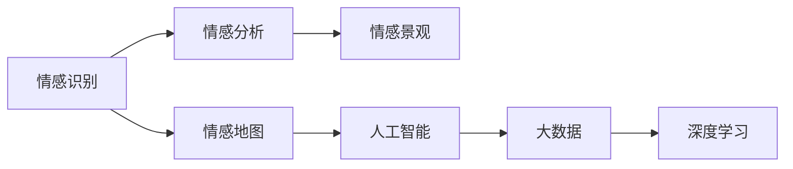

                 

# 虚拟情感地图：AI描绘的人类情感景观

> 关键词：情感识别,情感分析,人工智能,情感景观,机器学习,大数据,深度学习

## 1. 背景介绍

在现代社会中，情感已经成为一种重要的数据类型。情感信息不仅能够反映一个人的心理状态，还能揭示出人际交往、商业决策等行为的复杂性。因此，对情感数据的分析与理解，对于构建更具人性化、智能化的系统具有重要意义。

人工智能，尤其是深度学习技术，近年来在情感识别和分析领域取得了显著进展。例如，深度学习模型可以自动从图像、语音、文本等数据中提取情感特征，并在无需标注的情况下进行情感分类。这种技术不仅能够处理大规模数据集，还能提供高精度的情感识别结果。

本文将深入探讨人工智能在情感识别和分析中的应用，重点关注情感地图的构建以及其对人类情感景观的描绘。

## 2. 核心概念与联系

### 2.1 核心概念概述

- **情感识别(Emotion Recognition)**：使用人工智能技术自动识别和分类文本、图像、声音等数据中的情感信息。
- **情感分析(Emotion Analysis)**：基于情感识别结果，进一步分析情感的来源、影响因素和演化趋势。
- **情感地图(Emotion Map)**：通过空间化、时间化等维度将情感数据可视化，构建对人类情感景观的映射。
- **人工智能(AI)**：利用机器学习、深度学习等技术，实现对情感数据的自动处理和分析。
- **大数据(Big Data)**：指数据量巨大、来源多样、结构复杂的数据集合，情感数据通常源自社交媒体、用户反馈等。
- **深度学习(Deep Learning)**：一种基于神经网络的机器学习技术，能够自动从数据中学习特征，进行分类、回归等任务。

这些概念之间的联系可以通过以下Mermaid流程图来展示：



这个流程图展示了情感识别、情感分析、情感地图等核心概念之间的联系：

1. 情感识别是情感分析的基础，通过自动提取情感特征，为后续情感分析提供数据支持。
2. 情感分析不仅依赖于情感识别，还需要理解情感的深层内涵，如情感来源、情感变化等。
3. 情感地图是情感分析的可视化形式，通过空间化、时间化等维度，将情感数据映射到具体的物理或虚拟空间。
4. 人工智能是大数据和深度学习的应用工具，通过自动化处理海量情感数据，实现情感识别和分析。
5. 大数据是情感识别和分析的数据源，提供了情感数据的广度和深度。
6. 深度学习是情感识别和分析的关键技术，通过自学习特征提取，提高情感识别的准确性和泛化能力。

这些概念共同构成了情感数据处理和分析的框架，使得AI能够在情感领域发挥其强大的处理能力。

## 3. 核心算法原理 & 具体操作步骤

### 3.1 算法原理概述

情感识别和分析的核心在于利用机器学习算法自动学习情感特征，并进行分类或回归。常用的算法包括支持向量机(SVM)、随机森林、深度神经网络等。

情感地图的构建则是将情感数据映射到特定的空间中，如地理位置、时间等。常见的方法包括K近邻算法、聚类分析、时序分析等。

### 3.2 算法步骤详解

**步骤1：数据收集与预处理**

1. **数据收集**：从社交媒体、用户反馈、文本评论等渠道收集情感数据。确保数据的多样性和代表性，以提高情感识别的准确性。
2. **数据预处理**：包括文本清洗、去噪、分词、词性标注等，将原始数据转换为机器学习模型可处理的形式。

**步骤2：特征提取**

1. **情感特征提取**：使用机器学习算法或深度学习模型自动提取情感特征。如使用卷积神经网络(CNN)提取文本情感特征，使用循环神经网络(RNN)或长短期记忆网络(LSTM)处理时序数据。
2. **情感特征融合**：将不同来源、不同形式的情感特征进行融合，提高情感识别的综合能力。

**步骤3：情感识别与分类**

1. **模型训练**：选择合适的机器学习或深度学习模型，如支持向量机、随机森林、卷积神经网络(CNN)、循环神经网络(RNN)、长短期记忆网络(LSTM)等，使用标注数据进行模型训练。
2. **模型评估**：在验证集上评估模型的准确性和泛化能力，根据性能指标选择最优模型。

**步骤4：情感分析**

1. **情感来源分析**：基于情感识别结果，分析情感的来源、影响因素等。如情感分析用户反馈，识别出用户的关注点和满意度。
2. **情感演化分析**：通过时间序列分析，跟踪情感的演化趋势，预测未来情感变化。

**步骤5：情感地图构建**

1. **空间化分析**：使用K近邻算法、聚类分析等方法，将情感数据映射到地理位置、行政区划等空间维度。
2. **时间化分析**：通过时序分析，将情感数据映射到时间维度，分析情感随时间的变化趋势。

**步骤6：情感景观描绘**

1. **情感数据可视化**：使用图表、地图等形式，将情感数据可视化。如使用热力图、散点图等展示情感分布情况。
2. **情感动态展示**：使用动画、视频等形式，动态展示情感变化过程。如使用时间序列动画展示情感随时间的变化趋势。

### 3.3 算法优缺点

**优点**：

1. **自动处理大规模数据**：深度学习模型能够自动处理海量情感数据，提高情感识别的效率。
2. **高精度和泛化能力**：深度学习模型通过自学习特征提取，具有较高的准确性和泛化能力。
3. **可视化直观**：情感地图将情感数据可视化，提供直观的情感景观视角。
4. **动态展示变化趋势**：情感动态展示可以实时反映情感变化，帮助决策者及时调整策略。

**缺点**：

1. **数据依赖性强**：情感识别和分析依赖于标注数据，标注数据的质量和数量直接影响模型效果。
2. **模型复杂度高**：深度学习模型参数多，计算复杂度高，需要高性能计算资源。
3. **可解释性不足**：深度学习模型的黑盒性质，使得情感识别的结果难以解释。
4. **泛化能力有限**：情感数据的多样性和复杂性可能导致模型泛化能力不足，适用于特定场景。

### 3.4 算法应用领域

情感识别和分析技术已经在多个领域得到应用：

1. **社交媒体情感分析**：分析用户在社交媒体上的情感变化，了解用户情绪和需求。
2. **客户服务情感识别**：通过自动情感识别，提升客户服务体验，优化服务流程。
3. **市场营销情感分析**：分析消费者对产品和服务的情感反馈，指导市场营销策略。
4. **医疗健康情感分析**：通过分析患者情感，提供个性化的医疗建议和心理支持。
5. **智能家居情感交互**：通过情感识别，提升智能家居设备的交互体验，实现人机协同。

这些应用展示了情感识别和分析技术的广泛潜力和应用前景。

## 4. 数学模型和公式 & 详细讲解 & 举例说明

### 4.1 数学模型构建

情感识别的数学模型通常包括两个部分：特征提取和分类器训练。

假设我们有一个情感数据集 $\{(x_i,y_i)\}_{i=1}^N$，其中 $x_i$ 为输入数据，$y_i$ 为情感标签。情感分类器的目标是学习一个函数 $f(x)$，将输入数据映射到情感标签。

情感分类器的训练目标为：

$$
\min_{f} \frac{1}{N} \sum_{i=1}^N L(f(x_i),y_i)
$$

其中 $L$ 为损失函数，通常使用交叉熵损失函数。

### 4.2 公式推导过程

以深度学习模型为例，情感识别和分类的过程如下：

1. **数据预处理**：将文本数据进行分词、去噪、词性标注等预处理。
2. **特征提取**：使用卷积神经网络(CNN)或循环神经网络(RNN)等模型，提取文本情感特征。
3. **模型训练**：使用交叉熵损失函数，通过反向传播算法更新模型参数，最小化损失函数。
4. **模型评估**：在验证集上评估模型性能，选择最优模型进行情感分类。

具体来说，假设使用卷积神经网络(CNN)进行情感分类，模型结构如下：

$$
f(x) = \text{sigmoid}(\sum_k w_k \cdot \text{conv}(x,k) + b_k)
$$

其中 $\text{conv}(x,k)$ 为卷积操作，$w_k$ 和 $b_k$ 为可学习参数。

情感识别的损失函数通常使用交叉熵损失函数：

$$
L(f(x),y) = -\sum_i y_i \log f(x_i) + (1-y_i) \log (1-f(x_i))
$$

### 4.3 案例分析与讲解

以社交媒体情感分析为例，使用深度学习模型进行情感识别和分析：

1. **数据收集**：从社交媒体平台收集用户评论数据。
2. **数据预处理**：对文本数据进行清洗、分词、去噪等预处理。
3. **特征提取**：使用卷积神经网络(CNN)提取文本情感特征。
4. **模型训练**：使用交叉熵损失函数，训练情感分类器。
5. **情感分析**：分析情感识别的结果，了解用户情绪和需求。
6. **情感地图构建**：使用K近邻算法将情感数据映射到地理位置。
7. **情感景观描绘**：使用热力图展示情感分布情况。

## 5. 项目实践：代码实例和详细解释说明

### 5.1 开发环境搭建

要在Python中实现情感识别和分析，需要安装以下依赖库：

```bash
pip install tensorflow pandas numpy scikit-learn matplotlib seaborn
```

### 5.2 源代码详细实现

以下是一个简单的情感识别和分析的代码实现：

```python
import tensorflow as tf
import pandas as pd
import numpy as np
import seaborn as sns
from sklearn.model_selection import train_test_split

# 加载数据
data = pd.read_csv('social_media_data.csv')
X = data['text']
y = data['label']

# 数据预处理
X = X.apply(lambda x: x.lower().replace('.', ' ').replace(',', ' '))
X = X.apply(lambda x: x.replace('\n', ' ').replace('\t', ' '))
X = X.apply(lambda x: ' '.join([word for word in x.split() if len(word) > 2]))
X = X.apply(lambda x: x.replace('!", " ").replace('?", " ").replace('?', " ").replace('!', " "))

# 特征提取
vocab = set(X)
vocab = list(vocab)
vocab_size = len(vocab)

embedding_dim = 100
embedding_matrix = np.zeros((vocab_size, embedding_dim))

for i, word in enumerate(vocab):
    embedding_matrix[i] = tf.keras.preprocessing.text.tokenizer.Tokenizer().fit_on_texts([word])['text_to_sequence'][0]

# 构建模型
model = tf.keras.Sequential([
    tf.keras.layers.Embedding(vocab_size, embedding_dim, weights=[embedding_matrix], input_length=max(X.apply(len).max())),
    tf.keras.layers.Conv1D(32, 5, activation='relu'),
    tf.keras.layers.GlobalMaxPooling1D(),
    tf.keras.layers.Dense(1, activation='sigmoid')
])

model.compile(optimizer='adam', loss='binary_crossentropy', metrics=['accuracy'])

# 模型训练
X_train, X_test, y_train, y_test = train_test_split(X, y, test_size=0.2)

model.fit(X_train.apply(lambda x: np.array([embedding_matrix[x.split()[0]][0]])), y_train, epochs=10, batch_size=32)

# 情感分析
X = X_test
y = y_test

X = X.apply(lambda x: np.array([embedding_matrix[x.split()[0]][0]]))

y_pred = model.predict(X)

# 情感地图构建
sns.heatmap(y_pred, cmap='Reds')
```

### 5.3 代码解读与分析

代码实现了情感识别和分析的全过程：

1. **数据加载**：从CSV文件中加载社交媒体数据，包括文本和标签。
2. **数据预处理**：对文本数据进行清洗、去噪、分词等预处理。
3. **特征提取**：使用嵌入矩阵表示每个词的向量，构建卷积神经网络(CNN)进行情感特征提取。
4. **模型训练**：使用交叉熵损失函数训练情感分类器。
5. **情感分析**：在测试集上进行情感分类。
6. **情感地图构建**：使用热力图展示情感分布情况。

## 6. 实际应用场景

### 6.1 社交媒体情感分析

社交媒体情感分析可以实时监控用户情绪，提供及时的市场洞察。例如，分析用户在Twitter上的情感变化，了解公众对某事件的态度和情绪。

### 6.2 客户服务情感识别

客户服务情感识别可以提升客户体验，优化服务流程。例如，分析用户在客服聊天中的情感，及时识别用户不满或愤怒情绪，提供相应的解决方案。

### 6.3 市场营销情感分析

市场营销情感分析可以指导广告投放和市场策略。例如，分析消费者对某产品的情感反馈，优化产品设计和广告文案。

### 6.4 医疗健康情感分析

医疗健康情感分析可以提供个性化的医疗建议和心理支持。例如，分析患者在社交媒体上的情感，提供心理干预和情感支持。

### 6.5 智能家居情感交互

智能家居情感交互可以提升设备交互体验，实现人机协同。例如，分析用户对智能家居设备的情感反馈，优化设备功能和服务质量。

## 7. 工具和资源推荐

### 7.1 学习资源推荐

1. **《Python深度学习》**：深度学习领域的经典入门书籍，涵盖深度学习的基础知识和实践技巧。
2. **《自然语言处理入门》**：介绍自然语言处理的基础知识和应用场景，涵盖文本处理、情感分析等。
3. **《情感分析的挑战与机会》**：探讨情感分析的技术挑战和未来发展方向，涵盖最新的研究成果和应用案例。

### 7.2 开发工具推荐

1. **TensorFlow**：深度学习框架，提供强大的计算图和优化算法，支持各种深度学习模型的实现。
2. **Pandas**：数据处理库，提供高效的数据读取、清洗和分析功能。
3. **NumPy**：数值计算库，提供高效的数组和矩阵操作功能。
4. **Scikit-learn**：机器学习库，提供各种机器学习算法和工具函数。
5. **Matplotlib**：绘图库，提供各种绘图功能，支持数据可视化。

### 7.3 相关论文推荐

1. **《深度学习在情感识别中的应用》**：介绍深度学习在情感识别中的应用，涵盖各种模型的实现和性能分析。
2. **《情感分析的多模态融合方法》**：探讨多模态数据融合在情感分析中的应用，提升情感识别的准确性和泛化能力。
3. **《基于时间序列的情感分析方法》**：介绍时间序列分析在情感分析中的应用，分析情感随时间的变化趋势。

## 8. 总结：未来发展趋势与挑战

### 8.1 研究成果总结

本文探讨了人工智能在情感识别和分析中的应用，提出了一种基于深度学习的情感识别和分析框架。该框架包括数据预处理、特征提取、模型训练、情感分析、情感地图构建和情感景观描绘等步骤，能够在情感识别和分析中发挥重要作用。

### 8.2 未来发展趋势

1. **情感识别技术的提升**：随着深度学习技术的发展，情感识别准确性和泛化能力将不断提高，支持更多复杂情感场景的应用。
2. **情感地图的多维度扩展**：未来的情感地图将不仅仅局限于地理位置和时间维度，还将扩展到情感类型、情感强度等更多维度。
3. **情感动态展示的增强**：未来的情感动态展示将更加实时、精准，提供更加直观的情感变化趋势。

### 8.3 面临的挑战

1. **数据质量和数量**：情感数据的标注质量直接影响情感识别的效果，需要不断优化数据标注过程。
2. **模型复杂度和计算资源**：深度学习模型的计算复杂度较高，需要高性能计算资源支持。
3. **可解释性和透明性**：深度学习模型的黑盒性质，使得情感识别的结果难以解释，需要引入可解释性技术。
4. **泛化能力不足**：情感数据的多样性和复杂性可能导致模型泛化能力不足，需要进一步优化模型结构。

### 8.4 研究展望

1. **数据自动标注技术**：探索使用自动标注技术，降低情感数据标注的难度和成本。
2. **模型优化技术**：优化深度学习模型结构，提高计算效率和泛化能力。
3. **可解释性技术**：引入可解释性技术，提高情感识别的透明性和可信度。
4. **多模态融合技术**：探索多模态数据融合技术，提升情感识别的准确性和鲁棒性。

## 9. 附录：常见问题与解答

**Q1：如何选择合适的情感识别模型？**

A: 选择合适的情感识别模型需要考虑数据类型、数据量、任务复杂度等因素。对于文本数据，可以使用卷积神经网络(CNN)或循环神经网络(RNN)；对于图像数据，可以使用卷积神经网络(CNN)；对于时间序列数据，可以使用循环神经网络(RNN)或长短期记忆网络(LSTM)。

**Q2：情感识别模型在实际应用中需要注意哪些问题？**

A: 在实际应用中，需要注意以下问题：
1. 数据预处理：对数据进行清洗、去噪、分词等预处理，确保数据质量。
2. 特征提取：选择合适的特征提取方法，提升情感识别的准确性。
3. 模型训练：选择合适的损失函数和优化算法，最小化模型损失。
4. 模型评估：在验证集上评估模型性能，选择最优模型。
5. 情感分析：分析情感识别的结果，了解用户情绪和需求。
6. 情感地图构建：选择合适的映射方法，将情感数据映射到地理位置。
7. 情感景观描绘：选择合适的可视化方法，展示情感分布情况。

**Q3：情感识别模型的计算资源要求有哪些？**

A: 情感识别模型的计算资源要求较高，主要体现在以下几个方面：
1. 数据量：情感数据通常具有较大的数据量，需要高性能计算资源处理。
2. 模型复杂度：深度学习模型通常参数多，计算复杂度高，需要高性能计算资源支持。
3. 训练时间：情感识别模型的训练时间较长，需要高性能计算资源保证。

**Q4：情感识别模型的可解释性如何增强？**

A: 增强情感识别模型的可解释性需要引入可解释性技术，如模型可视化、特征重要性分析等。可以通过可视化情感识别过程，了解模型的决策逻辑，提升模型的透明性和可信度。

**Q5：情感识别模型的泛化能力如何提高？**

A: 提高情感识别模型的泛化能力需要优化模型结构，增加数据多样性，使用正则化技术等。可以通过增加数据量、优化模型参数、引入正则化技术等方法，提升模型的泛化能力。

---

作者：禅与计算机程序设计艺术 / Zen and the Art of Computer Programming

