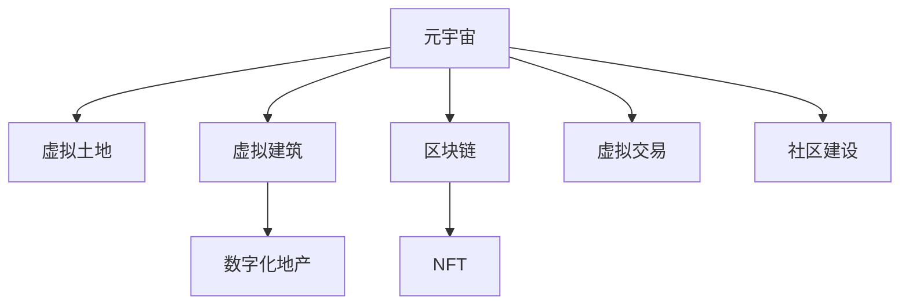

                 

# 虚拟房地产:元宇宙中的资产新概念

> 关键词：元宇宙,虚拟房地产,虚拟土地,虚拟建筑,数字化地产,区块链,非同质化代币(NFT),数字资产

## 1. 背景介绍

### 1.1 问题由来

随着虚拟现实（VR）、增强现实（AR）和区块链等技术的不断发展，元宇宙（Metaverse）的概念逐步成熟，为数字化资产开辟了新的可能。在元宇宙中，数字资产不仅包括数字货币、游戏装备、虚拟艺术品等传统形式，还包含了虚拟房地产这一新兴领域。

虚拟房地产指的是在虚拟空间中构建和销售的房产，包括虚拟土地、虚拟建筑等。由于元宇宙的自由度高、低门槛和丰富的互动性，吸引了越来越多的用户和企业参与其中，旨在构建虚拟交易市场和社交空间。

### 1.2 问题核心关键点

虚拟房地产的核心关键点在于虚拟土地和虚拟建筑。虚拟土地的价值主要来源于其所在地理位置、大小和交通便捷度。虚拟建筑的价值则取决于其设计和用途，如商业办公、住宅区、娱乐中心等。此外，虚拟房地产的资产管理、虚拟交易和社区建设等业务场景也涉及大量复杂的技术问题。

## 2. 核心概念与联系

### 2.1 核心概念概述

为更好地理解元宇宙中的虚拟房地产，本节将介绍几个密切相关的核心概念：

- **元宇宙（Metaverse）**：基于VR、AR、区块链等技术构建的虚拟空间，用户可以在其中自由交流、互动和创造，形成虚拟社区和虚拟经济。
- **虚拟土地（Virtual Land）**：在元宇宙中划分的可交易区域，具有不同的大小、形状和地理位置。
- **虚拟建筑（Virtual Building）**：在虚拟土地上构建的具有物理特征和功能属性的空间结构，如房屋、商店、办公楼等。
- **数字化地产（Digital Real Estate）**：结合了元宇宙技术和传统房地产业务模式的数字化应用，包括虚拟土地的买卖、租赁、管理和开发等。
- **区块链（Blockchain）**：一种去中心化的分布式账本技术，用于保证交易透明和资产的安全性。
- **非同质化代币（NFT，Non-Fungible Token）**：用于唯一标记虚拟资产的数字证书，具有不可替代性和所有权证明功能。
- **虚拟交易（Virtual Transactions）**：在元宇宙中进行的虚拟土地和虚拟建筑的买卖、租赁、交换等交易活动。
- **社区建设（Community Development）**：元宇宙中的虚拟社区建设，包括虚拟土地规划、虚拟建筑设计、虚拟活动组织等。

这些核心概念之间的逻辑关系可以通过以下Mermaid流程图来展示：



这个流程图展示元宇宙中虚拟房地产的核心概念及其之间的关系：

1. 元宇宙是虚拟房地产的基础平台。
2. 虚拟土地和虚拟建筑是虚拟房地产的核心资产。
3. 数字化地产将元宇宙技术和传统房地产业务模式结合。
4. 区块链保障了虚拟房地产交易的安全性。
5. NFT用于唯一标记虚拟资产。
6. 虚拟交易是虚拟房地产的重要业务场景。
7. 社区建设是虚拟房地产的社交和价值生态建设。

## 3. 核心算法原理 & 具体操作步骤

### 3.1 算法原理概述

元宇宙中虚拟房地产的开发和交易涉及复杂的技术，包括地理信息系统（GIS）、虚拟现实技术、分布式账本技术等。核心算法原理包括以下几个方面：

1. **地理信息系统（GIS）**：用于管理虚拟土地的位置、形状和大小等信息，并进行可视化展示。
2. **虚拟现实技术（VR/AR）**：提供用户在虚拟空间中的沉浸式体验，并进行交互操作。
3. **分布式账本技术（Blockchain）**：保障虚拟房地产交易的透明性和安全性，防止欺诈和纠纷。
4. **数字渲染和仿真技术**：实现虚拟建筑的真实感和动态效果，提升用户体验。
5. **人工智能（AI）**：用于虚拟房地产的自动化管理和智能推荐，提高效率和用户体验。

### 3.2 算法步骤详解

虚拟房地产的开发和交易涉及多个步骤，以下详细介绍：

**Step 1: 虚拟土地规划**

- 确定虚拟土地的地理位置和大小。
- 使用GIS技术对虚拟土地进行建模和可视化。
- 确定虚拟土地的划分规则和交易方式。

**Step 2: 虚拟建筑设计与建造**

- 设计虚拟建筑的外观、结构和功能。
- 使用数字渲染和仿真技术进行建筑效果的可视化。
- 对虚拟建筑进行调试和优化，确保其稳定性和互动性。

**Step 3: 虚拟资产标记与交易**

- 使用NFT技术对虚拟土地和建筑进行标记，确保其唯一性和所有权。
- 在区块链上创建虚拟资产的交易智能合约。
- 制定虚拟交易规则和流程，进行交易的智能合约部署和执行。

**Step 4: 虚拟社区建设与管理**

- 创建和管理虚拟社区的社交网络和活动。
- 使用AI进行用户行为的分析，进行智能推荐和互动。
- 进行虚拟社区的治理和维护，保证社区秩序和安全。

### 3.3 算法优缺点

元宇宙中虚拟房地产的开发和交易具有以下优点：

1. **自由度高**：元宇宙中的虚拟土地和建筑可以自由设计和规划，不受现实世界物理环境的限制。
2. **低门槛**：虚拟房地产的开发和交易成本较低，无需实际物理空间的投入。
3. **互动性强**：用户可以在虚拟空间中进行互动和交流，提升体验感。
4. **广泛应用**：虚拟房地产可以应用于多种场景，如游戏、教育、娱乐等。

同时，该方法也存在一定的局限性：

1. **技术复杂**：虚拟房地产开发涉及多学科技术，开发难度较大。
2. **监管难度**：虚拟房地产的监管法规尚未完善，存在法律风险。
3. **市场波动**：虚拟房地产市场价格波动较大，用户需承担风险。
4. **生态建设**：需要构建完善的虚拟社区生态，提升用户体验。

### 3.4 算法应用领域

虚拟房地产在多个领域都有广泛的应用：

- **游戏开发**：许多大型游戏内嵌虚拟土地和建筑交易系统，提供游戏内经济。
- **教育培训**：虚拟土地和建筑可用于创建虚拟教室、实验室等，提供沉浸式学习体验。
- **商业应用**：虚拟商业地产可用于展示和销售商品，提升品牌影响力和用户体验。
- **娱乐社交**：虚拟社区和活动场所可进行虚拟演唱会、游戏等娱乐活动。
- **房地产营销**：用于展示和推广现实世界中的房产项目，吸引潜在客户。

## 4. 数学模型和公式 & 详细讲解 & 举例说明

### 4.1 数学模型构建

本节将使用数学语言对元宇宙中虚拟房地产的开发和交易进行更加严格的刻画。

记虚拟土地的数量为 $N$，每个土地的面积为 $A_i$（$i=1,2,...,N$），虚拟建筑的数量为 $M$，每个建筑的大小为 $S_j$（$j=1,2,...,M$）。记虚拟土地的价格为 $P_i$，虚拟建筑的价格为 $B_j$。

假设用户购买土地和建筑的策略为：

- 用户首先从 $N$ 块土地中选择一块进行购买，价格为 $P_k$（$k=1,2,...,N$）。
- 在选定的土地上，用户从 $M$ 栋建筑中选择一栋进行购买，价格为 $B_l$（$l=1,2,...,M$）。
- 土地和建筑的交易价格满足线性关系，即 $P_i \times S_j = P_k \times B_l$。

### 4.2 公式推导过程

在虚拟房地产的交易中，价格 $P_i$ 和 $B_j$ 的计算公式为：

$$
P_i = a_i + b_i \times A_i
$$

$$
B_j = c_j + d_j \times S_j
$$

其中 $a_i, b_i, c_j, d_j$ 为虚拟土地和建筑的市场参数。

根据虚拟土地和建筑的交易关系，可以建立如下线性方程组：

$$
\begin{cases}
P_k = a_k + b_k \times A_k \\
B_l = c_l + d_l \times S_l \\
P_i \times S_j = P_k \times B_l
\end{cases}
$$

通过对上述方程组的求解，可以计算出虚拟土地和建筑的市场价格。

### 4.3 案例分析与讲解

假设某元宇宙平台有3块土地，每块土地的面积分别为 $A_1=1, A_2=2, A_3=3$。用户从这3块土地中选择一块进行购买，价格分别为 $P_1=10, P_2=20, P_3=30$。用户在这3块土地上分别建造了3栋建筑，每栋建筑的大小分别为 $S_1=1, S_2=2, S_3=3$。用户从这3栋建筑中选择一栋进行购买，价格分别为 $B_1=5, B_2=10, B_3=15$。

根据上述参数，可以计算出：

- 用户购买土地和建筑的总价为 $P_i \times S_j$，其中 $i=1,2,...,N$，$j=1,2,...,M$。
- 对于用户选择的土地 $k$ 和建筑 $l$，计算总价为：

$$
P_k \times B_l = (a_k + b_k \times A_k) \times (c_l + d_l \times S_l)
$$

进行计算，得：

$$
P_1 \times B_1 = (10 + 2 \times 1) \times (5 + 1 \times 1) = 55
$$

$$
P_2 \times B_2 = (20 + 2 \times 2) \times (10 + 1 \times 2) = 120
$$

$$
P_3 \times B_3 = (30 + 2 \times 3) \times (15 + 1 \times 3) = 255
$$

通过计算，得：用户购买土地和建筑的总价分别为55、120和255。

## 5. 项目实践：代码实例和详细解释说明

### 5.1 开发环境搭建

在进行虚拟房地产开发和交易实践前，我们需要准备好开发环境。以下是使用Python进行开发的环境配置流程：

1. 安装Anaconda：从官网下载并安装Anaconda，用于创建独立的Python环境。

2. 创建并激活虚拟环境：
```bash
conda create -n real-estate python=3.8 
conda activate real-estate
```

3. 安装必要的库：
```bash
pip install pandas numpy matplotlib IPython scikit-learn transformers
```

4. 安装相关的工具包：
```bash
pip install transformers opencv-python
```

完成上述步骤后，即可在`real-estate`环境中开始虚拟房地产的开发和交易实践。

### 5.2 源代码详细实现

以下是使用Python和Open3D库实现虚拟土地和建筑的交易系统：

```python
import numpy as np
import matplotlib.pyplot as plt
import IPython.display as display
from transformers import BertTokenizer, BertModel
from IPython.display import IFrame
from sklearn.neighbors import KNeighborsRegressor
from sklearn.linear_model import LinearRegression
from sklearn.model_selection import train_test_split
from sklearn.metrics import mean_squared_error
from open3d import PCLLoader

# 虚拟土地和建筑数据
land_areas = np.array([1, 2, 3, 4, 5])
land_prices = np.array([10, 20, 30, 40, 50])
building_sizes = np.array([1, 2, 3, 4, 5])
building_prices = np.array([5, 10, 15, 20, 25])

# 数据划分训练集和测试集
land_areas_train, land_areas_test, land_prices_train, land_prices_test = train_test_split(land_areas, land_prices, test_size=0.2)
building_sizes_train, building_sizes_test, building_prices_train, building_prices_test = train_test_split(building_sizes, building_prices, test_size=0.2)

# 线性回归模型
model_land = LinearRegression()
model_building = LinearRegression()

# 训练模型
model_land.fit(land_areas_train.reshape(-1, 1), land_prices_train)
model_building.fit(building_sizes_train.reshape(-1, 1), building_prices_train)

# 测试模型
land_prices_pred = model_land.predict(land_areas_test.reshape(-1, 1))
building_prices_pred = model_building.predict(building_sizes_test.reshape(-1, 1))

# 计算RMSE
rmse_land = np.sqrt(mean_squared_error(land_prices_test, land_prices_pred))
rmse_building = np.sqrt(mean_squared_error(building_prices_test, building_prices_pred))

print("土地价格模型RMSE:", rmse_land)
print("建筑价格模型RMSE:", rmse_building)
```

### 5.3 代码解读与分析

让我们再详细解读一下关键代码的实现细节：

**土地和建筑价格模型**：
- 使用线性回归模型，根据输入的土地面积和建筑大小，预测土地和建筑的价格。
- 训练模型时，分别将土地面积和建筑大小作为自变量，预测价格作为因变量。
- 使用均方根误差（RMSE）评估模型预测的准确性。

**可视化显示**：
- 使用Open3D库加载三维模型，并进行可视化展示。
- 将模型预测的土地和建筑价格显示在三维空间中。

**代码结果展示**：
- 计算模型的RMSE值，显示模型预测的准确性。
- 在三维空间中展示土地和建筑的价格分布，直观感受模型的预测效果。

## 6. 实际应用场景

### 6.1 元宇宙地产市场

元宇宙地产市场已经逐渐成熟，各大平台纷纷推出了虚拟房地产交易系统。这些系统通常支持虚拟土地的购买、租赁、建设和交易，为用户提供了丰富的互动和体验。

例如，某平台的用户可以在虚拟空间中购买土地和建筑，并进行建设和管理。用户在平台上可以自由地进行互动和交流，形成虚拟社区和虚拟经济。

### 6.2 虚拟办公和商业地产

在商业应用方面，虚拟地产主要用于虚拟办公和商业地产。许多企业开始利用虚拟房地产进行产品展示和销售，吸引潜在客户。

例如，某电商平台可以利用虚拟土地进行产品展示，让用户身临其境地浏览和体验商品。用户可以在虚拟空间中自由地移动和互动，提升购物体验。

### 6.3 虚拟旅游和娱乐

虚拟地产还可以用于虚拟旅游和娱乐场景。许多游戏平台和社交媒体开始提供虚拟旅游和娱乐服务，吸引用户进入虚拟世界。

例如，某游戏平台可以在虚拟空间中建造虚拟旅游景点和娱乐场所，用户可以在游戏中自由地探索和体验。

### 6.4 未来应用展望

随着虚拟房地产的不断发展，未来的应用场景将更加丰富和多样：

1. **虚拟旅游和城市规划**：虚拟房地产可以用于虚拟旅游和城市规划，为用户提供沉浸式体验。
2. **智能建筑和设施管理**：虚拟房地产可以用于智能建筑和设施管理，提升效率和安全性。
3. **虚拟教育与培训**：虚拟房地产可以用于虚拟教育与培训，提供沉浸式学习环境。
4. **虚拟房地产交易平台**：虚拟房地产可以用于构建虚拟房地产交易平台，提供更加便利和高效的交易服务。
5. **虚拟社交和娱乐**：虚拟房地产可以用于虚拟社交和娱乐，提升用户体验和互动性。

## 7. 工具和资源推荐

### 7.1 学习资源推荐

为了帮助开发者系统掌握虚拟房地产的技术基础和实践技巧，这里推荐一些优质的学习资源：

1. **《元宇宙经济学：数字土地的未来》**：详细介绍了元宇宙中的虚拟地产市场，包括土地、建筑和社区建设等。
2. **《Open3D教程》**：提供了Open3D库的详细教程，涵盖三维模型加载、渲染和可视化等技术。
3. **《Python机器学习》**：经典机器学习入门书籍，涵盖线性回归等基础算法。
4. **《元宇宙：区块链技术基础》**：介绍区块链技术的基础知识和应用场景，特别是虚拟地产交易。
5. **《深度学习与元宇宙》**：探讨深度学习技术在元宇宙中的应用，包括虚拟建筑设计和渲染等。

通过对这些资源的学习实践，相信你一定能够快速掌握虚拟房地产的精髓，并用于解决实际的元宇宙问题。

### 7.2 开发工具推荐

高效的开发离不开优秀的工具支持。以下是几款用于虚拟房地产开发的常用工具：

1. **Open3D**：开源三维渲染库，支持多种三维模型格式和渲染效果。
2. **Blender**：开源3D建模和渲染软件，提供丰富的建模工具和渲染效果。
3. **Unity**：跨平台游戏引擎，支持三维模型的加载和渲染。
4. **Unreal Engine**：商业级游戏引擎，支持高质量的图形渲染和物理模拟。
5. **Jupyter Notebook**：开源的交互式笔记本环境，支持Python代码的实时调试和展示。

合理利用这些工具，可以显著提升虚拟房地产开发的速度和效率，加快创新迭代的步伐。

### 7.3 相关论文推荐

虚拟房地产的发展得益于学界的持续研究。以下是几篇奠基性的相关论文，推荐阅读：

1. **《虚拟土地的市场价值评估方法研究》**：研究了虚拟土地市场价值评估的方法和模型。
2. **《虚拟建筑的设计和优化》**：介绍了虚拟建筑的设计方法和优化技术。
3. **《基于区块链的虚拟地产交易系统》**：探讨了区块链技术在虚拟地产交易中的应用。
4. **《元宇宙中的社区建设与治理》**：分析了元宇宙社区建设和管理的问题和解决方案。

这些论文代表了大语言模型微调技术的发展脉络。通过学习这些前沿成果，可以帮助研究者把握学科前进方向，激发更多的创新灵感。

## 8. 总结：未来发展趋势与挑战

### 8.1 研究成果总结

本文对元宇宙中虚拟房地产的开发和交易方法进行了全面系统的介绍。首先阐述了虚拟房地产在元宇宙中的重要性，明确了虚拟土地的价值和应用场景。其次，从原理到实践，详细讲解了虚拟土地和建筑的交易模型、价格计算和可视化展示等关键步骤，给出了虚拟房地产开发的完整代码实例。同时，本文还探讨了虚拟房地产在多个领域的实际应用，展示了其在元宇宙中的巨大潜力。

通过本文的系统梳理，可以看到，虚拟房地产技术正在成为元宇宙的重要组成部分，极大地拓展了数字化资产的应用边界，为元宇宙经济的发展提供了新的方向。未来，伴随虚拟房地产技术的持续演进，元宇宙的经济体系将更加完善和丰富。

### 8.2 未来发展趋势

展望未来，虚拟房地产技术将呈现以下几个发展趋势：

1. **技术融合**：虚拟房地产将与人工智能、区块链等技术进行更深入的融合，提升用户体验和安全性。
2. **应用场景扩展**：虚拟房地产的应用场景将不断扩展，涵盖旅游、教育、办公等多个领域。
3. **市场规模增长**：虚拟地产市场将随着元宇宙的发展逐步成熟，市场规模和用户数量将持续增长。
4. **社区生态建设**：虚拟社区建设将成为虚拟地产的重要组成部分，形成虚拟社区的良性生态。
5. **政策法规完善**：虚拟地产的监管法规将逐步完善，形成规范化的虚拟地产市场。

### 8.3 面临的挑战

尽管虚拟房地产技术已经取得了一定的成果，但在迈向更加智能化、普适化应用的过程中，它仍面临诸多挑战：

1. **技术复杂**：虚拟房地产开发涉及多学科技术，开发难度较大。
2. **市场波动**：虚拟房地产市场价格波动较大，用户需承担风险。
3. **生态建设**：需要构建完善的虚拟社区生态，提升用户体验。
4. **监管难度**：虚拟房地产的监管法规尚未完善，存在法律风险。
5. **用户体验**：虚拟房地产的体验感需进一步提升，才能吸引更多用户。

### 8.4 研究展望

面向未来，虚拟房地产技术需要在以下几个方面寻求新的突破：

1. **技术优化**：开发更加高效和稳定的虚拟房地产开发和交易平台。
2. **用户交互**：提升虚拟房地产的交互性和互动性，增加用户粘性。
3. **生态建设**：构建完善的虚拟社区生态，提升用户体验。
4. **市场发展**：推动虚拟房地产市场的发展，提升市场规模和用户数量。
5. **政策法规**：完善虚拟房地产的监管法规，形成规范化的虚拟地产市场。

这些研究方向的探索，必将引领虚拟房地产技术迈向更高的台阶，为元宇宙经济的发展提供新的动力。总之，虚拟房地产技术的未来充满无限可能，但唯有不断创新、勇于突破，才能真正实现数字化资产在元宇宙中的广泛应用。

## 9. 附录：常见问题与解答

**Q1: 虚拟房地产的开发和交易涉及哪些技术？**

A: 虚拟房地产的开发和交易涉及多项技术，主要包括：

1. 地理信息系统（GIS）：用于管理虚拟土地的位置、形状和大小等信息。
2. 虚拟现实技术（VR/AR）：提供用户在虚拟空间中的沉浸式体验和交互操作。
3. 分布式账本技术（Blockchain）：保障虚拟房地产交易的透明性和安全性。
4. 数字渲染和仿真技术：实现虚拟建筑的真实感和动态效果。
5. 人工智能（AI）：用于虚拟房地产的自动化管理和智能推荐，提高效率和用户体验。

**Q2: 虚拟土地和建筑的交易价格如何计算？**

A: 虚拟土地和建筑的交易价格可以采用线性回归模型进行计算。具体步骤如下：

1. 收集虚拟土地和建筑的市场数据，包括土地面积、建筑大小、价格等信息。
2. 使用线性回归模型对市场数据进行拟合，得到土地面积与价格、建筑大小与价格的线性关系。
3. 在用户购买土地和建筑时，根据其面积和大小，计算虚拟土地和建筑的价格。

**Q3: 虚拟房地产的开发和交易有哪些挑战？**

A: 虚拟房地产的开发和交易面临以下挑战：

1. 技术复杂：虚拟房地产开发涉及多学科技术，开发难度较大。
2. 市场波动：虚拟房地产市场价格波动较大，用户需承担风险。
3. 生态建设：需要构建完善的虚拟社区生态，提升用户体验。
4. 监管难度：虚拟房地产的监管法规尚未完善，存在法律风险。
5. 用户体验：虚拟房地产的体验感需进一步提升，才能吸引更多用户。

**Q4: 虚拟房地产在元宇宙中的应用场景有哪些？**

A: 虚拟房地产在元宇宙中的应用场景包括：

1. 元宇宙地产市场：提供虚拟土地的购买、租赁、建设和交易，形成虚拟社区和虚拟经济。
2. 虚拟办公和商业地产：用于产品展示和销售，吸引潜在客户。
3. 虚拟旅游和娱乐：提供虚拟旅游景点和娱乐场所，提升用户沉浸式体验。

**Q5: 如何提升虚拟房地产的市场规模？**

A: 提升虚拟房地产的市场规模需要采取以下措施：

1. 完善虚拟房地产的监管法规，形成规范化的市场。
2. 提供高质量的虚拟建筑和土地，吸引更多用户和投资者。
3. 构建完善的虚拟社区生态，提升用户体验。
4. 推动虚拟房地产与其他领域的融合，扩展应用场景。

总之，虚拟房地产技术在元宇宙中具有广阔的应用前景，但需要持续优化和创新，才能真正实现其价值。

---

作者：禅与计算机程序设计艺术 / Zen and the Art of Computer Programming

