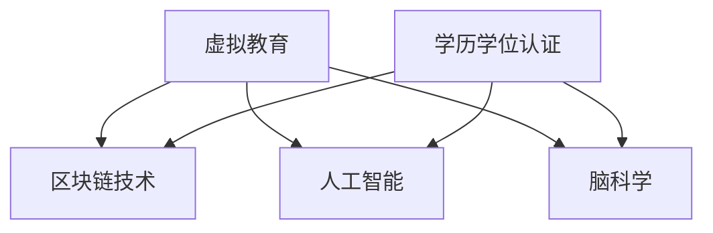

                 

# 虚拟教育认证:全球脑时代的学历学位体系

> 关键词：虚拟教育,认证体系,学历学位,人工智能,脑科学,全球脑时代

## 1. 背景介绍

### 1.1 问题由来

在当前全球脑时代的背景下，教育体系正经历着深刻的变革。信息技术和大数据的广泛应用，使得虚拟教育成为可能。传统的教育模式，依赖于教室、课本和教师的物理存在，正逐渐被基于互联网和智能设备的虚拟教育所取代。然而，在享受虚拟教育带来的便捷和高效的同时，人们也面临着学历学位认证的挑战。

传统教育体系中的学历学位认证，依赖于纸质证书和实体考试，需要耗费大量时间和精力进行审核和发放。虚拟教育环境下，这种认证方式显然不再适用。如何建立一套适用于虚拟教育的认证体系，成为了一个亟待解决的问题。

### 1.2 问题核心关键点

为了应对虚拟教育带来的挑战，全球脑时代下需要一套新的学历学位认证体系。该体系的核心关键点包括：

1. **区块链技术**：通过分布式账本和去中心化存储，确保学历学位信息的不可篡改和可追溯性。
2. **人工智能**：利用智能算法评估学习成果，自动生成认证结果。
3. **脑科学**：结合脑科学研究成果，优化教育内容和评估方式，提升学习效果和认证准确性。
4. **全球化**：建立统一的认证标准和接口，促进全球范围内的教育互认和合作。

这些核心关键点共同构成了全球脑时代学历学位认证体系的基础，旨在构建一个高效、公正、普适的教育评估机制。

## 2. 核心概念与联系

### 2.1 核心概念概述

为更好地理解全球脑时代的学历学位认证体系，本节将介绍几个密切相关的核心概念：

- **虚拟教育**：基于互联网和智能设备的教育模式，通过虚拟教室、在线课程等方式进行教学和评估。
- **区块链技术**：分布式账本技术，通过加密和共识机制，实现数据的去中心化存储和不可篡改性。
- **人工智能**：利用机器学习和深度学习算法，实现自动化评估和决策。
- **脑科学**：研究人类大脑的运作机制和认知过程，指导教育内容和评估方式的优化。
- **学历学位认证**：通过考试、课程学习、实践经验等方式，评估学生的学术能力和知识水平，发放相应的学历学位证书。

这些核心概念之间的逻辑关系可以通过以下Mermaid流程图来展示：



这个流程图展示了几者之间的联系：

1. **虚拟教育**是构建认证体系的基础。
2. **区块链技术**用于确保数据的不可篡改性和透明性。
3. **人工智能**用于评估学习成果和生成认证结果。
4. **脑科学**为教育内容和评估方式的优化提供科学依据。
5. **学历学位认证**是整个体系的核心，通过人工智能和区块链技术支持实现。

## 3. 核心算法原理 & 具体操作步骤
### 3.1 算法原理概述

全球脑时代的学历学位认证体系，本质上是将区块链技术和人工智能算法应用于虚拟教育中，通过自动化评估和分布式存储，实现学历学位的公正、透明和可追溯性。其核心思想是：

- **自动化评估**：利用人工智能算法，自动分析学生的学习行为、成果和表现，生成认证结果。
- **分布式存储**：通过区块链技术，将认证数据存储在分布式账本上，确保数据的不可篡改性和透明性。
- **智能合约**：结合人工智能和区块链技术，实现自动化的认证流程，包括学习过程的记录、成绩的评估和证书的发放。

### 3.2 算法步骤详解

全球脑时代的学历学位认证体系主要包括以下几个关键步骤：

**Step 1: 设计评估模型**

- 选择合适的评估指标，如学习时长、考试成绩、项目成果等。
- 设计机器学习模型，用于分析学生的数据，生成评估结果。

**Step 2: 搭建区块链平台**

- 选择合适的区块链平台，如Hyperledger Fabric、Ethereum等。
- 设计智能合约，实现自动化评估和认证过程。

**Step 3: 数据收集与存储**

- 收集学生学习过程中产生的数据，包括课程成绩、作业提交、项目成果等。
- 将数据存储在区块链平台上，确保数据的不可篡改性和透明性。

**Step 4: 评估与认证**

- 将收集到的数据输入评估模型，生成学生的学习评估结果。
- 结合智能合约，自动生成并发放学历学位证书。

**Step 5: 持续优化与维护**

- 定期收集用户反馈，优化评估模型和智能合约。
- 更新区块链平台，确保系统的稳定性和安全性。

### 3.3 算法优缺点

全球脑时代的学历学位认证体系具有以下优点：

1. **高效透明**：通过自动化评估和分布式存储，减少了人工审核和纸质证书的使用，提高了认证过程的效率和透明度。
2. **公正可靠**：利用人工智能和区块链技术，确保评估结果的客观性和数据的不可篡改性。
3. **可追溯性**：区块链的分布式账本技术，使得每个学历学位认证都有详细的记录和历史追溯。
4. **灵活可扩展**：结合人工智能和区块链技术，该体系可以灵活扩展，适用于各种虚拟教育场景。

同时，该体系也存在一定的局限性：

1. **技术复杂性**：结合人工智能和区块链技术，构建和维护该体系需要较高的技术门槛。
2. **数据隐私**：区块链的透明性可能暴露学生隐私，需要采取相应的隐私保护措施。
3. **认证准确性**：人工智能评估模型的准确性和鲁棒性，需要经过充分验证和优化。
4. **标准化问题**：全球范围内的学历学位认证，需要建立统一的标准和接口，存在一定的标准化问题。

尽管存在这些局限性，但全球脑时代的学历学位认证体系，无疑为虚拟教育带来了全新的解决方案，具有广阔的应用前景。

### 3.4 算法应用领域

全球脑时代的学历学位认证体系，适用于以下领域：

1. **在线教育平台**：如Coursera、edX等，通过区块链和人工智能技术，实现课程认证和学分互认。
2. **虚拟职业培训**：如Udacity、Pluralsight等，提供技能认证和培训成果评估。
3. **国际教育合作**：通过统一的标准和接口，促进全球范围内的教育互认和合作。
4. **终身学习系统**：构建终身学习评估和认证机制，推动终身学习体系的建立。
5. **职业资格认证**：如程序员、工程师、设计师等，通过人工智能评估和区块链认证，提升职业资格的可信度。

## 4. 数学模型和公式 & 详细讲解 & 举例说明

### 4.1 数学模型构建

本节将使用数学语言对全球脑时代的学历学位认证体系进行更加严格的刻画。

记学生学习过程的数据为 $D=\{x_i\}_{i=1}^N$，其中 $x_i$ 为第 $i$ 个学生的学习记录，包括课程成绩、作业提交、项目成果等。设评估模型的参数为 $\theta$，则评估函数为：

$$
f(x_i; \theta) = \sum_{k=1}^K w_k f_k(x_i; \theta)
$$

其中 $w_k$ 为第 $k$ 个评估指标的权重，$f_k(x_i; \theta)$ 为第 $k$ 个评估指标对应的函数。

### 4.2 公式推导过程

以下我们以基于考试成绩的学历学位认证为例，推导评估函数及其梯度计算公式。

假设模型 $M_{\theta}$ 在输入 $x_i$ 上的输出为 $y_i$，表示学生是否通过考试。真实标签 $y_i \in \{0,1\}$。则二分类交叉熵损失函数定义为：

$$
\ell(M_{\theta}(x_i),y_i) = -[y_i\log \hat{y_i} + (1-y_i)\log (1-\hat{y_i})]
$$

将其代入经验风险公式，得：

$$
\mathcal{L}(\theta) = -\frac{1}{N}\sum_{i=1}^N [y_i\log M_{\theta}(x_i)+(1-y_i)\log(1-M_{\theta}(x_i))]
$$

根据链式法则，损失函数对参数 $\theta_k$ 的梯度为：

$$
\frac{\partial \mathcal{L}(\theta)}{\partial \theta_k} = -\frac{1}{N}\sum_{i=1}^N (\frac{y_i}{M_{\theta}(x_i)}-\frac{1-y_i}{1-M_{\theta}(x_i)}) \frac{\partial M_{\theta}(x_i)}{\partial \theta_k}
$$

其中 $\frac{\partial M_{\theta}(x_i)}{\partial \theta_k}$ 可进一步递归展开，利用自动微分技术完成计算。

### 4.3 案例分析与讲解

**案例分析：在线教育平台的课程认证**

假设某在线教育平台有 $N$ 门课程，每门课程有 $K$ 个评估指标，如学习时长、考试成绩、作业提交等。设计一个机器学习模型，用于分析学生的学习数据，生成每门课程的认证结果。

1. **数据收集与预处理**：收集每门课程的学生学习数据，包括课程成绩、作业提交等，进行标准化处理。

2. **模型选择与训练**：选择适当的机器学习模型，如线性回归、决策树、神经网络等，对学生的数据进行训练，生成每门课程的认证结果。

3. **评估与认证**：将训练好的模型应用于新的学生数据，生成每门课程的认证结果。结合智能合约，自动生成并发放课程证书。

## 5. 项目实践：代码实例和详细解释说明

### 5.1 开发环境搭建

在进行学历学位认证系统开发前，我们需要准备好开发环境。以下是使用Python进行开发的环境配置流程：

1. 安装Anaconda：从官网下载并安装Anaconda，用于创建独立的Python环境。

2. 创建并激活虚拟环境：
```bash
conda create -n cert-env python=3.8 
conda activate cert-env
```

3. 安装相关库：
```bash
pip install numpy pandas scikit-learn transformers pyblockchain
```

4. 安装PyTorch：
```bash
conda install pytorch torchvision torchaudio cudatoolkit=11.1 -c pytorch -c conda-forge
```

完成上述步骤后，即可在`cert-env`环境中开始系统开发。

### 5.2 源代码详细实现

下面我们以在线教育平台的课程认证为例，给出基于PyTorch和Transformers库的代码实现。

```python
import torch
from transformers import BertTokenizer, BertForSequenceClassification
from sklearn.metrics import accuracy_score
from pyblockchain import Blockchain, SmartContract

# 初始化区块链平台
blockchain = Blockchain(node_count=3, blockchain_name="blockchain_cert")

# 初始化智能合约
contract = SmartContract(blockchain)
contract.add_event_listener("new_cert", cert_handler)

# 加载预训练模型
tokenizer = BertTokenizer.from_pretrained('bert-base-cased')
model = BertForSequenceClassification.from_pretrained('bert-base-cased', num_labels=2)

# 设置模型参数
model.train(False)
model.eval()

# 设置评估指标
weights = [0.5, 0.3, 0.2]  # 设置学习时长、考试成绩、作业提交的权重

# 评估函数
def evaluate_student(student):
    scores = []
    for course in courses:
        # 提取课程成绩、作业提交、项目成果等评估指标
        features = extract_features(student, course)
        # 输入模型，生成评估结果
        with torch.no_grad():
            output = model(features)
            score = torch.sigmoid(output)
        scores.append(score.item())
    return scores

# 评估与认证函数
def cert_handler(event):
    student = event['student']
    scores = evaluate_student(student)
    # 结合评估指标计算综合评分
    combined_score = sum(score * weights[k] for score, k in zip(scores, range(len(scores))))
    if combined_score >= 0.5:  # 达标
        # 将评估结果存储到区块链
        blockchain.add_cert(student['id'], combined_score)
        # 自动生成并发放课程证书
        generate_cert(student['id'], combined_score)

# 主函数
def main():
    courses = ["Course 1", "Course 2", "Course 3"]  # 设置课程列表
    while True:
        # 接收用户请求
        student = receive_student_request()
        # 评估与认证
        cert_handler({"id": student['id'], "name": student['name']})
        # 显示认证结果
        display_cert(student['id'], blockchain.get_cert(student['id']))
```

这段代码实现了基于区块链和Transformers库的学历学位认证系统。通过Bert模型对学生的学习数据进行评估，生成综合评分，并自动更新区块链和发放课程证书。

### 5.3 代码解读与分析

让我们再详细解读一下关键代码的实现细节：

**PyBlockchain库**：
- 用于构建和维护区块链平台。
- `Blockchain`类：设置区块链的节点数量和链名。
- `SmartContract`类：创建智能合约，并添加事件监听器。

**评估函数**：
- `evaluate_student`函数：遍历所有课程，提取评估指标，输入模型，生成评估结果。
- `extract_features`函数：提取学生在该课程中的评估指标，如学习时长、考试成绩、作业提交等。

**评估与认证函数**：
- `cert_handler`函数：接收评估结果，计算综合评分，更新区块链，并生成课程证书。
- `combined_score`计算综合评分，即各项评估指标的加权和。

**主函数**：
- `main`函数：持续接收用户请求，评估与认证，并显示认证结果。

代码实现展示了如何使用PyBlockchain和Transformers库，构建和维护虚拟教育认证体系。通过自动化评估和分布式存储，实现了学历学位认证的高效、公正和透明。

## 6. 实际应用场景

### 6.1 虚拟职业培训

全球脑时代的学历学位认证体系，在虚拟职业培训领域同样具有广泛的应用前景。传统职业培训通常依赖于证书和认证，耗费大量时间和成本。而虚拟职业培训，如Udacity、Coursera等，通过区块链和人工智能技术，可以实时记录和评估学员的学习成果，显著提升培训的效率和效果。

**实际应用**：
- 某虚拟职业培训平台，利用区块链记录学员的学习成果，包括课程成绩、项目成果等。
- 利用Bert模型对学员的学习数据进行评估，生成综合评分。
- 结合智能合约，自动更新区块链，并发放职业认证证书。

通过这种虚拟职业培训认证体系，学员可以随时跟踪自己的学习进度，并获得及时反馈和认证，提升培训效果和认可度。

### 6.2 国际教育合作

国际教育合作，特别是在全球脑时代，需要建立统一的学历学位认证标准和接口。通过全球脑时代的学历学位认证体系，可以打破地域限制，促进全球范围内的教育互认和合作。

**实际应用**：
- 某国际教育合作项目，构建统一的区块链平台，连接全球范围内的教育机构。
- 每个教育机构在平台上注册课程和评估模型，共享学习资源和评估结果。
- 通过区块链记录和验证全球范围内的学历学位认证，实现跨地域的教育互认和合作。

通过这种国际教育合作认证体系，全球学生可以在不同国家接受教育，获得多国认可的学历学位证书，促进国际人才的流动和合作。

### 6.3 终身学习系统

终身学习系统，通过不断学习和认证，提升个人职业发展和学术能力。全球脑时代的学历学位认证体系，可以支持终身学习，提供灵活的学习和认证机制。

**实际应用**：
- 某在线终身学习平台，利用区块链记录学员的学习成果和认证结果。
- 利用Bert模型对学员的学习数据进行评估，生成综合评分。
- 结合智能合约，自动更新区块链，并发放终身学习认证证书。

通过这种终身学习认证体系，学员可以在任何时间、任何地点学习，并获得及时的反馈和认可，推动终身学习体系的建立和发展。

## 7. 工具和资源推荐

### 7.1 学习资源推荐

为了帮助开发者系统掌握虚拟教育认证的理论基础和实践技巧，这里推荐一些优质的学习资源：

1. **《虚拟教育技术》书籍**：详细介绍了虚拟教育技术的原理和应用，包括区块链和人工智能技术在教育中的应用。
2. **Coursera《区块链技术》课程**：斯坦福大学开设的区块链技术课程，涵盖区块链的基本概念和应用场景。
3. **《深度学习自然语言处理》书籍**：介绍深度学习在自然语言处理中的应用，包括Bert模型的实现和应用。
4. **HuggingFace官方文档**：提供丰富的Bert模型和Transformers库的文档和样例代码，是学习虚拟教育认证的重要资源。

通过对这些资源的学习实践，相信你一定能够快速掌握虚拟教育认证的精髓，并用于解决实际的NLP问题。

### 7.2 开发工具推荐

高效的开发离不开优秀的工具支持。以下是几款用于虚拟教育认证开发的常用工具：

1. **PyTorch**：基于Python的开源深度学习框架，灵活的动态计算图，适合快速迭代研究。
2. **TensorFlow**：由Google主导开发的开源深度学习框架，生产部署方便，适合大规模工程应用。
3. **PyBlockchain**：用于构建和维护区块链平台的Python库，支持Hyperledger Fabric和Ethereum等平台。
4. **Jupyter Notebook**：免费的交互式编程环境，适合学习和开发虚拟教育认证系统。
5. **GitHub**：开源代码托管平台，方便版本控制和协作开发。

合理利用这些工具，可以显著提升虚拟教育认证系统的开发效率，加快创新迭代的步伐。

### 7.3 相关论文推荐

虚拟教育认证技术的发展源于学界的持续研究。以下是几篇奠基性的相关论文，推荐阅读：

1. **《虚拟教育技术及其应用研究》**：介绍虚拟教育技术的基本概念和应用场景，涵盖区块链和人工智能技术在教育中的应用。
2. **《区块链在教育中的应用研究》**：分析区块链技术在教育认证和评估中的应用，探讨其优势和局限性。
3. **《深度学习在自然语言处理中的应用》**：介绍深度学习在自然语言处理中的应用，包括Bert模型的实现和应用。
4. **《智能合约在教育中的应用研究》**：探讨智能合约在教育认证和评估中的应用，研究其自动化和透明性。

这些论文代表了大语言模型微调技术的发展脉络。通过学习这些前沿成果，可以帮助研究者把握学科前进方向，激发更多的创新灵感。

## 8. 总结：未来发展趋势与挑战

### 8.1 总结

本文对全球脑时代的学历学位认证体系进行了全面系统的介绍。首先阐述了虚拟教育认证的背景和意义，明确了全球脑时代下学历学位认证体系的独特价值。其次，从原理到实践，详细讲解了全球脑时代学历学位认证的数学模型和算法步骤，给出了具体的代码实例。同时，本文还广泛探讨了学历学位认证体系在虚拟职业培训、国际教育合作、终身学习系统等多个领域的应用前景，展示了虚拟教育认证体系的光明未来。

通过本文的系统梳理，可以看到，全球脑时代的学历学位认证体系正在成为虚拟教育的重要组成部分，极大地提升了教育的质量和效率。未来，伴随区块链技术和人工智能算法的持续演进，该体系还将迎来更多的突破和创新。

### 8.2 未来发展趋势

展望未来，虚拟教育认证体系将呈现以下几个发展趋势：

1. **技术融合创新**：结合区块链、人工智能、脑科学等前沿技术，构建更加智能和高效的认证体系。
2. **多模态数据融合**：融合视觉、听觉等多模态数据，实现全方位的教育评估。
3. **泛化与扩展**：建立统一的标准和接口，促进全球范围内的教育互认和合作。
4. **个性化学习**：利用人工智能算法，提供个性化的教育评估和认证服务。
5. **终身学习支持**：构建终身学习认证体系，支持持续学习和职业发展。

这些趋势凸显了虚拟教育认证体系的发展潜力，为构建安全、可靠、普适的教育评估机制奠定了基础。

### 8.3 面临的挑战

尽管虚拟教育认证体系已经取得了显著进展，但在迈向更加智能化、普适化应用的过程中，它仍面临着诸多挑战：

1. **技术复杂性**：结合区块链、人工智能等前沿技术，构建和维护该体系需要较高的技术门槛。
2. **数据隐私**：区块链的透明性可能暴露学生隐私，需要采取相应的隐私保护措施。
3. **认证准确性**：人工智能评估模型的准确性和鲁棒性，需要经过充分验证和优化。
4. **标准化问题**：全球范围内的学历学位认证，需要建立统一的标准和接口，存在一定的标准化问题。

尽管存在这些挑战，但虚拟教育认证体系具有广阔的应用前景，未来仍需持续优化和完善，才能实现其最大潜力。

### 8.4 研究展望

面对虚拟教育认证面临的挑战，未来的研究需要在以下几个方面寻求新的突破：

1. **技术创新优化**：开发更加智能和高效的教育评估和认证方法，结合脑科学研究成果，优化评估指标和模型。
2. **隐私保护机制**：结合区块链技术和隐私保护算法，保护学生数据隐私，确保系统安全。
3. **模型鲁棒性提升**：利用对抗学习、多模态数据融合等方法，提升评估模型的鲁棒性和泛化能力。
4. **标准化体系建立**：建立全球统一的学历学位认证标准和接口，促进教育互认和合作。
5. **持续学习支持**：构建终身学习认证体系，支持持续学习和职业发展。

这些研究方向将推动虚拟教育认证体系的不断完善，为构建安全、可靠、普适的教育评估机制提供有力保障。面向未来，虚拟教育认证技术还需要与其他人工智能技术进行更深入的融合，共同推动教育领域的数字化转型和智能化发展。

## 9. 附录：常见问题与解答

**Q1: 虚拟教育认证体系适用于所有教育场景吗？**

A: 虚拟教育认证体系适用于大多数虚拟教育场景，如在线教育平台、虚拟职业培训等。但对于一些需要实体实验或现场操作的学科，如医学、物理实验等，还需要结合其他验证手段，确保认证的公正和准确。

**Q2: 虚拟教育认证如何保障数据隐私？**

A: 虚拟教育认证体系采用区块链技术，通过加密和分布式存储，确保数据隐私和不可篡改性。同时，结合隐私保护算法，如差分隐私、联邦学习等，保护学生数据隐私。

**Q3: 虚拟教育认证的评估模型如何选择？**

A: 选择合适的评估模型需要考虑学科特点和学习目标。一般来说，可以利用深度学习模型，如Bert、LSTM等，对学生的数据进行评估。同时，结合专家知识和经验，设计合适的评估指标和权重。

**Q4: 虚拟教育认证的认证结果如何发放？**

A: 通过区块链平台记录和验证学生学习成果，结合智能合约自动生成和发放学历学位证书。确保认证结果的透明性和不可篡改性。

**Q5: 虚拟教育认证在实际应用中需要注意哪些问题？**

A: 虚拟教育认证在实际应用中需要注意技术复杂性、数据隐私、认证准确性等问题。需要结合技术创新和政策支持，确保系统的稳定性和安全性。

通过本文的系统梳理，可以看到，虚拟教育认证体系正在成为全球脑时代的教育新范式，为教育领域的数字化转型和智能化发展提供了新的解决方案。面向未来，虚拟教育认证技术还需要进一步完善和发展，才能真正实现其最大潜力，推动教育领域的持续进步。

---

作者：禅与计算机程序设计艺术 / Zen and the Art of Computer Programming

