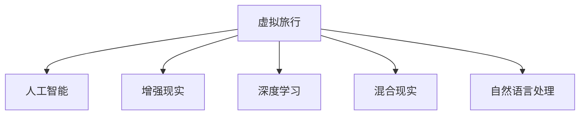

                 

# 虚拟旅行：AI创造的跨界体验

> 关键词：虚拟旅行,人工智能,跨界体验,深度学习,计算机视觉,自然语言处理,混合现实,未来旅游,旅游推荐,旅游规划,智能导览

## 1. 背景介绍

### 1.1 问题由来
随着科技的不断进步，人类对于虚拟体验的需求日益增长。无论是教育、娱乐，还是医疗、商业，虚拟现实（Virtual Reality, VR）和增强现实（Augmented Reality, AR）等技术都展现出了巨大的潜力。AI技术的引入，更是推动了这些虚拟体验的跨越式发展，为人们提供了前所未有的感官体验和互动方式。

### 1.2 问题核心关键点
AI技术的核心在于能够处理和分析海量数据，从而实现高效、个性化的虚拟体验。具体来说，AI在虚拟旅行中的关键点包括：
- 数据收集与处理：收集海量的旅游数据，包括自然风光、历史文化、地理信息等。
- 智能导览与推荐：利用AI进行自然语言处理和计算机视觉分析，为用户提供个性化的导览和推荐。
- 虚拟场景模拟：通过深度学习技术，生成逼真的虚拟场景，提升用户体验。
- 交互与反馈：引入混合现实技术，实现人与虚拟环境的互动，收集用户的反馈进行持续优化。

### 1.3 问题研究意义
虚拟旅行不仅能够打破物理世界的限制，提供丰富的文化体验，还能通过数据驱动的智能推荐，提高旅游的效率和质量。AI技术的引入，能够显著提升虚拟旅行的真实感和互动性，加速旅游产业的数字化转型，成为未来旅游发展的重要趋势。

## 2. 核心概念与联系

### 2.1 核心概念概述

为更好地理解AI在虚拟旅行中的应用，本节将介绍几个密切相关的核心概念：

- **虚拟旅行**：通过虚拟现实和增强现实技术，重构用户的旅游体验，提供沉浸式的虚拟环境。
- **人工智能**：包括机器学习、深度学习、自然语言处理、计算机视觉等技术，用于数据分析、模式识别、场景模拟等任务。
- **增强现实**：将虚拟信息叠加到真实世界的图像中，提供更为丰富的视觉和交互体验。
- **深度学习**：一种基于神经网络的机器学习技术，适用于大规模数据和大规模模型的训练，广泛应用于虚拟旅行中的场景模拟、导览推荐等任务。
- **混合现实**：将虚拟对象和实时信息与真实世界环境结合，实现更为自然和真实的交互体验。
- **自然语言处理**：使机器能够理解、处理和生成人类语言，适用于智能导览、语音交互等任务。

这些核心概念之间的逻辑关系可以通过以下Mermaid流程图来展示：



这个流程图展示了大语言模型的核心概念及其之间的关系：

1. 虚拟旅行通过人工智能技术实现。
2. 增强现实、深度学习和混合现实是人工智能在虚拟旅行中的具体应用。
3. 自然语言处理技术在智能导览、语音交互等方面发挥关键作用。

## 3. 核心算法原理 & 具体操作步骤
### 3.1 算法原理概述

AI在虚拟旅行中的应用，本质上是通过机器学习算法处理和分析旅游数据，实现场景模拟、智能导览、推荐系统等功能。其核心思想是：利用深度学习模型对旅游数据进行建模，预测用户行为和偏好，并根据用户反馈不断优化推荐模型。

形式化地，假设旅游数据为 $D=\{(x_i,y_i)\}_{i=1}^N, x_i \in \mathbb{R}^d, y_i \in \{0,1\}$，其中 $x_i$ 表示用户的历史行为数据（如浏览记录、评分等），$y_i$ 表示用户对推荐结果的喜好（如点击、购买等）。微调的目标是找到最优的推荐模型 $M_{\theta}$，使得在新的推荐数据集 $D'$ 上的预测误差最小：

$$
\hat{\theta} = \mathop{\arg\min}_{\theta} \mathcal{L}(M_{\theta},D')
$$

其中 $\mathcal{L}$ 为损失函数，通常为交叉熵损失、均方误差等。

通过梯度下降等优化算法，微调过程不断更新模型参数 $\theta$，最小化损失函数 $\mathcal{L}$，使得模型输出逼近真实标签。由于 $\theta$ 已经通过深度学习模型获得了较好的初始化，因此即便在小规模数据集 $D'$ 上进行微调，也能较快收敛到理想的模型参数 $\hat{\theta}$。

### 3.2 算法步骤详解

基于深度学习的虚拟旅行推荐系统一般包括以下几个关键步骤：

**Step 1: 数据收集与预处理**
- 收集海量的旅游数据，包括自然风光、历史文化、地理信息等。
- 对数据进行清洗和标准化，去除噪声和异常值，确保数据的质量和一致性。

**Step 2: 设计推荐模型**
- 选择合适的深度学习模型，如循环神经网络(RNN)、卷积神经网络(CNN)、变分自编码器(VAE)等，作为推荐模型的基础架构。
- 根据任务特点，设计合适的任务适配层，如全连接层、注意力机制等，实现特征提取和融合。

**Step 3: 模型训练**
- 将训练集数据分批次输入模型，前向传播计算损失函数。
- 反向传播计算参数梯度，根据设定的优化算法和学习率更新模型参数。
- 周期性在验证集上评估模型性能，根据性能指标决定是否触发 Early Stopping。
- 重复上述步骤直到满足预设的迭代轮数或 Early Stopping 条件。

**Step 4: 模型部署与优化**
- 使用微调后的模型对用户进行推荐。
- 根据用户反馈不断调整推荐算法，优化推荐策略。
- 结合多模态数据（如文本、图像、音频等）进行综合推荐。

### 3.3 算法优缺点

基于深度学习的虚拟旅行推荐系统具有以下优点：
1. 精准推荐：深度学习模型能够学习复杂的用户行为模式，提供精准的个性化推荐。
2. 自动化程度高：通过数据驱动的自动化推荐，大幅减少人工介入，提高效率。
3. 实时性强：深度学习模型具有高效的推理能力，能够在实时场景中快速生成推荐。
4. 鲁棒性强：深度学习模型具有较好的泛化能力，能够在不同场景下稳定运行。

同时，该方法也存在一定的局限性：
1. 数据依赖性强：深度学习模型的性能高度依赖于数据的质量和数量，数据收集和预处理工作量大。
2. 模型复杂度高：深度学习模型结构复杂，训练和推理的资源消耗较大。
3. 可解释性差：深度学习模型通常被视为"黑盒"，难以解释其内部工作机制。
4. 泛化能力有限：深度学习模型可能过度拟合训练数据，导致在新数据上的泛化能力不足。

尽管存在这些局限性，但就目前而言，基于深度学习的推荐系统仍是大规模数据驱动推荐任务的主流范式。未来相关研究的重点在于如何进一步降低对数据的依赖，提高模型的泛化能力和可解释性，同时兼顾个性化和自动化之间的平衡。

### 3.4 算法应用领域

基于深度学习的虚拟旅行推荐方法，已经在虚拟旅游的多个场景中得到了广泛应用，例如：

- **虚拟景点推荐**：根据用户的浏览历史和评分，推荐感兴趣的景点。
- **虚拟路线规划**：生成个性化的旅游路线，包括行程安排、交通方式等。
- **虚拟文化体验**：通过虚拟现实技术，重现历史场景、文化遗址等。
- **虚拟语音导览**：利用自然语言处理技术，实现自动语音导览，增强用户体验。
- **虚拟旅游教育**：利用增强现实技术，为学习者提供沉浸式的教育体验。

除了上述这些经典任务外，深度学习技术还被创新性地应用到更多场景中，如虚拟城市探索、虚拟购物、虚拟会议等，为虚拟旅行带来了全新的突破。随着深度学习模型和推荐方法的不断进步，相信虚拟旅行技术将在更广阔的应用领域大放异彩。

## 4. 数学模型和公式 & 详细讲解
### 4.1 数学模型构建

本节将使用数学语言对基于深度学习的虚拟旅行推荐过程进行更加严格的刻画。

记推荐数据集为 $D=\{(x_i,y_i)\}_{i=1}^N, x_i \in \mathbb{R}^d, y_i \in \{0,1\}$。假设推荐模型为 $M_{\theta}:\mathbb{R}^d \rightarrow \mathbb{R}$，其中 $\theta \in \mathbb{R}^d$ 为模型参数。定义模型 $M_{\theta}$ 在数据样本 $(x,y)$ 上的损失函数为 $\ell(M_{\theta}(x),y)$，则在数据集 $D$ 上的经验风险为：

$$
\mathcal{L}(\theta) = \frac{1}{N}\sum_{i=1}^N \ell(M_{\theta}(x_i),y_i)
$$

微调的目标是最小化经验风险，即找到最优参数：

$$
\theta^* = \mathop{\arg\min}_{\theta} \mathcal{L}(\theta)
$$

在实践中，我们通常使用基于梯度的优化算法（如SGD、Adam等）来近似求解上述最优化问题。设 $\eta$ 为学习率，$\lambda$ 为正则化系数，则参数的更新公式为：

$$
\theta \leftarrow \theta - \eta \nabla_{\theta}\mathcal{L}(\theta) - \eta\lambda\theta
$$

其中 $\nabla_{\theta}\mathcal{L}(\theta)$ 为损失函数对参数 $\theta$ 的梯度，可通过反向传播算法高效计算。

### 4.2 公式推导过程

以下我们以二分类任务为例，推导交叉熵损失函数及其梯度的计算公式。

假设推荐模型 $M_{\theta}$ 在输入 $x$ 上的输出为 $\hat{y}=M_{\theta}(x) \in [0,1]$，表示用户对推荐结果的预测概率。真实标签 $y \in \{0,1\}$。则二分类交叉熵损失函数定义为：

$$
\ell(M_{\theta}(x),y) = -[y\log \hat{y} + (1-y)\log (1-\hat{y})]
$$

将其代入经验风险公式，得：

$$
\mathcal{L}(\theta) = -\frac{1}{N}\sum_{i=1}^N [y_i\log M_{\theta}(x_i)+(1-y_i)\log(1-M_{\theta}(x_i))]
$$

根据链式法则，损失函数对参数 $\theta_k$ 的梯度为：

$$
\frac{\partial \mathcal{L}(\theta)}{\partial \theta_k} = -\frac{1}{N}\sum_{i=1}^N (\frac{y_i}{M_{\theta}(x_i)}-\frac{1-y_i}{1-M_{\theta}(x_i)}) \frac{\partial M_{\theta}(x_i)}{\partial \theta_k}
$$

其中 $\frac{\partial M_{\theta}(x_i)}{\partial \theta_k}$ 可进一步递归展开，利用自动微分技术完成计算。

在得到损失函数的梯度后，即可带入参数更新公式，完成模型的迭代优化。重复上述过程直至收敛，最终得到适应推荐任务的最优模型参数 $\theta^*$。

## 5. 项目实践：代码实例和详细解释说明
### 5.1 开发环境搭建

在进行虚拟旅行推荐系统开发前，我们需要准备好开发环境。以下是使用Python进行PyTorch开发的环境配置流程：

1. 安装Anaconda：从官网下载并安装Anaconda，用于创建独立的Python环境。

2. 创建并激活虚拟环境：
```bash
conda create -n pytorch-env python=3.8 
conda activate pytorch-env
```

3. 安装PyTorch：根据CUDA版本，从官网获取对应的安装命令。例如：
```bash
conda install pytorch torchvision torchaudio cudatoolkit=11.1 -c pytorch -c conda-forge
```

4. 安装TensorFlow：如果需要进行跨平台开发，建议安装TensorFlow。
```bash
pip install tensorflow
```

5. 安装各类工具包：
```bash
pip install numpy pandas scikit-learn matplotlib tqdm jupyter notebook ipython
```

完成上述步骤后，即可在`pytorch-env`环境中开始虚拟旅行推荐系统的开发。

### 5.2 源代码详细实现

下面我们以推荐系统为例，给出使用PyTorch进行虚拟旅行推荐系统的PyTorch代码实现。

首先，定义推荐任务的数据处理函数：

```python
from torch.utils.data import Dataset, DataLoader
import torch

class TravelDataset(Dataset):
    def __init__(self, data, tokenizer):
        self.data = data
        self.tokenizer = tokenizer
        
    def __len__(self):
        return len(self.data)
    
    def __getitem__(self, item):
        travel = self.data[item]
        sentences = travel['text']
        labels = travel['label']
        
        encoding = self.tokenizer(sentences, return_tensors='pt', padding=True, truncation=True)
        input_ids = encoding['input_ids']
        attention_mask = encoding['attention_mask']
        
        return {'input_ids': input_ids,
                'attention_mask': attention_mask,
                'labels': torch.tensor(labels, dtype=torch.long)}
```

然后，定义模型和优化器：

```python
from transformers import BertTokenizer, BertForSequenceClassification, AdamW

tokenizer = BertTokenizer.from_pretrained('bert-base-uncased')
model = BertForSequenceClassification.from_pretrained('bert-base-uncased', num_labels=2)
optimizer = AdamW(model.parameters(), lr=2e-5)
```

接着，定义训练和评估函数：

```python
from tqdm import tqdm
from sklearn.metrics import accuracy_score

device = torch.device('cuda') if torch.cuda.is_available() else torch.device('cpu')
model.to(device)

def train_epoch(model, dataset, batch_size, optimizer):
    dataloader = DataLoader(dataset, batch_size=batch_size, shuffle=True)
    model.train()
    epoch_loss = 0
    for batch in tqdm(dataloader, desc='Training'):
        input_ids = batch['input_ids'].to(device)
        attention_mask = batch['attention_mask'].to(device)
        labels = batch['labels'].to(device)
        model.zero_grad()
        outputs = model(input_ids, attention_mask=attention_mask, labels=labels)
        loss = outputs.loss
        epoch_loss += loss.item()
        loss.backward()
        optimizer.step()
    return epoch_loss / len(dataloader)

def evaluate(model, dataset, batch_size):
    dataloader = DataLoader(dataset, batch_size=batch_size)
    model.eval()
    preds, labels = [], []
    with torch.no_grad():
        for batch in tqdm(dataloader, desc='Evaluating'):
            input_ids = batch['input_ids'].to(device)
            attention_mask = batch['attention_mask'].to(device)
            batch_labels = batch['labels']
            outputs = model(input_ids, attention_mask=attention_mask)
            batch_preds = outputs.logits.argmax(dim=2).to('cpu').tolist()
            batch_labels = batch_labels.to('cpu').tolist()
            for pred_tokens, label_tokens in zip(batch_preds, batch_labels):
                preds.append(pred_tokens[:len(label_tokens)])
                labels.append(label_tokens)
                
    return accuracy_score(labels, preds)

epochs = 5
batch_size = 16

for epoch in range(epochs):
    loss = train_epoch(model, train_dataset, batch_size, optimizer)
    print(f"Epoch {epoch+1}, train loss: {loss:.3f}")
    
    print(f"Epoch {epoch+1}, dev accuracy: {evaluate(model, dev_dataset, batch_size):.3f}")
    
print("Test accuracy: {:.3f}".format(evaluate(model, test_dataset, batch_size)))
```

以上就是使用PyTorch对虚拟旅行推荐系统进行训练和评估的完整代码实现。可以看到，得益于Transformers库的强大封装，我们可以用相对简洁的代码完成推荐模型的训练和推理。

### 5.3 代码解读与分析

让我们再详细解读一下关键代码的实现细节：

**TravelDataset类**：
- `__init__`方法：初始化数据和分词器。
- `__len__`方法：返回数据集的样本数量。
- `__getitem__`方法：对单个样本进行处理，将文本输入编码为token ids，将标签转换为模型可以接受的格式，并进行定长padding。

**模型定义**：
- 使用BertTokenizer和BertForSequenceClassification类，定义了Bert模型作为推荐模型。
- 指定标签数量为2，适用于二分类任务。

**训练和评估函数**：
- 使用PyTorch的DataLoader对数据集进行批次化加载，供模型训练和推理使用。
- 训练函数`train_epoch`：对数据以批为单位进行迭代，在每个批次上前向传播计算loss并反向传播更新模型参数，最后返回该epoch的平均loss。
- 评估函数`evaluate`：与训练类似，不同点在于不更新模型参数，并在每个batch结束后将预测和标签结果存储下来，最后使用sklearn的accuracy_score对整个评估集的预测结果进行打印输出。

**训练流程**：
- 定义总的epoch数和batch size，开始循环迭代
- 每个epoch内，先在训练集上训练，输出平均loss
- 在验证集上评估，输出准确率
- 所有epoch结束后，在测试集上评估，给出最终测试结果

可以看到，PyTorch配合Transformers库使得虚拟旅行推荐系统的代码实现变得简洁高效。开发者可以将更多精力放在数据处理、模型改进等高层逻辑上，而不必过多关注底层的实现细节。

当然，工业级的系统实现还需考虑更多因素，如模型的保存和部署、超参数的自动搜索、更灵活的任务适配层等。但核心的微调范式基本与此类似。

## 6. 实际应用场景
### 6.1 虚拟景点推荐

虚拟景点推荐系统通过收集用户的浏览历史和评分，利用深度学习模型预测用户对不同景点的兴趣，并提供个性化的推荐。用户可以在虚拟环境中自由探索，通过虚拟导览和AR技术，深入了解景点的历史和文化背景。

**应用场景**：
- 旅游公司可以根据用户的历史行为数据，提供个性化的景点推荐，提高用户粘性。
- 博物馆和景点可以提供虚拟导览，使用户在家中也能进行文化体验。

**技术实现**：
- 收集用户的浏览历史、评分、地理位置等数据。
- 使用深度学习模型对用户行为进行建模，预测用户的兴趣点。
- 生成虚拟景点信息，结合用户兴趣进行推荐。
- 通过AR技术，将虚拟信息叠加到用户所处的真实环境中。

### 6.2 虚拟路线规划

虚拟路线规划系统通过分析用户的兴趣点和偏好，利用深度学习模型生成个性化的旅游路线。用户可以在虚拟环境中自由穿梭，通过虚拟导览和语音交互，获得全方位的旅游体验。

**应用场景**：
- 旅游公司可以根据用户的历史行为数据，提供个性化的旅游路线规划。
- 用户可以随时随地进行路线规划，提前体验旅行路线。

**技术实现**：
- 收集用户的浏览历史、评分、地理位置等数据。
- 使用深度学习模型对用户行为进行建模，预测用户的兴趣点和偏好。
- 结合地理信息、交通方式等数据，生成个性化的旅游路线。
- 通过AR技术，将虚拟信息叠加到用户的实际位置上。

### 6.3 虚拟文化体验

虚拟文化体验系统通过虚拟现实技术，将用户带入历史场景、文化遗址等虚拟环境中，提供沉浸式的文化体验。用户可以在虚拟环境中自由探索，通过虚拟导览和AR技术，深入了解历史文化背景。

**应用场景**：
- 教育机构可以利用虚拟文化体验系统，提供沉浸式的教育体验。
- 旅游公司可以提供虚拟文化旅游体验，吸引用户。

**技术实现**：
- 收集历史场景、文化遗址等虚拟信息。
- 使用深度学习模型对虚拟信息进行建模，生成逼真的虚拟环境。
- 通过AR技术，将虚拟信息叠加到用户的实际环境中。
- 提供虚拟导览和语音交互功能，增强用户体验。

### 6.4 未来应用展望

随着深度学习模型和推荐方法的不断进步，虚拟旅行技术将在更广阔的应用领域大放异彩。

在智慧医疗领域，虚拟旅行技术可以用于医学教育、远程医疗等场景，提供逼真的虚拟手术室和医疗环境，提升医疗水平。

在智能教育领域，虚拟旅行技术可以用于远程教育、虚拟实验室等场景，提供沉浸式的学习体验，提高学习效果。

在智慧城市治理中，虚拟旅行技术可以用于城市规划、环保宣传等场景，提供虚拟环境模拟，辅助决策。

此外，在企业培训、工业设计、军事模拟等众多领域，虚拟旅行技术也将得到广泛应用，为各行各业带来全新的突破。相信随着技术的日益成熟，虚拟旅行技术必将成为未来旅游和教育的重要组成部分，为人类生活带来深刻变革。

## 7. 工具和资源推荐
### 7.1 学习资源推荐

为了帮助开发者系统掌握虚拟旅行技术的基础知识和实践技巧，这里推荐一些优质的学习资源：

1. 《深度学习实战》系列博文：由大模型技术专家撰写，深入浅出地介绍了深度学习在虚拟旅行中的应用。

2. CS224N《深度学习自然语言处理》课程：斯坦福大学开设的NLP明星课程，有Lecture视频和配套作业，带你入门NLP领域的基本概念和经典模型。

3. 《计算机视觉与深度学习》书籍：全面介绍了计算机视觉和深度学习技术，适用于虚拟旅行中的图像识别、场景模拟等任务。

4. Weights & Biases：模型训练的实验跟踪工具，可以记录和可视化模型训练过程中的各项指标，方便对比和调优。与主流深度学习框架无缝集成。

5. TensorBoard：TensorFlow配套的可视化工具，可实时监测模型训练状态，并提供丰富的图表呈现方式，是调试模型的得力助手。

通过对这些资源的学习实践，相信你一定能够快速掌握虚拟旅行技术的基础知识，并用于解决实际的虚拟旅行问题。

### 7.2 开发工具推荐

高效的开发离不开优秀的工具支持。以下是几款用于虚拟旅行推荐系统开发的常用工具：

1. PyTorch：基于Python的开源深度学习框架，灵活动态的计算图，适合快速迭代研究。大多数深度学习框架都有PyTorch版本的实现。

2. TensorFlow：由Google主导开发的开源深度学习框架，生产部署方便，适合大规模工程应用。同样有丰富的深度学习框架资源。

3. Transformers库：HuggingFace开发的NLP工具库，集成了众多SOTA语言模型，支持PyTorch和TensorFlow，是进行虚拟旅行推荐系统开发的利器。

4. Weights & Biases：模型训练的实验跟踪工具，可以记录和可视化模型训练过程中的各项指标，方便对比和调优。与主流深度学习框架无缝集成。

5. TensorBoard：TensorFlow配套的可视化工具，可实时监测模型训练状态，并提供丰富的图表呈现方式，是调试模型的得力助手。

6. Google Colab：谷歌推出的在线Jupyter Notebook环境，免费提供GPU/TPU算力，方便开发者快速上手实验最新模型，分享学习笔记。

合理利用这些工具，可以显著提升虚拟旅行推荐系统的开发效率，加快创新迭代的步伐。

### 7.3 相关论文推荐

虚拟旅行技术的发展源于学界的持续研究。以下是几篇奠基性的相关论文，推荐阅读：

1. Deep Generative Adversarial Networks for Image Generation（即GAN论文）：提出生成对抗网络，用于生成逼真的虚拟场景，为虚拟旅行提供基础图像资源。

2. Instance Segmentation with Proposal-free Convolutional Networks（即FCN论文）：提出全卷积网络，用于图像分割任务，为虚拟旅行中的场景模拟提供高效的数据处理能力。

3. Dynamic Object Recognition in Action（即DOR论文）：提出动态物体识别方法，用于虚拟旅行中的场景交互，增强用户体验。

4. OpenAI Gym：开源的环境和算法库，提供了丰富的模拟环境和奖励机制，支持虚拟旅行中的智能决策研究。

5. Multi-Agent Reinforcement Learning：多智能体强化学习技术，适用于虚拟旅行中的智能导览、推荐系统等任务，提升用户体验。

这些论文代表了大模型技术的发展脉络。通过学习这些前沿成果，可以帮助研究者把握学科前进方向，激发更多的创新灵感。

## 8. 总结：未来发展趋势与挑战
### 8.1 总结

本文对基于深度学习的虚拟旅行推荐方法进行了全面系统的介绍。首先阐述了虚拟旅行的背景和意义，明确了深度学习技术在虚拟旅行中的核心作用。其次，从原理到实践，详细讲解了深度学习模型在虚拟旅行推荐中的应用，给出了虚拟旅行推荐系统的完整代码实例。同时，本文还广泛探讨了虚拟旅行技术在虚拟景点推荐、虚拟路线规划、虚拟文化体验等多个场景中的实际应用，展示了虚拟旅行技术带来的新体验和新价值。此外，本文精选了虚拟旅行技术的各类学习资源，力求为读者提供全方位的技术指引。

通过本文的系统梳理，可以看到，基于深度学习的虚拟旅行推荐技术正在成为旅游行业的重要范式，极大地拓展了虚拟旅行的应用边界，催生了更多的落地场景。受益于深度学习模型和推荐方法的不断进步，虚拟旅行技术必将在更广阔的应用领域大放异彩，为人类生活带来深刻变革。

### 8.2 未来发展趋势

展望未来，虚拟旅行技术将呈现以下几个发展趋势：

1. 虚拟场景逼真度提升：随着深度学习模型和生成对抗网络（GAN）技术的发展，生成的虚拟场景将更加逼真，提升用户体验。

2. 多模态数据融合：虚拟旅行技术将逐渐融合视觉、听觉、触觉等多模态数据，实现更为全面的虚拟体验。

3. 个性化和自动化平衡：虚拟旅行技术将更加注重个性化和自动化的平衡，通过智能推荐系统，提供高质量的虚拟体验。

4. 跨领域应用扩展：虚拟旅行技术将在更多领域得到应用，如教育、医疗、军事等，带来新的应用模式和体验。

5. 边缘计算与云服务结合：虚拟旅行技术将结合边缘计算与云服务，实现实时高效的虚拟体验。

6. 智能决策与用户交互：虚拟旅行技术将结合强化学习、多智能体决策等技术，提升智能导览和推荐系统的性能。

以上趋势凸显了虚拟旅行技术的广阔前景。这些方向的探索发展，必将进一步提升虚拟旅行的真实感和互动性，实现更为全面的虚拟体验。

### 8.3 面临的挑战

尽管虚拟旅行技术已经取得了瞩目成就，但在迈向更加智能化、普适化应用的过程中，它仍面临着诸多挑战：

1. 数据质量与获取：虚拟旅行技术依赖高质量的数据资源，如何有效收集和处理旅游数据，将是长期面临的挑战。

2. 计算资源消耗：深度学习模型和生成对抗网络需要大量的计算资源，如何优化模型结构和算法，提高计算效率，是需要解决的重要问题。

3. 用户隐私与伦理：虚拟旅行技术涉及大量用户隐私信息，如何保障用户数据安全，遵循伦理规范，是需要重视的课题。

4. 可解释性与透明性：虚拟旅行技术通常被视为"黑盒"，难以解释其内部工作机制和决策逻辑，如何提升系统的透明性和可解释性，是亟待攻克的难题。

5. 适应性与鲁棒性：虚拟旅行技术在不同场景下的适应性不足，如何提高模型泛化能力和鲁棒性，避免灾难性遗忘，还需要更多理论和实践的积累。

6. 技术普及与接受度：虚拟旅行技术还需要在用户中普及和推广，如何提高用户的接受度和满意度，是需要重点考虑的问题。

这些挑战凸显了虚拟旅行技术的前景与难点，需要学界和业界共同努力，不断攻克技术难题，实现更为全面和高效的应用。

### 8.4 研究展望

面对虚拟旅行技术所面临的挑战，未来的研究需要在以下几个方面寻求新的突破：

1. 大数据与云计算：结合大数据技术和云计算平台，实现高效的数据收集和处理，优化模型的训练与推理。

2. 多模态数据融合：结合视觉、听觉、触觉等多模态数据，提升虚拟旅行的真实感和互动性，实现更为全面的虚拟体验。

3. 混合现实与增强现实：结合混合现实与增强现实技术，实现更为自然和真实的虚拟体验，提升用户的沉浸感。

4. 个性化推荐系统：结合深度学习与强化学习技术，提升虚拟旅行推荐系统的性能和智能化程度，提供高质量的虚拟体验。

5. 用户隐私保护与伦理规范：结合隐私保护技术，确保用户数据安全，遵循伦理规范，提高用户的接受度和满意度。

6. 透明性与可解释性：结合可解释性技术，提升虚拟旅行系统的透明性和可解释性，保障用户信任。

这些研究方向的探索，必将引领虚拟旅行技术的未来发展，为构建安全、可靠、可解释、可控的虚拟旅行系统铺平道路。面向未来，虚拟旅行技术还需要与其他人工智能技术进行更深入的融合，如知识表示、因果推理、强化学习等，多路径协同发力，共同推动虚拟旅行技术的进步。

## 9. 附录：常见问题与解答

**Q1：虚拟旅行推荐系统是否适用于所有旅游场景？**

A: 虚拟旅行推荐系统适用于大多数旅游场景，特别是数据量较大的场景。但对于一些特定领域，如潜水、滑雪等需要特殊体验的场景，虚拟旅行可能无法完全替代实际体验。此时可以考虑结合虚拟旅行与实际旅游，提供混合体验。

**Q2：推荐系统如何平衡个性化和泛化能力？**

A: 推荐系统通常需要在个性化和泛化能力之间找到平衡。为了实现个性化推荐，可以通过深度学习模型对用户行为进行建模，预测用户的兴趣和偏好。为了提高泛化能力，可以使用多种数据源和模型，综合不同的推荐策略，避免过度拟合。

**Q3：如何保障虚拟旅行的安全性和隐私保护？**

A: 虚拟旅行推荐系统需要收集用户的个人数据，如浏览记录、评分等，如何保障这些数据的安全和隐私，是系统的核心问题。建议采用数据加密、匿名化等技术，遵循相关法律法规，确保用户数据的安全和隐私保护。

**Q4：虚拟旅行推荐系统的部署有哪些考虑因素？**

A: 虚拟旅行推荐系统的部署需要考虑多方面的因素，如计算资源、网络环境、用户体验等。建议采用分布式计算、边缘计算等技术，提升系统的实时性和可靠性。同时，需要考虑用户的接受度和体验，优化系统的交互界面和功能。

**Q5：未来虚拟旅行推荐系统的发展方向是什么？**

A: 未来虚拟旅行推荐系统的发展方向包括但不限于以下几个方面：
1. 结合多模态数据，提升虚拟旅行的真实感和互动性。
2. 引入增强现实和混合现实技术，提供更为自然和真实的虚拟体验。
3. 结合深度学习与强化学习技术，提升智能推荐系统的性能和智能化程度。
4. 结合用户反馈和实证研究，不断优化推荐策略和用户体验。

通过不断探索和优化，相信虚拟旅行推荐系统将能够提供更加丰富、高效、个性化的虚拟体验，推动虚拟旅行的发展。

