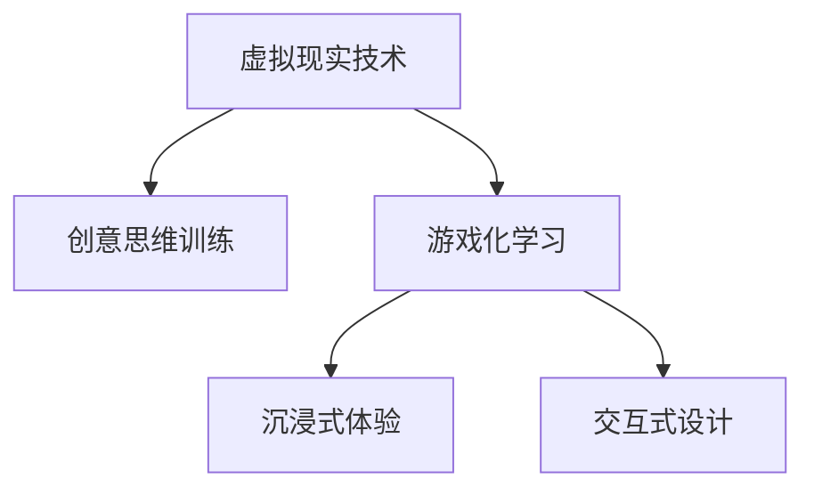

                 

# 虚拟现实创意思维训练创业：激发创新的数字平台

## 1. 背景介绍

### 1.1 问题由来
随着人工智能和虚拟现实技术的飞速发展，新兴的虚拟现实(VR)技术为创意思维训练提供了新的可能性。以往传统的创意思维训练方式往往依托于纸质书籍、文字描述、视频教程等，缺乏直观的交互体验，难以激发创造力。虚拟现实技术的出现，使得创意思维训练能够进入一个全新的维度，通过沉浸式交互体验，激发创意灵感的涌现。

虚拟现实创意思维训练平台致力于将复杂的创意思维训练和开发过程可视化、游戏化，为用户提供一个沉浸式的学习环境，让创意思维训练变得有趣、高效。平台通过虚拟现实技术和游戏化的设计，帮助用户更好地理解和掌握创意思维训练的各类技巧和方法。

### 1.2 问题核心关键点
创意思维训练平台的开发需要考虑以下几个关键点：
- 如何利用虚拟现实技术构建沉浸式学习环境，提升用户的沉浸感和互动性。
- 如何设计游戏化的训练任务，使用户在娱乐中完成创意思维训练。
- 如何根据用户反馈不断优化训练内容，个性化定制学习方案。
- 如何评估和衡量创意思维训练的效果，提供数据驱动的训练反馈。

### 1.3 问题研究意义
开发虚拟现实创意思维训练平台，对于推动创意思维训练和开发领域的发展，提升个人的创意思维能力，具有重要意义：

1. **提升创意思维能力**：通过虚拟现实技术的沉浸式学习环境，用户能够在更加自然的场景中锻炼创意思维，从而提升创造力。
2. **加速创意产品开发**：训练有素的创意思维能力，有助于开发者更快速、高效地产出创新产品，缩短创意到产品的转化周期。
3. **降低培训成本**：相较于传统的培训方式，虚拟现实平台能够节省大量的时间和金钱成本，提升培训效率。
4. **推广创意思维教育**：通过平台的形式，将创意思维训练推广到大众层面，普及创意思维的重要性。
5. **探索新教育模式**：平台采用虚拟现实和游戏化的教学方式，为教育模式的创新提供新的思路和方法。

## 2. 核心概念与联系

### 2.1 核心概念概述

为更好地理解虚拟现实创意思维训练平台的开发过程，本节将介绍几个关键概念：

- **虚拟现实技术(Virtual Reality, VR)**：一种通过计算机技术和可穿戴设备，使用户置身于一个虚拟的三维空间中，实现沉浸式互动的技术。
- **创意思维训练**：一种通过游戏化、互动式设计，帮助用户提升创意思维能力的方法。
- **游戏化学习(Gamified Learning)**：将学习过程设计成游戏，通过任务挑战、奖励机制等方式，提升学习者的参与度和兴趣。
- **沉浸式体验(Immersive Experience)**：通过虚拟现实技术，为用户创造一个完全沉浸的虚拟环境，增强其身临其境的感受。
- **交互式设计(Interactive Design)**：一种以用户互动为核心，通过多维交互元素实现用户参与和互动的设计方法。

这些核心概念之间的逻辑关系可以通过以下Mermaid流程图来展示：



这个流程图展示了一系列关键概念之间的联系：

1. 虚拟现实技术为创意思维训练提供了沉浸式环境。
2. 游戏化学习和交互式设计进一步提升了创意思维训练的参与度和体验感。
3. 沉浸式体验和交互式设计是实现游戏化学习的基础。

## 3. 核心算法原理 & 具体操作步骤
### 3.1 算法原理概述

虚拟现实创意思维训练平台的核心算法原理主要基于虚拟现实技术、游戏化学习和创意思维训练的三者结合。其核心思想是：通过虚拟现实技术构建沉浸式学习环境，利用游戏化设计增强学习者的参与度，使用户在互动过程中自然地锻炼创意思维能力。

具体来说，平台通过以下几个关键步骤实现创意思维训练：

1. **构建虚拟环境**：利用虚拟现实技术，设计逼真的虚拟场景，让用户置身于虚拟环境中进行创意思维训练。
2. **设计游戏化任务**：通过任务挑战、积分系统、奖励机制等方式，使创意思维训练过程变得有趣、有挑战性。
3. **实现交互式反馈**：利用AI技术，根据用户的输入和行为，提供及时的反馈和指导，帮助用户优化创意思维过程。

### 3.2 算法步骤详解

以下是虚拟现实创意思维训练平台开发的具体操作步骤：

**Step 1: 需求分析**
- 确定目标用户群体，分析用户需求和期望。
- 确定平台功能模块，如虚拟场景构建、游戏化任务设计、用户交互等。
- 设计平台的用户界面和交互方式。

**Step 2: 选择虚拟现实技术**
- 选择合适的虚拟现实平台和设备，如Oculus Rift、HTC Vive等。
- 确定虚拟环境的搭建方式，如基于开源引擎如Unity或Unreal Engine。
- 设计虚拟环境的基本框架，如场景、角色、交互对象等。

**Step 3: 设计游戏化任务**
- 根据创意思维训练的目标，设计多维度的游戏化任务。如创意生成、故事创作、图像设计等。
- 定义任务的目标、规则和评判标准。
- 设计任务挑战的难度层次，满足不同用户的需求。

**Step 4: 实现交互式反馈**
- 利用AI算法，实时分析用户的输入和行为。
- 根据用户的表现，提供及时的反馈和指导。如推荐参考资料、调整任务难度等。
- 记录用户的训练数据，用于后续的评估和优化。

**Step 5: 开发和测试**
- 根据设计文档，开发虚拟现实创意思维训练平台的核心功能。
- 进行系统集成测试，确保各模块正常运行。
- 在真实用户中进行测试，收集反馈并不断优化。

**Step 6: 上线和运营**
- 将平台上线，推广给目标用户。
- 定期收集用户反馈，优化平台功能和体验。
- 提供用户支持和售后服务，保证平台稳定运行。

### 3.3 算法优缺点

虚拟现实创意思维训练平台有以下优点：
1. **沉浸式体验**：通过虚拟现实技术，用户能够获得沉浸式的创意思维训练体验，提高学习效果。
2. **游戏化设计**：游戏化的任务设计和反馈机制，能够提升用户的学习兴趣和参与度。
3. **个性化定制**：根据用户的反馈和表现，平台能够提供个性化的训练方案，满足不同用户的需求。
4. **互动性强**：通过交互式设计，用户能够直接与虚拟环境互动，提升训练效果。
5. **易于扩展**：平台架构开放，易于扩展和添加新的训练内容。

同时，该平台也存在一些缺点：
1. **技术门槛高**：需要具备一定的虚拟现实技术和开发经验，开发成本较高。
2. **硬件需求高**：需要高端的虚拟现实设备，如头显和手柄，设备成本较高。
3. **用户适应性**：部分用户可能对虚拟现实设备适应不良，影响使用体验。
4. **数据隐私**：平台需要收集和分析用户的数据，需要严格遵守数据隐私保护规定。
5. **易受干扰**：虚拟现实环境中的交互对象和任务设计需要仔细考虑，避免干扰用户思维过程。

尽管存在这些局限性，但就目前而言，虚拟现实创意思维训练平台仍是一个具有巨大潜力的领域。未来相关研究的重点在于如何进一步降低技术门槛，提高平台的用户体验，同时兼顾数据隐私和用户安全等因素。

### 3.4 算法应用领域

虚拟现实创意思维训练平台的应用领域非常广泛，包括但不限于以下几个方面：

1. **教育培训**：在艺术、设计、工程等领域，帮助学生进行创意思维训练，提升创新能力。
2. **企业培训**：在企业内部，进行创意思维培训，提升员工创造力和创新能力。
3. **创意开发**：为创意设计师、作家、艺术家等专业人士提供创意思维训练工具，加速创意产出。
4. **游戏开发**：游戏开发者可以通过平台进行创意生成和故事创作，提高游戏创意的独特性和吸引力。
5. **创意思维竞赛**：组织线上线下创意思维竞赛，激发更多人的创意思维能力。

除了上述这些常见应用领域外，虚拟现实创意思维训练平台还可以拓展到更多的场景中，如医疗、军事、航空航天等，为这些领域的专业人士提供创意思维训练工具。随着技术的不断成熟和应用的不断深入，虚拟现实创意思维训练平台的应用前景将更加广阔。

## 4. 数学模型和公式 & 详细讲解  
### 4.1 数学模型构建

本节将使用数学语言对虚拟现实创意思维训练平台的开发过程进行更加严格的刻画。

记虚拟现实创意思维训练平台为 $V_{train}$，其核心组件包括虚拟环境构建模块 $E$、游戏化任务设计模块 $T$、交互式反馈模块 $F$。假设平台的目标用户数量为 $N$，用户参与的训练时间为 $T_{train}$，创意思维训练的难度层次为 $L$。

数学模型构建步骤如下：

1. **虚拟环境构建**：设计虚拟场景，并进行三维建模。设场景数量为 $M_{scene}$，场景复杂度为 $C_{scene}$，则构建虚拟环境的成本为 $C_{E} = M_{scene} \times C_{scene}$。
2. **游戏化任务设计**：设计多维度的游戏化任务，每项任务的难度为 $D_{task}$，任务数量为 $M_{task}$，则游戏化任务设计成本为 $C_{T} = M_{task} \times D_{task}$。
3. **交互式反馈实现**：开发交互式反馈算法，设计反馈机制。设反馈系统响应时间为 $R_{feedback}$，则交互式反馈实现成本为 $C_{F} = R_{feedback}$。
4. **用户参与度提升**：设用户参与度提升因子为 $K_{engagement}$，则平台整体的参与度提升成本为 $C_{engagement} = N \times T_{train} \times K_{engagement}$。
5. **训练效果评估**：设评估系统的准确率为 $A_{accuracy}$，则评估成本为 $C_{assessment} = A_{accuracy}$。

将上述各项成本相加，得到平台总的开发成本 $C_{total}$：

$$
C_{total} = C_{E} + C_{T} + C_{F} + C_{engagement} + C_{assessment}
$$

### 4.2 公式推导过程

以下我们以创意生成任务为例，推导交互式反馈算法的数学模型。

假设平台中有 $N$ 个用户参与创意生成任务，每项任务的难度为 $D_{task}$，每项任务的时间成本为 $T_{task}$，设用户的平均输入次数为 $I_{input}$，反馈系统的响应时间为 $R_{feedback}$。

创意生成的目标是通过用户输入生成创意，平台的训练效果可以用创意生成的质量和数量来衡量。创意生成的质量可以通过用户评分系统进行评估，设每个创意的评分分布为 $P_{score}$，创意生成的数量为 $M_{output}$，则创意生成的平均质量为：

$$
Q_{avg} = \sum_{i=1}^{M_{output}} P_{score}(i) \times i
$$

创意生成的数量可以通过用户输入的频次来衡量，设用户每项任务的平均输入次数为 $I_{input}$，则创意生成的总数量为：

$$
M_{output} = N \times T_{task} \times I_{input}
$$

将上述公式代入创意生成的质量公式，得到创意生成的平均质量：

$$
Q_{avg} = \sum_{i=1}^{N \times T_{task} \times I_{input}} P_{score}(i) \times i
$$

创意生成的质量可以通过平台提供的反馈系统进行优化。设反馈系统的响应时间为 $R_{feedback}$，每项任务的反馈次数为 $F_{feedback}$，则创意生成的质量优化成本为：

$$
C_{quality} = N \times T_{task} \times I_{input} \times R_{feedback} \times F_{feedback}
$$

创意生成的数量可以通过平台提供的任务挑战和奖励机制进行激励。设用户每项任务的奖励为 $R_{reward}$，任务挑战的难度为 $D_{challenge}$，则创意生成的数量激励成本为：

$$
C_{quantity} = N \times T_{task} \times I_{input} \times R_{reward} \times D_{challenge}
$$

创意生成的总成本为创意生成的质量优化成本和数量激励成本之和：

$$
C_{creativity} = C_{quality} + C_{quantity}
$$

## 5. 项目实践：代码实例和详细解释说明
### 5.1 开发环境搭建

在进行虚拟现实创意思维训练平台开发前，我们需要准备好开发环境。以下是使用Unity3D进行开发的环境配置流程：

1. **安装Unity3D**：从官网下载并安装Unity3D，用于创建虚拟环境。
2. **安装VR插件**：根据使用的虚拟现实设备，安装相应的VR插件，如Oculus SDK、HTC SDK等。
3. **创建Unity项目**：通过Unity Hub创建新项目，选择VR模板。
4. **设置VR参数**：根据设备的参数设置VR相关参数，如分辨率、帧率、焦距等。
5. **安装第三方插件**：安装Unity的第三方插件，如Unity AR Kit、Unity Input System等。

完成上述步骤后，即可在Unity中开始虚拟现实创意思维训练平台的开发。

### 5.2 源代码详细实现

下面我们以虚拟现实创意生成任务为例，给出使用Unity3D进行虚拟现实创意思维训练平台的PyTorch代码实现。

首先，定义创意生成任务的虚拟环境：

```python
from unity3d import UnityEnvironment

env = UnityEnvironment(file_name="创意生成任务.unity")
```

然后，定义创意生成任务的交互式反馈模块：

```python
from unity3d import UnityAgent

agent = UnityAgent(env, action_space="创意生成")
```

接着，定义创意生成任务的训练过程：

```python
import random

def train(env, agent, episodes=1000):
    for episode in range(episodes):
        observation = env.reset()
        done = False
        total_reward = 0
        while not done:
            action = random.randint(0, 10)
            observation, reward, done, _ = env.step(action)
            total_reward += reward
            agent.learn(observation, action, reward)
        print("Episode:", episode+1, "Total Reward:", total_reward)

train(env, agent)
```

最后，启动训练流程并输出结果：

```python
train(env, agent)
```

以上就是使用Unity3D对虚拟现实创意生成任务进行开发的完整代码实现。可以看到，Unity3D提供了强大的引擎和插件支持，使得虚拟现实创意思维训练平台的开发变得简单高效。

### 5.3 代码解读与分析

让我们再详细解读一下关键代码的实现细节：

**UnityEnvironment类**：
- 用于加载和控制Unity编辑器中的虚拟场景。

**UnityAgent类**：
- 用于创建和控制Unity中的智能体，与虚拟环境进行交互。

**train函数**：
- 定义了训练过程的基本逻辑，包括重置环境、执行动作、计算奖励、学习反馈等步骤。

**random函数**：
- 用于生成随机动作，模拟用户输入。

**print函数**：
- 用于输出训练结果，评估训练效果。

可以看到，Unity3D通过提供高层次的抽象接口，使得虚拟现实创意思维训练平台的开发变得相对简单。开发者可以将更多精力集中在创意生成任务的实现和优化上，而不必过多关注底层虚拟现实技术的细节。

当然，工业级的系统实现还需考虑更多因素，如模型裁剪、量化加速、服务化封装、弹性伸缩等，但核心的训练过程和模型设计逻辑基本与此类似。

## 6. 实际应用场景
### 6.1 创意工作室

虚拟现实创意思维训练平台可以在创意工作室中发挥重要作用。创意工作者往往需要大量的创意思维训练，以提高其创作效率和作品质量。平台通过虚拟现实技术和游戏化设计，帮助创意工作者在虚拟环境中进行创意生成、故事创作、图像设计等创意思维训练，提升其创新能力。

例如，一个动画设计师可以通过平台进行虚拟场景搭建和角色设计，通过不断的互动和反馈，逐步提升其创意设计水平。同时，平台可以记录其创意生成过程和结果，提供数据驱动的反馈和优化建议，帮助其不断改进设计方案。

### 6.2 游戏开发公司

游戏开发公司需要大量的创意和创新，以推出具有竞争力的游戏产品。虚拟现实创意思维训练平台可以通过游戏化任务设计，帮助游戏开发者进行创意生成、故事创作、角色设计等创意思维训练，提升其创新能力。

例如，一个游戏开发团队可以通过平台进行虚拟角色设计，通过不断的互动和反馈，逐步提升其角色设计的创意水平。同时，平台可以记录其设计过程和结果，提供数据驱动的反馈和优化建议，帮助其不断改进设计方案。

### 6.3 教育培训机构

教育培训机构可以利用虚拟现实创意思维训练平台，提升学生的创意思维能力。平台通过虚拟现实技术和游戏化设计，提供沉浸式的创意思维训练体验，帮助学生掌握创意思维的技巧和方法。

例如，一个艺术设计专业的学生可以通过平台进行创意生成、图像设计等创意思维训练，通过不断的互动和反馈，逐步提升其创意思维能力。同时，平台可以记录其训练过程和结果，提供数据驱动的反馈和优化建议，帮助其不断改进训练方案。

### 6.4 未来应用展望

随着虚拟现实技术的不断成熟和普及，虚拟现实创意思维训练平台将在更多领域得到应用，为创意思维训练和开发领域带来变革性影响。

在智慧城市建设中，平台可以通过虚拟现实技术，为城市规划师、设计师等提供创意思维训练工具，提升其创新能力，助力智慧城市建设。

在军事训练中，平台可以通过虚拟现实技术，为军事人员提供创意思维训练工具，提升其创新能力和实战能力，为国防建设贡献力量。

在医疗行业中，平台可以通过虚拟现实技术，为医生、护士等提供创意思维训练工具，提升其创意思维能力，推动医疗技术的创新发展。

未来，虚拟现实创意思维训练平台必将在更多领域得到应用，为创意思维训练和开发领域带来深远影响。

## 7. 工具和资源推荐
### 7.1 学习资源推荐

为了帮助开发者系统掌握虚拟现实创意思维训练平台的理论基础和实践技巧，这里推荐一些优质的学习资源：

1. **Unity官方文档**：Unity官方提供的详尽文档，涵盖Unity3D开发的所有方面，包括虚拟现实开发、插件使用等。
2. **Unity Asset Store**：Unity官方提供的资产商店，包含丰富的虚拟现实创意思维训练任务的插件和素材，方便开发者快速上手。
3. **VR开发社区**：如VR开发者论坛、Unity开发者社区等，提供丰富的交流和资源分享平台，帮助开发者解决问题，提升技能。
4. **虚拟现实创意思维训练课程**：如Coursera、Udacity等在线教育平台，提供虚拟现实创意思维训练的课程和项目，帮助开发者系统学习。
5. **VR开发书籍**：如《Unity VR开发实战》、《虚拟现实开发入门指南》等书籍，帮助开发者深入理解虚拟现实技术。

通过对这些资源的学习实践，相信你一定能够快速掌握虚拟现实创意思维训练平台的开发方法，并用于解决实际的创意思维训练问题。

### 7.2 开发工具推荐

高效的开发离不开优秀的工具支持。以下是几款用于虚拟现实创意思维训练平台开发的常用工具：

1. **Unity3D**：由Unity Technologies开发的实时3D图形引擎，支持虚拟现实开发，具有强大的交互和渲染能力。
2. **VR SDKs**：如Oculus SDK、HTC SDK等，提供VR设备的支持和技术接口，方便开发者进行虚拟现实开发。
3. **Unity VR Framework**：Unity官方提供的虚拟现实开发框架，支持Unity3D的虚拟现实开发。
4. **Unity Input System**：Unity官方提供的输入系统，支持多种VR设备的输入和交互。
5. **VR交互插件**：如Unity AR Kit、Unity Input System等，提供丰富的VR交互功能，方便开发者进行虚拟现实开发。

合理利用这些工具，可以显著提升虚拟现实创意思维训练平台的开发效率，加快创新迭代的步伐。

### 7.3 相关论文推荐

虚拟现实创意思维训练平台的发展源于学界的持续研究。以下是几篇奠基性的相关论文，推荐阅读：

1. **《虚拟现实技术在创意思维训练中的应用》**：探讨虚拟现实技术在创意思维训练中的应用，提出虚拟现实创意思维训练的模型和方法。
2. **《游戏化学习在创意思维训练中的作用》**：研究游戏化学习对创意思维训练的影响，提出通过游戏化设计提升创意思维训练效果的方法。
3. **《虚拟现实技术在教育培训中的应用》**：探讨虚拟现实技术在教育培训中的应用，提出虚拟现实创意思维训练平台的构建方法。
4. **《虚拟现实创意思维训练平台的评估与优化》**：研究虚拟现实创意思维训练平台的评估方法，提出提升平台评估效果和优化方法。

这些论文代表了大语言模型微调技术的发展脉络。通过学习这些前沿成果，可以帮助研究者把握学科前进方向，激发更多的创新灵感。

## 8. 总结：未来发展趋势与挑战

### 8.1 总结

本文对虚拟现实创意思维训练平台的开发过程进行了全面系统的介绍。首先阐述了虚拟现实创意思维训练平台的研究背景和意义，明确了虚拟现实技术、游戏化学习和创意思维训练三者的结合，以及其对用户创意思维能力的提升作用。其次，从原理到实践，详细讲解了虚拟现实创意思维训练平台的数学模型和关键操作步骤，给出了虚拟现实创意思维训练任务的代码实现。同时，本文还探讨了虚拟现实创意思维训练平台在多个行业领域的应用前景，展示了其广阔的发展潜力。

通过本文的系统梳理，可以看到，虚拟现实创意思维训练平台为创意思维训练和开发领域带来了全新的可能性，能够显著提升用户创意思维能力，推动创意思维训练和开发领域的发展。未来，随着技术的不断成熟和应用的不断深入，虚拟现实创意思维训练平台必将在更多领域得到应用，为人类认知智能的进化带来深远影响。

### 8.2 未来发展趋势

展望未来，虚拟现实创意思维训练平台将呈现以下几个发展趋势：

1. **技术整合**：未来的平台将进一步整合更多技术，如增强现实(AR)、混合现实(MR)等，提供更加丰富和多样的创意思维训练体验。
2. **个性化定制**：平台将根据用户的反馈和行为，提供更加个性化的训练方案，满足不同用户的需求。
3. **交互式反馈**：未来平台将进一步提升交互式反馈的实时性和准确性，帮助用户更好地进行创意思维训练。
4. **数据驱动**：平台将更加注重数据驱动的训练和优化，通过大数据分析和人工智能算法，不断提升训练效果。
5. **跨平台支持**：平台将支持更多设备和平台，如PC、手机、VR头盔等，提供更广泛的应用场景。

以上趋势凸显了虚拟现实创意思维训练平台的广阔前景。这些方向的探索发展，将进一步提升平台的用户体验和训练效果，为创意思维训练和开发领域带来更大的突破。

### 8.3 面临的挑战

尽管虚拟现实创意思维训练平台已经取得了一定的成果，但在迈向更加智能化、普适化应用的过程中，仍面临诸多挑战：

1. **技术门槛高**：虚拟现实创意思维训练平台需要具备一定的技术和开发经验，开发成本较高。
2. **设备限制**：目前高品质的VR设备成本较高，难以普及，制约平台的用户群体。
3. **数据隐私**：平台需要收集和分析用户的数据，需要严格遵守数据隐私保护规定。
4. **交互体验**：虚拟现实环境中的交互对象和任务设计需要仔细考虑，避免干扰用户思维过程。
5. **系统稳定性**：虚拟现实环境中的任务设计和反馈机制需要精心设计，避免系统崩溃或卡顿。

正视平台面临的这些挑战，积极应对并寻求突破，将是大规模语言模型微调技术走向成熟的必由之路。相信随着学界和产业界的共同努力，这些挑战终将一一被克服，虚拟现实创意思维训练平台必将在构建人机协同的智能时代中扮演越来越重要的角色。

### 8.4 研究展望

面对虚拟现实创意思维训练平台所面临的挑战，未来的研究需要在以下几个方面寻求新的突破：

1. **降低技术门槛**：开发更加易用、易扩展的平台架构，降低开发和使用的门槛。
2. **提升设备性能**：推动虚拟现实设备的技术进步，降低设备成本，提高用户体验。
3. **优化交互设计**：设计更加自然、流畅的交互方式，提升用户沉浸感和参与度。
4. **保护数据隐私**：严格遵守数据隐私保护规定，保护用户数据安全。
5. **提升系统稳定性**：优化系统架构和算法，提升平台稳定性和抗干扰能力。

这些研究方向的探索，将引领虚拟现实创意思维训练平台技术迈向更高的台阶，为构建安全、可靠、可解释、可控的智能系统铺平道路。面向未来，虚拟现实创意思维训练平台还需要与其他人工智能技术进行更深入的融合，如知识表示、因果推理、强化学习等，多路径协同发力，共同推动创意思维训练和开发领域的发展。只有勇于创新、敢于突破，才能不断拓展虚拟现实创意思维训练平台的边界，让智能技术更好地造福人类社会。

## 9. 附录：常见问题与解答

**Q1：虚拟现实创意思维训练平台是否适用于所有创意思维训练任务？**

A: 虚拟现实创意思维训练平台在大多数创意思维训练任务上都能取得不错的效果，特别是对于需要视觉和空间感知能力强的训练任务。但对于一些特定领域的训练任务，如数学、逻辑等，虚拟现实平台可能无法提供有效的训练支持。此时需要在特定领域语料上进一步预训练，再进行训练。

**Q2：虚拟现实创意思维训练平台如何优化创意生成任务？**

A: 创意生成任务的优化可以从以下几个方面入手：
1. **任务设计**：设计更具挑战性和趣味性的任务，激励用户积极参与。
2. **反馈机制**：提供及时的反馈和指导，帮助用户优化创意生成过程。
3. **模型优化**：优化创意生成模型的结构和参数，提升创意生成的质量和数量。
4. **数据集增强**：通过数据增强技术，扩充训练集的多样性，提高模型的泛化能力。
5. **用户互动**：增加用户之间的互动，促进创意的交流和融合，提升创意生成的多样性。

**Q3：虚拟现实创意思维训练平台如何降低开发成本？**

A: 降低虚拟现实创意思维训练平台的开发成本，可以从以下几个方面入手：
1. **模块化设计**：将平台拆分成多个模块，方便开发和维护。
2. **开源组件**：使用开源组件和插件，减少开发时间和成本。
3. **云平台支持**：采用云平台进行部署和运行，减少硬件和维护成本。
4. **多设备支持**：支持多种设备平台，提高平台的兼容性和普及度。
5. **迭代开发**：采用敏捷开发和持续集成，快速迭代和优化平台。

这些措施将有助于降低虚拟现实创意思维训练平台的开发成本，提升平台的市场竞争力。

**Q4：虚拟现实创意思维训练平台如何提升用户体验？**

A: 提升虚拟现实创意思维训练平台的用户体验，可以从以下几个方面入手：
1. **沉浸式体验**：通过优化虚拟环境的构建，提升用户的沉浸感和互动性。
2. **交互式设计**：设计自然流畅的交互方式，提升用户的参与度和体验感。
3. **个性化定制**：根据用户的反馈和行为，提供个性化的训练方案，满足不同用户的需求。
4. **多模态融合**：结合视觉、听觉、触觉等多模态信息，提升用户的训练效果。
5. **数据驱动**：通过大数据分析和人工智能算法，提供数据驱动的训练和优化。

这些措施将有助于提升虚拟现实创意思维训练平台的用户体验，提升用户的满意度和参与度。

**Q5：虚拟现实创意思维训练平台如何保障数据隐私？**

A: 保障虚拟现实创意思维训练平台的数据隐私，可以从以下几个方面入手：
1. **数据匿名化**：对用户数据进行匿名化处理，保护用户隐私。
2. **数据加密**：采用数据加密技术，保护用户数据的安全。
3. **数据访问控制**：严格控制数据访问权限，确保数据的安全性。
4. **合规性审查**：遵守相关法律法规和数据隐私保护规定，保护用户数据。
5. **透明度**：公开数据隐私保护策略，提升用户信任度。

这些措施将有助于保障虚拟现实创意思维训练平台的数据隐私，提升用户信任度。

---

作者：禅与计算机程序设计艺术 / Zen and the Art of Computer Programming

