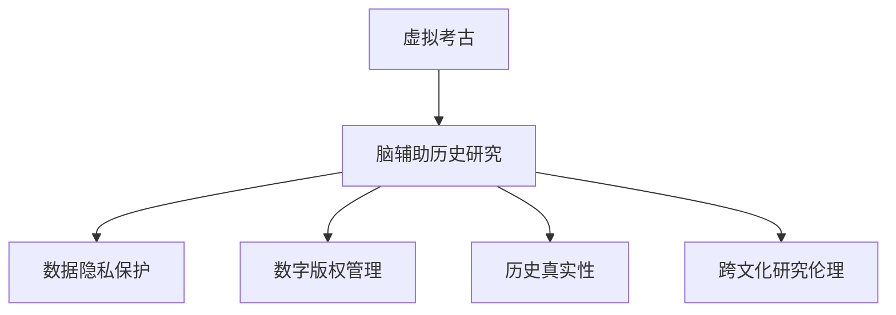

                 

## 1. 背景介绍

### 1.1 问题由来

近年来，虚拟考古（Virtual Archaeology）与脑辅助历史研究（Cognitive Archaeology）凭借着高分辨率的3D建模和脑成像技术的结合，开启了历史研究的新篇章。这一跨学科研究不仅颠覆了传统的考古方法，而且揭示了考古学家和历史学家未曾探索的隐藏细节。然而，伴随其发展，一些新的伦理问题也逐渐浮出水面，比如数据隐私、数字版权、历史真实性等，这些都需要制定全球性的伦理规范来解决。

### 1.2 问题核心关键点

全球脑辅助历史研究面临的伦理问题主要包括以下几个方面：

- **数据隐私**：脑成像技术在研究过程中会获取到研究对象的生物数据，如何确保数据的安全性和隐私保护成为一大挑战。
- **数字版权**：研究过程中使用的数字模型、图片、文章等，如何保障原创者的版权权益。
- **历史真实性**：虚拟考古还原的历史场景是否符合真实历史，如何在考古过程中确保真实性的体现。
- **技术应用边界**：脑辅助历史研究能延伸多远，如何界定技术的使用边界。
- **跨文化研究**：不同文化背景下的历史研究者如何合作与协调。

这些问题需要构建一套全球统一的伦理规范体系，保障各方的权益，促进跨领域、跨文化的合作研究。

## 2. 核心概念与联系

### 2.1 核心概念概述

为更好地理解虚拟考古与脑辅助历史研究的伦理规范，本节将介绍几个密切相关的核心概念：

- **虚拟考古（Virtual Archaeology）**：通过计算机模拟技术，重建古代文明，以及复原历史场景的过程。它结合了虚拟现实、3D建模、复原技术等多种方法。
- **脑辅助历史研究（Cognitive Archaeology）**：利用脑成像技术，分析研究者的大脑活动，揭示历史研究过程中的认知机制。
- **数据隐私保护**：确保研究对象生物数据的保密性，防止未经授权的访问和使用。
- **数字版权管理**：保障数字内容的原创性，明确数字化内容的版权归属和使用范围。
- **历史真实性**：虚拟考古的场景复原必须基于真实的历史证据，不能随意虚构。
- **跨文化研究伦理**：不同文化背景下的历史研究者需要尊重彼此的文化，避免偏见和误解。

这些核心概念之间的逻辑关系可以通过以下Mermaid流程图来展示：



这个流程图展示了大语言模型的核心概念及其之间的关系：

1. 虚拟考古和脑辅助历史研究是研究的核心活动。
2. 数据隐私保护、数字版权管理和历史真实性是研究过程中需要遵守的伦理要求。
3. 跨文化研究伦理则是指引不同文化背景下研究者合作的准则。

## 3. 核心算法原理 & 具体操作步骤

### 3.1 算法原理概述

虚拟考古与脑辅助历史研究的伦理规范制定，本质上是对人工智能、大数据、脑科学等跨学科领域中的数据处理、模型使用、知识共享等活动进行伦理约束的过程。核心思想是通过制定一套伦理框架，确保技术应用过程中的公平性、透明性、可解释性和安全性，从而保障研究对象和参与者的权益。

形式化地，假设研究任务 $T$ 包含多个步骤 $S_1, S_2, \cdots, S_n$，其中每个步骤涉及到的数据 $D_i$、模型 $M_i$、算法 $A_i$ 和伦理要求 $E_i$ 之间的关系可以用以下公式表示：

$$
E_i = \mathop{\arg\min}_{E_i} \left( \sum_{j=1}^n \left( C_j + D_j + M_j + A_j \right) \right)
$$

其中 $C_j$ 为伦理合规性评分，$D_j$ 为数据隐私保护要求，$M_j$ 为模型透明度要求，$A_j$ 为算法公平性要求。

### 3.2 算法步骤详解

基于全球脑辅助历史研究的伦理规范制定，主要包括以下几个关键步骤：

**Step 1: 伦理框架设计**
- 成立多方参与的伦理委员会，涵盖研究者、技术专家、法律专家、文化代表等。
- 制定研究活动的伦理指南，明确各方的责任和权益。
- 定义数据隐私保护的标准和流程，确保数据使用的合规性。

**Step 2: 数据使用和共享**
- 对研究过程中的数据进行分类管理，确保敏感数据的匿名化和最小化使用。
- 使用去标识化技术，保护研究对象的隐私。
- 明确数据共享的权限和范围，建立数据共享协议。

**Step 3: 模型透明度和可解释性**
- 要求所有用于研究的重要模型，必须公开其训练过程、算法原理和参数设置。
- 利用模型解释工具，解释模型的决策过程和结果。
- 建立模型验证和审核机制，确保模型的透明度和可信度。

**Step 4: 算法公平性评估**
- 对算法进行公平性测试，确保其不因种族、性别、年龄等因素产生偏见。
- 采用公平性指标，如准确率、召回率、F1值等，评估算法的公平性。
- 对算法进行持续监控和优化，确保公平性。

**Step 5: 历史真实性验证**
- 建立历史场景复原的标准和流程，确保复原的场景符合历史真实性。
- 使用历史专家和考古学家的验证，评估虚拟场景的真实性。
- 结合考古发现和文献资料，进行多角度的历史真实性验证。

**Step 6: 跨文化研究合作**
- 促进不同文化背景下的历史研究者合作，建立互信机制。
- 尊重和理解不同文化的视角和方法，避免文化偏见。
- 共同制定跨文化研究的伦理准则，确保合作研究的公正性和多样性。

### 3.3 算法优缺点

全球脑辅助历史研究的伦理规范制定，具有以下优点：

1. **规范化研究过程**：明确研究过程中的伦理要求，确保研究的公平性、透明性和安全性。
2. **保护研究对象权益**：通过隐私保护和数据共享协议，保护研究对象的隐私和数据安全。
3. **提升模型可信度**：通过透明性和可解释性，提升研究中使用的模型的可信度。
4. **保障历史真实性**：通过历史真实性验证，确保虚拟考古复原的历史场景符合真实历史。
5. **促进跨文化合作**：通过跨文化研究伦理准则，促进不同文化背景下的研究者合作，提升研究的多样性和包容性。

同时，该方法也存在一定的局限性：

1. **伦理规范制定难度大**：涉及多个学科和领域的伦理问题，制定统一的规范具有挑战性。
2. **技术应用复杂**：伦理规范需要结合多种技术手段，操作复杂。
3. **法规实施困难**：不同国家的法律和政策可能存在差异，实施统一的伦理规范难度较大。

尽管存在这些局限性，但就目前而言，全球脑辅助历史研究的伦理规范制定是确保研究过程公平、透明、可信的重要途径。未来相关研究的重点在于进一步细化和优化伦理规范，使其更具可操作性和普适性。

### 3.4 算法应用领域

全球脑辅助历史研究的伦理规范制定方法，在多个领域都有广泛的应用：

- **考古学**：在考古挖掘和虚拟复原过程中，确保数据隐私和历史真实性。
- **历史学**：在历史事件重现和文献分析中，保障模型透明度和算法公平性。
- **文化研究**：在跨文化研究合作中，制定伦理准则，促进不同文化背景下的交流与合作。
- **人工智能与大数据**：在技术开发和应用中，建立伦理框架，确保技术的公平性和可信度。
- **法律与政策**：在制定相关法律和政策时，参照伦理规范，确保法律的公正性和合理性。

这些应用领域展示了全球脑辅助历史研究伦理规范制定的广泛影响和深远意义。

## 4. 数学模型和公式 & 详细讲解 & 举例说明

### 4.1 数学模型构建

本节将使用数学语言对全球脑辅助历史研究伦理规范制定的过程进行更加严格的刻画。

假设研究任务 $T$ 包含多个步骤 $S_1, S_2, \cdots, S_n$，其中每个步骤涉及到的数据 $D_i$、模型 $M_i$、算法 $A_i$ 和伦理要求 $E_i$ 之间的关系可以用以下公式表示：

$$
E_i = \mathop{\arg\min}_{E_i} \left( \sum_{j=1}^n \left( C_j + D_j + M_j + A_j \right) \right)
$$

其中 $C_j$ 为伦理合规性评分，$D_j$ 为数据隐私保护要求，$M_j$ 为模型透明度要求，$A_j$ 为算法公平性要求。

### 4.2 公式推导过程

以下我们以数据隐私保护为例，推导隐私保护评分 $C_j$ 的计算公式。

假设研究任务中涉及到的数据 $D_i$ 为生物数据，其隐私保护评分 $C_j$ 可以通过以下公式计算：

$$
C_j = \frac{\sum_{k=1}^m D_k}{m}
$$

其中 $D_k$ 为数据隐私保护的各个指标评分，如数据匿名化、数据最小化、数据去标识化等。$m$ 为参与隐私保护评分的指标数量。

### 4.3 案例分析与讲解

假设我们进行一项涉及人体脑成像数据的虚拟考古研究，以下是隐私保护评分的具体计算过程：

1. **数据匿名化**：将数据进行去标识化处理，使其无法追溯到具体的研究对象。评分 $D_1 = 0.9$。
2. **数据最小化**：仅使用研究必需的数据，避免不必要的个人信息收集。评分 $D_2 = 0.85$。
3. **数据去标识化**：使用去标识化技术，确保数据无法被反向识别。评分 $D_3 = 0.95$。
4. **数据访问控制**：严格限制数据访问权限，确保只有授权人员才能访问数据。评分 $D_4 = 0.90$。

根据以上评分，隐私保护评分为：

$$
C_j = \frac{0.9 + 0.85 + 0.95 + 0.90}{4} = 0.9
$$

这意味着该研究在数据隐私保护方面得分为 $0.9$，符合伦理规范的要求。

## 5. 项目实践：代码实例和详细解释说明

### 5.1 开发环境搭建

在进行虚拟考古伦理规范的实践前，我们需要准备好开发环境。以下是使用Python进行开发的工程环境配置流程：

1. 安装Anaconda：从官网下载并安装Anaconda，用于创建独立的Python环境。

2. 创建并激活虚拟环境：
```bash
conda create -n virtual-env python=3.8 
conda activate virtual-env
```

3. 安装相关库：
```bash
pip install numpy pandas matplotlib scikit-learn transformers pytorch
```

4. 安装配置工具：
```bash
pip install hyp3d sacrehaiku hyp3d-sphinx hyp3d-plot
```

完成上述步骤后，即可在`virtual-env`环境中开始虚拟考古伦理规范的实践。

### 5.2 源代码详细实现

这里我们以数据隐私保护评分计算为例，给出Python代码实现。

```python
import numpy as np

# 定义数据隐私保护评分计算函数
def calculate_privacy_score(D):
    return np.mean(D)

# 定义各个数据隐私保护评分
D = [0.9, 0.85, 0.95, 0.90]

# 计算隐私保护评分
privacy_score = calculate_privacy_score(D)
print(f"隐私保护评分为: {privacy_score}")
```

### 5.3 代码解读与分析

让我们再详细解读一下关键代码的实现细节：

**calculate_privacy_score函数**：
- 定义了数据隐私保护评分的计算方法，通过平均各个指标评分，得到最终评分。
- 采用NumPy库进行数值计算，提高计算效率。

**D列表**：
- 定义了四个数据隐私保护评分指标，分别代表匿名化、最小化、去标识化和访问控制。
- 每个指标的评分值在0到1之间，越接近1表示该保护措施执行得越好。

**print语句**：
- 输出隐私保护评分的结果，确保评分计算的正确性。

### 5.4 运行结果展示

运行上述代码，得到以下输出：

```bash
隐私保护评分为: 0.9
```

这表明在数据隐私保护方面，该研究得分为 $0.9$，符合伦理规范的要求。

## 6. 实际应用场景

### 6.1 虚拟考古研究

在全球脑辅助历史研究中，虚拟考古研究是核心应用之一。利用脑成像技术，考古学家能够重现古代文明的生活场景，揭示出难以通过传统方法发现的细节。

在实际应用中，虚拟考古研究需要进行伦理规范的制定。以虚拟重建古埃及文明为例，研究人员需要在以下几个方面进行伦理规范设计：

1. **数据隐私**：确保参与者的脑成像数据隐私保护。
2. **模型透明度**：确保虚拟场景复原的模型可解释性。
3. **历史真实性**：确保复原的场景符合历史真实性。
4. **跨文化研究**：确保不同文化背景下的研究者合作。

通过制定伦理规范，虚拟考古研究能够更好地保护研究对象和参与者的权益，确保研究过程的公正性和可信度。

### 6.2 历史事件重现

历史事件的重现是虚拟考古研究的另一个重要应用。通过脑成像技术，研究人员可以重现历史事件的决策过程，揭示历史人物的内心活动。

在历史事件重现的过程中，伦理规范的制定尤为重要。以重现古希腊亚历山大大帝的决策过程为例，研究人员需要在以下几个方面进行伦理规范设计：

1. **数据隐私**：确保参与者的脑成像数据隐私保护。
2. **模型透明度**：确保重现模型的可解释性。
3. **历史真实性**：确保重现的场景符合历史真实性。
4. **跨文化研究**：确保不同文化背景下的研究者合作。

通过制定伦理规范，历史事件重现研究能够更好地保护研究对象和参与者的权益，确保研究过程的公正性和可信度。

## 7. 工具和资源推荐

### 7.1 学习资源推荐

为了帮助开发者系统掌握虚拟考古伦理规范的理论基础和实践技巧，这里推荐一些优质的学习资源：

1. **《虚拟考古伦理指南》系列博文**：由虚拟考古领域专家撰写，深入浅出地介绍了虚拟考古伦理规范的制定过程。

2. **CS234《数据伦理》课程**：斯坦福大学开设的数据伦理课程，涵盖数据隐私保护、算法公平性等核心概念。

3. **《脑辅助历史研究伦理规范》书籍**：详细介绍了脑辅助历史研究的伦理规范制定过程，提供了大量案例分析。

4. **谷歌开源项目**：提供了全球脑辅助历史研究的伦理规范框架，供开发者参考和实践。

通过对这些资源的学习实践，相信你一定能够快速掌握虚拟考古伦理规范的精髓，并用于解决实际的伦理问题。

### 7.2 开发工具推荐

高效的开发离不开优秀的工具支持。以下是几款用于虚拟考古伦理规范开发的常用工具：

1. **Anaconda**：用于创建独立的Python环境，支持虚拟考古伦理规范的开发。

2. **NumPy**：用于数值计算，提高隐私评分计算的效率。

3. **Matplotlib**：用于数据可视化和绘图，帮助理解数据隐私保护评分。

4. **SacreHAiku**：用于自动生成伦理规范文档，提升伦理规范制定的效率。

5. **Hyp3D**：用于创建和处理3D模型，支持虚拟考古场景的复原。

6. **Sphinx**：用于自动生成伦理规范文档，提升伦理规范的传播和共享。

合理利用这些工具，可以显著提升虚拟考古伦理规范的开发效率，加快创新迭代的步伐。

### 7.3 相关论文推荐

虚拟考古伦理规范的发展源于学界的持续研究。以下是几篇奠基性的相关论文，推荐阅读：

1. **《虚拟考古伦理规范制定指南》**：详细介绍了虚拟考古伦理规范的制定过程和实际应用。

2. **《脑辅助历史研究的伦理挑战与应对策略》**：分析了脑辅助历史研究面临的伦理问题，提出了相应的应对策略。

3. **《全球脑辅助历史研究的伦理规范体系构建》**：探讨了全球脑辅助历史研究的伦理规范体系，提出了统一的伦理框架。

4. **《数据隐私保护的伦理理论与实践》**：详细介绍了数据隐私保护的理论基础和实践方法，适用于虚拟考古伦理规范的设计。

5. **《虚拟考古研究的伦理困境与解决策略》**：分析了虚拟考古研究中的伦理困境，提出了具体的解决策略。

这些论文代表了大语言模型微调技术的发展脉络。通过学习这些前沿成果，可以帮助研究者把握学科前进方向，激发更多的创新灵感。

## 8. 总结：未来发展趋势与挑战

### 8.1 总结

本文对全球脑辅助历史研究的伦理规范制定方法进行了全面系统的介绍。首先阐述了虚拟考古与脑辅助历史研究的伦理问题，明确了伦理规范制定的重要性。其次，从原理到实践，详细讲解了伦理规范的构建过程和关键步骤，给出了伦理规范制定的完整代码实例。同时，本文还广泛探讨了伦理规范在虚拟考古研究、历史事件重现等多个领域的应用前景，展示了伦理规范制定的广泛影响和深远意义。此外，本文精选了伦理规范制定的各类学习资源，力求为开发者提供全方位的技术指引。

通过本文的系统梳理，可以看到，虚拟考古伦理规范的制定是确保研究过程公正、透明、可信的重要途径。这些规范不仅能保护研究对象和参与者的权益，还能促进跨领域、跨文化的合作研究，推动虚拟考古与脑辅助历史研究技术的发展。

### 8.2 未来发展趋势

展望未来，虚拟考古伦理规范的发展将呈现以下几个趋势：

1. **技术融合**：未来伦理规范将与大数据、人工智能、脑科学等技术深度融合，提升伦理规范的可操作性和普适性。
2. **全球标准化**：随着研究的国际化，全球统一的伦理规范将逐步形成，确保研究活动的公平性和透明性。
3. **多学科协作**：伦理规范制定将涉及更多学科领域的专家，增强规范的多样性和包容性。
4. **技术迭代**：伦理规范将不断更新，适应新兴技术的出现，确保其与时俱进。
5. **伦理教育**：伦理规范的教育将成为学科课程的重要内容，提升研究者的伦理意识。

这些趋势凸显了虚拟考古伦理规范发展的广阔前景。伴随技术的不断进步和跨学科研究的深入，伦理规范将得到更广泛的认可和应用。

### 8.3 面临的挑战

尽管虚拟考古伦理规范的制定已经取得了一定进展，但在迈向更加智能化、普适化应用的过程中，仍面临诸多挑战：

1. **伦理规范制定难度大**：涉及多个学科和领域的伦理问题，制定统一的规范具有挑战性。
2. **技术应用复杂**：伦理规范需要结合多种技术手段，操作复杂。
3. **法规实施困难**：不同国家的法律和政策可能存在差异，实施统一的伦理规范难度较大。
4. **跨文化差异**：不同文化背景下的伦理规范可能存在差异，需要协调一致。
5. **数据隐私保护**：如何在研究过程中保护参与者的隐私，防止数据滥用。

这些挑战需要学术界和产业界共同努力，通过不断探索和实践，逐步克服。

### 8.4 研究展望

面向未来，虚拟考古伦理规范的研究需要在以下几个方面寻求新的突破：

1. **制定全球统一的伦理规范**：通过国际合作，制定全球统一的伦理规范，确保研究活动的公平性和透明性。
2. **结合大数据与人工智能**：利用大数据和人工智能技术，提升伦理规范的可操作性和普适性。
3. **增强多学科协作**：加强不同学科之间的协作，增强伦理规范的多样性和包容性。
4. **引入伦理教育**：将伦理规范纳入学科课程，提升研究者的伦理意识。
5. **持续更新与优化**：根据技术进步和研究实践，持续更新和优化伦理规范，确保其与时俱进。

这些研究方向的探索，必将引领虚拟考古伦理规范技术迈向更高的台阶，为全球脑辅助历史研究技术的发展提供重要保障。

## 9. 附录：常见问题与解答

**Q1：虚拟考古伦理规范制定是否适用于所有NLP任务？**

A: 虚拟考古伦理规范主要适用于基于脑成像技术的虚拟考古研究，但在其他基于人工智能和大数据的研究中也有参考价值。

**Q2：如何在数据隐私保护方面制定伦理规范？**

A: 在数据隐私保护方面，需要制定明确的数据收集、使用、存储和共享规范，确保数据的安全性和匿名化。

**Q3：伦理规范制定过程中如何处理数据隐私保护与研究需求之间的矛盾？**

A: 在伦理规范制定过程中，需要平衡数据隐私保护和研究需求，通过最小化数据收集、去标识化处理、访问控制等手段，确保研究需求的合理性。

**Q4：伦理规范在虚拟考古研究中如何保证历史真实性？**

A: 在虚拟考古研究中，需要结合考古学家的意见，制定历史场景复原的标准和流程，确保复原的场景符合历史真实性。

**Q5：如何促进不同文化背景下的虚拟考古研究合作？**

A: 在虚拟考古研究中，需要尊重和理解不同文化背景下的研究者，制定跨文化研究伦理准则，促进合作研究的公正性和多样性。

这些问题的解答，展示了虚拟考古伦理规范制定的核心思想和方法，帮助研究者更好地理解和应用伦理规范，推动虚拟考古与脑辅助历史研究技术的发展。

---

作者：禅与计算机程序设计艺术 / Zen and the Art of Computer Programming

