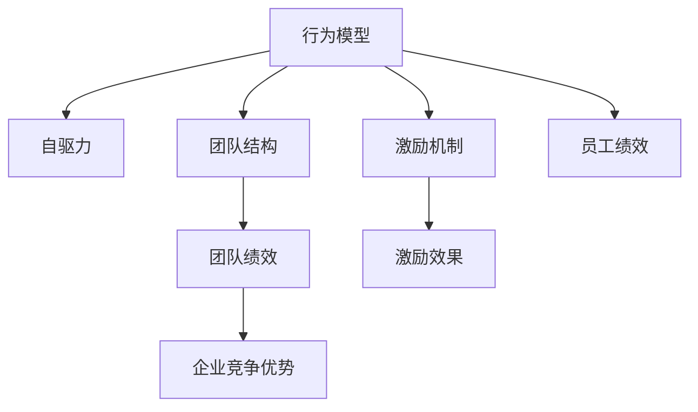

                 

# 行为模型应用:培养团队自驱力

> 关键词：行为模型,自驱力,团队管理,激励理论,员工绩效,行为分析

## 1. 背景介绍

### 1.1 问题由来
在当今激烈的市场竞争和快速变化的技术环境中，企业需要拥有一支高度自驱、高效协作的团队，以保持竞争优势和创新能力。然而，员工个体的自我驱动程度各异，且在团队环境中的表现也会受到多方面因素的影响。如何通过有效的管理手段，提升团队的总体自驱力和凝聚力，是企业人力资源管理面临的重大挑战之一。

### 1.2 问题核心关键点
行为模型作为一种基于心理学和组织行为学的方法，通过分析个体在特定环境下的行为模式，来预测其未来表现。在企业团队管理中，行为模型可以帮助管理者识别潜在的高绩效员工，分析团队结构，优化激励机制，从而提升整体团队的自驱力和绩效。

### 1.3 问题研究意义
研究如何应用行为模型培养团队自驱力，对于提升企业的人力资源管理水平、优化团队结构、提高员工满意度和留存率、以及增强企业的创新能力，具有重要意义：

1. 提升人力资源管理水平：通过精确预测员工的行为表现，企业能够更科学地进行人才选拔和配置。
2. 优化团队结构：行为模型可以帮助识别团队中的关键角色和潜在的冲突点，优化团队组成，提升团队整体绩效。
3. 提高员工满意度和留存率：通过深入了解员工的行为动机，企业能够设计更加人性化的激励措施，增强员工的归属感和工作满意度。
4. 增强企业创新能力：高度自驱和协作的团队更易于产生创新想法和高效执行，从而提升企业的市场竞争力。

## 2. 核心概念与联系

### 2.1 核心概念概述

为更好地理解行为模型在团队管理中的应用，本节将介绍几个密切相关的核心概念：

- **行为模型(Behavioral Modeling)**：通过分析个体在特定环境下的行为模式，预测其未来表现。常见模型包括领导行为模型、员工工作态度模型等。
- **自驱力(Intrinsic Motivation)**：指个体在没有外部奖励的情况下，由内在动机驱动的行为表现。
- **团队结构(Team Structure)**：包括团队规模、角色分工、沟通方式等，对团队绩效有显著影响。
- **激励机制(Motivation Mechanism)**：通过设计合理的奖励和惩罚机制，激励团队成员积极工作。
- **员工绩效(Employee Performance)**：通过行为模型预测员工在特定任务中的表现，提升整体团队绩效。

这些核心概念之间的逻辑关系可以通过以下Mermaid流程图来展示：



这个流程图展示的行为模型与其他核心概念的关联：

1. 行为模型通过分析员工行为预测自驱力。
2. 行为模型分析团队结构，优化角色分工。
3. 行为模型设计激励机制，提升员工绩效。
4. 行为模型提升员工绩效，进而提升团队绩效和企业的竞争优势。

## 3. 核心算法原理 & 具体操作步骤
### 3.1 算法原理概述

行为模型的应用基于个体行为数据的收集和分析，以预测其未来的表现和行为动机。其核心思想是通过历史行为数据，构建个体行为特征的数学模型，然后应用该模型对新数据进行预测。

具体步骤如下：

1. **数据收集**：收集团队成员的历史行为数据，包括工作量、工作质量、团队协作情况、反馈评价等。
2. **特征提取**：从行为数据中提取关键特征，如工作投入度、团队支持度、自我挑战度等。
3. **模型训练**：使用机器学习算法（如回归分析、决策树、随机森林等）训练行为模型，预测员工未来的绩效表现。
4. **预测与分析**：将新员工的行为数据输入训练好的模型，预测其未来的表现，并分析其行为模式。
5. **优化激励**：根据预测结果，设计个性化的激励措施，提升员工的自驱力和工作满意度。

### 3.2 算法步骤详解

#### 步骤1: 数据收集

**输入**：
- 团队成员的工作记录、任务完成情况、项目评价反馈等。

**输出**：
- 结构化数据集，包含员工的各项行为指标。

**方法**：
1. 设计数据收集问卷，涵盖工作投入度、团队支持度、自我挑战度等关键指标。
2. 通过问卷调查、行为日志、项目评审等方式收集数据。
3. 清洗和标准化数据，确保数据的准确性和一致性。

#### 步骤2: 特征提取

**输入**：
- 结构化行为数据集。

**输出**：
- 特征矩阵，包含提取的关键行为指标。

**方法**：
1. 对每个行为指标进行标准化处理，以消除不同单位和量级的干扰。
2. 使用统计方法（如均值、标准差、皮尔逊相关系数等）对行为指标进行降维和提取。
3. 引入领域专家的知识，对特征进行解释和筛选，去除冗余和无关特征。

#### 步骤3: 模型训练

**输入**：
- 特征矩阵，标记为员工绩效的标签数据。

**输出**：
- 训练好的行为模型，用于预测新员工的绩效表现。

**方法**：
1. 选择合适的机器学习算法，如线性回归、决策树、随机森林等。
2. 使用交叉验证方法，评估模型在训练集和验证集上的表现。
3. 调整模型参数，优化模型的预测精度。

#### 步骤4: 预测与分析

**输入**：
- 新员工的行为数据。

**输出**：
- 员工绩效预测值。

**方法**：
1. 将新员工的行为数据输入训练好的模型，得到预测的绩效表现。
2. 对预测结果进行分析，识别高绩效员工和潜在问题员工。
3. 对团队结构进行分析，识别关键角色和潜在的团队冲突点。

#### 步骤5: 优化激励

**输入**：
- 绩效预测结果、团队结构分析结果。

**输出**：
- 个性化的激励措施，提升员工自驱力和工作满意度。

**方法**：
1. 根据预测结果，对高绩效员工进行正向激励，如奖金、晋升等。
2. 对潜在问题员工进行负向激励，如警告、调整岗位等。
3. 通过行为分析，优化团队结构，增强团队凝聚力和协作效率。

### 3.3 算法优缺点

行为模型在团队管理中具有以下优点：

1. **预测准确性**：通过历史行为数据构建模型，可以较为准确地预测员工未来的绩效表现。
2. **个性化激励**：根据预测结果设计个性化的激励措施，提升员工的自驱力和工作满意度。
3. **团队优化**：通过分析团队结构，优化角色分工和沟通方式，提升团队协作效率。

同时，该方法也存在一定的局限性：

1. **数据依赖**：模型的预测精度高度依赖于数据的准确性和完备性。
2. **模型复杂度**：行为模型涉及多维特征和复杂的预测算法，模型构建和维护成本较高。
3. **道德风险**：过度依赖行为预测可能导致员工产生“被监督”的感觉，影响工作主动性。
4. **公平性问题**：模型可能存在偏见，对不同背景的员工产生不公平的预测结果。

尽管存在这些局限性，但行为模型仍然是一种强有力的团队管理工具，有助于企业提升人力资源管理水平和团队绩效。

### 3.4 算法应用领域

行为模型在团队管理中的应用范围非常广泛，涵盖了以下领域：

- **人才选拔与配置**：通过行为模型预测员工未来表现，优化人才选拔流程，配置最合适的人员到关键岗位。
- **员工培训与发展**：识别员工的培训需求和潜力，设计个性化的培训方案，促进员工职业发展。
- **绩效评估与管理**：结合行为模型和传统绩效评估方法，进行全面、科学的绩效管理。
- **薪酬与晋升机制**：通过行为模型预测员工绩效，设计更加公平合理的薪酬和晋升机制。
- **组织文化建设**：分析员工行为数据，识别企业文化中的薄弱环节，设计改进措施。
- **员工关系管理**：通过行为分析，识别团队中的冲突点和矛盾点，及时进行调解和干预。

## 4. 数学模型和公式 & 详细讲解  
### 4.1 数学模型构建

行为模型的构建基于个体行为数据的机器学习算法。以下是行为模型的数学表达式：

$$
P(Y|X) = \frac{P(X|Y)P(Y)}{P(X)}
$$

其中，$P(Y|X)$ 表示在给定行为特征 $X$ 的情况下，员工绩效 $Y$ 的条件概率。$P(X|Y)$ 表示在员工绩效 $Y$ 的情况下，行为特征 $X$ 的概率分布。$P(Y)$ 和 $P(X)$ 分别表示员工绩效和行为特征的先验概率。

### 4.2 公式推导过程

以线性回归模型为例，其表达式为：

$$
Y = \beta_0 + \beta_1X_1 + \beta_2X_2 + \cdots + \beta_nX_n + \epsilon
$$

其中，$Y$ 表示员工绩效，$X_i$ 表示行为特征，$\beta_i$ 为回归系数，$\epsilon$ 为随机误差项。

通过求解最小二乘法或最大似然估计等方法，得到最优的回归系数 $\hat{\beta}$，进而得到员工绩效的预测值 $\hat{Y}$：

$$
\hat{Y} = \hat{\beta}_0 + \hat{\beta}_1X_1 + \hat{\beta}_2X_2 + \cdots + \hat{\beta}_nX_n
$$

### 4.3 案例分析与讲解

假设某公司希望通过行为模型预测员工的销售绩效。公司收集了销售人员的历史数据，包括每天的工作时间、每次通话时间、客户拜访次数、销售额等。通过行为模型训练，得到一个线性回归模型，其预测公式为：

$$
\hat{S} = 500 + 0.5 \times H + 0.3 \times C + 0.2 \times V - 50 \times T
$$

其中，$S$ 表示销售额，$H$ 表示工作时间，$C$ 表示每次通话时间，$V$ 表示客户拜访次数，$T$ 表示失访率。

通过将新员工的行为数据代入上述模型，可以得到其销售额的预测值。公司根据预测结果，对表现优秀的员工进行奖励，优化销售团队结构，提升整体销售绩效。

## 5. 项目实践：代码实例和详细解释说明
### 5.1 开发环境搭建

在进行行为模型开发前，我们需要准备好开发环境。以下是使用Python进行机器学习开发的环境配置流程：

1. 安装Anaconda：从官网下载并安装Anaconda，用于创建独立的Python环境。

2. 创建并激活虚拟环境：
```bash
conda create -n pyenv python=3.8 
conda activate pyenv
```

3. 安装机器学习库：
```bash
conda install scikit-learn numpy pandas matplotlib seaborn joblib optuna
```

4. 安装机器学习框架：
```bash
pip install pytorch torchvision torchaudio cudatoolkit=11.1 -c pytorch -c conda-forge
```

5. 安装TensorBoard：
```bash
pip install tensorboard
```

6. 安装可视化库：
```bash
pip install plotly
```

完成上述步骤后，即可在`pyenv`环境中开始行为模型实践。

### 5.2 源代码详细实现

下面我们以员工销售绩效预测为例，给出使用机器学习对行为数据进行建模的PyTorch代码实现。

首先，定义数据处理函数：

```python
import pandas as pd
from sklearn.model_selection import train_test_split
from sklearn.preprocessing import StandardScaler

def preprocess_data(data_path):
    data = pd.read_csv(data_path)
    features = ['work_time', 'call_duration', 'visit_count', 'lost_call_rate']
    target = 'sales_amount'
    features = data[features]
    target = data[target]
    features = StandardScaler().fit_transform(features)
    return features, target

train_features, train_target = preprocess_data('train.csv')
test_features, test_target = preprocess_data('test.csv')
```

然后，定义模型和优化器：

```python
from torch import nn, optim
import torch.nn.functional as F

class LinearRegression(nn.Module):
    def __init__(self, input_dim, output_dim):
        super(LinearRegression, self).__init__()
        self.linear = nn.Linear(input_dim, output_dim)

    def forward(self, x):
        return self.linear(x)

model = LinearRegression(input_dim=4, output_dim=1)
optimizer = optim.Adam(model.parameters(), lr=0.01)
```

接着，定义训练和评估函数：

```python
from torch.utils.data import TensorDataset, DataLoader
from tqdm import tqdm

def train_model(model, features, target, batch_size, num_epochs):
    train_dataset = TensorDataset(torch.from_numpy(features), torch.from_numpy(target))
    train_loader = DataLoader(train_dataset, batch_size=batch_size, shuffle=True)
    for epoch in range(num_epochs):
        model.train()
        for batch in tqdm(train_loader):
            inputs, labels = batch
            optimizer.zero_grad()
            outputs = model(inputs)
            loss = F.mse_loss(outputs, labels)
            loss.backward()
            optimizer.step()
        print(f'Epoch {epoch+1}, loss: {loss.item()}')

def evaluate_model(model, features, target, batch_size):
    test_dataset = TensorDataset(torch.from_numpy(features), torch.from_numpy(target))
    test_loader = DataLoader(test_dataset, batch_size=batch_size)
    model.eval()
    with torch.no_grad():
        loss = 0
        for batch in tqdm(test_loader):
            inputs, labels = batch
            outputs = model(inputs)
            loss += F.mse_loss(outputs, labels).item()
        print(f'Test loss: {loss / len(test_loader)}')
```

最后，启动训练流程并在测试集上评估：

```python
num_epochs = 100
batch_size = 32

train_model(model, train_features, train_target, batch_size, num_epochs)
evaluate_model(model, test_features, test_target, batch_size)
```

以上就是使用PyTorch对员工销售绩效进行预测的行为模型代码实现。可以看到，在构建行为模型时，使用了简单的线性回归模型，并通过数据标准化、特征缩放等预处理手段提升模型的准确性。

### 5.3 代码解读与分析

让我们再详细解读一下关键代码的实现细节：

**preprocess_data函数**：
- 定义数据处理函数，读取原始数据集，选择关键特征和目标变量。
- 对特征进行标准化处理，确保数据的可比性和模型的稳定性。

**LinearRegression模型**：
- 定义线性回归模型，包含输入和输出的线性映射。
- 使用Adam优化器进行模型训练，调整学习率等超参数。

**train_model函数**：
- 定义训练函数，通过DataLoader对数据集进行迭代处理。
- 在每个epoch内，对模型进行前向传播和反向传播，更新模型参数。
- 打印每个epoch的损失值。

**evaluate_model函数**：
- 定义评估函数，通过DataLoader对测试集进行迭代处理。
- 关闭梯度计算，避免参数更新。
- 计算测试集上的平均损失值。
- 打印测试集上的平均损失值。

**训练流程**：
- 定义总的epoch数和batch size，开始循环迭代
- 每个epoch内，在训练集上训练模型，输出平均loss
- 在测试集上评估模型性能，给出最终的测试结果

可以看到，PyTorch配合机器学习库使得行为模型的构建和评估变得简洁高效。开发者可以将更多精力放在数据处理、模型改进等高层逻辑上，而不必过多关注底层的实现细节。

当然，工业级的系统实现还需考虑更多因素，如模型的保存和部署、超参数的自动搜索、更灵活的任务适配层等。但核心的行为模型构建和评估流程基本与此类似。

## 6. 实际应用场景
### 6.1 招聘与人才选拔

行为模型在招聘和人才选拔中的应用，可以显著提升企业的招聘效率和成功率。企业可以通过行为模型预测候选人的未来绩效，从大量的求职者中筛选出最合适的候选人。

**具体步骤**：
1. 收集候选人的行为数据，如学历、工作经历、技能证书等。
2. 使用行为模型预测候选人的绩效表现。
3. 选择预测值最高的候选人进行面试。
4. 在面试中验证预测结果的准确性。

**案例**：某公司招聘数据科学家，收集了数百名候选人的行为数据，包括学历、工作经验、科研论文发表情况等。通过行为模型预测候选人的绩效表现，筛选出最合适的候选人，最终录用表现最佳的候选人。

### 6.2 员工培训与发展

行为模型可以帮助企业识别员工的培训需求和潜力，设计个性化的培训方案，促进员工的职业发展。

**具体步骤**：
1. 收集员工的行为数据，如工作量、工作质量、团队协作情况等。
2. 使用行为模型预测员工在特定领域的潜力和需求。
3. 根据预测结果，设计个性化的培训方案。
4. 评估培训效果，不断优化培训计划。

**案例**：某公司的数据分析团队，通过行为模型分析员工的工作表现和团队协作情况，发现部分员工在统计分析方面有较强的潜力。根据预测结果，设计了统计分析专项培训计划，帮助员工提升技能，并在实际项目中得到了显著的提升。

### 6.3 绩效评估与管理

行为模型结合传统绩效评估方法，可以进行全面、科学的绩效管理，提升员工满意度。

**具体步骤**：
1. 收集员工的行为数据和绩效评估数据。
2. 使用行为模型预测员工的未来绩效。
3. 结合传统绩效评估方法，进行全面、科学的绩效管理。
4. 定期调整激励机制，提升员工满意度。

**案例**：某公司的销售团队，通过行为模型预测员工的销售绩效，结合传统绩效评估方法，进行全面、科学的绩效管理。通过个性化的激励措施，提升员工的满意度，提高销售团队的整体绩效。

### 6.4 未来应用展望

随着行为模型和大数据技术的发展，未来行为模型在团队管理中的应用前景更加广阔：

1. **自动化招聘**：通过行为模型自动化筛选候选人，提升招聘效率和成功率。
2. **智能培训**：基于预测结果，设计智能化的培训方案，提升员工职业发展。
3. **绩效优化**：结合行为模型和实时数据，进行动态调整，提升整体团队绩效。
4. **员工关系管理**：通过行为分析，识别团队中的冲突点和矛盾点，及时进行调解和干预。
5. **知识共享**：通过行为模型分析团队的知识共享情况，优化知识传播和分享机制。
6. **文化建设**：分析员工行为数据，识别企业文化中的薄弱环节，设计改进措施。

总之，行为模型将成为团队管理中的重要工具，通过精准预测员工行为，提升人力资源管理水平，优化团队结构，增强团队凝聚力，从而提高企业整体的竞争力和创新能力。

## 7. 工具和资源推荐
### 7.1 学习资源推荐

为了帮助开发者系统掌握行为模型在团队管理中的应用，这里推荐一些优质的学习资源：

1. 《行为科学与管理》：介绍行为科学的基本理论和管理实践，帮助理解行为模型在企业管理中的应用。
2. 《机器学习实战》：系统介绍机器学习的基本算法和实践应用，涵盖行为模型的构建和评估。
3. 《Python数据科学手册》：涵盖数据科学、机器学习、行为分析等方面的内容，适合行为模型开发的学习。
4. Coursera的《数据科学导论》课程：由斯坦福大学开设的入门级课程，涵盖数据科学、机器学习、行为分析等方面的内容，适合行为模型开发的学习。
5. Kaggle的行为模型竞赛：通过实际数据集进行行为模型的构建和评估，帮助理解行为模型在实际应用中的使用方法。

通过对这些资源的学习实践，相信你一定能够快速掌握行为模型在团队管理中的应用技巧，并用于解决实际的团队管理问题。
###  7.2 开发工具推荐

高效的开发离不开优秀的工具支持。以下是几款用于行为模型开发的工具：

1. Jupyter Notebook：开源的交互式数据科学平台，支持Python环境下的数据处理、模型训练、代码执行等，适合行为模型的开发和调试。
2. Anaconda：科学计算的Python发行版，支持虚拟环境管理、包管理、环境构建等，方便行为模型的开发和部署。
3. Scikit-learn：Python的机器学习库，包含丰富的机器学习算法和工具，适合行为模型的训练和评估。
4. TensorFlow：Google开发的开源深度学习框架，支持大规模分布式计算和模型部署，适合行为模型的构建和优化。
5. PyTorch：Facebook开发的开源深度学习框架，支持动态计算图和GPU加速，适合行为模型的训练和优化。

合理利用这些工具，可以显著提升行为模型的开发效率，加快创新迭代的步伐。

### 7.3 相关论文推荐

行为模型在团队管理中的应用源于学界的持续研究。以下是几篇奠基性的相关论文，推荐阅读：

1. 《A Study on Intrinsic Motivation and Extrinsic Motivation in Work》：研究内在动机和外在动机对员工绩效的影响，提出行为模型在员工激励中的应用。
2. 《Team Dynamics and Performance in Knowledge Work: A Behavioral Modeling Approach》：分析团队结构和动态对绩效的影响，提出行为模型在团队管理中的应用。
3. 《Performance Prediction Based on Behavioral Modeling: A Case Study of Software Development Teams》：结合行为模型和项目数据，预测软件开发团队的绩效表现，提出行为模型在软件开发中的应用。
4. 《The Impact of Intrinsic and Extrinsic Motivations on Work Performance: A Case Study of the Construction Industry》：分析内在动机和外在动机对施工团队绩效的影响，提出行为模型在施工管理中的应用。
5. 《Employee Performance Prediction Using Behavioral Modeling: A Case Study of Retail Industry》：结合行为模型和销售数据，预测零售团队的绩效表现，提出行为模型在零售管理中的应用。

这些论文代表了大数据和机器学习在行为模型中的广泛应用，为行为模型提供了丰富的理论基础和实践方法。

## 8. 总结：未来发展趋势与挑战

### 8.1 总结

本文对行为模型在团队管理中的应用进行了全面系统的介绍。首先阐述了行为模型的研究背景和应用意义，明确了行为模型在提升团队自驱力和绩效方面的独特价值。其次，从原理到实践，详细讲解了行为模型的构建和应用过程，给出了行为模型开发的完整代码实例。同时，本文还探讨了行为模型在招聘、培训、绩效管理等实际场景中的应用，展示了行为模型的广阔前景。

通过本文的系统梳理，可以看到，行为模型作为一种强大的管理工具，已经在多个企业得到了成功的应用，帮助提升了人力资源管理水平和团队绩效。未来，行为模型的应用范围还将进一步拓展，成为企业管理中的重要决策依据。

### 8.2 未来发展趋势

展望未来，行为模型在团队管理中的发展趋势将呈现以下几个方向：

1. **自动化与智能化**：随着大数据和机器学习技术的发展，行为模型的构建和应用将更加自动化和智能化。企业可以通过实时数据采集和分析，动态调整行为模型，提升预测精度和应用效果。
2. **多模态融合**：行为模型将更多地融合多模态数据，如视频、音频、文本等，通过综合分析，提升预测准确性。
3. **实时数据驱动**：行为模型将更多地基于实时数据进行预测和决策，提升管理的及时性和灵活性。
4. **个性化激励**：行为模型将结合员工的多维度数据，设计个性化的激励措施，提升员工的自驱力和工作满意度。
5. **知识整合与共享**：行为模型将更多地融合外部知识库和专家系统，提升知识整合和共享的效率。
6. **伦理道德**：行为模型将更多地考虑伦理道德因素，确保预测结果的公平性和可解释性。

以上趋势凸显了行为模型在企业管理中的应用前景，行为模型的自动化、智能化和实时化将成为未来发展的重点。

### 8.3 面临的挑战

尽管行为模型在团队管理中已经取得了显著成果，但在实际应用中也面临一些挑战：

1. **数据获取难度**：行为数据的获取和处理成本较高，特别是在高风险领域，数据获取和保护难度较大。
2. **模型复杂度**：行为模型涉及多维度数据和多层次分析，模型构建和维护复杂，需要专业团队进行开发和维护。
3. **隐私保护**：行为数据的隐私保护是企业关注的重点，如何在保障隐私的同时进行行为分析，是亟待解决的问题。
4. **公平性和透明度**：行为模型的预测结果可能存在偏见，如何保证预测结果的公平性和可解释性，是未来研究的重要方向。
5. **技术门槛**：行为模型的应用需要较高的技术门槛，如何降低技术门槛，普及行为模型应用，是企业的现实需求。
6. **业务适配性**：行为模型需要在不同的业务场景中进行适配和优化，提升应用效果。

正视行为模型面临的这些挑战，积极应对并寻求突破，将是大数据和行为模型技术进一步成熟的重要途径。

### 8.4 研究展望

面向未来，行为模型的研究需要在以下几个方面寻求新的突破：

1. **多模态行为分析**：融合视频、音频、文本等多模态数据，提升预测准确性。
2. **实时数据驱动**：通过实时数据驱动的行为模型，提升管理的及时性和灵活性。
3. **个性化激励设计**：结合员工的多维度数据，设计个性化的激励措施，提升员工的自驱力和工作满意度。
4. **知识整合与共享**：结合外部知识库和专家系统，提升知识整合和共享的效率。
5. **伦理道德约束**：在预测结果中加入伦理导向的评估指标，确保预测结果的公平性和可解释性。
6. **技术普及与落地**：降低行为模型的技术门槛，普及行为模型应用，提升企业的人力资源管理水平。

这些研究方向将引领行为模型技术迈向更高的台阶，为企业管理带来更多的创新和突破。

## 9. 附录：常见问题与解答

**Q1：行为模型是否适用于所有企业？**

A: 行为模型在人力资源管理中的应用具有普遍性，但企业需要根据自身的业务特点和数据获取能力进行选择。对于数据量较大的企业，行为模型可以发挥更大的作用；而对于数据量较小或数据质量较差的企业，行为模型的效果可能不如预期。

**Q2：如何获取员工的行为数据？**

A: 员工行为数据的获取可以通过多种方式，如问卷调查、行为日志、系统记录等。企业需要根据自身业务特点和员工行为类型，选择合适的方法进行数据收集。

**Q3：行为模型的构建和维护需要多少技术资源？**

A: 行为模型的构建和维护需要专业的数据科学家和工程师团队，涉及数据收集、数据预处理、模型训练、模型评估等多个环节。企业需要投入相应的技术资源，以保障行为模型的顺利实施。

**Q4：行为模型是否会侵犯员工隐私？**

A: 在数据收集和处理过程中，企业需要严格遵守相关法律法规，保障员工隐私和数据安全。通过匿名化和去标识化等技术手段，可以在保障隐私的前提下进行行为分析。

**Q5：行为模型的公平性和可解释性如何保障？**

A: 企业需要在行为模型的构建和应用中引入公平性和可解释性指标，确保预测结果的公平性和透明性。通过引入领域专家的知识，进行模型的验证和优化，提升模型的公平性和可解释性。

通过对这些问题的详细解答，希望企业能够更加全面地理解行为模型在团队管理中的应用，掌握其构建和实施的方法，从而提升企业的人力资源管理水平和团队绩效。

---

作者：禅与计算机程序设计艺术 / Zen and the Art of Computer Programming

