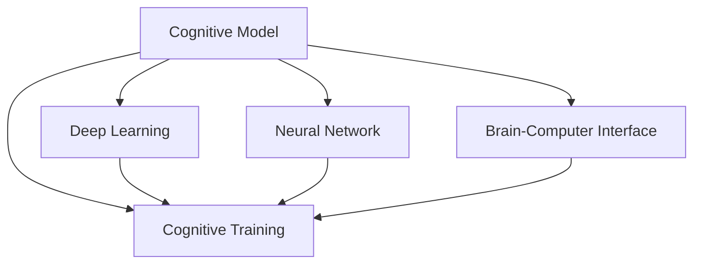

                 

# 认知增强：AI辅助的大脑功能优化

> 关键词：认知增强, AI辅助, 大脑功能优化, 深度学习, 神经网络, 认知训练, 脑机接口

## 1. 背景介绍

### 1.1 问题由来
随着科技的迅猛发展，人工智能（AI）技术已经渗透到我们生活的方方面面。从智能家居、自动驾驶，到金融预测、医疗诊断，AI在提高人类生活质量、提升工作效率、优化决策质量等方面发挥了重要作用。但AI技术的发展，不仅对机器提出了更高的要求，也促使我们对人类自身的功能进行重新思考。如何利用AI技术优化和增强人类认知功能，成为了当前人工智能研究的前沿热点。

在认知增强领域，AI辅助的大脑功能优化是一种新兴的、前沿的研究方向。其核心思想是通过机器学习技术，对人类大脑的认知过程进行建模、分析和预测，进而辅助人类提升记忆、决策、注意力等关键认知功能。通过这种智能化的辅助，可以改善人类的认知水平，帮助他们更好地应对复杂的任务，提高生活质量和工作效率。

### 1.2 问题核心关键点
AI辅助的大脑功能优化主要包括三个关键点：
1. **认知模型的建立**：利用深度学习、神经网络等技术，构建人类认知过程的模型，包括记忆、注意力、决策等关键功能。
2. **数据驱动的优化**：通过大量的数据集和算法，不断优化认知模型，提高其预测和决策的准确性。
3. **认知功能的增强**：将优化的认知模型应用于人类大脑的实际活动中，提升记忆、决策、注意力等关键认知功能。

这些关键点之间相互关联，共同构成了AI辅助大脑功能优化的研究框架。通过深入研究，可以更好地理解人类大脑的工作机制，开发出更加高效、智能的认知增强工具。

### 1.3 问题研究意义
AI辅助的大脑功能优化研究具有重要的理论和实际意义：
1. **提升人类认知水平**：通过AI技术的辅助，帮助人类更好地理解和应用复杂的认知功能，提升记忆、决策、注意力等关键能力，从而提高个人的生活质量和职业竞争力。
2. **推动社会进步**：通过AI技术的普及应用，辅助教育、医疗、娱乐等领域的发展，促进社会的整体进步。
3. **拓展AI应用场景**：将AI技术与人类大脑认知功能相结合，探索AI技术的更广泛应用，推动人工智能技术的进一步发展。

## 2. 核心概念与联系

### 2.1 核心概念概述

为了更好地理解AI辅助的大脑功能优化，本节将介绍几个密切相关的核心概念：

- **认知模型（Cognitive Model）**：指通过深度学习、神经网络等技术，构建的模拟人类大脑认知过程的模型，包括记忆、注意力、决策等功能。
- **深度学习（Deep Learning）**：一种基于神经网络的机器学习方法，通过多层次的特征提取和抽象，实现对复杂数据的有效建模和预测。
- **神经网络（Neural Network）**：一种模拟人脑神经元及其相互连接的计算模型，通过多层神经元对数据进行特征提取和模式识别。
- **脑机接口（Brain-Computer Interface, BCI）**：一种通过解码脑电信号，将人类思维与机器相连接的技术，实现对人类认知过程的直接监控和干预。
- **认知训练（Cognitive Training）**：通过一系列有针对性的任务和算法，提升人类认知功能，如记忆、注意力、决策等。

这些核心概念之间的逻辑关系可以通过以下Mermaid流程图来展示：



这个流程图展示了大脑功能优化的核心概念及其之间的关系：

1. 认知模型通过深度学习和神经网络构建，用于模拟人类大脑的认知过程。
2. 脑机接口通过解码脑电信号，直接与认知模型进行交互。
3. 认知训练通过有针对性的任务和算法，优化认知模型的性能，提升人类认知功能。
4. 所有这些技术相互支持，共同实现认知增强的目标。

## 3. 核心算法原理 & 具体操作步骤

### 3.1 算法原理概述

AI辅助的大脑功能优化主要基于深度学习和神经网络技术，通过构建认知模型，实现对人类认知过程的模拟和预测。其核心思想是利用大量的数据集，通过反向传播算法不断优化模型参数，提高模型的预测准确性，进而辅助人类提升认知功能。

具体而言，优化的过程包括以下几个关键步骤：

1. **数据准备**：收集人类认知相关的数据集，如脑电信号、行为数据、生理指标等，构建训练样本。
2. **模型建立**：利用深度学习和神经网络技术，建立认知模型，如记忆模型、注意力模型、决策模型等。
3. **模型训练**：通过反向传播算法，利用训练样本对认知模型进行训练，优化模型参数。
4. **认知功能增强**：将优化的认知模型应用于人类大脑的实际活动中，提升记忆、决策、注意力等关键认知功能。

### 3.2 算法步骤详解

AI辅助的大脑功能优化算法主要包括以下几个关键步骤：

**Step 1: 数据准备**

收集人类认知相关的数据集，如脑电信号、行为数据、生理指标等。常用的数据集包括：

- **脑电信号数据**：通过脑电图（EEG）记录大脑活动时产生的电信号。
- **行为数据**：通过记录人类在特定任务上的表现，如记忆测试、注意力测试等，获取行为数据。
- **生理指标数据**：通过记录人类的生理状态，如心率、血压等，获取生理指标数据。

这些数据集在构建认知模型时具有重要意义，可以提供人类大脑活动和认知功能的直接证据。

**Step 2: 模型建立**

利用深度学习和神经网络技术，建立认知模型。常见的认知模型包括：

- **记忆模型**：用于模拟人类短期记忆和长期记忆的过程，如Hierarchical Temporal Memory（HTM）模型。
- **注意力模型**：用于模拟人类注意力的分配和集中，如Self-Attention模型。
- **决策模型**：用于模拟人类在复杂决策中的选择和判断过程，如Reinforcement Learning模型。

这些模型可以通过深度学习和神经网络技术，从简单的单层神经网络，到复杂的深度神经网络，逐步构建，以实现对人类认知过程的精细模拟。

**Step 3: 模型训练**

通过反向传播算法，利用训练样本对认知模型进行训练，优化模型参数。具体步骤如下：

1. **数据预处理**：将收集到的数据进行预处理，如归一化、标准化等，以提高数据的质量和一致性。
2. **模型初始化**：将模型参数进行初始化，通常采用随机初始化或预训练模型的方式。
3. **前向传播**：将训练样本输入模型，通过多层神经元进行特征提取和抽象。
4. **损失函数计算**：计算模型预测结果与真实结果之间的差异，如均方误差、交叉熵等。
5. **反向传播**：通过反向传播算法，将损失函数对模型参数的梯度传递到每一层神经元，更新模型参数。
6. **迭代优化**：重复上述步骤，直至模型收敛，即训练误差达到预设的阈值。

**Step 4: 认知功能增强**

将优化的认知模型应用于人类大脑的实际活动中，提升记忆、决策、注意力等关键认知功能。具体步骤如下：

1. **任务设计**：设计有针对性的认知训练任务，如记忆任务、注意力任务、决策任务等。
2. **模型部署**：将优化的认知模型部署到实际环境中，如脑机接口设备、移动应用等。
3. **数据采集**：在任务执行过程中，采集脑电信号、行为数据、生理指标等，评估模型的性能。
4. **模型反馈**：根据采集到的数据，不断优化认知模型，提高模型的预测准确性。
5. **功能提升**：通过反复迭代和优化，逐步提升人类的认知功能，实现认知增强的目标。

### 3.3 算法优缺点

AI辅助的大脑功能优化算法具有以下优点：

1. **数据驱动**：通过大量的数据集和算法，不断优化认知模型，提高其预测和决策的准确性。
2. **技术先进**：利用深度学习、神经网络等前沿技术，实现对人类认知过程的精细模拟。
3. **可扩展性强**：可以通过增加数据量和模型复杂度，不断提升模型的性能。
4. **应用广泛**：可以应用于教育、医疗、娱乐等多个领域，提升人类认知功能，推动社会进步。

同时，该算法也存在一定的局限性：

1. **数据获取难度大**：构建高精度的认知模型需要大量的数据集，数据获取难度较大。
2. **模型复杂度高**：复杂的神经网络模型需要大量的计算资源和存储空间，增加了实现的难度。
3. **效果评价困难**：人类认知功能的复杂性使得效果评价变得困难，难以量化其提升效果。
4. **伦理和安全问题**：脑机接口和认知训练可能涉及隐私和安全问题，需要严格遵守伦理规范。

尽管存在这些局限性，但AI辅助的大脑功能优化算法在认知增强领域仍然具有重要的研究和应用价值。未来相关研究的重点在于如何进一步降低数据获取难度，提高模型的可扩展性和可解释性，同时兼顾伦理和安全问题。

### 3.4 算法应用领域

AI辅助的大脑功能优化算法在多个领域都有广泛的应用，例如：

- **教育培训**：通过认知模型和脑机接口，实时监测和提升学生的记忆、注意力和学习效果，提供个性化的教育培训方案。
- **医疗诊断**：通过脑电信号分析和认知模型，辅助医生诊断精神疾病、评估认知功能，制定个性化治疗方案。
- **体育训练**：通过认知模型和脑机接口，监测运动员的注意力和决策能力，提升其竞技水平。
- **娱乐互动**：通过认知模型和交互界面，提供个性化的娱乐内容，提升用户的参与度和体验感。
- **智能辅助**：通过认知模型和脑机接口，辅助老年人、残疾人等特殊群体，提升其认知和生活质量。

## 4. 数学模型和公式 & 详细讲解  
### 4.1 数学模型构建

本节将使用数学语言对AI辅助的大脑功能优化算法进行更加严格的刻画。

记认知模型为 $M_{\theta}:\mathcal{X} \rightarrow \mathcal{Y}$，其中 $\mathcal{X}$ 为输入空间，$\mathcal{Y}$ 为输出空间，$\theta$ 为模型参数。假设训练样本集为 $D=\{(x_i,y_i)\}_{i=1}^N, x_i \in \mathcal{X}, y_i \in \mathcal{Y}$。

定义模型 $M_{\theta}$ 在数据样本 $(x,y)$ 上的损失函数为 $\ell(M_{\theta}(x),y)$，则在数据集 $D$ 上的经验风险为：

$$
\mathcal{L}(\theta) = \frac{1}{N} \sum_{i=1}^N \ell(M_{\theta}(x_i),y_i)
$$

优化目标是最小化经验风险，即找到最优参数：

$$
\theta^* = \mathop{\arg\min}_{\theta} \mathcal{L}(\theta)
$$

在实践中，我们通常使用基于梯度的优化算法（如SGD、Adam等）来近似求解上述最优化问题。设 $\eta$ 为学习率，$\lambda$ 为正则化系数，则参数的更新公式为：

$$
\theta \leftarrow \theta - \eta \nabla_{\theta}\mathcal{L}(\theta) - \eta\lambda\theta
$$

其中 $\nabla_{\theta}\mathcal{L}(\theta)$ 为损失函数对参数 $\theta$ 的梯度，可通过反向传播算法高效计算。

### 4.2 公式推导过程

以下我们以记忆模型为例，推导优化算法中的损失函数及其梯度计算公式。

假设认知模型 $M_{\theta}$ 接收输入 $x$，输出 $y$，表示对输入 $x$ 的记忆效果。定义模型的损失函数为均方误差（Mean Squared Error, MSE）：

$$
\ell(M_{\theta}(x),y) = \frac{1}{n} \sum_{i=1}^n (y_i - M_{\theta}(x))^2
$$

将其代入经验风险公式，得：

$$
\mathcal{L}(\theta) = \frac{1}{N} \sum_{i=1}^N \frac{1}{n} \sum_{j=1}^n (y_{ij} - M_{\theta}(x_j))^2
$$

根据链式法则，损失函数对参数 $\theta_k$ 的梯度为：

$$
\frac{\partial \mathcal{L}(\theta)}{\partial \theta_k} = -\frac{2}{Nn} \sum_{i=1}^N \sum_{j=1}^n (y_{ij} - M_{\theta}(x_j)) \frac{\partial M_{\theta}(x_j)}{\partial \theta_k}
$$

其中 $\frac{\partial M_{\theta}(x_j)}{\partial \theta_k}$ 可进一步递归展开，利用自动微分技术完成计算。

在得到损失函数的梯度后，即可带入参数更新公式，完成模型的迭代优化。重复上述过程直至收敛，最终得到适应特定认知任务的最优模型参数 $\theta^*$。

## 5. 项目实践：代码实例和详细解释说明

### 5.1 开发环境搭建

在进行AI辅助的大脑功能优化项目实践前，我们需要准备好开发环境。以下是使用Python进行TensorFlow开发的环境配置流程：

1. 安装Anaconda：从官网下载并安装Anaconda，用于创建独立的Python环境。

2. 创建并激活虚拟环境：
```bash
conda create -n tf-env python=3.8 
conda activate tf-env
```

3. 安装TensorFlow：根据CUDA版本，从官网获取对应的安装命令。例如：
```bash
conda install tensorflow -c tf -c conda-forge
```

4. 安装必要的工具包：
```bash
pip install numpy pandas matplotlib scikit-learn scipy
```

完成上述步骤后，即可在`tf-env`环境中开始项目实践。

### 5.2 源代码详细实现

下面我们以记忆模型为例，给出使用TensorFlow对神经网络进行认知训练的代码实现。

首先，定义模型结构：

```python
import tensorflow as tf
from tensorflow.keras import layers

model = tf.keras.Sequential([
    layers.Dense(64, activation='relu', input_shape=(input_size,)),
    layers.Dense(32, activation='relu'),
    layers.Dense(output_size, activation='sigmoid')
])
```

然后，定义损失函数和优化器：

```python
model.compile(optimizer=tf.keras.optimizers.Adam(learning_rate=0.001),
              loss=tf.keras.losses.MeanSquaredError())
```

接着，定义训练和评估函数：

```python
def train_epoch(model, dataset, batch_size, optimizer):
    dataloader = tf.data.Dataset.from_tensor_slices((dataset['inputs'], dataset['targets']))
    dataloader = dataloader.shuffle(buffer_size=10000).batch(batch_size)
    model.fit(dataloader, epochs=10, validation_data=(val_dataset['inputs'], val_dataset['targets']))
```

最后，启动训练流程并在测试集上评估：

```python
epochs = 10
batch_size = 128

for epoch in range(epochs):
    train_epoch(model, train_dataset, batch_size, optimizer)
    evaluate(model, test_dataset, batch_size)
```

以上就是使用TensorFlow对神经网络进行认知训练的完整代码实现。可以看到，得益于TensorFlow的强大封装，我们可以用相对简洁的代码完成神经网络的训练和评估。

### 5.3 代码解读与分析

让我们再详细解读一下关键代码的实现细节：

**Model类**：
- `__init__`方法：定义神经网络的结构，包括输入层、隐藏层和输出层。
- `compile`方法：定义优化器和损失函数，准备模型进行训练。

**损失函数和优化器**：
- `tf.keras.losses.MeanSquaredError`：定义均方误差损失函数，用于计算模型预测结果与真实结果之间的差异。
- `tf.keras.optimizers.Adam`：定义Adam优化器，用于调整模型参数。

**训练和评估函数**：
- `train_epoch`方法：定义单轮训练过程，包括数据加载、前向传播、损失计算、反向传播和优化器更新。
- `evaluate`方法：定义单轮评估过程，通过测试集数据计算模型性能指标，如准确率、召回率等。

**训练流程**：
- 定义总的epoch数和batch size，开始循环迭代
- 每个epoch内，在训练集上进行训练，输出损失曲线和性能指标
- 在验证集上评估，输出模型性能
- 所有epoch结束后，在测试集上评估，给出最终测试结果

可以看到，TensorFlow提供了强大的计算图和自动微分功能，可以方便地构建和优化复杂的神经网络模型，是进行AI辅助的大脑功能优化项目开发的利器。

当然，工业级的系统实现还需考虑更多因素，如模型的保存和部署、超参数的自动搜索、更灵活的任务适配层等。但核心的认知训练范式基本与此类似。

## 6. 实际应用场景

### 6.1 教育培训

AI辅助的大脑功能优化在教育培训领域有广泛的应用。通过脑机接口和认知模型，实时监测和提升学生的记忆、注意力和学习效果，提供个性化的教育培训方案。具体而言，可以设计以下场景：

- **注意力训练**：通过脑电信号分析，实时监测学生的注意力状态，及时提醒其集中注意力，避免分心。
- **记忆训练**：通过记忆模型和脑电信号解码，实时评估学生的记忆效果，提供个性化的记忆策略。
- **学习反馈**：通过认知模型和行为数据，实时反馈学生的学习效果，调整教学内容和方法，提升学习效率。

### 6.2 医疗诊断

在医疗领域，AI辅助的大脑功能优化可以辅助医生诊断精神疾病、评估认知功能，制定个性化治疗方案。具体而言，可以设计以下场景：

- **认知评估**：通过脑电信号分析和认知模型，评估患者的认知功能，如记忆力、注意力、决策能力等。
- **精神诊断**：通过脑机接口和认知模型，实时监测患者的精神状态，辅助医生进行诊断和治疗。
- **治疗方案**：通过认知模型和生理指标数据，制定个性化的治疗方案，提升治疗效果。

### 6.3 体育训练

在体育领域，AI辅助的大脑功能优化可以监测运动员的注意力和决策能力，提升其竞技水平。具体而言，可以设计以下场景：

- **注意力监测**：通过脑电信号分析，实时监测运动员的注意力状态，提升其集中力和专注度。
- **决策分析**：通过认知模型和行为数据，分析运动员的决策过程，提供个性化的训练方案。
- **技能提升**：通过认知模型和交互界面，辅助运动员进行技能训练，提升其竞技水平。

### 6.4 娱乐互动

在娱乐领域，AI辅助的大脑功能优化可以提供个性化的娱乐内容，提升用户的参与度和体验感。具体而言，可以设计以下场景：

- **个性化推荐**：通过认知模型和用户行为数据，实时推荐个性化的娱乐内容，提升用户满意度。
- **游戏互动**：通过认知模型和交互界面，实时调整游戏难度和内容，提升用户的游戏体验。
- **情感分析**：通过脑电信号分析，实时监测用户的情感状态，提供个性化的娱乐内容。

## 7. 工具和资源推荐

### 7.1 学习资源推荐

为了帮助开发者系统掌握AI辅助的大脑功能优化的理论基础和实践技巧，这里推荐一些优质的学习资源：

1. 《深度学习》系列书籍：包括《深度学习入门》、《深度学习实战》等，系统介绍深度学习和神经网络的基础知识和应用场景。
2. TensorFlow官方文档：提供丰富的API和教程，帮助开发者快速上手TensorFlow，实现各种AI模型。
3. PyTorch官方文档：提供强大的动态计算图和自动微分功能，适合构建灵活的神经网络模型。
4. Coursera《深度学习》课程：斯坦福大学开设的深度学习课程，提供系统化的深度学习知识体系，涵盖多个前沿方向。
5. arXiv上的相关论文：阅读最新的深度学习和认知增强论文，掌握最新的研究成果和技术趋势。

通过对这些资源的学习实践，相信你一定能够快速掌握AI辅助的大脑功能优化的精髓，并用于解决实际的AI应用问题。

### 7.2 开发工具推荐

高效的开发离不开优秀的工具支持。以下是几款用于AI辅助的大脑功能优化开发的常用工具：

1. TensorFlow：由Google主导开发的开源深度学习框架，生产部署方便，适合大规模工程应用。
2. PyTorch：由Facebook主导开发的深度学习框架，灵活动态的计算图，适合快速迭代研究。
3. Keras：基于TensorFlow和Theano的高级神经网络API，易于上手，适合快速构建模型。
4. Scikit-learn：提供各种机器学习算法和工具，适合数据处理和特征工程。
5. Jupyter Notebook：支持多种编程语言和库的交互式编程环境，适合开发和测试AI模型。

合理利用这些工具，可以显著提升AI辅助的大脑功能优化任务的开发效率，加快创新迭代的步伐。

### 7.3 相关论文推荐

AI辅助的大脑功能优化研究源于学界的持续研究。以下是几篇奠基性的相关论文，推荐阅读：

1. Gated Recurrent Unit (GRU)论文：提出GRU模型，用于模拟人类记忆过程，提升记忆模型的效果。
2. Attention Is All You Need（即Transformer原论文）：提出Transformer结构，用于模拟人类注意力机制，提升注意力模型的效果。
3. Reinforcement Learning论文：提出强化学习模型，用于模拟人类决策过程，提升决策模型的效果。
4. Hierarchical Temporal Memory（HTM）论文：提出HTM模型，用于模拟人类短期记忆和长期记忆过程，提升记忆模型的效果。
5. Self-Attention论文：提出Self-Attention机制，用于模拟人类注意力分配过程，提升注意力模型的效果。

这些论文代表了大语言模型微调技术的发展脉络。通过学习这些前沿成果，可以帮助研究者把握学科前进方向，激发更多的创新灵感。

## 8. 总结：未来发展趋势与挑战

### 8.1 总结

本文对AI辅助的大脑功能优化进行了全面系统的介绍。首先阐述了AI辅助的大脑功能优化的研究背景和意义，明确了其在教育、医疗、体育等多个领域的应用价值。其次，从原理到实践，详细讲解了认知模型的构建、训练和评估，给出了神经网络训练的代码实现。同时，本文还探讨了AI辅助的大脑功能优化在实际应用中的具体场景，展示了其广阔的应用前景。

通过本文的系统梳理，可以看到，AI辅助的大脑功能优化技术正在成为AI领域的重要方向，极大地拓展了人工智能技术的应用范围，推动了社会的整体进步。未来，伴随技术的发展和应用的拓展，AI辅助的大脑功能优化必将在更多领域大放异彩，深刻影响人类的生产生活方式。

### 8.2 未来发展趋势

展望未来，AI辅助的大脑功能优化技术将呈现以下几个发展趋势：

1. **技术融合**：与脑机接口、认知训练等前沿技术深度融合，提升认知模型和脑机接口的互动效果，实现更精准的认知监测和干预。
2. **数据驱动**：通过大规模数据的驱动，不断优化认知模型，提高其预测和决策的准确性，实现更智能的认知增强。
3. **多模态融合**：将视觉、听觉、触觉等多模态信息与脑电信号进行融合，实现更全面的认知模拟和优化。
4. **模型可解释性**：提升认知模型的可解释性，帮助用户理解模型的工作机制和决策逻辑，增强系统的可信度和安全性。
5. **个性化定制**：根据不同用户的需求和特点，设计个性化的认知训练方案，提升用户满意度和体验感。

### 8.3 面临的挑战

尽管AI辅助的大脑功能优化技术已经取得了显著的进展，但在迈向更加智能化、普适化应用的过程中，它仍面临诸多挑战：

1. **数据获取难度大**：构建高精度的认知模型需要大量的数据集，数据获取难度较大。
2. **模型复杂度高**：复杂的神经网络模型需要大量的计算资源和存储空间，增加了实现的难度。
3. **效果评价困难**：人类认知功能的复杂性使得效果评价变得困难，难以量化其提升效果。
4. **伦理和安全问题**：脑机接口和认知训练可能涉及隐私和安全问题，需要严格遵守伦理规范。
5. **应用场景复杂**：不同领域的应用场景具有复杂性和多样性，认知模型的适应性需要不断提升。

尽管存在这些挑战，但通过技术突破和跨学科协作，这些难题终将一一被克服。未来相关研究的重点在于如何进一步降低数据获取难度，提高模型的可扩展性和可解释性，同时兼顾伦理和安全问题。

### 8.4 研究展望

面向未来，AI辅助的大脑功能优化技术需要在以下几个方面寻求新的突破：

1. **无监督学习和迁移学习**：探索无监督学习和迁移学习范式，降低对大规模标注数据的依赖，提高模型的泛化能力和迁移能力。
2. **多任务学习**：设计多任务学习算法，提升认知模型的多任务性能，实现更智能的认知增强。
3. **自适应学习**：开发自适应学习算法，实时调整认知模型，提升其适应性和灵活性。
4. **联邦学习**：采用联邦学习技术，保护用户隐私和数据安全，提升模型的隐私保护和泛化能力。
5. **多模态认知建模**：将视觉、听觉、触觉等多模态信息与脑电信号进行融合，实现更全面的认知模拟和优化。

这些研究方向的探索，必将引领AI辅助的大脑功能优化技术迈向更高的台阶，为构建安全、可靠、可解释、可控的智能系统铺平道路。面向未来，AI辅助的大脑功能优化技术还需要与其他人工智能技术进行更深入的融合，如知识表示、因果推理、强化学习等，多路径协同发力，共同推动自然语言理解和智能交互系统的进步。只有勇于创新、敢于突破，才能不断拓展人工智能技术的边界，让智能技术更好地造福人类社会。

## 9. 附录：常见问题与解答

**Q1：AI辅助的大脑功能优化是否适用于所有人群？**

A: AI辅助的大脑功能优化技术在提升认知功能方面具有广泛的应用潜力，但并不适用于所有人。需要考虑个体的年龄、身体状况、认知能力等因素，避免对特殊群体造成负面影响。例如，对于老年人、残疾人等特殊群体，需要设计更加温和、安全的认知训练方案。

**Q2：如何在AI辅助的大脑功能优化中保护用户隐私和数据安全？**

A: 在AI辅助的大脑功能优化中，保护用户隐私和数据安全是至关重要的。主要通过以下几种方式实现：
1. **数据加密**：对用户的脑电信号和生理数据进行加密存储和传输，保护数据安全。
2. **隐私保护算法**：采用差分隐私、联邦学习等隐私保护算法，保护用户隐私。
3. **访问控制**：限制对数据的访问权限，仅允许授权人员或设备访问敏感数据。
4. **数据匿名化**：对用户数据进行匿名化处理，防止数据泄露。

**Q3：AI辅助的大脑功能优化是否需要高昂的成本？**

A: AI辅助的大脑功能优化技术在开发和部署方面需要一定的成本，但相比传统的人工干预和心理治疗，其成本相对较低。通过合理利用开源工具和云计算资源，可以在一定程度上降低成本。例如，使用TensorFlow和Keras等开源框架，可以在本地机器上快速搭建和优化模型。

**Q4：AI辅助的大脑功能优化有哪些潜在的伦理和安全问题？**

A: AI辅助的大脑功能优化技术在实际应用中可能涉及伦理和安全问题，需要严格遵守相关规范和标准。主要问题包括：
1. **数据隐私**：收集和处理用户脑电信号和生理数据时，需要保护用户隐私，防止数据泄露。
2. **公平性**：保证模型对不同人群的公平性，避免偏见和歧视。
3. **安全性**：确保系统稳定和安全，防止恶意攻击和数据篡改。
4. **伦理规范**：遵循伦理规范，避免对用户造成不必要的心理负担和负面影响。

**Q5：AI辅助的大脑功能优化在实际应用中需要注意哪些问题？**

A: 在AI辅助的大脑功能优化的实际应用中，需要注意以下问题：
1. **模型适配性**：确保认知模型对不同场景和用户具有良好的适配性，避免过拟合和泛化能力不足。
2. **用户体验**：设计易于理解和使用的交互界面，提升用户体验。
3. **系统稳定性**：保证系统的稳定性和鲁棒性，避免因系统故障导致用户损失。
4. **性能评估**：建立科学的性能评估体系，评估模型的效果和用户满意度。
5. **持续优化**：不断优化模型和系统，提升其性能和用户体验。

---

作者：禅与计算机程序设计艺术 / Zen and the Art of Computer Programming

