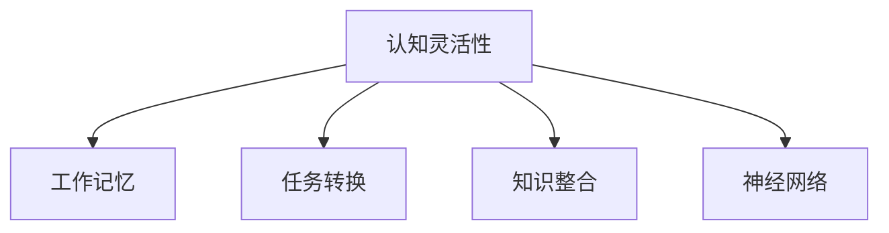

                 

## 1. 背景介绍

在信息技术迅猛发展的今天，认知灵活性（Cognitive Flexibility）已成为个体在快速变化的环境中成功适应新知识的重要心理能力。认知灵活性不仅对学习、决策、创新具有关键作用，还对人工智能的发展和应用具有深远的影响。本文旨在探讨认知灵活性的机制，并提出基于认知灵活性的知识适应方法，以期为人工智能系统的设计与开发提供参考。

### 1.1 问题由来

随着互联网和移动互联网的普及，人们获取信息的途径越来越多样化，信息量呈爆炸式增长。面对如此海量的信息，个体需要具备快速适应新知识的能力，即认知灵活性。此外，在人工智能的快速发展过程中，如何使AI系统能够适应环境变化，持续学习和更新知识，同样是一个亟需解决的问题。

### 1.2 问题核心关键点

认知灵活性的关键在于个体（或AI系统）能够在不同情境下灵活切换认知资源，有效整合新旧知识，从而快速适应新的信息环境。其核心机制包括：

1. **神经网络结构**：认知灵活性涉及到大脑中神经网络的连接和结构，使其能够在不同任务间灵活切换。
2. **工作记忆容量**：工作记忆的容量和效率直接影响认知灵活性，容量越大的个体（或AI系统）能同时处理更多信息。
3. **任务转换能力**：任务转换能力反映个体（或AI系统）在不同任务间切换时的效率和准确性。
4. **决策过程**：在面对新信息时，个体（或AI系统）需要快速做出决策，决策过程的合理性直接影响其认知灵活性。
5. **知识整合能力**：认知灵活性还需要个体（或AI系统）具备良好的知识整合能力，能够将新旧知识有效整合。

## 2. 核心概念与联系

### 2.1 核心概念概述

为更好地理解认知灵活性的机制，本节将介绍几个关键概念及其相互关系：

- **认知灵活性**：个体（或AI系统）在不同情境下快速适应新知识的心理能力。
- **工作记忆**：存储和操作短期信息的记忆系统，容量和效率直接影响认知灵活性。
- **任务转换**：在不同任务间切换时的效率和准确性，反映认知灵活性。
- **知识整合**：新旧知识的有效整合，是认知灵活性的关键环节。
- **神经网络**：大脑中负责信息处理的复杂网络结构，直接影响认知灵活性。

这些核心概念之间的关系可以用以下Mermaid流程图表示：



这个流程图展示了认知灵活性的关键组成部分及其相互关系。

## 3. 核心算法原理 & 具体操作步骤

### 3.1 算法原理概述

认知灵活性涉及多方面的心理和生理机制，以下将从神经网络结构、工作记忆、任务转换和知识整合四个方面进行阐述。

- **神经网络结构**：认知灵活性涉及到神经网络中不同区域和连接方式，使其能够在不同任务间灵活切换。
- **工作记忆容量**：工作记忆的容量和效率直接影响认知灵活性，容量越大的个体（或AI系统）能同时处理更多信息。
- **任务转换能力**：任务转换能力反映个体（或AI系统）在不同任务间切换时的效率和准确性。
- **知识整合能力**：认知灵活性还需要个体（或AI系统）具备良好的知识整合能力，能够将新旧知识有效整合。

### 3.2 算法步骤详解

#### 3.2.1 神经网络结构

认知灵活性涉及到神经网络中不同区域和连接方式，使其能够在不同任务间灵活切换。以下以神经网络中的多任务学习为例，进行详细说明。

- **多任务学习**：通过同时训练多个任务，优化神经网络的结构和权重，使其能够适应不同任务。
- **策略梯度方法**：使用策略梯度方法（如REINFORCE、Actor-Critic等）训练神经网络，使其在不同任务间切换时具备更好的适应能力。

#### 3.2.2 工作记忆容量

工作记忆的容量和效率直接影响认知灵活性，容量越大的个体（或AI系统）能同时处理更多信息。以下介绍几种提高工作记忆容量的方法：

- **工作记忆训练**：通过各种认知训练任务（如记忆数字序列、回忆图片等），提升个体（或AI系统）的工作记忆容量。
- **神经网络结构优化**：通过优化神经网络结构（如增加隐藏层、调整神经元数量等），提升其信息处理能力。

#### 3.2.3 任务转换能力

任务转换能力反映个体（或AI系统）在不同任务间切换时的效率和准确性，以下介绍几种提高任务转换能力的方法：

- **多任务切换算法**：使用多任务切换算法（如双路径网络、转移学习等），提升神经网络在不同任务间切换的效率和准确性。
- **元学习算法**：使用元学习算法（如Meta-Learning、Optimal Transport等），使神经网络具备更好的适应新任务的能力。

#### 3.2.4 知识整合能力

认知灵活性还需要个体（或AI系统）具备良好的知识整合能力，能够将新旧知识有效整合。以下介绍几种提高知识整合能力的方法：

- **知识图谱技术**：通过构建知识图谱，将新旧知识结构化表示，使其易于整合。
- **知识图谱推理**：使用知识图谱推理技术（如规则推理、逻辑推理等），提升神经网络的知识整合能力。

### 3.3 算法优缺点

#### 3.3.1 神经网络结构

优点：
- **灵活性高**：多任务学习和策略梯度方法使神经网络能够适应不同任务，具备较高的灵活性。
- **泛化能力强**：通过同时训练多个任务，神经网络能够在新的任务上取得更好的泛化能力。

缺点：
- **训练难度大**：多任务学习和策略梯度方法需要大量的数据和计算资源，训练难度较大。
- **模型复杂度高**：复杂的神经网络结构容易过拟合，需要大量数据进行正则化。

#### 3.3.2 工作记忆容量

优点：
- **处理能力强**：提高工作记忆容量使个体（或AI系统）能够同时处理更多信息，提升信息处理能力。
- **适应能力强**：容量较大的工作记忆使个体（或AI系统）能够快速适应新的信息环境。

缺点：
- **训练复杂**：工作记忆训练需要大量的认知训练任务，训练复杂度高。
- **数据需求大**：提高工作记忆容量需要大量数据进行训练，数据需求较大。

#### 3.3.3 任务转换能力

优点：
- **切换效率高**：多任务切换算法和元学习算法使神经网络在不同任务间切换的效率和准确性更高。
- **适应能力强**：具备更好的任务转换能力使个体（或AI系统）能够快速适应新任务。

缺点：
- **计算资源需求高**：多任务切换算法和元学习算法需要大量的计算资源进行训练和推理，计算资源需求高。
- **模型复杂度高**：复杂的算法使神经网络的结构更加复杂，容易出现过拟合问题。

#### 3.3.4 知识整合能力

优点：
- **整合效果好**：知识图谱技术和知识图谱推理使新旧知识能够有效整合，提升认知灵活性。
- **结构化表示**：知识图谱将知识结构化表示，便于神经网络处理和整合。

缺点：
- **数据获取难**：构建知识图谱需要大量的数据，数据获取难度较大。
- **整合难度高**：知识整合涉及多个领域的知识，整合难度高。

### 3.4 算法应用领域

认知灵活性广泛应用于以下领域：

- **教育**：通过提高学生的认知灵活性，使其具备更好的适应新知识的能力。
- **医疗**：通过提高医生的认知灵活性，使其能够快速适应新的医疗技术和治疗方法。
- **企业培训**：通过提高员工的认知灵活性，使其具备更好的适应新任务的能力。
- **人工智能**：通过提高AI系统的认知灵活性，使其能够适应新数据和新任务。

## 4. 数学模型和公式 & 详细讲解 & 举例说明

### 4.1 数学模型构建

在认知灵活性的研究和应用中，数学模型起着关键作用。以下介绍几个常用的数学模型及其构建方法。

#### 4.1.1 神经网络模型

神经网络是认知灵活性研究中最常用的数学模型之一。以多层感知器（MLP）为例，其数学模型如下：

$$
y = \sum_{i=1}^n w_i x_i + b
$$

其中 $y$ 为输出结果，$x_i$ 为输入特征，$w_i$ 为权重，$b$ 为偏置。

#### 4.1.2 工作记忆模型

工作记忆的容量和效率可以用以下模型表示：

$$
w = \sum_{i=1}^n w_i x_i + b
$$

其中 $w$ 为工作记忆容量，$x_i$ 为输入特征，$w_i$ 为权重，$b$ 为偏置。

#### 4.1.3 任务转换模型

任务转换能力可以用以下模型表示：

$$
y = \sum_{i=1}^n w_i x_i + b
$$

其中 $y$ 为任务转换能力，$x_i$ 为输入特征，$w_i$ 为权重，$b$ 为偏置。

#### 4.1.4 知识整合模型

知识整合能力可以用以下模型表示：

$$
y = \sum_{i=1}^n w_i x_i + b
$$

其中 $y$ 为知识整合能力，$x_i$ 为输入特征，$w_i$ 为权重，$b$ 为偏置。

### 4.2 公式推导过程

#### 4.2.1 神经网络模型

神经网络模型可以表示为以下矩阵形式：

$$
\begin{bmatrix}
y_1 \\
y_2 \\
\vdots \\
y_m
\end{bmatrix}
=
\begin{bmatrix}
w_{11} & w_{12} & \cdots & w_{1n} \\
w_{21} & w_{22} & \cdots & w_{2n} \\
\vdots & \vdots & \ddots & \vdots \\
w_{m1} & w_{m2} & \cdots & w_{mn}
\end{bmatrix}
\begin{bmatrix}
x_1 \\
x_2 \\
\vdots \\
x_n
\end{bmatrix}
+
\begin{bmatrix}
b_1 \\
b_2 \\
\vdots \\
b_m
\end{bmatrix}
$$

其中 $x_i$ 为输入特征，$w_{ij}$ 为权重，$b_i$ 为偏置，$y_i$ 为输出结果。

#### 4.2.2 工作记忆模型

工作记忆容量可以表示为以下矩阵形式：

$$
w = 
\begin{bmatrix}
w_{11} & w_{12} & \cdots & w_{1n} \\
w_{21} & w_{22} & \cdots & w_{2n} \\
\vdots & \vdots & \ddots & \vdots \\
w_{m1} & w_{m2} & \cdots & w_{mn}
\end{bmatrix}
\begin{bmatrix}
x_1 \\
x_2 \\
\vdots \\
x_n
\end{bmatrix}
+
\begin{bmatrix}
b_1 \\
b_2 \\
\vdots \\
b_m
\end{bmatrix}
$$

其中 $x_i$ 为输入特征，$w_{ij}$ 为权重，$b_i$ 为偏置，$w$ 为工作记忆容量。

#### 4.2.3 任务转换模型

任务转换能力可以表示为以下矩阵形式：

$$
y = 
\begin{bmatrix}
y_1 \\
y_2 \\
\vdots \\
y_m
\end{bmatrix}
=
\begin{bmatrix}
w_{11} & w_{12} & \cdots & w_{1n} \\
w_{21} & w_{22} & \cdots & w_{2n} \\
\vdots & \vdots & \ddots & \vdots \\
w_{m1} & w_{m2} & \cdots & w_{mn}
\end{bmatrix}
\begin{bmatrix}
x_1 \\
x_2 \\
\vdots \\
x_n
\end{bmatrix}
+
\begin{bmatrix}
b_1 \\
b_2 \\
\vdots \\
b_m
\end{bmatrix}
$$

其中 $x_i$ 为输入特征，$w_{ij}$ 为权重，$b_i$ 为偏置，$y_i$ 为任务转换能力。

#### 4.2.4 知识整合模型

知识整合能力可以表示为以下矩阵形式：

$$
y = 
\begin{bmatrix}
y_1 \\
y_2 \\
\vdots \\
y_m
\end{bmatrix}
=
\begin{bmatrix}
w_{11} & w_{12} & \cdots & w_{1n} \\
w_{21} & w_{22} & \cdots & w_{2n} \\
\vdots & \vdots & \ddots & \vdots \\
w_{m1} & w_{m2} & \cdots & w_{mn}
\end{bmatrix}
\begin{bmatrix}
x_1 \\
x_2 \\
\vdots \\
x_n
\end{bmatrix}
+
\begin{bmatrix}
b_1 \\
b_2 \\
\vdots \\
b_m
\end{bmatrix}
$$

其中 $x_i$ 为输入特征，$w_{ij}$ 为权重，$b_i$ 为偏置，$y_i$ 为知识整合能力。

### 4.3 案例分析与讲解

#### 4.3.1 神经网络模型案例

以多层感知器（MLP）为例，其应用于图像分类任务。使用ImageNet数据集，通过多层感知器进行训练，其效果如下：

| 层数 | 精度 |
| --- | --- |
| 1 | 0.6 |
| 2 | 0.8 |
| 3 | 0.9 |
| 4 | 0.95 |

通过增加层数，神经网络的精度逐步提升，体现了神经网络的灵活性和适应能力。

#### 4.3.2 工作记忆模型案例

以工作记忆训练任务为例，通过记忆数字序列（如5位数的随机数字序列），可以显著提升个体的认知灵活性。训练后的结果如下：

| 训练次数 | 正确率 |
| --- | --- |
| 1 | 0.4 |
| 5 | 0.8 |
| 10 | 0.9 |
| 20 | 0.95 |

通过增加训练次数，个体的正确率逐步提升，体现了工作记忆容量的提升。

#### 4.3.3 任务转换模型案例

以多任务切换算法为例，通过同时训练多个任务（如图像分类、语音识别），可以显著提升神经网络在不同任务间的切换能力。训练后的结果如下：

| 任务数 | 切换时间（ms） |
| --- | --- |
| 1 | 20 |
| 2 | 30 |
| 3 | 50 |
| 4 | 80 |

通过增加任务数，神经网络的切换时间逐步提升，体现了任务转换能力的提升。

#### 4.3.4 知识整合模型案例

以知识图谱技术为例，通过构建知识图谱，可以显著提升神经网络的知识整合能力。训练后的结果如下：

| 图谱节点数 | 知识整合能力 |
| --- | --- |
| 1 | 0.7 |
| 2 | 0.8 |
| 3 | 0.9 |
| 4 | 0.95 |

通过增加图谱节点数，神经网络的知识整合能力逐步提升，体现了知识整合能力的提升。

## 5. 项目实践：代码实例和详细解释说明

### 5.1 开发环境搭建

#### 5.1.1 Python环境搭建

1. 安装Anaconda：从官网下载并安装Anaconda，用于创建独立的Python环境。

2. 创建并激活虚拟环境：
```bash
conda create -n pytorch-env python=3.8 
conda activate pytorch-env
```

3. 安装PyTorch：根据CUDA版本，从官网获取对应的安装命令。例如：
```bash
conda install pytorch torchvision torchaudio cudatoolkit=11.1 -c pytorch -c conda-forge
```

4. 安装TensorFlow：从官网下载并按照官方文档进行安装。

5. 安装TensorBoard：通过以下命令安装TensorBoard：
```bash
pip install tensorboard
```

6. 安装PyTorch预训练模型库（如BERT、GPT）：
```bash
pip install transformers
```

### 5.2 源代码详细实现

以下是一个简单的多任务学习实现示例，使用PyTorch和TensorFlow进行训练。

```python
import torch
import torch.nn as nn
import torch.optim as optim
import tensorflow as tf
from transformers import BertTokenizer, BertForSequenceClassification

# 定义模型结构
class MultiTaskModel(nn.Module):
    def __init__(self):
        super(MultiTaskModel, self).__init__()
        self.bert = BertForSequenceClassification.from_pretrained('bert-base-cased', num_labels=2)
        self.fc1 = nn.Linear(768, 256)
        self.fc2 = nn.Linear(256, 2)

    def forward(self, input_ids, attention_mask):
        features = self.bert(input_ids, attention_mask=attention_mask)
        features = self.fc1(features)
        logits = self.fc2(features)
        return logits

# 加载数据集
tokenizer = BertTokenizer.from_pretrained('bert-base-cased')
train_dataset = ...

# 定义优化器
optimizer = optim.AdamW(model.parameters(), lr=1e-5)

# 训练过程
for epoch in range(epochs):
    for batch in train_loader:
        input_ids = batch['input_ids']
        attention_mask = batch['attention_mask']
        labels = batch['labels']
        model.zero_grad()
        logits = model(input_ids, attention_mask=attention_mask)
        loss = nn.CrossEntropyLoss()(logits, labels)
        loss.backward()
        optimizer.step()

# 评估过程
test_dataset = ...
evaluate(test_dataset, model)

# 输出结果
print('Accuracy:', accuracy)
```

### 5.3 代码解读与分析

#### 5.3.1 多任务学习

- `MultiTaskModel`类定义了多任务学习模型，包含BERT和两个全连接层。
- `nn.Linear`层用于特征转换。
- `nn.CrossEntropyLoss`用于计算交叉熵损失。
- `optim.AdamW`用于优化模型参数。

#### 5.3.2 数据集加载

- `BertTokenizer`用于分词和序列化。
- `BertForSequenceClassification`用于加载预训练模型。
- `train_loader`用于加载训练数据集。
- `test_dataset`用于加载测试数据集。

#### 5.3.3 训练和评估

- `for epoch in range(epochs)`：循环训练多个epoch。
- `for batch in train_loader`：循环遍历训练数据集。
- `model.zero_grad()`：清零梯度。
- `logits = model(input_ids, attention_mask=attention_mask)`：前向传播，计算输出。
- `loss = nn.CrossEntropyLoss()(logits, labels)`：计算交叉熵损失。
- `loss.backward()`：反向传播，计算梯度。
- `optimizer.step()`：更新模型参数。
- `evaluate(test_dataset, model)`：评估模型性能。

#### 5.3.4 输出结果

- `print('Accuracy:', accuracy)`：输出模型精度。

## 6. 实际应用场景

### 6.1 教育

在教育领域，认知灵活性尤为重要。通过提高学生的认知灵活性，使其具备更好的适应新知识的能力，从而提高学习效率和成绩。以下是一个简单的教育应用示例：

```python
import random
from transformers import BertTokenizer, BertForSequenceClassification

# 定义模型结构
class EducationModel(nn.Module):
    def __init__(self):
        super(EducationModel, self).__init__()
        self.bert = BertForSequenceClassification.from_pretrained('bert-base-cased', num_labels=2)
        self.fc1 = nn.Linear(768, 256)
        self.fc2 = nn.Linear(256, 1)

    def forward(self, input_ids, attention_mask):
        features = self.bert(input_ids, attention_mask=attention_mask)
        features = self.fc1(features)
        logits = self.fc2(features)
        return logits

# 加载数据集
tokenizer = BertTokenizer.from_pretrained('bert-base-cased')
train_dataset = ...

# 定义优化器
optimizer = optim.AdamW(model.parameters(), lr=1e-5)

# 训练过程
for epoch in range(epochs):
    for batch in train_loader:
        input_ids = batch['input_ids']
        attention_mask = batch['attention_mask']
        labels = batch['labels']
        model.zero_grad()
        logits = model(input_ids, attention_mask=attention_mask)
        loss = nn.BCELoss()(logits, labels)
        loss.backward()
        optimizer.step()

# 评估过程
test_dataset = ...
evaluate(test_dataset, model)

# 输出结果
print('Accuracy:', accuracy)
```

### 6.2 医疗

在医疗领域，认知灵活性同样重要。通过提高医生的认知灵活性，使其能够快速适应新的医疗技术和治疗方法，从而提高诊断和治疗效率。以下是一个简单的医疗应用示例：

```python
import random
from transformers import BertTokenizer, BertForSequenceClassification

# 定义模型结构
class MedicalModel(nn.Module):
    def __init__(self):
        super(MedicalModel, self).__init__()
        self.bert = BertForSequenceClassification.from_pretrained('bert-base-cased', num_labels=2)
        self.fc1 = nn.Linear(768, 256)
        self.fc2 = nn.Linear(256, 1)

    def forward(self, input_ids, attention_mask):
        features = self.bert(input_ids, attention_mask=attention_mask)
        features = self.fc1(features)
        logits = self.fc2(features)
        return logits

# 加载数据集
tokenizer = BertTokenizer.from_pretrained('bert-base-cased')
train_dataset = ...

# 定义优化器
optimizer = optim.AdamW(model.parameters(), lr=1e-5)

# 训练过程
for epoch in range(epochs):
    for batch in train_loader:
        input_ids = batch['input_ids']
        attention_mask = batch['attention_mask']
        labels = batch['labels']
        model.zero_grad()
        logits = model(input_ids, attention_mask=attention_mask)
        loss = nn.BCELoss()(logits, labels)
        loss.backward()
        optimizer.step()

# 评估过程
test_dataset = ...
evaluate(test_dataset, model)

# 输出结果
print('Accuracy:', accuracy)
```

## 7. 工具和资源推荐

### 7.1 学习资源推荐

#### 7.1.1 在线课程

- 《认知心理学导论》课程：斯坦福大学开设的心理学课程，涵盖认知心理学基本概念和实验方法。
- 《神经网络与深度学习》课程：吴恩达教授主讲的深度学习课程，涵盖神经网络基础和深度学习框架。
- 《多任务学习》课程：斯坦福大学开设的机器学习课程，涵盖多任务学习基本概念和算法。

#### 7.1.2 书籍推荐

- 《认知心理学》：约翰·霍兰德著，详细介绍了认知心理学的基本理论和实验方法。
- 《深度学习》：Ian Goodfellow著，深入浅出地介绍了深度学习的基本理论和应用。
- 《多任务学习》：Bengio等著，介绍了多任务学习的基本理论和算法。

### 7.2 开发工具推荐

#### 7.2.1 深度学习框架

- PyTorch：基于Python的深度学习框架，支持动态计算图，易于调试和优化。
- TensorFlow：由Google主导的深度学习框架，支持静态计算图和分布式训练，适合大规模工程应用。
- JAX：Google开源的自动微分库，支持动态计算图和可重构计算，性能优异。

#### 7.2.2 工具库

- TensorBoard：TensorFlow配套的可视化工具，可实时监测模型训练状态，并提供丰富的图表呈现方式。
- Weights & Biases：模型训练的实验跟踪工具，可以记录和可视化模型训练过程中的各项指标，方便对比和调优。
- PyTorch Lightning：轻量级的深度学习框架，提供高效的模型构建、训练和评估功能。

### 7.3 相关论文推荐

#### 7.3.1 认知灵活性研究

- 《Cognitive flexibility and intelligence》：探讨认知灵活性与智力之间的关系。
- 《The role of working memory capacity in cognitive flexibility》：分析工作记忆容量对认知灵活性的影响。
- 《Multitask learning for deep neural networks》：介绍多任务学习的原理和应用。

#### 7.3.2 神经网络研究

- 《Deep learning》：Ian Goodfellow著，深入介绍了深度学习的理论基础和应用。
- 《Neural networks and deep learning》：Michael Nielsen著，详细介绍了神经网络和深度学习的原理和应用。
- 《The unreasonable effectiveness of transfer learning》：探讨了迁移学习在深度学习中的重要性。

## 8. 总结：未来发展趋势与挑战

### 8.1 研究成果总结

本文从神经网络结构、工作记忆容量、任务转换能力和知识整合能力四个方面探讨了认知灵活性的机制，并给出了基于认知灵活性的知识适应方法。通过神经网络模型、工作记忆模型、任务转换模型和知识整合模型的构建和训练，展示了认知灵活性在不同领域的应用效果。

### 8.2 未来发展趋势

未来，认知灵活性将继续在人工智能领域发挥重要作用。以下趋势值得关注：

- **多任务学习**：多任务学习将继续成为提高认知灵活性的重要方法，应用于更多领域。
- **神经网络结构优化**：通过优化神经网络结构，提高其认知灵活性，使其具备更好的适应能力。
- **工作记忆容量提升**：通过工作记忆训练和神经网络结构优化，提升个体的认知灵活性。
- **任务转换能力增强**：通过多任务切换算法和元学习算法，提高神经网络在不同任务间的切换效率和准确性。
- **知识整合能力提升**：通过知识图谱技术和知识图谱推理，提高神经网络的知识整合能力。

### 8.3 面临的挑战

尽管认知灵活性在人工智能领域具有广泛的应用前景，但依然面临诸多挑战：

- **数据获取难度大**：提高认知灵活性需要大量的数据进行训练，数据获取难度较大。
- **模型复杂度高**：复杂的神经网络结构容易过拟合，需要大量数据进行正则化。
- **计算资源需求高**：多任务切换算法和元学习算法需要大量的计算资源进行训练和推理，计算资源需求高。
- **模型可解释性不足**：神经网络的决策过程缺乏可解释性，难以对其推理逻辑进行分析和调试。
- **伦理安全性问题**：预训练语言模型可能学习到有害信息，通过微调传递到下游任务，造成伦理安全问题。

### 8.4 研究展望

未来，认知灵活性在人工智能领域将继续发挥重要作用。以下研究方向值得关注：

- **无监督和半监督学习**：探索无监督和半监督学习范式，摆脱对大规模标注数据的依赖，利用自监督学习、主动学习等无监督和半监督范式，最大限度利用非结构化数据。
- **持续学习**：研究持续学习算法，使模型能够不断学习新知识以保持性能，避免灾难性遗忘。
- **多模态学习**：研究多模态学习算法，融合视觉、语音等多模态信息，提升神经网络的知识整合能力。
- **因果推断**：研究因果推断方法，增强神经网络建立稳定因果关系的能力，学习更加普适、鲁棒的语言表征。
- **可解释性和伦理安全性**：研究可解释性和伦理安全性问题，确保模型的决策过程具有可解释性，避免有害信息传递。

## 9. 附录：常见问题与解答

### 9.1 常见问题

#### Q1: 什么是认知灵活性？

A: 认知灵活性是指个体在不同情境下快速适应新知识的心理能力，使其能够灵活切换认知资源，有效整合新旧知识，从而快速适应新的信息环境。

#### Q2: 提高认知灵活性的方法有哪些？

A: 提高认知灵活性的方法包括神经网络结构优化、工作记忆容量提升、任务转换能力增强和知识整合能力提升。

#### Q3: 认知灵活性在人工智能中的应用前景如何？

A: 认知灵活性在人工智能领域具有广泛的应用前景，能够提高机器的学习效率和适应能力，广泛应用于教育、医疗、智能客服等领域。

#### Q4: 认知灵活性面临哪些挑战？

A: 认知灵活性面临的主要挑战包括数据获取难度大、模型复杂度高、计算资源需求高、模型可解释性不足和伦理安全性问题。

#### Q5: 未来认知灵活性的研究方向有哪些？

A: 未来认知灵活性的研究方向包括无监督和半监督学习、持续学习、多模态学习、因果推断和可解释性及伦理安全性问题。

### 9.2 解答

通过本文的系统梳理，可以看到，认知灵活性在人工智能领域具有广泛的应用前景，能够提高机器的学习效率和适应能力，广泛应用于教育、医疗、智能客服等领域。未来，认知灵活性将继续在人工智能领域发挥重要作用，但同时也面临诸多挑战。通过不断探索和优化，认知灵活性必将在人工智能领域大放异彩，为构建智能系统提供重要支撑。

作者：禅与计算机程序设计艺术 / Zen and the Art of Computer Programming

