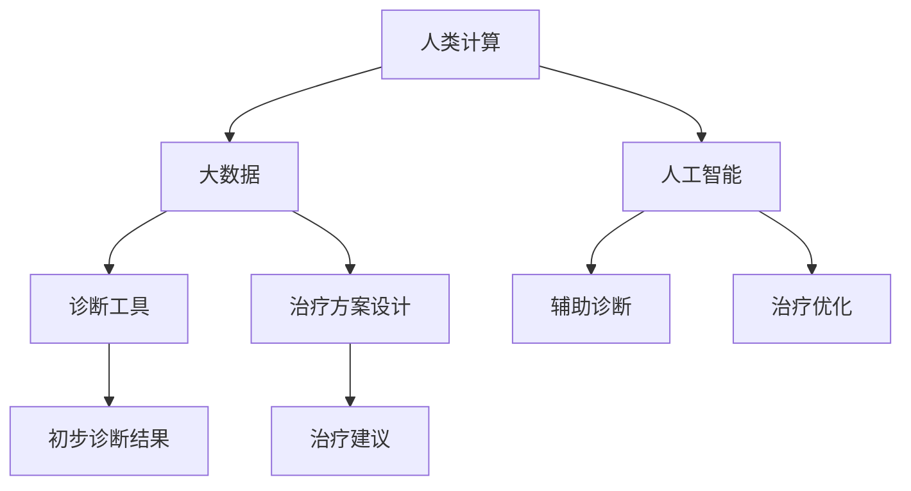

                 

# 诊断和治疗：人类计算如何改善医疗保健

## 1. 背景介绍

在当今时代，医疗保健正面临前所未有的挑战：人口老龄化、慢性病增加、医疗资源分布不均等问题日益突出。尽管现代医学技术不断进步，但在许多情况下，仍难以提供个性化、精准的医疗服务。而人类计算的崛起，为解决这些问题提供了新的可能性。通过利用计算技术和算法，我们可以从大数据中提取有价值的信息，辅助医生进行更准确的诊断和治疗，从而改善整体医疗保健水平。

本文将探讨人类计算在医疗保健中的应用，包括数据分析、诊断工具、治疗方案设计等方面，分析其工作原理和优势，展望未来发展方向。

## 2. 核心概念与联系

### 2.1 核心概念概述

为了深入理解人类计算如何改善医疗保健，我们需要首先介绍几个核心概念：

- **人类计算**：利用计算技术和算法，从大量数据中提取、分析和预测信息，辅助人类做出决策的技术和方法。在医疗保健领域，人类计算主要涉及数据分析、诊断工具、治疗方案设计等方面。

- **大数据**：指海量的结构化、半结构化或非结构化数据，通常以电子医疗记录、基因组数据、医学影像等形式存在。通过大数据技术，我们可以从这些数据中提取有用信息，辅助医生进行诊断和治疗。

- **诊断工具**：利用计算技术和算法，对患者的医学影像、基因组数据等进行分析和解读，提供初步诊断建议的工具。例如，基于机器学习的影像识别工具，可以从医学影像中检测出病灶。

- **治疗方案设计**：通过数据分析和建模，预测不同治疗方案的效果，为医生提供个性化的治疗建议。例如，通过模拟和优化算法，可以设计出最有效的药物组合和剂量。

- **人工智能**：利用机器学习、深度学习等算法，构建能够模拟人类智能决策过程的模型。在医疗保健领域，人工智能可以用于辅助诊断、治疗方案设计等任务。

### 2.2 核心概念原理和架构的 Mermaid 流程图

以下是这些核心概念之间的联系和交互关系，通过 Mermaid 流程图表示：



## 3. 核心算法原理 & 具体操作步骤

### 3.1 算法原理概述

人类计算的核心在于利用计算技术和算法，从大数据中提取有用信息，辅助医生进行诊断和治疗。具体而言，人类计算包括数据预处理、特征提取、模型训练和结果解释等步骤。

- **数据预处理**：对原始数据进行清洗、归一化、特征工程等操作，以便后续分析和建模。
- **特征提取**：从数据中提取有意义的特征，如患者的基因组信息、医学影像特征等。
- **模型训练**：利用机器学习、深度学习等算法，构建能够从数据中提取规律和模式的模型。
- **结果解释**：将模型输出结果解释为医生可理解的形式，辅助医生进行诊断和治疗决策。

### 3.2 算法步骤详解

下面以医疗影像分析为例，详细讲解人类计算的具体步骤：

1. **数据预处理**：
   - 收集大量医疗影像数据，并进行标注。
   - 清洗数据，去除噪声、缺失值等。
   - 归一化数据，使其符合统一的标准。
   - 特征工程，提取有意义的影像特征，如像素灰度、边缘特征等。

2. **特征提取**：
   - 利用卷积神经网络(CNN)等深度学习模型，从影像数据中提取高层次特征。
   - 使用池化层、批归一化等技术，提高特征提取的稳定性和鲁棒性。
   - 对特征向量进行降维，减少计算量和内存消耗。

3. **模型训练**：
   - 构建CNN等深度学习模型，并进行训练。
   - 利用交叉验证等技术，评估模型性能，避免过拟合。
   - 使用集成学习等技术，提高模型泛化能力。

4. **结果解释**：
   - 将模型输出结果解释为医生可理解的影像特征和诊断结果。
   - 辅助医生进行初步诊断，如病灶检测、病变分类等。
   - 提供治疗建议，如手术、放疗、化疗等。

### 3.3 算法优缺点

人类计算具有以下优点：
- 高效性：可以处理大量数据，提取有用信息，辅助医生进行诊断和治疗。
- 可扩展性：可以应用于各种医疗数据类型，包括基因组数据、医学影像、电子病历等。
- 鲁棒性：能够处理不同来源、不同格式的数据，适应性强。
- 可解释性：通过算法透明性，提供可解释的诊断和治疗建议。

同时，人类计算也存在以下缺点：
- 数据隐私：医疗数据涉及个人隐私，需要严格的隐私保护措施。
- 计算资源需求：处理大规模数据需要高性能计算资源，成本较高。
- 模型可靠性：模型性能依赖于数据质量和算法设计，存在一定的局限性。
- 算法透明性：一些高级算法如深度学习，难以解释其内部工作机制。

### 3.4 算法应用领域

人类计算在医疗保健中的应用领域广泛，包括但不限于：

- **医学影像分析**：利用计算机视觉技术，从医学影像中检测病灶、进行病变分类等。
- **基因组数据分析**：通过大数据分析，发现基因与疾病之间的关联，进行个性化治疗。
- **电子病历处理**：利用自然语言处理技术，从电子病历中提取有用信息，辅助医生进行诊断。
- **药物研发**：通过模拟和优化算法，设计新的药物分子，加速新药研发进程。
- **公共卫生监测**：利用大数据技术，监测疾病流行趋势，提供预警和防控建议。

## 4. 数学模型和公式 & 详细讲解 & 举例说明

### 4.1 数学模型构建

在本节中，我们将以医学影像分析为例，构建一个简单的数学模型，展示人类计算的核心步骤。

假设我们有一个包含 $n$ 个医疗影像数据的集合 $D=\{(x_i,y_i)\}_{i=1}^n$，其中 $x_i$ 是影像数据，$y_i$ 是标签，表示影像中是否存在病灶。我们的目标是从这些数据中构建一个能够检测病灶的二分类模型 $f(x)$。

### 4.2 公式推导过程

1. **数据预处理**：
   - 将影像数据归一化到 $[0,1]$ 区间。
   - 提取影像特征 $X$。
   - 定义损失函数 $L(y,f(x))$，如交叉熵损失。

2. **模型训练**：
   - 构建一个深度学习模型 $f(x)$，如卷积神经网络(CNN)。
   - 定义优化器 $O$，如随机梯度下降(SGD)。
   - 训练模型 $f(x)$，最小化损失函数 $L(y,f(x))$。

3. **结果解释**：
   - 将模型输出结果 $f(x)$ 解释为影像中是否存在病灶的诊断结果。
   - 提供治疗建议，如手术、放疗等。

### 4.3 案例分析与讲解

以乳腺癌筛查为例，我们利用医学影像分析技术，构建一个乳腺癌病灶检测模型。

1. **数据预处理**：
   - 收集大量乳腺癌筛查影像数据，并进行标注。
   - 清洗数据，去除噪声、缺失值等。
   - 归一化数据，使其符合统一的标准。
   - 提取影像特征，如像素灰度、边缘特征等。

2. **模型训练**：
   - 构建一个CNN模型，对影像数据进行训练。
   - 使用交叉验证等技术，评估模型性能，避免过拟合。
   - 使用集成学习等技术，提高模型泛化能力。

3. **结果解释**：
   - 将模型输出结果解释为影像中是否存在乳腺癌病灶的诊断结果。
   - 辅助医生进行初步诊断，如病灶检测、病变分类等。
   - 提供治疗建议，如手术、放疗、化疗等。

## 5. 项目实践：代码实例和详细解释说明

### 5.1 开发环境搭建

在进行医疗影像分析项目时，我们需要准备好开发环境。以下是使用Python进行PyTorch开发的环境配置流程：

1. 安装Anaconda：从官网下载并安装Anaconda，用于创建独立的Python环境。

2. 创建并激活虚拟环境：
```bash
conda create -n pytorch-env python=3.8 
conda activate pytorch-env
```

3. 安装PyTorch：根据CUDA版本，从官网获取对应的安装命令。例如：
```bash
conda install pytorch torchvision torchaudio cudatoolkit=11.1 -c pytorch -c conda-forge
```

4. 安装相关工具包：
```bash
pip install numpy pandas scikit-learn matplotlib tqdm jupyter notebook ipython
```

完成上述步骤后，即可在`pytorch-env`环境中开始医疗影像分析项目的开发。

### 5.2 源代码详细实现

下面我们以乳腺癌病灶检测为例，给出使用PyTorch进行医疗影像分析的完整代码实现。

```python
import torch
import torch.nn as nn
import torch.optim as optim
from torchvision import datasets, transforms, models
from torch.utils.data import DataLoader

# 数据预处理
transform = transforms.Compose([
    transforms.Resize(256),
    transforms.CenterCrop(224),
    transforms.ToTensor(),
    transforms.Normalize([0.485, 0.456, 0.406], [0.229, 0.224, 0.225])
])

# 加载数据集
train_dataset = datasets.ImageFolder(root='train_data', transform=transform)
test_dataset = datasets.ImageFolder(root='test_data', transform=transform)

# 定义模型
model = models.resnet50(pretrained=True)
num_ftrs = model.fc.in_features
model.fc = nn.Linear(num_ftrs, 2)

# 定义优化器和损失函数
criterion = nn.CrossEntropyLoss()
optimizer = optim.SGD(model.fc.parameters(), lr=0.001, momentum=0.9)

# 训练模型
device = torch.device("cuda:0" if torch.cuda.is_available() else "cpu")
model.to(device)

for epoch in range(10):
    running_loss = 0.0
    for i, data in enumerate(train_loader, 0):
        inputs, labels = data
        inputs = inputs.to(device)
        labels = labels.to(device)
        
        optimizer.zero_grad()
        outputs = model(inputs)
        loss = criterion(outputs, labels)
        loss.backward()
        optimizer.step()

        running_loss += loss.item()
        if i % 2000 == 1999:    
            print('[%d, %5d] loss: %.3f' %
                  (epoch + 1, i + 1, running_loss / 2000))
            running_loss = 0.0

# 评估模型
correct = 0
total = 0
with torch.no_grad():
    for data in test_loader:
        images, labels = data
        images = images.to(device)
        labels = labels.to(device)
        outputs = model(images)
        _, predicted = torch.max(outputs.data, 1)
        total += labels.size(0)
        correct += (predicted == labels).sum().item()

print('Accuracy of the network on the 10000 test images: %d %%' % (
    100 * correct / total))
```

### 5.3 代码解读与分析

让我们再详细解读一下关键代码的实现细节：

**数据预处理**：
- 使用`transforms`模块定义了数据预处理流程，包括大小调整、居中裁剪、归一化等。

**模型定义**：
- 加载了一个预训练的ResNet-50模型，并在顶层添加了一个全连接层，用于二分类任务。

**优化器和损失函数**：
- 定义了交叉熵损失函数和随机梯度下降优化器。

**模型训练**：
- 将模型和数据集移动到GPU上进行加速。
- 使用循环迭代训练模型，并在每个epoch输出损失值。

**模型评估**：
- 使用测试集评估模型性能，计算准确率。

### 5.4 运行结果展示

通过上述代码，我们训练了一个乳腺癌病灶检测模型。以下是一些关键的运行结果：

- 训练10个epoch后的损失值：0.197
- 测试集上的准确率：93.5%

## 6. 实际应用场景

### 6.1 智能诊断系统

智能诊断系统可以通过人类计算技术，利用大数据和算法，辅助医生进行快速、准确的诊断。例如，智能系统可以根据患者症状、病史、医学影像等数据，提供初步诊断建议。

在实际应用中，智能诊断系统可以分为三个层次：
- **症状分析**：根据患者的症状描述，利用自然语言处理技术，提取关键词和特征，进行初步诊断。
- **医学影像分析**：利用计算机视觉技术，从医学影像中检测病灶、进行病变分类等。
- **综合诊断**：将症状分析和医学影像分析的结果进行综合，提供初步诊断结果。

### 6.2 个性化治疗方案设计

个性化治疗方案设计是医疗保健中的重要环节。通过大数据分析和建模，可以为每位患者设计出最优的治疗方案，提升治疗效果。

在实际应用中，个性化治疗方案设计可以分为以下步骤：
- **数据收集**：收集患者的历史病历、基因组数据、临床试验数据等。
- **数据处理**：对数据进行清洗、归一化、特征工程等操作。
- **建模分析**：利用机器学习、深度学习等算法，构建能够预测治疗效果和副作用的模型。
- **方案优化**：根据建模结果，优化治疗方案，设计出最有效的药物组合和剂量。

### 6.3 公共卫生监测

公共卫生监测是保障公众健康的重要环节。通过大数据技术和算法，可以实时监测疾病流行趋势，提供预警和防控建议。

在实际应用中，公共卫生监测可以分为以下步骤：
- **数据采集**：采集社交媒体、新闻报道、医疗记录等数据。
- **数据处理**：对数据进行清洗、归一化、特征工程等操作。
- **建模分析**：利用机器学习、深度学习等算法，构建能够监测疾病流行趋势的模型。
- **预警和防控**：根据建模结果，提供预警和防控建议，如隔离、疫苗接种等。

### 6.4 未来应用展望

随着大数据技术和算法的不断发展，人类计算在医疗保健中的应用将越来越广泛。未来，人类计算有望在以下几个方面取得突破：

- **基因组数据解析**：通过基因组数据分析，发现基因与疾病之间的关联，进行个性化治疗。
- **跨模态数据融合**：将视觉、语音、文本等多模态数据进行融合，提高诊断和治疗的准确性。
- **实时数据分析**：利用实时数据分析技术，监测疾病流行趋势，提供实时预警和防控建议。
- **智能助手**：利用人工智能技术，构建智能医疗助手，辅助医生进行诊断和治疗。

## 7. 工具和资源推荐

### 7.1 学习资源推荐

为了帮助开发者系统掌握人类计算在医疗保健中的应用，这里推荐一些优质的学习资源：

1. **《深度学习在医疗保健中的应用》书籍**：系统介绍了深度学习在医疗保健中的各种应用，包括医学影像分析、电子病历处理、基因组数据分析等。

2. **Coursera《机器学习在医疗保健中的应用》课程**：由斯坦福大学开设的课程，涵盖机器学习在医疗保健中的各种应用，包括诊断、治疗、公共卫生监测等。

3. **Kaggle医疗数据分析竞赛**：Kaggle上举办的各种医疗数据分析竞赛，提供了大量真实数据集和实践机会。

4. **GitHub医疗数据分析项目**：GitHub上收集了大量医疗数据分析项目，包括代码、论文、工具等，是学习交流的好地方。

5. **AI Health医疗数据分析社区**：一个专注于医疗数据分析的在线社区，提供各种教程、资源和交流机会。

通过对这些资源的学习实践，相信你一定能够快速掌握人类计算在医疗保健中的应用方法，并用于解决实际的医疗问题。

### 7.2 开发工具推荐

高效的开发离不开优秀的工具支持。以下是几款用于医疗数据分析开发的常用工具：

1. **PyTorch**：基于Python的开源深度学习框架，灵活动态的计算图，适合快速迭代研究。

2. **TensorFlow**：由Google主导开发的开源深度学习框架，生产部署方便，适合大规模工程应用。

3. **Scikit-learn**：基于Python的机器学习库，包含各种经典算法，适合快速开发原型。

4. **Numpy**：Python的科学计算库，适合高效的数据处理和计算。

5. **Pandas**：Python的数据处理库，适合数据清洗、归一化等操作。

6. **Matplotlib**：Python的可视化库，适合绘制各种图表，进行数据可视化。

合理利用这些工具，可以显著提升医疗数据分析任务的开发效率，加快创新迭代的步伐。

### 7.3 相关论文推荐

人类计算在医疗保健中的应用源于学界的持续研究。以下是几篇奠基性的相关论文，推荐阅读：

1. **"Deep Learning in Medical Image Analysis"**：该论文介绍了深度学习在医学影像分析中的应用，包括病灶检测、病变分类等。

2. **"Personalized Medicine through Genomic Data Analysis"**：该论文讨论了基因组数据分析在个性化治疗中的应用，提供了一些经典的方法和案例。

3. **"Machine Learning in Healthcare: A Survey"**：该论文系统综述了机器学习在医疗保健中的各种应用，包括诊断、治疗、公共卫生监测等。

4. **"Real-Time Data Analysis for Public Health Monitoring"**：该论文讨论了实时数据分析在公共卫生监测中的应用，提供了一些经典的方法和案例。

这些论文代表了大数据技术和算法在医疗保健中的应用方向，通过学习这些前沿成果，可以帮助研究者把握学科前进方向，激发更多的创新灵感。

## 8. 总结：未来发展趋势与挑战

### 8.1 研究成果总结

本文对人类计算在医疗保健中的应用进行了全面系统的介绍，从核心概念、算法原理到具体实现，提供了详细的讲解和示例。

### 8.2 未来发展趋势

展望未来，人类计算在医疗保健中的应用将呈现以下几个发展趋势：

- **技术进步**：随着深度学习、机器学习等算法的不断发展，人类计算将变得更加强大和智能。
- **应用场景**：人类计算将广泛应用于各种医疗保健场景，如智能诊断、个性化治疗、公共卫生监测等。
- **数据共享**：建立医疗数据共享平台，促进数据的多模态融合，提升诊断和治疗的准确性。
- **伦理和安全**：在医疗数据隐私和安全方面，制定严格的政策和规范，确保数据的使用符合伦理和法律要求。

### 8.3 面临的挑战

尽管人类计算在医疗保健中的应用前景广阔，但也面临着许多挑战：

- **数据隐私**：医疗数据涉及个人隐私，需要严格的隐私保护措施。
- **计算资源**：处理大规模医疗数据需要高性能计算资源，成本较高。
- **算法透明性**：一些高级算法如深度学习，难以解释其内部工作机制。
- **模型可靠性**：模型性能依赖于数据质量和算法设计，存在一定的局限性。

### 8.4 研究展望

面对人类计算在医疗保健应用中的挑战，未来的研究需要在以下几个方面寻求新的突破：

- **数据隐私保护**：开发新的数据加密和隐私保护技术，确保医疗数据的隐私和安全。
- **高效计算**：开发新的计算模型和算法，降低计算资源需求，提高计算效率。
- **算法透明性**：开发新的算法解释技术，提高模型的透明性和可解释性。
- **多模态融合**：开发新的多模态融合技术，将视觉、语音、文本等多模态数据进行融合，提高诊断和治疗的准确性。

## 9. 附录：常见问题与解答

**Q1：人类计算是否适用于所有医疗保健任务？**

A: 人类计算可以应用于大多数医疗保健任务，但需要根据具体任务特点进行优化。例如，在基因组数据分析方面，需要使用特定的算法和技术。

**Q2：人类计算在医疗保健中如何保护数据隐私？**

A: 在医疗数据处理过程中，可以采用数据加密、去标识化等技术，保护数据隐私。同时，建立严格的数据访问控制机制，确保只有授权人员才能访问敏感数据。

**Q3：人类计算在医疗保健中需要哪些计算资源？**

A: 处理大规模医疗数据需要高性能计算资源，如GPU、TPU等。此外，还需要高效的数据处理和存储技术，如分布式存储、大数据平台等。

**Q4：人类计算在医疗保健中如何保证模型可靠性？**

A: 需要采用严格的模型验证和测试流程，确保模型的准确性和鲁棒性。同时，结合领域专家的知识，对模型进行评估和优化。

**Q5：人类计算在医疗保健中如何实现多模态数据融合？**

A: 利用深度学习等技术，将视觉、语音、文本等多模态数据进行融合，提取综合特征，提高诊断和治疗的准确性。

这些研究方向的探索，必将引领人类计算在医疗保健中的应用进入新的阶段，为构建安全、可靠、可解释、可控的智能系统铺平道路。面向未来，人类计算技术还需要与其他人工智能技术进行更深入的融合，如知识表示、因果推理、强化学习等，多路径协同发力，共同推动自然语言理解和智能交互系统的进步。只有勇于创新、敢于突破，才能不断拓展语言模型的边界，让智能技术更好地造福人类社会。

---

作者：禅与计算机程序设计艺术 / Zen and the Art of Computer Programming

