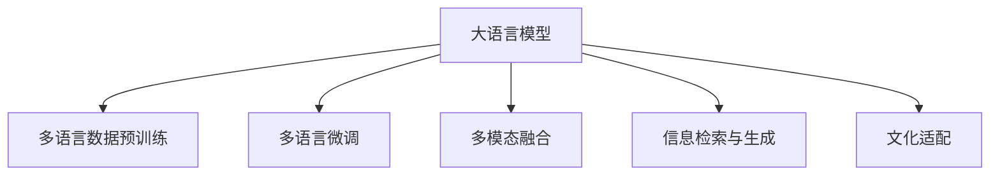

                 

# 语言多样性与 LLM：支持多语言社会

> 关键词：语言多样性, 大语言模型, 多语言社会, 自然语言处理, 多语言应用, 机器翻译, 情感分析, 多模态融合, 信息检索, 自然语言生成

## 1. 背景介绍

### 1.1 问题由来
语言是人类最重要的沟通工具之一，也是文化传承的载体。然而，世界上的语言繁多复杂，仅联合国记录在册的语言就有7000多种。随着全球化进程的推进，语言多样性带来的挑战也愈加突出。如何在多样化的语言环境中，实现高效、准确、人性化的交流，成为摆在各国面前的重要课题。

大语言模型（Large Language Models, LLMs）的兴起，为这一问题提供了新的解决方案。通过预训练和微调，大语言模型可以学习多种语言的共性知识，适应不同语言环境的需求，为构建多语言社会提供了技术基础。

### 1.2 问题核心关键点
大语言模型在处理语言多样性方面的关键点包括：
- **预训练多语言数据**：使用包含多种语言的大量文本数据进行预训练，学习语言共性知识。
- **多语言微调**：针对特定语言的微调任务，使模型适应特定语言的语法、词汇和语境。
- **多模态融合**：结合文本、语音、图像等多种形式的数据，提升模型在多语言环境中的表现。
- **信息检索与生成**：支持基于多语言的文本搜索和自动生成，提升信息获取的效率和质量。
- **文化适配**：通过多语言训练，使模型能够理解和适应不同文化背景下的语言使用习惯。

本文将从这些关键点出发，系统介绍大语言模型在处理语言多样性方面的原理、技术和应用，以及面临的挑战和未来发展方向。

## 2. 核心概念与联系

### 2.1 核心概念概述

为更好地理解大语言模型在处理语言多样性方面的核心概念，本节将介绍几个密切相关的核心概念：

- **大语言模型（LLMs）**：以自回归(如GPT)或自编码(如BERT)模型为代表的大规模预训练语言模型。通过在大规模无标签文本语料上进行预训练，学习通用的语言表示，具备强大的语言理解和生成能力。

- **多语言数据预训练（MLD）**：使用包含多种语言的文本数据进行预训练，学习多种语言的共性知识。

- **多语言微调（MLFine-tuning）**：针对特定语言的微调任务，使模型适应特定语言的语法、词汇和语境。

- **多模态融合（Multi-modal Fusion）**：结合文本、语音、图像等多种形式的数据，提升模型在多语言环境中的表现。

- **信息检索与生成（IR & IG）**：支持基于多语言的文本搜索和自动生成，提升信息获取的效率和质量。

- **文化适配（Cultural Adaptation）**：通过多语言训练，使模型能够理解和适应不同文化背景下的语言使用习惯。

这些核心概念之间的逻辑关系可以通过以下Mermaid流程图来展示：



这个流程图展示了大语言模型的核心概念及其之间的关系：

1. 大语言模型通过多语言数据预训练获得基础能力。
2. 多语言微调是对预训练模型进行任务特定的优化，适应特定语言的语法、词汇和语境。
3. 多模态融合结合多种形式的数据，提升模型在多语言环境中的表现。
4. 信息检索与生成支持基于多语言的文本搜索和自动生成，提升信息获取效率和质量。
5. 文化适配通过多语言训练，使模型能够理解和适应不同文化背景下的语言使用习惯。

这些概念共同构成了大语言模型在处理语言多样性方面的学习框架，使其能够在各种场景下发挥强大的语言理解和生成能力。

## 3. 核心算法原理 & 具体操作步骤
### 3.1 算法原理概述

大语言模型在处理语言多样性方面的核心算法，主要是通过多语言数据预训练和多语言微调来实现。其核心思想是：将预训练的大语言模型视作一个强大的"特征提取器"，通过在多语言数据上进行有监督的微调，使得模型能够适应特定语言的语法、词汇和语境，从而提升模型在多语言环境中的表现。

形式化地，假设预训练模型为 $M_{\theta}$，其中 $\theta$ 为预训练得到的模型参数。给定多语言任务 $T$ 的标注数据集 $D=\{(x_i, y_i)\}_{i=1}^N$，多语言微调的目标是找到新的模型参数 $\hat{\theta}$，使得：

$$
\hat{\theta}=\mathop{\arg\min}_{\theta} \mathcal{L}(M_{\theta},D)
$$

其中 $\mathcal{L}$ 为针对任务 $T$ 设计的损失函数，用于衡量模型预测输出与真实标签之间的差异。常见的损失函数包括交叉熵损失、均方误差损失等。

通过梯度下降等优化算法，微调过程不断更新模型参数 $\theta$，最小化损失函数 $\mathcal{L}$，使得模型输出逼近真实标签。由于 $\theta$ 已经通过多语言预训练获得了较好的初始化，因此即便在多语言数据上仅进行少量的微调，也能较快收敛到理想的模型参数 $\hat{\theta}$。

### 3.2 算法步骤详解

大语言模型在处理语言多样性方面的微调流程一般包括以下几个关键步骤：

**Step 1: 准备预训练模型和数据集**
- 选择合适的预训练语言模型 $M_{\theta}$ 作为初始化参数，如 BERT、GPT等。
- 准备多语言任务 $T$ 的标注数据集 $D$，划分为训练集、验证集和测试集。一般要求标注数据与预训练数据的分布不要差异过大。

**Step 2: 添加任务适配层**
- 根据任务类型，在预训练模型顶层设计合适的输出层和损失函数。
- 对于分类任务，通常在顶层添加线性分类器和交叉熵损失函数。
- 对于生成任务，通常使用语言模型的解码器输出概率分布，并以负对数似然为损失函数。

**Step 3: 设置微调超参数**
- 选择合适的优化算法及其参数，如 AdamW、SGD 等，设置学习率、批大小、迭代轮数等。
- 设置正则化技术及强度，包括权重衰减、Dropout、Early Stopping等。
- 确定冻结预训练参数的策略，如仅微调顶层，或全部参数都参与微调。

**Step 4: 执行梯度训练**
- 将训练集数据分批次输入模型，前向传播计算损失函数。
- 反向传播计算参数梯度，根据设定的优化算法和学习率更新模型参数。
- 周期性在验证集上评估模型性能，根据性能指标决定是否触发 Early Stopping。
- 重复上述步骤直到满足预设的迭代轮数或 Early Stopping 条件。

**Step 5: 测试和部署**
- 在测试集上评估微调后模型 $M_{\hat{\theta}}$ 的性能，对比微调前后的精度提升。
- 使用微调后的模型对新样本进行推理预测，集成到实际的应用系统中。
- 持续收集新的数据，定期重新微调模型，以适应数据分布的变化。

以上是使用多语言数据对大语言模型进行微调的一般流程。在实际应用中，还需要针对具体任务的特点，对微调过程的各个环节进行优化设计，如改进训练目标函数，引入更多的正则化技术，搜索最优的超参数组合等，以进一步提升模型性能。

### 3.3 算法优缺点

大语言模型在处理语言多样性方面的微调方法具有以下优点：
1. 多语言预训练和学习语言共性知识，显著提升模型在不同语言环境中的表现。
2. 少样本微调能够快速适应新语言，减少标注数据的需求。
3. 多模态融合提升模型在多语言环境中的表现，支持文本、语音、图像等多种形式的数据。
4. 信息检索与生成支持基于多语言的文本搜索和自动生成，提升信息获取效率和质量。
5. 文化适配使模型能够理解和适应不同文化背景下的语言使用习惯。

同时，该方法也存在一定的局限性：
1. 多语言预训练数据获取难度大，标注成本高。
2. 多语言微调效果受预训练数据质量影响较大。
3. 多模态融合数据采集复杂，处理难度大。
4. 信息检索与生成技术对文本质量要求高，对数据噪声敏感。
5. 文化适配需要大量文化相关数据，对数据多样性要求高。

尽管存在这些局限性，但就目前而言，多语言微调方法仍然是大语言模型应用的主流范式。未来相关研究的重点在于如何进一步降低多语言预训练和微调对标注数据的依赖，提高模型的跨领域迁移能力和多模态融合能力，同时兼顾可解释性和伦理安全性等因素。

### 3.4 算法应用领域

大语言模型在处理语言多样性方面的微调方法，已经在多语言社会建设中得到了广泛的应用，覆盖了从智能客服到多语言文化传承等多个领域，具体如下：

- **智能客服系统**：构建多语言智能客服系统，提升全球化客户服务体验。
- **金融翻译服务**：提供多语言金融文本翻译，支持跨国金融业务。
- **多语言文化传承**：支持多语言文化的数字化保存和传承，弘扬文化多样性。
- **多语言数据标注**：利用多语言微调技术，自动标注多语言数据，减少人工标注成本。
- **多语言情感分析**：基于多语言数据，进行情感分析，理解不同语言环境中的用户情绪。
- **多语言信息检索**：支持多语言信息检索，提高用户获取信息的效率。

除了上述这些经典应用外，大语言模型在多语言社交网络、多语言游戏、多语言旅游导览等领域，也得到了创新性地应用，为多语言社会的建设提供了新的技术路径。

## 4. 数学模型和公式 & 详细讲解  
### 4.1 数学模型构建

本节将使用数学语言对多语言数据预训练和多语言微调过程进行更加严格的刻画。

记预训练语言模型为 $M_{\theta}$，其中 $\theta$ 为预训练得到的模型参数。假设多语言任务 $T$ 的训练集为 $D=\{(x_i,y_i)\}_{i=1}^N, x_i \in \mathcal{X}, y_i \in \mathcal{Y}$。

定义模型 $M_{\theta}$ 在数据样本 $(x,y)$ 上的损失函数为 $\ell(M_{\theta}(x),y)$，则在数据集 $D$ 上的经验风险为：

$$
\mathcal{L}(\theta) = \frac{1}{N} \sum_{i=1}^N \ell(M_{\theta}(x_i),y_i)
$$

多语言微调的优化目标是最小化经验风险，即找到最优参数：

$$
\theta^* = \mathop{\arg\min}_{\theta} \mathcal{L}(\theta)
$$

在实践中，我们通常使用基于梯度的优化算法（如SGD、Adam等）来近似求解上述最优化问题。设 $\eta$ 为学习率，$\lambda$ 为正则化系数，则参数的更新公式为：

$$
\theta \leftarrow \theta - \eta \nabla_{\theta}\mathcal{L}(\theta) - \eta\lambda\theta
$$

其中 $\nabla_{\theta}\mathcal{L}(\theta)$ 为损失函数对参数 $\theta$ 的梯度，可通过反向传播算法高效计算。

### 4.2 公式推导过程

以下我们以二分类任务为例，推导交叉熵损失函数及其梯度的计算公式。

假设模型 $M_{\theta}$ 在输入 $x$ 上的输出为 $\hat{y}=M_{\theta}(x) \in [0,1]$，表示样本属于正类的概率。真实标签 $y \in \{0,1\}$。则二分类交叉熵损失函数定义为：

$$
\ell(M_{\theta}(x),y) = -[y\log \hat{y} + (1-y)\log (1-\hat{y})]
$$

将其代入经验风险公式，得：

$$
\mathcal{L}(\theta) = -\frac{1}{N}\sum_{i=1}^N [y_i\log M_{\theta}(x_i)+(1-y_i)\log(1-M_{\theta}(x_i))]
$$

根据链式法则，损失函数对参数 $\theta_k$ 的梯度为：

$$
\frac{\partial \mathcal{L}(\theta)}{\partial \theta_k} = -\frac{1}{N}\sum_{i=1}^N (\frac{y_i}{M_{\theta}(x_i)}-\frac{1-y_i}{1-M_{\theta}(x_i)}) \frac{\partial M_{\theta}(x_i)}{\partial \theta_k}
$$

其中 $\frac{\partial M_{\theta}(x_i)}{\partial \theta_k}$ 可进一步递归展开，利用自动微分技术完成计算。

在得到损失函数的梯度后，即可带入参数更新公式，完成模型的迭代优化。重复上述过程直至收敛，最终得到适应多语言任务的最优模型参数 $\theta^*$。

## 5. 项目实践：代码实例和详细解释说明
### 5.1 开发环境搭建

在进行多语言数据预训练和多语言微调实践前，我们需要准备好开发环境。以下是使用Python进行PyTorch开发的环境配置流程：

1. 安装Anaconda：从官网下载并安装Anaconda，用于创建独立的Python环境。

2. 创建并激活虚拟环境：
```bash
conda create -n pytorch-env python=3.8 
conda activate pytorch-env
```

3. 安装PyTorch：根据CUDA版本，从官网获取对应的安装命令。例如：
```bash
conda install pytorch torchvision torchaudio cudatoolkit=11.1 -c pytorch -c conda-forge
```

4. 安装Transformers库：
```bash
pip install transformers
```

5. 安装各类工具包：
```bash
pip install numpy pandas scikit-learn matplotlib tqdm jupyter notebook ipython
```

完成上述步骤后，即可在`pytorch-env`环境中开始预训练和微调实践。

### 5.2 源代码详细实现

下面我们以多语言情感分析任务为例，给出使用Transformers库对BERT模型进行多语言情感分析的PyTorch代码实现。

首先，定义情感分析任务的数据处理函数：

```python
from transformers import BertTokenizer
from torch.utils.data import Dataset
import torch

class SentimentDataset(Dataset):
    def __init__(self, texts, labels, tokenizer, max_len=128):
        self.texts = texts
        self.labels = labels
        self.tokenizer = tokenizer
        self.max_len = max_len
        
    def __len__(self):
        return len(self.texts)
    
    def __getitem__(self, item):
        text = self.texts[item]
        label = self.labels[item]
        
        encoding = self.tokenizer(text, return_tensors='pt', max_length=self.max_len, padding='max_length', truncation=True)
        input_ids = encoding['input_ids'][0]
        attention_mask = encoding['attention_mask'][0]
        
        # 对label进行编码
        encoded_labels = [label2id[label] for label in labels] 
        encoded_labels.extend([label2id['O']] * (self.max_len - len(encoded_labels)))
        labels = torch.tensor(encoded_labels, dtype=torch.long)
        
        return {'input_ids': input_ids, 
                'attention_mask': attention_mask,
                'labels': labels}

# 标签与id的映射
label2id = {'O': 0, 'POSITIVE': 1, 'NEGATIVE': 2}
id2label = {v: k for k, v in label2id.items()}

# 创建dataset
tokenizer = BertTokenizer.from_pretrained('bert-base-cased')

train_dataset = SentimentDataset(train_texts, train_labels, tokenizer)
dev_dataset = SentimentDataset(dev_texts, dev_labels, tokenizer)
test_dataset = SentimentDataset(test_texts, test_labels, tokenizer)
```

然后，定义模型和优化器：

```python
from transformers import BertForTokenClassification, AdamW

model = BertForTokenClassification.from_pretrained('bert-base-cased', num_labels=len(label2id))

optimizer = AdamW(model.parameters(), lr=2e-5)
```

接着，定义训练和评估函数：

```python
from torch.utils.data import DataLoader
from tqdm import tqdm
from sklearn.metrics import classification_report

device = torch.device('cuda') if torch.cuda.is_available() else torch.device('cpu')
model.to(device)

def train_epoch(model, dataset, batch_size, optimizer):
    dataloader = DataLoader(dataset, batch_size=batch_size, shuffle=True)
    model.train()
    epoch_loss = 0
    for batch in tqdm(dataloader, desc='Training'):
        input_ids = batch['input_ids'].to(device)
        attention_mask = batch['attention_mask'].to(device)
        labels = batch['labels'].to(device)
        model.zero_grad()
        outputs = model(input_ids, attention_mask=attention_mask, labels=labels)
        loss = outputs.loss
        epoch_loss += loss.item()
        loss.backward()
        optimizer.step()
    return epoch_loss / len(dataloader)

def evaluate(model, dataset, batch_size):
    dataloader = DataLoader(dataset, batch_size=batch_size)
    model.eval()
    preds, labels = [], []
    with torch.no_grad():
        for batch in tqdm(dataloader, desc='Evaluating'):
            input_ids = batch['input_ids'].to(device)
            attention_mask = batch['attention_mask'].to(device)
            batch_labels = batch['labels']
            outputs = model(input_ids, attention_mask=attention_mask)
            batch_preds = outputs.logits.argmax(dim=2).to('cpu').tolist()
            batch_labels = batch_labels.to('cpu').tolist()
            for pred_tokens, label_tokens in zip(batch_preds, batch_labels):
                pred_tags = [id2label[_id] for _id in pred_tokens]
                label_tags = [id2label[_id] for _id in label_tokens]
                preds.append(pred_tags[:len(label_tags)])
                labels.append(label_tags)
                
    print(classification_report(labels, preds))
```

最后，启动训练流程并在测试集上评估：

```python
epochs = 5
batch_size = 16

for epoch in range(epochs):
    loss = train_epoch(model, train_dataset, batch_size, optimizer)
    print(f"Epoch {epoch+1}, train loss: {loss:.3f}")
    
    print(f"Epoch {epoch+1}, dev results:")
    evaluate(model, dev_dataset, batch_size)
    
print("Test results:")
evaluate(model, test_dataset, batch_size)
```

以上就是使用PyTorch对BERT进行多语言情感分析任务微调的完整代码实现。可以看到，得益于Transformers库的强大封装，我们可以用相对简洁的代码完成BERT模型的加载和微调。

### 5.3 代码解读与分析

让我们再详细解读一下关键代码的实现细节：

**SentimentDataset类**：
- `__init__`方法：初始化文本、标签、分词器等关键组件。
- `__len__`方法：返回数据集的样本数量。
- `__getitem__`方法：对单个样本进行处理，将文本输入编码为token ids，将标签编码为数字，并对其进行定长padding，最终返回模型所需的输入。

**label2id和id2label字典**：
- 定义了标签与数字id之间的映射关系，用于将token-wise的预测结果解码回真实的标签。

**训练和评估函数**：
- 使用PyTorch的DataLoader对数据集进行批次化加载，供模型训练和推理使用。
- 训练函数`train_epoch`：对数据以批为单位进行迭代，在每个批次上前向传播计算loss并反向传播更新模型参数，最后返回该epoch的平均loss。
- 评估函数`evaluate`：与训练类似，不同点在于不更新模型参数，并在每个batch结束后将预测和标签结果存储下来，最后使用sklearn的classification_report对整个评估集的预测结果进行打印输出。

**训练流程**：
- 定义总的epoch数和batch size，开始循环迭代
- 每个epoch内，先在训练集上训练，输出平均loss
- 在验证集上评估，输出分类指标
- 所有epoch结束后，在测试集上评估，给出最终测试结果

可以看到，PyTorch配合Transformers库使得BERT微调的代码实现变得简洁高效。开发者可以将更多精力放在数据处理、模型改进等高层逻辑上，而不必过多关注底层的实现细节。

当然，工业级的系统实现还需考虑更多因素，如模型的保存和部署、超参数的自动搜索、更灵活的任务适配层等。但核心的微调范式基本与此类似。

## 6. 实际应用场景
### 6.1 智能客服系统

基于大语言模型多语言微调技术，可以构建多语言智能客服系统，提升全球化客户服务体验。传统客服往往需要配备大量人力，高峰期响应缓慢，且一致性和专业性难以保证。而使用多语言微调后的对话模型，可以7x24小时不间断服务，快速响应客户咨询，用自然流畅的语言解答各类常见问题。

在技术实现上，可以收集企业内部的历史客服对话记录，将问题和最佳答复构建成监督数据，在此基础上对预训练对话模型进行多语言微调。多语言微调后的对话模型能够自动理解用户意图，匹配最合适的答案模板进行回复。对于客户提出的新问题，还可以接入检索系统实时搜索相关内容，动态组织生成回答。如此构建的多语言客服系统，能大幅提升客户咨询体验和问题解决效率。

### 6.2 金融翻译服务

金融机构需要实时监测市场舆论动向，以便及时应对负面信息传播，规避金融风险。传统的人工翻译方式成本高、效率低，难以应对网络时代海量信息爆发的挑战。基于大语言模型多语言微调技术，可以提供多语言金融文本翻译，支持跨国金融业务。

具体而言，可以收集金融领域相关的新闻、报道、评论等文本数据，并对其进行主题标注和情感标注。在此基础上对预训练语言模型进行多语言微调，使其能够自动判断文本属于何种主题，情感倾向是正面、中性还是负面。将多语言微调后的模型应用到实时抓取的网络文本数据，就能够自动监测不同主题下的情感变化趋势，一旦发现负面信息激增等异常情况，系统便会自动预警，帮助金融机构快速应对潜在风险。

### 6.3 多语言文化传承

当前的文化传承往往依赖书籍、影视等传统媒介，难以全面记录和保存多样化的文化信息。基于大语言模型多语言微调技术，可以支持多语言文化的数字化保存和传承，弘扬文化多样性。

具体而言，可以收集全球各地的历史文献、艺术品、音乐、舞蹈等文化内容，用多语言微调后的模型进行自动标注和翻译。通过建立多语言的文化数据库，用户可以方便地访问和探索不同语言的文化遗产，实现跨语言的文化交流和传承。

### 6.4 未来应用展望

随着大语言模型多语言微调技术的发展，其在多语言社会建设中的作用将愈加凸显。未来，基于大语言模型的多语言微调技术将向以下几个方向发展：

1. **多语言预训练数据集的扩展**：继续扩大多语言数据集的规模，提高模型的泛化能力。同时，收集更多文化多样性的数据，确保模型在不同语言环境中的适应性。

2. **多语言微调技术的创新**：开发新的多语言微调算法，提升模型的零样本学习和少样本学习能力，减少对标注数据的需求。同时，研究参数高效的多语言微调方法，降低模型资源占用。

3. **多模态融合的突破**：结合文本、语音、图像、视频等多种形式的数据，提升模型在多语言环境中的表现。引入多模态信息，增强模型的语义理解和生成能力。

4. **信息检索与生成的优化**：优化信息检索与生成算法，提高查询的精确度和召回率，提升信息检索效率。同时，优化自动生成技术，增强内容的连贯性和自然度。

5. **文化适配的深化**：通过多语言微调，使模型更好地理解和适应不同文化背景下的语言使用习惯。研究文化适配的技术方法，增强模型输出的文化敏感性。

6. **多语言情感分析的强化**：基于多语言情感分析，理解不同语言环境中的用户情绪，提升模型的社交智能。开发情感分析技术，支持跨语言的社会交往和情感交流。

7. **多语言对话系统的构建**：构建多语言对话系统，支持多语言自然交流。结合多语言情感分析和对话生成技术，提升对话的流畅性和智能性。

总之，大语言模型多语言微调技术将在多语言社会的建设中扮演重要角色，推动多语言文化的交流和传承，提升跨语言的社会交往和信息获取效率。

## 7. 工具和资源推荐
### 7.1 学习资源推荐

为了帮助开发者系统掌握大语言模型多语言微调的理论基础和实践技巧，这里推荐一些优质的学习资源：

1. 《Transformer from scratch》系列博文：由大模型技术专家撰写，深入浅出地介绍了Transformer原理、BERT模型、多语言微调技术等前沿话题。

2. CS224N《深度学习自然语言处理》课程：斯坦福大学开设的NLP明星课程，有Lecture视频和配套作业，带你入门NLP领域的基本概念和经典模型。

3. 《Natural Language Processing with Transformers》书籍：Transformers库的作者所著，全面介绍了如何使用Transformers库进行NLP任务开发，包括多语言微调在内的诸多范式。

4. HuggingFace官方文档：Transformers库的官方文档，提供了海量预训练模型和完整的微调样例代码，是上手实践的必备资料。

5. CLUE开源项目：中文语言理解测评基准，涵盖大量不同类型的中文NLP数据集，并提供了基于多语言微调的baseline模型，助力中文NLP技术发展。

通过对这些资源的学习实践，相信你一定能够快速掌握大语言模型多语言微调的精髓，并用于解决实际的NLP问题。

### 7.2 开发工具推荐

高效的开发离不开优秀的工具支持。以下是几款用于大语言模型多语言微调开发的常用工具：

1. PyTorch：基于Python的开源深度学习框架，灵活动态的计算图，适合快速迭代研究。大部分预训练语言模型都有PyTorch版本的实现。

2. TensorFlow：由Google主导开发的开源深度学习框架，生产部署方便，适合大规模工程应用。同样有丰富的预训练语言模型资源。

3. Transformers库：HuggingFace开发的NLP工具库，集成了众多SOTA语言模型，支持PyTorch和TensorFlow，是进行多语言微调任务开发的利器。

4. Weights & Biases：模型训练的实验跟踪工具，可以记录和可视化模型训练过程中的各项指标，方便对比和调优。与主流深度学习框架无缝集成。

5. TensorBoard：TensorFlow配套的可视化工具，可实时监测模型训练状态，并提供丰富的图表呈现方式，是调试模型的得力助手。

6. Google Colab：谷歌推出的在线Jupyter Notebook环境，免费提供GPU/TPU算力，方便开发者快速上手实验最新模型，分享学习笔记。

合理利用这些工具，可以显著提升大语言模型多语言微调任务的开发效率，加快创新迭代的步伐。

### 7.3 相关论文推荐

大语言模型多语言微调技术的发展源于学界的持续研究。以下是几篇奠基性的相关论文，推荐阅读：

1. Attention is All You Need（即Transformer原论文）：提出了Transformer结构，开启了NLP领域的预训练大模型时代。

2. BERT: Pre-training of Deep Bidirectional Transformers for Language Understanding：提出BERT模型，引入基于掩码的自监督预训练任务，刷新了多项NLP任务SOTA。

3. Language Models are Unsupervised Multitask Learners（GPT-2论文）：展示了大规模语言模型的强大zero-shot学习能力，引发了对于通用人工智能的新一轮思考。

4. Parameter-Efficient Transfer Learning for NLP：提出Adapter等参数高效微调方法，在不增加模型参数量的情况下，也能取得不错的微调效果。

5. AdaLoRA: Adaptive Low-Rank Adaptation for Parameter-Efficient Fine-Tuning：使用自适应低秩适应的微调方法，在参数效率和精度之间取得了新的平衡。

6. Parameter-Efficient Multi-Task Learning with Sparse Embeddings：提出稀疏嵌入的多任务学习范式，实现参数高效的多语言微调。

这些论文代表了大语言模型多语言微调技术的发展脉络。通过学习这些前沿成果，可以帮助研究者把握学科前进方向，激发更多的创新灵感。

## 8. 总结：未来发展趋势与挑战

### 8.1 总结

本文对大语言模型多语言微调方法进行了全面系统的介绍。首先阐述了大语言模型在处理语言多样性方面的研究背景和意义，明确了多语言微调在拓展预训练模型应用、提升下游任务性能方面的独特价值。其次，从原理到实践，详细讲解了多语言预训练和多语言微调的数学原理和关键步骤，给出了多语言微调任务开发的完整代码实例。同时，本文还广泛探讨了多语言微调方法在智能客服、金融翻译、文化传承等多个行业领域的应用前景，展示了多语言微调范式的巨大潜力。

通过本文的系统梳理，可以看到，基于大语言模型的多语言微调方法正在成为NLP领域的重要范式，极大地拓展了预训练语言模型的应用边界，催生了更多的落地场景。得益于大规模语料的预训练和多语言微调，多语言模型能够快速适应不同语言环境的需求，提升了跨语言的语言理解和生成能力。未来，随着多语言微调技术的发展，大语言模型将在构建多语言社会中扮演越来越重要的角色。

### 8.2 未来发展趋势

展望未来，大语言模型多语言微调技术将呈现以下几个发展趋势：

1. **多语言预训练数据集的扩展**：继续扩大多语言数据集的规模，提高模型的泛化能力。同时，收集更多文化多样性的数据，确保模型在不同语言环境中的适应性。

2. **多语言微调技术的创新**：开发新的多语言微调算法，提升模型的零样本学习和少样本学习能力，减少对标注数据的需求。同时，研究参数高效的多语言微调方法，降低模型资源占用。

3. **多模态融合的突破**：结合文本、语音、图像、视频等多种形式的数据，提升模型在多语言环境中的表现。引入多模态信息，增强模型的语义理解和生成能力。

4. **信息检索与生成的优化**：优化信息检索与生成算法，提高查询的精确度和召回率，提升信息检索效率。同时，优化自动生成技术，增强内容的连贯性和自然度。

5. **文化适配的深化**：通过多语言微调，使模型更好地理解和适应不同文化背景下的语言使用习惯。研究文化适配的技术方法，增强模型输出的文化敏感性。

6. **多语言情感分析的强化**：基于多语言情感分析，理解不同语言环境中的用户情绪，提升模型的社交智能。开发情感分析技术，支持跨语言的社会交往和情感交流。

7. **多语言对话系统的构建**：构建多语言对话系统，支持多语言自然交流。结合多语言情感分析和对话生成技术，提升对话的流畅性和智能性。

以上趋势凸显了大语言模型多语言微调技术的广阔前景。这些方向的探索发展，必将进一步提升NLP系统的性能和应用范围，为人类认知智能的进化带来深远影响。

### 8.3 面临的挑战

尽管大语言模型多语言微调技术已经取得了瞩目成就，但在迈向更加智能化、普适化应用的过程中，它仍面临着诸多挑战：

1. **多语言预训练数据获取难度大**：获取高质量的多语言预训练数据，需要庞大的语料库和多语言标注，成本较高。如何高效地收集和标注多语言数据，将是未来需要解决的重要问题。

2. **多语言微调效果受预训练数据质量影响较大**：如果预训练数据中包含大量噪音和偏见，多语言微调的效果也会受到影响。如何筛选和清洗预训练数据，提升数据质量，将是未来的研究重点。

3. **多模态融合数据采集复杂，处理难度大**：结合多模态数据，需要采集和处理更多形式的数据，处理难度较大。如何高效地采集和融合多模态数据，提升模型的综合能力，将是重要的研究方向。

4. **信息检索与生成技术对文本质量要求高**：信息检索与生成技术对文本质量要求较高，对数据噪声敏感。如何提高文本质量，减少数据噪声的影响，将是重要的研究方向。

5. **文化适配需要大量文化相关数据**：研究文化适配技术，需要大量文化多样性的数据，对数据多样性要求较高。如何扩大数据集的规模，确保模型在不同文化环境中的适应性，将是未来的研究重点。

6. **多语言情感分析需要克服语言多样性**：不同语言环境下的情感表达方式和强度可能存在差异，如何克服语言多样性，实现跨语言的情感理解，将是重要的研究方向。

7. **多语言对话系统需要处理多语言转换**：构建多语言对话系统，需要处理多语言转换和理解，处理难度较大。如何提高多语言转换的准确性和流畅性，将是重要的研究方向。

正视多语言微调面临的这些挑战，积极应对并寻求突破，将是大语言模型多语言微调走向成熟的必由之路。相信随着学界和产业界的共同努力，这些挑战终将一一被克服，大语言模型多语言微调必将在构建安全、可靠、可解释、可控的多语言社会中发挥重要作用。

### 8.4 研究展望

面向未来，大语言模型多语言微调技术需要在以下几个方向寻求新的突破：

1. **探索无监督和半监督多语言微调方法**：摆脱对大规模标注数据的依赖，利用自监督学习、主动学习等无监督和半监督范式，最大限度利用非结构化数据，实现更加灵活高效的多语言微调。

2. **研究参数高效和计算高效的多语言微调范式**：开发更加参数高效的微调方法，在固定大部分预训练参数的同时，只更新极少量的任务相关参数。同时优化多语言微调模型的计算图，减少前向传播和反向传播的资源消耗，实现更加轻量级、实时性的部署。

3. **引入因果和对比学习范式**：通过引入因果推断和对比学习思想，增强多语言微调模型建立稳定因果关系的能力，学习更加普适、鲁棒的语言表征，从而提升模型泛化性和抗干扰能力。

4. **引入更多先验知识**：将符号化的先验知识，如知识图谱、逻辑规则等，与神经网络模型进行巧妙融合，引导多语言微调过程学习更准确、合理的语言模型。同时加强不同模态数据的整合，实现视觉、语音等多模态信息与文本信息的协同建模。

5. **结合因果分析和博弈论工具**：将因果分析方法引入多语言微调模型，识别出模型决策的关键特征，增强输出解释的因果性和逻辑性。借助博弈论工具刻画人机交互过程，主动探索并规避模型的脆弱点，提高系统稳定性。

6. **纳入伦理道德约束**：在模型训练目标中引入伦理导向的评估指标，过滤和惩罚有偏见、有害的输出倾向。同时加强人工干预和审核，建立模型行为的监管机制，确保输出符合人类价值观和伦理道德。

这些研究方向的探索，必将引领大语言模型多语言微调技术迈向更高的台阶，为构建安全、可靠、可解释、可控的多语言社会提供新的技术路径。面向未来，大语言模型多语言微调技术还需要与其他人工智能技术进行更深入的融合，如知识表示、因果推理、强化学习等，多路径协同发力，共同推动自然语言理解和智能交互系统的进步。只有勇于创新、敢于突破，才能不断拓展语言模型的边界，让智能技术更好地造福人类社会。

## 9. 附录：常见问题与解答

**Q1：多语言预训练对多语言微调有何影响？**

A: 多语言预训练是提升多语言微调效果的重要基础。通过多语言预训练，模型可以学习多种语言的共性知识，从而在多语言微调中更快速地适应新语言，提升模型的泛化能力和适应性。但多语言预训练的效果也受预训练数据质量和规模的影响，数据规模越大、质量越高，预训练效果越好。

**Q2：多语言微调中如何选择学习率？**

A: 多语言微调中的学习率通常要比预训练时小1-2个数量级，以避免破坏预训练权重。一般建议从1e-5开始调参，逐步减小学习率，直至收敛。也可以使用warmup策略，在开始阶段使用较小的学习率，再逐渐过渡到预设值。需要注意的是，不同的优化器(如AdamW、Adafactor等)以及不同的学习率调度策略，可能需要设置不同的学习率阈值。

**Q3：多语言微调中的正则化技术有哪些？**

A: 多语言微调中的正则化技术主要包括L2正则、Dropout、Early Stopping等。L2正则通过惩罚权重平方和，防止模型过拟合。Dropout随机丢弃一部分神经元，减少过拟合风险。Early Stopping在验证集上检测模型性能，一旦性能不再提升，便提前停止训练。

**Q4：多语言微调中如何处理文化适配问题？**

A: 处理文化适配问题，需要收集大量文化多样性的数据，对模型进行有针对性的微调。可以通过多语言微调，使模型学习不同文化背景下的语言使用习惯，同时引入文化知识库，进一步引导模型输出符合文化规范的语言。

**Q5：多语言微调中如何提升模型鲁棒性？**

A: 提升模型鲁棒性，可以通过对抗训练、数据增强等技术。对抗训练引入对抗样本，提高模型对输入扰动的鲁棒性。数据增强通过对训练数据进行改写、回译等方式，丰富训练集多样性，增强模型的泛化能力。

**Q6：多语言微调中如何处理零样本学习和少样本学习问题？**

A: 零样本学习和少样本学习是多语言微调的重要研究方向。可以通过精心设计输入文本的格式，引导模型按期望方式输出，减少微调参数。如Prompt Learning技术，通过设计适当的Prompt模板，在微调时无需更新模型参数，即可实现零样本或少样本学习。

**Q7：多语言微调中的多模态融合技术有哪些？**

A: 多模态融合技术主要包括文本-语音融合、文本-图像融合、语音-图像融合等。通过结合多种形式的数据，增强模型的综合能力，提升在多语言环境中的表现。多模态融合可以应用于翻译、情感分析、信息检索等任务，提高模型的智能水平。

**Q8：多语言微调中的模型压缩和稀疏化技术有哪些？**

A: 模型压缩和稀疏化技术主要包括知识蒸馏、剪枝、量化等。知识蒸馏通过教师-学生的方式，使学生模型学习教师模型的知识，减少参数量。剪枝去除模型中的冗余参数，减少计算资源消耗。量化将浮点模型转为定点模型，压缩存储空间，提高计算效率。

这些问题的解答，希望能够为你提供多语言微调方面的更多理解和实践指导。大语言模型多语言微调技术正在不断发展，未来将有更多新的研究方向和技术突破，值得我们持续关注和学习。

