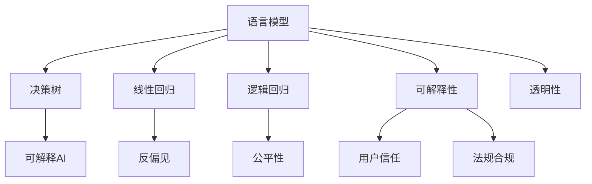

                 

# 语言模型的可解释性：揭开AI决策的黑箱

> 关键词：语言模型,可解释性,决策透明化,反偏见,可解释AI

## 1. 背景介绍

### 1.1 问题由来
随着深度学习在自然语言处理(NLP)和人工智能(AI)领域的广泛应用，语言模型已经成为了许多AI系统不可或缺的核心组件。然而，这些模型往往被视作“黑箱”，其内部的决策过程难以理解和解释，这种不透明性也引发了广泛关注和讨论。特别是在医疗、金融、司法等高风险领域，模型的可解释性变得尤为重要。为了提升模型的信任度和可靠性，亟需深入研究语言模型的可解释性。

### 1.2 问题核心关键点
语言模型的可解释性研究涉及以下几个关键点：

- **决策透明度**：确保模型决策过程公开、可追溯。
- **偏见与公平性**：识别和纠正模型中可能存在的偏见，促进决策公平。
- **可解释AI**：开发可解释的AI模型，使得结果可以以人类可理解的形式展现。
- **用户信任**：建立用户对AI系统的信任，确保其在实际应用中的有效性和安全性。
- **法规合规**：满足相关的法律法规要求，保证模型应用的安全性和合法性。

## 2. 核心概念与联系

### 2.1 核心概念概述

为更好地理解语言模型的可解释性研究，本节将介绍几个密切相关的核心概念：

- **语言模型(Language Model)**：利用统计方法或深度学习框架，预测一段文本出现的概率。如RNN、LSTM、Transformer等。
- **决策树(Decision Tree)**：基于树形结构，通过一系列特征值判断，最终决策。
- **线性回归(Linear Regression)**：利用线性方程预测数值型输出。
- **逻辑回归(Logistic Regression)**：用于分类任务，输出0-1概率分布。
- **可解释性(Explainability)**：使得模型的决策过程和结果可理解、可追溯、可解释。
- **可解释AI(Explainable AI)**：设计可解释的AI模型，如LIME、SHAP、DBN等。
- **公平性(Fairness)**：保证模型在各种人群中表现一致，避免偏见。
- **反偏见(Bias Mitigation)**：检测和纠正模型中的偏见，确保公平性。
- **透明性(Transparency)**：模型的决策和参数公开、可验证。

这些概念之间的逻辑关系可以通过以下Mermaid流程图来展示：



这个流程图展示了大语言模型的核心概念及其之间的关系：

1. 语言模型通过预训练获得语言知识。
2. 决策树、线性回归、逻辑回归等模型是具体的决策工具。
3. 可解释性旨在解释模型的决策过程和结果。
4. 可解释AI提供了多种模型解释方法。
5. 反偏见、公平性、用户信任和法规合规是确保模型公平性、可靠性的重要组成部分。
6. 透明性确保模型的参数和决策过程公开、可验证。

## 3. 核心算法原理 & 具体操作步骤
### 3.1 算法原理概述

语言模型的可解释性研究，主要是通过分析和理解模型内部的决策过程，来揭示模型的行为和性能。其核心思想是：在保证模型预测精度的同时，使其决策过程可追溯、可解释。

形式化地，假设语言模型为 $M_{\theta}$，其中 $\theta$ 为模型参数。我们希望通过一种方法，使得对任意输入 $x$，模型 $M_{\theta}$ 的输出 $y$ 可以由 $x$ 和 $\theta$ 以及解释器 $I$ 共同决定，即：

$$
y = I(M_{\theta}(x), \theta)
$$

其中 $I$ 是一个解释器函数，将模型的输出和参数映射为可解释的形式。为了简化问题，我们通常将解释器 $I$ 设计为线性映射、决策树、符号规则等形式，以实现直观、可理解的解释。

### 3.2 算法步骤详解

语言模型可解释性的研究方法一般包括以下几个关键步骤：

**Step 1: 选择解释方法**

根据具体任务和数据特点，选择合适的解释方法。如局部可解释性方法(LIME)、部分依赖图(PDP)、符号规则、模型压缩等。

**Step 2: 训练模型**

在特定任务的数据集上，训练语言模型。可以使用预训练模型进行微调，以获得更好的性能。

**Step 3: 计算解释信息**

利用选定的解释方法，计算模型输入 $x$ 对模型输出 $y$ 的解释信息。解释信息通常包括特征的重要性、模型敏感度、局部决策边界等。

**Step 4: 生成可解释报告**

将解释信息整理成直观易懂的报告，展示模型的行为特征和决策逻辑。

**Step 5: 验证和迭代**

通过验证解释报告的有效性，不断迭代优化解释方法，直至满足预设的解释质量要求。

### 3.3 算法优缺点

语言模型的可解释性研究方法具有以下优点：

1. 提高决策透明度：使得模型的决策过程公开、可追溯。
2. 增强用户信任：用户能够理解模型行为，建立信任感。
3. 促进公平性：通过解释模型行为，识别并纠正模型中的偏见。
4. 满足法规要求：确保模型决策符合法律法规要求。

同时，该方法也存在一定的局限性：

1. 解释精度有限：解释方法可能无法完全准确地描述模型行为。
2. 复杂度高：部分解释方法如符号规则、决策树等，复杂度高，难以适用于复杂模型。
3. 解释成本高：解释方法计算成本较高，可能影响模型训练效率。
4. 用户理解难度：解释信息过于复杂，用户可能难以理解。

尽管存在这些局限性，但就目前而言，语言模型的可解释性研究仍是推动AI应用普及和信任的重要方向。未来相关研究将继续聚焦于提升解释方法的精度、效率和可理解性，以实现更强的决策透明化和公平性保障。

### 3.4 算法应用领域

语言模型的可解释性研究在多个领域都有广泛应用，例如：

- **金融风控**：在信用评估、反欺诈等任务中，利用可解释模型判断贷款申请者的信用风险。
- **医疗诊断**：在医学影像分析、病理诊断等任务中，解释模型的诊断决策依据，帮助医生理解和信任AI系统。
- **司法判决**：在司法判决中，解释模型的判决依据，保证司法公正性。
- **法律咨询**：在法律咨询和合同审查等任务中，解释模型推荐的依据，增强客户信任感。
- **市场营销**：在广告推荐和客户画像分析中，解释模型的推荐理由，优化营销策略。

除了上述这些经典应用外，语言模型的可解释性研究还在更多场景中得到应用，如公共政策分析、舆情监测、智能客服等，为AI技术落地应用提供了新的方向。

## 4. 数学模型和公式 & 详细讲解 & 举例说明
### 4.1 数学模型构建

为了更精确地描述语言模型的可解释性研究，我们通过数学语言进行详细的建模和解释。

假设语言模型为 $M_{\theta}:\mathcal{X} \rightarrow \mathcal{Y}$，其中 $\mathcal{X}$ 为输入空间，$\mathcal{Y}$ 为输出空间，$\theta \in \mathbb{R}^d$ 为模型参数。设输入样本 $x$，其输出为 $y$。

定义语言模型在输入 $x$ 上的解释信息为 $E(x)$，其中 $E(x) \in [0,1]$ 表示解释信息的重要性。则语言模型的可解释性可以定义为：

$$
\text{Explainability}(M_{\theta}, x) = \max\limits_{E(x)} \text{Corr}(E(x), M_{\theta}(x))
$$

其中 $\text{Corr}$ 为解释信息 $E(x)$ 和模型输出 $M_{\theta}(x)$ 的相关系数，用于衡量解释信息的准确性和完整性。

### 4.2 公式推导过程

以下我们以局部可解释性方法LIME为例，推导解释信息的计算公式。

假设语言模型为 $M_{\theta}$，输入样本 $x$ 包含 $m$ 个特征。LIME方法通过构造一个局部线性模型 $f_{\alpha}(x)$，来近似原语言模型的输出：

$$
f_{\alpha}(x) = \sum_{i=1}^m \alpha_i \cdot x_i \cdot g(x)
$$

其中 $\alpha$ 为模型的线性系数，$g(x)$ 为输入 $x$ 的基函数。为了保证线性模型 $f_{\alpha}(x)$ 和原语言模型 $M_{\theta}(x)$ 的输出一致，我们需要求解线性系数 $\alpha$，使得 $f_{\alpha}(x)$ 与 $M_{\theta}(x)$ 在 $x$ 处无限接近。

根据泛函逼近理论，我们有：

$$
\min_{\alpha} \sum_{i=1}^m \lambda_i \cdot (M_{\theta}(x_i^*) - f_{\alpha}(x_i^*))^2
$$

其中 $x_i^*$ 为 $x$ 附近的样本，$\lambda_i$ 为样本权重。求解上述优化问题，得到线性系数 $\alpha$。

然后，我们通过 $f_{\alpha}(x)$ 计算每个特征对输出 $y$ 的贡献，即：

$$
\text{Contribution}_i = \alpha_i \cdot g(x)
$$

将特征贡献 $\text{Contribution}_i$ 标准化，得到解释信息 $E_i(x)$，表示特征 $i$ 对输出 $y$ 的重要性。

### 4.3 案例分析与讲解

以金融风控为例，解释语言模型在信用评估中的行为特征。假设模型基于历史贷款数据进行训练，输入为贷款申请者的基本信息（如年龄、收入、信用记录等），输出为贷款违约概率。

首先，我们利用LIME方法计算每个特征对模型输出的解释信息。然后，将解释信息整理成可理解的报告，展示每个特征对信用评估的贡献大小。通过分析这些解释信息，用户和监管机构可以更好地理解模型的决策依据，评估模型的公平性和可靠性。

## 5. 项目实践：代码实例和详细解释说明
### 5.1 开发环境搭建

在进行语言模型可解释性研究前，我们需要准备好开发环境。以下是使用Python进行TensorFlow开发的环境配置流程：

1. 安装Anaconda：从官网下载并安装Anaconda，用于创建独立的Python环境。

2. 创建并激活虚拟环境：
```bash
conda create -n tf-env python=3.8 
conda activate tf-env
```

3. 安装TensorFlow：根据CUDA版本，从官网获取对应的安装命令。例如：
```bash
conda install tensorflow -c conda-forge -c pytorch -c pytorch-nightly
```

4. 安装各类工具包：
```bash
pip install numpy pandas scikit-learn matplotlib tqdm jupyter notebook ipython
```

完成上述步骤后，即可在`tf-env`环境中开始项目实践。

### 5.2 源代码详细实现

下面我们以LIME方法为例，给出使用TensorFlow对语言模型进行可解释性研究代码实现。

首先，定义数据集和模型：

```python
import tensorflow as tf
from tensorflow.keras.datasets import mnist
from tensorflow.keras.models import Sequential
from tensorflow.keras.layers import Dense, Dropout
from tensorflow.keras.optimizers import Adam

(x_train, y_train), (x_test, y_test) = mnist.load_data()

# 数据预处理
x_train = x_train.reshape(-1, 28*28) / 255.0
x_test = x_test.reshape(-1, 28*28) / 255.0
x_train, x_test = x_train[:, None], x_test[:, None]

# 构建模型
model = Sequential()
model.add(Dense(128, activation='relu', input_shape=(784,)))
model.add(Dropout(0.2))
model.add(Dense(64, activation='relu'))
model.add(Dropout(0.2))
model.add(Dense(10, activation='softmax'))

model.compile(optimizer=Adam(), loss='categorical_crossentropy', metrics=['accuracy'])
```

然后，定义LIME解释器：

```python
from tensorflow.keras.wrappers.scikit_learn import KerasClassifier
from lime import lime_tabular
from lime.lime_tabular import Explainer
from sklearn.preprocessing import StandardScaler, LabelEncoder
from sklearn.model_selection import train_test_split
from sklearn.metrics import accuracy_score

# 构建模型并训练
model = KerasClassifier(build_fn=model, verbose=0)
model.fit(x_train, y_train)

# 构建LIME解释器
explainer = Explainer(model.predict_proba)
explainer.add_column(StandardScaler(), model.feature_names)

# 选择待解释的样本
x_to_explain = x_train[0]
```

接着，计算解释信息并生成报告：

```python
# 计算解释信息
exp = explainer.explain_instance(x_to_explain, model.predict_proba)
exp = exp.as_list()

# 输出解释信息
for feat in exp[1]:
    print(f"Feature: {model.feature_names[feat[0]]}, Contribution: {feat[1]}")
```

最后，对解释信息进行可视化：

```python
import matplotlib.pyplot as plt

# 可视化解释信息
plt.figure(figsize=(10, 5))
plt.barh(model.feature_names, exp[1], color='b')
plt.xlabel('Contribution')
plt.ylabel('Feature')
plt.title('LIME Explaination')
plt.show()
```

以上代码实现了利用LIME方法对线性模型进行解释性研究，输出每个特征对模型输出的贡献值，并可视化结果。

### 5.3 代码解读与分析

让我们再详细解读一下关键代码的实现细节：

**数据预处理**：
- 对输入数据进行扁平化处理，以便于模型输入。
- 对数据进行归一化处理，使得每个特征值在 [0,1] 区间内。

**模型构建**：
- 使用TensorFlow的Keras API构建简单的多层感知机模型。
- 模型包含两个全连接层，中间加入Dropout正则化，输出层为Softmax层。
- 编译模型并训练。

**LIME解释器**：
- 使用`KerasClassifier`将Keras模型转换为scikit-learn风格的模型。
- 构建LIME解释器，指定输入的基函数为特征值标准化后的形式。
- 使用`add_column`方法将模型特征和基函数映射到LIME解释器中。

**计算解释信息**：
- 使用`explain_instance`方法计算样本 `x_to_explain` 的局部线性模型。
- 解释信息 `exp` 包含每个特征对模型输出的贡献值。

**输出解释信息**：
- 遍历解释信息 `exp`，输出每个特征的贡献值。

**可视化解释信息**：
- 使用Matplotlib绘制条形图，展示每个特征的贡献值。

以上代码展示了如何使用TensorFlow和LIME方法进行可解释性研究。需要注意的是，LIME方法虽然简单易用，但只能解释单个样本的局部行为，无法对整个模型进行全局解释。对于大规模数据集和复杂模型，还需要进一步探索更高级的解释方法，如SHAP、DBN等。

## 6. 实际应用场景
### 6.1 金融风控

在金融风控领域，语言模型的可解释性研究具有重要应用。银行和金融机构可以利用可解释模型判断贷款申请者的信用风险，通过分析模型的解释信息，用户和监管机构可以更好地理解模型的决策依据，增强信任感。

具体而言，银行可以收集用户的个人信息（如年龄、收入、信用卡使用情况等），将这些信息输入到训练好的语言模型中，输出用户的信用评分和违约概率。然后，利用可解释方法LIME或SHAP，对模型的预测结果进行解释，输出每个特征对信用评分的影响大小。通过分析这些解释信息，银行可以识别出可能导致高风险的特征，优化风险控制策略，提高贷款审批的效率和公平性。

### 6.2 医疗诊断

在医疗诊断领域，语言模型的可解释性研究同样具有重要应用。医院和医生可以利用可解释模型判断患者的疾病风险，通过分析模型的解释信息，医生可以更好地理解模型的诊断依据，提高诊断的准确性和可靠性。

具体而言，医院可以收集患者的病历信息（如病史、症状、实验室检查结果等），将这些信息输入到训练好的语言模型中，输出患者的疾病风险和诊断建议。然后，利用可解释方法LIME或SHAP，对模型的预测结果进行解释，输出每个特征对疾病风险的影响大小。通过分析这些解释信息，医生可以识别出可能导致高风险的特征，优化诊疗策略，提高诊断的效率和准确性。

### 6.3 法律咨询

在法律咨询和合同审查领域，语言模型的可解释性研究也有广泛应用。律师事务所可以利用可解释模型判断案件的胜诉概率，通过分析模型的解释信息，客户可以更好地理解模型的推理依据，增强信任感。

具体而言，律师事务所可以收集案件的诉求和相关法律条文，将这些信息输入到训练好的语言模型中，输出案件的胜诉概率和胜诉理由。然后，利用可解释方法LIME或SHAP，对模型的预测结果进行解释，输出每个特征对胜诉概率的影响大小。通过分析这些解释信息，客户可以识别出可能导致胜诉或败诉的关键特征，优化诉讼策略，提高胜诉率。

### 6.4 未来应用展望

随着语言模型的可解释性研究不断发展，其在更多领域的应用前景也将不断拓展。

在智慧医疗领域，可解释性研究可以用于疾病预测、病理分析、基因诊断等任务，帮助医生和患者更好地理解模型的诊断依据，提高医疗服务的精准性和可靠性。

在智能交通领域，可解释性研究可以用于交通预测、路网优化、事故分析等任务，帮助交通管理部门更好地理解模型的决策依据，优化交通管理策略，提高交通系统的效率和安全性。

在环境保护领域，可解释性研究可以用于环境污染监测、气象预测、灾害预警等任务，帮助环境保护机构更好地理解模型的预测依据，优化环保措施，提高环境治理的效果和效率。

## 7. 工具和资源推荐
### 7.1 学习资源推荐

为了帮助开发者系统掌握语言模型可解释性的理论基础和实践技巧，这里推荐一些优质的学习资源：

1. 《可解释AI：从零开始构建》系列博文：由可解释AI领域的专家撰写，深入浅出地介绍了可解释AI的理论基础和实践方法。

2. 《深度学习理论与实践》课程：斯坦福大学开设的深度学习入门课程，涵盖深度学习的基础理论、模型选择、训练技巧等。

3. 《可解释人工智能：将AI决策过程可视化》书籍：介绍多种可解释AI的方法，并提供了大量案例，适合初学者入门。

4. TensorFlow官网：提供全面的TensorFlow文档、教程和代码示例，是学习和使用TensorFlow的重要资源。

5. LIME和SHAP的官方文档：提供详细的API文档和代码示例，帮助开发者深入理解可解释方法。

6. 《自然语言处理：从模型到应用》书籍：介绍自然语言处理的基本原理和应用实例，适合NLP领域的学习者。

通过对这些资源的学习实践，相信你一定能够快速掌握语言模型可解释性的精髓，并用于解决实际的NLP问题。

### 7.2 开发工具推荐

高效的开发离不开优秀的工具支持。以下是几款用于语言模型可解释性研究开发的常用工具：

1. TensorFlow：基于Python的开源深度学习框架，灵活动态的计算图，适合快速迭代研究。主要用于模型构建和训练。

2. Scikit-learn：基于Python的机器学习库，提供多种经典的解释方法，如LIME、SHAP、PDP等。主要用于模型解释。

3. Keras：基于TensorFlow的高级API，提供简洁易用的模型定义方式，适合快速原型开发。主要用于模型构建和训练。

4. PyTorch：基于Python的开源深度学习框架，提供丰富的API和工具，适合快速原型开发。主要用于模型构建和训练。

5. Weights & Biases：模型训练的实验跟踪工具，可以记录和可视化模型训练过程中的各项指标，方便对比和调优。

6. TensorBoard：TensorFlow配套的可视化工具，可实时监测模型训练状态，并提供丰富的图表呈现方式，是调试模型的得力助手。

合理利用这些工具，可以显著提升语言模型可解释性研究的开发效率，加快创新迭代的步伐。

### 7.3 相关论文推荐

语言模型可解释性研究的发展源于学界的持续研究。以下是几篇奠基性的相关论文，推荐阅读：

1. A Unified Approach to Interpreting Model Predictions：提出了一种统一的方法来解释深度学习模型的预测结果。

2. Explaining the Predictions of Deep Neural Networks：通过可视化模型内部的激活值，解释深度神经网络的预测过程。

3. Understanding the Difficulties of Interpreting Deep Learning：探讨了深度学习模型的可解释性面临的挑战和解决方案。

4. SHAP Values Explained：深入解释了SHAP值的计算过程和应用场景，提供了大量的案例和实例。

5. LIME for Explaining Black Box Models：介绍了LIME方法的基本原理和应用步骤，提供了一个完整的案例分析。

6. Deep Learning Explained：提供了深度学习模型的可解释性框架，包括多种解释方法和案例分析。

这些论文代表了大语言模型可解释性研究的发展脉络。通过学习这些前沿成果，可以帮助研究者把握学科前进方向，激发更多的创新灵感。

## 8. 总结：未来发展趋势与挑战
### 8.1 总结

本文对语言模型的可解释性研究进行了全面系统的介绍。首先阐述了语言模型可解释性的研究背景和意义，明确了可解释性在提升决策透明度、增强用户信任等方面的重要价值。其次，从原理到实践，详细讲解了可解释性的数学原理和关键步骤，给出了可解释性任务开发的完整代码实例。同时，本文还广泛探讨了可解释性方法在金融风控、医疗诊断、法律咨询等多个行业领域的应用前景，展示了可解释性方法的巨大潜力。此外，本文精选了可解释性技术的各类学习资源，力求为读者提供全方位的技术指引。

通过本文的系统梳理，可以看到，语言模型的可解释性研究正逐步成为AI应用普及和信任的重要方向。尽管在解释精度、效率和可理解性等方面仍面临诸多挑战，但通过不断的技术创新和工程实践，相信语言模型的可解释性必将不断提升，为构建可信、透明、高效的AI系统铺平道路。

### 8.2 未来发展趋势

展望未来，语言模型可解释性研究将呈现以下几个发展趋势：

1. 解释方法多样化。随着研究的深入，将涌现更多可解释方法，如DBN、ADA、IRDA等，以更好地应对不同场景和任务。

2. 解释精度提升。未来的研究将聚焦于提高解释方法的精度，使得解释信息更加准确、全面，增强用户信任。

3. 解释效率优化。部分解释方法计算成本较高，未来的研究将致力于优化解释方法的计算效率，降低解释成本。

4. 多模态可解释性。未来将探索跨模态数据的解释方法，实现多模态信息的协同解释，提升解释的全面性和实用性。

5. 法规合规嵌入。未来的解释方法将嵌入法规合规要求，确保解释过程符合法律规范，增强系统可信度。

6. 全流程可解释性。未来的研究将探索端到端的可解释性框架，涵盖数据预处理、模型训练、模型评估等全流程的解释方法，形成完整的解释体系。

以上趋势凸显了语言模型可解释性研究的广阔前景。这些方向的探索发展，必将进一步提升AI系统的可信度、透明度和用户接受度，推动AI技术在更多领域的应用落地。

### 8.3 面临的挑战

尽管语言模型可解释性研究已经取得了不少进展，但在迈向更加智能化、普适化应用的过程中，仍面临诸多挑战：

1. 解释精度不足：部分解释方法可能无法完全准确地描述模型行为。
2. 计算成本高：部分解释方法计算成本较高，可能影响模型训练效率。
3. 用户理解难度：解释信息过于复杂，用户可能难以理解。
4. 法规合规难度：解释方法需满足法律法规要求，确保系统合法合规。
5. 偏见纠正复杂：识别和纠正模型中的偏见需要大量的标注数据和专业知识。

尽管存在这些挑战，但通过不断优化解释方法、提升计算效率、增强用户理解、满足法规要求，未来的语言模型可解释性研究仍有望取得突破性进展。

### 8.4 研究展望

面对语言模型可解释性研究所面临的挑战，未来的研究需要在以下几个方面寻求新的突破：

1. 探索更高级的解释方法。引入符号规则、因果推断等方法，提高解释的准确性和全面性。

2. 开发跨模态解释方法。融合视觉、语音、文本等多模态信息，实现更全面的解释。

3. 引入法规约束。在解释过程中嵌入法规要求，确保系统合法合规。

4. 优化解释效率。通过模型压缩、稀疏化存储等技术，提高解释方法的计算效率。

5. 提升用户理解度。简化解释信息，引入可视化工具，帮助用户更好地理解模型行为。

6. 增强偏见纠正。利用公平性、反偏见等技术，识别和纠正模型中的偏见，确保系统公平性。

这些研究方向将推动语言模型可解释性研究的持续进步，为构建更加透明、可信的AI系统提供坚实基础。面向未来，语言模型的可解释性研究仍需与深度学习、符号推理、因果推断等技术进一步融合，以实现更强的决策透明化和公平性保障。只有勇于创新、敢于突破，才能不断拓展AI技术的应用边界，推动AI技术向更深层次、更广领域发展。

## 9. 附录：常见问题与解答

**Q1：语言模型可解释性研究是否适用于所有NLP任务？**

A: 语言模型可解释性研究在大多数NLP任务上都能取得不错的效果，特别是对于数据量较小的任务。但对于一些特定领域的任务，如医学、法律等，仅仅依靠通用语料预训练的模型可能难以很好地适应。此时需要在特定领域语料上进一步预训练，再进行可解释性研究，才能获得理想效果。

**Q2：如何选择最适合的可解释方法？**

A: 选择最适合的可解释方法需要根据具体任务和数据特点进行评估。一般情况下，LIME、SHAP、PDP等方法具有较好的通用性，适用于大多数任务。对于一些特殊的任务，如多模态数据解释，可以考虑引入符号规则、因果推断等方法。在选择可解释方法时，需要综合考虑解释精度、计算成本、用户理解度等因素。

**Q3：如何评估解释方法的解释效果？**

A: 评估解释方法的解释效果通常需要结合具体的任务和数据集进行。一般情况下，可以采用以下指标：

- 相关系数：衡量解释信息与模型输出的相关性。
- 解释贡献度：衡量每个特征对模型输出的贡献大小。
- 用户理解度：通过用户调查等方式，评估用户对解释信息的理解程度。
- 系统表现：通过模型在测试集上的表现，评估解释方法对系统性能的影响。

**Q4：如何结合法规要求进行解释？**

A: 在解释过程中引入法规约束，确保解释过程符合法律规范。具体方法包括：

- 定义法律条文：明确法律条文的解释方式和输出格式。
- 引入法律领域专家：引入法律领域专家，对解释方法进行指导和验证。
- 定期更新法律条文：定期更新法律条文，确保解释方法符合最新的法律规范。

通过以上方法，可以在确保系统合法合规的前提下，提升语言模型的可解释性。

**Q5：可解释性研究对模型性能的影响？**

A: 可解释性研究通常需要对模型进行微调和优化，可能会影响模型性能。然而，通过合理的解释方法选择和优化，可以在不显著降低模型性能的前提下，提升系统的可信度和透明性。因此，可解释性研究可以作为一种补充方法，提高系统的用户接受度和合法合规性，而不必完全取代模型性能的优化。

以上问题与解答旨在帮助开发者更好地理解语言模型可解释性研究的原理和实践方法，希望通过本文的系统梳理，开发者能够掌握相关技术，为构建可信、透明、高效的AI系统奠定坚实基础。

