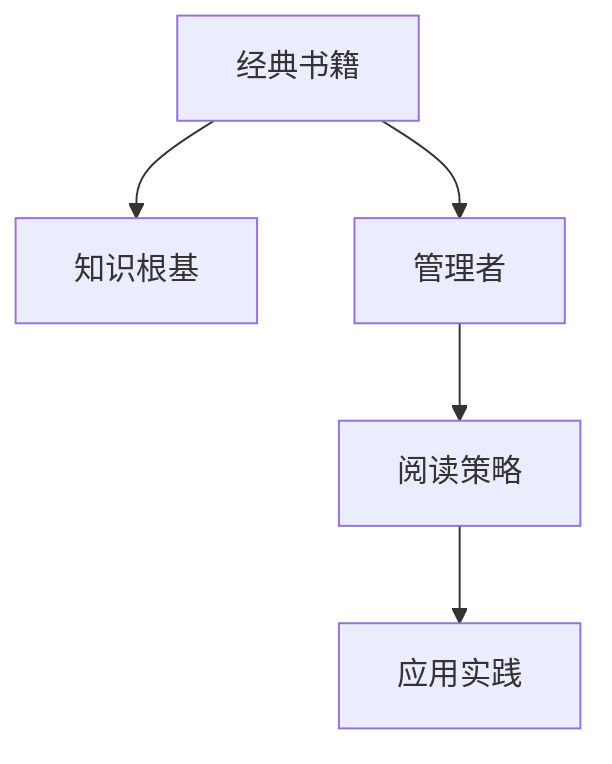

                 

# 读经典书籍:为管理者打造知识根基

## 1. 背景介绍

### 1.1 问题由来

管理者的知识根基，特别是经典书籍的阅读和理解，对于企业的战略制定、团队建设、产品创新、市场拓展等方面至关重要。然而，在信息爆炸、工作繁忙的现代社会，如何高效地读懂经典书籍、消化其中的精华，成为每位管理者必须面对的挑战。

### 1.2 问题核心关键点

经典书籍阅读的核心关键点在于选择合适的书籍、设定合适的阅读策略、结合实际工作中的问题进行理解和应用。这涉及到时间管理、心理认知、阅读技巧等多个方面，是管理者全面提升自己的重要途径。

### 1.3 问题研究意义

深入理解经典书籍，不仅有助于管理者提升个人的战略思维、领导能力和决策质量，还能为企业的发展注入持久的创新动力，打造具有核心竞争力的企业文化。

## 2. 核心概念与联系

### 2.1 核心概念概述

- **经典书籍**：指那些经过时间考验，在某一领域具有广泛影响和深远意义的著作。
- **知识根基**：指个人或组织在某一领域的基本知识体系和思想框架，是进一步学习和发展的基石。
- **管理者**：指在企业中负责规划、组织、领导和控制企业运营的管理人员。
- **阅读策略**：指为有效阅读经典书籍而设计的阅读计划和方法，如深度阅读、主题阅读、笔记整理等。
- **应用实践**：指将经典书籍中的理论、方法和案例应用于实际工作中的过程。

### 2.2 核心概念原理和架构的 Mermaid 流程图

这个流程图展示了经典书籍阅读与管理者知识构建之间的关系：

1. **经典书籍**通过阅读转化为**知识根基**。
2. **管理者**通过阅读策略学习和吸收**知识根基**。
3. **管理者**结合实际工作进行**应用实践**，从而深化理解和提升实践能力。

## 3. 核心算法原理 & 具体操作步骤

### 3.1 算法原理概述

基于经典书籍阅读的管理者知识构建过程，本质上是一个信息吸收和应用的过程。管理者通过阅读经典书籍，汲取其中的管理智慧和思维方式，并在实际工作中应用这些知识和智慧，实现自我提升和组织发展。

这一过程可以分为三个主要步骤：

1. **选择和阅读经典书籍**：挑选与个人职业发展和组织需求密切相关的经典书籍。
2. **吸收和内化知识**：通过深度阅读、笔记整理等方法，将书中的知识转化为个人的知识体系。
3. **应用和创新实践**：将内化的知识应用于实际管理工作中，结合具体问题进行创新和改进。

### 3.2 算法步骤详解

#### 3.2.1 书籍选择与预处理

管理者需要根据自身的职业发展阶段和组织需求，选择适合的经典书籍。以下是一些基本的书籍选择原则：

- **相关性**：选择与当前工作环境和目标相关的书籍，如领导力、战略规划、创新管理等。
- **时间跨度**：选择那些经过时间考验的书籍，可以保证其内容的普适性和长期价值。
- **作者权威**：选择知名作者或领域专家的著作，可以确保内容的深度和广度。

阅读前，管理者还应对书籍进行预处理：

- **获取精要**：通过摘要、序言、目录等快速了解书籍框架和核心内容。
- **确定目标**：明确阅读目的，设定期望的学习目标和应用场景。
- **制定计划**：制定详细的阅读计划，包括时间安排、阅读进度和阶段性目标。

#### 3.2.2 深度阅读与笔记整理

阅读经典书籍时，管理者应采取深度阅读的方法，系统地理解和消化书中的知识：

- **主题阅读**：围绕书籍中的核心主题进行系统学习，避免零散阅读。
- **主动思考**：在阅读过程中不断提问和思考，将作者的观点与自身经验进行对比和反思。
- **记录笔记**：通过摘要、思维导图、读书笔记等方式，将关键内容记录下来，方便后续回顾和应用。

笔记整理是深度阅读的重要组成部分，常见的笔记整理方法包括：

- **重点标注**：标记出书中重要的段落和观点，便于后续复习。
- **提炼框架**：将书中的核心观点和案例整理成框架结构，形成系统的知识体系。
- **反思记录**：记录阅读过程中的感悟和想法，反思书中的理论与现实工作中的契合点。

#### 3.2.3 应用与创新实践

将经典书籍中的知识应用于实际工作中，是知识构建的最终目的。管理者可以通过以下步骤进行应用实践：

- **问题导向**：结合实际工作中的具体问题，寻找书中的解决方案和启示。
- **案例应用**：将书中的案例和理论应用于具体情境，检验其适用性和有效性。
- **持续改进**：不断总结和反思应用效果，结合新的工作经验和市场需求进行持续改进。

### 3.3 算法优缺点

#### 3.3.1 优点

- **系统性**：经典书籍阅读提供了系统的知识框架，有助于管理者全面提升管理能力。
- **深度理解**：通过深度阅读和笔记整理，管理者可以更深入地理解书籍内容，避免浅尝辄止。
- **实践导向**：将知识应用于实际工作中，实现理论与实践的结合，提升解决实际问题的能力。

#### 3.3.2 缺点

- **时间和精力成本高**：经典书籍通常篇幅较长，阅读和理解需要投入大量时间和精力。
- **理论与实践的匹配度**：经典书籍往往具有普遍性，如何将其与具体情境相结合，需要进行一定的实践探索和调整。
- **阅读策略的灵活性**：不同的书籍和读者可能需要不同的阅读策略，如何找到最适合自己的方法，需要不断的实践和调整。

### 3.4 算法应用领域

经典书籍阅读在企业管理、市场营销、人力资源、财务管理等多个领域都有广泛的应用：

- **战略规划**：通过阅读经典战略管理书籍，管理者可以学习到战略制定和执行的方法论，提升企业的竞争力。
- **领导力提升**：阅读领导力书籍，理解领导的艺术和技巧，提升团队管理和组织变革能力。
- **创新管理**：学习创新管理理论，激发组织创新活力，推动产品和服务的持续创新。
- **财务管理**：阅读财务管理经典著作，掌握财务管理的核心原则和方法，提升企业运营效率。

## 4. 数学模型和公式 & 详细讲解 & 举例说明

### 4.1 数学模型构建

经典书籍阅读的管理者知识构建过程，可以抽象为一个数学模型。设管理者阅读的书籍数量为 $N$，每次阅读的深度为 $D$，阅读效率为 $E$，实际应用效果为 $R$。则知识构建的数学模型为：

$$
K = \sum_{i=1}^{N} D_i \times E_i \times R_i
$$

其中 $K$ 表示管理者通过阅读书籍构建的知识总量，$D_i$、$E_i$、$R_i$ 分别表示第 $i$ 本书的深度、阅读效率和应用效果。

### 4.2 公式推导过程

将经典书籍阅读和知识构建过程的各个环节进行数学抽象，可以得到以下推导：

1. **书籍选择与预处理**：设管理者从 $M$ 本书中选读了 $N$ 本书，则阅读选择的效果可以表示为 $C = \frac{N}{M}$，其中 $C$ 为选择效果，$N$ 为实际阅读本书数，$M$ 为可选书籍总数。
2. **深度阅读与笔记整理**：设每次阅读的深度为 $D$，则深度阅读的总效果为 $D \times N$。
3. **应用与创新实践**：设每次应用的效果为 $R$，则应用总效果为 $R \times N$。

将这些效果相乘，得到知识构建的最终效果：

$$
K = C \times D \times E \times R \times N
$$

### 4.3 案例分析与讲解

以彼得·德鲁克的《管理实践》为例，分析管理者如何通过阅读这本书提升管理能力：

- **书籍选择与预处理**：彼得·德鲁克的管理著作被广泛认可，管理者可以从其众多著作中选择《管理实践》进行阅读。
- **深度阅读与笔记整理**：管理者通过主题阅读，重点关注书中关于战略规划、组织管理、创新等方面的内容，并记录关键概念和案例。
- **应用与创新实践**：管理者将书中的理论和方法应用于企业战略规划、团队管理和产品创新中，结合实际工作中的问题进行改进和优化。

通过这种系统的阅读和应用过程，管理者可以全面提升管理水平，推动企业持续发展。

## 5. 项目实践：代码实例和详细解释说明

### 5.1 开发环境搭建

管理者可以通过以下步骤搭建阅读环境：

1. **获取书籍资源**：可以通过图书馆、在线电子书平台或专业书店获取经典书籍的电子版或纸质版。
2. **选择阅读工具**：使用电子阅读器、PDF阅读器或专门的学习管理工具（如Anki、Notion等）进行阅读和管理。
3. **设定阅读目标**：明确阅读目标，如学习某个管理理论、解决某个具体问题等，制定详细的阅读计划。

### 5.2 源代码详细实现

管理者可以通过编程工具记录和分析阅读过程：

1. **书籍选择与预处理**：编写脚本来获取和管理书籍资源，如将PDF文件转换为可搜索的文本格式，提取目录和摘要等。
2. **深度阅读与笔记整理**：使用Python脚本进行深度阅读，如自动提取关键段落和生成思维导图。
3. **应用与创新实践**：编写数据分析脚本，跟踪应用效果，进行持续改进。

### 5.3 代码解读与分析

管理者可以通过编程工具进行高效的阅读和应用管理：

- **数据处理**：使用Python的Pandas库进行数据清洗和处理，如提取关键词、统计阅读时长等。
- **阅读管理**：使用Anki等工具记录阅读笔记和知识点，进行系统整理。
- **应用分析**：使用Jupyter Notebook进行数据分析和可视化，跟踪应用效果，进行持续改进。

### 5.4 运行结果展示

通过编程工具，管理者可以展示阅读和应用的效果：

- **书籍目录**：展示阅读的书籍清单，包括书名、作者、阅读进度等。
- **阅读笔记**：展示阅读过程中的关键笔记和心得，方便回顾和复习。
- **应用案例**：展示应用过程中遇到的问题和解决方案，评估应用效果。

## 6. 实际应用场景

### 6.1 企业管理

经典书籍阅读在企业管理中的应用广泛，管理者可以通过阅读提升战略思维、领导能力和决策质量：

- **战略管理**：阅读经典战略管理书籍，如迈克尔·波特的《竞争战略》，理解战略规划的核心方法论，制定企业发展策略。
- **组织变革**：阅读变革管理经典著作，如约翰·科特的《领导变革》，掌握变革管理的有效方法，推动组织创新。
- **人力资源管理**：阅读人力资源管理经典著作，如《人力资源管理实务》，提升人力资源管理水平，增强组织竞争力。

### 6.2 市场营销

经典营销理论在市场营销中具有重要意义，管理者可以通过阅读提升营销策略和品牌建设能力：

- **品牌建设**：阅读品牌管理经典著作，如菲利普·科特勒的《营销管理》，理解品牌建设的核心理论和方法。
- **市场调研**：阅读市场调研经典书籍，如《市场调研方法与应用》，掌握市场调研的方法和技巧。
- **数字营销**：阅读数字营销经典著作，如《数字营销革命》，学习数字营销的新趋势和工具。

### 6.3 财务管理

经典财务管理理论在企业财务管理中具有重要价值，管理者可以通过阅读提升财务管理和风险控制能力：

- **财务管理**：阅读财务管理经典著作，如本杰明·格雷厄姆的《聪明的投资者》，掌握财务管理的核心原则和方法。
- **风险控制**：阅读风险管理经典书籍，如《风险管理》，掌握风险控制的方法和工具。
- **投资决策**：阅读投资管理经典著作，如《投资学》，提升投资决策的能力和水平。

### 6.4 未来应用展望

经典书籍阅读在未来的应用前景广阔，管理者可以通过阅读不断提升自身素质和组织能力：

1. **全球化管理**：随着全球化的发展，管理者需要具备跨文化管理的知识和技能，阅读相关经典书籍，如《全球化管理》。
2. **可持续发展**：可持续发展成为企业发展的重要方向，管理者需要掌握相关理论和方法，阅读相关经典著作，如《可持续企业》。
3. **人工智能**：人工智能在企业管理中的应用日益广泛，管理者需要掌握相关知识，阅读相关经典著作，如《人工智能管理》。

## 7. 工具和资源推荐

### 7.1 学习资源推荐

管理者可以通过以下学习资源提升自身素质和组织能力：

1. **经典书籍推荐**：《管理的实践》、《领导变革》、《营销管理》等。
2. **在线课程推荐**：Coursera、edX等平台上的经典管理课程，如《管理学》、《战略管理》等。
3. **专业组织推荐**：参加管理学会、人力资源协会等专业组织，获取最新的管理理论和实践经验。

### 7.2 开发工具推荐

管理者可以使用以下工具进行高效阅读和管理：

1. **阅读工具推荐**：Kindle、iBooks、Notion等。
2. **笔记工具推荐**：Evernote、Anki、OneNote等。
3. **数据分析工具推荐**：Excel、Tableau、Python等。

### 7.3 相关论文推荐

管理者可以通过阅读以下论文深入理解经典管理理论：

1. **经典管理理论**：《管理的实践》、《领导变革》等。
2. **现代管理理论**：《组织行为学》、《战略管理》等。
3. **未来管理趋势**：《人工智能管理》、《可持续发展管理》等。

## 8. 总结：未来发展趋势与挑战

### 8.1 研究成果总结

经典书籍阅读是管理者知识构建的重要途径，有助于提升战略思维、领导能力和决策质量。通过阅读经典书籍，管理者可以系统地吸收和管理知识，提升企业竞争力。

### 8.2 未来发展趋势

未来，经典书籍阅读将进一步数字化、智能化，管理者可以通过以下趋势提升自身素质：

1. **数字化阅读**：通过电子书籍、在线课程等形式，提高阅读效率和便捷性。
2. **智能推荐系统**：使用智能推荐系统，根据管理者的兴趣和需求推荐经典书籍，提升阅读效果。
3. **知识图谱**：构建企业知识图谱，将经典书籍中的知识进行系统化整合，提升知识应用能力。

### 8.3 面临的挑战

经典书籍阅读虽然有诸多优势，但也面临一些挑战：

1. **信息过载**：海量信息的泛滥可能导致经典书籍阅读效率降低。
2. **时间成本**：深度阅读经典书籍需要投入大量时间和精力。
3. **理论与实践的匹配度**：经典书籍通常具有普遍性，如何将其与具体情境相结合，需要进行一定的实践探索和调整。

### 8.4 研究展望

未来，经典书籍阅读的研究可以从以下方面进行：

1. **深度学习技术**：结合深度学习技术，自动化抽取和总结经典书籍中的关键信息，提升阅读效率。
2. **个性化阅读推荐**：开发个性化阅读推荐系统，根据管理者的需求和兴趣推荐经典书籍。
3. **知识图谱与知识管理**：构建企业知识图谱，将经典书籍中的知识进行系统化整合，提升知识应用能力。

## 9. 附录：常见问题与解答

**Q1：如何高效阅读经典书籍？**

A: 高效阅读经典书籍需要系统规划和策略，以下是一些基本步骤：

1. **制定阅读计划**：明确阅读目标，设定详细的时间安排和阅读进度。
2. **主题阅读**：围绕书籍中的核心主题进行系统学习，避免零散阅读。
3. **主动思考**：在阅读过程中不断提问和思考，将作者的观点与自身经验进行对比和反思。
4. **记录笔记**：通过摘要、思维导图、读书笔记等方式，将关键内容记录下来，方便后续回顾和应用。

**Q2：如何应用经典书籍中的知识？**

A: 将经典书籍中的知识应用于实际工作中，需要以下步骤：

1. **问题导向**：结合实际工作中的具体问题，寻找书中的解决方案和启示。
2. **案例应用**：将书中的案例和理论应用于具体情境，检验其适用性和有效性。
3. **持续改进**：不断总结和反思应用效果，结合新的工作经验和市场需求进行持续改进。

**Q3：如何选择适合的经典书籍？**

A: 选择适合的经典书籍需要根据个人职业发展阶段和组织需求，以下是一些基本原则：

1. **相关性**：选择与当前工作环境和目标相关的书籍，如领导力、战略规划、创新管理等。
2. **时间跨度**：选择那些经过时间考验的书籍，可以保证其内容的普适性和长期价值。
3. **作者权威**：选择知名作者或领域专家的著作，可以确保内容的深度和广度。

**Q4：如何结合实际工作进行深度阅读？**

A: 结合实际工作进行深度阅读，需要以下策略：

1. **问题导向**：将阅读目标与实际工作中的问题结合起来，寻找书中的解决方案和启示。
2. **案例应用**：将书中的案例和理论应用于具体情境，检验其适用性和有效性。
3. **持续改进**：不断总结和反思应用效果，结合新的工作经验和市场需求进行持续改进。

---

作者：禅与计算机程序设计艺术 / Zen and the Art of Computer Programming

