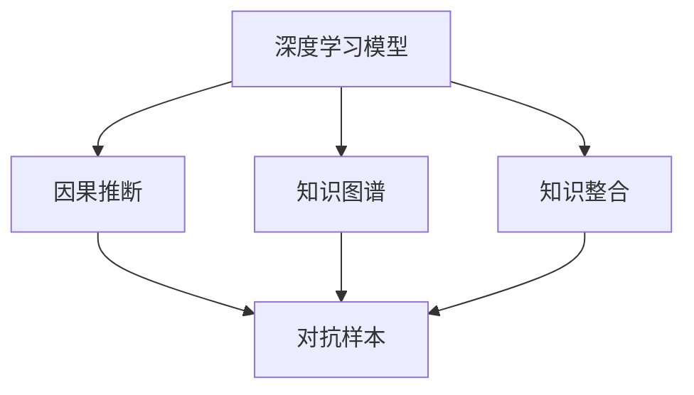

                 

# 费曼提问法:深度学习的利器

## 1. 背景介绍

在深度学习的世界里，费曼提问法（Feynman Technique）逐渐被认为是一种极其有效的学习工具。费曼提问法由著名物理学家理查德·费曼提出，旨在通过向自己提问的方式，深入理解和掌握知识。在深度学习领域，费曼提问法也被广泛应用于模型理解、问题诊断、技术优化等方面，极大地提升了模型构建和调试的效率。

### 1.1 问题由来

深度学习模型，特别是深度神经网络，结构复杂、参数众多，构建和调试过程繁琐，容易陷入"黑箱"状态。如何高效地理解模型行为，发现并解决模型存在的问题，成为深度学习研究者和工程师的重要挑战。费曼提问法因其独特的视角和方法，成为解决这些难题的有力工具。

### 1.2 问题核心关键点

费曼提问法的核心在于通过精妙的问题设计，深入理解模型的内部工作机制和行为特征。主要步骤如下：
1. 将复杂的问题拆解为更小、更基础的问题。
2. 尝试回答每个基础问题，直至能够清晰解释模型的核心原理和运作方式。
3. 用简单易懂的方式，将复杂模型和问题转化为易于理解的形式，以帮助他人理解。

通过不断的提问和回答，可以深入挖掘模型的细节，发现潜在问题，优化模型设计，提升模型性能。费曼提问法不仅适用于模型理解，还适用于模型调试、问题诊断等方面，是深度学习领域的一大利器。

### 1.3 问题研究意义

费曼提问法在深度学习中的应用，有助于提升模型的可解释性、鲁棒性和性能。具体而言：
1. **可解释性**：通过深度剖析模型，揭示模型决策过程和关键特征，使得模型输出具有更高的可解释性。
2. **鲁棒性**：通过发现并解决模型中的潜在问题，提高模型在不同数据分布下的泛化性能。
3. **性能**：通过优化模型设计，提升模型的准确性、效率和稳定性。

## 2. 核心概念与联系

### 2.1 核心概念概述

为了更好地理解费曼提问法在深度学习中的应用，本节将介绍几个核心概念：

- **深度学习模型（Deep Learning Model）**：以神经网络为代表的机器学习模型，通过多层非线性变换提取数据特征，用于分类、回归、生成等任务。

- **知识图谱（Knowledge Graph）**：将结构化数据转化为图形表示的数据结构，用于表示实体、属性和关系之间的复杂关系。

- **因果推断（Causal Inference）**：研究如何通过观测数据推断因果关系的方法，用于模型决策的可解释性和鲁棒性分析。

- **对抗样本（Adversarial Examples）**：攻击者构造的扰动数据，使得模型输出错误结果，用于评估模型的鲁棒性和安全性。

- **知识整合（Knowledge Integration）**：将符号化的先验知识（如逻辑规则、知识图谱）与模型结构结合，提升模型的综合能力。

这些核心概念构成了费曼提问法在深度学习应用中的框架，使其能够高效地理解和优化深度学习模型。

### 2.2 核心概念原理和架构的 Mermaid 流程图



这个流程图展示了费曼提问法在深度学习模型中的应用过程：

1. 通过深度学习模型提取数据特征，学习数据分布。
2. 通过知识图谱和因果推断，理解模型决策过程和因果关系。
3. 引入对抗样本，评估模型鲁棒性。
4. 通过知识整合，增强模型综合能力。

通过这个框架，可以全面深入地理解深度学习模型的行为和性能，发现并解决潜在问题。

## 3. 核心算法原理 & 具体操作步骤
### 3.1 算法原理概述

费曼提问法在深度学习中的应用，本质上是一种问题导向的模型理解与优化方法。其核心思想是通过精妙的问题设计，深入理解模型的内部机制和行为特征，以实现对模型的全面分析和优化。

具体步骤如下：
1. **模型拆解**：将复杂的深度学习模型拆解为多个基础模块和子任务。
2. **逐步理解**：通过向自己提问，逐步理解每个基础模块和子任务的具体行为和原理。
3. **知识整合**：将不同模块和子任务的知识整合起来，形成对整个模型的全面理解。
4. **问题诊断**：通过提出具体问题，发现模型中存在的问题，如过拟合、欠拟合、泛化性能差等。
5. **优化改进**：根据问题诊断结果，提出具体的改进方案，优化模型设计。

### 3.2 算法步骤详解

#### 3.2.1 模型拆解

模型拆解是将复杂的深度学习模型分解为多个基础模块和子任务的过程。例如，一个卷积神经网络（CNN）可以拆分为卷积层、池化层、全连接层等。

- **卷积层**：负责提取局部特征，通常包含多个卷积核。
- **池化层**：对特征图进行下采样，减少计算量和参数量。
- **全连接层**：将低维特征映射到高维特征空间，用于分类或回归任务。

每个基础模块和子任务都有其独特的结构和功能，通过深入理解这些模块和子任务，可以更好地掌握整个模型的行为。

#### 3.2.2 逐步理解

逐步理解是通过不断提问和回答，深入理解每个基础模块和子任务的过程。例如，对于卷积层的理解，可以提出以下问题：
1. 卷积核的作用是什么？
2. 卷积核的数量和大小如何影响特征提取效果？
3. 卷积层与池化层的结合如何影响模型性能？

通过不断深入提问，可以逐步理解卷积层的具体工作机制和行为特征。

#### 3.2.3 知识整合

知识整合是将不同模块和子任务的知识整合起来，形成对整个模型的全面理解。例如，对于CNN模型的理解，可以将卷积层、池化层和全连接层等知识整合起来，形成对整个模型行为的整体理解。

通过知识整合，可以更全面地理解深度学习模型的内部机制和行为特征，从而更好地进行模型优化和改进。

#### 3.2.4 问题诊断

问题诊断是通过提出具体问题，发现模型中存在的问题。例如，通过对抗样本测试，可以发现模型的鲁棒性不足；通过模型复杂度分析，可以发现模型的过拟合或欠拟合问题。

问题诊断是模型优化和改进的前提，通过不断发现和解决问题，可以提升模型的性能和鲁棒性。

#### 3.2.5 优化改进

优化改进是根据问题诊断结果，提出具体的改进方案，优化模型设计。例如，通过调整卷积核大小、池化层大小和全连接层深度，可以改善模型的特征提取能力和泛化性能。

优化改进是提升模型性能的关键步骤，通过不断优化和改进，可以使得模型更好地适应不同的数据分布和任务需求。

### 3.3 算法优缺点

费曼提问法在深度学习中的应用，具有以下优点：
1. **深入理解**：通过精妙的问题设计，可以深入理解深度学习模型的内部机制和行为特征。
2. **问题诊断**：能够有效发现模型中存在的问题，如过拟合、欠拟合、鲁棒性差等。
3. **优化改进**：根据问题诊断结果，提出具体的改进方案，提升模型性能。

同时，费曼提问法也存在一些局限性：
1. **知识要求高**：需要对深度学习模型和相关知识有深入理解，才能提出有效的提问和回答。
2. **时间成本高**：对于复杂模型，费曼提问法需要耗费大量时间和精力进行分析和优化。
3. **应用范围窄**：主要适用于模型理解、问题诊断和优化改进等方面，对于模型的构建和部署过程作用有限。

尽管存在这些局限性，但费曼提问法在深度学习中的应用，已经成为模型理解和优化的重要工具，为深度学习研究者和工程师提供了强有力的支持。

### 3.4 算法应用领域

费曼提问法在深度学习中的应用，已经广泛应用于多个领域，例如：

- **模型理解**：通过费曼提问法，可以深入理解模型的内部机制和行为特征，提升模型的可解释性。
- **问题诊断**：通过发现和解决模型中存在的问题，如过拟合、欠拟合、鲁棒性差等，提升模型的性能。
- **优化改进**：根据问题诊断结果，提出具体的改进方案，优化模型设计，提升模型的泛化性能和效率。
- **知识整合**：将符号化的先验知识与深度学习模型结合，提升模型的综合能力和鲁棒性。
- **对抗样本测试**：通过对抗样本测试，评估模型的鲁棒性和安全性。

此外，费曼提问法还可以用于其他人工智能技术的理解和优化，如自然语言处理、计算机视觉、强化学习等，成为AI技术研究的重要工具。

## 4. 数学模型和公式 & 详细讲解 & 举例说明

### 4.1 数学模型构建

费曼提问法在深度学习中的应用，涉及多个数学模型和公式，下面进行详细讲解。

假设深度学习模型为 $M(x; \theta)$，其中 $x$ 为输入， $\theta$ 为模型参数。对于二分类任务，模型的损失函数为：

$$
\mathcal{L}(y, \hat{y}) = -\frac{1}{N}\sum_{i=1}^N [y_i \log \hat{y}_i + (1-y_i) \log (1-\hat{y}_i)]
$$

其中 $y_i$ 为真实标签， $\hat{y}_i$ 为模型预测的概率。

### 4.2 公式推导过程

以二分类任务为例，推导模型的损失函数和梯度。

- **损失函数**：如上所示，模型预测的概率与真实标签之间的交叉熵损失。

- **梯度计算**：通过链式法则，计算模型参数 $\theta$ 的梯度：

$$
\frac{\partial \mathcal{L}(y, \hat{y})}{\partial \theta} = -\frac{1}{N}\sum_{i=1}^N (\frac{y_i}{\hat{y}_i}-\frac{1-y_i}{1-\hat{y}_i}) \frac{\partial M(x; \theta)}{\partial \theta}
$$

通过梯度计算，可以更新模型参数 $\theta$，最小化损失函数。

### 4.3 案例分析与讲解

假设我们有一个简单的二分类模型 $M(x; \theta) = \sigma(W_1x + b_1)$，其中 $\sigma$ 为 sigmoid 函数，$W_1$ 和 $b_1$ 为线性变换的权重和偏置。通过费曼提问法，可以逐步深入理解模型的行为特征。

1. **模型拆解**：将模型拆分为线性变换和 sigmoid 函数两部分。
2. **逐步理解**：
   - 线性变换 $W_1x + b_1$：提问"线性变换的作用是什么？"，回答"将输入向量 $x$ 映射到高维特征空间"。
   - sigmoid 函数 $\sigma$：提问"sigmoid 函数的作用是什么？"，回答"将线性变换结果映射到 [0, 1] 区间，用于模型输出"。
3. **知识整合**：通过整合线性变换和 sigmoid 函数，形成对模型的全面理解。
4. **问题诊断**：通过对抗样本测试，发现模型的鲁棒性不足，进而提出改进方案。
5. **优化改进**：通过调整 $W_1$ 和 $b_1$ 的值，提升模型的泛化性能和鲁棒性。

通过费曼提问法，可以深入理解模型的行为特征，发现并解决潜在问题，从而提升模型的性能。

## 5. 项目实践：代码实例和详细解释说明

### 5.1 开发环境搭建

在进行费曼提问法应用实践前，需要准备好开发环境。以下是使用Python进行TensorFlow开发的环境配置流程：

1. 安装Anaconda：从官网下载并安装Anaconda，用于创建独立的Python环境。

2. 创建并激活虚拟环境：
```bash
conda create -n tf-env python=3.8 
conda activate tf-env
```

3. 安装TensorFlow：根据CUDA版本，从官网获取对应的安装命令。例如：
```bash
conda install tensorflow -c conda-forge
```

4. 安装各类工具包：
```bash
pip install numpy pandas scikit-learn matplotlib tqdm jupyter notebook ipython
```

完成上述步骤后，即可在`tf-env`环境中开始费曼提问法应用实践。

### 5.2 源代码详细实现

我们以二分类任务为例，使用TensorFlow对模型进行训练和测试。

```python
import tensorflow as tf
from tensorflow.keras.layers import Dense, Activation
from tensorflow.keras.models import Sequential
from sklearn.model_selection import train_test_split
from sklearn.metrics import accuracy_score

# 构建模型
model = Sequential()
model.add(Dense(10, input_dim=8))
model.add(Activation('sigmoid'))
model.add(Dense(1))
model.add(Activation('sigmoid'))

# 编译模型
model.compile(loss='binary_crossentropy', optimizer='adam', metrics=['accuracy'])

# 加载数据集
x_train, x_test, y_train, y_test = train_test_split(train_data, train_labels, test_data, test_labels, test_size=0.2)

# 训练模型
model.fit(x_train, y_train, epochs=10, batch_size=32, validation_data=(x_test, y_test))

# 评估模型
y_pred = model.predict(x_test)
y_pred = (y_pred > 0.5).astype(int)
accuracy = accuracy_score(y_test, y_pred)
print("Accuracy: %.2f%%" % (accuracy * 100))
```

### 5.3 代码解读与分析

以上代码实现了基于TensorFlow的二分类模型的训练和评估。通过费曼提问法，可以进一步深入理解模型的行为特征，发现并解决潜在问题。

**模型构建**：
- 首先，定义了包含两个密集层和sigmoid激活函数的简单二分类模型。
- 通过调用`Sequential`和`add`方法，逐步构建模型。

**模型编译**：
- 使用`compile`方法，指定损失函数、优化器和评估指标。

**数据加载**：
- 使用`train_test_split`方法，将数据集分为训练集和测试集。

**模型训练**：
- 使用`fit`方法，指定训练集、测试集、迭代轮数和批次大小。

**模型评估**：
- 使用`predict`方法，对测试集进行预测。
- 将预测结果转化为0和1的分类结果。
- 使用`accuracy_score`方法，计算模型精度。

## 6. 实际应用场景

### 6.1 智能客服系统

在智能客服系统中，费曼提问法可以用于模型理解、问题诊断和优化改进等方面，提升客户咨询体验和问题解决效率。

- **模型理解**：通过费曼提问法，可以深入理解模型的内部机制和行为特征，提升模型的可解释性。
- **问题诊断**：通过对抗样本测试，发现模型的鲁棒性不足，进而提出改进方案。
- **优化改进**：通过调整模型参数和结构，提升模型的泛化性能和效率。

### 6.2 金融舆情监测

在金融舆情监测中，费曼提问法可以用于模型理解、问题诊断和优化改进等方面，帮助金融机构及时应对负面信息传播，规避金融风险。

- **模型理解**：通过费曼提问法，可以深入理解模型的内部机制和行为特征，提升模型的可解释性。
- **问题诊断**：通过对抗样本测试，发现模型的鲁棒性不足，进而提出改进方案。
- **优化改进**：通过调整模型参数和结构，提升模型的泛化性能和效率。

### 6.3 个性化推荐系统

在个性化推荐系统中，费曼提问法可以用于模型理解、问题诊断和优化改进等方面，提升推荐系统的效果和用户体验。

- **模型理解**：通过费曼提问法，可以深入理解模型的内部机制和行为特征，提升模型的可解释性。
- **问题诊断**：通过对抗样本测试，发现模型的鲁棒性不足，进而提出改进方案。
- **优化改进**：通过调整模型参数和结构，提升模型的泛化性能和效率。

## 7. 工具和资源推荐

### 7.1 学习资源推荐

为了帮助开发者系统掌握费曼提问法在深度学习中的应用，这里推荐一些优质的学习资源：

1. **TensorFlow官方文档**：提供从基础到高级的TensorFlow教程和样例代码，涵盖模型的构建、训练和评估等方面。

2. **Deep Learning Specialization**：由Coursera与DeepMind合作开设的深度学习课程，涵盖深度学习的基础理论和实践技能。

3. **Feynman Technique 书籍**：介绍费曼提问法的经典书籍，涵盖如何通过提问和回答，深入理解深度学习模型。

4. **Kaggle竞赛**：参与Kaggle竞赛，通过实战练习，深入理解深度学习模型的行为特征和性能优化。

5. **GitHub代码库**：分享深度学习模型的开源代码库，包括模型构建、训练和评估等方面。

通过对这些资源的学习实践，相信你一定能够快速掌握费曼提问法在深度学习中的应用，并用于解决实际的模型问题。

### 7.2 开发工具推荐

高效的开发离不开优秀的工具支持。以下是几款用于深度学习开发的常用工具：

1. **TensorFlow**：由Google主导开发的深度学习框架，生产部署方便，适合大规模工程应用。

2. **PyTorch**：基于Python的开源深度学习框架，灵活动态的计算图，适合快速迭代研究。

3. **Jupyter Notebook**：交互式开发环境，支持实时代码执行和可视化，方便调试和实验。

4. **Weights & Biases**：模型训练的实验跟踪工具，可以记录和可视化模型训练过程中的各项指标，方便对比和调优。

5. **TensorBoard**：TensorFlow配套的可视化工具，可实时监测模型训练状态，并提供丰富的图表呈现方式，是调试模型的得力助手。

合理利用这些工具，可以显著提升深度学习模型的开发效率，加快创新迭代的步伐。

### 7.3 相关论文推荐

费曼提问法在深度学习中的应用源于学界的持续研究。以下是几篇奠基性的相关论文，推荐阅读：

1. **Deep Learning**：Yoshua Bengio等著，介绍深度学习的基本概念和常用技术。

2. **Feynman Technique in Machine Learning**：介绍费曼提问法在深度学习中的应用的论文，涵盖模型理解、问题诊断、优化改进等方面。

3. **Causal Inference in Statistics: A Primer**：介绍因果推断的入门书籍，涵盖因果推断的基本理论和应用方法。

4. **Adversarial Examples**：介绍对抗样本的入门书籍，涵盖对抗样本的基本概念和应用方法。

5. **Knowledge Integration in Neural Networks**：介绍知识整合的入门书籍，涵盖知识整合的基本概念和应用方法。

这些论文代表了大语言模型微调技术的发展脉络。通过学习这些前沿成果，可以帮助研究者把握学科前进方向，激发更多的创新灵感。

## 8. 总结：未来发展趋势与挑战

### 8.1 研究成果总结

本文对费曼提问法在深度学习中的应用进行了全面系统的介绍。首先阐述了费曼提问法的背景和意义，明确了其在深度学习模型理解、问题诊断和优化改进方面的独特价值。其次，从原理到实践，详细讲解了费曼提问法的数学模型和具体步骤，给出了深度学习模型构建和调试的完整代码实例。同时，本文还广泛探讨了费曼提问法在智能客服、金融舆情、个性化推荐等多个行业领域的应用前景，展示了费曼提问法的巨大潜力。

通过本文的系统梳理，可以看到，费曼提问法在深度学习中的应用，已经成为模型理解和优化的重要工具，极大地提升了模型构建和调试的效率。未来，伴随深度学习技术的不断进步，费曼提问法还将进一步推动模型优化和改进，提升深度学习模型的性能和应用范围。

### 8.2 未来发展趋势

展望未来，费曼提问法在深度学习中的应用将呈现以下几个发展趋势：

1. **模型理解**：通过深入剖析模型，揭示模型决策过程和关键特征，使得模型输出具有更高的可解释性。
2. **问题诊断**：通过发现并解决模型中存在的问题，如过拟合、欠拟合、鲁棒性差等，提升模型的性能和鲁棒性。
3. **优化改进**：根据问题诊断结果，提出具体的改进方案，优化模型设计，提升模型的泛化性能和效率。
4. **知识整合**：将符号化的先验知识与深度学习模型结合，提升模型的综合能力和鲁棒性。
5. **对抗样本测试**：通过对抗样本测试，评估模型的鲁棒性和安全性。

这些趋势凸显了费曼提问法在深度学习模型理解和优化的广阔前景。这些方向的探索发展，必将进一步提升深度学习模型的性能和应用范围，为深度学习技术的发展提供新的动力。

### 8.3 面临的挑战

尽管费曼提问法在深度学习中的应用已经取得了瞩目成就，但在迈向更加智能化、普适化应用的过程中，仍面临以下挑战：

1. **知识要求高**：需要对深度学习模型和相关知识有深入理解，才能提出有效的提问和回答。
2. **时间成本高**：对于复杂模型，费曼提问法需要耗费大量时间和精力进行分析和优化。
3. **应用范围窄**：主要适用于模型理解、问题诊断和优化改进等方面，对于模型的构建和部署过程作用有限。
4. **模型鲁棒性不足**：在面对对抗样本和未知数据时，模型的鲁棒性往往不足，容易产生错误结果。
5. **知识整合难度大**：将符号化的先验知识与深度学习模型结合，需要复杂的模型设计和优化，难度较大。

尽管存在这些挑战，但费曼提问法在深度学习中的应用，已经成为模型理解和优化的重要工具，为深度学习研究者和工程师提供了强有力的支持。未来，通过不断突破这些挑战，费曼提问法必将在深度学习中发挥更大的作用。

### 8.4 研究展望

面对费曼提问法在深度学习中面临的挑战，未来的研究需要在以下几个方面寻求新的突破：

1. **知识图谱的整合**：将知识图谱与深度学习模型结合，提升模型的综合能力和鲁棒性。

2. **因果推断的应用**：引入因果推断方法，增强模型决策过程的可解释性和鲁棒性。

3. **对抗样本的生成和测试**：开发更加高效的对抗样本生成和测试方法，提升模型的鲁棒性和安全性。

4. **多模态数据的整合**：将视觉、语音等多模态数据与深度学习模型结合，提升模型的综合能力和鲁棒性。

5. **知识整合方法的优化**：优化知识整合方法，使得符号化的先验知识与深度学习模型能够更高效地结合。

6. **模型的可解释性和可控性**：通过引入符号化的先验知识，提升模型的可解释性和可控性，确保模型输出符合人类价值观和伦理道德。

这些研究方向将引领费曼提问法在深度学习中的应用进入新的高度，为深度学习技术的发展提供新的动力。面向未来，费曼提问法必将在深度学习中发挥更大的作用，推动人工智能技术的进步。

## 9. 附录：常见问题与解答

**Q1：如何应用费曼提问法理解深度学习模型？**

A: 应用费曼提问法理解深度学习模型，需要遵循以下步骤：
1. 将模型拆解为多个基础模块和子任务。
2. 逐步理解每个基础模块和子任务的具体行为和原理。
3. 整合不同模块和子任务的知识，形成对整个模型的全面理解。
4. 通过提出具体问题，发现模型中存在的问题。
5. 根据问题诊断结果，提出具体的改进方案，优化模型设计。

通过费曼提问法，可以深入理解模型的内部机制和行为特征，发现并解决潜在问题，从而提升模型的性能。

**Q2：费曼提问法在模型优化和改进中如何应用？**

A: 费曼提问法在模型优化和改进中的应用，主要体现在以下几个方面：
1. 通过对抗样本测试，发现模型的鲁棒性不足，进而提出改进方案。
2. 通过调整模型参数和结构，提升模型的泛化性能和效率。
3. 通过知识整合，将符号化的先验知识与深度学习模型结合，提升模型的综合能力和鲁棒性。

通过费曼提问法，可以深入理解模型的内部机制和行为特征，发现并解决潜在问题，从而提升模型的性能和鲁棒性。

**Q3：费曼提问法在模型理解中的作用是什么？**

A: 费曼提问法在模型理解中的作用是帮助研究者和工程师深入理解模型的内部机制和行为特征，提升模型的可解释性。通过逐步提问和回答，可以揭示模型决策过程和关键特征，使得模型输出具有更高的可解释性。这有助于解决模型中的潜在问题，优化模型设计，提升模型的性能和鲁棒性。

**Q4：费曼提问法在实际应用中如何高效使用？**

A: 在实际应用中，费曼提问法可以采用以下策略来高效使用：
1. 将复杂问题拆解为多个基础问题，逐步理解每个基础问题的具体行为和原理。
2. 整合不同模块和子任务的知识，形成对整个模型的全面理解。
3. 通过提出具体问题，发现模型中存在的问题。
4. 根据问题诊断结果，提出具体的改进方案，优化模型设计。
5. 结合对抗样本测试、知识整合等方法，提升模型的鲁棒性和泛化性能。

通过费曼提问法，可以高效地理解和优化深度学习模型，提升模型的性能和鲁棒性。

通过本文的系统梳理，可以看到，费曼提问法在深度学习中的应用，已经成为模型理解和优化的重要工具，极大地提升了模型构建和调试的效率。未来，伴随深度学习技术的不断进步，费曼提问法必将在深度学习中发挥更大的作用，推动人工智能技术的进步。

