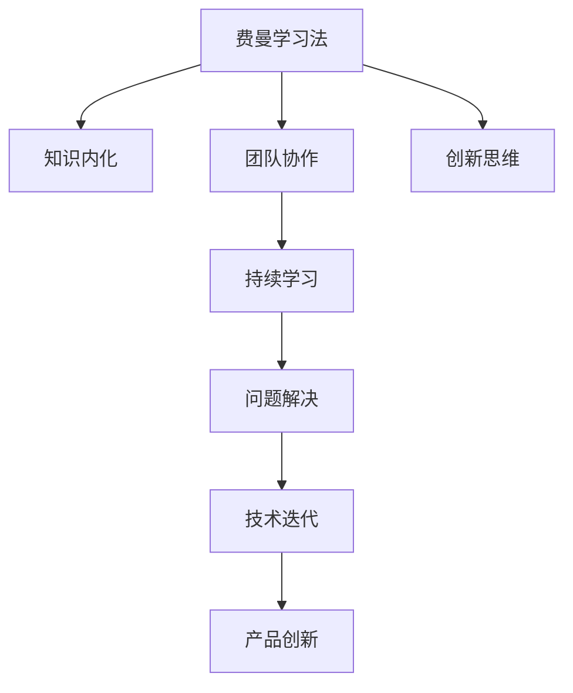

                 

# 费曼提问法促进团队学习与成长

> 关键词：费曼学习法, 知识内化, 团队协作, 创新思维, 工程实践, 自我迭代

## 1. 背景介绍

### 1.1 问题由来

随着科技的快速发展，人工智能(AI)、大数据、云计算等技术已经成为推动社会进步的重要力量。这些技术不仅要求开发者具备广泛的知识储备和深入的专业技能，还强调团队协作、持续学习和快速迭代的能力。在这种背景下，传统的单打独斗学习模式已无法满足需求，团队合作、知识共享、高效沟通成为发展的趋势。费曼学习法作为一套系统化的知识内化与传递方法，被广泛应用于科研、教育等领域，并逐渐渗透到工程实践和技术开发中。

### 1.2 问题核心关键点

费曼学习法是一种以简化、明晰、连贯、深刻和创造性为目标的知识传递方法，通过提问、回答、教授他人等方式促进知识的内化和创新。费曼学习法的核心在于：

- **简化与明晰**：将复杂的知识简化为易懂的、连贯的知识单元，确保学习者能够理解并掌握核心概念。
- **连贯与深刻**：通过连贯的知识框架和深层次的理解，帮助学习者构建牢固的知识体系。
- **创造性与实践**：鼓励学习者将所学知识应用于实际问题中，培养创造性思维和解决实际问题的能力。

费曼学习法强调通过教学相长，既巩固了知识，又提升了教与学的质量，特别适合团队学习和知识共享的环境。

### 1.3 问题研究意义

在工程开发中，团队成员之间的知识共享与交流尤为重要。费曼学习法能够促进团队成员之间的有效沟通，加速知识传递，提升团队整体的学习效率和创新能力。费曼学习法的应用，可以显著增强团队的学习能力，激发成员的创新思维，推动技术的快速迭代与实践，从而提升产品的质量与竞争力。

## 2. 核心概念与联系

### 2.1 核心概念概述

为了更好地理解费曼学习法的应用，本文将介绍几个密切相关的核心概念：

- **费曼学习法**：一种以教学为导向的知识传递方法，通过提出问题、回答问题和教授他人来巩固和深化知识。
- **知识内化**：将外界的信息转化为内在的理解和能力，即从“知其然”到“知其所以然”的过程。
- **团队协作**：多个个体协同工作，共同完成项目目标的过程，强调沟通、信任和互助。
- **持续学习**：在不断变化的环境中，持续更新知识，适应新技术和变化趋势的能力。
- **创新思维**：一种超越常规、追求新奇和独特的思维模式，推动技术与产品的发展。

这些核心概念之间的逻辑关系可以通过以下Mermaid流程图来展示：



这个流程图展示了一些核心概念之间的关联：

1. 费曼学习法通过提问和教学来促进知识内化。
2. 团队协作利用费曼学习法进行高效的知识共享。
3. 持续学习依赖费曼学习法的知识传递和更新机制。
4. 创新思维通过费曼学习法的知识探索和应用提升。
5. 问题解决和产品创新得益于费曼学习法的知识深化和应用。

## 3. 核心算法原理 & 具体操作步骤

### 3.1 算法原理概述

费曼学习法的基本原理是通过简化和明晰知识，通过提问、回答和教授他人来促进知识的内化和创新。其主要步骤包括：

1. **选择知识主题**：确定需要学习的知识点或技能。
2. **提出问题**：围绕知识点提出尽可能多的问题，这些问题应能够激发深入思考。
3. **回答并验证**：针对问题进行解答，并验证答案的正确性。
4. **简化知识**：将知识简化为易于理解的形式，例如通过比喻、类比等。
5. **教授他人**：尝试向他人教授所学知识，通过互动加深理解。

### 3.2 算法步骤详解

具体实施费曼学习法时，可以按照以下步骤进行：

**Step 1: 确定学习目标**

明确需要学习的知识领域或技能。例如，技术栈的新工具、算法的新理解等。

**Step 2: 列出问题清单**

围绕学习目标，列出一系列问题。这些问题应涵盖基础知识、应用场景、可能的问题和挑战等。

**Step 3: 寻找答案**

利用在线资源、书籍、文献等渠道寻找答案。遇到复杂问题时，可以寻求团队成员的帮助或讨论。

**Step 4: 简化知识**

将学习到的知识通过类比、比喻等形式进行简化，以便他人理解。例如，用生活中的常见事物来类比复杂的算法。

**Step 5: 教授他人**

尝试向团队成员、同事或朋友教授所学知识。通过讲解、演示或示例等方式，加深自己的理解和记忆。

**Step 6: 反思与迭代**

在教学过程中，如果发现问题或疑惑，及时反思并寻找新的答案。通过反复迭代，巩固所学知识。

### 3.3 算法优缺点

费曼学习法的优点包括：

- **高效性**：通过提问和教学，快速掌握知识点。
- **灵活性**：适用于各种知识领域和技能，不受学科限制。
- **互动性**：通过与他人互动，提升学习效率和深度。
- **创新性**：通过不断提问和回答，激发创新思维。

然而，费曼学习法也存在一定的局限性：

- **时间成本**：提问和回答过程需要投入较多时间。
- **深度有限**：对于复杂的知识点，可能难以深入探讨。
- **依赖资源**：需要丰富的资源支持，包括资料、工具等。

尽管存在这些局限性，但费曼学习法在团队学习和知识共享中仍然具有重要价值，是提升团队学习效率和创新能力的有力工具。

### 3.4 算法应用领域

费曼学习法在多个领域中得到了广泛应用，包括但不限于：

- **科研领域**：帮助研究人员通过提出和回答科学问题，深化对知识的理解。
- **教育领域**：通过教学和互动，提升学生的理解和应用能力。
- **工程开发**：促进团队成员之间的知识共享和技术迭代。
- **管理领域**：通过问题分析和解决方案讨论，提升团队决策和执行能力。
- **产品开发**：通过用户需求和反馈的深入分析，推动产品创新和改进。

## 4. 数学模型和公式 & 详细讲解 & 举例说明

### 4.1 数学模型构建

费曼学习法的数学模型主要围绕知识的传递和内化过程构建。假设知识量为 $K$，学习目标为 $T$，问题数量为 $P$，学习效率为 $L$。知识传递和内化的数学模型可以表示为：

$$
K_{内化} = L(K_{传递}) = L(T, P, K_{传递})
$$

其中，$K_{内化}$ 表示内化后的知识量，$L$ 表示学习效率函数，$K_{传递}$ 表示通过问题 $P$ 传递的知识量。

### 4.2 公式推导过程

为了推导出学习效率函数 $L$，假设每个问题的回答时间为 $t_i$，问题 $P$ 的平均回答时间为 $T_{回答}$，则学习效率 $L$ 可以表示为：

$$
L = \frac{1}{P} \sum_{i=1}^P \frac{1}{t_i}
$$

进一步假设每个问题的回答时间 $t_i$ 由多个子问题 $P_i$ 构成，即 $t_i = \sum_{j=1}^{P_i} t_{ij}$，则有：

$$
L = \frac{1}{P} \sum_{i=1}^P \frac{1}{\sum_{j=1}^{P_i} t_{ij}}
$$

### 4.3 案例分析与讲解

以团队开发一个新功能为例：

1. **学习目标**：掌握某个新框架的使用。
2. **问题清单**：如何安装框架、常见错误处理、性能优化等。
3. **寻找答案**：通过文档、社区讨论等途径回答每个问题。
4. **简化知识**：将安装步骤简化为“三步装载”，将常见错误简化为“五条原则”。
5. **教授他人**：通过编写简报、进行演示等方式向团队成员介绍所学内容。
6. **反思与迭代**：在教授过程中发现问题，如安装步骤中的“陷阱点”，再次查阅资料并调整简化步骤。

通过以上步骤，团队成员不仅掌握了新框架的使用，还通过教学加深了理解，提升了整体的学习效率和创新能力。

## 5. 项目实践：代码实例和详细解释说明

### 5.1 开发环境搭建

为了更好地实施费曼学习法，我们需要一个结构化的开发环境，以下是一个基于GitHub的开发环境搭建示例：

1. **创建GitHub仓库**：
   ```bash
   git clone https://github.com/团队名称/知识内化项目.git
   cd 知识内化项目
   ```

2. **安装GitHub工具**：如GitHub Desktop或Git CLI，用于协作和版本控制。

3. **配置CI/CD**：利用如GitHub Actions或Jenkins等工具，自动化构建和测试过程。

### 5.2 源代码详细实现

以下是使用Python实现费曼学习法的示例代码：

```python
import random
import time

class费曼学习法:
    def __init__(self, 知识点, 问题数量):
        self.知识点 = 知识点
        self.问题数量 = 问题数量
        self.答案列表 = []

    def 提出问题(self):
        问题列表 = []
        for i in range(self.问题数量):
            问题列表.append("如何" + self.知识点 + "？")
        return 问题列表

    def 寻找答案(self):
        答案列表 = []
        for 问题 in self.问题列表:
            答案 = 查找答案(问题)
            答案列表.append(答案)
        return 答案列表

    def 简化知识(self, 答案):
        简化知识 = 答案 + "，三步装载"
        return 简化知识

    def 教授他人(self, 简化知识):
        # 使用Zoom、Teams等工具进行教学
        print(简化知识)

    def 反思与迭代(self, 问题, 答案, 简化知识):
        # 记录反思内容
        print("问题：", 问题)
        print("答案：", 答案)
        print("简化知识：", 简化知识)
        # 判断是否需要再次寻找答案
        需要迭代 = 答案 == 错误答案
        if 需要迭代:
            print("需要再次寻找答案")
            time.sleep(5)
            self.寻找答案()
        else:
            print("不需要迭代")

    def 运行费曼学习法(self):
        问题列表 = self.提出问题()
        答案列表 = self.寻找答案()
        简化知识 = []
        for 答案 in 答案列表:
            简化知识.append(self.简化知识(答案))
        for 简化知识 in 简化知识:
            self.教授他人(简化知识)
            self.反思与迭代()

def 查找答案(问题):
    # 通过互联网搜索、书籍查找等方式
    return 答案

# 实例化费曼学习法对象
f = 费曼学习法("安装新框架", 5)

# 运行费曼学习法
f.运行费曼学习法()
```

### 5.3 代码解读与分析

上述代码展示了费曼学习法的基本实现流程，主要包括：

- **提出问题**：根据知识点列出问题清单。
- **寻找答案**：通过搜索、阅读等方式查找每个问题的答案。
- **简化知识**：将答案简化为易于理解的形式。
- **教授他人**：通过演示、讲解等方式向他人传授知识。
- **反思与迭代**：在教学过程中发现问题，重新查找答案并简化知识。

通过这些步骤，费曼学习法的核心思想被转化为具体的代码实现，方便开发者在实际项目中应用。

### 5.4 运行结果展示

通过运行上述代码，我们可以看到费曼学习法的具体应用过程。例如，对于“如何安装新框架”这一知识点，系统可以列出5个相关问题，逐一查找并简化答案，最终向团队成员进行教学。通过这样的过程，团队成员不仅掌握了新框架的安装步骤，还通过教授他人和反思迭代，加深了对知识的理解和应用。

## 6. 实际应用场景

### 6.1 软件开发

在软件开发中，费曼学习法可以应用于多个环节，如新技术学习、算法研究、架构设计等。例如，一个团队正在研究使用机器学习进行图像识别，可以通过费曼学习法逐步掌握相关知识，从理解模型原理到实现算法应用，再到优化模型性能，形成完整的知识体系。

### 6.2 数据科学

数据科学领域涉及大量数据处理、模型训练和分析任务，费曼学习法可以帮助数据科学家深入理解数据特性、算法原理和应用场景。例如，在准备参加Kaggle竞赛时，可以通过费曼学习法快速掌握相关数据集的特点和常用的机器学习算法，从而提高竞赛成绩。

### 6.3 产品设计与用户体验

产品设计和用户体验是推动产品成功的关键因素，费曼学习法可以帮助团队更好地理解用户需求和行为，进行有效的设计创新。例如，一个团队正在设计一款社交应用，可以通过费曼学习法了解用户的常见需求和使用习惯，从而优化产品功能，提升用户体验。

### 6.4 未来应用展望

随着技术的不断进步，费曼学习法将在更多领域得到应用，成为提升团队学习效率和创新能力的重要工具。未来，费曼学习法可能会与AI、大数据、物联网等新兴技术结合，形成更智能、更高效的学习和知识传递方法。

## 7. 工具和资源推荐

### 7.1 学习资源推荐

为了帮助开发者系统掌握费曼学习法，这里推荐一些优质的学习资源：

1. **《费曼学习法》书籍**：经典之作，详细介绍了费曼学习法的理论基础和实践方法。
2. **Coursera费曼学习法课程**：提供系统的学习路径和实用案例，适合初学者。
3. **Medium博客**：费曼学习法的应用实例和成功案例，深入浅出。
4. **GitHub项目**：众多开源项目使用费曼学习法进行知识内化和团队协作。

### 7.2 开发工具推荐

为了更好地实施费曼学习法，推荐以下开发工具：

1. **GitHub**：版本控制和协作工具，支持团队的知识管理和代码共享。
2. **Google Docs/Notion**：协作文档和知识库，方便团队成员记录和共享知识。
3. **Zoom/Teams**：在线会议和视频会议工具，支持远程教学和互动。
4. **Kaggle**：数据科学竞赛平台，提供大量实际问题和数据集，锻炼团队的学习能力。

### 7.3 相关论文推荐

费曼学习法作为一项重要的学习方法，近年来也引起了学术界的广泛关注。以下是几篇重要的相关论文，推荐阅读：

1. **费曼学习法的心理学基础**：探讨费曼学习法的心理机制，理解其背后的认知原理。
2. **费曼学习法在科学研究中的应用**：介绍费曼学习法在科学研究中的实际案例，展示其效果。
3. **费曼学习法与现代教育**：讨论费曼学习法在现代教育中的应用，提升学生学习效果。

## 8. 总结：未来发展趋势与挑战

### 8.1 总结

本文对费曼学习法的应用进行了系统介绍，包括其基本原理、操作步骤和具体实施方法。费曼学习法通过提出问题、回答问题和教授他人，促进了知识的深化和内化，提升了团队的学习效率和创新能力。费曼学习法在软件开发、数据科学、产品设计等多个领域得到了广泛应用，成为推动技术发展和产品创新的重要工具。

### 8.2 未来发展趋势

费曼学习法的未来发展趋势包括：

1. **智能化**：结合人工智能技术，自动化生成问题和答案，提升学习效率。
2. **数据化**：利用大数据分析学习过程，优化知识内化路径和教学方法。
3. **社交化**：通过社交网络平台，实现知识共享和协作，扩展学习范围。
4. **本地化**：根据不同文化背景和语言习惯，定制化学习内容和方法。

这些趋势将推动费曼学习法不断创新和发展，成为更具普适性和可扩展性的学习工具。

### 8.3 面临的挑战

尽管费曼学习法在多个领域中得到了广泛应用，但其在实际应用中也面临一些挑战：

1. **知识碎片化**：问题过多可能导致知识碎片化，难以形成系统的知识体系。
2. **时间成本高**：回答和简化问题需要投入较多时间，可能影响日常工作。
3. **知识迁移困难**：不同领域的知识结构差异较大，难以直接迁移。
4. **依赖工具**：需要借助多种工具进行知识管理、协作和教学，工具的复杂性可能影响使用体验。

### 8.4 研究展望

面对费曼学习法面临的挑战，未来的研究方向包括：

1. **知识结构优化**：设计高效的问题列表，避免知识碎片化，形成系统的知识体系。
2. **自动化工具开发**：开发智能化、易用的学习工具，减少手工操作的时间成本。
3. **知识迁移机制**：建立知识迁移机制，使不同领域的知识能够相互借鉴和转化。
4. **工具集成优化**：优化工具集成和界面设计，提升使用体验和协作效率。

这些研究方向将推动费曼学习法不断完善和发展，更好地服务于团队学习和知识共享。

## 9. 附录：常见问题与解答

**Q1：如何确定费曼学习法的问题清单？**

A: 确定问题清单的关键在于对知识点的深入理解。可以通过查阅文献、与专家讨论、参与培训等方式获取相关知识，然后根据知识点的复杂度和应用场景，列出一系列具体的问题。

**Q2：费曼学习法需要投入多少时间？**

A: 费曼学习法的时间投入取决于学习目标的复杂度和问题数量。通常，复杂的问题需要更多的时间进行深入研究和验证。在实践中，可以根据团队的实际需求和工作节奏，灵活安排学习时间。

**Q3：如何评估费曼学习法的效果？**

A: 评估费曼学习法的效果可以从多个方面进行，如知识掌握程度、团队协作效率、问题解决能力等。可以通过问卷调查、绩效评估、产品反馈等方式，综合评估学习效果。

**Q4：费曼学习法是否适用于所有团队？**

A: 费曼学习法适用于各种类型的团队，无论其规模、领域或职能。但需要注意的是，费曼学习法的效果取决于团队成员的合作意愿和学习动机，需要团队的积极配合和支持。

**Q5：如何结合其他学习方法和技术？**

A: 费曼学习法可以与其他学习方法和技术结合使用，如在线课程、视频教程、实践项目等。通过多种学习方式的综合应用，可以形成更加全面和深入的知识体系。

---

作者：禅与计算机程序设计艺术 / Zen and the Art of Computer Programming

