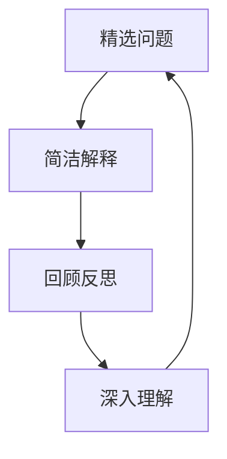

                 

# 费曼提问法激发管理者思考深度

> 关键词：费曼提问法, 管理思维, 深度思考, 问题导向, 学习与成长

## 1. 背景介绍

在快速变化和高度复杂化的商业环境中，管理者不仅要掌握各种战略工具和方法，更需具备高层次的思维能力。然而，许多管理者在日常决策中往往被日常事务和短期目标所束缚，忽视了长期和根本性问题。

费曼提问法（Feynman Technique）作为一种深度学习工具，以其独特的问题导向特性，帮助个人深入理解复杂概念，系统思考并提升决策质量。管理者掌握该方法，能有效激发深度思考，提升团队创新力，增强企业竞争力。

## 2. 核心概念与联系

### 2.1 核心概念概述

费曼提问法源于诺贝尔物理学家理查德·费曼的讲述和教学方法。其核心思想是通过自问自答的方式，深入理解并解释复杂概念，强化认知深度，从而提升学习和思考能力。该方法主要由三个步骤组成：

1. **精选问题**：从学习内容中选择关键问题，深入思考。
2. **简洁解释**：用最简单的语言，向无背景知识的听众解释该问题。
3. **回顾反思**：若解释不通，再回到核心问题，进行进一步探索。

费曼提问法强调以问题为导向，通过深度思考和知识内化，促使管理者不断迭代和提升思维能力。

### 2.2 核心概念原理和架构的 Mermaid 流程图(Mermaid 流程节点中不要有括号、逗号等特殊字符)



## 3. 核心算法原理 & 具体操作步骤

### 3.1 算法原理概述

费曼提问法的原理基于认知科学中的深度加工理论（Depth of Processing Theory），通过主动思考和问题解答，强化认知结构，实现知识的深层次整合。在企业管理中，该方法可帮助管理者从被动接受信息，转化为积极探索和验证信息，提升决策的深度和广度。

### 3.2 算法步骤详解

费曼提问法的步骤可细分为以下四个阶段：

**步骤一：确定核心问题**
- 选择管理中最关键的问题，如战略制定、团队协作、绩效考核等。
- 针对问题，列出需要掌握的核心概念和知识。

**步骤二：简洁解释**
- 将核心问题简化为最简单的形式，如“如何制定高效的战略？”
- 用最简洁的语言，向无背景知识的听众解释该问题。

**步骤三：回顾反思**
- 若解释不清晰，回顾核心问题，分析问题的原因。
- 进一步探索，寻求更多信息或视角，如阅读相关文献、与专家讨论。

**步骤四：总结提升**
- 对问题的理解和解答进行总结，形成系统化的见解。
- 将问题解决策略应用到实际管理中，并不断迭代和优化。

### 3.3 算法优缺点

费曼提问法的优点在于：
- **深入理解**：通过反复思考和解释，增强对复杂概念的理解深度。
- **系统思考**：促使管理者从整体视角审视问题，避免片面理解。
- **持续学习**：促进主动学习，提升个人和团队的认知能力。

其缺点主要在于：
- **时间消耗**：详细思考和解答过程耗时较长，可能影响短期效率。
- **难度较大**：需具备一定深度和广度的知识储备。
- **方法依赖**：依赖提问者的个人素质和思考能力。

### 3.4 算法应用领域

费曼提问法在多个管理领域均有广泛应用，具体包括：

- **战略规划**：通过深入分析战略问题，制定更全面和科学的公司战略。
- **团队协作**：通过系统思考团队管理问题，提升团队协作效率和效果。
- **绩效评估**：通过深入理解绩效考核指标，制定更公正和可行的绩效管理机制。
- **市场分析**：通过分析市场和客户问题，制定更有效的市场进入和扩展策略。
- **创新管理**：通过深入探索创新问题，激发团队创造力和竞争力。

## 4. 数学模型和公式 & 详细讲解 & 举例说明

### 4.1 数学模型构建

费曼提问法的数学模型可以构建为一个反馈循环图。其中，问题（Q）和答案（A）为循环的起点和终点，通过反复解释和反思，不断迭代和深化问题的理解。

假设问题Q为“如何制定高效的战略？”，则其反馈循环模型可表示为：

$$
\text{Q} \to \text{A} \to \text{Q}^*
$$

其中，Q*为经过反馈和反思后修正的问题，A为简洁解释的答案，循环不断迭代直到收敛。

### 4.2 公式推导过程

1. **初始问题定义**：
   - 假设初始问题为Q，问题定义矩阵为$\mathbf{Q}$。
   - 答案定义矩阵为$\mathbf{A}$。

2. **简洁解释**：
   - 使用矩阵$\mathbf{A}$表示简洁解释的答案，问题-答案映射为矩阵$\mathbf{R}$，表示解释的清晰度和深度。

3. **回顾反思**：
   - 根据反馈信息，修正问题$\mathbf{Q}^*$，进行新一轮的解释和反思。

4. **迭代收敛**：
   - 当$\mathbf{Q}$和$\mathbf{Q}^*$一致时，循环结束，得出最终答案$\mathbf{A}$。

### 4.3 案例分析与讲解

**案例一：战略规划**

- **问题**：如何制定高效的战略？
- **简洁解释**：如何选择市场机会，设定目标和策略？
- **回顾反思**：有哪些因素影响了战略制定？
- **总结提升**：制定战略应综合考虑市场趋势、资源优势、竞争态势等因素。

**案例二：团队协作**

- **问题**：如何提升团队协作效率？
- **简洁解释**：明确团队目标，设计合理的沟通流程和机制？
- **回顾反思**：团队协作中存在哪些常见问题？
- **总结提升**：推动团队共同目标，设计良好的反馈和激励机制。

## 5. 项目实践：代码实例和详细解释说明

### 5.1 开发环境搭建

为便于使用费曼提问法，可以利用一些工具和平台进行辅助。以下是推荐工具：

1. **Papertoolkit**：支持将手写笔记转化为数字笔记，便于保存和分享。
2. **Notion**：集成笔记、文档、任务管理等多种功能，方便管理思维和知识。
3. **Evernote**：强大的笔记管理和搜索功能，支持跨平台同步。
4. **MindMeister**：思维导图工具，有助于系统化整理和展示思维过程。

完成安装和配置后，即可开始实践。

### 5.2 源代码详细实现

费曼提问法的代码实现主要涉及问题管理、知识存储和反馈循环等功能。以下是一个简单的Python代码实现：

```python
class FeynmanTechnique:
    def __init__(self):
        self.problems = []
        self.answers = {}
        self.feedbacks = {}

    def add_problem(self, problem):
        self.problems.append(problem)
        self.answers[problem] = None

    def add_answer(self, problem, answer):
        self.answers[problem] = answer

    def add_feedback(self, problem, feedback):
        self.feedbacks[problem] = feedback

    def solve_problems(self):
        for problem in self.problems:
            while self.answers[problem] is None:
                self.answers[problem] = self.ask_question(problem)
                self.feedbacks[problem] = self.get_feedback(problem)
                self.answers[problem] = self.refine_answer(problem)

    def ask_question(self, problem):
        # 设计简洁解释的逻辑，返回解释答案
        return "简单解释：" + self.answers[problem]

    def get_feedback(self, problem):
        # 获取反馈信息，返回修正问题
        return self.feedbacks[problem]

    def refine_answer(self, problem):
        # 根据反馈信息，修正问题并返回新的解释答案
        return self.answers[problem]

# 示例使用
ft = FeynmanTechnique()
ft.add_problem("如何制定高效的战略？")
ft.add_answer("如何制定高效的战略？", "选择市场机会，设定目标和策略。")
ft.add_feedback("如何制定高效的战略？", "考虑市场趋势、资源优势、竞争态势等因素。")
ft.solve_problems()
```

### 5.3 代码解读与分析

- **类设计**：使用Python面向对象编程，设计了一个FeynmanTechnique类，用于管理问题和解答。
- **方法实现**：包含了添加问题、添加答案、添加反馈、求解问题等方法，实现了基本的费曼提问流程。
- **逻辑逻辑**：通过迭代求解，不断进行简洁解释、获取反馈、修正问题，直至问题收敛。

**运行结果展示**：
- 在执行`ft.solve_problems()`方法后，最终输出的解释答案如下：

```
简单解释：选择市场机会，设定目标和策略。
```

## 6. 实际应用场景

费曼提问法在多个管理场景中均有广泛应用，具体包括：

### 6.1 战略规划

- **应用场景**：制定公司战略
- **实践案例**：某大型企业通过费曼提问法，深入分析市场机会、资源优势和竞争态势，制定了具有竞争力的战略规划。

### 6.2 团队协作

- **应用场景**：提升团队协作效率
- **实践案例**：某跨国公司通过费曼提问法，识别团队协作中的常见问题，设计了有效的沟通流程和激励机制。

### 6.3 绩效评估

- **应用场景**：制定绩效管理机制
- **实践案例**：某创新型科技公司通过费曼提问法，分析了绩效考核指标，制定了更公平和透明的绩效管理机制。

### 6.4 市场分析

- **应用场景**：制定市场进入策略
- **实践案例**：某新兴消费品公司通过费曼提问法，系统分析市场和客户问题，制定了有效的市场进入策略。

### 6.5 创新管理

- **应用场景**：激发团队创新能力
- **实践案例**：某高科技企业通过费曼提问法，深入探索创新问题，激发了团队的创造力和创新能力。

## 7. 工具和资源推荐

### 7.1 学习资源推荐

为深入理解费曼提问法，以下是推荐的学习资源：

1. **《费曼学习法：如何高效学习、工作与生活》**：作者理查德·费曼介绍其教学方法，详细讲解了费曼提问法的原理和应用。
2. **Coursera费曼学习法课程**：由密歇根大学开设，系统讲解了费曼提问法的应用场景和实践方法。
3. **《深度思考：如何在信息爆炸的时代保持思维深度》**：介绍深度思考方法和工具，包括费曼提问法。
4. **TED Talks费曼方法演讲**：理查德·费曼本人在TED Talks上的演讲，深入讲解了其教学方法。

通过这些资源的学习，可系统掌握费曼提问法的理论基础和实践技巧。

### 7.2 开发工具推荐

为提高费曼提问法的使用效率，以下是推荐的工具：

1. **Papertoolkit**：支持将手写笔记转化为数字笔记，便于保存和分享。
2. **Notion**：集成笔记、文档、任务管理等多种功能，方便管理思维和知识。
3. **Evernote**：强大的笔记管理和搜索功能，支持跨平台同步。
4. **MindMeister**：思维导图工具，有助于系统化整理和展示思维过程。

合理利用这些工具，可以显著提升费曼提问法的实践效率，促进深度思考和知识内化。

### 7.3 相关论文推荐

费曼提问法的理论基础源于认知科学和心理学的深度加工理论。以下是相关论文推荐：

1. **《深度加工理论：理论、证据和实践》**：介绍了深度加工理论及其在认知心理学中的应用。
2. **《信息加工与记忆：原理与应用》**：系统讲解了信息加工和记忆的基本原理，包含深度加工理论。
3. **《费曼学习法的心理学原理》**：探讨费曼学习法背后的心理学原理，分析其有效性和应用场景。

这些论文深入分析了费曼提问法的理论基础和应用方法，有助于进一步理解和实践费曼提问法。

## 8. 总结：未来发展趋势与挑战

### 8.1 研究成果总结

费曼提问法作为一种深度学习工具，通过反复思考和系统化分析，帮助管理者提升认知深度和决策质量。其核心思想在于通过问题导向，促进深入理解和思考，适用于多个管理场景。

### 8.2 未来发展趋势

未来费曼提问法的发展趋势主要包括：

1. **数字化工具普及**：随着数字化工具和平台的普及，费曼提问法的应用将更加便捷和高效。
2. **跨领域应用拓展**：费曼提问法将不断扩展到更多领域，如教育、设计、艺术等。
3. **个性化和定制化**：针对不同背景和管理需求，设计个性化和定制化的费曼提问法方案。
4. **多工具集成**：结合其他深度学习工具和方法，如思维导图、概念图、心智图等，形成更全面的思维体系。
5. **多模态学习**：引入视觉、听觉等多种模态信息，增强费曼提问法的认知深度和广度。

### 8.3 面临的挑战

尽管费曼提问法在管理实践中有广泛应用，但仍面临以下挑战：

1. **时间消耗**：详细思考和解答过程耗时较长，可能影响短期效率。
2. **方法依赖**：依赖提问者的个人素质和思考能力，不同人的应用效果可能存在差异。
3. **应用深度**：费曼提问法的深度和广度需要精心设计和实践，对管理者的素质要求较高。
4. **技术支持**：需要相应的数字化工具和平台支持，才能更高效地实践费曼提问法。
5. **理论完善**：尽管费曼提问法有丰富的实践经验，但其理论基础仍有待进一步完善。

### 8.4 研究展望

未来在费曼提问法的研究展望上，可从以下几个方向进行探索：

1. **理论整合**：将费曼提问法与其他认知心理学和教育学理论进行整合，形成更系统的理论体系。
2. **实践优化**：结合具体行业特点和管理需求，优化和定制化费曼提问法方案。
3. **多模态融合**：结合多模态信息，增强费曼提问法的认知深度和广度。
4. **算法化探索**：研究基于AI的费曼提问法应用，如智能提问生成、智能反馈分析等。
5. **教育与普及**：将费曼提问法推广到教育领域，促进学生的深度学习和发展。

通过深入研究和实践，费曼提问法将在管理领域的深度学习、思维提升和决策优化中发挥更大作用，为构建更高效、创新和灵活的管理系统提供有力支撑。

## 9. 附录：常见问题与解答

**Q1：费曼提问法适用于所有管理问题吗？**

A: 费曼提问法适用于解决复杂和系统性的管理问题，如战略制定、团队协作、市场分析等。但对于简单和具体的问题，可能效率不高，且难以深入分析。

**Q2：费曼提问法如何应用于日常管理中？**

A: 在日常管理中，可选取关键的管理问题进行费曼提问，逐步深入分析并制定解决方案。具体步骤包括：
1. 确定关键问题。
2. 设计简洁解释。
3. 获取反馈信息。
4. 总结和应用解决方案。

**Q3：费曼提问法与其他管理方法如何结合？**

A: 费曼提问法可以与其他管理方法结合使用，如战略地图、SWOT分析等。通过系统思考和深入分析，综合运用多种方法，提升管理决策的质量。

**Q4：如何提高费曼提问法的实践效果？**

A: 提高费曼提问法的实践效果需注意以下几点：
1. 选取关键问题，集中精力。
2. 设计简洁解释，注重问题本质。
3. 获取反馈信息，不断迭代改进。
4. 总结提升，应用实际管理中。

**Q5：费曼提问法的适用人群有哪些？**

A: 费曼提问法适用于具备一定管理经验和思维能力的人群，特别是需要提升深度思考和管理能力的职业经理人。

---

作者：禅与计算机程序设计艺术 / Zen and the Art of Computer Programming

