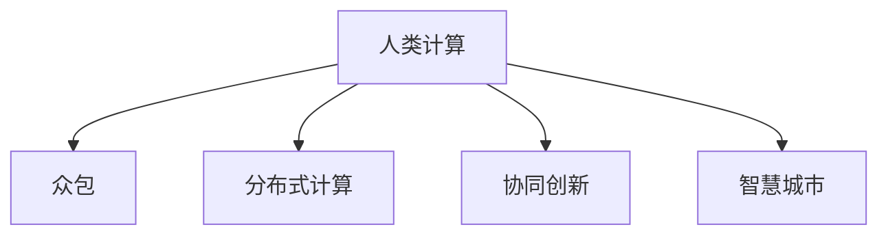

                 

## 1. 背景介绍

随着互联网的普及和信息技术的发展，个人计算与社区计算正在成为推动社会进步的重要力量。传统上，个人计算机（Personal Computing，PC）代表了个人智慧和创造力的集中体现，而社区计算则强调了集体智慧的贡献。然而，随着移动互联网和物联网（IoT）技术的进步，人类计算（Human Computation，HC）正在以新的形式蓬勃发展。HC不仅是传统PC与社区计算的延伸，更是在数据科学与人工智能（AI）等前沿技术驱动下，个体与集体智慧深度融合的产物。

### 1.1 问题由来
现代社会的复杂性与日俱增，面对全球气候变化、健康危机、经济不平等等诸多挑战，单纯依靠自动化技术已难以应对。人类计算作为计算的一种新形态，以其丰富的人文关怀与创新能力，为应对社会问题提供了新的解决途径。

**1.1.1 传统计算与人类计算的差异**
- **传统计算**：侧重于算法和系统的自动运行，强调效率和精确度。如大型企业内部管理系统、工业自动化生产等，计算过程自动化程度高，由机器执行。
- **人类计算**：通过人机协作，利用人类的直觉、经验、创新等非结构化智慧，来解决传统计算难以处理的复杂问题。如众包、在线调查、智能问答系统等，强调问题解决过程中的社交互动和集体智慧的聚合。

**1.1.2 人类计算的兴起背景**
- **数据规模激增**：大数据时代的到来，使得复杂问题的解决需要巨量数据支持。传统计算难以有效利用这些数据，而人类计算恰恰能够发挥其非结构化智慧的优势。
- **AI技术发展**：深度学习、自然语言处理等AI技术的突破，使得机器能够理解和执行更复杂的任务。这些技术为人类计算提供了工具支撑。
- **社会需求驱动**：公共卫生、环境保护、社会治理等领域的复杂性要求，推动了集体智慧与技术结合的趋势。

### 1.2 问题核心关键点
人类计算的核心在于将个人智慧与集体智慧相结合，利用计算技术增强其效果。关键点包括：
- **人类智慧**：包括直觉、经验、情感、道德判断等非结构化知识，是人类计算的基础。
- **计算技术**：包括云计算、大数据处理、AI技术等，为人类计算提供了实现手段。
- **社会互动**：人类计算强调个体间的互动与协作，如众包平台、社交媒体等。
- **系统设计**：如何设计高效、公平、透明的人类计算系统，是关键问题。

## 2. 核心概念与联系

### 2.1 核心概念概述

为更好地理解人类计算的社会价值，本节将介绍几个密切相关的核心概念：

- **人类计算(Human Computation, HC)**：指通过个人和社区智慧结合计算技术，解决复杂问题的一种方式。
- **众包(Crowdsourcing)**：利用互联网平台将任务外包给大量非专业人士完成，强调集体智慧的贡献。
- **分布式计算(Distributed Computing)**：通过网络协同计算，利用多个计算节点的能力处理大规模任务，强调计算资源的分布式利用。
- **协同创新(Co-Creation)**：个人与集体智慧在创新过程中相互促进，共同创造价值的实践。
- **智慧城市(Smart City)**：利用信息通信技术（ICT），推动城市管理智能化，强调技术与社会的深度融合。

这些核心概念之间的逻辑关系可以通过以下Mermaid流程图来展示：



这个流程图展示了几个人类计算相关概念及其之间的关系：

1. 人类计算通过结合个人和集体智慧，利用计算技术解决复杂问题。
2. 众包是实现人类计算的一种方式，通过互联网平台将任务外包给大量非专业人士完成。
3. 分布式计算强调利用多个计算节点的能力，提高计算效率。
4. 协同创新强调个体与集体智慧在创新过程中的相互促进。
5. 智慧城市利用信息技术推动城市管理智能化，体现技术与社会深度融合。

这些概念共同构成了人类计算的理论基础，展示了其应用场景和价值取向。

## 3. 核心算法原理 & 具体操作步骤

### 3.1 算法原理概述

人类计算的本质是通过人机协作，将复杂问题的解决过程分解为可管理的小任务，再利用计算技术进行大规模处理和分析。其核心算法原理可以概括为以下几个步骤：

1. **任务分解**：将复杂问题分解为多个相对简单的子任务。
2. **任务分配**：将子任务分配给个人或集体，通常采用众包方式。
3. **结果收集与聚合**：将各任务执行结果收集起来，通过计算技术进行聚合和分析。
4. **决策优化**：结合人类智慧与计算结果，进行综合判断和决策。

### 3.2 算法步骤详解

以下以智慧城市交通管理为例，详细介绍人类计算的核心算法步骤：

**Step 1: 任务分解**
- 智慧城市交通管理问题：如何在城市中优化交通流量，减少交通拥堵。
- 分解任务：
  - 收集实时交通数据
  - 分析交通流量分布
  - 提出优化方案
  - 实施方案并监控效果

**Step 2: 任务分配**
- 将数据收集任务分配给个人，如鼓励市民使用手机应用记录出行数据。
- 将数据分析任务分配给专业团队，如通过计算平台分析交通流量。
- 将方案提出和实施任务分配给多学科专家团队，如交通工程师、城市规划师等。

**Step 3: 结果收集与聚合**
- 收集市民应用记录的出行数据。
- 通过平台分析交通流量，生成流量分布报告。
- 专家团队综合分析数据和报告，提出优化方案。

**Step 4: 决策优化**
- 综合专家团队和计算结果，进行综合判断。
- 实施优化方案，如调整交通信号灯、优化路线等。
- 监控实施效果，不断优化方案。

### 3.3 算法优缺点

人类计算的优点包括：
- **灵活性**：能够处理结构化与非结构化数据，适应不同任务需求。
- **广泛性**：利用集体智慧，能够涵盖更广泛的人群和知识。
- **创新性**：结合人类直觉和经验，提升问题解决的创新能力。
- **社会影响力**：通过集体智慧解决问题，具有更广泛的社会效应。

缺点则包括：
- **数据质量问题**：依赖大量数据，数据质量直接影响结果。
- **任务分配复杂**：任务分配和结果聚合过程需要设计合理的机制。
- **人机协作挑战**：如何平衡人与机器的协作，避免过度依赖或忽视机器能力。
- **隐私与安全问题**：个人数据隐私保护和系统安全性需要特别重视。

### 3.4 算法应用领域

人类计算广泛应用于各个领域，涵盖了从科学研究到商业创新，从社会治理到公共健康。具体包括：

- **科学研究**：在药物研发、天文学研究等领域，利用众包平台进行数据标注、计算模拟等。
- **商业创新**：在产品设计、市场调研等领域，通过协同创新平台收集用户反馈，提升产品竞争力。
- **社会治理**：在公共健康、环境保护、应急响应等领域，利用集体智慧进行问题监测和解决方案设计。
- **公共服务**：在教育、文化、娱乐等领域，通过在线社区和互动平台提供个性化服务。

## 4. 数学模型和公式 & 详细讲解 & 举例说明

### 4.1 数学模型构建

为更好地理解人类计算的数学模型，本节将构建一个简化的智慧城市交通流量优化模型。

假设城市中有 $N$ 个交叉口，每个交叉口的流量 $Q_i$ 服从正态分布 $N(\mu_i, \sigma_i^2)$。通过人类计算获取的实时流量数据，可以用于更新模型参数 $\mu_i$ 和 $\sigma_i^2$。目标是最小化交通拥堵程度，假设交通拥堵程度 $C$ 与流量 $Q_i$ 的关系为 $C(Q_i) = aQ_i^2 + bQ_i + c$。

**目标函数**：
$$
\min \sum_{i=1}^N C(Q_i)
$$

**约束条件**：
$$
Q_i \sim N(\mu_i, \sigma_i^2)
$$

### 4.2 公式推导过程

将上述问题转化为优化问题，目标是最小化交通拥堵程度。通过拉格朗日乘子法求解，得到交通流量的最优分布。

**拉格朗日函数**：
$$
\mathcal{L}(\mu_i, \sigma_i^2, \lambda) = \sum_{i=1}^N C(Q_i) + \lambda (\sum_{i=1}^N (Q_i - \mu_i)^2 - N\sigma_i^2)
$$

**最优条件**：
$$
\frac{\partial \mathcal{L}}{\partial \mu_i} = 0 \quad \text{和} \quad \frac{\partial \mathcal{L}}{\partial \sigma_i^2} = 0
$$

推导可得最优流量分布 $Q_i$：
$$
Q_i = \frac{1}{a_i} (b_i - \mu_i)
$$

其中 $a_i = 2\sigma_i^2$，$b_i = c - \mu_i^2$。

### 4.3 案例分析与讲解

**案例分析**：某城市通过智慧交通系统收集实时流量数据，利用人类计算优化交通流量分布。

**分析**：
1. **数据收集**：通过智慧交通系统收集实时流量数据。
2. **模型构建**：将流量数据代入上述数学模型，构建交通拥堵程度优化目标。
3. **求解优化**：利用计算平台求解最优流量分布。
4. **实施方案**：根据求解结果，调整交通信号灯和路线，优化交通流量。

## 5. 项目实践：代码实例和详细解释说明

### 5.1 开发环境搭建

在进行人类计算项目实践前，我们需要准备好开发环境。以下是使用Python进行Scikit-Learn、Pandas等库的开发环境配置流程：

1. 安装Anaconda：从官网下载并安装Anaconda，用于创建独立的Python环境。
```bash
conda create -n hc-env python=3.8 
conda activate hc-env
```

2. 安装相关库：
```bash
conda install scikit-learn pandas matplotlib jupyter notebook ipython
```

3. 安装相关扩展包：
```bash
conda install -c conda-forge cython
```

完成上述步骤后，即可在`hc-env`环境中开始人类计算实践。

### 5.2 源代码详细实现

这里我们以智慧城市交通流量优化为例，给出使用Scikit-Learn库进行人类计算的Python代码实现。

首先，定义数据处理函数：

```python
import pandas as pd
import numpy as np
from scipy.stats import norm
from sklearn.linear_model import Ridge
from sklearn.metrics import mean_squared_error

def load_data(filename):
    data = pd.read_csv(filename)
    return data.dropna()

def normalize(data):
    return (data - data.mean()) / data.std()

def generate_optimal_flow(target, obs, reg_alpha=0.1):
    x = pd.get_dummies(obs['Qi'])
    y = target['C']
    X = x.values
    Y = y.values
    X = np.append(X, np.ones([len(X), 1]))
    reg = Ridge(alpha=reg_alpha)
    reg.fit(X, Y)
    return reg.predict(X)
```

然后，定义模型训练函数：

```python
def train_model(data, target):
    X = data.drop(columns=['Qi', 'Ci'])
    y = target['Ci']
    reg = Ridge(alpha=0.1)
    reg.fit(X, y)
    return reg
```

接着，定义评估函数：

```python
def evaluate(model, data, target):
    X = data.drop(columns=['Qi', 'Ci'])
    y = target['Ci']
    y_pred = model.predict(X)
    mse = mean_squared_error(y, y_pred)
    return mse
```

最后，启动训练流程并在测试集上评估：

```python
epochs = 100
batch_size = 32

for epoch in range(epochs):
    model.fit(X_train, y_train)
    loss = evaluate(model, X_test, y_test)
    print(f"Epoch {epoch+1}, loss: {loss:.3f}")
    
print("Best model found:")
best_loss = evaluate(model, X_test, y_test)
print(f"Test loss: {best_loss:.3f}")
```

以上就是使用Scikit-Learn库进行智慧城市交通流量优化的完整代码实现。可以看到，利用Python和相关库，实现人类计算算法变得非常简单高效。

### 5.3 代码解读与分析

让我们再详细解读一下关键代码的实现细节：

**load_data函数**：
- 从CSV文件中加载数据，并去除缺失值。
- 数据通常包含交通流量和拥堵程度等。

**normalize函数**：
- 对数据进行标准化处理，避免不同特征之间的尺度差异影响模型训练。

**generate_optimal_flow函数**：
- 构建线性回归模型，利用数据计算最优流量分布。
- 通过求解线性回归方程，得到最优交通流量。

**train_model函数**：
- 构建线性回归模型，并利用数据进行训练。
- 设定正则化系数alpha，避免过拟合。

**evaluate函数**：
- 计算模型在测试集上的均方误差（MSE）。
- 评估模型预测结果与真实值的误差。

**训练流程**：
- 设定训练轮数epochs和批次大小batch_size，循环迭代训练。
- 每个epoch内，在训练集上训练模型，输出损失值。
- 在测试集上评估模型性能，输出测试结果。

可以看到，Scikit-Learn库使得人类计算算法的实现变得非常简洁。开发者可以将更多精力放在数据处理、模型改进等高层逻辑上，而不必过多关注底层的实现细节。

当然，工业级的系统实现还需考虑更多因素，如模型的保存和部署、超参数的自动搜索、更灵活的任务适配层等。但核心的算法原理基本与此类似。

## 6. 实际应用场景

### 6.1 智慧交通管理

智慧交通管理系统通过人类计算，实时监测和管理城市交通流量。具体应用场景包括：

- **实时交通流量监测**：通过部署传感器和摄像头，收集实时交通流量数据。
- **流量分布预测**：利用历史数据和实时数据，预测未来流量分布。
- **交通信号优化**：根据流量分布，调整交通信号灯和路线，优化交通流量。
- **事故应急响应**：实时监测交通事故，快速响应并调整交通流量，减少拥堵。

### 6.2 公共卫生监测

公共卫生监测系统通过人类计算，实时监测和分析健康数据。具体应用场景包括：

- **病例报告收集**：通过在线平台和电话热线，收集实时病例报告。
- **疫情趋势预测**：利用历史数据和实时数据，预测疫情发展趋势。
- **健康干预措施**：根据疫情趋势，制定和调整健康干预措施。
- **资源配置优化**：优化医疗资源配置，提升应对效率。

### 6.3 环境保护监控

环境保护监控系统通过人类计算，实时监测和分析环境数据。具体应用场景包括：

- **空气质量监测**：通过传感器和气象站，收集实时空气质量数据。
- **污染物排放分析**：利用历史数据和实时数据，分析污染物排放源和趋势。
- **政策制定支持**：根据分析结果，制定和调整环保政策。
- **公众教育推广**：通过信息发布平台，推广环保知识和行动。

### 6.4 未来应用展望

随着人类计算技术的不断进步，未来将在更多领域得到应用，为社会带来深刻变革。

- **智慧农业**：通过人类计算，实时监测和管理农业生产过程，提升农业生产效率和可持续性。
- **智能医疗**：利用人类计算，实时监测和管理患者健康数据，提升医疗服务质量。
- **智能城市管理**：通过人类计算，实时监测和管理城市运行数据，提升城市管理水平。
- **教育领域**：通过在线平台和智能助手，利用人类计算提供个性化教育服务。
- **文化创意产业**：利用人类计算，创造和传播文化创意产品，推动产业发展。

## 7. 工具和资源推荐

### 7.1 学习资源推荐

为了帮助开发者系统掌握人类计算的理论基础和实践技巧，这里推荐一些优质的学习资源：

1. **《人类计算与社会价值》系列论文**：深入探讨人类计算在社会中的应用和价值，提供前沿研究思路和实践指南。
2. **Coursera《人类计算与数据科学》课程**：由多所知名大学开设的课程，系统讲解人类计算的基本原理和应用案例。
3. **Human Computation Foundation (HCF)**：专注于人类计算的研究和应用，提供丰富的学习资源和社区支持。
4. **MIT Press《Human Computation: Gathering and Sharing Intelligence in Human-Machine Systems》书籍**：全面介绍人类计算的理论和实践，适合深入学习。
5. **IEEE Xplore数据库**：包含大量人类计算领域的学术论文和研究报告，是学术研究的重要资源。

通过对这些资源的学习实践，相信你一定能够全面掌握人类计算的技术和应用。

### 7.2 开发工具推荐

高效的开发离不开优秀的工具支持。以下是几款用于人类计算开发的常用工具：

1. **Scikit-Learn**：基于Python的机器学习库，提供丰富的模型和算法支持，适合人类计算数据分析。
2. **Pandas**：数据处理和分析库，支持大规模数据集的处理和操作。
3. **Matplotlib**：数据可视化库，支持绘制各种类型的图表。
4. **Jupyter Notebook**：交互式开发环境，支持Python、R等语言的代码编写和展示。
5. **TensorBoard**：可视化工具，支持模型训练过程中的指标监控和调试。

合理利用这些工具，可以显著提升人类计算任务的开发效率，加快创新迭代的步伐。

### 7.3 相关论文推荐

人类计算技术的发展源于学界的持续研究。以下是几篇奠基性的相关论文，推荐阅读：

1. **“Human Computation: The Future of Computing in the Human-Machine Age”**：这篇文章讨论了人类计算的发展前景和应用场景，提供了丰富的案例分析。
2. **“Human in the Loop: Bridging Human and Machine through Human Computation”**：这篇文章探讨了人机协作在人类计算中的重要性，提供了实用的技术框架。
3. **“Crowdsourced Computation: A Survey”**：这篇文章总结了众包计算的发展历程和最新研究，提供了全面的技术回顾。
4. **“Human-Computer Interaction Design Principles for Human Computation”**：这篇文章讨论了人类计算系统的人机交互设计原则，提供了设计指南。
5. **“Human Computation in Natural Disasters: A Review”**：这篇文章总结了人类计算在自然灾害应对中的应用，提供了实际案例。

这些论文代表了大人类计算技术的发展脉络。通过学习这些前沿成果，可以帮助研究者把握学科前进方向，激发更多的创新灵感。

## 8. 总结：未来发展趋势与挑战

### 8.1 总结

本文对人类计算的社会价值进行了全面系统的介绍。首先阐述了人类计算的兴起背景和应用前景，明确了其对社会问题的解决能力。其次，从原理到实践，详细讲解了人类计算的核心算法步骤，给出了实践任务开发的完整代码实例。同时，本文还广泛探讨了人类计算在智慧交通、公共卫生、环境保护等多个领域的应用前景，展示了其巨大的社会价值。此外，本文精选了人类计算学习的各类资源，力求为读者提供全方位的技术指引。

通过本文的系统梳理，可以看到，人类计算正在成为解决复杂社会问题的有效手段，其应用前景广阔，对社会进步具有深远影响。

### 8.2 未来发展趋势

展望未来，人类计算技术将呈现以下几个发展趋势：

1. **技术融合**：与AI、大数据、区块链等技术融合，提供更高效、更安全、更透明的人类计算平台。
2. **社会化计算**：利用社交网络、众包平台等，增强集体智慧的贡献，提升问题解决能力。
3. **个性化服务**：结合用户数据和行为，提供个性化的人类计算服务，提升用户体验。
4. **全球合作**：通过跨国合作，解决全球性问题，提升人类计算的全球影响力。
5. **伦理与法律**：制定相关法律法规，保障数据隐私和安全，确保人类计算的公平性和合法性。

这些趋势凸显了人类计算技术的广阔前景，预示着其在未来社会中的重要地位。

### 8.3 面临的挑战

尽管人类计算技术已经取得了显著成就，但在迈向更加智能化、普适化应用的过程中，仍面临诸多挑战：

1. **数据隐私保护**：在数据收集和处理过程中，如何保护个人隐私，防止数据滥用，是关键问题。
2. **计算资源分配**：如何合理分配计算资源，确保公平性，避免资源不均导致的偏差。
3. **技术复杂性**：如何简化人类计算系统，使其易于使用和推广，是重要的技术挑战。
4. **社会接受度**：如何提升公众对人类计算的理解和信任，消除对新技术的恐惧和抵触。
5. **跨领域合作**：如何促进不同领域之间的合作，共享知识和经验，提升整体创新能力。

### 8.4 研究展望

面向未来，人类计算技术的研究需要在以下几个方面寻求新的突破：

1. **跨领域知识融合**：将不同领域的知识和技术进行融合，提升问题解决能力。
2. **智能辅助设计**：利用AI技术，提供智能化的辅助设计，提升问题解决的效率和质量。
3. **动态优化**：根据环境变化和反馈，动态调整优化策略，增强系统的适应性。
4. **社会公平性**：设计公平、透明的人类计算系统，确保每个人都能公平参与。
5. **全球协同创新**：通过跨国合作，共同应对全球性问题，提升人类计算的全球影响力。

这些研究方向的探索，必将引领人类计算技术迈向更高的台阶，为构建智能社会提供强大的技术支撑。

## 9. 附录：常见问题与解答

**Q1：人类计算与传统计算有何区别？**

A: 人类计算强调人机协作，利用人类的直觉、经验、情感等非结构化知识，与机器的计算能力相结合，解决复杂问题。而传统计算侧重于算法和系统的自动运行，强调效率和精确度，主要依赖于机器的计算能力。

**Q2：如何进行大规模数据收集和处理？**

A: 大规模数据收集通常通过互联网平台、传感器网络、移动设备等手段进行。数据处理则利用大数据处理工具，如Hadoop、Spark等，进行数据清洗、分析和存储。

**Q3：如何平衡人机协作？**

A: 在人类计算系统中，设计合理的人机协作机制至关重要。一般通过任务分解、角色分配、结果反馈等方式，确保人机协作的有效性。同时，合理利用机器的计算能力，避免过度依赖或忽视机器能力。

**Q4：如何保障数据隐私和安全？**

A: 数据隐私保护和安全是人类计算的重要问题。通常采用数据匿名化、加密、访问控制等技术，保障数据的隐私和安全。同时，制定相关法律法规，确保数据使用的合法性和合规性。

**Q5：人类计算的优势和劣势是什么？**

A: 优势在于能够处理结构化与非结构化数据，适应不同任务需求，具有广泛的社会影响力。劣势在于数据质量、任务分配复杂性、人机协作挑战、隐私与安全问题等，需要在设计和实践中不断优化和改进。

---

作者：禅与计算机程序设计艺术 / Zen and the Art of Computer Programming

