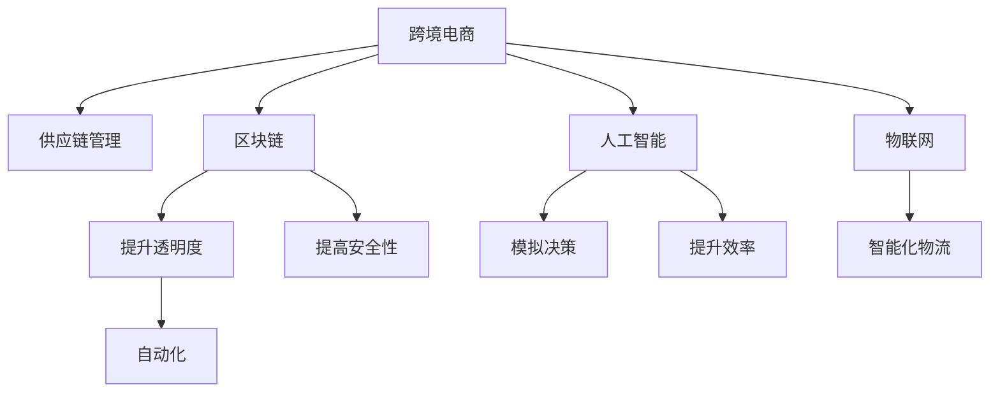

                 

# 跨境自动化创业：机遇与挑战

## 1. 背景介绍

### 1.1 问题由来

在全球化深入发展的今天，跨境贸易已经成为推动经济增长的重要引擎。然而，复杂的国际贸易法规、冗长的通关流程、繁琐的文书处理等问题，给跨境电商创业者带来了巨大的挑战。如何降低跨境创业的门槛，提升运营效率，成为亟待解决的关键问题。

### 1.2 问题核心关键点

跨境自动化创业的核心在于利用先进的技术手段，自动化处理跨境贸易中的各种流程，降低人力成本，提升效率和准确性。这不仅包括物流自动化、财务管理自动化，还包括供应链管理、客户服务等多个环节。通过自动化技术，企业能够快速响应市场变化，优化资源配置，从而在激烈的市场竞争中脱颖而出。

### 1.3 问题研究意义

研究跨境自动化创业的机遇与挑战，对于推动国际贸易的数字化转型，提升跨境电商的竞争力，具有重要意义：

1. **降低运营成本**：自动化技术可以大幅降低人力、时间和资金成本，使跨境电商创业更具可行性。
2. **提高运营效率**：自动化系统可以实时处理大量订单和数据，减少人为错误，提升企业响应速度。
3. **优化供应链管理**：通过智能化管理工具，企业可以优化库存、物流和仓储，减少库存积压，提升供应链效率。
4. **提升客户服务**：自动化客户服务系统可以7x24小时在线，快速响应客户需求，提升客户满意度和忠诚度。
5. **应对市场变化**：自动化系统可以实时分析市场数据，快速调整市场策略，提高企业的灵活性和应变能力。

## 2. 核心概念与联系

### 2.1 核心概念概述

为更好地理解跨境自动化创业，本节将介绍几个密切相关的核心概念：

- **跨境电商（Cross-border E-commerce, C2C）**：指通过互联网进行跨境交易的电子商务模式，包括B2B、B2C、C2C等多种形式。

- **自动化（Automation）**：指利用先进技术手段，自动执行复杂、重复性高的任务，提升工作效率和准确性。

- **供应链管理（Supply Chain Management, SCM）**：指对商品的生产、采购、库存、物流等环节进行计划、执行和控制的综合管理，以提高供应链的整体效率。

- **区块链（Blockchain）**：一种分布式账本技术，通过去中心化、不可篡改的特点，提升跨境贸易的透明度和安全性。

- **人工智能（Artificial Intelligence, AI）**：包括机器学习、深度学习等技术，通过自动化学习算法，使机器能够模拟人类决策过程。

- **物联网（Internet of Things, IoT）**：将各种物理设备通过互联网连接起来，实现设备间的数据共享和协同工作，提升跨境物流的智能化水平。

这些核心概念之间的逻辑关系可以通过以下Mermaid流程图来展示：



这个流程图展示了一些关键概念及其之间的关系：

1. 跨境电商是整个链条的核心，通过自动化技术、区块链、AI、IoT等手段提升其运营效率和透明度。
2. 供应链管理、区块链、AI和IoT都是跨境电商中非常重要的组成部分，协同工作，提升整体效率和安全性。
3. 通过自动化技术，AI可以模拟人类决策，提升效率和准确性。
4. 区块链通过去中心化、不可篡改的特点，提升跨境贸易的透明度和安全性。
5. IoT将各种物理设备连接起来，实现智能化物流，提升物流效率。

这些概念共同构成了跨境自动化创业的基础，使得跨境电商企业能够更好地应对市场挑战，提升运营效率和客户满意度。

## 3. 核心算法原理 & 具体操作步骤
### 3.1 算法原理概述

跨境自动化创业的核心算法原理可以概括为以下几个方面：

- **数据采集与处理**：通过爬虫、传感器等技术手段，自动采集跨境电商运营中的各项数据，如订单信息、物流数据、客户反馈等。
- **数据存储与分析**：使用数据库、数据仓库等技术，对采集到的数据进行存储和分析，发现其中的规律和趋势。
- **自动化决策**：通过机器学习、深度学习等技术，构建自动化决策模型，对复杂任务进行自动化处理。
- **智能推荐系统**：利用推荐算法，实现个性化推荐，提升客户满意度和转化率。
- **实时监控与预警**：构建实时监控系统，对跨境电商运营中的各项指标进行监控，及时发现异常情况并预警。

### 3.2 算法步骤详解

跨境自动化创业的算法步骤通常包括以下几个关键步骤：

**Step 1: 数据采集与处理**
- 设计数据采集模块，从第三方API、Web页面、社交媒体等渠道自动抓取数据。
- 对采集到的数据进行清洗、去重、格式化等处理，生成结构化数据。
- 使用大数据技术如Hadoop、Spark等，对大量数据进行分布式存储和处理。

**Step 2: 数据存储与分析**
- 选择合适的数据库，如MySQL、NoSQL等，存储结构化数据。
- 使用数据仓库技术如Hive、Presto等，对历史数据进行聚合和分析。
- 使用可视化工具如Tableau、Power BI等，对数据进行可视化和报告展示。

**Step 3: 自动化决策**
- 设计自动化决策模型，如推荐系统、预测模型等。
- 使用机器学习框架如TensorFlow、PyTorch等，训练模型并优化模型参数。
- 将训练好的模型部署到生产环境中，实现自动化决策。

**Step 4: 智能推荐系统**
- 根据用户历史行为数据和产品特征，设计推荐算法。
- 使用协同过滤、内容推荐等算法，实现个性化推荐。
- 通过A/B测试等方法，不断优化推荐系统，提升推荐效果。

**Step 5: 实时监控与预警**
- 构建实时监控系统，对关键指标如订单量、库存、物流等进行监控。
- 使用流式计算技术如Apache Kafka、Apache Flink等，实时处理数据。
- 设计预警机制，及时发现异常情况并通知相关人员。

### 3.3 算法优缺点

跨境自动化创业的算法具有以下优点：
1. **提升效率**：通过自动化技术，大幅提升跨境电商运营效率，减少人为干预，降低运营成本。
2. **优化决策**：通过机器学习等技术，构建自动化决策模型，提升决策的准确性和速度。
3. **提高客户满意度**：通过智能推荐系统，实现个性化推荐，提升客户体验和满意度。
4. **实时监控与预警**：通过实时监控系统，及时发现问题并预警，避免重大损失。

同时，该算法也存在一定的局限性：
1. **数据隐私问题**：自动化系统需要处理大量个人数据，涉及数据隐私和安全问题。
2. **技术门槛高**：自动化系统的开发和维护需要较高的技术水平，对人员要求较高。
3. **依赖外部资源**：自动化系统依赖于第三方API、数据源等外部资源，存在数据获取的风险。
4. **算力消耗大**：自动化系统需要处理大量数据，对计算资源要求较高，成本较高。
5. **模型泛化能力不足**：自动化决策模型可能存在过拟合问题，难以适应复杂多变的市场环境。

尽管存在这些局限性，但就目前而言，自动化技术仍然是大势所趋，跨境电商企业需要不断探索和优化自动化系统，以提高竞争力和市场份额。

### 3.4 算法应用领域

跨境自动化创业的算法在多个领域得到了广泛应用，具体包括：

- **物流管理**：通过物联网、传感器等技术，实时监控物流状态，优化物流路径和仓储管理。
- **订单管理**：通过自动化决策系统，实时处理订单信息，提升订单处理效率。
- **库存管理**：通过数据仓库、分析工具，优化库存水平，减少库存积压和短缺。
- **客户服务**：通过智能客服系统，实现自动客服和自动回复，提升客户满意度。
- **风险管理**：通过区块链技术，提升交易的透明度和安全性，防范欺诈风险。
- **市场分析**：通过大数据和AI技术，实时分析市场数据，提供市场洞察和预测。

除了上述这些应用外，跨境自动化创业的算法还在电子商务、金融、保险、医疗等多个领域得到了广泛应用，为各行各业带来了全新的变革和机遇。

## 4. 数学模型和公式 & 详细讲解  
### 4.1 数学模型构建

假设跨境电商运营中的数据采集和处理任务可以用以下数学模型来表示：

设跨境电商运营中的数据集为 $D=\{(x_i,y_i)\}_{i=1}^N$，其中 $x_i$ 为输入特征，如订单号、时间戳、产品类别等，$y_i$ 为输出标签，如订单状态、物流状态等。

目标任务为构建一个预测模型 $f(x)$，使得对于任意输入 $x$，预测结果 $y$ 与真实标签 $y_i$ 的误差最小化。数学模型可以表示为：

$$
\min_{f} \mathbb{E}_{(x,y) \sim D}[L(f(x),y)]
$$

其中 $L$ 为损失函数，可以采用常见的回归损失、分类损失等。

### 4.2 公式推导过程

以预测订单状态为例，假设模型的预测结果与真实标签的误差可以表示为：

$$
L(f(x),y) = (f(x) - y)^2
$$

则均方误差损失函数为：

$$
\mathbb{E}_{(x,y) \sim D}[L(f(x),y)] = \mathbb{E}_{(x,y) \sim D}[(f(x) - y)^2]
$$

根据期望的性质，可以转化为对样本数据的期望：

$$
\mathbb{E}_{(x,y) \sim D}[(f(x) - y)^2] = \frac{1}{N}\sum_{i=1}^N (f(x_i) - y_i)^2
$$

目标任务即为最小化上述损失函数，可以使用梯度下降等优化算法求解。

### 4.3 案例分析与讲解

假设有一家跨境电商企业，需要预测订单状态是否会延迟。现有历史订单数据 $D=\{(x_i,y_i)\}_{i=1}^N$，其中 $x_i$ 包含订单号、发货时间、预计到货时间等信息，$y_i$ 表示订单状态是否延迟。

可以使用神经网络模型对订单数据进行预测，模型的输入特征 $x_i$ 为订单信息，输出 $f(x_i)$ 为订单状态是否延迟的概率。

通过训练神经网络模型，最小化均方误差损失函数：

$$
\min_{f} \mathbb{E}_{(x,y) \sim D}[(f(x) - y)^2]
$$

训练完成后，可以使用模型对新订单进行预测，提升订单状态预测的准确性。

## 5. 项目实践：代码实例和详细解释说明
### 5.1 开发环境搭建

在进行跨境自动化创业的实践前，我们需要准备好开发环境。以下是使用Python进行PyTorch开发的环境配置流程：

1. 安装Anaconda：从官网下载并安装Anaconda，用于创建独立的Python环境。

2. 创建并激活虚拟环境：
```bash
conda create -n pytorch-env python=3.8 
conda activate pytorch-env
```

3. 安装PyTorch：根据CUDA版本，从官网获取对应的安装命令。例如：
```bash
conda install pytorch torchvision torchaudio cudatoolkit=11.1 -c pytorch -c conda-forge
```

4. 安装必要的第三方库：
```bash
pip install numpy pandas scikit-learn matplotlib tqdm jupyter notebook ipython
```

完成上述步骤后，即可在`pytorch-env`环境中开始跨境自动化创业的实践。

### 5.2 源代码详细实现

这里我们以物流自动跟踪为例，给出使用PyTorch进行物流数据预测的PyTorch代码实现。

首先，定义物流状态预测模型：

```python
import torch
from torch import nn
from torch.optim import Adam

class LogisticRegression(nn.Module):
    def __init__(self, input_dim, output_dim):
        super(LogisticRegression, self).__init__()
        self.linear = nn.Linear(input_dim, output_dim)
        
    def forward(self, x):
        return torch.sigmoid(self.linear(x))
```

然后，定义损失函数和优化器：

```python
from torch.utils.data import DataLoader
from sklearn.metrics import roc_auc_score

# 定义损失函数
criterion = nn.BCELoss()

# 定义优化器
optimizer = Adam(model.parameters(), lr=0.001)
```

接着，定义训练和评估函数：

```python
from torch.utils.data import DataLoader
from tqdm import tqdm
from sklearn.metrics import classification_report

device = torch.device('cuda') if torch.cuda.is_available() else torch.device('cpu')
model.to(device)

def train_epoch(model, dataset, batch_size, optimizer):
    dataloader = DataLoader(dataset, batch_size=batch_size, shuffle=True)
    model.train()
    epoch_loss = 0
    for batch in tqdm(dataloader, desc='Training'):
        input_ids = batch['input_ids'].to(device)
        labels = batch['labels'].to(device)
        model.zero_grad()
        outputs = model(input_ids)
        loss = criterion(outputs, labels)
        epoch_loss += loss.item()
        loss.backward()
        optimizer.step()
    return epoch_loss / len(dataloader)

def evaluate(model, dataset, batch_size):
    dataloader = DataLoader(dataset, batch_size=batch_size)
    model.eval()
    preds, labels = [], []
    with torch.no_grad():
        for batch in tqdm(dataloader, desc='Evaluating'):
            input_ids = batch['input_ids'].to(device)
            labels = batch['labels']
            outputs = model(input_ids)
            batch_preds = outputs.to('cpu').tolist()
            batch_labels = labels.to('cpu').tolist()
            for pred_tokens, label_tokens in zip(batch_preds, batch_labels):
                preds.append(pred_tokens[:len(label_tokens)])
                labels.append(label_tokens)
                
    print(roc_auc_score(labels, preds))
```

最后，启动训练流程并在测试集上评估：

```python
epochs = 10
batch_size = 64

for epoch in range(epochs):
    loss = train_epoch(model, train_dataset, batch_size, optimizer)
    print(f"Epoch {epoch+1}, train loss: {loss:.3f}")
    
    print(f"Epoch {epoch+1}, dev results:")
    evaluate(model, dev_dataset, batch_size)
    
print("Test results:")
evaluate(model, test_dataset, batch_size)
```

以上就是使用PyTorch对物流状态预测模型进行训练的完整代码实现。可以看到，通过合理使用PyTorch等框架，跨境自动化创业的模型训练和推理变得简单高效。

### 5.3 代码解读与分析

让我们再详细解读一下关键代码的实现细节：

**LogisticRegression类**：
- `__init__`方法：初始化模型参数，定义线性层。
- `forward`方法：定义模型的前向传播过程，返回模型的预测结果。

**criterion和optimizer对象**：
- `nn.BCELoss`：定义二分类交叉熵损失函数。
- `Adam`：定义Adam优化器，用于更新模型参数。

**train_epoch和evaluate函数**：
- 使用DataLoader对数据集进行批处理，方便模型训练和评估。
- `train_epoch`函数：对数据集进行批处理和训练，计算损失并更新模型参数。
- `evaluate`函数：对模型进行评估，计算模型在测试集上的预测结果和真实标签，使用roc_auc_score计算准确率。

**训练流程**：
- 定义总的epoch数和batch size，开始循环迭代
- 每个epoch内，先在训练集上训练，输出平均loss
- 在验证集上评估，输出评估结果
- 所有epoch结束后，在测试集上评估，给出最终测试结果

可以看到，PyTorch等框架提供了强大的模型训练和优化工具，跨境自动化创业的模型训练和推理变得简单高效。开发者可以将更多精力放在模型设计和算法优化上，而不必过多关注底层的实现细节。

当然，工业级的系统实现还需考虑更多因素，如模型的保存和部署、超参数的自动搜索、更灵活的任务适配层等。但核心的模型训练过程基本与此类似。

## 6. 实际应用场景
### 6.1 智能客服系统

跨境自动化创业的智能客服系统可以广泛应用于全球跨境电商企业的客户服务场景。传统客服往往需要配备大量人力，高峰期响应缓慢，且一致性和专业性难以保证。而使用自动化客服系统，可以7x24小时不间断服务，快速响应客户咨询，用自然流畅的语言解答各类常见问题。

在技术实现上，可以收集企业内部的历史客服对话记录，将问题和最佳答复构建成监督数据，在此基础上对预训练模型进行微调。微调后的客服系统能够自动理解客户意图，匹配最合适的答案模板进行回复。对于客户提出的新问题，还可以接入检索系统实时搜索相关内容，动态组织生成回答。如此构建的智能客服系统，能大幅提升客户咨询体验和问题解决效率。

### 6.2 物流自动化系统

跨境物流自动化系统可以显著提升跨境电商企业的运营效率，降低物流成本。通过自动化跟踪系统，企业可以实时监控物流状态，优化物流路径和仓储管理。

在技术实现上，可以设计自动化物流跟踪模型，对物流状态数据进行实时处理和预测。模型可以通过采集物流数据（如包裹号、时间戳、位置信息等）进行训练，预测包裹的到达时间、是否丢失等信息。系统还可以集成GPS、传感器等硬件设备，实现更加智能的物流监控。

### 6.3 供应链管理系统

跨境电商供应链管理系统可以有效提升供应链管理效率，降低库存成本。通过自动化系统，企业可以实时监控库存水平，优化库存策略，减少库存积压和短缺。

在技术实现上，可以设计自动化供应链管理模型，对订单数据、库存数据进行实时处理和预测。模型可以通过采集订单数据、库存数据等信息进行训练，预测订单需求、库存水平等信息。系统还可以集成ERP、CRM等系统，实现供应链数据共享和协同管理。

### 6.4 未来应用展望

随着自动化技术的不断发展，跨境自动化创业将迎来更多机遇和挑战。

1. **人工智能与区块链结合**：结合人工智能和区块链技术，构建更安全、透明的跨境电商系统，提升数据隐私和安全水平。
2. **多模态数据融合**：将语音、图像、视频等多模态数据融合，提升跨境电商系统的智能化水平，实现更全面的运营监控。
3. **边缘计算与IoT**：通过边缘计算技术，将计算任务下沉到设备侧，实现实时数据处理和决策，提升跨境电商系统的响应速度和效率。
4. **联邦学习**：通过联邦学习技术，在保护数据隐私的前提下，实现多方数据共享和协同学习，提升跨境电商系统的决策水平。
5. **自适应学习**：构建自适应学习系统，根据市场变化动态调整模型参数，提升跨境电商系统的灵活性和适应性。

未来，随着技术的不断进步和应用的深入，跨境自动化创业将为全球跨境电商企业带来更多的机遇和变革，推动国际贸易的数字化转型。

## 7. 工具和资源推荐
### 7.1 学习资源推荐

为了帮助跨境自动化创业开发者系统掌握相关技术，这里推荐一些优质的学习资源：

1. **《深度学习》课程**：斯坦福大学开设的深度学习课程，涵盖深度学习的基本概念、算法和应用，适合入门学习。
2. **PyTorch官方文档**：PyTorch官方提供的文档，包含详细的API介绍和实例代码，适合快速上手学习。
3. **《自然语言处理综论》书籍**：详细介绍了NLP中的各种技术和算法，适合深入学习。
4. **Kaggle竞赛平台**：全球最大的数据科学竞赛平台，提供丰富的数据集和竞赛任务，适合实战练习。
5. **《机器学习实战》书籍**：适合动手实践，通过实例代码学习机器学习算法。

通过对这些资源的学习实践，相信你一定能够快速掌握跨境自动化创业的关键技术，并用于解决实际的跨境电商问题。

### 7.2 开发工具推荐

高效的开发离不开优秀的工具支持。以下是几款用于跨境自动化创业开发的常用工具：

1. **Jupyter Notebook**：免费的在线编程环境，支持Python、R等多种编程语言，适合快速迭代开发和数据可视化。
2. **GitHub**：全球最大的代码托管平台，适合版本控制、代码协作和项目分享。
3. **Docker**：容器化技术，适合应用部署和持续集成，方便跨平台和跨环境部署。
4. **Kubernetes**：容器编排技术，适合大规模应用部署和资源管理，支持自动化部署和扩展。
5. **TensorBoard**：TensorFlow的可视化工具，适合实时监控和调试模型训练过程。

合理利用这些工具，可以显著提升跨境自动化创业的开发效率，加快创新迭代的步伐。

### 7.3 相关论文推荐

跨境自动化创业的技术研究涉及众多领域，以下是几篇奠基性的相关论文，推荐阅读：

1. **《深度学习》书籍**：深度学习领域的经典教材，涵盖深度学习的基本概念、算法和应用，适合全面学习。
2. **《人工智能技术应用》书籍**：介绍人工智能在各个行业的应用案例，适合了解前沿技术。
3. **《机器学习实战》书籍**：适合动手实践，通过实例代码学习机器学习算法。
4. **《自适应学习》论文**：介绍自适应学习算法，提升模型的适应性和灵活性。
5. **《区块链技术与应用》书籍**：详细介绍区块链技术的原理和应用场景，适合了解区块链技术。

这些论文代表了大规模自动化创业的研究方向和最新进展，通过学习这些前沿成果，可以帮助研究者把握学科前进方向，激发更多的创新灵感。

## 8. 总结：未来发展趋势与挑战

### 8.1 总结

本文对跨境自动化创业的机遇与挑战进行了全面系统的介绍。首先阐述了跨境自动化创业的背景和意义，明确了自动化技术在提升跨境电商运营效率、降低成本等方面的重要价值。其次，从原理到实践，详细讲解了跨境自动化创业的数学模型和关键步骤，给出了跨境自动化创业的完整代码实例。同时，本文还广泛探讨了跨境自动化创业在智能客服、物流自动化、供应链管理等多个领域的应用前景，展示了自动化技术的巨大潜力。此外，本文精选了跨境自动化创业的学习资源，力求为读者提供全方位的技术指引。

通过本文的系统梳理，可以看到，跨境自动化创业正在成为跨境电商企业的重要战略方向，通过自动化技术大幅提升运营效率，降低运营成本，提高客户满意度。未来，随着技术的不断进步和应用的深入，跨境自动化创业将为全球跨境电商企业带来更多的机遇和变革，推动国际贸易的数字化转型。

### 8.2 未来发展趋势

展望未来，跨境自动化创业将呈现以下几个发展趋势：

1. **技术融合创新**：随着人工智能、区块链、IoT等技术的不断发展，跨境自动化创业将迎来更多创新应用场景，推动国际贸易的数字化和智能化转型。
2. **数据驱动决策**：通过大数据和AI技术，跨境自动化创业将能够实现更加精准的市场预测和运营决策，提升企业的竞争力。
3. **自适应学习系统**：构建自适应学习系统，根据市场变化动态调整模型参数，提升跨境电商系统的灵活性和适应性。
4. **联邦学习**：通过联邦学习技术，在保护数据隐私的前提下，实现多方数据共享和协同学习，提升跨境电商系统的决策水平。
5. **边缘计算**：通过边缘计算技术，将计算任务下沉到设备侧，实现实时数据处理和决策，提升跨境电商系统的响应速度和效率。
6. **跨平台集成**：通过API、SDK等方式，实现跨境自动化创业系统与其他业务系统的集成，提升系统的协同性和效率。

以上趋势凸显了跨境自动化创业技术的广阔前景。这些方向的探索发展，必将进一步提升跨境电商企业的运营效率和市场竞争力，带来更多的机遇和挑战。

### 8.3 面临的挑战

尽管跨境自动化创业的技术已经取得了显著进展，但在迈向更加智能化、普适化应用的过程中，它仍面临着诸多挑战：

1. **数据隐私和安全**：自动化系统需要处理大量个人数据，涉及数据隐私和安全问题，必须严格遵守法律法规。
2. **技术门槛高**：自动化系统的开发和维护需要较高的技术水平，对人员要求较高。
3. **依赖外部资源**：自动化系统依赖于第三方API、数据源等外部资源，存在数据获取的风险。
4. **算力消耗大**：自动化系统需要处理大量数据，对计算资源要求较高，成本较高。
5. **模型泛化能力不足**：自动化决策模型可能存在过拟合问题，难以适应复杂多变的市场环境。
6. **用户体验问题**：自动化系统可能导致用户体验下降，如自动化客服无法解决复杂问题、自动化推荐系统无法满足个性化需求等。

尽管存在这些挑战，但跨境自动化创业技术仍然是大势所趋，跨境电商企业需要不断探索和优化自动化系统，以提高竞争力和市场份额。

### 8.4 研究展望

面对跨境自动化创业所面临的种种挑战，未来的研究需要在以下几个方面寻求新的突破：

1. **提升数据隐私保护**：通过联邦学习、差分隐私等技术，提升自动化系统的数据隐私保护水平，避免数据泄露和滥用。
2. **降低技术门槛**：通过简化模型设计和优化工具，降低自动化系统的开发和维护门槛，提升易用性和可扩展性。
3. **优化数据获取**：通过爬虫、API等手段，优化数据采集和处理流程，提升数据的可用性和完整性。
4. **优化算力消耗**：通过模型压缩、稀疏化等技术，优化自动化系统的计算图，减少前向传播和反向传播的资源消耗，实现更加轻量级、实时性的部署。
5. **提升模型泛化能力**：通过迁移学习、多模态学习等技术，提升自动化决策模型的泛化能力和适应性，适应复杂多变的市场环境。
6. **优化用户体验**：通过智能推荐、智能客服等技术，提升自动化系统的用户体验，满足客户多样化需求。

这些研究方向的探索，必将引领跨境自动化创业技术迈向更高的台阶，为跨境电商企业带来更多的机遇和变革，推动国际贸易的数字化转型。

## 9. 附录：常见问题与解答

**Q1：跨境自动化创业是否适用于所有跨境电商企业？**

A: 跨境自动化创业对于具有一定技术实力的跨境电商企业更为适用。虽然自动化技术可以大幅降低运营成本，提升运营效率，但企业需要具备一定的技术积累和开发能力，才能进行系统的开发和维护。中小企业可以在参考大企业解决方案的基础上，逐步引入自动化技术，提升运营效率。

**Q2：自动化系统如何保证数据隐私和安全？**

A: 自动化系统在处理数据时，需要遵循相关的法律法规，如GDPR、CCPA等。可以通过数据匿名化、差分隐私、联邦学习等技术，提升数据隐私保护水平。同时，建立严格的访问控制和数据备份机制，保障数据安全和可靠性。

**Q3：自动化系统的技术门槛高吗？**

A: 自动化系统的开发和维护需要较高的技术水平，特别是对于数据预处理、模型训练、系统集成等环节，对人员要求较高。建议企业组建专业的技术团队，或通过外部技术合作等方式，降低技术门槛。

**Q4：自动化系统如何获取和处理数据？**

A: 自动化系统通常需要依赖第三方API、数据源等外部资源，获取和处理数据。需要设计和实现数据采集模块，确保数据来源的可靠性和数据的完整性。可以使用爬虫、传感器等技术手段，自动化获取数据。同时，对数据进行清洗、去重、格式化等处理，生成结构化数据。

**Q5：自动化系统的算力消耗大吗？**

A: 自动化系统需要处理大量数据，对计算资源要求较高，成本较高。需要采用一些资源优化技术，如梯度积累、混合精度训练、模型并行等，突破硬件瓶颈。同时，可以考虑使用云服务，按需使用计算资源，降低成本。

这些问题的解答，希望对你深入理解跨境自动化创业有所帮助。通过不断探索和实践，相信你能够掌握跨境自动化创业的关键技术，助力企业提升运营效率，赢得更多市场机遇。

---

作者：禅与计算机程序设计艺术 / Zen and the Art of Computer Programming

