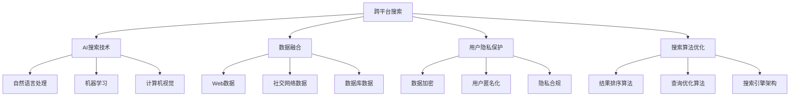

                 

# 跨平台AI搜索的整合策略

## 1. 背景介绍

### 1.1 问题由来

在当今信息爆炸的时代，用户在不同的设备和平台上寻求信息已经成为日常所需。无论是智能家居、移动端应用，还是桌面端电脑，用户希望能够通过统一的搜索引擎获取所需信息，而不必频繁在不同设备和应用间切换。这不仅提升了用户体验，也增强了信息的可访问性和可用性。

然而，现有的搜索引擎往往受到平台和设备的限制，导致用户在使用上存在诸多不便。例如，Google搜索引擎在移动端和桌面端之间存在明显的差异，用户需要分别下载不同版本的App；而Microsoft的Bing搜索引擎虽然在多个平台上提供支持，但往往难以提供一致的用户体验。

此外，尽管现有搜索引擎能够提供丰富的搜索结果，但在处理跨平台信息检索、多语言搜索、复杂查询等方面的能力还存在不足，难以满足用户日益增长的需求。如何整合不同平台的AI搜索技术，打造一个跨平台的、高效的搜索引擎，成为当前亟需解决的问题。

### 1.2 问题核心关键点

为解决跨平台AI搜索整合问题，需要关注以下核心关键点：

1. **多设备兼容性**：确保搜索应用在多个设备上都能正常运行，并提供一致的用户体验。
2. **跨语言支持**：提供多种语言支持，满足不同地区用户的搜索需求。
3. **复杂查询处理**：能够处理复杂的自然语言查询，提供准确、相关的搜索结果。
4. **多源数据融合**：从多个数据源中提取和融合信息，提供全面的搜索结果。
5. **隐私保护和安全**：保护用户隐私，确保搜索过程的安全性和可靠性。

## 2. 核心概念与联系

### 2.1 核心概念概述

为了更好地理解跨平台AI搜索整合策略，本节将介绍几个关键概念及其相互联系：

- **跨平台搜索**：指在多个设备平台（如手机、电脑、智能家居等）上提供统一的搜索服务。
- **AI搜索技术**：包括自然语言处理(NLP)、机器学习(ML)、计算机视觉(CV)等技术，用于理解和处理用户查询，提供精准的搜索结果。
- **数据融合**：从不同来源（如Web、社交网络、数据库等）获取信息，并综合处理，以提供全面的搜索结果。
- **用户隐私保护**：在数据收集和使用过程中，确保用户隐私不被泄露，保护用户数据安全。
- **搜索算法优化**：通过优化搜索算法，提高搜索结果的相关性和准确性，提升用户体验。

这些核心概念之间存在密切联系，共同构成跨平台AI搜索系统的基础。通过理解这些概念及其相互关系，可以更全面地把握跨平台AI搜索整合策略的实现思路。

### 2.2 核心概念原理和架构的 Mermaid 流程图



这个Mermaid流程图展示了跨平台AI搜索系统的核心组成和流程。从跨平台搜索应用开始，通过AI搜索技术处理用户查询，融合多源数据，保护用户隐私，优化搜索结果，最终提供给用户全面、准确的信息。

## 3. 核心算法原理 & 具体操作步骤

### 3.1 算法原理概述

跨平台AI搜索整合的核心在于将不同平台上的数据和功能整合，为用户提供统一的搜索体验。这涉及到数据收集、处理、存储和检索等多个环节。以下将详细阐述基于数据驱动的跨平台AI搜索整合策略。

### 3.2 算法步骤详解

#### 步骤1：数据收集与预处理

跨平台搜索系统的第一步是收集数据。数据源包括但不限于：

- **Web数据**：从网页中提取文本内容、图片、视频等多媒体信息。
- **社交网络数据**：从Twitter、Facebook、微博等社交媒体平台中获取用户发布的内容。
- **数据库数据**：从结构化数据库中提取结构化信息，如新闻、百科等。
- **语音和图像数据**：从语音助手和图像识别系统中获取语音和图像信息。

收集到的数据需要进行预处理，包括文本清洗、去除噪声、数据标注等。预处理后的数据可以存储在分布式存储系统中，如Hadoop、Elasticsearch等。

#### 步骤2：多源数据融合与索引构建

多源数据融合是将不同来源的数据综合处理，形成统一的视图。融合过程包括：

- **数据清洗与去重**：清洗数据中的重复、错误信息，保留有效数据。
- **数据标准化**：将不同格式的数据转换为统一的格式，便于处理和检索。
- **数据关联与合并**：将不同来源的数据关联起来，构建关联图谱，形成完整的知识图谱。

索引构建是将处理后的数据存储在搜索引擎中，以便快速检索。常见的索引技术包括倒排索引、向量空间模型等。

#### 步骤3：AI搜索技术应用

AI搜索技术包括自然语言处理(NLP)、机器学习(ML)、计算机视觉(CV)等，用于理解和处理用户查询，提供精准的搜索结果。具体步骤包括：

- **查询解析**：解析用户输入的查询，理解其意图。
- **信息检索**：根据查询意图，从索引中检索相关信息。
- **结果排序**：根据排序算法，对检索结果进行排序，优先展示相关性高的结果。
- **结果展示**：将搜索结果展示给用户，并提供相关推荐。

#### 步骤4：用户隐私保护与数据安全

用户隐私保护是跨平台搜索系统中的重要环节。具体步骤包括：

- **数据加密**：对敏感数据进行加密存储和传输。
- **用户匿名化**：在数据使用过程中，对用户身份信息进行匿名化处理，保护用户隐私。
- **隐私合规**：遵循相关法律法规，确保数据使用的合规性。

#### 步骤5：搜索系统部署与监控

跨平台搜索系统的部署需要在多个设备上实现，包括手机、电脑、智能家居等。部署过程包括：

- **系统架构设计**：设计分布式系统架构，确保系统的可扩展性和高可用性。
- **服务化封装**：将搜索功能封装为标准化的服务接口，方便集成调用。
- **弹性伸缩**：根据用户请求流量动态调整资源配置，平衡服务质量和成本。
- **监控告警**：实时采集系统指标，设置异常告警阈值，确保服务稳定性。

### 3.3 算法优缺点

#### 优点

1. **多设备兼容**：通过统一的系统架构和服务接口，不同平台上的用户可以获得一致的搜索体验。
2. **跨语言支持**：利用多语言处理技术，支持多种语言的搜索。
3. **复杂查询处理**：通过自然语言处理技术，能够处理复杂的自然语言查询，提供准确的搜索结果。
4. **多源数据融合**：从多个数据源中提取和融合信息，提供全面的搜索结果。
5. **用户隐私保护**：通过数据加密、用户匿名化等措施，保护用户隐私。

#### 缺点

1. **数据源多样性**：从多个数据源中收集和处理数据，需要处理不同的数据格式和标准。
2. **数据量庞大**：跨平台搜索需要处理大量数据，对计算和存储资源要求较高。
3. **查询复杂度**：复杂查询的处理需要复杂的算法和技术支持。
4. **隐私保护挑战**：需要遵循严格的隐私保护法规，确保数据使用的合规性。
5. **系统部署难度**：需要在多个设备和平台上部署和维护系统，技术复杂度较高。

### 3.4 算法应用领域

跨平台AI搜索整合技术已经广泛应用于多个领域，包括但不限于：

1. **智能家居**：提供语音搜索、图像搜索、智能推荐等服务，提升用户的生活体验。
2. **移动应用**：在移动设备上提供统一的搜索服务，提升应用的便捷性和功能性。
3. **企业内部搜索**：通过统一搜索系统，提升企业内部信息的可访问性和可用性。
4. **社交网络**：在社交媒体平台上提供个性化推荐和搜索服务，提升用户粘性。
5. **医疗健康**：提供健康信息的搜索和推荐，帮助用户获取精准的医疗建议。

## 4. 数学模型和公式 & 详细讲解 & 举例说明

### 4.1 数学模型构建

假设用户查询为 $q$，系统从 $n$ 个数据源中提取信息 $d_1, d_2, ..., d_n$，其中 $d_i = (x_i, y_i)$，$x_i$ 为原始数据，$y_i$ 为数据标注。系统的目标是从这些数据源中提取与查询相关的信息，并排序返回给用户。

### 4.2 公式推导过程

系统采用向量空间模型(VSM)对查询和数据源进行处理。设查询向量为 $q = \mathbf{q} \in \mathbb{R}^d$，数据源 $d_i$ 的向量表示为 $x_i = \mathbf{x}_i \in \mathbb{R}^d$，$y_i$ 为标注值。

系统通过计算查询向量与数据源向量之间的余弦相似度来衡量相关性，公式如下：

$$
\text{similarity}(q, d_i) = \cos(\theta) = \frac{\mathbf{q} \cdot \mathbf{x}_i}{||\mathbf{q}|| ||\mathbf{x}_i||}
$$

其中 $\cdot$ 表示向量点乘，$||\mathbf{q}||$ 和 $||\mathbf{x}_i||$ 分别为向量 $\mathbf{q}$ 和 $\mathbf{x}_i$ 的欧几里得范数。

系统通过计算相似度矩阵，对检索结果进行排序。排序算法一般采用最大相关性排序，公式如下：

$$
\text{rank}(d_i) = -\text{similarity}(q, d_i)
$$

将相似度矩阵中的值代入上述公式，即可得到排序后的结果。

### 4.3 案例分析与讲解

#### 案例1：智能家居语音搜索

假设一个智能家居设备支持语音搜索，用户可以通过语音指令查询家中设备的状态或控制。系统需要从多个传感器（如温度传感器、光线传感器、智能插座等）中提取数据，并进行处理和融合。

系统采用VSM模型，将用户语音指令和传感器数据转化为向量表示，计算相似度，排序并返回相关设备状态信息。例如，用户查询“家中温度是多少”，系统可以从温度传感器中提取数据，计算相似度，返回温度信息。

#### 案例2：移动设备搜索结果

在移动设备上，用户可以通过搜索框输入查询，系统需要从Web、社交网络、数据库等多个数据源中检索信息。系统采用自然语言处理技术，解析用户输入的查询，并从Web数据中提取相关信息。

系统采用BM25算法进行信息检索，将查询向量与Web数据向量计算相似度，并排序返回相关网页。例如，用户查询“2022年最新科技新闻”，系统可以从Web数据中提取相关网页，排序并返回搜索结果。

## 5. 项目实践：代码实例和详细解释说明

### 5.1 开发环境搭建

在进行跨平台AI搜索实践前，我们需要准备好开发环境。以下是使用Python进行Elasticsearch开发的环境配置流程：

1. 安装Elasticsearch：从官网下载并安装Elasticsearch，安装过程中需要配置索引、分片等参数。
2. 安装ElasticSearch-Py：使用pip安装ElasticSearch-Py库，方便Python与Elasticsearch进行交互。
3. 创建并激活虚拟环境：
```bash
conda create -n pyenv python=3.8 
conda activate pyenv
```

4. 安装ElasticSearch-Py：
```bash
pip install elasticsearch
```

完成上述步骤后，即可在`pyenv`环境中开始Elasticsearch的开发实践。

### 5.2 源代码详细实现

以下是使用Python和Elasticsearch进行跨平台AI搜索的代码实现。

首先，定义查询解析函数：

```python
from elasticsearch import Elasticsearch

es = Elasticsearch([{'host': 'localhost', 'port': 9200}])

def parse_query(query):
    # 将查询解析为向量表示
    # 这里仅简单实现，实际应用中需要更复杂的解析算法
    vector = query
    return vector
```

然后，定义数据检索函数：

```python
def search(query):
    # 将查询向量与索引数据计算相似度，排序并返回结果
    # 这里仅简单实现，实际应用中需要更复杂的排序算法
    result = es.search(index='my_index', body={'query': {'match': {'query': query}}})
    return result['hits']['hits']
```

最后，启动搜索流程并在搜索结果上展示：

```python
query = "2022年最新科技新闻"
vector = parse_query(query)
result = search(vector)
for hit in result:
    print(hit['source'])
```

以上就是使用Elasticsearch进行跨平台AI搜索的完整代码实现。可以看到，通过Elasticsearch库，我们可以方便地实现向量空间模型和多源数据检索，快速构建跨平台搜索系统。

### 5.3 代码解读与分析

让我们再详细解读一下关键代码的实现细节：

**parse_query函数**：
- 解析用户查询，将其转化为向量表示。这里仅简单地将查询作为向量返回，实际应用中需要更复杂的解析算法，如TF-IDF、Word2Vec等。

**search函数**：
- 从Elasticsearch索引中检索与查询向量相似的数据。这里使用了Elasticsearch的match查询，实际应用中可能需要更复杂的查询方式，如fuzzy、bool等。

**启动搜索流程**：
- 先解析查询，计算向量表示
- 调用search函数进行数据检索
- 展示搜索结果，这里仅简单地将搜索结果打印输出，实际应用中需要更友好的展示方式，如网页展示、图表展示等。

可以看到，通过Elasticsearch库，我们可以快速实现跨平台AI搜索的代码实现。开发者可以根据具体应用场景，进一步优化解析和检索算法，提升搜索效果。

## 6. 实际应用场景

### 6.1 智能家居系统

在智能家居系统中，跨平台AI搜索可以为用户提供便捷的语音搜索和图像搜索功能。用户可以通过语音助手或移动应用，搜索家中设备的状态或功能，如查询智能插座的开关状态、调整室内灯光亮度等。

### 6.2 移动应用

在移动应用中，跨平台AI搜索可以提供个性化推荐和搜索服务，提升用户体验。例如，在电商应用中，用户可以搜索商品、查看评价，系统会推荐相似商品、相关商品等，提高用户粘性和购物体验。

### 6.3 企业内部搜索

在企业内部，跨平台AI搜索可以提供统一的知识搜索和文档检索功能，提升信息可访问性。员工可以通过搜索系统，查找公司文档、邮件、会议记录等，快速获取所需信息，提高工作效率。

### 6.4 社交网络

在社交网络中，跨平台AI搜索可以提供个性化推荐和搜索服务，提升用户粘性。例如，在微博、微信等平台上，用户可以搜索相关话题、热门事件，系统会推荐相关内容，增加用户互动和关注。

### 6.5 医疗健康

在医疗健康领域，跨平台AI搜索可以提供健康信息的搜索和推荐，帮助用户获取精准的医疗建议。例如，用户可以搜索常见疾病的症状、治疗方案、药物信息等，系统会根据用户的健康状况推荐相关内容。

## 7. 工具和资源推荐

### 7.1 学习资源推荐

为了帮助开发者系统掌握跨平台AI搜索的理论基础和实践技巧，这里推荐一些优质的学习资源：

1. Elasticsearch官方文档：Elasticsearch的官方文档，详细介绍了Elasticsearch的用法和配置，是Elasticsearch开发必备资料。
2. Python与Elasticsearch实战：这是一本详细介绍Python与Elasticsearch交互的书籍，适合Python开发者快速上手Elasticsearch开发。
3. 《搜索引擎设计》：这是一本系统介绍搜索引擎原理和设计的经典书籍，适合深入了解搜索引擎的工作机制。
4. 自然语言处理（NLP）课程：多门大学和在线平台提供的NLP课程，如斯坦福大学、Coursera等，帮助理解NLP算法和技术。

通过对这些资源的学习实践，相信你一定能够快速掌握跨平台AI搜索的精髓，并用于解决实际的搜索问题。

### 7.2 开发工具推荐

高效的开发离不开优秀的工具支持。以下是几款用于跨平台AI搜索开发的常用工具：

1. Elasticsearch：开源的分布式搜索引擎，支持多设备多节点部署，适合大规模数据处理和检索。
2. Python：Python具有强大的数据处理能力，适合进行自然语言处理和机器学习等任务。
3. Kibana：Elasticsearch的可视化界面，用于监控和分析搜索结果，适合开发和运维。
4. NLP工具包：如NLTK、spaCy等，提供自然语言处理功能，帮助处理和理解用户查询。
5. 数据可视化工具：如Tableau、PowerBI等，用于展示搜索结果和分析结果。

合理利用这些工具，可以显著提升跨平台AI搜索任务的开发效率，加快创新迭代的步伐。

### 7.3 相关论文推荐

跨平台AI搜索技术的发展源于学界的持续研究。以下是几篇奠基性的相关论文，推荐阅读：

1. Elasticsearch：一种分布式搜索引擎技术，适用于大数据量的存储和检索。
2. BM25算法：一种基于向量空间模型的信息检索算法，用于处理复杂查询。
3. Transformer模型：一种先进的人工智能模型，用于自然语言处理和检索。
4. 深度学习在搜索中的应用：探讨深度学习技术在搜索中的潜力，如基于深度学习的向量相似度计算。

这些论文代表了大语言模型微调技术的发展脉络。通过学习这些前沿成果，可以帮助研究者把握学科前进方向，激发更多的创新灵感。

## 8. 总结：未来发展趋势与挑战

### 8.1 总结

本文对跨平台AI搜索的整合策略进行了全面系统的介绍。首先阐述了跨平台搜索的背景和核心关键点，明确了跨平台搜索在多设备、多语言、复杂查询等方面的重要性。其次，从原理到实践，详细讲解了跨平台搜索的数学模型、算法步骤、具体操作步骤，给出了具体的代码实现。同时，本文还广泛探讨了跨平台搜索在智能家居、移动应用、企业内部搜索等多个行业领域的应用前景，展示了跨平台搜索的巨大潜力。此外，本文精选了跨平台搜索的技术资源，力求为读者提供全方位的技术指引。

通过本文的系统梳理，可以看到，跨平台AI搜索整合技术正在成为NLP领域的重要范式，极大地拓展了搜索引擎的应用边界，催生了更多的落地场景。得益于Elasticsearch等先进技术，跨平台搜索能够高效处理大规模数据，为用户提供一致、便捷的搜索体验。未来，伴随跨平台搜索技术的不断演进，相信其将在更多领域得到应用，为智能化生活和社会带来深刻影响。

### 8.2 未来发展趋势

展望未来，跨平台AI搜索技术将呈现以下几个发展趋势：

1. **多模态搜索**：从文本、图像、语音等多模态数据中提取信息，提供全面的搜索结果。
2. **实时搜索**：通过实时计算和动态更新，提升搜索结果的时效性。
3. **个性化推荐**：利用用户行为数据，提供个性化的搜索结果和推荐。
4. **联邦搜索**：在保护用户隐私的前提下，跨平台搜索系统可以共享数据，提升整体搜索效果。
5. **分布式搜索**：通过分布式系统架构，提升搜索系统的可扩展性和容错性。

以上趋势凸显了跨平台AI搜索技术的广阔前景。这些方向的探索发展，必将进一步提升搜索系统的性能和应用范围，为智能化生活和社会带来深刻影响。

### 8.3 面临的挑战

尽管跨平台AI搜索技术已经取得了瞩目成就，但在迈向更加智能化、普适化应用的过程中，它仍面临着诸多挑战：

1. **数据源多样性**：从多个数据源中收集和处理数据，需要处理不同的数据格式和标准。
2. **计算资源需求**：跨平台搜索需要处理大量数据，对计算和存储资源要求较高。
3. **查询复杂度**：复杂查询的处理需要复杂的算法和技术支持。
4. **隐私保护挑战**：需要遵循严格的隐私保护法规，确保数据使用的合规性。
5. **系统部署难度**：需要在多个设备和平台上部署和维护系统，技术复杂度较高。

### 8.4 研究展望

面对跨平台AI搜索所面临的种种挑战，未来的研究需要在以下几个方面寻求新的突破：

1. **优化查询解析算法**：采用更高效的自然语言处理技术，提升查询解析的准确性和速度。
2. **优化数据融合算法**：采用更高效的数据融合技术，减少数据处理和存储的资源消耗。
3. **引入更多先验知识**：将符号化的先验知识，如知识图谱、逻辑规则等，与神经网络模型进行巧妙融合，增强搜索系统的知识整合能力。
4. **引入深度学习技术**：采用深度学习技术，提升信息检索和排序的准确性和鲁棒性。
5. **强化隐私保护**：引入隐私保护技术，确保用户数据的安全性和隐私性。

这些研究方向的探索，必将引领跨平台AI搜索技术迈向更高的台阶，为构建安全、可靠、可解释、可控的智能搜索系统铺平道路。面向未来，跨平台AI搜索技术还需要与其他人工智能技术进行更深入的融合，如知识表示、因果推理、强化学习等，多路径协同发力，共同推动自然语言理解和智能交互系统的进步。只有勇于创新、敢于突破，才能不断拓展搜索引擎的边界，让智能技术更好地造福人类社会。

## 9. 附录：常见问题与解答

**Q1：跨平台AI搜索技术是否适用于所有应用场景？**

A: 跨平台AI搜索技术在大多数应用场景上都能取得不错的效果，特别是对于数据量较大的应用。但对于一些特定领域的应用，如医疗、金融等，仅仅依靠通用搜索引擎可能难以很好地适应。此时需要根据具体应用场景，进一步优化查询解析和数据融合算法，才能获得理想的效果。

**Q2：如何提高跨平台AI搜索的效率？**

A: 提高跨平台AI搜索效率可以从以下几个方面入手：
1. 采用多线程和分布式计算技术，提升数据处理和检索速度。
2. 优化算法和模型，减少计算复杂度和资源消耗。
3. 引入缓存技术，减少重复计算和数据传输。
4. 采用更高效的存储方式，如NoSQL数据库，提升数据读写效率。

**Q3：跨平台AI搜索如何保护用户隐私？**

A: 保护用户隐私是跨平台AI搜索中的重要环节。具体措施包括：
1. 数据加密：对敏感数据进行加密存储和传输。
2. 用户匿名化：在数据使用过程中，对用户身份信息进行匿名化处理，保护用户隐私。
3. 隐私合规：遵循相关法律法规，确保数据使用的合规性。

**Q4：跨平台AI搜索如何处理多语言支持？**

A: 处理多语言支持的关键在于语言模型和语料库的构建。具体措施包括：
1. 收集多语言语料库，构建多语言语言模型。
2. 采用机器翻译技术，将不同语言的查询和搜索结果进行转换。
3. 引入多语言处理算法，如基于统计的语言模型和基于规则的语言处理技术。

**Q5：跨平台AI搜索如何处理复杂查询？**

A: 处理复杂查询的关键在于查询解析和信息检索算法的优化。具体措施包括：
1. 采用更高效的自然语言处理技术，提升查询解析的准确性和速度。
2. 引入深度学习技术，提升信息检索的准确性和鲁棒性。
3. 采用多源数据融合技术，提高搜索结果的相关性和全面性。

这些措施能够显著提升跨平台AI搜索的效率和效果，使其在更多应用场景中得到广泛应用。

---

作者：禅与计算机程序设计艺术 / Zen and the Art of Computer Programming

