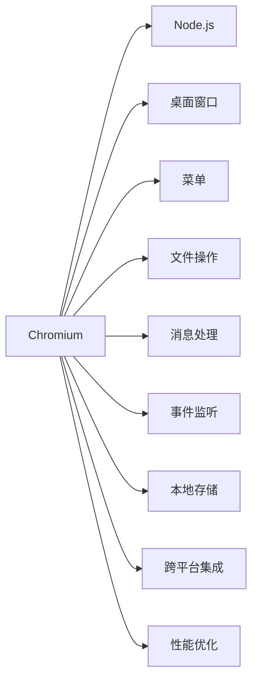

                 

# 跨平台桌面应用开发：Electron框架

> 关键词：跨平台、桌面应用、Electron、JavaScript、Node.js、HTML、CSS

## 1. 背景介绍

在移动和Web技术迅速发展的今天，桌面应用市场逐渐萎缩，但仍有大量用户依赖于桌面软件，如办公软件、游戏等。这些软件往往需要更为复杂的用户交互和本地资源管理，单纯的Web技术已无法满足其需求。Electron框架的诞生，使得开发者能够使用Web技术（JavaScript、HTML、CSS）快速开发跨平台桌面应用，极大地降低了桌面应用开发成本，推动了桌面应用的复兴。

本文将从Electron框架的核心概念出发，探讨其原理、操作步骤、优缺点和应用领域，并通过具体代码实例，详细介绍如何在Electron中实现跨平台桌面应用开发。

## 2. 核心概念与联系

### 2.1 核心概念概述

Electron是一个开源的跨平台框架，允许使用Web技术（JavaScript、HTML、CSS）开发桌面应用。Electron的应用主要由Chromium浏览器和Node.js运行时组成，通过其提供的API，开发者可以方便地实现桌面窗口、菜单、文件操作等桌面应用功能。

### 2.2 核心概念原理和架构的 Mermaid 流程图



### 2.3 核心概念之间的联系

Electron框架通过将Chromium浏览器和Node.js运行时集成在一起，使得开发者可以在同一个进程中同时运行Web技术和本地代码。Chromium负责呈现用户界面，Node.js则负责处理后台逻辑和文件I/O等系统调用。这种集成方式不仅提升了开发效率，还使得跨平台应用开发变得更加便捷。

## 3. 核心算法原理 & 具体操作步骤

### 3.1 算法原理概述

Electron框架的核心算法原理主要体现在以下几个方面：

- **进程管理**：Electron中的每个桌面窗口都是独立的进程，每个进程有自己的运行时和资源管理。通过IPC（进程间通信）机制，不同进程之间可以共享数据和调用API。
- **Web视图集成**：桌面窗口的UI由Web视图组成，通过Chromium的Web技术，可以轻松实现复杂的用户界面和交互效果。
- **本地文件操作**：Electron提供了本地文件系统API，可以在后台异步地执行文件I/O操作，避免阻塞UI线程。
- **热重载和自动更新**：Electron支持热重载和自动更新功能，开发者可以在运行时对应用进行修改和发布，无需重新编译和部署。

### 3.2 算法步骤详解

1. **创建Electron项目**：使用Electron Quick Start或直接安装Electron CLI，创建Electron项目。
2. **编写应用代码**：在Electron中，JavaScript是主要的开发语言，可以使用模块化的方式编写应用逻辑。
3. **构建UI界面**：使用HTML和CSS编写UI界面，通过Web视图呈现到桌面上。
4. **集成本地功能**：使用Electron提供的本地API实现文件操作、菜单、事件监听等功能。
5. **调试和发布**：使用Electron提供的调试工具和打包工具，对应用进行调试和发布。

### 3.3 算法优缺点

**优点**：

- **跨平台开发**：Electron允许开发者使用Web技术跨平台开发桌面应用，无需重复编写代码。
- **快速开发**：Electron提供了丰富的API和工具，使得开发者可以快速实现复杂的桌面功能。
- **热重载和自动更新**：Electron支持热重载和自动更新，开发者可以在运行时修改和发布应用。

**缺点**：

- **资源消耗高**：Electron应用程序占用的内存和CPU资源较高，可能会影响用户体验。
- **渲染性能问题**：由于Electron使用Chromium作为UI渲染引擎，部分复杂的UI操作可能会出现性能瓶颈。
- **安全性问题**：Electron应用程序的本地文件操作需要特别注意安全性，避免出现安全漏洞。

### 3.4 算法应用领域

Electron框架广泛应用于各种类型的桌面应用，包括：

- 办公软件：如Atom、Visual Studio Code、Slack等。
- 多媒体工具：如Brave浏览器、Skype等。
- 游戏：如Electron Steam、Twitch等。
- 实用工具：如Launchy、Nikto等。

## 4. 数学模型和公式 & 详细讲解 & 举例说明

### 4.1 数学模型构建

Electron应用程序的数学模型可以简单地表示为：

$$
A = B + C
$$

其中：

- $A$ 表示Electron应用程序的UI界面，由HTML和CSS构建。
- $B$ 表示Electron的Node.js运行时，负责处理应用逻辑和文件I/O操作。
- $C$ 表示Electron的Chromium渲染引擎，负责呈现UI界面。

### 4.2 公式推导过程

Electron应用程序的核心公式可以进一步推导为：

$$
A = B + C = \sum_{i=1}^{n} (b_i + c_i)
$$

其中：

- $b_i$ 表示Electron的Node.js模块，用于处理特定功能。
- $c_i$ 表示Electron的Chromium模块，用于呈现特定UI界面。

### 4.3 案例分析与讲解

以一个简单的文件管理工具为例，分析其在Electron中的实现。

1. **创建项目**：
```bash
npx create-electron-app my-app
cd my-app
```

2. **编写应用代码**：
```javascript
const { app, BrowserWindow } = require('electron');
let mainWindow;

function createWindow() {
  mainWindow = new BrowserWindow({
    width: 800,
    height: 600,
    webPreferences: {
      nodeIntegration: true,
      contextIsolation: false
    }
  });

  mainWindow.loadURL('http://localhost:9000');
}

app.on('ready', createWindow);
```

3. **构建UI界面**：
在`index.html`中编写UI界面，使用HTML和CSS实现文件选择、显示和操作功能：

```html
<!DOCTYPE html>
<html>
<head>
  <title>File Manager</title>
  <style>
    /* 样式 */
  </style>
</head>
<body>
  <h1>File Manager</h1>
  <input type="file" id="fileInput">
  <ul id="fileList"></ul>
  <button id="deleteBtn">Delete</button>
  <script src="main.js"></script>
</body>
</html>
```

4. **集成本地功能**：
在`main.js`中集成本地功能，使用Electron提供的API实现文件选择、显示和删除操作：

```javascript
const { dialog } = require('electron');
let fileList;

function loadFiles() {
  const files = dialog.showOpenDialogSync(mainWindow, { properties: ['openDirectory'] });
  fileList = files.filePaths.map(filePath => {
    const filename = path.basename(filePath);
    return `<li>${filename}</li>`;
  });
  document.getElementById('fileList').innerHTML = fileList.join('');
}

function deleteFiles() {
  const files = document.querySelectorAll('.file');
  files.forEach(file => {
    const filePath = file.getAttribute('data-path');
    require('fs').unlinkSync(filePath);
  });
}

document.getElementById('fileInput').addEventListener('change', loadFiles);
document.getElementById('deleteBtn').addEventListener('click', deleteFiles);
```

5. **调试和发布**：
使用Electron提供的调试工具和打包工具，对应用进行调试和发布。

```bash
npm run debug
```

## 5. 项目实践：代码实例和详细解释说明

### 5.1 开发环境搭建

Electron项目的开发环境主要依赖Node.js和Chromium浏览器，具体步骤如下：

1. **安装Node.js**：
   - 从官网下载并安装Node.js。
   - 在Linux和macOS系统上，安装最新版本的Node.js。

2. **安装Electron CLI**：
   - 使用npm安装Electron CLI，以便创建Electron项目。

```bash
npm install -g create-electron-app
```

3. **创建Electron项目**：
   - 使用Electron Quick Start或直接创建Electron项目。

```bash
npx create-electron-app my-app
cd my-app
```

### 5.2 源代码详细实现

在Electron项目中，JavaScript是主要的开发语言，可以使用模块化的方式编写应用逻辑。以下是一个简单的桌面应用的示例代码：

**index.js**：
```javascript
const { app, BrowserWindow } = require('electron');
let mainWindow;

function createWindow() {
  mainWindow = new BrowserWindow({
    width: 800,
    height: 600,
    webPreferences: {
      nodeIntegration: true,
      contextIsolation: false
    }
  });

  mainWindow.loadURL('http://localhost:9000');
}

app.on('ready', createWindow);
```

**index.html**：
```html
<!DOCTYPE html>
<html>
<head>
  <title>My App</title>
  <style>
    /* 样式 */
  </style>
</head>
<body>
  <h1>My App</h1>
  <p>Welcome to my Electron app!</p>
</body>
</html>
```

### 5.3 代码解读与分析

**index.js**：

- **导入Electron模块**：使用`require`导入Electron的`app`和`BrowserWindow`模块，方便创建和控制桌面窗口。
- **创建桌面窗口**：使用`BrowserWindow`创建桌面窗口，并设置窗口的宽度和高度。
- **加载UI界面**：使用`loadURL`加载Web界面，默认加载本地的`index.html`文件。

**index.html**：

- **设置标题和样式**：在`<head>`标签中设置页面标题和样式。
- **呈现UI界面**：在`<body>`标签中呈现简单的UI界面。

### 5.4 运行结果展示

在开发完成后，可以通过运行`index.js`文件启动Electron应用。打开桌面，即可看到运行中的应用界面。

## 6. 实际应用场景

Electron框架已经被广泛应用于各种类型的桌面应用，以下是几个典型的应用场景：

### 6.1 办公软件

Electron的跨平台特性和热重载功能，使得开发者可以快速开发办公软件，如Atom、Visual Studio Code等。这些工具在开发和调试过程中，可以通过热重载进行实时修改，无需重新编译和部署。

### 6.2 多媒体工具

Electron框架也适合开发多媒体工具，如Brave浏览器、Skype等。这些应用在运行时，可以利用Node.js处理后台逻辑，并通过Chromium呈现UI界面，提供流畅的用户体验。

### 6.3 游戏

Electron的跨平台特性和可扩展性，使得开发者可以开发跨平台游戏，如Electron Steam、Twitch等。这些游戏在运行时，可以通过Electron实现跨平台的集成和优化。

### 6.4 实用工具

Electron框架也适合开发各种实用工具，如Launchy、Nikto等。这些工具在运行时，可以利用Node.js处理本地文件操作和事件监听，并通过Chromium呈现UI界面，提供丰富的功能和便捷的操作。

## 7. 工具和资源推荐

### 7.1 学习资源推荐

为了帮助开发者系统掌握Electron框架的核心概念和应用技巧，这里推荐一些优质的学习资源：

1. **Electron官方文档**：
   - 提供了完整的Electron API和教程，是Electron开发者的必备资料。
   - 网址：[https://www.electronjs.org/docs](https://www.electronjs.org/docs)

2. **《Electron实战》一书**：
   - 系统介绍了Electron的核心原理和开发技巧，适合初学者和有经验的开发者阅读。
   - 网址：[https://book.douban.com/subject/35038405/](https://book.douban.com/subject/35038405/)

3. **《Node.js设计模式》一书**：
   - 详细讲解了Node.js和Electron的编程模式和设计原则，适合Electron开发者阅读。
   - 网址：[https://book.douban.com/subject/27718706/](https://book.douban.com/subject/27718706/)

4. **《JavaScript权威指南》一书**：
   - 详细介绍了JavaScript编程语言的核心特性和开发技巧，适合Electron开发者阅读。
   - 网址：[https://book.douban.com/subject/26521276/](https://book.douban.com/subject/26521276/)

5. **Electron社区和论坛**：
   - 提供了丰富的学习资源和社区支持，适合Electron开发者交流和学习。
   - 网址：[https://discuss.electronjs.org/](https://discuss.electronjs.org/)

### 7.2 开发工具推荐

为了提高Electron应用的开发效率和性能，这里推荐一些常用的开发工具：

1. **Visual Studio Code**：
   - 支持Electron的开发环境，提供了丰富的插件和调试工具。
   - 网址：[https://code.visualstudio.com/](https://code.visualstudio.com/)

2. **NPM包管理器**：
   - 提供了Electron项目中需要的各种模块和库，方便开发者快速集成和使用。
   - 网址：[https://www.npmjs.com/](https://www.npmjs.com/)

3. **Webpack打包工具**：
   - 支持Electron项目的打包和发布，可以将应用编译为可执行文件或发布到应用商店。
   - 网址：[https://webpack.js.org/](https://webpack.js.org/)

4. **Chrome DevTools**：
   - 提供了Electron应用的调试和性能分析工具，方便开发者调试和优化。
   - 网址：[https://developers.google.com/web/tools/chrome-devtools/](https://developers.google.com/web/tools/chrome-devtools/)

### 7.3 相关论文推荐

Electron框架的研究论文主要集中在跨平台开发和UI渲染等方面，以下是几篇具有代表性的论文：

1. **《Cross-Platform Development with Electron》**：
   - 详细介绍了Electron的核心原理和应用场景，是Electron开发的经典论文。
   - 网址：[https://www.electronjs.org/docs/latest/tutorial/cross-platform-development](https://www.electronjs.org/docs/latest/tutorial/cross-platform-development)

2. **《Electron: Cross-Platform Browser-Based Applications with JavaScript, HTML and CSS》**：
   - 介绍了Electron框架的核心技术架构和API设计，适合Electron开发者阅读。
   - 网址：[https://medium.com/@nate.thompson/electron-4f4cdcc49ca2](https://medium.com/@nate.thompson/electron-4f4cdcc49ca2)

3. **《Electron: Building Cross-Platform Applications with JavaScript, HTML, and CSS》**：
   - 详细介绍了Electron的跨平台特性和开发技巧，适合Electron开发者阅读。
   - 网址：[https://www.electronjs.org/docs/latest/tutorial/cross-platform-development](https://www.electronjs.org/docs/latest/tutorial/cross-platform-development)

## 8. 总结：未来发展趋势与挑战

### 8.1 总结

本文对Electron框架的核心概念和应用技巧进行了全面系统的介绍，从原理到实践，详细讲解了Electron应用程序的开发流程。通过具体代码实例，展示了如何在Electron中实现跨平台桌面应用开发，并分析了Electron框架的优缺点和应用领域。

### 8.2 未来发展趋势

展望未来，Electron框架将呈现以下几个发展趋势：

1. **持续优化**：Electron社区将继续优化框架性能和API设计，提升Electron应用的开发效率和用户体验。
2. **生态系统完善**：Electron的生态系统将不断扩展，出现更多的第三方模块和插件，使得开发者能够更方便地使用Electron进行开发。
3. **跨平台集成**：Electron将继续探索跨平台集成的更多可能性，如跨平台桌面应用、Web应用等，为开发者提供更多选择。
4. **多语言支持**：Electron将逐步支持更多编程语言，如Python、Go等，使得开发者能够使用更熟悉的语言进行开发。

### 8.3 面临的挑战

Electron框架在发展过程中，也面临一些挑战：

1. **资源消耗高**：Electron应用程序占用的内存和CPU资源较高，可能会影响用户体验。
2. **渲染性能问题**：由于Electron使用Chromium作为UI渲染引擎，部分复杂的UI操作可能会出现性能瓶颈。
3. **安全性问题**：Electron应用程序的本地文件操作需要特别注意安全性，避免出现安全漏洞。

### 8.4 研究展望

未来，Electron框架的研究方向将集中在以下几个方面：

1. **性能优化**：提高Electron应用程序的性能和稳定性，降低资源消耗。
2. **跨平台集成**：探索跨平台集成的更多可能性，为开发者提供更多选择。
3. **安全性和可靠性**：提高Electron应用程序的安全性和可靠性，保障用户数据和隐私安全。
4. **社区生态建设**：完善Electron社区生态，吸引更多开发者和用户参与，推动Electron框架的发展。

这些研究方向将推动Electron框架向更加成熟、稳定的方向发展，为跨平台桌面应用的开发提供更坚实的技术基础。

## 9. 附录：常见问题与解答

**Q1：Electron框架和Node.js是什么关系？**

A: Electron框架是基于Node.js构建的，使用Node.js运行时执行后端逻辑，并通过Chromium呈现UI界面。Node.js提供了丰富的系统调用和模块，使得Electron应用程序能够高效地处理本地文件操作和网络请求等后台逻辑。

**Q2：Electron应用程序如何处理桌面事件？**

A: Electron框架提供了丰富的API，方便开发者处理桌面事件。可以使用Electron提供的`event`模块监听和响应桌面事件，如窗口关闭、菜单点击等。

**Q3：Electron应用程序如何进行热重载？**

A: Electron框架支持热重载功能，开发者可以在运行时对应用进行修改和发布，无需重新编译和部署。可以使用Electron提供的`electron-reload`模块实现热重载。

**Q4：Electron应用程序如何处理本地文件操作？**

A: Electron框架提供了丰富的API，方便开发者处理本地文件操作。可以使用Electron提供的`fs`模块读取、写入、删除等文件操作。

**Q5：Electron应用程序如何进行性能优化？**

A: Electron应用程序的性能优化可以从多个方面进行，如减少内存占用、优化渲染性能、使用异步操作等。可以使用Electron提供的`ipcRenderer`和`ipcMain`模块实现进程间通信，优化渲染性能。

这些问题的解答可以帮助Electron开发者更好地理解Electron框架的核心概念和应用技巧，快速解决实际开发中遇到的问题。

---

作者：禅与计算机程序设计艺术 / Zen and the Art of Computer Programming

