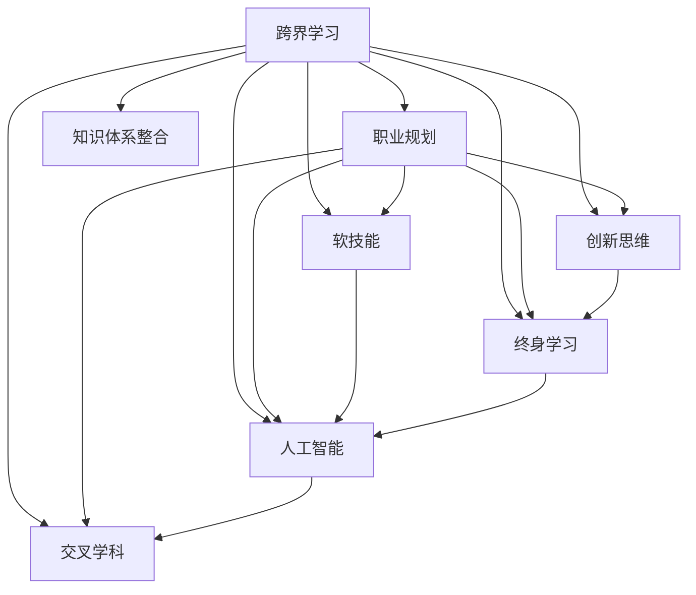
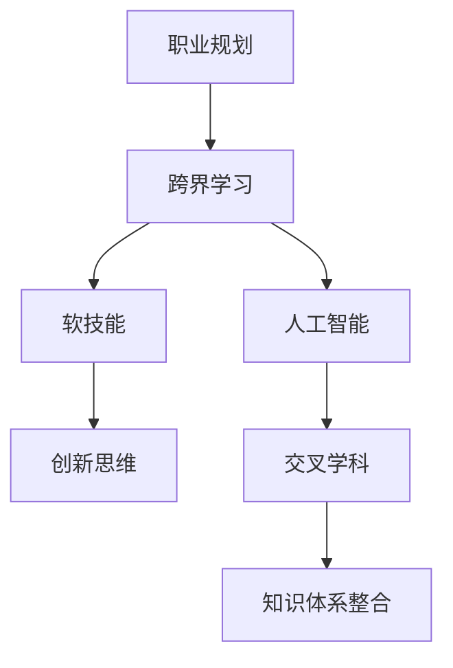

                 

# 跨界学习：拓宽职业发展空间

> 关键词：跨界学习, 职业规划, 软技能, 创新思维, 终身学习, 人工智能, 交叉学科

## 1. 背景介绍

### 1.1 问题由来
在数字化时代，职业发展的路径不再局限于单一领域的精深研究，跨界学习成为了快速获取新技能、拓宽职业视野的重要途径。尤其是在信息爆炸、技术迭代加速的今天，跨界学习不仅能够提升个人的核心竞争力，还能帮助企业在激烈的市场竞争中保持领先。然而，跨界学习的实践往往面临诸多挑战，如时间管理、资源获取、知识体系整合等。本文将从理论上阐述跨界学习的核心概念与联系，从技术上分享跨界学习的具体操作方法，并展望其未来的发展趋势与挑战。

### 1.2 问题核心关键点
跨界学习的核心在于跨越不同领域，吸取各自学科的优势，形成一套新的认知体系和方法论。这种学习方式不仅要求学习者具备广泛的兴趣和好奇心，还需要掌握科学的学习方法和工具。

- **核心概念**：跨界学习、职业规划、软技能、创新思维、终身学习、人工智能、交叉学科。
- **关键问题**：时间管理、资源获取、知识体系整合、方法论应用、跨学科沟通。

## 2. 核心概念与联系

### 2.1 核心概念概述

跨界学习是一种跨越不同学科领域、汲取知识精华，并将其应用于新领域的综合性学习过程。其核心在于打破传统学科的边界，将多元化的知识融会贯通，从而获得更广泛、更深入的认知和技能。以下是跨界学习的核心概念及其关系图：



### 2.2 核心概念原理和架构的 Mermaid 流程图



## 3. 核心算法原理 & 具体操作步骤
### 3.1 算法原理概述

跨界学习的核心算法原理基于认知心理学和教育学，旨在通过不同学科知识的交叉融合，激发创新思维和问题解决能力。具体而言，跨界学习包括以下几个步骤：

1. **明确目标**：确定希望掌握的新技能和知识领域。
2. **选择资源**：搜集和学习该领域的经典教材、最新研究成果、实践案例。
3. **整合知识**：将不同学科的知识进行系统整合，构建新的知识体系。
4. **应用实践**：将新知识应用于实际问题解决和项目中，检验其有效性。
5. **持续改进**：根据反馈不断调整学习策略和方法，优化知识体系。

### 3.2 算法步骤详解

以下是一个详细的跨界学习操作步骤：

1. **目标设定**：明确自己希望达到的目标，如学习编程以提升数据科学能力。
2. **资源搜集**：收集相关的编程语言教程、数据科学框架使用手册、开源项目等。
3. **学习计划**：制定详细的学习计划，包括每天的学习时间、学习内容、实践项目等。
4. **知识整合**：将编程知识和数据科学理论结合起来，构建新的知识体系。
5. **实践应用**：通过完成数据科学项目，如数据清洗、模型训练、可视化等，将所学知识应用到实际问题中。
6. **反馈评估**：通过项目反馈、学习成果评估等手段，调整学习策略，优化知识体系。

### 3.3 算法优缺点

**优点**：
- **多学科结合**：通过跨界学习，可以融合不同领域的知识和技能，拓宽视野。
- **创新思维**：不同学科的知识交叉可以激发新的思维方式，有助于解决复杂问题。
- **灵活应用**：跨界学习者具备更广泛的适应性和应用能力，能够应对多种职业需求。

**缺点**：
- **时间成本高**：跨界学习需要花费大量时间和精力，短期内难以见效。
- **资源获取难**：不同领域的知识资源分散，搜集和整合难度大。
- **知识整合难**：不同学科的知识体系存在差异，整合难度较大。

### 3.4 算法应用领域

跨界学习可以广泛应用于以下领域：

- **技术开发**：如数据科学家通过学习人工智能和机器学习，提升解决问题的能力。
- **项目管理**：如项目经理通过学习敏捷开发和项目管理知识，提升团队协作效率。
- **创新创业**：如创业者通过跨界学习，结合多个领域的知识，开发具有创新性的产品和服务。
- **教育培训**：如教师通过学习心理学的知识，提升教学效果和学生管理能力。

## 4. 数学模型和公式 & 详细讲解 & 举例说明

### 4.1 数学模型构建

跨界学习的数学模型可以表示为：

$$
L(\text{知识体系}, \text{目标技能}) = \sum_{i=1}^n \alpha_i \times \text{贡献度}_i
$$

其中，$\text{知识体系}$ 表示跨界学习者整合的知识体系，$\text{目标技能}$ 表示希望掌握的新技能。$\alpha_i$ 为每个知识点的权重，$\text{贡献度}_i$ 表示该知识点对目标技能的贡献程度。

### 4.2 公式推导过程

根据公式，每个知识点的贡献度计算公式为：

$$
\text{贡献度}_i = f(\text{知识点难度}, \text{知识点相关性}, \text{知识点应用场景})
$$

其中，$f$ 为函数，表示贡献度的计算方法。

### 4.3 案例分析与讲解

假设学习者希望通过跨界学习掌握数据科学技能。其知识体系包括编程语言（Python）、数据处理框架（Pandas、NumPy）、机器学习算法（Scikit-learn）等。每个知识点的贡献度可以通过专家评估或实际应用效果来计算。

## 5. 项目实践：代码实例和详细解释说明
### 5.1 开发环境搭建

跨界学习不需要复杂的环境搭建，只需要安装相关的开发工具和环境即可。以Python为例，可以进行以下步骤：

1. 安装Python和相关库：
```bash
sudo apt-get install python3
pip3 install numpy pandas scikit-learn matplotlib
```

2. 创建虚拟环境：
```bash
python3 -m venv myenv
source myenv/bin/activate
```

### 5.2 源代码详细实现

以下是一个Python项目实践的示例，学习者通过跨界学习掌握数据科学技能。

```python
import pandas as pd
import numpy as np
from sklearn.linear_model import LinearRegression

# 读取数据集
data = pd.read_csv('data.csv')

# 数据清洗
data = data.dropna()

# 特征工程
features = data[['feature1', 'feature2']]
target = data['target']

# 模型训练
model = LinearRegression()
model.fit(features, target)

# 模型评估
score = model.score(features, target)
print(f'模型精度：{score:.3f}')
```

### 5.3 代码解读与分析

1. 数据清洗和特征工程是数据科学的基础，通过跨界学习，学习者可以同时掌握Python编程、数据分析和机器学习技能。
2. 使用Scikit-learn库的线性回归模型进行训练和评估，展示了数据科学的核心步骤。
3. 通过不断调整代码，学习者可以深入理解数据科学的基本流程和常用算法。

### 5.4 运行结果展示

运行上述代码，输出模型精度，展示了数据科学项目的基本流程和结果评估。

## 6. 实际应用场景

### 6.1 技术开发

在技术开发领域，跨界学习可以提升开发者的综合能力，使其具备多领域的专业知识。例如，前端开发人员通过学习后端开发知识，可以更全面地理解Web应用架构；系统管理员通过学习编程技能，可以更好地维护和优化系统性能。

### 6.2 项目管理

项目管理不仅需要掌握项目管理的理论知识，还需要具备技术背景和沟通能力。通过跨界学习，项目经理可以了解不同技术领域的知识，更好地协调团队工作，提升项目管理效率。

### 6.3 创新创业

创业者需要具备多方面的综合素质，如技术能力、市场洞察力、创新思维等。通过跨界学习，创业者可以整合不同领域的知识，开发具有创新性的产品和服务，提升企业的竞争力。

## 7. 工具和资源推荐
### 7.1 学习资源推荐

为了帮助学习者系统掌握跨界学习的理论基础和实践技巧，推荐以下资源：

1. 《跨界思维：未来竞争力之源》：介绍如何通过跨界学习提升核心竞争力。
2. Coursera和edX的跨学科课程：提供广泛的跨学科知识和技能学习平台。
3. Udacity的纳米学位课程：提供系统化的跨界学习路径和项目实践。
4. YouTube和TED的跨界学习讲座：获取跨界学习的最新研究和方法论。

### 7.2 开发工具推荐

跨界学习的开发工具主要以编程和数据处理工具为主，推荐以下工具：

1. Python：功能强大的编程语言，广泛应用于数据科学和人工智能领域。
2. Jupyter Notebook：交互式的编程环境，方便进行数据科学项目的开发和分享。
3. Git：版本控制工具，方便团队协作和代码管理。
4. GitHub：代码托管平台，提供丰富的开源项目和协作工具。

### 7.3 相关论文推荐

跨界学习的相关论文可以从不同角度探讨其方法和应用，推荐以下几篇：

1.《跨学科学习在教育中的作用》：研究跨学科学习对学生知识结构的影响。
2.《创新思维与跨界学习：一种新的学习模式》：探讨跨界学习如何激发创新思维。
3.《跨界学习在技术开发中的应用》：介绍跨界学习在软件开发和数据科学中的应用案例。

## 8. 总结：未来发展趋势与挑战

### 8.1 研究成果总结

跨界学习已经成为提高个人和组织竞争力的重要手段，其理论基础和实践方法不断得到完善和应用。跨界学习不仅拓展了学习者的认知边界，还激发了创新思维和问题解决能力。

### 8.2 未来发展趋势

1. **技术融合**：跨界学习将与人工智能、大数据、区块链等前沿技术深度融合，形成更加全面的技术解决方案。
2. **多领域协作**：跨界学习将推动不同领域之间的协作，形成跨学科的知识网络，提升创新能力。
3. **终身学习**：跨界学习将成为终身学习的核心方式，帮助学习者持续适应快速变化的技术和社会环境。
4. **知识共享**：跨界学习将促进知识共享和传播，形成全球化的知识生态系统。

### 8.3 面临的挑战

尽管跨界学习具有诸多优点，但在实践中仍面临诸多挑战：

1. **时间管理**：跨界学习需要投入大量时间和精力，如何合理安排时间是一个难题。
2. **资源获取**：不同领域的知识资源分散，获取和整合难度大。
3. **知识整合**：不同学科的知识体系存在差异，整合难度较大。
4. **应用实践**：跨界学习者如何将新知识应用到实际问题中，是一个关键难题。
5. **持续改进**：跨界学习者如何根据反馈不断调整学习策略，优化知识体系。

### 8.4 研究展望

未来，跨界学习将在以下几个方面寻求新的突破：

1. **自动化学习**：开发自动化学习工具，帮助学习者高效整合不同领域的知识。
2. **智能化推荐**：利用AI技术，推荐学习者最相关的跨界学习资源和路径。
3. **个性化学习**：根据学习者的兴趣和能力，定制个性化的跨界学习计划。
4. **跨学科评估**：开发跨学科评估工具，衡量跨界学习的成效和贡献度。

## 9. 附录：常见问题与解答

**Q1：跨界学习的核心是什么？**

A: 跨界学习的核心在于跨越不同学科，汲取知识精华，并将其应用于新领域。

**Q2：跨界学习需要多长时间才能见效？**

A: 跨界学习的效果取决于学习者的投入和实践，通常需要数月到数年才能见效。

**Q3：跨界学习有哪些推荐的学习平台？**

A: 推荐使用Coursera、edX、Udacity等在线学习平台，获取跨界学习的课程和项目。

**Q4：跨界学习如何应用到实际项目中？**

A: 通过参与实际项目，如开源贡献、行业竞赛、企业实践等，将新知识应用到实际问题中。

**Q5：跨界学习如何应对知识整合的挑战？**

A: 通过系统化的学习计划和项目实践，逐步整合不同领域的知识，构建新的知识体系。

---

作者：禅与计算机程序设计艺术 / Zen and the Art of Computer Programming

