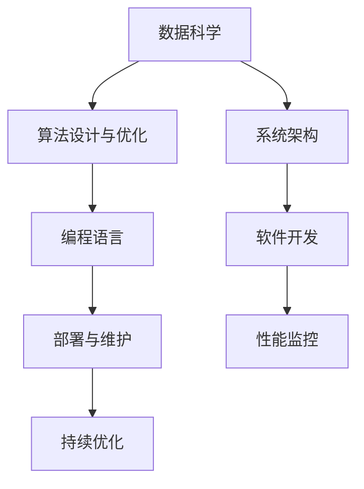

                 

# 跨界知识整合:程序员的独特优势

> 关键词：跨界知识整合, 程序员优势, 算法与数学, 数据科学, 编程语言, 软件开发

## 1. 背景介绍

### 1.1 问题由来

在当前技术快速迭代和各行各业加速数字化的背景下，跨界知识整合变得尤为重要。一方面，知识碎片化现象日益严重，各个领域的专业知识相互渗透、融合，构建起了一个复杂的知识网络；另一方面，技术创新驱动各行各业不断向智能化、自动化、个性化方向发展，对跨学科知识的理解和应用提出了更高要求。

程序员作为技术领域的重要一员，具备独特的数据和算法处理优势，能够从更广泛的视角理解数据、挖掘价值、构建模型，并在实践中灵活运用跨界知识。本文旨在探讨程序员在跨界知识整合中的独特优势，并以此为基础，探讨其在现代科技和产业变革中的重要角色。

### 1.2 问题核心关键点

跨界知识整合的核心关键点在于如何将不同领域的专业知识有机整合，形成更加全面、深入的洞察力，为技术创新和行业应用提供支持。程序员在这一过程中具备以下独特优势：

- **数据处理能力**：程序员擅长于数据清洗、数据建模、数据可视化等技术手段，能够高效处理和整合海量数据。
- **算法设计和优化**：具备深厚的算法理论基础和实践经验，能够在数据整合的基础上，设计和优化高效的算法模型。
- **编程语言技能**：熟悉多种编程语言，能够快速构建和部署跨界应用系统。
- **系统架构思维**：具备系统架构设计能力，能够构建可靠、可扩展、高效的技术架构，实现跨界应用的高质量部署。
- **持续学习和适应能力**：在不断变化的技术环境中，程序员能够快速学习新技术，适应新趋势。

这些优势使得程序员在跨界知识整合中发挥着不可替代的作用。本文将从算法原理、操作步骤、数学模型等多个维度，深入探讨程序员在这一过程中的独特优势。

## 2. 核心概念与联系

### 2.1 核心概念概述

跨界知识整合是指将不同领域的专业知识进行有机整合，形成新的知识体系，以解决跨学科的复杂问题。这一过程涉及数据处理、算法设计、编程实现等多个环节，需要综合运用多种技术手段和方法。

程序员在这一过程中，可以通过以下核心概念进行指导：

- **数据科学**：包括数据采集、数据清洗、数据探索、数据建模、数据可视化等技术手段，帮助理解数据背后的业务和科学意义。
- **算法设计与优化**：涉及各类经典算法和高级算法，如机器学习、深度学习、优化算法等，帮助构建高效、准确的模型。
- **编程语言**：如Python、R、Java、C++等，是实现跨界知识整合应用的基础工具。
- **系统架构**：包括系统设计原则、架构模式、技术选型等，保证系统的高可用性、可扩展性和可维护性。
- **软件开发**：包括软件开发流程、版本控制、测试与部署等，保证应用的高质量、高效率。

这些概念之间存在紧密联系，共同构成了程序员在跨界知识整合中的核心工作框架。

### 2.2 核心概念原理和架构的 Mermaid 流程图(Mermaid 流程节点中不要有括号、逗号等特殊字符)



这个流程图展示了跨界知识整合的基本流程和技术架构。

## 3. 核心算法原理 & 具体操作步骤

### 3.1 算法原理概述

跨界知识整合的核心在于数据和算法的有机结合。程序员在这一过程中，通常会按照以下步骤进行：

1. **数据获取与预处理**：通过网络爬虫、API接口等方式获取数据，并进行清洗、去重、标注等预处理工作。
2. **特征工程与建模**：选择和构造合适的特征，设计有效的模型，并进行训练和调参，构建数据驱动的解决方案。
3. **算法优化与评估**：对模型进行优化，提升模型性能，并通过交叉验证、A/B测试等方式进行评估和验证。
4. **系统集成与部署**：将模型和算法集成到系统中，并进行性能监控和持续优化。

### 3.2 算法步骤详解

以推荐系统为例，下面是基于跨界知识整合的步骤详解：

**Step 1: 数据获取与预处理**

- 从电商平台、社交网络、视频平台等数据源获取用户行为数据，包括浏览记录、购买记录、评分记录等。
- 清洗数据，处理缺失值和异常值，去除重复数据。
- 将数据分为训练集、验证集和测试集，以便于后续模型的评估和调参。

**Step 2: 特征工程与建模**

- 选择和构造特征，如用户ID、物品ID、浏览时间、购买金额等。
- 进行数据标准化和归一化处理，构建数据驱动的模型。
- 使用机器学习或深度学习模型，如协同过滤、矩阵分解、神经网络等，进行模型训练和调参。

**Step 3: 算法优化与评估**

- 对模型进行优化，提升模型的预测准确率和计算效率。
- 使用交叉验证、A/B测试等方式进行模型评估，选择最优模型。
- 进行模型评估，计算指标如准确率、召回率、F1值等，验证模型效果。

**Step 4: 系统集成与部署**

- 将模型集成到推荐系统中，进行性能监控和持续优化。
- 使用缓存、负载均衡等技术，提高系统的处理能力和稳定性。
- 对系统进行测试，确保系统的稳定性和可靠性。

### 3.3 算法优缺点

跨界知识整合的算法具有以下优点：

- **高效性**：能够高效处理和整合海量数据，快速构建和部署跨界应用系统。
- **准确性**：通过科学合理的建模和优化，构建高效、准确的模型。
- **可扩展性**：能够灵活扩展系统架构，支持多种数据源和算法模型。

但同时也存在以下缺点：

- **高复杂度**：涉及数据处理、算法设计、编程实现等多个环节，技术难度较大。
- **数据隐私**：跨界数据整合可能涉及敏感信息，需要考虑数据隐私和法律合规问题。
- **模型可解释性**：复杂模型可能难以解释其内部工作机制，需要结合业务逻辑进行调试和优化。

### 3.4 算法应用领域

跨界知识整合的算法在多个领域得到了广泛应用，例如：

- **个性化推荐系统**：通过整合用户行为数据和商品信息，为用户推荐个性化商品。
- **智能客服系统**：通过整合用户对话记录和自然语言处理技术，提供智能客服解决方案。
- **金融风险管理**：通过整合市场数据和用户行为数据，进行风险识别和预测。
- **医疗诊断系统**：通过整合患者历史数据和医学知识库，提供智能诊断服务。
- **智能制造**：通过整合生产数据和设备状态信息，优化生产流程，提高生产效率。

这些应用场景展示了跨界知识整合的强大潜力和广泛价值。

## 4. 数学模型和公式 & 详细讲解 & 举例说明

### 4.1 数学模型构建

在跨界知识整合中，数学模型通常包括数据模型和算法模型。

**数据模型**：包括统计模型、时间序列模型、非参数模型等，用于描述数据分布和关系。

**算法模型**：包括回归模型、分类模型、聚类模型、神经网络等，用于预测和优化数据驱动的决策。

### 4.2 公式推导过程

以线性回归模型为例，公式推导如下：

设 $x_i$ 为第 $i$ 个样本的特征向量，$y_i$ 为对应的目标变量，$\theta$ 为模型参数。线性回归模型的目标是最小化预测值和实际值之间的误差，即：

$$
\min_{\theta} \sum_{i=1}^n (y_i - \theta \cdot x_i)^2
$$

其中，$\theta$ 可以通过梯度下降等优化算法求解，求解公式为：

$$
\theta = \left( \frac{1}{n} \sum_{i=1}^n x_i x_i^T \right)^{-1} \cdot \frac{1}{n} \sum_{i=1}^n x_i y_i
$$

### 4.3 案例分析与讲解

假设有一个电商平台的推荐系统，需要根据用户的历史行为数据推荐商品。使用线性回归模型，可以将用户行为数据 $x$ 和商品评分 $y$ 作为输入，通过求解 $\theta$ 得到预测评分，进而推荐商品。

**Step 1: 数据获取与预处理**

- 从电商平台获取用户行为数据和商品评分数据。
- 清洗数据，去除重复数据和异常值。
- 将数据分为训练集、验证集和测试集。

**Step 2: 特征工程与建模**

- 选择用户ID、物品ID、浏览时间、购买金额等特征。
- 进行数据标准化和归一化处理。
- 构建线性回归模型，训练和调参。

**Step 3: 算法优化与评估**

- 对模型进行优化，提升模型的预测准确率和计算效率。
- 使用交叉验证、A/B测试等方式进行模型评估。
- 计算准确率、召回率、F1值等指标，验证模型效果。

**Step 4: 系统集成与部署**

- 将模型集成到推荐系统中，进行性能监控和持续优化。
- 使用缓存、负载均衡等技术，提高系统的处理能力和稳定性。
- 对系统进行测试，确保系统的稳定性和可靠性。

## 5. 项目实践：代码实例和详细解释说明

### 5.1 开发环境搭建

为了高效进行跨界知识整合的应用开发，需要搭建一个合适的开发环境。以下是推荐系统开发的基本环境配置：

**Step 1: 环境安装**

- 安装Python，建议使用3.8或以上版本。
- 安装TensorFlow、Pandas、Numpy、Scikit-learn等常用库。
- 安装Docker等容器化工具，方便后续的部署和测试。

**Step 2: 数据准备**

- 收集电商平台的用户行为数据和商品评分数据。
- 进行数据清洗和预处理，去除重复数据和异常值。
- 将数据分为训练集、验证集和测试集。

### 5.2 源代码详细实现

以下是使用TensorFlow进行线性回归模型的源代码实现：

```python
import tensorflow as tf
import numpy as np
import pandas as pd

# 加载数据
data = pd.read_csv('data.csv')
x = data[['user_id', 'item_id', 'time', 'amount']]
y = data['score']

# 构建模型
model = tf.keras.models.Sequential([
    tf.keras.layers.Dense(64, activation='relu', input_shape=[4]),
    tf.keras.layers.Dense(1)
])

# 编译模型
model.compile(optimizer=tf.keras.optimizers.Adam(0.001), loss='mse')

# 训练模型
model.fit(x, y, epochs=10, batch_size=32, validation_data=(val_x, val_y))

# 测试模型
test_x = test_data
test_y = test_data['score']
test_loss = model.evaluate(test_x, test_y)
print('Test Loss:', test_loss)
```

### 5.3 代码解读与分析

在上述代码中，首先加载数据，并对数据进行清洗和预处理。然后，构建一个包含两个全连接层的神经网络模型，并使用Adam优化器进行训练。最后，对模型进行评估和测试。

**代码解释**：

- `pd.read_csv`：读取CSV格式的数据文件。
- `tf.keras.models.Sequential`：定义一个顺序神经网络模型。
- `tf.keras.layers.Dense`：定义一个全连接层，激活函数为ReLU。
- `model.compile`：编译模型，设置优化器和损失函数。
- `model.fit`：训练模型，设置训练轮数和批量大小。
- `model.evaluate`：评估模型，计算测试集的损失。

## 6. 实际应用场景

### 6.1 个性化推荐系统

个性化推荐系统通过整合用户行为数据和商品信息，为用户推荐个性化商品，是跨界知识整合的重要应用场景。

**实际案例**：某电商平台使用跨界知识整合技术，基于用户浏览、购买历史数据，推荐用户可能感兴趣的商品，提升了用户满意度和销售额。

### 6.2 智能客服系统

智能客服系统通过整合用户对话记录和自然语言处理技术，提供智能客服解决方案，能够24小时不间断服务，提高客户咨询体验。

**实际案例**：某客服系统使用跨界知识整合技术，将用户对话数据和FAQ库进行整合，实现自动问答和智能推荐，提高了客服响应速度和用户满意度。

### 6.3 金融风险管理

金融风险管理通过整合市场数据和用户行为数据，进行风险识别和预测，能够及时发现和规避风险。

**实际案例**：某银行使用跨界知识整合技术，基于客户交易记录和市场数据，构建风险预测模型，及时发现异常交易，避免了潜在的金融风险。

### 6.4 医疗诊断系统

医疗诊断系统通过整合患者历史数据和医学知识库，提供智能诊断服务，能够提高诊断准确率和效率。

**实际案例**：某医院使用跨界知识整合技术，将患者电子病历和医学知识库进行整合，构建智能诊断模型，提升了诊断准确率和医生工作效率。

### 6.5 智能制造

智能制造通过整合生产数据和设备状态信息，优化生产流程，提高生产效率和产品质量。

**实际案例**：某制造企业使用跨界知识整合技术，基于设备状态数据和生产数据，构建预测性维护模型，优化生产流程，提高了生产效率和产品质量。

## 7. 工具和资源推荐

### 7.1 学习资源推荐

为了帮助程序员系统掌握跨界知识整合的理论基础和实践技巧，以下是一些优质的学习资源：

1. **《Python数据科学手册》**：详细介绍了Python在数据科学和机器学习中的应用。
2. **Coursera《机器学习》课程**：由斯坦福大学提供，涵盖机器学习的基础理论和实践方法。
3. **Kaggle竞赛**：提供大量数据集和竞赛项目，帮助程序员锻炼数据处理和模型优化能力。
4. **GitHub开源项目**：包含大量跨界知识整合的应用案例和代码实现。
5. **Scikit-learn官方文档**：详细介绍了Scikit-learn库的使用方法和经典算法。

### 7.2 开发工具推荐

以下是几款用于跨界知识整合开发的常用工具：

1. **Python**：广泛使用的编程语言，支持多种数据处理和机器学习库。
2. **TensorFlow**：由Google开发的深度学习框架，支持大规模分布式计算。
3. **Pandas**：用于数据处理和分析的Python库，支持大规模数据集的处理。
4. **Jupyter Notebook**：用于数据科学和机器学习的交互式编程环境。
5. **Git**：版本控制系统，支持团队协作和代码版本管理。

### 7.3 相关论文推荐

以下是几篇奠基性的相关论文，推荐阅读：

1. **《Deep Learning》**：由Goodfellow等著，详细介绍了深度学习的基本原理和算法。
2. **《Pattern Recognition and Machine Learning》**：由Bishop著，介绍了模式识别和机器学习的基础理论。
3. **《Programming Large-Scale Machine Learning Systems: Practical Lessons from Real-World Deployments》**：介绍了大规模机器学习系统的实践经验和最佳实践。
4. **《Deep Architectures for Natural Language Processing》**：介绍了深度学习在自然语言处理中的应用。
5. **《Programming and Architecting with TensorFlow》**：介绍了TensorFlow的使用和架构设计。

## 8. 总结：未来发展趋势与挑战

### 8.1 研究成果总结

本文从数据科学、算法设计与优化、编程语言、系统架构等多个维度，详细探讨了程序员在跨界知识整合中的独特优势。程序员在这一过程中，具备数据处理、算法优化、编程实现等多方面的综合能力，能够在跨界知识整合中发挥重要作用。

### 8.2 未来发展趋势

展望未来，跨界知识整合将呈现以下几个发展趋势：

1. **跨界知识网络的构建**：通过构建跨界知识网络，实现知识之间的互连互通，形成更加全面、深入的洞察力。
2. **知识图谱的应用**：利用知识图谱技术，将跨界知识进行结构化和层次化表示，提升知识的组织和管理效率。
3. **AI与大数据的融合**：结合人工智能和大数据技术，实现跨界知识的高效整合和深度挖掘。
4. **多模态融合**：结合语音、图像、视频等多模态数据，实现跨界知识的多维度整合。
5. **区块链技术的应用**：利用区块链技术，保障跨界数据的安全和透明。

### 8.3 面临的挑战

尽管跨界知识整合在多个领域得到了广泛应用，但在实现过程中仍面临诸多挑战：

1. **数据隐私和安全**：跨界数据整合涉及大量敏感信息，需要考虑数据隐私和法律合规问题。
2. **模型可解释性**：复杂模型难以解释其内部工作机制，需要结合业务逻辑进行调试和优化。
3. **跨界知识冲突**：不同领域的专业知识可能存在冲突，需要进行合理融合。
4. **技术难度较大**：涉及数据处理、算法设计、编程实现等多个环节，技术难度较大。
5. **系统复杂度较高**：跨界应用系统需要复杂的技术架构支持，设计和管理难度较大。

### 8.4 研究展望

为了克服这些挑战，未来的研究需要在以下几个方面寻求新的突破：

1. **数据隐私保护**：研究数据隐私保护技术，保障跨界数据的安全和透明。
2. **模型可解释性**：研究可解释性算法，提升模型的透明度和可解释性。
3. **知识融合技术**：研究跨界知识融合技术，实现知识的有效整合。
4. **技术栈优化**：研究技术栈优化方法，提升系统的可维护性和可扩展性。
5. **知识图谱应用**：研究知识图谱技术，构建跨界知识网络，提升知识的组织和管理效率。

总之，跨界知识整合是现代科技和产业变革的重要驱动力，程序员在这一过程中具备独特优势，将不断推动跨界知识整合技术的发展和应用。

## 9. 附录：常见问题与解答

### Q1: 跨界知识整合的难点有哪些？

**A:** 跨界知识整合的难点主要包括数据隐私和安全问题、模型可解释性问题、跨界知识冲突问题、技术难度较大和系统复杂度较高。这些问题需要结合具体的业务需求和技术手段进行综合解决。

### Q2: 程序员在跨界知识整合中扮演什么角色？

**A:** 程序员在跨界知识整合中扮演核心角色，具备数据处理、算法设计、编程实现等多方面的综合能力，能够在跨界知识整合中发挥重要作用。

### Q3: 跨界知识整合的未来发展方向是什么？

**A:** 未来跨界知识整合将向构建跨界知识网络、应用知识图谱技术、融合AI与大数据、实现多模态融合、保障数据隐私和安全等方向发展。

### Q4: 程序员在跨界知识整合中需要注意哪些关键问题？

**A:** 程序员在跨界知识整合中需要注意数据隐私和安全问题、模型可解释性问题、跨界知识冲突问题、技术难度较大和系统复杂度较高。

### Q5: 如何提升跨界知识整合的效果？

**A:** 提升跨界知识整合效果的方法包括选择合适的算法和模型、优化特征工程、进行持续优化和调整、采用适当的技术手段等。

作者：禅与计算机程序设计艺术 / Zen and the Art of Computer Programming

