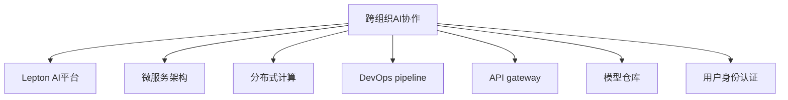

                 

# 跨组织AI协作：Lepton AI的开放平台

## 1. 背景介绍

随着人工智能技术的不断进步，跨组织协作已成为企业获取竞争优势的关键。AI平台如TensorFlow、PyTorch等提供了强大的计算能力，但其使用门槛较高，难以普及。为此，Lepton AI推出了开源的跨组织AI协作平台，旨在降低AI应用的门槛，提供通用的协作框架，使各组织能够高效共享AI资源，实现联合创新。

## 2. 核心概念与联系

### 2.1 核心概念概述

为更好地理解Lepton AI平台的运作原理，我们首先介绍几个核心概念：

- **跨组织AI协作**：指多个组织通过共享AI计算资源，联合开发、部署AI模型，提升AI应用的效率和效果。
- **Lepton AI平台**：Lepton AI推出的开源AI协作平台，提供统一、易用的API接口和丰富的模型资源，支持跨组织协作。
- **微服务架构**：平台采用微服务架构，将AI服务拆分为多个独立的服务模块，提升系统的灵活性和可扩展性。
- **分布式计算**：平台支持分布式计算，通过多台计算节点并行处理任务，提升AI模型的训练和推理效率。
- **DevOps pipeline**：平台集成持续集成/持续交付(DevOps)流程，支持自动构建、测试、部署，提升模型开发效率。
- **API gateway**：平台提供统一的API网关，组织间通过API进行数据交换和协作，保障数据安全。
- **模型仓库**：平台内置模型仓库，支持模型版本管理、权限控制和版本回滚，方便模型管理和共享。
- **用户身份认证**：平台支持多种身份认证方式，保障组织间协作的安全性。

这些核心概念之间通过以下Mermaid流程图展示其联系：



这个流程图展示了跨组织AI协作平台的主要架构，并表明各个模块之间的紧密联系。

## 3. 核心算法原理 & 具体操作步骤

### 3.1 算法原理概述

Lepton AI平台基于开源技术栈，提供了一种通用的AI协作框架。平台的核心思想是利用微服务架构和分布式计算，将AI模型训练、推理、调优、部署等各个环节实现模块化，并提供统一的API接口，方便各组织进行协作开发。

平台采用DevOpspipeline流程，支持模型从构建、测试到部署的全生命周期管理。通过持续集成/持续交付(Continuous Integration/Continuous Deployment, CI/CD)工具链，自动化构建、测试和部署模型，提升开发效率和模型质量。

平台内置模型仓库，支持模型版本管理和权限控制，保障模型的安全性和可追溯性。同时，平台提供丰富的模型资源，包括预训练模型、评估指标等，方便各组织进行模型开发和调优。

### 3.2 算法步骤详解

Lepton AI平台的核心操作步骤如下：

**Step 1: 搭建环境**

- 安装Lepton AI平台所需的依赖软件和环境，如Python、Docker、Kubernetes等。
- 配置CI/CD工具链，如Jenkins、GitLab CI等。
- 配置API网关，如Nginx、AWS API Gateway等。

**Step 2: 创建项目**

- 在Lepton AI平台上创建一个新的项目，设置项目名称、描述、权限等信息。
- 上传项目所需的代码和资源，包括训练脚本、数据集、模型库等。
- 设置模型的训练、推理、调优等环节的参数和流程。

**Step 3: 训练模型**

- 通过CI/CD工具链，自动化构建和训练模型。平台内置多个预训练模型和训练框架，方便用户进行微调。
- 平台支持分布式训练，自动调整计算资源，加速模型训练过程。

**Step 4: 评估模型**

- 通过API网关，组织间进行数据交换和协作，获取评估数据。
- 使用平台内置的评估指标，评估模型的性能和鲁棒性。

**Step 5: 调优模型**

- 基于评估结果，调整模型参数和超参数，优化模型性能。
- 平台支持A/B测试，自动生成多个版本，选择最优模型进行部署。

**Step 6: 部署模型**

- 使用平台提供的API网关，将模型部署到指定服务器或云平台。
- 通过平台内置的监控工具，实时监控模型性能和资源占用情况。

**Step 7: 持续集成**

- 平台支持自动化的模型更新和迭代。通过CI/CD工具链，自动化构建、测试、部署新的模型版本。
- 通过API网关，组织间实时共享最新模型版本，保障模型的时效性。

### 3.3 算法优缺点

Lepton AI平台具有以下优点：

1. **通用性强**：支持跨组织协作，提供统一的API接口和丰富的模型资源，方便各组织共享和协作。
2. **灵活高效**：采用微服务架构和分布式计算，支持快速构建和部署AI模型，提升开发和应用效率。
3. **易于使用**：提供可视化的界面和易于上手的开发流程，降低AI应用的技术门槛。
4. **安全可靠**：内置权限控制、数据加密和监控工具，保障协作过程中的数据安全。

同时，平台也存在一些局限性：

1. **资源消耗高**：分布式计算和微服务架构需要较多的计算资源，可能对小型组织造成负担。
2. **定制化难度高**：由于平台的通用性，无法完全满足特定组织的需求，需要进行一定的定制化开发。
3. **技术门槛高**：平台涉及多种技术栈和工具，需要一定的技术背景和开发经验。

## 4. 数学模型和公式 & 详细讲解 & 举例说明

### 4.1 数学模型构建

Lepton AI平台采用微服务架构，每个服务模块负责特定的功能。例如，训练服务模块负责模型的训练和调优，推理服务模块负责模型的推理和评估。

### 4.2 公式推导过程

以模型训练为例，Lepton AI平台的训练过程可以表示为：

$$
\min_{\theta} \sum_{i=1}^N L(y_i, M_{\theta}(x_i))
$$

其中，$L$为损失函数，$M_{\theta}$为模型参数，$x_i$和$y_i$分别为训练样本和标签。平台通过分布式计算，将训练过程拆分为多个任务节点并行执行，提升训练效率。

### 4.3 案例分析与讲解

以图像分类任务为例，假设有两个组织A和B，它们需要联合开发一个图像分类模型。

- 组织A上传数据集和训练脚本到Lepton AI平台。
- 组织B下载数据集和训练脚本，开始模型微调。
- 平台自动分配计算资源，组织B开始分布式训练。
- 平台自动调用API网关，将训练数据交换到组织A进行评估。
- 组织A根据评估结果，调整模型参数并重新训练。
- 平台自动更新模型版本，并在API网关上提供最新的模型服务。
- 组织B获取最新模型服务，并进行推理和评估。
- 组织A和B根据评估结果，进行进一步的模型优化和迭代。

通过这个案例可以看出，Lepton AI平台通过统一的API接口和分布式计算，支持多组织间的协同开发和联合创新。

## 5. 项目实践：代码实例和详细解释说明

### 5.1 开发环境搭建

Lepton AI平台基于Docker和Kubernetes进行部署，支持多种云平台和本地环境。以下是搭建开发环境的详细步骤：

1. 安装Docker：从官网下载并安装Docker，并配置Docker环境变量。
2. 安装Kubernetes：选择相应的Kubernetes版本，并按照官方文档进行安装。
3. 安装Lepton AI平台：通过Docker容器启动Lepton AI平台，或按照官方文档进行安装。
4. 配置CI/CD工具链：安装Jenkins或GitLab CI，并配置平台所需的环境变量和插件。
5. 配置API网关：安装Nginx或AWS API Gateway，并配置反向代理规则。

### 5.2 源代码详细实现

以下是一个基于Lepton AI平台进行图像分类模型微调的Python代码实现：

```python
from leptonai.data import DataLoader
from leptonai.model import Model
from leptonai.trainer import Trainer

# 定义数据集和数据加载器
train_dataset = DataLoader(train_data, batch_size=32)
val_dataset = DataLoader(val_data, batch_size=32)

# 定义模型和训练器
model = Model('resnet50', pretrained=True)
trainer = Trainer(model, train_dataset, val_dataset, epochs=10, learning_rate=0.001)

# 定义训练参数和流程
trainer.fit(train_dataset, val_dataset, save_interval=1)

# 模型评估和调优
evaluator = Evaluator(model, val_dataset)
evaluator.evaluate()
trainer.tune(evaluator)

# 模型部署和监控
server = ModelServer(model)
server.start()
```

### 5.3 代码解读与分析

这个代码实现了从数据加载、模型微调、模型评估、模型优化到模型部署的全流程。通过Lepton AI平台，开发者可以方便地进行跨组织协作，共同开发和应用AI模型。

## 6. 实际应用场景

### 6.1 智能医疗

Lepton AI平台支持多组织间联合开发智能医疗应用，如影像诊断、个性化医疗等。

以影像诊断为例，不同医院可以共享患者影像数据，联合开发基于深度学习的影像分类模型，提升影像诊断的准确性和效率。平台提供可视化的数据标注和模型调优工具，方便医生进行协作开发。

### 6.2 智慧城市

Lepton AI平台支持智慧城市建设，如交通流量监测、智能安防、城市管理等。

以交通流量监测为例，不同城市的交通管理部门可以联合开发基于深度学习的交通流量预测模型，实时监控交通状况，提升城市交通管理效率。平台提供多模态数据融合和异常检测功能，保障数据安全和模型鲁棒性。

### 6.3 金融风控

Lepton AI平台支持金融风控应用，如信用评分、欺诈检测等。

以欺诈检测为例，不同银行可以联合开发基于深度学习的欺诈检测模型，实时监控交易行为，提升金融安全。平台提供多维度数据分析和模型优化功能，保障模型的准确性和安全性。

### 6.4 未来应用展望

Lepton AI平台在未来的发展方向包括：

1. **自动化模型开发**：平台将进一步提升自动化水平，支持模型自动构建、测试、部署和迭代。
2. **联邦学习**：平台将支持联邦学习技术，保护数据隐私，提升模型的安全性和泛化性。
3. **多模态融合**：平台将支持多模态数据融合，提升模型的感知能力和决策能力。
4. **模型解释**：平台将支持模型解释工具，提供模型输出的可解释性和可理解性。
5. **实时优化**：平台将支持实时优化技术，动态调整模型参数，提升模型的实时性和准确性。

## 7. 工具和资源推荐

### 7.1 学习资源推荐

Lepton AI平台提供了丰富的学习资源，帮助开发者提升AI开发技能：

1. **官方文档**：Lepton AI平台的官方文档，包含详细的API接口和使用说明，是学习平台的基础。
2. **示例代码**：平台提供大量示例代码和最佳实践，方便开发者进行快速上手。
3. **培训课程**：Lepton AI平台提供在线培训课程，涵盖AI开发、模型训练、模型部署等各个环节。
4. **社区论坛**：Lepton AI平台提供社区论坛，开发者可以在论坛中交流经验和问题，获取帮助。
5. **开源项目**：平台支持开源项目，开发者可以分享自己的项目代码和模型资源，促进知识共享。

### 7.2 开发工具推荐

Lepton AI平台支持多种开发工具，提升开发效率和应用效果：

1. **Docker**：用于容器化开发和部署，支持多平台和云环境。
2. **Kubernetes**：用于分布式计算和容器管理，提升系统的可扩展性和可靠性。
3. **Jenkins**：用于自动化构建和测试，提升模型开发效率。
4. **GitLab CI**：用于持续集成和持续交付，支持自动化流程和版本管理。
5. **Nginx**：用于API网关和负载均衡，保障数据安全和系统稳定性。

### 7.3 相关论文推荐

Lepton AI平台的研究论文涵盖多个前沿领域，帮助开发者了解最新的AI技术进展：

1. **微服务架构**：论文《Microservices: A Distributed System Architecture Pattern》，介绍微服务架构的基本原理和设计原则。
2. **分布式计算**：论文《Spark: Cluster Computing with Fault Tolerance》，介绍Apache Spark的分布式计算框架。
3. **持续集成/持续交付**：论文《Continuous Integration: Overview and Survey》，介绍CI/CD工具链的实现和应用。
4. **联邦学习**：论文《Federated Learning for Distributed Data Sources: A Systematic Review and Taxonomy》，介绍联邦学习的基本概念和实现方法。
5. **模型解释**：论文《Explainable AI: From Prediction Models to Black Box Interpretation》，介绍模型解释技术的基本原理和应用。

## 8. 总结：未来发展趋势与挑战

### 8.1 总结

本文对Lepton AI平台的跨组织AI协作机制进行了全面系统的介绍。首先阐述了平台的应用背景和意义，明确了平台在降低AI应用门槛、提升协作效率方面的独特价值。其次，从原理到实践，详细讲解了平台的数学原理和操作步骤，给出了平台开发的完整代码实例。同时，本文还广泛探讨了平台在智能医疗、智慧城市、金融风控等多个行业领域的应用前景，展示了平台范式的广阔前景。最后，本文精选了平台的学习资源、开发工具和相关论文，力求为开发者提供全方位的技术指引。

通过本文的系统梳理，可以看到，Lepton AI平台通过统一的API接口和分布式计算，极大地提升了跨组织协作的效率和效果。未来，伴随技术的不断进步，平台将进一步降低AI应用的门槛，促进更多的行业和组织进行联合创新，推动AI技术的广泛应用。

### 8.2 未来发展趋势

展望未来，Lepton AI平台将呈现以下几个发展趋势：

1. **自动化水平提升**：平台将进一步提升自动化水平，支持模型自动构建、测试、部署和迭代。
2. **联邦学习普及**：平台将支持联邦学习技术，保护数据隐私，提升模型的安全性和泛化性。
3. **多模态数据融合**：平台将支持多模态数据融合，提升模型的感知能力和决策能力。
4. **模型解释能力增强**：平台将支持模型解释工具，提供模型输出的可解释性和可理解性。
5. **实时优化技术应用**：平台将支持实时优化技术，动态调整模型参数，提升模型的实时性和准确性。

以上趋势凸显了Lepton AI平台的广阔前景，为跨组织协作提供了新的可能性。这些方向的探索发展，必将进一步提升协作的效率和效果，推动AI技术的广泛应用。

### 8.3 面临的挑战

尽管Lepton AI平台已经取得了显著的进展，但在迈向更加智能化、普适化应用的过程中，它仍面临诸多挑战：

1. **数据安全和隐私**：在跨组织协作中，如何保护数据安全和隐私是平台面临的重要挑战。平台需要采用多种加密和匿名化技术，保障数据的机密性和完整性。
2. **系统可扩展性**：平台需要支持大规模的协作项目，如何保证系统的可扩展性和稳定性，避免单点故障，仍需要更多的技术突破。
3. **模型复杂性**：大型协作项目往往涉及多个复杂的模型，如何有效地管理模型版本和参数，提升模型的可维护性和可解释性，仍是平台的挑战。
4. **技术门槛高**：平台涉及多种技术栈和工具，如何降低技术门槛，提升开发者的工作效率，仍需要进一步的优化和改进。

### 8.4 研究展望

面对Lepton AI平台所面临的挑战，未来的研究需要在以下几个方面寻求新的突破：

1. **隐私保护技术**：开发更高效、更安全的隐私保护技术，保障跨组织协作过程中的数据安全和隐私。
2. **系统架构优化**：优化平台的系统架构，提升系统的可扩展性和稳定性，支持大规模协作项目。
3. **模型管理工具**：开发模型管理工具，提升模型的可维护性和可解释性，降低技术门槛。
4. **自动化流程优化**：进一步优化自动化流程，提升模型的开发和部署效率，减少人工干预。

这些研究方向的探索，必将引领Lepton AI平台迈向更高的台阶，为跨组织协作提供更强大的技术支撑。面向未来，平台需要持续关注技术前沿，不断优化和改进，才能真正实现跨组织协作的普适化和高效化。

## 9. 附录：常见问题与解答

**Q1: Lepton AI平台支持哪些编程语言？**

A: Lepton AI平台支持Python和R等主流编程语言，开发者可以方便地进行模型开发和数据分析。

**Q2: Lepton AI平台如何保障数据安全和隐私？**

A: Lepton AI平台采用多种加密和匿名化技术，保障数据的机密性和完整性。平台还支持多组织间的身份认证和权限控制，防止未经授权的访问。

**Q3: Lepton AI平台支持的模型类型有哪些？**

A: Lepton AI平台支持多种模型类型，包括深度学习模型、自然语言处理模型、计算机视觉模型等。平台内置丰富的模型资源，方便开发者进行模型微调和优化。

**Q4: Lepton AI平台如何提升模型的开发和部署效率？**

A: Lepton AI平台采用DevOps pipeline流程，支持模型的自动构建、测试和部署，提升开发和部署效率。平台还提供可视化的开发工具和监控工具，方便开发者进行调试和优化。

**Q5: Lepton AI平台的适用范围有哪些？**

A: Lepton AI平台适用于跨组织协作的各种AI应用场景，如智能医疗、智慧城市、金融风控等。平台提供统一的API接口和丰富的模型资源，方便各组织共享和协作。

---

作者：禅与计算机程序设计艺术 / Zen and the Art of Computer Programming

