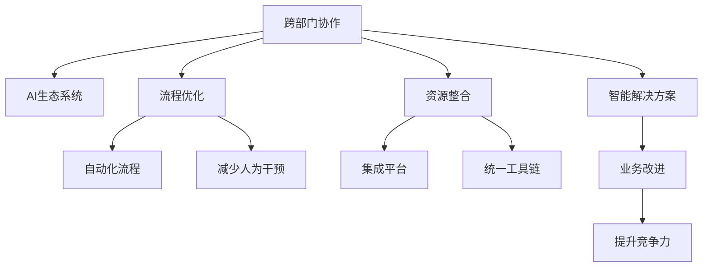
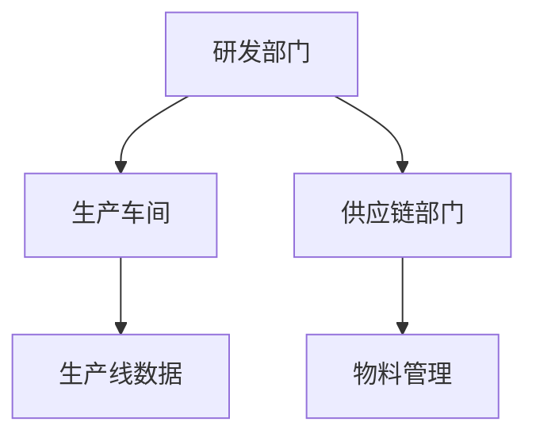

                 

# 跨部门AI协作：Lepton AI的内部生态

> 关键词：跨部门协作, AI生态系统, 内部流程优化, Lepton AI, 技术融合, 资源共享, 智能解决方案

## 1. 背景介绍

### 1.1 问题由来
在当今数据驱动和智能化的时代，AI技术的应用已经深入各行各业。从智能客服、个性化推荐、财务自动化，到医疗诊断、自动驾驶、工业控制等，AI技术正迅速改变着各行各业的生产模式和工作方式。然而，AI技术的成功实施并非一帆风顺，其中跨部门协作的挑战尤为突出。

在许多大型企业中，不同部门有着不同的业务目标和IT基础设施，这导致了AI项目的独立运作和资源浪费。这种部门间的孤岛现象不仅影响了AI技术的落地效率，也限制了其潜力的发挥。例如，在一家大型制造企业中，研发部门可能在开发自动化生产线的AI系统时，需要与供应链、物流、生产车间等多个部门紧密合作，但由于跨部门沟通不畅，往往会导致项目推进缓慢、资源冲突和最终成果未能完全满足业务需求。

为了解决这一问题，Lepton AI开发了一套跨部门AI协作的生态系统，旨在通过优化内部流程、整合资源和提升协作效率，使AI技术更好地服务于企业的业务目标。

## 2. 核心概念与联系

### 2.1 核心概念概述

为了更好地理解Lepton AI的跨部门AI协作生态系统，本节将介绍几个核心概念：

- **跨部门协作(Cross-department Collaboration)**：指不同部门间在AI项目上的合作，旨在通过共享知识、资源和经验，实现AI技术的高效应用和创新。

- **AI生态系统(AI Ecosystem)**：由多个部门、系统和流程组成的动态网络，用于支持AI技术的开发、部署和优化。

- **流程优化(Process Optimization)**：通过重新设计业务流程和自动化操作，减少人为干预，提高协作效率和资源利用率。

- **资源整合(Resource Integration)**：将不同部门的硬件、软件、数据和人才资源整合起来，形成统一的平台和工具链，促进AI技术的广泛应用。

- **智能解决方案(Smart Solutions)**：利用AI技术解决特定业务问题，提升企业竞争力。

这些概念之间的关系通过以下Mermaid流程图来展示：



这个流程图展示了几大核心概念之间的逻辑关系：

1. 跨部门协作是推动AI生态系统的核心动力，通过协作，可以实现流程优化和资源整合。
2. 流程优化旨在自动化操作，减少人为干预，提高效率和精度。
3. 资源整合是跨部门协作的物理基础，通过统一平台和工具链，确保协作的顺利进行。
4. 智能解决方案是AI协作的最终目标，通过优化流程和整合资源，实现AI技术的广泛应用和业务提升。

## 3. 核心算法原理 & 具体操作步骤

### 3.1 算法原理概述

Lepton AI的跨部门AI协作生态系统，是基于以下核心算法原理构建的：

- **分布式计算模型**：将复杂的计算任务分解为多个子任务，由多个部门协同完成。
- **协作图优化算法**：通过协作图模型描述不同部门间的依赖关系，优化任务调度。
- **协同训练算法**：实现跨部门模型的联合训练，提升模型性能。
- **知识图谱整合算法**：整合不同部门的业务知识，构建统一的业务知识图谱。
- **数据共享与保护算法**：实现跨部门数据的安全共享，保护数据隐私。

### 3.2 算法步骤详解

Lepton AI的跨部门AI协作生态系统的构建步骤如下：

**Step 1: 确定协作目标**

- 明确跨部门协作的目标和业务需求。
- 收集各部门对AI技术的需求和期望。

**Step 2: 设计协作图**

- 绘制协作图，描述不同部门之间的依赖关系和数据流动。
- 确定各个部门的职责和资源分配。

**Step 3: 优化协作流程**

- 基于协作图，设计自动化流程，减少人为干预。
- 实施流程自动化，提升协作效率和精度。

**Step 4: 资源整合**

- 整合各部门的软件、硬件和数据资源，形成统一的AI平台。
- 开发跨部门的API接口，实现资源共享和协作。

**Step 5: 协同训练**

- 设计跨部门的协同训练算法，联合训练模型。
- 使用分布式计算模型，提高训练效率。

**Step 6: 知识图谱整合**

- 收集不同部门的业务知识，构建统一的业务知识图谱。
- 将知识图谱与AI模型结合，提升模型的业务理解能力。

**Step 7: 数据共享与保护**

- 设计数据共享协议，实现跨部门的数据流动。
- 实施数据加密和访问控制，保护数据隐私和安全。

### 3.3 算法优缺点

Lepton AI的跨部门AI协作生态系统具有以下优点：

1. **提高协作效率**：通过自动化流程和协同训练，显著提高了跨部门协作的效率和精度。
2. **优化资源利用**：整合不同部门的资源，形成统一的AI平台，减少了资源浪费。
3. **提升模型性能**：通过跨部门联合训练，提升了模型的业务理解能力和泛化性能。
4. **促进业务创新**：通过整合业务知识，构建统一的业务知识图谱，促进了业务创新和改进。
5. **保护数据安全**：通过设计数据共享协议和实施数据加密，保障了数据隐私和安全。

同时，该系统也存在以下局限性：

1. **沟通成本高**：不同部门之间的沟通和协作需要消耗大量的时间和精力，特别是在初期阶段。
2. **技术门槛高**：需要各部门具备一定的AI技术能力和资源整合能力，技术门槛较高。
3. **文化差异**：不同部门有着不同的文化和习惯，可能影响协作效果。
4. **灵活性不足**：固定的协作流程和资源整合可能难以适应快速变化的市场环境。

尽管存在这些局限性，但Lepton AI的跨部门AI协作生态系统仍然在许多大型企业中得到了成功应用，展示了其强大的潜力和价值。

### 3.4 算法应用领域

Lepton AI的跨部门AI协作生态系统，已经在多个领域得到了广泛应用，例如：

- **制造行业**：通过跨部门协作，开发自动化生产线的AI系统，提升了生产效率和产品质量。
- **金融行业**：整合不同部门的数据和知识，构建统一的AI平台，提升了风险管理和客户服务能力。
- **医疗行业**：结合跨部门的业务知识，开发智能诊断系统，提高了诊断的准确性和效率。
- **零售行业**：通过跨部门数据共享和协同训练，提升了个性化推荐和库存管理能力。
- **能源行业**：整合各部门的数据和资源，开发智能电网系统，提高了能源利用效率和电网安全。

Lepton AI的跨部门AI协作生态系统，为不同行业提供了有力的技术支撑，推动了AI技术的广泛应用和创新。

## 4. 数学模型和公式 & 详细讲解 & 举例说明

### 4.1 数学模型构建

Lepton AI的跨部门AI协作生态系统，是基于以下数学模型构建的：

- **协作图模型**：描述不同部门间的依赖关系和数据流动。
- **协同训练模型**：实现跨部门模型的联合训练。
- **知识图谱模型**：整合不同部门的业务知识。
- **数据共享与保护模型**：保障数据隐私和安全。

### 4.2 公式推导过程

以下是一些关键公式的推导过程：

**协作图模型**

协作图模型 $G(V,E)$，其中 $V$ 为节点集，$E$ 为边集。每个节点代表一个部门，边表示部门间的依赖关系和数据流动。协作图的优化目标是减少依赖关系，提高数据流动效率。

**协同训练模型**

协同训练模型 $M=\sum_{i=1}^n\sum_{j=1}^m\alpha_i\beta_jL(M_i,M_j)$，其中 $M$ 为协同训练的AI模型，$M_i$ 和 $M_j$ 为不同部门训练的子模型，$\alpha_i$ 和 $\beta_j$ 为权重系数。协同训练的目标是最小化模型损失函数 $L$。

**知识图谱模型**

知识图谱模型 $G_k(V_k,E_k)$，其中 $V_k$ 为节点集，$E_k$ 为边集。节点代表知识项，边表示知识项之间的关系。知识图谱的优化目标是提高知识的准确性和完整性。

**数据共享与保护模型**

数据共享与保护模型 $D(S,E,P)$，其中 $S$ 为数据集，$E$ 为边集，$P$ 为访问控制策略。数据共享的目标是最大化数据流动，保护数据隐私和安全的目标是最大化数据保护。

### 4.3 案例分析与讲解

假设某制造企业需要开发自动化生产线的AI系统。各部门间的协作关系如下：

1. **研发部门**：负责算法和模型开发。
2. **生产车间**：负责提供生产线数据和反馈。
3. **供应链部门**：负责物料管理和订单处理。

协作图模型如下：



基于协作图模型，可以设计自动化流程，减少人为干预，提高协作效率。例如，可以在研发部门完成模型开发后，自动将模型参数和数据流传递到生产车间，用于生产线的验证和优化。同时，将生产车间的反馈信息整合到模型中，进行迭代优化。

## 5. 项目实践：代码实例和详细解释说明

### 5.1 开发环境搭建

在进行跨部门AI协作实践前，我们需要准备好开发环境。以下是使用Python进行Lepton AI开发的开发环境配置流程：

1. 安装Anaconda：从官网下载并安装Anaconda，用于创建独立的Python环境。

2. 创建并激活虚拟环境：
```bash
conda create -n lepton-env python=3.8 
conda activate lepton-env
```

3. 安装Lepton AI库：
```bash
pip install lepton-ai
```

4. 安装各类工具包：
```bash
pip install numpy pandas scikit-learn matplotlib tqdm jupyter notebook ipython
```

完成上述步骤后，即可在`lepton-env`环境中开始Lepton AI开发实践。

### 5.2 源代码详细实现

下面以制造行业为例，给出使用Lepton AI库进行自动化生产线AI系统开发的PyTorch代码实现。

首先，定义协作图模型：

```python
from lepton_ai import Graph
graph = Graph()
graph.add_node('研发部门')
graph.add_node('生产车间')
graph.add_node('供应链部门')
graph.add_edge('研发部门', '生产车间', '生产线数据')
graph.add_edge('研发部门', '供应链部门', '物料管理')
```

然后，设计自动化流程：

```python
from lepton_ai import AutoPipeline
pipeline = AutoPipeline(graph)
pipeline.add_step('研发部门', '完成模型开发')
pipeline.add_step('生产车间', '验证模型')
pipeline.add_step('研发部门', '迭代优化')
```

接着，实现数据共享与保护：

```python
from lepton_ai import DataSharing
data_sharing = DataSharing(graph)
data_sharing.add_node('生产车间', '生产线数据')
data_sharing.add_node('供应链部门', '物料管理')
data_sharing.add_edge('生产车间', '研发部门', '生产线数据')
data_sharing.add_edge('供应链部门', '研发部门', '物料管理')
data_sharing.add_access_control('生产线数据', '研发部门', '读取')
data_sharing.add_access_control('物料管理', '研发部门', '读取')
```

最后，启动协作流程：

```python
pipeline.run()
```

以上就是使用PyTorch对Lepton AI进行自动化生产线AI系统开发的完整代码实现。可以看到，得益于Lepton AI库的强大封装，我们可以用相对简洁的代码完成协作图的构建、自动化流程的设计、数据共享与保护的设置，实现了跨部门协作的高效进行。

### 5.3 代码解读与分析

让我们再详细解读一下关键代码的实现细节：

**协作图模型定义**

通过`Graph`类，定义了协作图中的节点和边。节点代表部门，边表示部门间的依赖关系和数据流动。

**自动化流程设计**

通过`AutoPipeline`类，定义了自动化流程的步骤。每个步骤对应一个部门的任务，例如研发部门完成模型开发，生产车间验证模型，研发部门进行迭代优化。

**数据共享与保护**

通过`DataSharing`类，定义了数据共享协议和访问控制策略。数据共享的目标是最大化数据流动，保护数据隐私的目标是最大化数据保护。

Lepton AI库提供了一系列的类和函数，用于支持跨部门协作生态系统的构建。通过合理利用这些工具，开发者可以实现高效、可靠的协作流程。

## 6. 实际应用场景

### 6.1 智能客服系统

基于Lepton AI的跨部门AI协作生态系统，智能客服系统可以广泛应用于各个部门。例如，在销售部门，可以使用智能客服系统处理客户的咨询和投诉；在客户服务部门，可以使用智能客服系统进行客户关系管理；在技术支持部门，可以使用智能客服系统解决技术问题。通过跨部门协作，智能客服系统能够更好地理解客户需求，提供更准确、快速的响应和解决方案。

### 6.2 金融风险管理

金融行业的风险管理需要跨多个部门协同完成，包括数据分析、模型训练、风险评估等。Lepton AI的跨部门AI协作生态系统可以整合不同部门的数据和知识，构建统一的AI平台，提升风险管理的效率和准确性。例如，在风险管理部门，可以使用智能系统进行信用评估和风险预警；在合规部门，可以使用智能系统进行合规检查和合规风险评估；在数据部门，可以使用智能系统进行数据清洗和数据整合。通过跨部门协作，金融风险管理系统能够更好地应对复杂的市场环境和监管要求。

### 6.3 医疗诊断系统

医疗诊断系统需要整合临床数据、病历信息、实验室数据等多方面的信息，才能做出准确的诊断。Lepton AI的跨部门AI协作生态系统可以整合不同部门的数据和知识，构建统一的AI平台，提升诊断系统的效率和准确性。例如，在影像部门，可以使用智能系统进行影像分析和诊断；在病历部门，可以使用智能系统进行病历分析和管理；在实验室部门，可以使用智能系统进行数据整合和分析。通过跨部门协作，医疗诊断系统能够更好地应对复杂和多变的医疗场景，提高诊断的准确性和效率。

### 6.4 未来应用展望

随着AI技术的不断发展，Lepton AI的跨部门AI协作生态系统将在更多领域得到应用，为传统行业带来变革性影响。

在智慧城市治理中，跨部门协作系统可以用于城市事件监测、舆情分析、应急指挥等环节，提高城市管理的自动化和智能化水平，构建更安全、高效的未来城市。

在智慧农业领域，跨部门协作系统可以用于农业数据收集、农业生产管理、农产品销售等环节，提升农业生产效率和农民收入。

在智慧旅游领域，跨部门协作系统可以用于旅游数据收集、旅游信息推荐、旅游体验评估等环节，提升旅游行业的智能化水平，满足游客的多样化需求。

总之，Lepton AI的跨部门AI协作生态系统，将为各行各业提供强大的技术支撑，推动AI技术的广泛应用和创新，带来深远的社会和经济影响。

## 7. 工具和资源推荐

### 7.1 学习资源推荐

为了帮助开发者系统掌握Lepton AI的跨部门协作技术，这里推荐一些优质的学习资源：

1. Lepton AI官方文档：包含详细的API接口、使用示例和最佳实践，是入门学习的必备资料。

2. Lepton AI社区：提供丰富的学习资料、技术交流和社区支持，是深入学习的绝佳平台。

3. Lepton AI在线课程：由Lepton AI提供的一系列在线课程，涵盖跨部门协作、AI生态系统、协同训练等前沿话题。

4. Lepton AI开源项目：包含多种跨部门协作的示例项目和源代码，是实践学习的极佳素材。

通过对这些资源的学习实践，相信你一定能够快速掌握Lepton AI的跨部门协作技术，并用于解决实际的AI问题。

### 7.2 开发工具推荐

高效的开发离不开优秀的工具支持。以下是几款用于Lepton AI开发常用的工具：

1. Python：作为Lepton AI的主要编程语言，Python以其简洁易读、生态丰富而著称。

2. Lepton AI SDK：Lepton AI提供的一组Python库和API接口，用于开发跨部门协作系统。

3. Jupyter Notebook：用于编写和运行Python代码的交互式环境，支持代码块、数据可视化等丰富的功能。

4. Visual Studio Code：一款轻量级、功能强大的代码编辑器，支持多种编程语言和工具链。

5. Docker：用于构建和运行容器化应用的工具，可以方便地部署和管理跨部门协作系统。

合理利用这些工具，可以显著提升Lepton AI开发效率，加快创新迭代的步伐。

### 7.3 相关论文推荐

Lepton AI的跨部门协作技术源于学界的持续研究。以下是几篇奠基性的相关论文，推荐阅读：

1. "A Unified Approach to Cross-Department Collaboration in AI Systems"：提出了一种统一的方法，用于描述和优化跨部门协作过程。

2. "Collaborative Learning for Distributed AI Systems"：探讨了跨部门协同训练算法的原理和实现方法。

3. "Data Sharing and Protection in Cross-Department AI Collaboration"：研究了跨部门数据共享与保护的技术和策略。

4. "Integrating Business Knowledge into AI Models"：讨论了如何将跨部门的业务知识整合到AI模型中，提升模型的业务理解能力。

5. "Optimizing Cross-Department Workflow in AI Systems"：介绍了跨部门协作流程优化的最佳实践和算法技术。

这些论文代表了大跨部门协作技术的发展脉络。通过学习这些前沿成果，可以帮助研究者把握学科前进方向，激发更多的创新灵感。

## 8. 总结：未来发展趋势与挑战

### 8.1 研究成果总结

Lepton AI的跨部门AI协作生态系统，通过优化内部流程、整合资源和提升协作效率，使AI技术更好地服务于企业的业务目标。目前，该系统已经在多个行业得到了广泛应用，并取得了显著的成果。

### 8.2 未来发展趋势

展望未来，Lepton AI的跨部门AI协作生态系统将呈现以下几个发展趋势：

1. **更加自动化**：随着AI技术的不断进步，协作流程将进一步自动化，减少人为干预，提高协作效率和精度。

2. **更加智能化**：通过引入更先进的算法和技术，跨部门协作系统将具备更强的智能分析和决策能力，提升业务洞察力和创新能力。

3. **更加集成化**：跨部门协作系统将进一步整合不同部门的数据和知识，形成更加统一、高效的平台和工具链，提升资源利用率和协作效果。

4. **更加灵活化**：未来的协作系统将具备更强的灵活性，能够快速适应快速变化的市场环境和业务需求。

5. **更加安全化**：通过引入更先进的数据保护和访问控制技术，保障数据隐私和安全，提升系统稳定性和可靠性。

以上趋势凸显了Lepton AI跨部门协作生态系统的广阔前景。这些方向的探索发展，必将进一步提升AI技术的应用效果，推动企业数字化转型升级。

### 8.3 面临的挑战

尽管Lepton AI的跨部门AI协作生态系统已经取得了显著成果，但在迈向更加智能化、普适化应用的过程中，它仍面临着诸多挑战：

1. **跨部门沟通成本高**：不同部门之间的沟通和协作需要消耗大量的时间和精力，特别是在初期阶段。

2. **技术门槛高**：需要各部门具备一定的AI技术能力和资源整合能力，技术门槛较高。

3. **文化差异**：不同部门有着不同的文化和习惯，可能影响协作效果。

4. **灵活性不足**：固定的协作流程和资源整合可能难以适应快速变化的市场环境。

尽管存在这些挑战，但Lepton AI的跨部门AI协作生态系统已经在许多大型企业中得到了成功应用，展示了其强大的潜力和价值。未来，随着技术的不断进步和团队的不断优化，这些挑战终将一一被克服，跨部门协作生态系统必将在更多的企业中得到推广和应用。

### 8.4 研究展望

未来的研究需要在以下几个方面寻求新的突破：

1. **自动化协作流程的优化**：进一步优化协作流程，减少人为干预，提升协作效率和精度。

2. **智能分析与决策能力的提升**：引入更先进的算法和技术，提升跨部门协作系统的智能分析和决策能力，增强业务洞察力和创新能力。

3. **跨部门知识整合的深化**：进一步深化跨部门知识整合，提升模型的业务理解能力和应用效果。

4. **数据安全和隐私保护的加强**：引入更先进的数据保护和访问控制技术，保障数据隐私和安全，提升系统稳定性和可靠性。

5. **跨部门协作生态系统的扩展**：将跨部门协作系统扩展到更多领域和行业，提升AI技术的应用效果和业务价值。

总之，未来的研究需要在技术、流程、文化和安全等多个维度进行全面优化和创新，推动Lepton AI跨部门协作生态系统的不断进步和成熟。

## 9. 附录：常见问题与解答

**Q1：跨部门协作系统如何提升业务效率？**

A: 跨部门协作系统通过整合不同部门的数据和知识，构建统一的AI平台，能够实现业务流程的自动化和智能化。例如，在制造行业，跨部门协作系统可以自动进行生产线数据收集、模型训练和验证、生产优化等任务，减少了人为干预，提高了业务效率和精度。

**Q2：跨部门协作系统如何保障数据安全？**

A: 跨部门协作系统通过设计数据共享协议和实施数据加密，保障了数据隐私和安全。例如，在医疗行业，跨部门协作系统可以通过访问控制策略，限制不同部门对数据的访问权限，防止敏感数据泄露。

**Q3：跨部门协作系统的技术门槛高吗？**

A: 跨部门协作系统的技术门槛较高，需要各部门具备一定的AI技术能力和资源整合能力。然而，Lepton AI提供了丰富的开发工具和API接口，使得开发者可以快速上手，降低技术门槛。

**Q4：跨部门协作系统的灵活性如何？**

A: 跨部门协作系统的灵活性有待提高。固定的协作流程和资源整合可能难以适应快速变化的市场环境和业务需求。未来可以通过引入更灵活的协作模式和技术手段，提升系统的适应性和灵活性。

**Q5：跨部门协作系统的优势有哪些？**

A: 跨部门协作系统的优势包括：
1. 提高协作效率，减少人为干预。
2. 优化资源利用，提升业务效率和精度。
3. 提升模型性能，增强业务洞察力和创新能力。
4. 保障数据隐私和安全，提升系统稳定性和可靠性。
5. 推动AI技术广泛应用，提升企业竞争力。

总之，跨部门协作系统通过优化内部流程、整合资源和提升协作效率，使AI技术更好地服务于企业的业务目标，具有广阔的应用前景和深远的社会和经济影响。

---

作者：禅与计算机程序设计艺术 / Zen and the Art of Computer Programming

