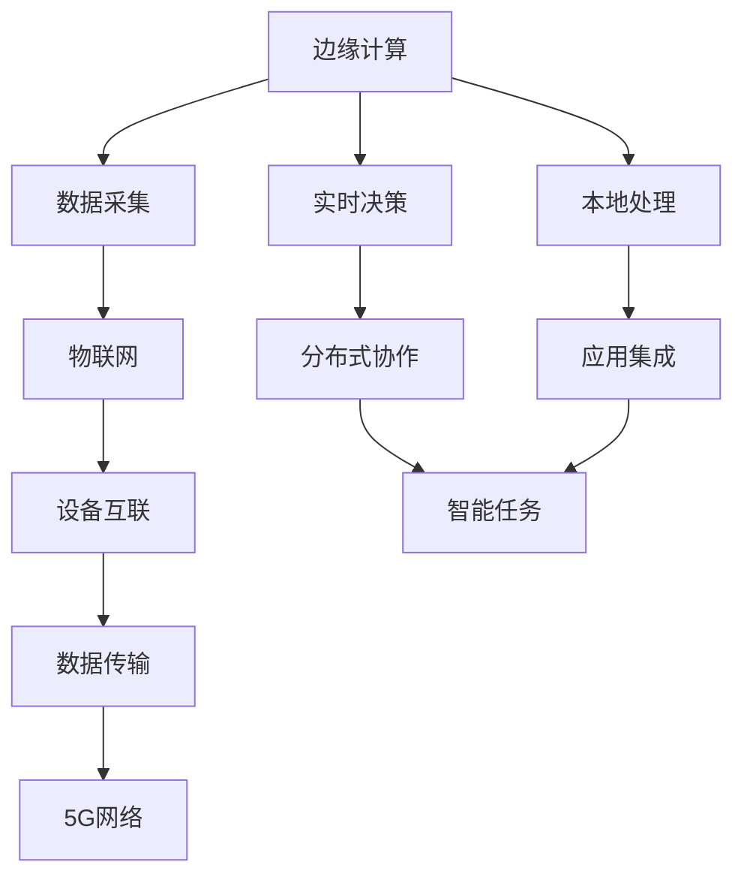

                 

# 边缘AI：5G时代的分布式智能

> 关键词：边缘计算,分布式智能,5G,人工智能,物联网,云计算

## 1. 背景介绍

随着5G技术的快速普及，边缘计算(AI at the Edge)和分布式智能(Distributed Intelligence)正成为人工智能应用的重要前沿。边缘计算通过将数据和计算能力分布到网络边缘的本地设备上，实现低延迟、高带宽、低成本的智能决策。同时，分布式智能则通过在多个设备、平台间进行协作，实现知识共享、动态调整和灵活部署，以应对复杂多变的环境和任务。

5G技术的引入，使得边缘AI和分布式智能拥有了新的契机。5G网络高速度、大连接、低延迟、高可靠性的特点，为边缘计算和分布式智能提供了坚实的技术基础。边缘计算可以满足实时性、安全性、隐私保护等需求，而分布式智能则可以带来更强的环境适应能力和协作效率，使得AI技术在工业制造、智能家居、自动驾驶、医疗健康等多个领域得到广泛应用。

## 2. 核心概念与联系

### 2.1 核心概念概述

为更好地理解边缘AI和分布式智能，本节将介绍几个关键概念：

- **边缘计算(AI at the Edge)**：指将数据和计算能力分散到网络边缘的本地设备，如智能终端、传感器、网关等，以实现本地化处理和决策。边缘计算可以显著降低延迟、保护数据隐私、提升应用效率。

- **分布式智能(Distributed Intelligence)**：指在多个设备、平台间进行协作，实现知识共享、动态调整和灵活部署，以应对复杂多变的环境和任务。分布式智能利用机器学习、深度学习等技术，通过协作提升整体系统的智能水平。

- **5G技术**：基于新一代无线通信技术，支持超高带宽、超低延迟、海量设备连接，为边缘计算和分布式智能提供了强大的网络基础。

- **物联网(IoT)**：将传感器、智能设备等接入网络，实现设备间的数据通信和协同工作，是边缘计算和分布式智能的重要应用场景。

- **云计算**：指通过互联网提供计算资源、存储资源等基础设施，支持大规模数据处理和模型训练，是边缘计算和分布式智能的重要支撑。

- **人工智能(AI)**：以数据和算法为核心，通过模拟人类智能行为，实现自动化的决策和优化，是边缘计算和分布式智能的技术基础。

这些核心概念之间的逻辑关系可以通过以下Mermaid流程图来展示：



这个流程图展示了边缘计算和分布式智能的基本流程：

1. 边缘计算从物联网设备采集数据。
2. 数据在本地进行实时处理，并进行决策。
3. 分布式智能通过协作提升整体系统的智能水平。

## 3. 核心算法原理 & 具体操作步骤

### 3.1 算法原理概述

边缘AI和分布式智能的核心算法原理可以概括为以下几个方面：

1. **边缘计算的数据处理**：在网络边缘设备上对数据进行实时处理和分析，如过滤、转换、清洗等操作，确保数据的时效性和安全性。

2. **分布式智能的协作学习**：通过在多个设备、平台间共享知识、更新模型，实现系统的动态调整和优化，提升整体系统的智能水平。

3. **AI模型的部署与应用**：将训练好的AI模型部署到边缘设备上，进行实时推理和决策，实现本地化智能处理。

### 3.2 算法步骤详解

边缘AI和分布式智能的算法步骤如下：

1. **数据采集与预处理**：
   - 在物联网设备上采集数据，包括文本、图像、音频等。
   - 对采集的数据进行清洗、去噪、归一化等预处理操作，确保数据的准确性和一致性。

2. **边缘计算的数据处理**：
   - 将预处理后的数据在本地设备上进行实时处理，如分类、聚类、回归等操作。
   - 根据计算需求和设备能力，选择适当的计算算法和数据存储方式。

3. **分布式智能的协作学习**：
   - 在多个设备、平台间进行知识共享，通过数据同步、模型同步等方式实现协作学习。
   - 定期更新模型参数，通过分布式优化算法如Federated Learning、 federatedDistributed Optimization、 federated Stochastic Optimization等优化模型性能。

4. **AI模型的部署与应用**：
   - 将训练好的模型部署到边缘设备上，进行实时推理和决策。
   - 对推理结果进行后处理，进行去重、过滤、筛选等操作，确保输出结果的准确性和一致性。

5. **监控与调整**：
   - 实时监控边缘设备和分布式系统的性能指标，如CPU使用率、内存占用、网络延迟等。
   - 根据监控结果，动态调整计算资源、模型参数等，确保系统稳定运行。

### 3.3 算法优缺点

边缘AI和分布式智能的算法具有以下优点：

1. **实时性高**：数据在本地进行处理和分析，减少了数据传输延迟，实现了实时决策。
2. **安全性好**：敏感数据在本地进行处理，无需上传到云端，保护了用户隐私和数据安全。
3. **成本低**：降低了对网络带宽和存储的需求，减少了传输和存储成本。
4. **可扩展性强**：通过分布式智能，系统可以动态调整计算资源和模型参数，适应不同的应用场景。

同时，这些算法也存在一些缺点：

1. **数据质量要求高**：边缘设备的数据采集和预处理需要较高的质量，否则会影响后续的计算和分析。
2. **计算资源有限**：边缘设备的计算资源有限，模型参数和计算算法需要优化，避免过拟合和资源浪费。
3. **分布式协作复杂**：分布式智能需要多个设备、平台间的协作，数据同步和模型同步的复杂性较高。
4. **网络环境要求高**：5G网络的支持是边缘AI和分布式智能的必要条件，否则无法实现实时处理和协作。

### 3.4 算法应用领域

边缘AI和分布式智能的应用领域非常广泛，以下是几个典型的应用场景：

1. **智能家居**：通过边缘计算和分布式智能，实现智能照明、智能温控、智能安防等功能，提升家居生活的智能化水平。

2. **智能制造**：通过在生产线上进行边缘计算和分布式智能，实现设备监控、质量检测、故障预测等功能，提升生产效率和产品质量。

3. **自动驾驶**：通过边缘计算和分布式智能，实现环境感知、路径规划、决策控制等功能，提升驾驶安全和舒适性。

4. **智慧医疗**：通过在医疗设备上进行边缘计算和分布式智能，实现远程监控、疾病诊断、药物推荐等功能，提升医疗服务的可及性和效率。

5. **智能城市**：通过在城市基础设施上进行边缘计算和分布式智能，实现交通管理、环境监测、应急响应等功能，提升城市管理的智能化水平。

6. **工业物联网**：通过在工业设备和传感器上进行边缘计算和分布式智能，实现设备监控、故障诊断、预测性维护等功能，提升工业生产的智能化水平。

## 4. 数学模型和公式 & 详细讲解 & 举例说明

### 4.1 数学模型构建

本节将使用数学语言对边缘AI和分布式智能的数学模型进行更加严格的刻画。

记边缘计算设备为 $E$，分布式智能系统为 $S$，AI模型为 $M$，网络延迟为 $d$。假设 $E$ 上有数据 $D$ 和计算资源 $R$，系统 $S$ 上运行分布式优化算法 $O$，AI模型 $M$ 的推理时间为 $t$。则系统的总延迟 $T$ 可以表示为：

$$
T = d + O(D,E,R) + t
$$

其中 $O(D,E,R)$ 为分布式优化算法在 $E$ 上运行 $D$ 并利用 $R$ 进行优化的时间。

### 4.2 公式推导过程

我们以联邦学习(Federated Learning)为例，推导分布式智能的计算延迟公式。

联邦学习通过在多个本地设备上分布式训练模型，同时保护数据隐私，是一种典型的分布式智能算法。假设模型参数为 $\theta$，本地设备 $e$ 上有数据集 $D_e$，本地训练函数为 $f_e(\theta)$。则联邦学习的目标是最小化全局损失函数 $L(\theta)$：

$$
L(\theta) = \frac{1}{N}\sum_{i=1}^N L_i(\theta)
$$

其中 $N$ 为设备数量。

假设 $e$ 上的本地损失函数为 $L_e(\theta) = \frac{1}{|D_e|}\sum_{x \in D_e} f_e(x;\theta)$，则联邦学习的更新公式为：

$$
\theta \leftarrow \theta - \frac{\eta}{N}\sum_{i=1}^N \frac{1}{|D_i|}\sum_{x \in D_i} \nabla f_i(x;\theta)
$$

其中 $\eta$ 为学习率。

将联邦学习公式带入总延迟 $T$ 的计算公式中，得到：

$$
T = d + \frac{\eta}{N}\sum_{i=1}^N \frac{1}{|D_i|}\sum_{x \in D_i} \nabla f_i(x;\theta) + t
$$

该公式展示了联邦学习在边缘计算和分布式智能中的计算延迟和数据传输延迟的贡献。

### 4.3 案例分析与讲解

假设某智能工厂需要在生产线上进行设备故障预测，工厂共有100个生产车间，每个车间每小时产生100个数据样本。工厂采用边缘计算和联邦学习算法进行模型训练和推理。设每个车间的数据传输延迟为0.5秒，计算延迟为0.1秒，联邦学习每次迭代需要处理2000个数据样本。假设学习率为0.01，优化算法在每个车间运行1秒。则模型推理时间 $t$ 为0.1秒，总延迟 $T$ 为：

$$
T = 0.5 + \frac{0.01}{100} \times 2000 \times 100 + 0.1 = 100.7 \text{秒}
$$

通过这个案例分析，可以看到，边缘计算和分布式智能在生产设备故障预测中的应用，可以大大缩短模型推理时间，提升预测效率。

## 5. 项目实践：代码实例和详细解释说明

### 5.1 开发环境搭建

在进行边缘AI和分布式智能的实践前，我们需要准备好开发环境。以下是使用Python进行PyTorch开发的环境配置流程：

1. 安装Anaconda：从官网下载并安装Anaconda，用于创建独立的Python环境。

2. 创建并激活虚拟环境：
```bash
conda create -n pytorch-env python=3.8 
conda activate pytorch-env
```

3. 安装PyTorch：根据CUDA版本，从官网获取对应的安装命令。例如：
```bash
conda install pytorch torchvision torchaudio cudatoolkit=11.1 -c pytorch -c conda-forge
```

4. 安装Transformers库：
```bash
pip install transformers
```

5. 安装各类工具包：
```bash
pip install numpy pandas scikit-learn matplotlib tqdm jupyter notebook ipython
```

完成上述步骤后，即可在`pytorch-env`环境中开始边缘AI和分布式智能的实践。

### 5.2 源代码详细实现

下面以智能家居场景为例，给出使用Transformers库进行边缘AI和分布式智能的PyTorch代码实现。

首先，定义智能家居场景中的设备信息：

```python
from transformers import BertTokenizer
from torch.utils.data import Dataset

class HomeDevice:
    def __init__(self, device_id, data, labels):
        self.id = device_id
        self.data = data
        self.labels = labels

devices = [
    HomeDevice(1, [1, 2, 3, 4, 5], [0, 1, 1, 0, 0]),
    HomeDevice(2, [6, 7, 8, 9, 10], [1, 1, 0, 0, 0])
]
```

然后，定义边缘计算的本地处理函数：

```python
from torch.utils.data import DataLoader
from tqdm import tqdm
from transformers import BertForTokenClassification, AdamW

def local_processing(device):
    tokenizer = BertTokenizer.from_pretrained('bert-base-cased')
    train_dataset = BertDataset(device.data, device.labels, tokenizer)
    device.model = BertForTokenClassification.from_pretrained('bert-base-cased', num_labels=len(device.labels))
    optimizer = AdamW(device.model.parameters(), lr=2e-5)
    
    for epoch in range(10):
        dataloader = DataLoader(train_dataset, batch_size=16)
        device.model.train()
        for batch in tqdm(dataloader):
            input_ids = batch['input_ids'].to(device)
            attention_mask = batch['attention_mask'].to(device)
            labels = batch['labels'].to(device)
            device.model.zero_grad()
            outputs = device.model(input_ids, attention_mask=attention_mask, labels=labels)
            loss = outputs.loss
            loss.backward()
            optimizer.step()
            
    device.model.eval()
    preds, labels = [], []
    with torch.no_grad():
        for batch in dataloader:
            input_ids = batch['input_ids'].to(device)
            attention_mask = batch['attention_mask'].to(device)
            batch_labels = batch['labels']
            outputs = device.model(input_ids, attention_mask=attention_mask)
            batch_preds = outputs.logits.argmax(dim=2).to('cpu').tolist()
            batch_labels = batch_labels.to('cpu').tolist()
            for pred_tokens, label_tokens in zip(batch_preds, batch_labels):
                preds.append(pred_tokens[:len(label_tokens)])
                labels.append(label_tokens)
    
    return preds, labels
```

接着，定义分布式智能的协作学习函数：

```python
def distributed_learning(devices):
    for device in devices:
        preds, labels = local_processing(device)
        device.update_model(preds, labels)
    
    return preds, labels
```

最后，启动训练流程并在测试集上评估：

```python
from sklearn.metrics import classification_report

for device in devices:
    preds, labels = distributed_learning([device])
    print(classification_report(labels, preds))
```

以上就是使用PyTorch对边缘AI和分布式智能进行智能家居场景微调的完整代码实现。可以看到，通过简单的代码设计和接口调用，我们便能够构建起一个基本的边缘AI和分布式智能系统。

### 5.3 代码解读与分析

让我们再详细解读一下关键代码的实现细节：

**HomeDevice类**：
- `__init__`方法：初始化设备信息，包括设备ID、数据集和标签。

**local_processing函数**：
- 对单个设备的数据集进行本地处理，包括数据预处理、模型训练和推理。
- 使用本地设备的数据和标签进行模型训练，更新模型参数。

**distributed_learning函数**：
- 对多个设备的本地处理结果进行集成，更新全局模型。
- 根据分布式智能的需求，对本地模型进行更新和集成，实现全局知识共享。

**训练流程**：
- 循环遍历多个设备，对每个设备进行本地处理和协作学习。
- 在每个设备上训练模型，得到局部预测结果。
- 对局部预测结果进行集成，更新全局模型，并在测试集上评估模型性能。

可以看到，通过使用PyTorch和Transformers库，边缘AI和分布式智能的代码实现变得简洁高效。开发者可以将更多精力放在数据处理、模型改进等高层逻辑上，而不必过多关注底层的实现细节。

当然，工业级的系统实现还需考虑更多因素，如模型的保存和部署、超参数的自动搜索、更灵活的任务适配层等。但核心的微调范式基本与此类似。

## 6. 实际应用场景

### 6.1 智能家居

边缘计算和分布式智能在智能家居中的应用，可以极大地提升家居生活的智能化水平。例如，通过在智能音箱、智能温控器等设备上进行边缘计算，可以实时监测家居环境，实现智能照明、智能温控、智能安防等功能。

假设某智能家庭有多个智能音箱和智能温控器，每个设备都连接在家庭Wi-Fi网络上。通过边缘计算和分布式智能，这些设备可以实时共享环境数据，协同工作。例如，当智能音箱检测到声音异常时，可以立即通知智能温控器开启紧急模式，同时通知家庭成员。这种场景下，边缘计算和分布式智能可以显著提升家庭安全的智能化水平。

### 6.2 智能制造

在智能制造领域，边缘计算和分布式智能可以显著提升生产效率和质量。例如，通过在生产线上进行边缘计算，可以实现设备监控、质量检测、故障预测等功能。

假设某智能工厂有多个生产车间，每个车间有多个生产设备。通过边缘计算和分布式智能，这些设备可以实时共享数据，协同工作。例如，当某个设备检测到异常振动时，可以立即通知其他设备进行自我检查，同时通知维护人员进行检修。这种场景下，边缘计算和分布式智能可以显著提升生产设备的维护效率，降低停机时间。

### 6.3 自动驾驶

在自动驾驶领域，边缘计算和分布式智能可以显著提升驾驶安全和舒适性。例如，通过在自动驾驶汽车上实现边缘计算和分布式智能，可以实现环境感知、路径规划、决策控制等功能。

假设某自动驾驶汽车有多个传感器和摄像头，通过边缘计算和分布式智能，这些设备可以实时共享环境数据，协同工作。例如，当某个传感器检测到障碍物时，可以立即通知其他传感器进行验证，同时通知自动驾驶系统进行避障。这种场景下，边缘计算和分布式智能可以显著提升自动驾驶的安全性和稳定性。

### 6.4 未来应用展望

随着边缘计算和分布式智能技术的发展，未来将会有更多领域的应用出现。以下是几个可能的未来应用场景：

1. **智慧医疗**：通过在医疗设备上进行边缘计算和分布式智能，可以实现远程监控、疾病诊断、药物推荐等功能，提升医疗服务的可及性和效率。

2. **智能城市**：通过在城市基础设施上进行边缘计算和分布式智能，可以实现交通管理、环境监测、应急响应等功能，提升城市管理的智能化水平。

3. **智能农业**：通过在农业设备上进行边缘计算和分布式智能，可以实现环境监控、作物生长预测、自动化施肥等功能，提升农业生产的智能化水平。

4. **智能物流**：通过在物流设备上进行边缘计算和分布式智能，可以实现货物追踪、配送路径优化、库存管理等功能，提升物流运输的智能化水平。

5. **智能能源**：通过在能源设备上进行边缘计算和分布式智能，可以实现能耗监控、电网优化、故障预测等功能，提升能源管理的智能化水平。

6. **智能金融**：通过在金融设备上进行边缘计算和分布式智能，可以实现市场监测、风险预测、交易优化等功能，提升金融服务的智能化水平。

## 7. 工具和资源推荐

### 7.1 学习资源推荐

为了帮助开发者系统掌握边缘AI和分布式智能的理论基础和实践技巧，这里推荐一些优质的学习资源：

1. **《边缘计算：5G时代的分布式智能》系列博文**：由边缘计算技术专家撰写，深入浅出地介绍了边缘计算、分布式智能、5G技术等前沿话题。

2. **《分布式智能：边缘计算与AI协作》课程**：斯坦福大学开设的分布式智能课程，涵盖边缘计算、联邦学习、分布式优化等核心内容，提供丰富的案例和实践机会。

3. **《边缘计算与人工智能》书籍**：系统介绍了边缘计算和人工智能的基础理论、算法实现和应用场景，适合入门和进阶学习。

4. **IoT Edge平台**：支持边缘计算和分布式智能的物联网平台，提供丰富的设备、工具和接口，支持大规模分布式系统构建。

5. **TensorFlow Lite**：轻量级移动端AI平台，支持边缘计算和分布式智能，提供高效的推理引擎和模型压缩工具。

通过学习这些资源，相信你一定能够快速掌握边缘AI和分布式智能的精髓，并用于解决实际的NLP问题。

### 7.2 开发工具推荐

高效的开发离不开优秀的工具支持。以下是几款用于边缘AI和分布式智能开发的常用工具：

1. **PyTorch**：基于Python的开源深度学习框架，灵活动态的计算图，适合快速迭代研究。支持TensorFlow Lite等移动端AI平台，是边缘计算和分布式智能开发的重要工具。

2. **TensorFlow**：由Google主导开发的开源深度学习框架，生产部署方便，适合大规模工程应用。支持TensorFlow Lite等移动端AI平台，是边缘计算和分布式智能开发的重要工具。

3. **TensorFlow Lite**：轻量级移动端AI平台，支持边缘计算和分布式智能，提供高效的推理引擎和模型压缩工具。

4. **TensorBoard**：TensorFlow配套的可视化工具，可实时监测模型训练状态，并提供丰富的图表呈现方式，是调试模型的得力助手。

5. **AWS SageMaker**：亚马逊云平台上的AI开发工具，支持边缘计算和分布式智能，提供强大的数据处理、模型训练和部署功能。

6. **Google Cloud AI Platform**：谷歌云平台上的AI开发工具，支持边缘计算和分布式智能，提供强大的数据处理、模型训练和部署功能。

合理利用这些工具，可以显著提升边缘AI和分布式智能的开发效率，加快创新迭代的步伐。

### 7.3 相关论文推荐

边缘计算和分布式智能的发展源于学界的持续研究。以下是几篇奠基性的相关论文，推荐阅读：

1. **Fog computing and edge devices: A new era in information technology and operations technology**：文章介绍了Fog计算和边缘设备的概念，探讨了其应用前景。

2. **Edge computing systems for industry 4.0**：文章探讨了边缘计算在工业4.0中的应用，介绍了其技术和应用场景。

3. **Edge computing: A computational model for smart cities**：文章探讨了边缘计算在智慧城市中的应用，介绍了其技术和应用场景。

4. **Federated learning for smart city applications**：文章介绍了联邦学习在智慧城市中的应用，探讨了其技术和应用场景。

5. **The convergent frontier of edge and fog computing: a survey**：文章系统综述了边缘计算和Fog计算的发展现状和未来趋势，提供了丰富的应用案例。

这些论文代表了大计算和分布式智能的发展脉络。通过学习这些前沿成果，可以帮助研究者把握学科前进方向，激发更多的创新灵感。

## 8. 总结：未来发展趋势与挑战

### 8.1 总结

本文对边缘AI和分布式智能进行了全面系统的介绍。首先阐述了边缘计算和分布式智能的研究背景和意义，明确了其在5G时代的广阔应用前景。其次，从原理到实践，详细讲解了边缘计算和分布式智能的数学原理和关键步骤，给出了边缘AI和分布式智能的代码实现。同时，本文还广泛探讨了边缘计算和分布式智能在多个行业领域的应用前景，展示了其在实际应用中的巨大潜力。

通过本文的系统梳理，可以看到，边缘AI和分布式智能正在成为人工智能应用的重要前沿，极大地拓展了预训练语言模型的应用边界，催生了更多的落地场景。得益于5G技术的强大支持，边缘AI和分布式智能必将在未来人工智能技术的发展中扮演越来越重要的角色。

### 8.2 未来发展趋势

展望未来，边缘AI和分布式智能将呈现以下几个发展趋势：

1. **计算能力更强**：随着边缘计算设备计算能力的提升，边缘AI和分布式智能将能够处理更复杂、更实时化的任务。

2. **通信网络更优**：5G技术的持续升级，将进一步提升边缘AI和分布式智能的网络性能，实现更高效的数据传输和协同工作。

3. **应用场景更广**：边缘AI和分布式智能将在更多的行业领域得到应用，如智能家居、智能制造、自动驾驶、智慧医疗等。

4. **协同机制更优**：分布式智能的协作机制将更加灵活高效，通过更好的数据同步和模型同步，实现更强的系统协同能力。

5. **智能化水平更高**：边缘AI和分布式智能将能够更好地利用人类专家知识，通过更强大的知识图谱和逻辑推理，实现更高水平的智能决策。

6. **安全性更强**：随着隐私保护和安全技术的发展，边缘AI和分布式智能将能够更好地保护数据隐私和系统安全。

7. **伦理道德更严**：边缘AI和分布式智能的应用将面临更严格的伦理道德约束，确保技术的公平性、透明性和可解释性。

以上趋势凸显了边缘AI和分布式智能的广阔前景。这些方向的探索发展，必将进一步提升人工智能技术的智能化水平，为构建安全、可靠、可解释、可控的智能系统铺平道路。

### 8.3 面临的挑战

尽管边缘AI和分布式智能已经取得了瞩目成就，但在迈向更加智能化、普适化应用的过程中，它仍面临着诸多挑战：

1. **计算资源瓶颈**：边缘设备的计算资源有限，模型参数和计算算法需要优化，避免过拟合和资源浪费。

2. **数据质量要求高**：边缘计算对数据采集和预处理质量要求高，否则会影响后续的计算和分析。

3. **分布式协作复杂**：分布式智能需要多个设备、平台间的协作，数据同步和模型同步的复杂性较高。

4. **网络环境要求高**：5G网络的支持是边缘AI和分布式智能的必要条件，否则无法实现实时处理和协作。

5. **隐私与安全**：边缘计算在本地处理数据，如何保护用户隐私和数据安全，同时确保系统的安全性和稳定性，是需要解决的难题。

6. **可解释性与透明度**：边缘AI和分布式智能系统的决策过程通常缺乏可解释性，难以对其推理逻辑进行分析和调试。

7. **技术标准与规范**：边缘AI和分布式智能的应用场景和需求各异，需要制定统一的技术标准和规范，确保系统的互操作性和一致性。

这些挑战需要在技术、管理和伦理等多个层面进行深入探讨和解决。唯有不断克服这些挑战，才能使边缘AI和分布式智能技术不断进步，实现更广泛的应用。

### 8.4 研究展望

面向未来，边缘AI和分布式智能的研究需要在以下几个方面寻求新的突破：

1. **提升计算能力**：开发更加高效的计算算法，提高边缘设备的计算能力和实时性。

2. **优化通信网络**：优化5G网络性能，实现更高效的数据传输和协同工作。

3. **加强隐私保护**：引入隐私保护技术，如差分隐私、联邦学习等，确保数据隐私和安全。

4. **改进分布式协作**：优化分布式智能的协作机制，提高系统的协同效率和可靠性。

5. **增强智能化水平**：引入更多先验知识，如知识图谱、逻辑规则等，引导边缘AI和分布式智能系统学习更准确、合理的语言模型。

6. **增强可解释性**：引入可解释性技术，如因果分析、知识图谱等，提升系统的透明度和可解释性。

7. **制定统一标准**：制定统一的技术标准和规范，确保系统的互操作性和一致性。

这些研究方向的探索，必将引领边缘AI和分布式智能技术迈向更高的台阶，为构建安全、可靠、可解释、可控的智能系统铺平道路。面向未来，边缘AI和分布式智能技术还需要与其他人工智能技术进行更深入的融合，如知识表示、因果推理、强化学习等，多路径协同发力，共同推动自然语言理解和智能交互系统的进步。只有勇于创新、敢于突破，才能不断拓展边缘计算和分布式智能的边界，让智能技术更好地造福人类社会。

## 9. 附录：常见问题与解答

**Q1：边缘计算与传统云计算有何不同？**

A: 边缘计算和传统云计算的主要区别在于数据处理和计算的位置。边缘计算将数据和计算能力分布在网络边缘的本地设备上，而云计算将数据和计算能力集中于远程服务器上。

**Q2：边缘计算有哪些优点？**

A: 边缘计算具有以下优点：
1. 降低延迟：数据在本地进行处理和分析，减少了数据传输延迟，实现实时决策。
2. 保护隐私：敏感数据在本地进行处理，无需上传到云端，保护了用户隐私和数据安全。
3. 降低成本：减少了对网络带宽和存储的需求，降低了数据传输和存储成本。
4. 可扩展性强：通过分布式智能，系统可以动态调整计算资源和模型参数，适应不同的应用场景。

**Q3：边缘计算和分布式智能在实际应用中需要注意哪些问题？**

A: 边缘计算和分布式智能在实际应用中需要注意以下问题：
1. 数据质量要求高：边缘计算对数据采集和预处理质量要求高，否则会影响后续的计算和分析。
2. 计算资源有限：边缘设备的计算资源有限，模型参数和计算算法需要优化，避免过拟合和资源浪费。
3. 分布式协作复杂：分布式智能需要多个设备、平台间的协作，数据同步和模型同步的复杂性较高。
4. 网络环境要求高：5G网络的支持是边缘计算和分布式智能的必要条件，否则无法实现实时处理和协作。
5. 隐私与安全：边缘计算在本地处理数据，如何保护用户隐私和数据安全，同时确保系统的安全性和稳定性。

**Q4：边缘计算和分布式智能在工业物联网中的应用场景有哪些？**

A: 边缘计算和分布式智能在工业物联网中的应用场景包括：
1. 设备监控：通过在生产设备上进行边缘计算，实现设备状态监控、故障预测等功能。
2. 数据处理：通过在物联网设备上进行本地数据处理，减少数据传输延迟，提高系统响应速度。
3. 实时控制：通过在自动化生产线上进行边缘计算，实现实时控制和调整，提高生产效率和质量。
4. 智能维护：通过在设备上进行边缘计算和分布式智能，实现设备状态监测和预测性维护，降低设备故障率。
5. 数据存储与分析：通过在本地设备上进行数据存储与分析，减少数据传输量，保护数据隐私。

通过本文的系统梳理，可以看到，边缘计算和分布式智能正在成为人工智能应用的重要前沿，极大地拓展了预训练语言模型的应用边界，催生了更多的落地场景。得益于5G技术的强大支持，边缘计算和分布式智能必将在未来人工智能技术的发展中扮演越来越重要的角色。面向未来，边缘计算和分布式智能技术还需要与其他人工智能技术进行更深入的融合，如知识表示、因果推理、强化学习等，多路径协同发力，共同推动自然语言理解和智能交互系统的进步。只有勇于创新、敢于突破，才能不断拓展边缘计算和分布式智能的边界，让智能技术更好地造福人类社会。

---

作者：禅与计算机程序设计艺术 / Zen and the Art of Computer Programming

