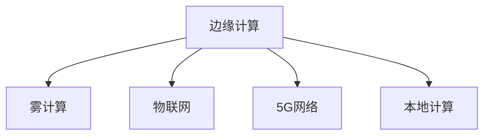
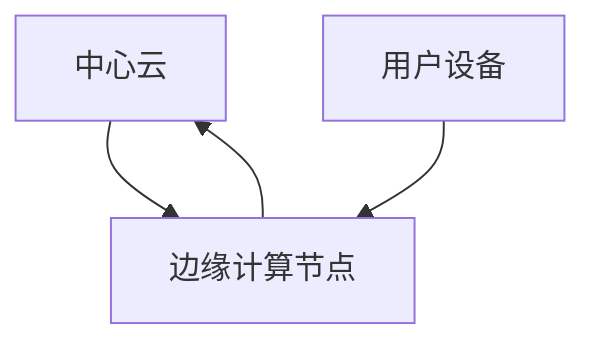

                 

## 1. 背景介绍

### 1.1 问题由来

随着云计算技术的快速发展，数据中心和服务器集群成为支撑全球互联网业务的核心基础设施。然而，由于数据中心集中化带来的高延迟、高带宽需求和网络带宽瓶颈问题，传统云中心计算模式已难以满足大规模实时应用场景的要求。与此同时，物联网、5G等新兴技术迅速发展，海量数据无处不在，迫切需要低延迟、高可用的计算能力。

边缘计算作为一种新型计算范式，将数据处理和计算资源从中心向边缘设备（如移动终端、IoT设备等）迁移，极大提升了数据的实时性和网络带宽效率，满足边缘设备和实时应用对低延迟、高可用的要求。本文旨在全面系统地介绍边缘计算的核心概念、工作原理及应用场景，并在此基础上探讨其在分布式计算领域的潜力和前景。

### 1.2 问题核心关键点

边缘计算的核心理念是将数据处理和计算任务从云中心迁移至边缘设备，以降低数据传输的延迟和带宽消耗，提升实时性。核心关键点包括：

- **数据中心与边缘设备协同计算**：边缘设备可以就地处理数据，而将非实时数据回传至中心云存储和处理。
- **资源优化与弹性伸缩**：通过将计算资源分散部署，优化资源利用率，实现动态弹性伸缩。
- **低延迟、高可用的计算能力**：边缘计算能够应对高并发的实时计算需求，提升用户体验。
- **安全性和隐私保护**：在数据本地处理的同时，保证数据的安全性和用户隐私。

## 2. 核心概念与联系

### 2.1 核心概念概述

为更好地理解边缘计算的核心原理和架构，本节将介绍几个密切相关的核心概念：

- **边缘计算**：指将计算任务和数据处理下沉到靠近数据源的边缘设备上进行，以降低数据传输的延迟和带宽消耗，提升实时性和网络带宽效率。

- **雾计算(Fog Computing)**：边缘计算的延伸概念，将计算资源进一步扩展到更广泛的网络边缘，支持更多类型的计算任务。

- **物联网(IoT)**：通过传感器、智能设备等，实现对物理世界的数字化感知和智能化控制。

- **5G网络**：提供低延迟、高可靠、高带宽的网络支持，为边缘计算提供高速数据传输能力。

- **本地计算**：指在数据产生地或数据源附近进行数据处理，减少数据传输延迟。

这些概念之间的逻辑关系可以通过以下Mermaid流程图来展示：



这个流程图展示出边缘计算与其他关键技术的关系：

1. 边缘计算通过将计算资源扩展到物联网设备和5G网络边缘，支持更多类型的数据处理任务。
2. 物联网设备将数据发送到边缘设备进行实时处理，5G网络提供高速数据传输。
3. 本地计算在数据产生地进行数据处理，减少延迟和带宽消耗。

### 2.2 核心概念原理和架构的 Mermaid 流程图

下面提供一个简单的Mermaid流程图，用于展示边缘计算的基本架构和关键组件：



这个简单的架构展示了中心云、边缘计算节点和用户设备之间的关系：

1. 中心云负责存储和处理非实时数据。
2. 边缘计算节点就地处理实时数据。
3. 用户设备通过网络将数据传输到边缘计算节点进行实时处理，然后将结果上传至中心云存储。

## 3. 核心算法原理 & 具体操作步骤

### 3.1 算法原理概述

边缘计算的算法原理主要基于分布式计算和本地计算的思想。其核心目标是将数据处理和计算任务分布在多个设备上，以减少数据传输的延迟和带宽消耗，提升实时性和网络带宽效率。

边缘计算通过将计算任务分成多个子任务，分配给不同设备进行处理。设备之间通过网络相互通信，协调子任务之间的执行顺序和结果合并，最终完成整个计算任务。

### 3.2 算法步骤详解

边缘计算的实现步骤主要包括以下几个关键环节：

**Step 1: 数据分布与任务划分**

将数据划分为多个子集，并分配给不同的边缘计算节点进行处理。数据划分应考虑设备计算能力和网络带宽等因素，确保各节点处理的数据规模和计算负载均衡。

**Step 2: 任务调度和执行**

各边缘计算节点根据任务分配和本地计算能力，动态调整任务执行计划，并按照优先级执行任务。对于高优先级的任务，优先在本地设备上执行；对于非实时任务，可以通过网络回传至中心云处理。

**Step 3: 结果聚合与传输**

各边缘计算节点将处理结果汇总，并通过网络传输至中心云进行统一管理。中心云将各节点的结果进行合并，生成最终计算结果。

**Step 4: 动态弹性伸缩**

根据计算负载和设备可用性，动态调整边缘计算节点的数量和计算能力，确保系统的高可用性和扩展性。

### 3.3 算法优缺点

边缘计算作为一种新型计算范式，具有以下优点：

1. **低延迟、高可用性**：通过本地数据处理，减少了数据传输的延迟，提升了实时性和系统可用性。
2. **资源优化与弹性伸缩**：通过将计算资源分布到多个设备上，优化资源利用率，实现动态弹性伸缩。
3. **网络带宽优化**：减少了数据传输的带宽消耗，降低网络带宽成本。
4. **支持多样化的计算任务**：边缘计算支持多种计算任务，包括实时数据分析、图像处理、智能控制等。

同时，边缘计算也存在以下缺点：

1. **设备异构性**：不同设备在计算能力和存储能力上存在差异，需要考虑设备异构性对任务分配和执行的影响。
2. **安全性和隐私保护**：数据在本地处理，需要保证数据的安全性和用户隐私，防止数据泄露。
3. **设备资源有限**：边缘设备计算能力和存储资源有限，需要优化算法和资源管理策略，避免资源浪费。
4. **网络通信延迟**：边缘计算节点之间需要通过网络通信，网络通信延迟会影响任务执行效率。

### 3.4 算法应用领域

边缘计算技术已经在多个领域得到了广泛应用，例如：

- **智能交通**：通过边缘计算实时处理车辆传感器数据，提升交通管理效率，优化交通流量。
- **智能制造**：在生产线上使用边缘计算进行实时数据分析，优化生产过程，提升产品质量。
- **智慧城市**：通过边缘计算处理城市公共设施的数据，提升城市管理智能化水平。
- **工业物联网**：将计算任务下沉至边缘设备，实现工业设备的远程监控和维护。
- **医疗健康**：通过边缘计算处理医疗设备产生的数据，提升诊断和治疗效率。

除了上述这些应用场景外，边缘计算还被广泛应用于安防监控、智能家居、虚拟现实、自动驾驶等领域，极大地提升了数据处理和计算的实时性和效率。

## 4. 数学模型和公式 & 详细讲解 & 举例说明

### 4.1 数学模型构建

边缘计算的数学模型主要基于分布式系统的概念，可以将任务和数据划分到多个边缘计算节点进行处理，并协调各节点之间的通信和结果合并。

设任务 $T$ 需要划分为 $n$ 个子任务，分别在 $n$ 个边缘计算节点 $N_1, N_2, ..., N_n$ 上进行处理。任务 $T$ 的执行时间为 $T_E$，各子任务的执行时间为 $t_1, t_2, ..., t_n$。任务在节点 $N_i$ 的执行效率为 $e_i$。则任务在节点 $N_i$ 上的执行时间为 $t_i = \frac{T_E}{e_i}$。

### 4.2 公式推导过程

任务总执行时间为：

$$
T_{total} = \sum_{i=1}^n t_i = T_E \sum_{i=1}^n \frac{1}{e_i}
$$

为了优化总执行时间，需要平衡各节点的计算负载。可以通过将任务划分为多个子任务，并在多个节点上并行执行，以达到最优的资源利用和执行效率。

### 4.3 案例分析与讲解

假设任务 $T$ 需要划分为 $n=3$ 个子任务，分别在节点 $N_1, N_2, N_3$ 上执行。节点 $N_1$ 的执行效率为 $e_1=1$，节点 $N_2$ 的执行效率为 $e_2=0.8$，节点 $N_3$ 的执行效率为 $e_3=0.6$。任务总执行时间为 $T_E=5$ 单位时间。

则节点 $N_1$ 的执行时间为 $t_1 = 5$，节点 $N_2$ 的执行时间为 $t_2 = 5 \times \frac{1}{0.8} = 6.25$，节点 $N_3$ 的执行时间为 $t_3 = 5 \times \frac{1}{0.6} = 8.33$。

将任务在节点 $N_2$ 上划分为 $t_2/2 = 3.125$ 的子任务，并在节点 $N_1$ 和 $N_3$ 上并行执行。则总执行时间为：

$$
T_{total} = \frac{5}{1} + \frac{3.125}{0.8} + \frac{3.125}{0.6} = 5 + 3.90 + 5.21 = 14.11
$$

相比单节点执行或未优化划分，边缘计算显著提升了任务执行效率。

## 5. 项目实践：代码实例和详细解释说明

### 5.1 开发环境搭建

在进行边缘计算项目实践前，我们需要准备好开发环境。以下是使用Python和Docker进行边缘计算开发的环境配置流程：

1. 安装Docker：从官网下载并安装Docker，配置本地镜像仓库。

2. 创建并激活虚拟环境：
```bash
conda create -n edge-env python=3.8 
conda activate edge-env
```

3. 安装必要的工具包：
```bash
pip install flask celery redis
```

4. 搭建Docker环境：
```bash
docker run -d --name edge_server -p 5000:5000 edge_image
```

完成上述步骤后，即可在`edge-env`环境中开始边缘计算项目实践。

### 5.2 源代码详细实现

以下是一个简单的边缘计算系统示例，包括任务分配、节点执行、结果合并等核心功能。

首先，定义任务和边缘计算节点的基本信息：

```python
from celery import Celery
import redis

# 任务基本信息
task_name = 'task_1'
task_data = {'data': 'input_data'}
task_params = {'param1': 10, 'param2': 20}
task_exec_time = 5
task_output = 'output_data'

# 边缘计算节点基本信息
node1 = {'name': 'node1', 'exec_time': 3, 'capability': 0.8}
node2 = {'name': 'node2', 'exec_time': 4, 'capability': 0.6}
node3 = {'name': 'node3', 'exec_time': 2, 'capability': 0.5}
```

然后，定义任务分配和节点执行的函数：

```python
def task分配函数(task, nodes):
    """
    将任务分配给边缘计算节点
    """
    node_counts = {}
    for node in nodes:
        if node['name'] not in node_counts:
            node_counts[node['name']] = 0
        node_counts[node['name']] += 1
    
    min_count = min(node_counts.values())
    nodes_to_assign = []
    for node in nodes:
        if node_counts[node['name']] == min_count:
            nodes_to_assign.append(node)
    
    return nodes_to_assign

def 节点执行函数(task, node):
    """
    在边缘计算节点上执行任务
    """
    # 计算任务的实际执行时间
    exec_time = task_exec_time / node['capability']
    print(f'{task} starts on {node["name"]}')
    
    # 模拟任务的执行过程
    for i in range(exec_time):
        print(f'{task} progress: {i+1}/{exec_time}')
        time.sleep(1)
    
    # 模拟任务的执行结果
    output = f'{task} completed'
    print(f'{task} completes with output {output}')
    return output
```

接下来，定义任务合并和结果传输的函数：

```python
def 任务合并函数(results):
    """
    将边缘计算节点的结果进行合并
    """
    return ''.join(results)

def 结果传输函数(result):
    """
    将结果传输至中心云进行存储
    """
    # 模拟将结果上传到中心云
    print(f'Result {result} uploaded to central cloud')
    return result
```

最后，启动边缘计算系统的作业流程：

```python
# 初始化Redis和Celery
redis_client = redis.Redis(host='localhost', port=6379, db=0)
celery_client = Celery('task_server', broker='redis://localhost:6379/0')

# 定义任务
task = {
    'name': task_name,
    'data': task_data,
    'params': task_params,
    'exec_time': task_exec_time,
    'output': task_output,
    'nodes': node分配函数([node1, node2, node3]),
    'merge_fn': 任务合并函数,
    'upload_fn': 结果传输函数
}

# 提交任务至Celery任务队列
celery_client.send_task('taskserver.run_task', args=(task,))

# 查询任务状态
task_id = celery_client.send_task('taskserver.run_task', args=(task,))
result = celery_client.AsyncResult(task_id).get()
print(f'Task {task_id} completed with output {result}')
```

以上代码展示了边缘计算系统的核心功能，包括任务分配、节点执行、结果合并和传输。在实际应用中，需要根据具体场景进行优化和调整，以满足实际需求。

### 5.3 代码解读与分析

让我们再详细解读一下关键代码的实现细节：

**task分配函数**：
- 将任务分配给边缘计算节点，保证节点负载均衡。

**节点执行函数**：
- 在边缘计算节点上执行任务，并模拟任务的执行过程。

**任务合并函数**：
- 将边缘计算节点的结果进行合并，生成最终的输出结果。

**结果传输函数**：
- 将结果传输至中心云进行存储。

**任务提交与状态查询**：
- 将任务提交至Celery任务队列，并查询任务状态，获取执行结果。

这个示例展示了边缘计算系统的基本框架和核心功能，通过合理设计和优化，可以构建更加高效、灵活的边缘计算系统。

## 6. 实际应用场景

### 6.1 智能交通

边缘计算在智能交通中的应用可以显著提升交通管理效率，优化交通流量。通过在交通信号灯、车辆传感器等设备上部署边缘计算节点，实时处理和分析交通数据，可以及时调整交通信号灯的时序，减少交通拥堵，提升通行效率。

例如，通过在智能公交站上部署边缘计算节点，实时监控公交车位置和乘客数量，智能调整公交班次和车辆调度，优化乘客的等待时间和乘坐体验。

### 6.2 智能制造

在智能制造领域，边缘计算可以帮助提升生产过程的智能化水平，优化生产流程，提升产品质量和生产效率。

例如，通过在生产线上部署边缘计算节点，实时监控设备状态和生产数据，及时发现设备故障和生产异常，自动调整生产计划，优化资源配置。

### 6.3 智慧城市

智慧城市是边缘计算的重要应用场景之一。通过在城市公共设施上部署边缘计算节点，实时处理和分析城市数据，可以提升城市管理智能化水平，提升城市运行效率和居民生活质量。

例如，通过在智慧路灯上部署边缘计算节点，实时监控交通流量、环境污染等数据，及时调整交通信号和路灯亮度，减少能源消耗，提升城市环境质量。

### 6.4 工业物联网

在工业物联网领域，边缘计算可以提升设备监控和维护的效率，降低维护成本。

例如，通过在工业设备上部署边缘计算节点，实时监控设备运行状态和生产数据，及时发现设备故障和生产异常，自动调整生产计划和维护计划，优化设备使用效率，降低维护成本。

### 6.5 医疗健康

在医疗健康领域，边缘计算可以提升诊断和治疗效率，改善患者体验。

例如，通过在医疗设备上部署边缘计算节点，实时监控患者健康数据，及时发现异常情况，自动调整治疗方案，提升诊疗效率，改善患者体验。

### 6.6 未来应用展望

随着边缘计算技术的不断发展和普及，其在分布式计算领域的潜力和前景将更加广阔。

未来，边缘计算将进一步融合云计算和物联网技术，构建更加智能、高效、安全的分布式计算系统。边缘计算和云计算的融合，可以实现数据在边缘和云中心的协同处理，提升计算效率和系统可靠性。

边缘计算还将与其他新兴技术进行更深入的融合，如区块链、人工智能等，推动分布式计算技术的发展和应用。

## 7. 工具和资源推荐

### 7.1 学习资源推荐

为了帮助开发者系统掌握边缘计算的理论基础和实践技巧，这里推荐一些优质的学习资源：

1. 《边缘计算》系列博文：由边缘计算领域专家撰写，深入浅出地介绍了边缘计算的核心概念、工作原理及应用场景。

2. 《Fog Computing》课程：麻省理工学院（MIT）开设的物联网课程，涵盖边缘计算的基础知识和应用案例。

3. 《雾计算》书籍：边缘计算领域的经典书籍，系统介绍了边缘计算的核心原理和应用场景。

4. NVIDIA官方文档：NVIDIA提供的边缘计算开发指南，包含丰富的边缘计算案例和最佳实践。

5. ARM官方文档：ARM提供的边缘计算开发指南，提供丰富的边缘计算硬件和软件资源。

通过对这些资源的学习实践，相信你一定能够快速掌握边缘计算的精髓，并用于解决实际的分布式计算问题。

### 7.2 开发工具推荐

高效的边缘计算开发离不开优秀的工具支持。以下是几款用于边缘计算开发的常用工具：

1. Docker：轻量级容器化平台，提供快速部署和管理边缘计算节点的能力。

2. Kubernetes：容器编排工具，提供自动伸缩和管理边缘计算节点的能力。

3. Redis：分布式内存数据存储，提供高效的边缘计算节点通信和数据同步能力。

4. Flask：轻量级Web框架，提供简单易用的边缘计算服务开发能力。

5. Celery：分布式任务队列，提供高可用的边缘计算任务调度和管理能力。

合理利用这些工具，可以显著提升边缘计算开发的效率，加快创新迭代的步伐。

### 7.3 相关论文推荐

边缘计算的研究源于学界的持续探索。以下是几篇奠基性的相关论文，推荐阅读：

1. Fog Computing 2.0: A survey and research directions for the next decade：回顾了Fog Computing的研究进展和未来方向。

2. A Survey on Edge Computing: An Overview of Research and Development:系统综述了边缘计算的研究进展和应用场景。

3. Edge Computing: A Computational Paradigm for the Internet of Things：介绍边缘计算在物联网中的应用，探讨了边缘计算的计算模型和优化方法。

4. Edge Computing: Concepts, Models, and Deployment:介绍了边缘计算的基本概念和部署模型。

5. Edge Computing in Industrial IoT: An Overview and Challenges：探讨了边缘计算在工业物联网中的应用，分析了边缘计算面临的挑战和解决方案。

这些论文代表了大边缘计算的研究方向和发展脉络。通过学习这些前沿成果，可以帮助研究者把握学科前进方向，激发更多的创新灵感。

## 8. 总结：未来发展趋势与挑战

### 8.1 研究成果总结

边缘计算作为一种新型计算范式，已经得到了广泛的研究和应用，展现出巨大的潜力和发展前景。通过将计算任务和数据处理下沉到边缘设备，边缘计算解决了传统云中心计算模式的高延迟、高带宽需求和网络带宽瓶颈问题，极大提升了实时性和网络带宽效率。

### 8.2 未来发展趋势

展望未来，边缘计算的发展趋势主要包括以下几个方向：

1. **融合云计算和物联网技术**：边缘计算和云计算的融合，可以实现数据在边缘和云中心的协同处理，提升计算效率和系统可靠性。

2. **多模态数据融合**：边缘计算支持多种计算任务，包括实时数据分析、图像处理、智能控制等，未来将进一步融合多模态数据，提升系统的智能化水平。

3. **边缘计算硬件升级**：边缘计算设备的计算能力和存储能力将不断提升，支持更大规模和更复杂的数据处理任务。

4. **动态弹性伸缩**：边缘计算系统将具备更加灵活的资源管理能力，根据计算负载和设备可用性动态调整计算资源，实现高效和可扩展的计算能力。

5. **安全性和隐私保护**：随着边缘计算的广泛应用，数据安全和隐私保护将成为重要研究方向，研究如何保证数据的安全性和用户隐私。

6. **边缘计算标准和协议**：随着边缘计算的普及，边缘计算标准和协议的制定将成为重要课题，推动边缘计算技术的规范化发展。

### 8.3 面临的挑战

尽管边缘计算技术已经取得了显著进展，但在应用过程中仍面临诸多挑战：

1. **设备异构性**：不同边缘计算设备在计算能力和存储能力上存在差异，需要考虑设备异构性对任务分配和执行的影响。

2. **安全性和隐私保护**：数据在本地处理，需要保证数据的安全性和用户隐私，防止数据泄露。

3. **网络通信延迟**：边缘计算节点之间需要通过网络通信，网络通信延迟会影响任务执行效率。

4. **资源优化**：边缘计算设备的计算能力和存储资源有限，需要优化算法和资源管理策略，避免资源浪费。

5. **系统可靠性和可扩展性**：边缘计算系统需要具备高可靠性和可扩展性，才能应对高并发的实时计算需求。

### 8.4 研究展望

面对边缘计算所面临的挑战，未来的研究需要在以下几个方面寻求新的突破：

1. **设备异构性优化**：通过优化任务分配和调度算法，最大化边缘计算设备的利用率，提升系统效率。

2. **安全性和隐私保护**：研究如何保证数据的安全性和用户隐私，防止数据泄露和恶意攻击。

3. **网络通信优化**：通过优化网络通信协议和数据传输方式，减少通信延迟，提升系统效率。

4. **边缘计算平台构建**：构建统一的边缘计算平台，实现资源的自动化管理、调度和优化。

5. **边缘计算标准和协议**：制定边缘计算标准和协议，推动边缘计算技术的规范化发展。

6. **边缘计算应用推广**：在更多领域推广边缘计算技术，提升数据处理和计算的实时性和效率。

这些研究方向将推动边缘计算技术的发展和应用，为构建智能、高效、安全的分布式计算系统提供有力支持。

## 9. 附录：常见问题与解答

**Q1: 边缘计算和传统云计算的区别是什么？**

A: 边缘计算和传统云计算的主要区别在于数据处理和计算资源的部署位置。

- **传统云计算**：数据和计算资源集中部署在数据中心，通过互联网进行访问和处理。适用于数据处理和计算需求不高的场景，如批处理、存储等。

- **边缘计算**：数据和计算资源部署在靠近数据源的边缘设备上，通过本地网络进行访问和处理。适用于数据处理和计算需求高的实时场景，如物联网、智能交通、智慧城市等。

边缘计算通过将数据处理和计算任务下沉到边缘设备，显著降低了数据传输的延迟和带宽消耗，提升了实时性和网络带宽效率。

**Q2: 边缘计算的计算能力有限，如何提升系统的性能？**

A: 边缘计算设备计算能力和存储资源有限，需要通过优化算法和资源管理策略，提升系统的性能。

- **任务优化**：将任务拆分为多个子任务，并在多个边缘计算节点上并行执行，提升系统效率。

- **资源管理**：通过动态调整边缘计算节点的数量和计算能力，优化资源利用率，实现动态弹性伸缩。

- **设备异构性优化**：通过优化任务分配和调度算法，最大化边缘计算设备的利用率，提升系统效率。

- **网络通信优化**：通过优化网络通信协议和数据传输方式，减少通信延迟，提升系统效率。

**Q3: 边缘计算面临的主要挑战是什么？**

A: 边缘计算面临的主要挑战包括设备异构性、安全性和隐私保护、网络通信延迟、资源优化、系统可靠性和可扩展性等。

- **设备异构性**：不同边缘计算设备在计算能力和存储能力上存在差异，需要考虑设备异构性对任务分配和执行的影响。

- **安全性和隐私保护**：数据在本地处理，需要保证数据的安全性和用户隐私，防止数据泄露。

- **网络通信延迟**：边缘计算节点之间需要通过网络通信，网络通信延迟会影响任务执行效率。

- **资源优化**：边缘计算设备的计算能力和存储资源有限，需要优化算法和资源管理策略，避免资源浪费。

- **系统可靠性和可扩展性**：边缘计算系统需要具备高可靠性和可扩展性，才能应对高并发的实时计算需求。

这些挑战需要通过深入研究和创新技术突破来解决，以推动边缘计算技术的成熟和应用。

---

作者：禅与计算机程序设计艺术 / Zen and the Art of Computer Programming

