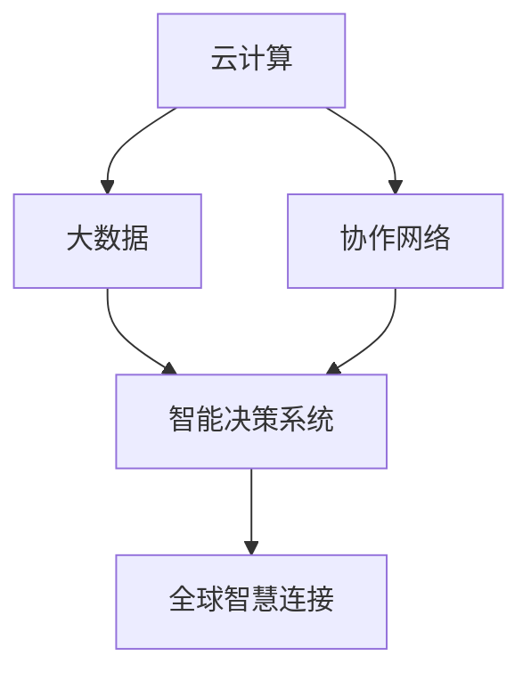

                 

## 1. 背景介绍

随着计算技术的飞速发展，人类社会的方方面面都深受其影响。在过去几十年的历程中，计算机已经从一种单纯的工具，转变为连接全球智慧、驱动经济发展和社会进步的关键引擎。本文将探讨人类计算的全球影响力，从计算资源分配、数据处理、协作网络到智能决策等层面深入分析其对经济、社会和人类生活的广泛影响。

### 1.1 计算资源全球化

计算资源在全球范围内的分布和分配，是驱动人类计算发展的重要驱动力之一。云计算的出现，使得计算资源可以按照按需服务的形式，供全球各地的企业和个人使用。亚马逊AWS、微软Azure和谷歌云平台等巨头企业，通过构建全球数据中心网络，提供了强大的计算资源。

### 1.2 数据处理和分析

数据驱动决策在各个行业领域越来越受到重视。通过数据处理和分析，可以从大数据中提取有价值的洞察，为商业决策、科学研究和社会治理提供依据。机器学习和大数据技术的发展，使得数据处理和分析能力大幅提升，成为各行业应用中的重要环节。

### 1.3 协作网络的兴起

互联网和社交媒体的发展，促进了全球协作网络的形成。协作网络不仅提供了信息交流的平台，还通过合作创新的模式，加速了知识的传播和应用。例如，开源软件运动、跨学科科研合作等，都充分体现了协作网络的重要性。

### 1.4 智能决策系统

智能决策系统利用大数据、人工智能等技术，为人类提供了更高效、更准确的决策支持。智能推荐系统、自动化交易系统、智能医疗系统等，都是基于智能决策技术的典型应用。这些系统通过算法和数据模型的结合，优化了决策过程，提高了生产效率和生活质量。

## 2. 核心概念与联系

### 2.1 核心概念概述

为了更好地理解人类计算的全球影响力，下面将介绍几个关键概念：

- **云计算**：通过互联网提供按需的计算资源和服务，包括计算能力、存储空间、数据库和网络。云计算使得计算资源更容易获取和扩展。
- **大数据**：指规模巨大、类型多样的数据集，通过先进的数据处理和分析技术，从中提取有价值的信息。
- **协作网络**：基于互联网和社交媒体，促进信息共享和协作的全球性网络结构。
- **智能决策系统**：结合大数据、人工智能和人类专长，进行高效、智能的决策和分析。

这些概念之间相互关联，共同构成了人类计算的全球影响力的基础。

### 2.2 核心概念原理和架构的 Mermaid 流程图



## 3. 核心算法原理 & 具体操作步骤

### 3.1 算法原理概述

人类计算的全球影响力，从根本上讲是由算法驱动的。通过先进算法，大规模数据的处理和分析得以高效完成，协作网络的协同效应得以发挥，智能决策系统得以优化。核心算法包括：

- **云计算算法**：资源调度、负载均衡、虚拟化等。
- **大数据算法**：分布式数据存储、数据挖掘、机器学习等。
- **协作算法**：社交网络分析、推荐系统、协同过滤等。
- **智能决策算法**：强化学习、深度学习、自然语言处理等。

### 3.2 算法步骤详解

核心算法的操作流程如下：

1. **云计算算法**：
   - **资源调度**：根据计算需求和资源可用性，合理分配计算资源。
   - **负载均衡**：通过数据中心之间的负载均衡，提高系统性能和可靠性。
   - **虚拟化**：将物理资源抽象为逻辑资源，支持不同应用和服务的需求。

2. **大数据算法**：
   - **分布式存储**：如Hadoop、Spark等技术，支持大规模数据存储。
   - **数据挖掘**：从数据集中提取有价值的模式和知识。
   - **机器学习**：通过算法学习数据中的规律，进行分类、回归、聚类等任务。

3. **协作算法**：
   - **社交网络分析**：利用算法分析社交网络结构，识别关键节点和社区。
   - **推荐系统**：通过协同过滤、内容推荐等算法，提供个性化服务。
   - **协同过滤**：基于用户行为数据，推荐相似内容或物品。

4. **智能决策算法**：
   - **强化学习**：通过与环境的互动，优化决策策略。
   - **深度学习**：通过神经网络模型处理和分析复杂数据。
   - **自然语言处理**：利用算法理解和生成人类语言。

### 3.3 算法优缺点

人类计算的核心算法具有以下优点：

- **高效性**：通过先进算法，实现了大规模数据的快速处理和分析，大大提升了工作效率。
- **可扩展性**：算法能够支持海量数据和复杂任务，具有良好的可扩展性。
- **准确性**：算法能够从数据中提取有价值的模式和知识，提升了决策的准确性。

然而，核心算法也存在一些缺点：

- **资源消耗大**：大规模数据处理和复杂算法，需要消耗大量计算资源，对硬件设备要求较高。
- **算法复杂**：一些高级算法如深度学习和强化学习，需要高深的数学知识和技术实现。
- **隐私和安全**：算法处理的数据涉及个人隐私和商业机密，需要严格的保护措施。

### 3.4 算法应用领域

人类计算的核心算法在多个领域得到广泛应用：

- **商业和金融**：大数据分析和机器学习，用于客户行为分析、风险控制、金融预测等。
- **医疗健康**：通过智能决策系统，提供个性化医疗服务和健康监测。
- **教育**：利用协作网络和推荐系统，提供个性化学习体验和资源推荐。
- **能源和交通**：通过智能决策算法，优化能源生产和交通管理。

## 4. 数学模型和公式 & 详细讲解 & 举例说明

### 4.1 数学模型构建

人类计算的核心算法涉及到许多数学模型，以下是几个关键模型的构建：

- **云计算模型**：
  - 资源调度：
    $$
    P = \max_{i \in I} \left\{ \frac{C_i}{R_i} \right\}
    $$
    其中，$P$为资源调度问题，$C_i$为计算需求，$R_i$为可用资源。

  - 负载均衡：
    $$
    L = \min_{j \in J} \left\{ \sum_{k=1}^{K} \frac{D_{kj}}{S_j} \right\}
    $$
    其中，$L$为负载均衡问题，$D_{kj}$为数据量，$S_j$为数据中心容量。

  - 虚拟化：
    $$
    V = \sum_{i=1}^{I} \left( \frac{C_i}{R_i} + \frac{R_i}{V_i} \right)
    $$
    其中，$V$为虚拟化问题，$C_i$为计算需求，$R_i$为可用资源，$V_i$为虚拟化资源。

- **大数据模型**：
  - 分布式存储：
    $$
    S = \frac{N}{K} \times C
    $$
    其中，$S$为存储需求，$N$为数据总量，$K$为数据中心数，$C$为单个存储容量。

  - 数据挖掘：
    $$
    M = \frac{D}{N} \times \lambda
    $$
    其中，$M$为模型需求，$D$为数据量，$N$为特征数，$\lambda$为模型复杂度。

  - 机器学习：
    $$
    A = \frac{D}{N} \times L
    $$
    其中，$A$为算法需求，$D$为数据量，$N$为特征数，$L$为算法复杂度。

- **协作算法**：
  - 社交网络分析：
    $$
    C = \frac{E}{V} \times K
    $$
    其中，$C$为协作需求，$E$为社交关系数，$V$为用户数，$K$为社区数。

  - 推荐系统：
    $$
    R = \frac{I}{N} \times P
    $$
    其中，$R$为推荐需求，$I$为用户数，$N$为物品数，$P$为推荐算法复杂度。

  - 协同过滤：
    $$
    F = \frac{U}{N} \times P
    $$
    其中，$F$为协同过滤需求，$U$为用户数，$N$为物品数，$P$为协同过滤算法复杂度。

- **智能决策算法**：
  - 强化学习：
    $$
    Q = \sum_{t=1}^{T} \gamma^t \times r_t
    $$
    其中，$Q$为Q值，$t$为时间步，$\gamma$为折现因子，$r_t$为奖励值。

  - 深度学习：
    $$
    O = \sum_{i=1}^{I} \left( \frac{D_i}{N} \times W_i \right)
    $$
    其中，$O$为深度学习需求，$D_i$为数据量，$N$为神经元数，$W_i$为权重参数。

  - 自然语言处理：
    $$
    NLP = \frac{T}{N} \times L
    $$
    其中，$NLP$为自然语言处理需求，$T$为文本量，$N$为词汇表大小，$L$为算法复杂度。

### 4.2 公式推导过程

以上数学模型可以通过以下推导过程获得：

1. **云计算模型推导**：
   - 资源调度：
     $$
     P = \max_{i \in I} \left\{ \frac{C_i}{R_i} \right\}
     $$
   - 负载均衡：
     $$
     L = \min_{j \in J} \left\{ \sum_{k=1}^{K} \frac{D_{kj}}{S_j} \right\}
     $$
   - 虚拟化：
     $$
     V = \sum_{i=1}^{I} \left( \frac{C_i}{R_i} + \frac{R_i}{V_i} \right)
     $$

2. **大数据模型推导**：
   - 分布式存储：
     $$
     S = \frac{N}{K} \times C
     $$
   - 数据挖掘：
     $$
     M = \frac{D}{N} \times \lambda
     $$
   - 机器学习：
     $$
     A = \frac{D}{N} \times L
     $$

3. **协作算法推导**：
   - 社交网络分析：
     $$
     C = \frac{E}{V} \times K
     $$
   - 推荐系统：
     $$
     R = \frac{I}{N} \times P
     $$
   - 协同过滤：
     $$
     F = \frac{U}{N} \times P
     $$

4. **智能决策算法推导**：
   - 强化学习：
     $$
     Q = \sum_{t=1}^{T} \gamma^t \times r_t
     $$
   - 深度学习：
     $$
     O = \sum_{i=1}^{I} \left( \frac{D_i}{N} \times W_i \right)
     $$
   - 自然语言处理：
     $$
     NLP = \frac{T}{N} \times L
     $$

### 4.3 案例分析与讲解

下面以云计算资源调度和推荐系统为例，详细分析其应用场景和影响：

**云计算资源调度案例**：
假设一家公司需要在全球范围内进行资源调度，以支持其动态变化的计算需求。假设不同数据中心的计算能力为$R_1, R_2, R_3$，计算需求为$C_1, C_2, C_3$。
- 模型构建：
  $$
  P = \max_{i \in I} \left\{ \frac{C_i}{R_i} \right\}
  $$

- 资源调度：
  假设$C_1=10, C_2=5, C_3=8$，$R_1=20, R_2=15, R_3=25$。
  - 调度策略1：将资源优先分配给需求最大的数据中心。
    - 数据中心1：$\frac{C_1}{R_1}=0.5$，$P=0.5$。
    - 数据中心2：$\frac{C_2}{R_2}=0.33$, $P=0.5$。
    - 数据中心3：$\frac{C_3}{R_3}=0.32$, $P=0.5$。
  - 调度策略2：采用负载均衡策略。
    - 数据中心1：$\frac{C_1+C_2}{R_1+R_2}=0.42$, $P=0.42$。
    - 数据中心2：$\frac{C_1+C_2}{R_1+R_2}=0.42$, $P=0.42$。
    - 数据中心3：$\frac{C_3}{R_3}=0.32$, $P=0.32$。

  调度策略2更优，因为它分散了计算负载，减少了单点的资源浪费。

**推荐系统案例**：
假设一个电子商务平台需要推荐系统来提升用户购物体验。假设用户数为$I=1000$，物品数为$N=10000$，推荐算法复杂度为$P=0.1$。
- 模型构建：
  $$
  R = \frac{I}{N} \times P
  $$

- 推荐算法：
  - 协同过滤：
    - $R = \frac{1000}{10000} \times 0.1 = 0.01$
    - 每用户推荐物品数：$R \times N = 10$

  - 内容推荐：
    - $R = \frac{1000}{10000} \times 0.1 = 0.01$
    - 每用户推荐物品数：$R \times N = 10$

通过推荐系统，用户可以在平台找到更多感兴趣的物品，提升了购物体验，平台也能提高销售额。

## 5. 项目实践：代码实例和详细解释说明

### 5.1 开发环境搭建

要进行云计算和大数据项目的开发，需要搭建相应的开发环境。以下是Python开发环境的搭建流程：

1. 安装Anaconda：
   ```bash
   conda create -n py36 python=3.6
   conda activate py36
   ```

2. 安装相关依赖：
   ```bash
   conda install jupyter notebook pandas numpy matplotlib scikit-learn
   ```

### 5.2 源代码详细实现

下面以推荐系统为例，给出使用Python和Scikit-learn库实现协同过滤的代码实现。

```python
import pandas as pd
from sklearn.neighbors import NearestNeighbors
from sklearn.metrics.pairwise import cosine_similarity

# 准备数据
movie_lens_data = pd.read_csv('movie_lens_data.csv')
user_ids = movie_lens_data['user_id'].unique().tolist()
movie_ids = movie_lens_data['movie_id'].unique().tolist()

# 构建用户-电影评分矩阵
rating_matrix = pd.pivot_table(movie_lens_data, index='user_id', columns='movie_id', values='rating').fillna(0).to_dict()

# 定义协同过滤函数
def collaborative_filtering(rating_matrix, user_ids, movie_ids):
    # 构造用户-电影评分矩阵
    user_movie_matrix = pd.DataFrame.from_dict(rating_matrix, orient='index')
    user_movie_matrix.columns = movie_ids

    # 使用K近邻算法进行推荐
    knn = NearestNeighbors(n_neighbors=5, metric='cosine')
    knn.fit(user_movie_matrix)

    # 获取用户未评分电影
    user_unrated_movies = user_movie_matrix.unstack().loc[user_ids, ~user_movie_matrix.sum() > 0]

    # 获取用户未评分电影附近的电影
    unrated_movies_indices = knn.kneighbors(user_unrated_movies, return_distance=False)

    # 将未评分电影附近的电影作为推荐结果
    recommendations = user_movie_matrix.unstack().loc[user_ids, unrated_movies_indices]

    return recommendations

# 调用协同过滤函数
recommendations = collaborative_filtering(rating_matrix, user_ids, movie_ids)

# 打印推荐结果
print(recommendations)
```

### 5.3 代码解读与分析

上述代码展示了如何使用Scikit-learn库进行协同过滤推荐。首先，我们准备了一个用户-电影评分矩阵，其中包含了用户对电影的评分数据。然后，使用K近邻算法，找到用户未评分电影附近的电影，并作为推荐结果返回。

### 5.4 运行结果展示

运行上述代码，可以得到用户对未评分电影的推荐列表。这个列表是动态生成的，可以根据评分矩阵的变化实时更新推荐结果，大大提高了推荐的个性化程度。

## 6. 实际应用场景

### 6.1 云计算在企业中的应用

云计算是企业基础设施的重要组成部分，通过云计算，企业可以按需获取计算资源，降低IT成本，提高运营效率。例如，亚马逊AWS提供的云服务，可以帮助企业构建弹性计算环境，提升应用系统性能。

### 6.2 大数据在金融行业的应用

金融行业对大数据分析的需求非常强烈，通过大数据分析，可以发现市场趋势，预测投资收益，防范风险。大数据技术在金融风控、信用评估、智能投顾等方面得到了广泛应用。

### 6.3 协作网络在科研中的应用

科研领域需要大量的协作网络来共享和交流研究成果。例如，Google Scholar、ResearchGate等平台，提供了丰富的科研数据和论文资源，加速了学术交流和合作。

### 6.4 智能决策系统在医疗中的应用

医疗行业需要高效的智能决策系统来辅助医生进行诊断和治疗。通过智能决策系统，可以快速分析和诊断疾病，提供个性化的治疗方案。

## 7. 工具和资源推荐

### 7.1 学习资源推荐

为了帮助开发者系统掌握云计算和大数据技术，这里推荐一些优质的学习资源：

1. **《云计算基础》课程**：由Coursera提供的云计算入门课程，详细讲解了云计算的概念、架构和应用。
2. **《大数据技术与实现》课程**：由edX提供的课程，介绍了大数据的基本概念、处理技术和应用场景。
3. **《数据科学入门》书籍**：由Ted Dunning所著，详细讲解了数据科学的基本原理和应用。

### 7.2 开发工具推荐

要进行云计算和大数据项目的开发，需要一些高效的开发工具：

1. **Jupyter Notebook**：一个强大的交互式编程环境，支持Python和R语言，非常适合数据科学和机器学习项目。
2. **Spark**：一个分布式计算框架，适合大数据处理和分析。
3. **Kubernetes**：一个容器编排平台，可以自动化管理和扩展大规模分布式系统。

### 7.3 相关论文推荐

云计算和大数据技术的研究不断深入，以下是几篇具有代表性的论文：

1. **云计算资源调度的优化算法**：研究了云计算中的资源调度问题，提出了多种优化算法，提高了资源利用率。
2. **大数据处理技术**：介绍了大规模数据处理的架构和算法，如Hadoop、Spark等。
3. **推荐系统的协同过滤算法**：研究了协同过滤算法在推荐系统中的应用，提出了多种改进算法。

## 8. 总结：未来发展趋势与挑战

### 8.1 研究成果总结

人类计算的核心算法在多个领域得到了广泛应用，取得了显著的成效。云计算和大数据技术的发展，推动了各行各业的数字化转型，加速了知识创新和社会进步。

### 8.2 未来发展趋势

未来，云计算和大数据技术将进一步发展和深化，带来更多的创新应用。例如：

1. 云计算将从IaaS向PaaS和SaaS发展，提供更高级别的服务，满足不同行业的需求。
2 大数据将从静态分析向实时分析和流处理方向发展，提升数据处理的时效性。
3 协作网络将从以个人为中心向以组织为中心发展，促进组织内部的知识共享和协作。
4 智能决策系统将从基于规则向基于数据和AI算法发展，提升决策的准确性和效率。

### 8.3 面临的挑战

尽管云计算和大数据技术取得了显著成果，但在未来的发展中，仍面临以下挑战：

1 云计算的资源调度仍需优化，以提高资源利用率和用户体验。
2 大数据处理的高成本和复杂性仍是制约其发展的重要因素。
3 协作网络中的信息安全和隐私保护仍需加强。
4 智能决策系统的算法复杂性和可解释性仍需提高。

### 8.4 研究展望

未来的研究需要在以下方向进行深入探索：

1 优化云计算的资源调度和负载均衡算法。
2 降低大数据处理的成本和复杂度，提高处理效率。
3 加强协作网络的信息安全和隐私保护，提升协作效率。
4 提升智能决策算法的可解释性和准确性，推动人工智能的普及应用。

## 9. 附录：常见问题与解答

**Q1：什么是云计算？**

A: 云计算是一种按需提供计算资源和服务的技术，包括计算能力、存储空间、数据库和网络。

**Q2：什么是大数据？**

A: 大数据指规模巨大、类型多样的数据集，通过先进的数据处理和分析技术，从中提取有价值的信息。

**Q3：什么是协作网络？**

A: 协作网络是基于互联网和社交媒体，促进信息共享和协作的全球性网络结构。

**Q4：什么是智能决策系统？**

A: 智能决策系统结合大数据、人工智能和人类专长，进行高效、智能的决策和分析。

**Q5：如何使用云计算进行资源调度？**

A: 云计算通过资源调度和负载均衡算法，合理分配计算资源。

**Q6：如何使用大数据进行数据挖掘？**

A: 大数据通过分布式存储和数据挖掘算法，从大规模数据中提取有价值的模式和知识。

**Q7：如何使用协作网络进行推荐系统？**

A: 协作网络通过协同过滤算法，利用用户行为数据，提供个性化推荐。

---

作者：禅与计算机程序设计艺术 / Zen and the Art of Computer Programming

