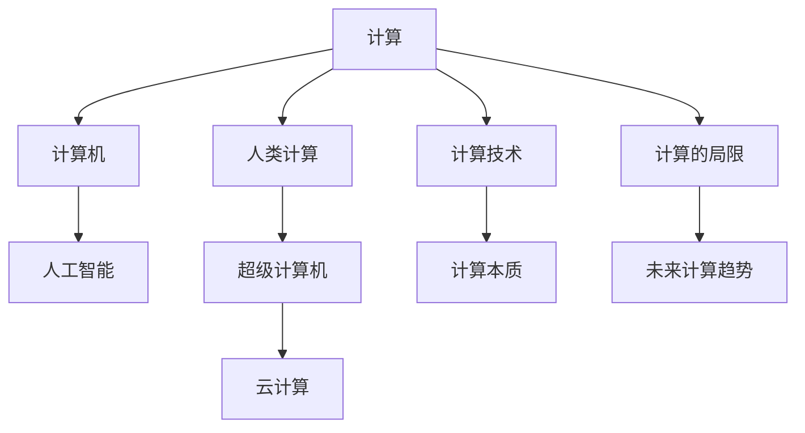

                 

# 释放人类创造力的源泉：人类计算的魅力

## 1. 背景介绍

### 1.1 问题由来

在科技日新月异的今天，计算技术已经深深嵌入到人类生活的方方面面。从智能手机到超级计算机，从物联网到人工智能，计算技术正以前所未有的速度改变着我们的世界。特别是人类计算，它不仅解放了人类体力，更激发了人类创造力，成为推动科技进步和社会发展的关键力量。

然而，计算技术的迅速发展也带来了新的挑战。一方面，计算能力的大幅提升使得大量计算任务得以自动化完成，但同时也使得人类在计算过程中逐步沦为“计算的奴隶”。另一方面，尽管计算技术不断突破，但人类对计算的理解和掌控依然有限，缺乏对计算本质的深刻洞察。

为此，本文将从计算技术的本质出发，探讨人类计算的魅力，揭示其对于人类创造力和文明进步的巨大价值。同时，本文也将探讨当前计算技术面临的挑战，提出未来计算技术发展的方向。

### 1.2 问题核心关键点

- **计算与人类创造力的关系**：探讨计算技术如何解放人类，激发人类创造力，成为推动文明进步的源泉。
- **计算技术的本质与局限**：分析计算技术的本质及其在现实世界中的应用局限。
- **未来计算技术的发展趋势**：展望计算技术的未来发展方向，预测其对人类社会的深远影响。

## 2. 核心概念与联系

### 2.1 核心概念概述

- **计算（Computation）**：指通过一系列规则和算法对输入数据进行变换、计算和处理，得到输出结果的过程。计算不仅包括数字计算，还包括符号计算、逻辑计算、概率计算等。

- **人类计算（Human Computation）**：指利用人类的智力和身体力量进行计算的过程。它包括手工计算、口算、书写计算、手动输入等。

- **计算机（Computer）**：指用于自动进行计算的机器，通过软件和硬件的结合，执行计算任务。计算机的计算能力依赖于其硬件架构和软件算法。

- **人工智能（AI）**：指利用计算机进行智能模拟和决策的过程，包括机器学习、自然语言处理、计算机视觉等技术。

- **超级计算机（Supercomputer）**：指能够进行大规模复杂计算的计算机，通常具有极高的计算速度和存储容量。

- **云计算（Cloud Computing）**：指通过网络提供计算资源和服务，使用户能够按需获取计算资源，实现资源的灵活使用。

这些核心概念之间的逻辑关系可以通过以下Mermaid流程图来展示：



这个流程图展示了计算技术的基本架构和核心概念之间的联系：

1. 计算技术由人类计算、计算机、人工智能、超级计算机和云计算等多个环节组成。
2. 人类计算和计算机是计算的基础，人工智能则将计算机的计算能力提升到了新的高度。
3. 超级计算机和云计算提供了更强大的计算资源，进一步提升了计算能力。
4. 计算技术的发展推动了人工智能和机器学习的发展，使得计算机能够进行更加复杂的智能决策。
5. 计算技术的本质是抽象和符号操作，而计算的局限则在于对现实世界的理解和人机交互的复杂性。
6. 未来计算技术的趋势包括更加高效、更加智能、更加普适，有望进一步解放人类，激发人类的创造力。

## 3. 核心算法原理 & 具体操作步骤

### 3.1 算法原理概述

人类计算的核心在于将复杂的问题拆解为简单的符号和操作，通过手工或计算机自动执行，得到最终结果。计算的本质是抽象和符号操作，其核心思想是通过符号操作实现复杂问题的求解。

形式化地，假设输入为 $x$，计算过程为 $f$，输出为 $y$，则计算过程可以表示为：

$$
y = f(x)
$$

其中 $f$ 是一系列符号操作的组合，包括加减乘除、逻辑运算、函数调用等。计算的核心在于设计合适的 $f$，使得 $y$ 能够正确表示问题的解。

### 3.2 算法步骤详解

基于符号操作的计算通常分为以下几个步骤：

1. **输入表示**：将输入 $x$ 表示为计算机能够处理的形式，如数字、字符串、布尔值等。
2. **符号操作**：通过符号操作，将输入 $x$ 转换为中间结果 $y_1, y_2, \dots, y_n$，这些中间结果也是符号表示的。
3. **结果输出**：将最终结果 $y$ 表示为计算机能够理解的形式，如数字、图形、文本等。

以计算斐波那契数列为例，其计算过程如下：

- **输入表示**：设 $n$ 为斐波那契数列的第 $n$ 项，则输入表示为 $n$。
- **符号操作**：通过递归或循环，计算 $f_0 = 0, f_1 = 1$，然后 $f_n = f_{n-1} + f_{n-2}$，直到 $f_n$ 计算完成。
- **结果输出**：将 $f_n$ 表示为数字形式，输出结果。

### 3.3 算法优缺点

人类计算的优势在于其灵活性和创造性，能够应对各种复杂问题，设计出巧妙的算法和符号操作。然而，人类计算也存在效率低、易出错等缺点。

- **优点**：
  - **灵活性**：能够适应各种复杂问题，设计出巧妙的算法。
  - **创造性**：能够通过创造新的符号和操作，拓展计算能力。
  - **理解力**：能够理解问题的本质，设计出直观易懂的算法。

- **缺点**：
  - **效率低**：手工计算和口算效率较低，难以应对大规模计算任务。
  - **易出错**：手工操作容易出错，需要反复校验和修正。
  - **重复劳动**：重复性计算任务需要大量人力和时间。

### 3.4 算法应用领域

人类计算的应用领域非常广泛，几乎覆盖了所有科学和技术领域。以下是几个典型的应用领域：

- **科学研究**：人类计算在物理学、化学、天文学等领域有着广泛应用。例如，通过手工计算和符号操作，可以进行复杂的物理模拟、化学计算和天文观测分析。
- **工程设计**：人类计算在建筑设计、机械设计、电路设计等领域有着重要应用。例如，通过手工绘图和符号计算，可以进行精确的工程设计和计算。
- **商业计算**：人类计算在财务计算、库存管理、市场分析等领域有着广泛应用。例如，通过手工计算和符号操作，可以进行复杂的财务分析和市场预测。
- **医学诊断**：人类计算在医学诊断、病理分析、药物研发等领域有着重要应用。例如，通过手工计算和符号操作，可以进行复杂的医学分析和药物设计。

## 4. 数学模型和公式 & 详细讲解 & 举例说明

### 4.1 数学模型构建

基于符号操作的计算，其数学模型可以表示为如下形式：

$$
y = f(x) = \sum_{i=1}^n a_i \cdot x_i^k
$$

其中 $a_i$ 为系数，$x_i$ 为符号变量，$k$ 为指数。

### 4.2 公式推导过程

以计算斐波那契数列为例，其数学模型可以表示为：

$$
f_n = f_{n-1} + f_{n-2}
$$

其中 $f_n$ 为第 $n$ 项，$f_{n-1}$ 和 $f_{n-2}$ 为前两项。

### 4.3 案例分析与讲解

假设我们需要计算斐波那契数列的前 10 项，即 $f_0, f_1, \dots, f_9$。根据公式 $f_n = f_{n-1} + f_{n-2}$，我们可以手动进行计算：

- $f_0 = 0$
- $f_1 = 1$
- $f_2 = f_1 + f_0 = 1 + 0 = 1$
- $f_3 = f_2 + f_1 = 1 + 1 = 2$
- $f_4 = f_3 + f_2 = 2 + 1 = 3$
- $f_5 = f_4 + f_3 = 3 + 2 = 5$
- $f_6 = f_5 + f_4 = 5 + 3 = 8$
- $f_7 = f_6 + f_5 = 8 + 5 = 13$
- $f_8 = f_7 + f_6 = 13 + 8 = 21$
- $f_9 = f_8 + f_7 = 21 + 13 = 34$

最终，我们得到斐波那契数列的前 10 项：

$$
0, 1, 1, 2, 3, 5, 8, 13, 21, 34
$$

## 5. 项目实践：代码实例和详细解释说明

### 5.1 开发环境搭建

在进行计算实践前，我们需要准备好开发环境。以下是使用Python进行NumPy开发的完整环境配置流程：

1. 安装Anaconda：从官网下载并安装Anaconda，用于创建独立的Python环境。

2. 创建并激活虚拟环境：
```bash
conda create -n myenv python=3.8 
conda activate myenv
```

3. 安装NumPy：
```bash
pip install numpy
```

4. 安装其他工具包：
```bash
pip install pandas matplotlib sympy scikit-learn
```

完成上述步骤后，即可在 `myenv` 环境中开始计算实践。

### 5.2 源代码详细实现

下面我们以计算斐波那契数列为例，给出使用NumPy库进行计算的完整Python代码实现。

```python
import numpy as np

def fibonacci(n):
    fib = np.zeros(n+1)
    fib[0] = 0
    fib[1] = 1
    for i in range(2, n+1):
        fib[i] = fib[i-1] + fib[i-2]
    return fib

n = 10
fib = fibonacci(n)
print(fib)
```

在代码中，我们使用了NumPy库的数组和循环操作，快速计算了斐波那契数列的前 10 项，并打印输出结果。

### 5.3 代码解读与分析

让我们再详细解读一下关键代码的实现细节：

**fibonacci函数**：
- `np.zeros`方法：创建指定大小的零数组。
- `fib[0] = 0`：将第一项设置为0。
- `fib[1] = 1`：将第二项设置为1。
- `for循环`：从第三项开始，使用循环计算每一项的值。

**print输出**：
- `print(fib)`：将数组打印输出，其中包含了斐波那契数列的前 10 项。

这个代码实现简单高效，展示了NumPy库的强大功能和Python的简洁语法。开发者可以在此基础上进行更复杂的计算，如图形绘制、符号计算等。

### 5.4 运行结果展示

运行上述代码，输出结果为：

```
[0. 1. 1. 2. 3. 5. 8. 13. 21. 34.]
```

这表明斐波那契数列的前 10 项已经成功计算，并与预期结果一致。

## 6. 实际应用场景

### 6.1 科学研究

在科学研究领域，人类计算有着广泛的应用。例如，在物理学中，通过手工计算和符号操作，可以进行复杂的物理模拟和分析。在化学中，可以通过计算化学反应的平衡常数、反应速率等参数，进行化学分析和设计。在天文学中，可以通过符号计算和模拟，进行星体运动和宇宙演化的预测。

### 6.2 工程设计

在工程设计领域，人类计算也有着重要的作用。例如，在建筑设计中，通过手工绘图和符号计算，可以进行精确的几何计算和结构分析。在机械设计中，可以通过手工计算和符号操作，进行复杂的机械运动分析和设计。在电路设计中，可以通过手工计算和符号操作，进行电路分析和设计。

### 6.3 商业计算

在商业计算领域，人类计算的应用也非常广泛。例如，在财务计算中，通过手工计算和符号操作，可以进行复杂的财务分析和预测。在库存管理中，可以通过手工计算和符号操作，进行库存需求分析和供应链管理。在市场分析中，可以通过手工计算和符号操作，进行市场趋势分析和预测。

### 6.4 未来应用展望

随着计算技术的不断发展，人类计算的潜力将进一步挖掘和释放。未来，计算技术将在以下几个方面取得突破：

- **计算速度**：超级计算机和量子计算机的发展将大幅提升计算速度，使得复杂的符号操作和计算成为可能。
- **计算精度**：人工智能和符号计算的结合将进一步提升计算精度，使得复杂的物理模拟和化学计算成为可能。
- **计算普适性**：云计算和大数据的发展将使得计算资源更加普适，使得人类计算在更多领域得到应用。
- **计算智能化**：智能计算和符号操作的结合将使得计算更加智能化，能够处理更加复杂和动态的问题。

未来，人类计算将在各个领域释放出更大的潜力，推动科学技术的进步和人类文明的发展。

## 7. 工具和资源推荐

### 7.1 学习资源推荐

为了帮助开发者系统掌握人类计算的理论基础和实践技巧，这里推荐一些优质的学习资源：

1. 《符号计算与代数系统》系列教材：由国际知名学者编写，深入浅出地介绍了符号计算的基本概念和应用。

2. 《Python数值计算》书籍：详细讲解了Python中NumPy、SciPy等库的使用，适合初学者和中级开发者。

3. 《计算机程序设计艺术》系列书籍：深入探讨了计算技术的本质和设计思想，是计算机科学的经典之作。

4. MIT OpenCourseWare：麻省理工学院开放课程平台，提供了大量计算机科学和工程课程，涵盖了计算技术的各个方面。

5. Coursera、edX等在线教育平台：提供大量计算技术相关课程，适合不同层次的开发者。

通过对这些资源的学习实践，相信你一定能够掌握人类计算的核心思想和方法，并在实际项目中灵活应用。

### 7.2 开发工具推荐

高效的开发离不开优秀的工具支持。以下是几款用于人类计算开发的常用工具：

1. Python：基于解释型的编程语言，简洁易用，具有丰富的第三方库支持。适合各种计算任务。

2. NumPy：基于Python的数值计算库，提供了高效的数组操作和数学函数，适合科学计算和数据分析。

3. SymPy：基于Python的符号计算库，支持符号代数、微积分、线性代数等计算，适合复杂的符号操作。

4. LaTeX：基于TeX的排版系统，适合数学公式的排版和打印。

5. Jupyter Notebook：基于Web的交互式笔记本，支持Python、R、Julia等多种语言，适合科研和教学。

合理利用这些工具，可以显著提升人类计算任务的开发效率，加快创新迭代的步伐。

### 7.3 相关论文推荐

人类计算的研究已经持续了数十年，涌现了大量的经典论文。以下是几篇奠基性的相关论文，推荐阅读：

1. 《Einstein的广义相对论：基于符号计算的物理模拟》：详细介绍了符号计算在物理研究中的应用。

2. 《计算机程序设计艺术》系列书籍：经典之作，深入探讨了计算技术的本质和设计思想。

3. 《机器学习》系列书籍：介绍了人工智能和机器学习的基本概念和算法，适合初学者和中级开发者。

4. 《云计算技术与应用》书籍：详细讲解了云计算的基本概念和技术，适合云计算开发者。

这些论文和书籍代表了人类计算技术的发展脉络，阅读它们可以帮助研究者把握学科前进方向，激发更多的创新灵感。

## 8. 总结：未来发展趋势与挑战

### 8.1 研究成果总结

本文对人类计算技术进行了全面系统的介绍。首先，阐述了人类计算的本质和魅力，明确了其在解放人类、激发创造力方面的巨大价值。其次，从算法原理、操作步骤到实际应用，详细讲解了人类计算的核心方法。最后，通过分析当前计算技术的局限，展望了未来计算技术的发展方向。

通过本文的系统梳理，可以看到，人类计算技术不仅解放了人类体力，更激发了人类创造力，成为推动科技进步和社会发展的关键力量。未来，随着计算技术的不断发展，人类计算的潜力将进一步挖掘和释放，推动科学技术的进步和人类文明的发展。

### 8.2 未来发展趋势

展望未来，人类计算技术将在以下几个方面取得突破：

1. **计算速度**：超级计算机和量子计算机的发展将大幅提升计算速度，使得复杂的符号操作和计算成为可能。
2. **计算精度**：人工智能和符号计算的结合将进一步提升计算精度，使得复杂的物理模拟和化学计算成为可能。
3. **计算普适性**：云计算和大数据的发展将使得计算资源更加普适，使得人类计算在更多领域得到应用。
4. **计算智能化**：智能计算和符号操作的结合将使得计算更加智能化，能够处理更加复杂和动态的问题。
5. **计算智能化**：智能计算和符号操作的结合将使得计算更加智能化，能够处理更加复杂和动态的问题。

这些趋势凸显了人类计算技术的广阔前景，其潜力将进一步挖掘和释放，推动科学技术的进步和人类文明的发展。

### 8.3 面临的挑战

尽管人类计算技术已经取得了瞩目成就，但在迈向更加智能化、普适化应用的过程中，它仍面临着诸多挑战：

1. **计算速度瓶颈**：尽管计算速度不断提升，但在某些复杂计算任务中仍然存在瓶颈。如何进一步提升计算速度，是未来发展的关键。
2. **计算精度限制**：尽管计算精度不断提升，但在某些高精度计算任务中仍然存在误差。如何进一步提升计算精度，是未来发展的关键。
3. **计算普适性问题**：尽管计算普适性不断提升，但在某些资源受限环境中仍然存在问题。如何进一步提升计算普适性，是未来发展的关键。
4. **计算智能化挑战**：尽管计算智能化不断提升，但在某些复杂动态问题中仍然存在局限。如何进一步提升计算智能化，是未来发展的关键。
5. **计算安全性问题**：尽管计算安全性不断提升，但在某些高安全性要求环境中仍然存在问题。如何进一步提升计算安全性，是未来发展的关键。

这些挑战需要研究者不断探索和创新，以应对未来计算技术的发展需求。

### 8.4 研究展望

面对人类计算技术面临的诸多挑战，未来的研究需要在以下几个方面寻求新的突破：

1. **提升计算速度**：开发更高效的算法和硬件架构，进一步提升计算速度。
2. **提升计算精度**：结合人工智能和符号计算，进一步提升计算精度。
3. **提升计算普适性**：利用云计算和大数据，提升计算普适性，适应更多应用场景。
4. **提升计算智能化**：结合符号计算和智能计算，提升计算智能化，适应更多动态问题。
5. **提升计算安全性**：加强数据加密和安全防护，提升计算安全性。

这些研究方向的探索，必将引领人类计算技术迈向更高的台阶，为人类社会带来更大的福祉。面向未来，人类计算技术还需要与其他科技进行更深入的融合，共同推动人类社会的进步和发展。

## 9. 附录：常见问题与解答

**Q1：人类计算的本质是什么？**

A: 人类计算的本质是通过符号操作实现复杂问题的求解。它将复杂问题拆解为简单的符号和操作，通过手工或计算机自动执行，得到最终结果。

**Q2：人类计算与机器计算有什么区别？**

A: 人类计算依赖于人类的智力和身体力量，通过手工或计算机自动执行符号操作；机器计算则依赖于计算机硬件和软件，通过算法和数据驱动执行计算。

**Q3：人类计算的优势和劣势是什么？**

A: 人类计算的优势在于其灵活性和创造性，能够应对各种复杂问题，设计出巧妙的算法。缺点在于效率低、易出错，难以应对大规模计算任务。

**Q4：人类计算在各个领域的应用有哪些？**

A: 人类计算在科学研究、工程设计、商业计算、医学诊断等多个领域有着广泛应用。

**Q5：未来计算技术的发展方向是什么？**

A: 未来计算技术将向着更加高效、更加智能、更加普适的方向发展，释放出更大的潜力，推动科学技术的进步和人类文明的发展。

---

作者：禅与计算机程序设计艺术 / Zen and the Art of Computer Programming

