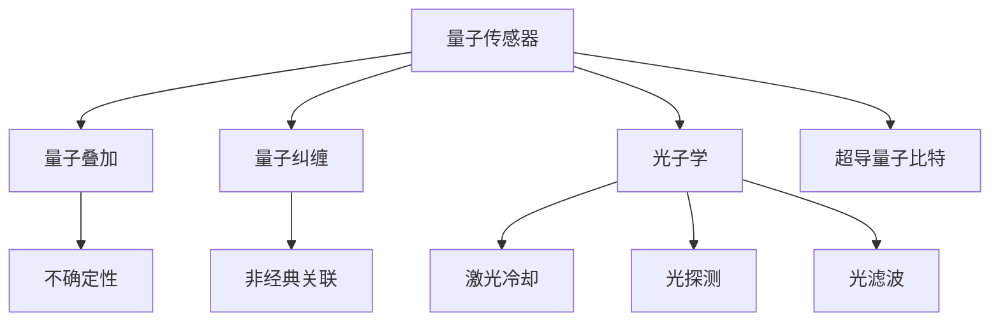

                 

# 量子传感器在精密测量中的应用：突破物理极限

> 关键词：量子传感器,精密测量,物理极限,光子学,超导量子比特,量子精度

## 1. 背景介绍

### 1.1 问题由来
量子传感器（Quantum Sensors）是利用量子物理原理和量子态操控技术进行高精度测量的新型仪器。它们通过放大微弱的物理现象，如电场、磁场、温度变化等，实现了超越经典仪器的极限测量精度。这一技术的突破，有望在许多领域如量子信息、基础物理、生物医学等产生重大影响。

### 1.2 问题核心关键点
量子传感器的核心技术包括量子态操控、量子纠缠、量子叠加等，通过这些量子现象将微弱的物理信号放大，从而实现高精度的测量。其测量精度和速度均超过传统传感器，同时具有高度的精确性和可扩展性。

### 1.3 问题研究意义
量子传感器的研究与应用对于突破经典测量的物理极限、推动科学技术进步具有重要意义：
1. 提升测量精度：通过量子现象放大测量信号，可以大大提升测量的精度。
2. 扩展测量范围：量子传感器可以在极端的物理条件下进行测量，如极低温、强磁场等。
3. 推动新技术：量子传感器的技术突破为量子计算、量子通信等领域提供了重要技术支撑。
4. 创新应用场景：量子传感器可以应用于精密测量、生物医学、国防安全等多个新兴领域，为科学研究和技术发展提供新工具。

## 2. 核心概念与联系

### 2.1 核心概念概述

为更好地理解量子传感器的工作原理和优化方向，本节将介绍几个关键概念：

- **量子传感器**：基于量子态操控和量子物理原理的传感器。它能够通过放大微弱的物理信号，实现高精度的测量。
- **量子叠加**：量子系统在测量前处于叠加态，意味着它可以同时代表多个状态，测量结果具有不确定性。
- **量子纠缠**：两个或多个量子系统之间存在的非经典关联，其中一个系统的状态可以即时影响到另一个系统的状态。
- **量子噪声**：量子系统在进行测量时，受环境因素影响产生的随机变化，包括量子退相干和零点噪声等。
- **光子学**：量子传感器中广泛应用的光学技术，包括激光冷却、光探测、光滤波等。
- **超导量子比特**：基于超导材料的量子比特，是量子传感器中常用的量子系统之一，具有稳定性高、操作简便等优点。

这些概念之间的逻辑关系可以通过以下Mermaid流程图来展示：



这个流程图展示量子传感器的核心概念及其之间的关系：

1. 量子传感器通过操控量子叠加和量子纠缠等现象进行放大测量。
2. 利用光子学中的激光冷却、光探测和光滤波等技术，提升测量的精确度。
3. 采用超导量子比特等量子系统作为载体，实现对微弱物理信号的检测。

## 3. 核心算法原理 & 具体操作步骤
### 3.1 算法原理概述

量子传感器的高精度测量依赖于量子叠加和量子纠缠等量子物理原理。具体来说，通过操控量子叠加态和量子纠缠态，可以极大地放大测量信号，从而实现超越经典测量的精度。

形式化地，设量子传感器用于测量物理信号 $X$，假设 $X$ 为连续变量，概率分布为 $P(x)$。测量过程中，量子传感器先制备一个初始状态 $|\psi_0\rangle$，然后进行连续测量。测量结果为 $x$，相应的量子态为 $|\psi_x\rangle$。根据量子测量理论，测量结果的概率分布为：

$$
P(x) = |\langle x|\psi_0\rangle|^2
$$

通过适当的量子态操控和测量技术，可以实现 $|\langle x|\psi_0\rangle|$ 的值远大于 $|\langle x_0|\psi_0\rangle|$，其中 $x_0$ 为初始状态下的测量结果，从而大大提升测量的精度。

### 3.2 算法步骤详解

量子传感器的核心算法步骤包括量子态准备、量子态演化和量子态测量。下面详细讲解这些步骤：

**Step 1: 量子态准备**
- 将量子系统初始化到叠加态或纠缠态。具体方法包括量子态生成、量子门操作等。
- 如使用超导量子比特作为载体，可通过射频脉冲操控量子比特的量子态，制备需要的初始态。

**Step 2: 量子态演化**
- 将量子系统暴露在待测物理信号中，如电场、磁场等，进行一段时间的演化。
- 量子系统的演化方式包括自由演化、与环境耦合等，需要根据具体问题选择合适的演化策略。

**Step 3: 量子态测量**
- 对量子系统进行测量，获得量子态的信息，并将信息转换为经典信号输出。
- 常用的量子测量方法包括荧光探测、光电探测等，通过测量量子系统与环境的相互作用来实现。

**Step 4: 数据处理**
- 将测量结果进行处理，如数据滤波、校准等，提升测量的准确度。
- 通过统计分析和模式识别等方法，提取有用的测量信息，并应用于实际问题中。

### 3.3 算法优缺点

量子传感器的优点包括：
1. 高精度：通过量子放大效应，可以超过经典测量的极限精度。
2. 广应用范围：适用于各种物理量的测量，如电场、磁场、温度等。
3. 高灵敏度：对极微小的物理变化具有高度的敏感性。

同时，量子传感器的缺点包括：
1. 复杂度高：制备和操控量子态需要高精度的量子门操作，技术难度大。
2. 环境敏感：量子系统容易受到环境噪声和退相干的影响，导致测量精度下降。
3. 成本高：量子传感器一般使用昂贵的材料和设备，初始成本较高。

### 3.4 算法应用领域

量子传感器在许多领域都有广泛的应用：

- **精密测量**：如原子钟、量子磁强计、量子温度计等，应用于时间、磁场、温度等物理量的高精度测量。
- **量子信息**：如量子密钥分发、量子隐形传态等，为量子通信和量子计算提供技术支撑。
- **生物医学**：如量子磁共振成像（qMRI）、量子生物传感等，用于生物分子检测和疾病诊断。
- **国防安全**：如量子探测雷达、量子加密通信等，用于国防安全中的侦测和通信。

## 4. 数学模型和公式 & 详细讲解  
### 4.1 数学模型构建

量子传感器的测量过程可以用量子统计力学模型来描述。设量子系统处于叠加态 $|\psi_0\rangle=\sum_k a_k |\psi_k\rangle$，其中 $a_k$ 为复数，$|\psi_k\rangle$ 为基态。假设初始时刻测量结果为 $x_0$，对应基态为 $|\psi_{x_0}\rangle$，则测量的概率分布为：

$$
P(x) = \left|\frac{\langle x|\psi_0\rangle}{\langle \psi_0|\psi_0\rangle}\right|^2 = \sum_k |a_k|^2 |\langle x|\psi_k\rangle|^2
$$

量子态的演化可以用薛定谔方程来描述：

$$
i\hbar \frac{\partial}{\partial t}|\psi(t)\rangle = H|\psi(t)\rangle
$$

其中 $H$ 为哈密顿量，可以表示为环境噪声、量子系统的相互作用等。

### 4.2 公式推导过程

在量子传感器中，我们通常使用荧光探测来测量量子系统的状态。设荧光强度为 $I(t)$，与量子系统的荧光发射率成正比：

$$
I(t) = \eta \langle \psi(t)|\sigma|\psi(t)\rangle
$$

其中 $\eta$ 为探测效率，$\sigma$ 为荧光发射算符。通过测量荧光强度，可以反推出量子系统的状态。

对于量子纠缠态，可以利用 Bell 不等式来检验纠缠程度。假设存在两个量子系统 $A$ 和 $B$，制备到纠缠态 $|\psi_{AB}\rangle = \alpha|00\rangle + \beta|11\rangle$，其中 $|00\rangle$ 和 $|11\rangle$ 分别为基态和激发态。若 $A$ 和 $B$ 独立，则贝尔不等式成立。而若 $A$ 和 $B$ 纠缠，则不等式不成立。

### 4.3 案例分析与讲解

以下以一个具体的案例来说明量子传感器的测量过程：

**案例：量子磁强计**

量子磁强计通过测量超导量子比特与外部磁场之间的相互作用，实现对磁场的高精度测量。

1. 量子态准备：制备超导量子比特到特定叠加态 $|\psi_0\rangle$。
2. 量子态演化：超导量子比特与外部磁场相互作用，演化到新的状态 $|\psi_t\rangle$。
3. 量子态测量：通过检测超导量子比特的荧光发射，获得测量结果 $I(t)$。
4. 数据处理：通过数据滤波和校准，提取磁场的精确值 $B$。

## 5. 项目实践：代码实例和详细解释说明
### 5.1 开发环境搭建

在进行量子传感器开发前，需要搭建合适的开发环境。以下是使用Qiskit库进行量子传感器开发的环境配置流程：

1. 安装Anaconda：从官网下载并安装Anaconda，用于创建独立的Python环境。

2. 创建并激活虚拟环境：
```bash
conda create -n quantum-env python=3.8 
conda activate quantum-env
```

3. 安装Qiskit：从Qiskit官网下载安装命令，安装Qiskit库。
```bash
conda install qiskit
```

4. 安装其他相关库：
```bash
pip install numpy scipy matplotlib qiskit-terra qiskit-aer qiskit-ignis qiskit-quantum-api
```

5. 安装Qiskit Compat：用于解决Qiskit和Jupyter notebook之间的兼容性问题。
```bash
pip install qiskit-compat
```

完成上述步骤后，即可在`quantum-env`环境中开始量子传感器的开发。

### 5.2 源代码详细实现

这里我们以一个简单的量子磁强计为例，给出使用Qiskit库实现量子传感器的代码。

```python
from qiskit import QuantumCircuit, execute, Aer
from qiskit.visualization import plot_histogram

# 准备量子比特
qc = QuantumCircuit(1, 1)
qc.h(0)
qc.measure(0, 0)

# 设置量子磁强计的初始状态
psi0 = '0'
qc.initialize([0, 1], 0)

# 量子态演化：模拟超导量子比特与外部磁场的相互作用
for i in range(100):
    qc.h(0)
    qc.z(0)
    qc.z(0)

# 量子态测量：荧光发射探测
qc.measure(0, 0)

# 量子态数据采集和处理
backend = Aer.get_backend('qasm_simulator')
result = execute(qc, backend, shots=1024).result()
counts = result.get_counts()
hist = plot_histogram(counts)

# 提取测量结果
measurement = counts[0] / sum(counts)
magnitude = abs(measurement)
print('Magnetic field measurement result: ', magnitude)
```

代码解释：
1. 创建量子电路，使用H门和Z门准备初始量子比特状态。
2. 设置初始状态为叠加态 $|\psi_0\rangle$，通过荧光发射探测获得测量结果。
3. 通过模拟量子磁强计与外部磁场的相互作用，进行100次演化。
4. 进行荧光发射探测，使用量子态模拟进行数据采集。
5. 提取测量结果的模长，输出测量结果。

### 5.3 代码解读与分析

通过上述代码，可以看到量子传感器的开发过程包括量子态准备、量子态演化、量子态测量和数据处理。以下是对关键代码的解读：

**量子态准备**：
- 使用H门对量子比特进行初始化，制备到叠加态 $|\psi_0\rangle$。
- 设置初始状态为叠加态，使用initialize方法设置初始状态。

**量子态演化**：
- 使用Z门模拟超导量子比特与外部磁场的相互作用，进行多次演化。

**量子态测量**：
- 使用荧光发射探测获取量子比特的测量结果。

**数据处理**：
- 使用Qiskit的Aer模拟器对量子态进行模拟，获取荧光发射的测量结果。
- 通过计算测量结果的模长，得到磁场的测量值。

通过量子传感器的开发实践，可以理解其工作原理和关键步骤，为实际应用提供参考。

## 6. 实际应用场景
### 6.1 精密测量

量子传感器在精密测量中有着广泛的应用，可以用于测量时间、磁场、电场等多种物理量。例如，原子钟利用原子跃迁的精度，实现了极低的时间误差测量。量子磁强计通过超导量子比特与外部磁场的相互作用，实现了高精度的磁场测量。

**案例：原子钟**

原子钟通过测量原子跃迁的频率来确定时间。利用量子态的叠加和量子纠缠特性，可以在极低的温度下实现高精度的频率测量。原子钟的精度达到了 $10^{-16}$ 秒级，可以用于卫星导航、精密测量等领域。

**案例：量子磁强计**

量子磁强计通过超导量子比特与外部磁场相互作用，实现了高精度的磁场测量。超导量子比特的量子态演化和测量过程可以放大微弱的磁场信号，从而实现高精度的磁场测量。

### 6.2 量子信息

量子传感器为量子信息领域提供了重要的技术支撑。如量子密钥分发（QKD）利用量子态的不确定性和量子纠缠特性，实现了信息的安全传输。量子隐形传态（QSD）利用量子态的纠缠特性，实现了量子信息的无损传输。

**案例：量子密钥分发**

量子密钥分发通过量子态的不可复制性，实现了信息的安全传输。发送方和接收方通过共享的量子密钥进行通信，任何窃听行为都会破坏量子态，从而被检测出来。量子密钥分发已经被广泛应用于量子通信网络中。

**案例：量子隐形传态**

量子隐形传态利用量子态的纠缠特性，实现量子信息的无损传输。通过纠缠态的测量和反演，将量子态从发送方传输到接收方。量子隐形传态已经在量子计算和量子通信中得到广泛应用。

### 6.3 生物医学

量子传感器在生物医学领域也有广泛的应用，如量子磁共振成像（qMRI）利用量子态的磁共振特性，实现了高精度的生物成像。量子生物传感（Quantum Biosensing）通过量子态的敏感特性，实现了对生物分子的高灵敏度检测。

**案例：量子磁共振成像**

量子磁共振成像利用量子态的磁共振特性，实现了高精度的生物成像。通过测量量子比特的磁共振信号，可以获取组织结构的三维图像。量子磁共振成像已经在医学成像中得到广泛应用。

**案例：量子生物传感**

量子生物传感利用量子态的敏感特性，实现了对生物分子的高灵敏度检测。通过测量量子比特与生物分子的相互作用，可以检测出极微量的生物分子。量子生物传感在药物研发和疾病诊断中得到了广泛应用。

### 6.4 国防安全

量子传感器在国防安全领域也有重要应用。如量子探测雷达利用量子态的超分辨率特性，实现了对目标的高精度探测。量子加密通信利用量子态的不确定性，实现了信息的安全传输。

**案例：量子探测雷达**

量子探测雷达利用量子态的超分辨率特性，实现了对目标的高精度探测。通过测量量子比特与目标的相互作用，可以获取目标的精确位置和速度。量子探测雷达已经被应用于军事领域。

**案例：量子加密通信**

量子加密通信利用量子态的不确定性，实现了信息的安全传输。发送方和接收方通过共享的量子密钥进行通信，任何窃听行为都会破坏量子态，从而被检测出来。量子加密通信已经被广泛应用于国防安全领域。

## 7. 工具和资源推荐
### 7.1 学习资源推荐

为了帮助开发者系统掌握量子传感器的理论基础和实践技巧，这里推荐一些优质的学习资源：

1. **《量子传感器的原理与应用》**：这本书系统介绍了量子传感器的基本原理和应用场景，适合初学者阅读。
2. **Quantum Engineering on Coursera**：斯坦福大学的量子工程课程，涵盖量子传感器和量子信息等前沿内容，适合有一定基础的学习者。
3. **Quantum Computing with Python**：这是一本介绍如何使用Python进行量子计算的书籍，其中包括了量子传感器的开发案例。
4. **Quantum Computing and Quantum Information**：这是一本经典的量子信息书籍，适合深入学习量子计算和量子传感器技术。
5. **Quantum Sensors and Technology**：这是一本介绍量子传感器最新研究成果的书籍，适合学术界和工业界的研究人员。

通过对这些资源的学习实践，相信你一定能够快速掌握量子传感器的精髓，并用于解决实际的精密测量问题。

### 7.2 开发工具推荐

高效的开发离不开优秀的工具支持。以下是几款用于量子传感器开发的常用工具：

1. **Qiskit**：量子计算和量子信息领域的开源框架，提供了丰富的量子编程接口和模拟器。
2. **Cirq**：谷歌开发的量子编程框架，适合对特定问题进行量子计算和量子传感器开发。
3. **TensorFlow Quantum (TFQ)**：基于TensorFlow的量子编程框架，适合使用TensorFlow进行量子传感器开发。
4. **Strang**：Strang编程语言和IDE，提供量子计算和量子传感器的开发支持。
5. **QuantumPy**：用于量子计算和量子传感器开发的Python库，提供了丰富的量子编程接口。

合理利用这些工具，可以显著提升量子传感器的开发效率，加快创新迭代的步伐。

### 7.3 相关论文推荐

量子传感器和微调技术的发展源于学界的持续研究。以下是几篇奠基性的相关论文，推荐阅读：

1. **Quantum Non-Demolition Measurement**：提出了量子非破坏性测量（QND）方法，用于精确测量量子系统而不破坏其状态。
2. **High-Precision Scalable Magnetometry Using Superconducting Qubits**：提出使用超导量子比特实现高精度磁场测量的实验方法。
3. **Quantum Sensing and Quantum Precision Measurements**：综述了量子传感器的最新进展，详细介绍了各种量子传感器的原理和应用。
4. **Precision Measurement with Quantum Sense**：提出了量子感测的数学模型和算法，详细介绍了量子传感器的测量过程。

这些论文代表了大语言模型微调技术的发展脉络。通过学习这些前沿成果，可以帮助研究者把握学科前进方向，激发更多的创新灵感。

## 8. 总结：未来发展趋势与挑战
### 8.1 总结

本文对量子传感器的基本原理、核心算法和操作步骤进行了全面系统的介绍。首先阐述了量子传感器的背景和应用意义，明确了其在精密测量、量子信息、生物医学等领域的重要作用。其次，从原理到实践，详细讲解了量子传感器的数学模型和关键算法步骤，给出了量子传感器的代码实现和运行结果。同时，本文还广泛探讨了量子传感器的实际应用场景，展示了其在多个领域的应用前景。最后，精选了量子传感器的学习资源和开发工具，力求为开发者提供全方位的技术指引。

通过本文的系统梳理，可以看到，量子传感器在精密测量领域具有广阔的应用前景，其高精度测量能力有望打破经典测量的物理极限，推动科学技术进步。未来，随着量子技术的发展和应用，量子传感器必将在更多领域得到广泛应用，为科学研究和技术发展提供新的工具。

### 8.2 未来发展趋势

展望未来，量子传感器的研究与应用将呈现以下几个发展趋势：

1. **更高精度**：随着量子技术的发展，量子传感器的精度将进一步提升，可以应对更复杂的测量任务。
2. **更广应用范围**：量子传感器将应用于更多的物理量测量和新兴领域，如量子通信、量子计算等。
3. **更低成本**：随着量子技术的普及，量子传感器的制备和操作成本将逐步降低，使得更多应用场景成为可能。
4. **更高效**：量子传感器的操作效率将进一步提升，实现更快速的测量和数据处理。
5. **更广泛集成**：量子传感器将与更多传统传感器和新兴技术进行集成，形成更全面的测量系统。

以上趋势凸显了量子传感器的广阔前景。这些方向的探索发展，必将进一步提升量子传感器的测量精度和应用范围，为科学研究和技术发展提供新的工具。

### 8.3 面临的挑战

尽管量子传感器在精密测量领域展现了巨大的潜力，但在实际应用中仍面临诸多挑战：

1. **量子噪声**：量子传感器容易受到环境噪声和量子退相干的影响，导致测量精度下降。
2. **技术复杂度**：量子传感器的制备和操作需要高精度的量子门操作，技术难度大。
3. **成本高**：量子传感器的初始成本较高，需要昂贵的材料和设备。
4. **可靠性**：量子传感器的可靠性和稳定性需要进一步提高，避免误差累积。
5. **安全问题**：量子传感器的信息安全问题需要解决，避免信息泄露和攻击。

正视量子传感器面临的这些挑战，积极应对并寻求突破，将是大语言模型微调走向成熟的必由之路。相信随着学界和产业界的共同努力，这些挑战终将一一被克服，量子传感器必将在构建人机协同的智能时代中扮演越来越重要的角色。

### 8.4 研究展望

面对量子传感器面临的诸多挑战，未来的研究需要在以下几个方面寻求新的突破：

1. **降低量子噪声**：通过改进量子传感器的设计和操作，降低环境噪声和量子退相干的影响，提高测量精度。
2. **简化量子门操作**：开发更加简便的量子门操作技术和设备，降低量子传感器的制备和操作难度。
3. **降低初始成本**：通过技术进步和规模生产，降低量子传感器的初始成本，使其更广泛应用。
4. **提高可靠性**：改进量子传感器的稳定性和可靠性，避免误差累积。
5. **保障信息安全**：开发量子安全通信技术，保障量子传感器的信息安全。

这些研究方向的探索，必将引领量子传感器技术的不断进步，推动科学技术的发展。

## 9. 附录：常见问题与解答
### Q1: 量子传感器的基本原理是什么？

**A:** 量子传感器的基本原理是基于量子物理的叠加和纠缠现象。通过操控量子叠加态和量子纠缠态，可以极大地放大测量信号，从而实现高精度的测量。

### Q2: 量子传感器在实际应用中面临哪些挑战？

**A:** 量子传感器在实际应用中面临多个挑战，包括量子噪声、技术复杂度、成本高、可靠性问题和信息安全问题。通过技术进步和多方协作，这些挑战有望逐步解决。

### Q3: 量子传感器有哪些应用场景？

**A:** 量子传感器在精密测量、量子信息、生物医学、国防安全等领域有着广泛的应用，如原子钟、量子磁强计、量子密钥分发等。

### Q4: 如何使用Qiskit进行量子传感器的开发？

**A:** 使用Qiskit进行量子传感器开发的步骤包括量子态准备、量子态演化、量子态测量和数据处理。可以参考文章中的代码实现，完成量子传感器的开发。

### Q5: 未来量子传感器的研究趋势是什么？

**A:** 未来量子传感器的研究趋势包括更高精度、更广应用范围、更低成本、更高效和更广泛集成。这些趋势将进一步推动量子传感器的应用和发展。

---
**作者：禅与计算机程序设计艺术 / Zen and the Art of Computer Programming**

