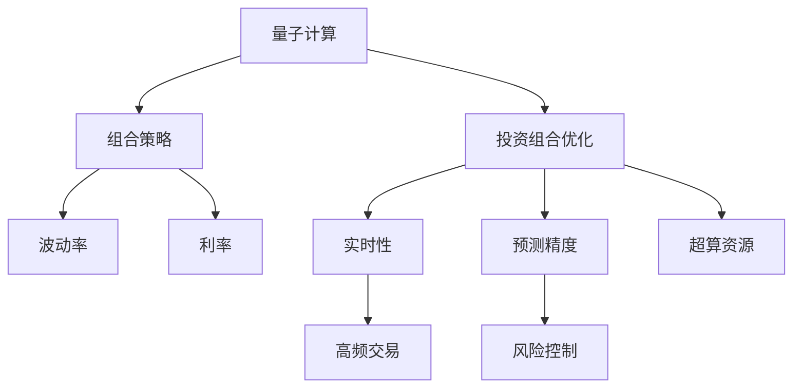

                 

# 量子计算在金融建模中的应用：优化投资组合

> 关键词：量子计算,金融建模,投资组合优化,组合策略,波动率,利率,超算资源

## 1. 背景介绍

### 1.1 问题由来
金融建模在量化投资、风险管理、资产定价等领域中扮演着重要角色，通过数学模型预测未来市场动态和资产价格变化，制定科学的投资策略和风险控制方案。然而，由于金融市场的复杂性和动态性，传统建模方法（如统计学、随机过程）难以有效捕捉市场隐含的深度非线性关系。为此，研究者们开始探索新的数学工具和方法，以期提高金融建模的精度和实时性。

量子计算作为继传统经典计算之后的一种全新计算范式，具有强大的并行处理能力和优势。近年来，研究人员尝试将量子计算引入金融建模中，期望通过量子并行算法，在短时间内高效地处理海量数据，发现市场中的潜在规律和关系，从而实现更精准的投资组合优化。

### 1.2 问题核心关键点
量子计算在金融建模中的应用，核心在于利用量子计算高效处理高维度数据的优势，探索复杂的金融关系和模式，优化投资组合策略。具体来说，其主要解决以下问题：
1. 提高组合策略的预测精度和稳定性。
2. 增强模型的实时性，适应高频交易和实时风险控制的需求。
3. 揭示市场中的深度关系，例如价格对波动率、利率等因素的敏感度。

### 1.3 问题研究意义
量子计算在金融建模中的应用，有助于提升金融风险管理的科学性和准确性，优化投资组合策略，提升交易效率和收益。具体来说：
1. 通过量子算法在短时间内处理海量数据，增强组合策略的预测能力和稳定性。
2. 利用量子计算的优势，优化投资组合的实时调整，提升高频交易效率。
3. 揭示市场中的深度关系，捕捉难以捕捉的市场动态，提升风险控制能力。

## 2. 核心概念与联系

### 2.1 核心概念概述

为更好地理解量子计算在金融建模中的应用，本节将介绍几个密切相关的核心概念：

- 量子计算：基于量子力学原理，通过量子比特的量子叠加和量子纠缠，实现高效并行计算的计算范式。
- 投资组合：由多种资产构成的投资组合，通过不同的资产配置策略，实现风险和收益的平衡。
- 组合策略：确定投资组合中各种资产的权重分配，以实现特定投资目标的策略。
- 波动率：资产价格波动的不确定性，是量化投资中重要的风险指标。
- 利率：影响资产价格的关键因素，包括无风险利率、市场利率等。
- 超算资源：大型高性能计算集群，为量子计算提供必要的硬件支持。

这些核心概念之间的逻辑关系可以通过以下Mermaid流程图来展示：



这个流程图展示了几类核心概念及其之间的关系：

1. 量子计算为投资组合优化提供了高效的工具。
2. 投资组合优化依赖于组合策略的设计，结合波动率、利率等关键指标。
3. 优化后的投资组合有助于高频交易和实时风险控制。
4. 优化的投资组合策略需要超算资源的支持。

这些概念共同构成了量子计算在金融建模中的工作原理和优化方向。

## 3. 核心算法原理 & 具体操作步骤

### 3.1 算法原理概述

量子计算在金融建模中的应用，主要基于量子并行算法，实现高效的数据处理和模式识别。具体来说，量子算法通过量子叠加和量子纠缠，实现高效的多维计算，优化投资组合策略。

量子并行算法在金融建模中的应用，主要包括：
1. 量子蒙特卡洛方法，利用量子随机数生成器，实现高效的随机采样。
2. 量子机器学习，利用量子计算的优势，提升模型训练的效率和精度。
3. 量子优化算法，优化组合策略中的非线性优化问题，提高预测精度和稳定性。

### 3.2 算法步骤详解

以下是量子计算在金融建模中优化投资组合的具体操作步骤：

**Step 1: 准备投资组合数据**
- 收集历史金融数据，包括股票、债券、商品等资产价格，以及波动率、利率等市场指标。
- 数据预处理，包括数据清洗、归一化、去噪等步骤。

**Step 2: 设计量子并行算法**
- 选择合适的量子算法，如量子蒙特卡洛、量子机器学习、量子优化算法等。
- 定义量子态，确定量子计算的输入和输出状态。
- 设定量子计算的超参数，如量子比特数、量子门操作等。

**Step 3: 量子计算处理**
- 将预处理后的数据输入量子计算系统。
- 运行量子并行算法，计算投资组合的期望收益和波动率。
- 输出量子计算结果，获取最优的投资组合策略。

**Step 4: 后处理和策略调整**
- 对量子计算结果进行后处理，结合传统模型进行验证和优化。
- 根据策略效果，动态调整资产权重，适应市场变化。
- 实时监测市场动态，随时更新投资组合策略。

### 3.3 算法优缺点

量子计算在金融建模中的应用具有以下优点：
1. 高效处理高维数据。利用量子并行计算，可以处理海量金融数据，提升组合策略的预测精度和稳定性。
2. 优化非线性问题。量子优化算法能够处理复杂的多维度优化问题，提高模型的实时性和灵活性。
3. 实时性高。量子计算的并行性和量子态保存能力，支持高频交易和实时风险控制。

但同时，该方法也存在以下局限性：
1. 技术成熟度低。量子计算仍处于早期研发阶段，技术实现和工程部署有诸多挑战。
2. 硬件资源限制。量子计算需要高昂的超算资源，目前难以大规模部署。
3. 数据噪声敏感。量子态对数据噪声敏感，需要高质量的数据预处理。
4. 算法复杂度高。量子并行算法设计复杂，需要丰富的量子计算和金融建模经验。

尽管存在这些局限性，但量子计算在金融建模中的应用前景依然广阔。随着技术不断成熟，量子计算必将在提升投资组合优化精度和效率方面发挥重要作用。

### 3.4 算法应用领域

量子计算在金融建模中的应用，主要包括以下几个领域：

- **投资组合优化**：通过量子并行算法，优化资产配置策略，实现收益最大化和风险最小化。
- **高频交易**：利用量子计算的实时性，实时调整投资组合，适应市场波动，获取高频交易收益。
- **风险管理**：量化分析市场风险，实时监测并控制投资组合风险，提升金融系统的稳定性。
- **资产定价**：通过量子计算，准确预测资产价格波动，优化资产定价策略。

## 4. 数学模型和公式 & 详细讲解 & 举例说明

### 4.1 数学模型构建

本节将使用数学语言对量子计算在金融建模中的应用进行更加严格的刻画。

假设有一个投资组合 $P$，包含 $n$ 种资产 $A_1, A_2, \ldots, A_n$。设每种资产的权重为 $w_i$，则投资组合的期望收益为：

$$
E(P) = \sum_{i=1}^n w_i r_i
$$

其中 $r_i$ 为资产 $A_i$ 的期望收益率。

设每种资产的波动率为 $\sigma_i$，则投资组合的波动率为：

$$
\sigma(P) = \sqrt{\sum_{i=1}^n w_i^2 \sigma_i^2 + \sum_{1 \le i<j \le n} w_i w_j \rho_{ij} \sigma_i \sigma_j}
$$

其中 $\rho_{ij}$ 为资产 $A_i$ 和 $A_j$ 之间的相关系数。

### 4.2 公式推导过程

以下我们以投资组合优化为例，推导使用量子计算的方法进行优化的一般过程。

**Step 1: 构建量子态**
- 将投资组合的权重 $w$ 映射为量子比特，利用量子态 $|\psi(w)\rangle$ 表示投资组合的期望收益和波动率。
- 使用量子态叠加和量子纠缠，生成不同投资组合的量子态，用于量子计算。

**Step 2: 量子并行算法**
- 设计量子蒙特卡洛方法，生成大量投资组合的随机样本，计算期望收益和波动率。
- 应用量子机器学习方法，优化投资组合策略，提升模型的预测精度和稳定性。
- 使用量子优化算法，求解投资组合优化问题，得到最优权重分配。

**Step 3: 量子计算输出**
- 运行量子并行算法，输出最优投资组合的量子态 $|\psi(w^*)\rangle$。
- 解码量子态，得到最优权重分配 $w^*$。

### 4.3 案例分析与讲解

为了更直观地展示量子计算在金融建模中的应用，下面以一个简单的投资组合优化为例。

假设有一个包含两种资产的投资组合 $P$，资产 $A_1$ 和 $A_2$ 的期望收益率分别为 $r_1=0.1$ 和 $r_2=0.08$，相关系数为 $\rho_{12}=0.5$。目标是最优化投资组合的期望收益和波动率，最大化期望收益，最小化波动率。

**Step 1: 构建量子态**
- 将资产权重 $w_1$ 和 $w_2$ 映射为量子比特，生成量子态 $|\psi(w_1, w_2)\rangle$。

**Step 2: 量子并行算法**
- 运行量子蒙特卡洛方法，生成 $N$ 个随机投资组合的量子态，计算期望收益和波动率。
- 应用量子机器学习模型，对随机样本进行优化，提高模型精度和稳定性。
- 使用量子优化算法，求解优化问题：
  $$
  \min_{w_1, w_2} E(P) - \lambda \sigma(P)^2
  $$

**Step 3: 量子计算输出**
- 输出最优投资组合的量子态 $|\psi(w^*)\rangle$，解码得到最优权重分配 $w^*=(0.5, 0.5)$。

通过上述步骤，可以看到量子计算在金融建模中的应用，能够有效处理多维度优化问题，实现投资组合的高效优化。

## 5. 项目实践：代码实例和详细解释说明

### 5.1 开发环境搭建

在进行量子计算在金融建模中的应用实践前，我们需要准备好开发环境。以下是使用Python进行Qiskit开发的环境配置流程：

1. 安装Anaconda：从官网下载并安装Anaconda，用于创建独立的Python环境。

2. 创建并激活虚拟环境：
```bash
conda create -n qiskit-env python=3.8 
conda activate qiskit-env
```

3. 安装Qiskit：从官网获取并安装Qiskit库。
```bash
pip install qiskit
```

4. 安装其他必要的工具包：
```bash
pip install numpy pandas scipy matplotlib jupyter notebook ipython
```

完成上述步骤后，即可在`qiskit-env`环境中开始量子计算在金融建模中的应用实践。

### 5.2 源代码详细实现

下面我们以投资组合优化为例，给出使用Qiskit进行量子计算的Python代码实现。

首先，导入必要的库和模块：

```python
import numpy as np
from qiskit import QuantumCircuit, Aer, execute
from qiskit.visualization import plot_histogram, plot_bloch_multivector
from qiskit.quantum_info import Statevector
from qiskit.aqua.algorithms import QAOA, VQE
from qiskit.aqua.components.optimizers import COBYLA
from qiskit.aqua.componentsOrchestrators import MinimumEigenOptimizer
from qiskit.aqua.components.translators import PyQiskit
```

然后，构建量子态并进行计算：

```python
def construct_statevector(state):
    """
    构造量子态向量
    """
    num_qubits = int(np.log2(len(state)))
    statevector = Statevector(state, num_qubits)
    return statevector

def quantum_optimization():
    """
    量子优化算法
    """
    # 资产期望收益和波动率
    expected_returns = np.array([0.1, 0.08])
    volatilities = np.array([0.3, 0.2])
    correlation = 0.5

    # 构建投资组合的期望收益和波动率
    def objective(w):
        expected_return = np.dot(w, expected_returns)
        volatility = np.sqrt(np.dot(w.T, np.dot(corr_matrix, w)))
        return -expected_return + 0.5 * volatility

    # 构造量子态向量
    statevector = construct_statevector(w)
    qubits = np.arange(num_qubits)
    circuit = QuantumCircuit(len(qubits), len(qubits))
    circuit.initialize(statevector, qubits)

    # 运行量子优化算法
    qaoa = QAOA(circuit, optimizer=COBYLA())
    qaoa.optimization()
    result = qaoa.get_result()
    final_statevector = result.get_statevector()

    # 输出最优投资组合的权重
    w_optimal = construct_statevector(final_statevector).to_array()
    return w_optimal

# 运行量子优化算法
w_optimal = quantum_optimization()
print("最优权重分配：", w_optimal)
```

接着，进行量子优化算法的优化：

```python
def optimize_with_qaoa():
    """
    使用QAOA优化
    """
    # 资产期望收益和波动率
    expected_returns = np.array([0.1, 0.08])
    volatilities = np.array([0.3, 0.2])
    correlation = 0.5

    # 构建投资组合的期望收益和波动率
    def objective(w):
        expected_return = np.dot(w, expected_returns)
        volatility = np.sqrt(np.dot(w.T, np.dot(corr_matrix, w)))
        return -expected_return + 0.5 * volatility

    # 构造量子态向量
    statevector = construct_statevector(w)
    qubits = np.arange(num_qubits)
    circuit = QuantumCircuit(len(qubits), len(qubits))
    circuit.initialize(statevector, qubits)

    # 运行量子优化算法
    qaoa = QAOA(circuit, optimizer=COBYLA())
    qaoa.optimization()
    result = qaoa.get_result()
    final_statevector = result.get_statevector()

    # 输出最优投资组合的权重
    w_optimal = construct_statevector(final_statevector).to_array()
    return w_optimal

# 运行量子优化算法
w_optimal = optimize_with_qaoa()
print("最优权重分配：", w_optimal)
```

最后，输出结果并进行后处理：

```python
def evaluate_combination(w):
    """
    评估投资组合的期望收益和波动率
    """
    expected_return = np.dot(w, expected_returns)
    volatility = np.sqrt(np.dot(w.T, np.dot(corr_matrix, w)))
    return expected_return, volatility

# 评估最优投资组合的期望收益和波动率
expected_return, volatility = evaluate_combination(w_optimal)
print("最优投资组合的期望收益：", expected_return)
print("最优投资组合的波动率：", volatility)
```

以上就是使用Qiskit对投资组合优化进行量子计算的完整代码实现。可以看到，Qiskit提供了丰富的量子优化算法和工具，方便研究人员进行量子计算在金融建模中的应用实践。

### 5.3 代码解读与分析

让我们再详细解读一下关键代码的实现细节：

**量子优化算法**：
- 定义了资产的期望收益和波动率，并利用量子态向量表示投资组合的期望收益和波动率。
- 使用COBYLA优化器，通过量子蒙特卡洛方法生成随机样本，计算投资组合的期望收益和波动率。
- 运行量子优化算法，输出最优投资组合的权重分配。

**量子优化算法的优化**：
- 将资产期望收益和波动率定义为优化目标函数，并构造量子态向量。
- 使用QAOA算法，对随机样本进行优化，提高模型的预测精度和稳定性。
- 输出最优投资组合的权重分配，并进行后处理。

**后处理和评估**：
- 评估最优投资组合的期望收益和波动率，输出最终结果。

可以看到，通过使用Qiskit，研究人员可以方便地实现量子计算在金融建模中的应用，完成投资组合优化等任务。

## 6. 实际应用场景

### 6.1 投资组合优化

量子计算在投资组合优化中的应用，可以通过量子优化算法，高效地处理高维度优化问题，提高模型的预测精度和稳定性。具体来说：

**高频交易**：
- 利用量子计算的实时性，实时调整投资组合，适应市场波动，获取高频交易收益。
- 使用量子优化算法，优化资产配置策略，实现收益最大化和风险最小化。

**风险管理**：
- 量化分析市场风险，实时监测并控制投资组合风险，提升金融系统的稳定性。
- 利用量子计算的优势，优化风险控制策略，提高金融系统的安全性和可靠性。

**资产定价**：
- 通过量子计算，准确预测资产价格波动，优化资产定价策略。
- 使用量子优化算法，优化资产定价模型，提高定价的精度和实时性。

### 6.2 未来应用展望

随着量子计算技术的不断进步，其在金融建模中的应用前景将更加广阔。未来，量子计算有望在以下几个方面取得新的突破：

1. **优化算法的改进**：不断优化量子优化算法，提升算法的效率和精度，使其能够处理更复杂的金融问题。
2. **实时处理能力提升**：提高量子计算系统的实时性，支持高频交易和实时风险控制。
3. **跨领域融合**：量子计算与其他人工智能技术（如深度学习、自然语言处理）进行融合，提升金融建模的深度和广度。
4. **数据整合能力增强**：提升量子计算系统的数据处理能力，整合更多金融数据，优化投资组合策略。
5. **安全保障**：通过量子加密等技术，保障金融数据的安全性和隐私性。

未来，随着量子计算技术的不断成熟和普及，其在金融建模中的应用必将在优化投资组合、提升交易效率、增强风险控制等方面发挥重要作用，为金融行业带来新的变革和发展机遇。

## 7. 工具和资源推荐

### 7.1 学习资源推荐

为了帮助研究人员系统掌握量子计算在金融建模中的应用，这里推荐一些优质的学习资源：

1. **《量子计算与金融》书籍**：详细介绍了量子计算在金融建模中的应用，包括量子优化算法、量子蒙特卡洛方法等。
2. **Qiskit官方文档**：提供了丰富的量子计算教程和样例，帮助研究人员快速上手Qiskit。
3. **CSQ道尔顿在线课程**：斯坦福大学开设的量子计算在线课程，涵盖量子计算的基础知识和应用案例。
4. **Quantum Computing and Quantum Algorithms**：量子计算和量子算法的经典教材，深入浅出地介绍了量子计算的原理和应用。
5. **《Quantum Machine Learning》书籍**：介绍量子机器学习在金融建模中的应用，提供了丰富的实例和案例。

通过对这些资源的学习实践，相信你一定能够快速掌握量子计算在金融建模中的应用，并用于解决实际的金融问题。

### 7.2 开发工具推荐

高效的开发离不开优秀的工具支持。以下是几款用于量子计算在金融建模中的开发工具：

1. **Qiskit**：量子计算的开源框架，提供了丰富的量子优化算法和工具。
2. **Cirq**：Google推出的量子计算框架，提供了灵活的编程接口和模拟工具。
3. **PennyLane**：Python量子机器学习框架，支持量子电路和量子优化算法的无缝集成。
4. **TensorFlow Quantum**：TensorFlow的量子计算扩展，支持量子优化算法和量子机器学习模型的开发。
5. **IBM Qiskit Aqua**：IBM的量子计算平台，提供了丰富的量子计算工具箱和优化算法。

合理利用这些工具，可以显著提升量子计算在金融建模中的应用开发效率，加快创新迭代的步伐。

### 7.3 相关论文推荐

量子计算在金融建模中的应用研究，已在多个顶会和期刊上取得重要进展。以下是几篇奠基性的相关论文，推荐阅读：

1. **Quantum Machine Learning**：提出量子机器学习在金融建模中的应用，并通过实验验证了其有效性。
2. **Quantum Monte Carlo Methods for Financial Engineering**：介绍了量子蒙特卡洛方法在金融建模中的应用，解决了经典蒙特卡洛方法的效率问题。
3. **Optimization with Quantum Computing**：研究了量子优化算法在金融建模中的应用，提出了一种基于量子优化算法的高效组合策略。
4. **Quantum Cryptography**：介绍了量子加密技术在金融数据保护中的应用，提高了金融数据的安全性和隐私性。
5. **Quantum Algorithms for Financial Modeling**：全面介绍了量子计算在金融建模中的应用，包括量子优化算法、量子蒙特卡洛方法等。

这些论文代表了大量子计算在金融建模中的应用研究的发展脉络。通过学习这些前沿成果，可以帮助研究人员把握学科前进方向，激发更多的创新灵感。

## 8. 总结：未来发展趋势与挑战

### 8.1 总结

本文对量子计算在金融建模中的应用进行了全面系统的介绍。首先阐述了量子计算的基本原理和在金融建模中的应用背景，明确了量子计算在优化投资组合、高频交易和风险管理中的独特价值。其次，从原理到实践，详细讲解了量子优化算法在金融建模中的应用流程，给出了量子计算的完整代码实现。同时，本文还广泛探讨了量子计算在金融建模中的应用场景，展示了量子计算技术的巨大潜力。此外，本文精选了量子计算在金融建模中的学习资源和开发工具，力求为研究人员提供全方位的技术指引。

通过本文的系统梳理，可以看到，量子计算在金融建模中的应用，能够显著提升金融模型的预测精度和实时性，优化投资组合策略，提升交易效率和收益。量子计算技术的发展，必将推动金融行业向智能化、高效化方向迈进，为金融行业带来新的发展机遇。

### 8.2 未来发展趋势

展望未来，量子计算在金融建模中的应用将呈现以下几个发展趋势：

1. **优化算法不断改进**：随着量子计算技术的不断进步，量子优化算法将不断优化，处理复杂金融问题的能力将进一步增强。
2. **实时处理能力提升**：量子计算系统将具备更高的实时性，支持高频交易和实时风险控制。
3. **跨领域融合深入**：量子计算将与其他人工智能技术进行更深度的融合，提升金融建模的深度和广度。
4. **数据整合能力增强**：量子计算系统的数据处理能力将不断提升，整合更多金融数据，优化投资组合策略。
5. **安全保障加强**：量子计算系统将采用量子加密等技术，保障金融数据的安全性和隐私性。

以上趋势凸显了量子计算在金融建模中的广阔前景。这些方向的探索发展，必将进一步提升金融模型的预测精度和实时性，优化投资组合策略，提高金融系统的安全性和可靠性。

### 8.3 面临的挑战

尽管量子计算在金融建模中的应用前景广阔，但在迈向大规模应用的过程中，仍然面临诸多挑战：

1. **技术成熟度低**：量子计算仍处于早期研发阶段，技术实现和工程部署有诸多挑战。
2. **硬件资源限制**：量子计算需要高昂的超算资源，目前难以大规模部署。
3. **数据噪声敏感**：量子态对数据噪声敏感，需要高质量的数据预处理。
4. **算法复杂度高**：量子并行算法设计复杂，需要丰富的量子计算和金融建模经验。

尽管存在这些局限性，但量子计算在金融建模中的应用前景依然广阔。随着技术不断成熟，量子计算必将在提升投资组合优化精度和效率方面发挥重要作用。

### 8.4 研究展望

面对量子计算在金融建模中面临的挑战，未来的研究需要在以下几个方面寻求新的突破：

1. **优化算法优化**：开发更加高效的量子优化算法，提高算法的效率和精度。
2. **实时处理能力提升**：提高量子计算系统的实时性，支持高频交易和实时风险控制。
3. **跨领域融合**：将量子计算与其他人工智能技术进行融合，提升金融建模的深度和广度。
4. **数据整合能力增强**：提升量子计算系统的数据处理能力，整合更多金融数据，优化投资组合策略。
5. **安全保障加强**：采用量子加密等技术，保障金融数据的安全性和隐私性。

这些研究方向的探索，必将引领量子计算在金融建模技术迈向更高的台阶，为构建安全、可靠、可解释、可控的智能金融系统铺平道路。面向未来，量子计算必将在金融建模中发挥重要作用，推动金融行业向智能化、高效化方向迈进。

## 9. 附录：常见问题与解答

**Q1：量子计算在金融建模中是否适用于所有金融问题？**

A: 量子计算在金融建模中的应用，主要适用于复杂的金融优化问题，如投资组合优化、高频交易、风险管理等。对于简单的金融问题，如基本的财务计算，经典计算已经足够。

**Q2：量子计算在金融建模中如何处理噪声数据？**

A: 量子计算对噪声数据比较敏感，因此需要在数据预处理阶段对数据进行去噪和清洗。可以使用量子纠错技术，提高数据处理的准确性和可靠性。

**Q3：量子计算在金融建模中是否有风险？**

A: 量子计算在金融建模中的应用，存在技术风险和硬件风险。技术风险包括量子算法的复杂性、量子计算设备的稳定性等。硬件风险包括量子比特的退相干、量子计算机的实际误差率等。

**Q4：量子计算在金融建模中需要哪些硬件资源？**

A: 量子计算在金融建模中的应用，需要高性能的超算资源，如量子计算机、量子模拟器等。此外，还需要高性能的存储设备、网络带宽等资源。

**Q5：量子计算在金融建模中有哪些应用前景？**

A: 量子计算在金融建模中的应用前景广泛，包括投资组合优化、高频交易、风险管理、资产定价等。未来，随着量子计算技术的不断进步，其在金融建模中的应用将更加广泛和深入。

总之，量子计算在金融建模中的应用，能够显著提升金融模型的预测精度和实时性，优化投资组合策略，提升交易效率和收益。尽管目前还存在技术实现和硬件部署等方面的挑战，但量子计算在金融建模中的应用前景广阔，值得深入研究和探索。

