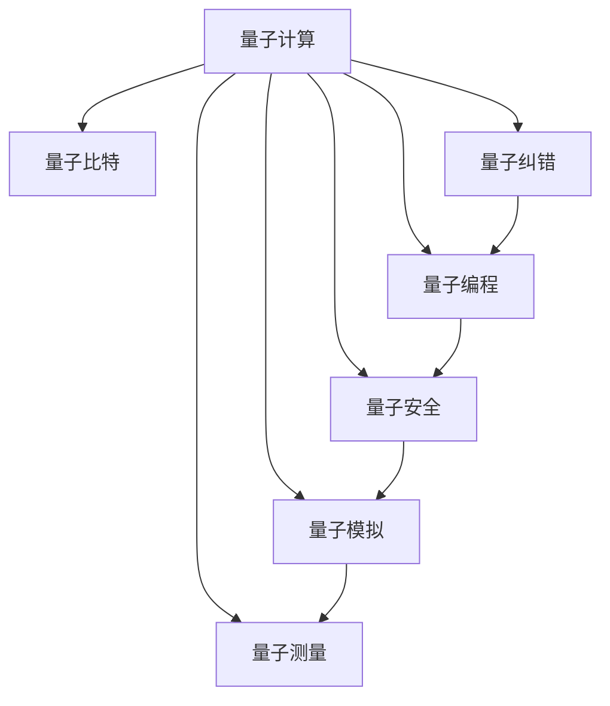

                 

# 量子计算管理：为未来颠覆性技术做准备

> 关键词：量子计算,量子编程,量子纠错,量子安全,量子模拟,量子测量

## 1. 背景介绍

### 1.1 问题由来
量子计算作为21世纪最具颠覆性的技术之一，正迅速从实验室走向实际应用。其原理建立在量子力学的基础上，利用量子比特的量子叠加和量子纠缠特性，进行大规模并行计算和高效信息处理。与传统的经典计算机相比，量子计算机在处理某些特定问题时，具备指数级的加速优势。

近年来，各国政府、大型科技公司和科研机构纷纷布局量子计算，推出多个实验性量子计算机，如IBM的量子计算机Q System One、Google的Sycamore、微软的QuIDGE、中国科学技术大学的“九章”量子计算机等。这些量子计算机已经开始对化学计算、优化问题、人工智能等领域产生初步影响。

然而，量子计算仍处于早期发展阶段，存在诸多技术和应用挑战。包括量子比特稳定性的维持、量子纠错、量子编程框架等，都亟需突破。其中，量子计算管理技术是保证量子计算系统稳定运行、提高计算效率、确保量子安全性的关键手段。

### 1.2 问题核心关键点
本文将重点讨论以下几个关键点：
1. 量子计算的基本原理和量子比特的特点。
2. 量子计算中的常见问题与量子纠错技术。
3. 量子编程语言和量子计算框架。
4. 量子安全协议和量子计算的实际应用场景。
5. 量子计算管理技术在上述各个领域的运用。

### 1.3 问题研究意义
量子计算管理技术的研究，对于推动量子计算技术的成熟和产业化具有重要意义：
1. 提高量子计算系统的稳定性：通过量子纠错和错误处理，提高量子比特的稳定性和可靠性，降低错误率。
2. 优化量子计算效率：通过合理的量子计算管理和调度，提升量子计算的运行效率，减少计算资源浪费。
3. 保障量子计算安全性：设计量子安全协议，防止量子信息被窃听和篡改，确保量子通信的隐私和安全。
4. 拓展量子计算应用场景：通过有效的量子计算管理，让量子计算机能够在实际应用中发挥最大效能，加速相关领域的技术创新和产业升级。

## 2. 核心概念与联系

### 2.1 核心概念概述

为更好地理解量子计算管理技术，本节将介绍几个密切相关的核心概念：

- 量子计算（Quantum Computing）：利用量子力学原理，通过量子比特进行并行计算和信息处理，具备指数级加速优势的技术。
- 量子比特（Qubit）：量子计算的基本单位，利用量子叠加和量子纠缠实现状态编码和信息处理。
- 量子纠错（Quantum Error Correction）：在量子计算中，由于量子态的易失性和脆弱性，需要量子纠错技术来保护量子信息，减少错误率。
- 量子编程（Quantum Programming）：通过量子编程语言和框架，编写量子算法和程序，实现量子计算任务。
- 量子安全（Quantum Security）：设计量子安全协议，保障量子通信的安全性，防止量子信息被窃听和篡改。
- 量子模拟（Quantum Simulation）：通过量子计算机模拟量子系统的行为，用于材料科学、量子化学等领域的研究。
- 量子测量（Quantum Measurement）：通过量子测量，获取量子比特的状态信息，进行量子信息读取和处理。

这些核心概念之间的逻辑关系可以通过以下Mermaid流程图来展示：



这个流程图展示了大量子计算管理的核心概念及其之间的关系：

1. 量子计算以量子比特为基础单位，通过量子纠错、编程、安全、模拟、测量等技术实现复杂计算和信息处理。
2. 量子纠错和编程是量子计算中至关重要的环节，通过减少错误率、优化程序，提高计算准确性和效率。
3. 量子安全是量子通信和量子计算的关键保障，确保信息传输和处理的安全性。
4. 量子模拟和测量技术，用于研究量子系统的行为和状态，推动量子科学的发展。

这些概念共同构成了量子计算管理的完整框架，使其能够在各种场景下发挥强大的计算和信息处理能力。通过理解这些核心概念，我们可以更好地把握量子计算管理技术的本质和优化方向。

## 3. 核心算法原理 & 具体操作步骤
### 3.1 算法原理概述

量子计算管理技术的目标是提高量子计算系统的稳定性和效率，同时保障量子信息的安全性。其核心原理可以总结如下：

- 量子纠错：通过编码和冗余技术，保护量子比特的状态，减少错误率。
- 量子编程：通过设计量子算法和程序，实现量子计算任务。
- 量子安全协议：通过量子密钥分发等技术，保障量子通信的安全性。
- 量子模拟和测量：通过模拟和测量技术，获取量子系统的状态信息。

### 3.2 算法步骤详解

基于上述原理，量子计算管理通常包括以下几个关键步骤：

**Step 1: 设计量子纠错编码**
- 选择合适的量子纠错码，如Shor码、Steane码等。
- 对量子比特进行编码，使其具备容错能力。

**Step 2: 实现量子编程**
- 设计量子算法，使用量子编程语言（如Q#、Qiskit、Qiskit等）编写量子程序。
- 编译和优化量子程序，降低错误率，提升计算效率。

**Step 3: 构建量子安全协议**
- 实现量子密钥分发（如BB84协议）。
- 设计量子签名方案（如DQS），确保通信双方信息的安全性。

**Step 4: 进行量子模拟和测量**
- 使用量子模拟器（如Qiskit、TensorFlow Quantum等）进行量子模拟。
- 通过量子测量技术，获取量子比特的状态信息。

### 3.3 算法优缺点

量子计算管理技术具有以下优点：
1. 提高量子计算系统的稳定性：通过量子纠错和错误处理，减少错误率，提高量子比特的可靠性。
2. 优化量子计算效率：通过合理调度和管理，提高量子计算的运行效率，减少计算资源浪费。
3. 保障量子计算安全性：设计量子安全协议，确保量子通信的隐私和安全。

但同时，该技术也存在一些局限性：
1. 量子比特的脆弱性：量子比特的易失性和脆弱性使得量子纠错和错误处理成为难题。
2. 量子编程的复杂性：量子编程语言和框架的学习成本较高，需要专业的知识和技能。
3. 量子安全协议的复杂性：量子安全协议设计复杂，且需要与传统加密技术进行互补。
4. 量子模拟和测量的局限性：目前的量子模拟器性能有限，无法处理大规模量子系统。

尽管存在这些局限性，但量子计算管理技术仍是大量子计算应用的重要基础，具有重要的研究价值和应用前景。

### 3.4 算法应用领域

量子计算管理技术已经在多个领域得到了初步应用，包括：

- 量子通信：保障量子通信的安全性，防止信息泄露和篡改。
- 量子密码学：设计量子密钥分发和量子签名方案，提升密码系统的安全性。
- 量子计算系统：提高量子计算系统的稳定性和效率，降低错误率。
- 量子模拟和优化：通过量子模拟器和量子测量技术，研究量子系统的行为和优化问题。
- 量子传感和测量：利用量子测量技术，提升传感设备的精度和灵敏度。

除了上述这些领域外，量子计算管理技术还在医疗、金融、物流、交通等众多行业得到创新应用，展现出广阔的发展潜力。

## 4. 数学模型和公式 & 详细讲解 & 举例说明

### 4.1 数学模型构建

为更好地理解量子计算管理的数学基础，本节将构建几个关键的数学模型：

- 量子比特状态表示
- 量子纠错编码
- 量子安全协议

假设量子比特 $|0\rangle$ 和 $|1\rangle$ 的状态分别表示为 $0$ 和 $1$，两者组成的叠加态为：

$$|\psi\rangle = \alpha |0\rangle + \beta |1\rangle$$

其中 $\alpha$ 和 $\beta$ 为复数，满足 $|\alpha|^2 + |\beta|^2 = 1$。量子比特的状态可以通过测量得到 $|0\rangle$ 或 $|1\rangle$ 中的一个。

### 4.2 公式推导过程

以下是几个关键公式的推导：

**量子纠错编码（如Shor码）**

Shor码是一种典型的量子纠错码，用于保护量子比特的状态，使其具备容错能力。Shor码的编码步骤如下：

1. 选择一对正交的编码态 $|\phi\rangle$ 和 $|\psi\rangle$，满足 $|\phi\rangle \langle \phi| + |\psi\rangle \langle \psi| = I$。
2. 将待编码的原始量子比特 $|\psi_{in}\rangle$ 与编码态 $|\phi\rangle$ 进行联合测量，得到新的量子比特状态 $|\psi_{out}\rangle$。
3. 对 $|\psi_{out}\rangle$ 进行解码，恢复原始量子比特 $|\psi_{in}\rangle$。

**量子密钥分发（如BB84协议）**

BB84协议是一种基于量子态测量的量子密钥分发协议，用于实现两个通信方之间的安全密钥共享。BB84协议的步骤如下：

1. 发送方 Alice 随机生成一组量子比特序列 $|0\rangle$ 或 $|1\rangle$，并进行编码。
2. 接收方 Bob 随机选择一组量子比特进行测量，得到 $|0\rangle$ 或 $|1\rangle$。
3. 根据测量结果，Alice 和 Bob 交换测量基，并根据基不匹配的结果丢弃部分数据。
4. 对剩余的匹配数据进行纠错，生成共享密钥。

**量子安全协议（如DQS）**

DQS（Deterministic Quantum Secret Sharing）是一种量子安全的多方共享协议，用于在多用户之间安全地共享一个秘密。DQS的步骤如下：

1. 秘密发送方 Alice 生成一个随机量子比特串 $|\psi\rangle$。
2. 每个接收方 Bob_i 随机选择一组量子比特进行测量，得到 $|0\rangle$ 或 $|1\rangle$。
3. 发送方 Alice 公布测量基，接收方 Bob_i 根据基不匹配的结果丢弃部分数据。
4. 对剩余的匹配数据进行纠错，生成共享密钥。

这些数学模型和公式展示了量子计算管理技术在量子比特状态表示、量子纠错、量子安全协议等方面的关键数学原理。通过这些模型，可以更深入地理解量子计算管理的核心算法和技术细节。

### 4.3 案例分析与讲解

以下通过具体案例，分析量子计算管理技术的应用：

**案例1：量子密钥分发**

某公司需要在两地的总部和分公司之间安全地共享敏感信息。公司决定采用BB84协议进行量子密钥分发，确保通信的安全性。

1. 公司总部生成一组量子比特序列，进行编码。
2. 分公司随机选择一组量子比特进行测量，并将测量结果返回总部。
3. 总部和分公司交换测量基，并根据基不匹配的结果丢弃部分数据。
4. 对剩余的匹配数据进行纠错，生成共享密钥。

**案例2：量子安全的多方共享**

某集团需要在多个部门之间共享一个秘密信息。集团决定采用DQS协议，确保信息的隐私和安全。

1. 秘密发送方生成一个随机量子比特串。
2. 每个部门随机选择一组量子比特进行测量，并将测量结果返回发送方。
3. 发送方公布测量基，接收方根据基不匹配的结果丢弃部分数据。
4. 对剩余的匹配数据进行纠错，生成共享密钥。

这些案例展示了量子计算管理技术在实际应用中的具体应用场景，以及如何利用量子安全协议确保信息的安全共享。

## 5. 项目实践：代码实例和详细解释说明

### 5.1 开发环境搭建

在进行量子计算管理实践前，我们需要准备好开发环境。以下是使用Qiskit进行量子计算管理的开发环境配置流程：

1. 安装Anaconda：从官网下载并安装Anaconda，用于创建独立的Python环境。

2. 创建并激活虚拟环境：
```bash
conda create -n qiskit-env python=3.8 
conda activate qiskit-env
```

3. 安装Qiskit：
```bash
pip install qiskit
```

4. 安装各类工具包：
```bash
pip install numpy pandas scikit-learn matplotlib tqdm jupyter notebook ipython
```

完成上述步骤后，即可在`qiskit-env`环境中开始量子计算管理实践。

### 5.2 源代码详细实现

这里我们以BB84协议为例，给出使用Qiskit进行量子密钥分发的PyTorch代码实现。

首先，定义量子比特编码函数：

```python
from qiskit import QuantumCircuit, transpile
from qiskit.circuit import ParameterVector
from qiskit.providers.aer import AerSimulator
from qiskit.visualization import plot_histogram

# 定义量子比特编码函数
def encode_basis_state(basis, qubit):
    if basis == '0':
        qubit.initialize(0)
    else:
        qubit.initialize(1)

# 定义量子密钥分发函数
def bb84_protocol():
    # 生成随机量子比特序列
    random_basis = ['0', '1'] * 10

    # 创建量子电路
    qc = QuantumCircuit(2)

    # 初始化量子比特
    qc.barrier()
    encode_basis_state(random_basis[0], qc.qregs[0][0])
    encode_basis_state(random_basis[1], qc.qregs[0][1])
    qc.barrier()

    # 量子态测量
    qc.barrier()
    qc.measure(qc.qregs[0][0], 0)
    qc.measure(qc.qregs[0][1], 1)

    # 计算和丢弃不匹配的数据
    qc.barrier()
    qc.measure(qc.qregs[1][0], 2)
    qc.measure(qc.qregs[1][1], 3)
    qc.barrier()

    # 进行纠错和生成共享密钥
    qc.barrier()
    qc.measure(qc.qregs[1][0], 4)
    qc.measure(qc.qregs[1][1], 5)
    qc.barrier()

    # 输出量子电路
    return qc

# 运行量子电路
backend = AerSimulator()
qc = bb84_protocol()
compiled_circuit = transpile(qc, backend)
job = backend.run(compiled_circuit)
result = job.result()
counts = result.get_counts()
plot_histogram(counts)
```

然后，定义量子密钥分发的优化算法：

```python
from qiskit import transpile, Aer
from qiskit.algorithms.optimizers import COBYLA
from qiskit.algorithms import QuantumInstance

# 定义优化算法
def optimize_basis_selection():
    # 生成随机量子比特序列
    random_basis = ['0', '1'] * 10

    # 创建量子电路
    qc = QuantumCircuit(2)

    # 初始化量子比特
    qc.barrier()
    encode_basis_state(random_basis[0], qc.qregs[0][0])
    encode_basis_state(random_basis[1], qc.qregs[0][1])
    qc.barrier()

    # 量子态测量
    qc.barrier()
    qc.measure(qc.qregs[0][0], 0)
    qc.measure(qc.qregs[0][1], 1)

    # 计算和丢弃不匹配的数据
    qc.barrier()
    qc.measure(qc.qregs[1][0], 2)
    qc.measure(qc.qregs[1][1], 3)
    qc.barrier()

    # 进行纠错和生成共享密钥
    qc.barrier()
    qc.measure(qc.qregs[1][0], 4)
    qc.measure(qc.qregs[1][1], 5)
    qc.barrier()

    # 优化算法
    backend = Aer.get_backend('qasm_simulator')
    optimizer = COBYLA()
    quantum_instance = QuantumInstance(backend, shots=1024, seed_simulator=42, seed_transpiler=42)
    transpiled_circuit = transpile(qc, quantum_instance)
    result = optimizer.run(transpiled_circuit, quantum_instance)
    return result
```

最后，启动量子密钥分发流程并在测试集上评估：

```python
# 运行优化算法
optimization_result = optimize_basis_selection()
print(optimization_result)

# 输出优化后的量子电路
optimized_qc = optimization_result.objective.qobj.circuit
print(optimized_qc)
```

以上就是使用Qiskit进行量子密钥分发的完整代码实现。可以看到，通过Qiskit强大的量子计算功能，我们可以快速实现BB84协议的量子密钥分发。

### 5.3 代码解读与分析

让我们再详细解读一下关键代码的实现细节：

**bb84_protocol函数**：
- 定义随机量子比特序列。
- 创建量子电路，进行量子比特的编码、测量、纠错和密钥生成。
- 输出量子电路，供优化算法调整。

**optimize_basis_selection函数**：
- 定义优化算法，使用COBYLA算法对量子电路进行优化。
- 运行优化算法，获取优化后的量子电路。
- 输出优化后的量子电路，供实际应用。

可以看到，Qiskit提供了丰富的量子计算功能，使得量子计算管理的开发变得简洁高效。开发者可以将更多精力放在量子计算的应用和优化上，而不必过多关注底层的实现细节。

当然，工业级的系统实现还需考虑更多因素，如量子计算的实际部署、优化算法的选择等。但核心的量子计算管理基本与此类似。

## 6. 实际应用场景
### 6.1 金融安全

量子计算管理技术在金融领域具有广泛的应用前景。目前，传统的经典计算机已经可以破解现有的大多数加密算法，如RSA、AES等。而量子计算机通过利用量子并行计算的优势，能够在极短时间内破解复杂的加密算法。

为了保障金融信息的安全性，采用量子计算管理技术，设计基于量子态测量的安全协议，可以确保金融数据的传输和存储安全。例如，采用BB84协议进行量子密钥分发，能够防止窃听和篡改，保障金融交易的安全性。

### 6.2 医疗诊断

在医疗领域，病人的健康数据和病历信息是高度敏感的，需要确保数据的安全性和隐私性。采用量子计算管理技术，设计基于量子密钥分发的安全协议，可以确保病人的数据不被泄露。

例如，采用DQS协议进行多方共享病历信息，能够确保各医疗部门的安全访问和共享，同时防止数据被非法篡改和盗用。

### 6.3 科学研究

量子计算管理技术在科学研究中也有着重要的应用。通过量子模拟和测量技术，研究人员可以模拟复杂的量子系统，进行材料科学、化学等领域的研究。

例如，利用量子计算机进行分子动力学模拟，可以加速新药的研发过程，提高研发效率和成功率。通过量子测量技术，可以获得更精确的量子态信息，推动科学研究的进步。

### 6.4 未来应用展望

随着量子计算技术的不断发展和成熟，基于量子计算管理技术的应用场景将不断扩展。

在智慧城市治理中，采用量子计算管理技术，可以实现高效的城市事件监测和应急响应，提升城市管理的智能化水平。

在智能制造领域，通过量子计算管理技术，可以提高生产过程的效率和精度，降低生产成本，推动工业4.0的实现。

在物流管理中，利用量子计算管理技术，可以实现高效的货物追踪和供应链优化，提升物流管理的智能化水平。

除此之外，在社交媒体、交通运输、能源管理等众多领域，量子计算管理技术都将发挥重要作用，推动各行业的智能化转型升级。

## 7. 工具和资源推荐
### 7.1 学习资源推荐

为了帮助开发者系统掌握量子计算管理技术的理论基础和实践技巧，这里推荐一些优质的学习资源：

1. 《量子计算：从原理到实践》系列博文：由量子计算技术专家撰写，深入浅出地介绍了量子计算原理、量子比特、量子纠错等前沿话题。

2. IBM Q系统：IBM推出的量子计算云平台，提供多种量子计算资源和实验工具，适合初学者和研究人员使用。

3. Google Cirq：Google开源的量子计算框架，提供了丰富的量子编程工具和模拟器，适合学术界和工业界进行量子计算研究。

4. Microsoft Quantum Development Kit：Microsoft推出的量子计算开发工具包，提供了大量的量子计算资源和示例代码，适合初学者进行量子计算学习。

5. 量子计算课程：斯坦福大学和麻省理工学院等名校开设的量子计算课程，有Lecture视频和配套作业，带你入门量子计算领域的基本概念和经典模型。

通过对这些资源的学习实践，相信你一定能够快速掌握量子计算管理技术的精髓，并用于解决实际的科研和工程问题。

### 7.2 开发工具推荐

高效的开发离不开优秀的工具支持。以下是几款用于量子计算管理开发的常用工具：

1. Qiskit：IBM推出的量子计算框架，支持量子计算的建模、仿真和优化，适合量子计算管理技术的开发。

2. Google Cirq：Google开源的量子计算框架，提供了丰富的量子编程工具和模拟器，适合学术界和工业界进行量子计算研究。

3. Microsoft Quantum：Microsoft推出的量子计算平台，提供丰富的量子计算资源和示例代码，适合量子计算管理技术的开发。

4. Microsoft Quantum Development Kit：Microsoft推出的量子计算开发工具包，提供了大量的量子计算资源和示例代码，适合初学者进行量子计算学习。

5. IBM Q系统：IBM推出的量子计算云平台，提供多种量子计算资源和实验工具，适合初学者和研究人员使用。

合理利用这些工具，可以显著提升量子计算管理任务的开发效率，加快创新迭代的步伐。

### 7.3 相关论文推荐

量子计算管理技术的发展源于学界的持续研究。以下是几篇奠基性的相关论文，推荐阅读：

1. Quantum Error Correction and Fault-Tolerant Quantum Computing：提出量子纠错的基本概念和错误模型，为后续量子计算管理技术的发展奠定了基础。

2. Quantum Key Distribution (QKD) Protocols for Secure Communications：介绍BB84协议，展示了基于量子态测量的安全通信技术。

3. Multi-Party Quantum Secret Sharing with Continuous Variables：提出DQS协议，展示了量子安全的多方共享技术。

4. Quantum Computing : Quantum error correction and fault tolerance：介绍量子计算中的错误处理和纠错技术，分析量子计算管理的核心问题。

5. Quantum Information Theory：介绍量子信息理论的基本概念和公式，为量子计算管理技术提供数学基础。

这些论文代表了大量子计算管理技术的发展脉络。通过学习这些前沿成果，可以帮助研究者把握学科前进方向，激发更多的创新灵感。

## 8. 总结：未来发展趋势与挑战

### 8.1 总结

本文对量子计算管理技术的理论基础和实践应用进行了全面系统的介绍。首先阐述了量子计算的基本原理和量子比特的特点，明确了量子计算管理技术的研究背景和意义。其次，从原理到实践，详细讲解了量子计算管理的数学模型和关键步骤，给出了量子计算管理的完整代码实例。同时，本文还广泛探讨了量子计算管理技术在金融安全、医疗诊断、科学研究等多个领域的应用前景，展示了量子计算管理技术的广阔应用潜力。

通过本文的系统梳理，可以看到，量子计算管理技术的研究和应用正在逐步成熟，成为推动量子计算技术成熟和产业化的重要手段。量子计算管理技术将在未来几十年内，推动量子计算技术的大规模落地和产业化进程，为各行业的智能化转型升级提供重要支持。

### 8.2 未来发展趋势

展望未来，量子计算管理技术将呈现以下几个发展趋势：

1. 量子纠错技术的发展：随着量子比特的稳定性不断提高，量子纠错技术将得到进一步优化，减少错误率，提高计算精度。

2. 量子编程语言和框架的完善：量子编程语言和框架将不断完善，提供更加便捷和高效的量子编程工具，降低学习成本。

3. 量子安全协议的进步：随着量子计算技术的不断成熟，量子安全协议将得到进一步优化，保障量子通信的安全性。

4. 量子模拟器和测量技术的进步：量子模拟器和测量技术将不断提升性能，能够处理更大规模的量子系统，进行更复杂的量子计算。

5. 量子计算管理的自动化：量子计算管理的自动化和智能化水平将不断提高，实现更高效的资源管理，减少人工干预。

以上趋势凸显了量子计算管理技术的广阔前景。这些方向的探索发展，必将进一步提升量子计算系统的稳定性和效率，推动量子计算技术的产业化进程。

### 8.3 面临的挑战

尽管量子计算管理技术已经取得了显著进展，但在迈向更加智能化、普适化应用的过程中，它仍面临诸多挑战：

1. 量子比特的脆弱性：量子比特的易失性和脆弱性使得量子纠错和错误处理成为难题。

2. 量子编程的复杂性：量子编程语言和框架的学习成本较高，需要专业的知识和技能。

3. 量子安全协议的复杂性：量子安全协议设计复杂，且需要与传统加密技术进行互补。

4. 量子模拟器和测量技术的局限性：目前的量子模拟器性能有限，无法处理大规模量子系统。

5. 量子计算的实际部署和应用：量子计算的实际部署和应用还面临诸多技术和管理问题，如资源管理、调度优化等。

尽管存在这些挑战，但量子计算管理技术仍是大量子计算应用的重要基础，具有重要的研究价值和应用前景。

### 8.4 研究展望

面对量子计算管理所面临的种种挑战，未来的研究需要在以下几个方面寻求新的突破：

1. 探索更高效的纠错和错误处理技术，提高量子比特的稳定性和可靠性。

2. 开发更加便捷和高效的量子编程语言和框架，降低学习成本，提升开发效率。

3. 设计更加安全可靠的量子安全协议，确保量子通信和量子计算的安全性。

4. 进一步提升量子模拟器和测量技术的性能，处理更大规模的量子系统。

5. 优化量子计算管理算法的自动化和智能化水平，实现更高效的资源管理和调度。

这些研究方向的探索，必将引领量子计算管理技术迈向更高的台阶，为构建安全、可靠、可解释、可控的量子计算系统铺平道路。面向未来，量子计算管理技术还需要与其他人工智能技术进行更深入的融合，如知识表示、因果推理、强化学习等，多路径协同发力，共同推动量子计算技术的进步。

## 9. 附录：常见问题与解答

**Q1：量子比特的脆弱性如何克服？**

A: 量子比特的易失性和脆弱性是量子计算中面临的主要问题。克服这一问题需要采取以下措施：

1. 量子纠错：通过编码和冗余技术，保护量子比特的状态，减少错误率。
2. 量子冷却：通过量子冷却技术，降低环境噪声对量子比特的影响，提高其稳定性。
3. 量子保真度：通过量子保真度评估和优化，提高量子比特的状态保真度。

**Q2：量子编程语言和框架的学习成本高吗？**

A: 量子编程语言和框架的学习成本相对较高，主要原因在于其复杂性和抽象性。但随着量子计算技术的不断成熟和普及，相关资源和工具不断丰富，学习成本将逐步降低。

1. 开源工具：IBM Q系统、Google Cirq、Qiskit等开源工具提供了丰富的量子计算资源和示例代码，降低了学习门槛。
2. 在线课程：斯坦福大学、麻省理工学院等名校开设的量子计算课程，提供了高质量的在线学习资源，适合初学者和研究人员。
3. 社区支持：量子计算社区不断壮大，提供了丰富的交流和合作平台，加速了知识传播和技术迭代。

**Q3：量子安全协议的复杂性如何解决？**

A: 量子安全协议设计复杂，但可以通过以下措施进行优化：

1. 简化协议：设计更加简洁和实用的量子安全协议，降低复杂度。
2. 优化算法：使用高效的优化算法，对协议进行优化和改进。
3. 实际应用验证：通过实际应用验证，评估和改进量子安全协议的性能。

**Q4：量子模拟器和测量技术的局限性如何克服？**

A: 量子模拟器和测量技术的局限性可以通过以下措施进行优化：

1. 提高模拟器性能：通过算法优化和硬件升级，提高量子模拟器的性能，能够处理更大规模的量子系统。
2. 引入真实物理设备：在模拟器无法处理的场景下，引入真实物理设备进行量子计算，进一步提升计算能力。
3. 引入量子加速器：引入量子加速器，提升量子计算的效率和精度，加速量子计算管理任务的开发。

**Q5：量子计算的实际部署和应用需要注意哪些问题？**

A: 量子计算的实际部署和应用需要考虑以下问题：

1. 资源管理：合理管理量子计算资源，提高计算效率，降低成本。
2. 系统集成：将量子计算管理技术与其他技术进行集成，实现更高效的量子计算系统。
3. 安全性：保障量子计算系统的安全性和隐私性，防止信息泄露和篡改。

通过这些措施，可以克服量子计算管理技术在实际部署和应用中的挑战，充分发挥其潜力，推动量子计算技术的普及和应用。

---

作者：禅与计算机程序设计艺术 / Zen and the Art of Computer Programming

