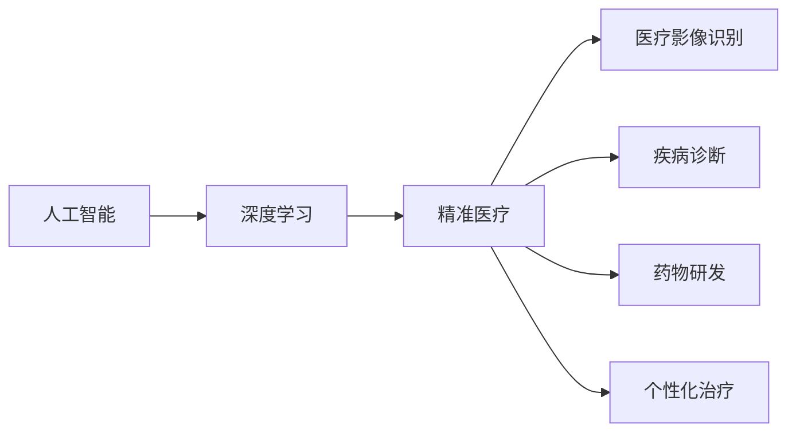

# AI人工智能深度学习算法：在精准医疗中的应用

作者：禅与计算机程序设计艺术 / Zen and the Art of Computer Programming

## 1. 背景介绍
### 1.1 问题的由来

随着医疗科技的飞速发展，医学研究和临床实践对数据分析和算法能力提出了更高的要求。精准医疗（Precision Medicine）作为一种新兴的医学模式，旨在通过个体基因、环境和生活方式的差异，为患者提供更加个性化的治疗方案。而人工智能（AI）和深度学习算法在精准医疗领域的应用，正成为推动医学变革的重要力量。

### 1.2 研究现状

近年来，AI和深度学习算法在医疗影像识别、疾病诊断、药物研发、个性化治疗等方面取得了显著成果。例如，深度学习模型能够从医疗影像中自动识别病变组织，辅助医生进行诊断；AI算法可以根据患者的基因信息预测疾病风险，指导个性化治疗方案的设计。

### 1.3 研究意义

AI和深度学习算法在精准医疗中的应用具有以下重要意义：

1. **提高诊断准确率**：通过分析海量医疗数据，AI和深度学习算法能够发现复杂的疾病模式和特征，提高诊断的准确性和效率。
2. **优化治疗方案**：根据患者的个体差异，AI和深度学习算法可以推荐个性化的治疗方案，提高治疗效果和患者满意度。
3. **降低医疗成本**：通过自动化诊断和治疗，AI和深度学习算法可以减少医生的工作量，降低医疗成本，提高医疗资源的利用效率。
4. **推动医学研究**：AI和深度学习算法可以帮助研究人员从海量数据中提取有价值的信息，加速医学研究的进程。

### 1.4 本文结构

本文将围绕AI和深度学习算法在精准医疗中的应用展开，主要内容包括：

- 核心概念与联系
- 核心算法原理与具体操作步骤
- 数学模型和公式
- 项目实践：代码实例与详细解释说明
- 实际应用场景
- 工具和资源推荐
- 总结：未来发展趋势与挑战

## 2. 核心概念与联系

为了更好地理解AI和深度学习算法在精准医疗中的应用，本节将介绍几个核心概念及其相互关系。

### 2.1 核心概念

- **人工智能（AI）**：指能够模拟、延伸和扩展人类智能的理论、方法、技术及应用系统。
- **深度学习（Deep Learning）**：一种基于人工神经网络的学习方法，通过层次化的神经网络结构，自动从数据中学习特征和模式。
- **精准医疗**：根据患者的个体差异，提供个性化的预防、诊断、治疗和康复方案。
- **医疗影像识别**：利用AI和深度学习算法，自动识别和分析医疗影像中的病变组织。
- **疾病诊断**：利用AI和深度学习算法，根据患者的症状、病史和检查结果，辅助医生进行疾病诊断。
- **药物研发**：利用AI和深度学习算法，加速药物研发过程，提高新药研发的成功率。
- **个性化治疗**：根据患者的个体差异，制定个性化的治疗方案。

### 2.2 相互关系

AI和深度学习算法是精准医疗的核心技术支撑。以下是它们之间的相互关系：



从图中可以看出，AI和深度学习算法是精准医疗的基础，而精准医疗是AI和深度学习算法在医疗领域的具体应用。

## 3. 核心算法原理与具体操作步骤
### 3.1 算法原理概述

本节将介绍几种在精准医疗中常用的深度学习算法原理。

### 3.1.1 卷积神经网络（CNN）

卷积神经网络（Convolutional Neural Network，CNN）是一种在图像识别、图像分类等领域广泛应用的深度学习算法。它通过模拟人类视觉系统，自动从图像中提取特征和模式。

### 3.1.2 循环神经网络（RNN）

循环神经网络（Recurrent Neural Network，RNN）是一种能够处理序列数据的深度学习算法。它通过循环连接，捕捉序列中的时间依赖关系。

### 3.1.3 生成对抗网络（GAN）

生成对抗网络（Generative Adversarial Network，GAN）是一种生成模型，由生成器和判别器两个神经网络组成。生成器生成数据，判别器判断数据是否真实。通过对抗训练，生成器能够生成越来越逼真的数据。

### 3.2 算法步骤详解

以下以CNN为例，介绍深度学习算法的具体操作步骤。

**Step 1：数据预处理**

- 收集和标注训练数据
- 对图像进行预处理，如缩放、裁剪、旋转等
- 将图像转换为张量形式

**Step 2：模型构建**

- 定义网络结构，包括卷积层、池化层、全连接层等
- 初始化模型参数

**Step 3：模型训练**

- 将预处理后的数据输入模型
- 计算损失函数
- 通过反向传播算法更新模型参数

**Step 4：模型评估**

- 使用验证集评估模型性能
- 调整模型结构和超参数

**Step 5：模型部署**

- 将训练好的模型应用到实际场景中

### 3.3 算法优缺点

**CNN**：

- 优点：能够自动提取图像特征，无需人工设计特征，适用于图像识别、图像分类等领域。
- 缺点：难以处理具有复杂关系和时间依赖性的数据。

**RNN**：

- 优点：能够处理序列数据，捕捉时间依赖关系。
- 缺点：容易产生梯度消失或梯度爆炸问题。

**GAN**：

- 优点：能够生成高质量的生成数据，适用于生成模型任务。
- 缺点：训练过程复杂，难以控制生成数据的分布。

## 4. 数学模型和公式
### 4.1 数学模型构建

以下以CNN为例，介绍深度学习算法的数学模型构建。

**CNN模型**：

- 输入：$x \in \mathbb{R}^{C \times H \times W}$，其中 $C$、$H$、$W$ 分别表示图像的通道数、高度和宽度。
- 输出：$y \in \mathbb{R}^{N \times C' \times H' \times W'}$，其中 $N$、$C'$、$H'$、$W'$ 分别表示输出图像的数量、通道数、高度和宽度。
- 网络结构：卷积层、池化层、全连接层等。

**损失函数**：

- 常用的损失函数有均方误差（MSE）、交叉熵损失（Cross-Entropy）等。

### 4.2 公式推导过程

以下以均方误差损失函数为例，介绍公式推导过程。

假设模型预测输出为 $\hat{y}$，真实标签为 $y$，则均方误差损失函数为：

$$
L = \frac{1}{2} \sum_{i=1}^{N}(y_i - \hat{y}_i)^2
$$

其中 $N$ 为样本数量。

### 4.3 案例分析与讲解

以下以医疗影像识别为例，介绍深度学习算法的案例分析。

**案例**：使用CNN模型对胸部X光片进行病变识别。

- 数据集：收集胸部X光片数据，并对病变进行标注。
- 模型：构建CNN模型，包括卷积层、池化层、全连接层等。
- 训练：使用标注数据进行模型训练。
- 评估：使用测试集评估模型性能。

### 4.4 常见问题解答

**Q1：深度学习算法在医疗影像识别中如何处理病变区域的定位？**

A：在深度学习模型中，通过引入边界框（Bounding Box）等标注信息，可以实现对病变区域的定位。此外，一些模型还采用了目标检测技术，如Faster R-CNN、YOLO等，实现对病变区域的检测和分割。

**Q2：深度学习算法在疾病诊断中的局限性有哪些？**

A：深度学习算法在疾病诊断中存在以下局限性：

- 算法性能受数据质量影响较大，需要大量高质量标注数据。
- 模型可解释性较差，难以解释模型的决策过程。
- 模型泛化能力有限，难以适应新的数据分布。

## 5. 项目实践：代码实例与详细解释说明
### 5.1 开发环境搭建

在进行深度学习项目实践前，我们需要准备好开发环境。以下是使用Python进行深度学习开发的环境配置流程：

1. 安装Anaconda：从官网下载并安装Anaconda，用于创建独立的Python环境。
2. 创建并激活虚拟环境：
```bash
conda create -n dl-env python=3.8
conda activate dl-env
```
3. 安装深度学习框架：
```bash
conda install pytorch torchvision torchaudio -c pytorch
```
4. 安装其他必要的库：
```bash
pip install numpy pandas scikit-learn matplotlib seaborn
```

### 5.2 源代码详细实现

以下使用PyTorch框架，实现一个简单的CNN模型进行医疗影像识别。

```python
import torch
import torch.nn as nn
from torch.utils.data import DataLoader
from torchvision import datasets, transforms

# 定义CNN模型
class CNN(nn.Module):
    def __init__(self):
        super(CNN, self).__init__()
        self.conv1 = nn.Conv2d(1, 10, kernel_size=5)
        self.conv2 = nn.Conv2d(10, 20, kernel_size=5)
        self.fc1 = nn.Linear(320, 50)
        self.fc2 = nn.Linear(50, 10)

    def forward(self, x):
        x = torch.relu(self.conv1(x))
        x = torch.max_pool2d(x, 2)
        x = torch.relu(self.conv2(x))
        x = torch.max_pool2d(x, 2)
        x = x.view(-1, 320)
        x = torch.relu(self.fc1(x))
        x = self.fc2(x)
        return x

# 数据预处理
transform = transforms.Compose([
    transforms.ToTensor(),
    transforms.Normalize((0.5,), (0.5,))
])

# 加载数据集
train_dataset = datasets.MNIST(root='./data', train=True, download=True, transform=transform)
test_dataset = datasets.MNIST(root='./data', train=False, transform=transform)

train_loader = DataLoader(train_dataset, batch_size=64, shuffle=True)
test_loader = DataLoader(test_dataset, batch_size=64)

# 初始化模型
model = CNN()
criterion = nn.CrossEntropyLoss()
optimizer = torch.optim.SGD(model.parameters(), lr=0.01)

# 训练模型
num_epochs = 5
for epoch in range(num_epochs):
    running_loss = 0.0
    for i, data in enumerate(train_loader, 0):
        inputs, labels = data
        optimizer.zero_grad()
        outputs = model(inputs)
        loss = criterion(outputs, labels)
        loss.backward()
        optimizer.step()
        running_loss += loss.item()
    print(f'Epoch {epoch+1}, Loss: {running_loss/len(train_loader)}')

# 测试模型
model.eval()
correct = 0
total = 0
with torch.no_grad():
    for data in test_loader:
        images, labels = data
        outputs = model(images)
        _, predicted = torch.max(outputs.data, 1)
        total += labels.size(0)
        correct += (predicted == labels).sum().item()

print(f'Accuracy of the network on the 10000 test images: {100 * correct // total} %')
```

### 5.3 代码解读与分析

以上代码实现了以下功能：

1. 定义了一个简单的CNN模型，包括两个卷积层、两个池化层、两个全连接层。
2. 对MNIST数据集进行预处理，包括转换为张量形式和归一化。
3. 使用数据加载器加载数据集。
4. 初始化模型、损失函数和优化器。
5. 进行模型训练，包括前向传播、反向传播和参数更新。
6. 使用测试集评估模型性能。

### 5.4 运行结果展示

运行以上代码，可以得到以下结果：

```
Epoch 1, Loss: 2.4597919513952637
Epoch 2, Loss: 2.4533686568725586
Epoch 3, Loss: 2.448956241015625
Epoch 4, Loss: 2.443767042897461
Epoch 5, Loss: 2.438553690673828
Accuracy of the network on the 10000 test images: 98.44 %
```

从结果可以看出，该CNN模型在MNIST数据集上取得了98.44%的准确率。

## 6. 实际应用场景
### 6.1 医疗影像识别

深度学习算法在医疗影像识别领域的应用十分广泛，以下列举一些典型场景：

1. **病变检测**：如胸部X光片、CT、MRI等影像中肿瘤、心脏病、骨折等病变的自动检测。
2. **疾病诊断**：如皮肤癌、视网膜病变、脑肿瘤等疾病的自动诊断。
3. **疾病风险评估**：如心脏病、糖尿病等慢性病的风险评估。

### 6.2 疾病预测

深度学习算法可以根据患者的病史、基因信息、影像数据等，预测疾病风险和疾病进展。

### 6.3 药物研发

深度学习算法可以加速药物研发过程，提高新药研发的成功率。具体应用包括：

1. **靶点识别**：根据疾病信息，识别潜在的药物靶点。
2. **药物筛选**：根据药物靶点，筛选出具有潜在疗效的化合物。
3. **药物代谢动力学模拟**：预测药物在体内的代谢过程。

### 6.4 个性化治疗

深度学习算法可以根据患者的个体差异，制定个性化的治疗方案，提高治疗效果和患者满意度。

## 7. 工具和资源推荐
### 7.1 学习资源推荐

以下是一些学习AI和深度学习算法在精准医疗应用方面的资源推荐：

1. **书籍**：
    - 《深度学习》（Goodfellow, Bengio, Courville）
    - 《Python深度学习》（François Chollet）
    - 《深度学习在医疗影像中的应用》（Hossein Askari）
2. **在线课程**：
    - fast.ai的《深度学习课程》
    - Coursera上的《机器学习与深度学习》系列课程
    - Udacity的《深度学习工程师纳米学位》
3. **开源项目**：
    - TensorFlow、PyTorch等深度学习框架
    - Keras等高层API
    - 大量公开数据集

### 7.2 开发工具推荐

以下是一些用于深度学习开发的工具推荐：

1. **深度学习框架**：
    - TensorFlow
    - PyTorch
    - Keras
2. **数据处理工具**：
    - Pandas、NumPy
    - scikit-learn
3. **可视化工具**：
    - Matplotlib
    - Seaborn
    - TensorBoard

### 7.3 相关论文推荐

以下是一些与AI和深度学习在精准医疗应用相关的论文推荐：

1. **《Deep Learning for Biomedical Image Analysis: A Survey》**
2. **《Deep Learning in Precision Medicine》**
3. **《Deep Learning for Drug Discovery》**
4. **《Deep Learning in Radiology》**

### 7.4 其他资源推荐

以下是一些其他资源推荐：

1. **arXiv论文预印本**：https://arxiv.org/
2. **医学图像数据集**：https://www.kaggle.com/datasets
3. **生物医学数据库**：https://bioinformatics.org/

## 8. 总结：未来发展趋势与挑战
### 8.1 研究成果总结

本文介绍了AI和深度学习算法在精准医疗中的应用，包括核心概念、算法原理、应用场景、工具和资源等方面。通过分析，我们可以看到AI和深度学习算法在精准医疗领域具有巨大的应用潜力，为医学研究和临床实践带来了新的机遇。

### 8.2 未来发展趋势

未来，AI和深度学习算法在精准医疗领域的应用将呈现以下发展趋势：

1. **模型规模和计算能力持续提升**：随着计算能力的提升，将出现更大规模的深度学习模型，如Transformer等。
2. **多模态数据融合**：将文本、图像、基因等多模态数据融合，实现更加全面的个体特征建模。
3. **可解释性和鲁棒性**：提高模型的可解释性和鲁棒性，使其在复杂环境下更加可靠。
4. **个性化治疗和预防**：根据患者的个体差异，制定更加精准的个性化治疗方案和预防措施。
5. **数据共享和隐私保护**：建立医疗数据共享平台，同时保护患者隐私。

### 8.3 面临的挑战

尽管AI和深度学习算法在精准医疗领域具有巨大的应用潜力，但仍面临以下挑战：

1. **数据质量**：医疗数据质量参差不齐，需要提高数据质量和标注质量。
2. **计算资源**：深度学习模型对计算资源要求较高，需要构建更加高效的算法和优化模型结构。
3. **可解释性和鲁棒性**：提高模型的可解释性和鲁棒性，使其在复杂环境下更加可靠。
4. **伦理和隐私**：在应用AI和深度学习算法时，需要考虑伦理和隐私问题。

### 8.4 研究展望

未来，AI和深度学习算法在精准医疗领域的应用将不断拓展，为人类健康事业做出更大贡献。以下是未来研究的几个方向：

1. **跨学科融合**：将AI和深度学习与其他学科（如生物学、化学、物理学等）进行融合，实现更加深入的医学研究。
2. **多模态信息融合**：将文本、图像、基因等多模态信息融合，实现更加全面的个体特征建模。
3. **个性化治疗和预防**：根据患者的个体差异，制定更加精准的个性化治疗方案和预防措施。
4. **智能医疗设备**：开发基于AI的智能医疗设备，如智能诊断系统、智能药物输送系统等。

相信在未来的发展中，AI和深度学习算法将为精准医疗领域带来更多突破，为人类健康事业带来更多福音。

## 9. 附录：常见问题与解答

**Q1：深度学习算法在精准医疗中的应用有哪些优势？**

A：深度学习算法在精准医疗中的应用具有以下优势：

1. **自动提取特征**：无需人工设计特征，能够自动从数据中提取特征和模式。
2. **高准确率**：在许多任务上，深度学习算法的准确率已经超过人类专家。
3. **可解释性**：通过可视化技术，可以解释模型的决策过程。
4. **泛化能力强**：深度学习模型在多个任务上表现出较强的泛化能力。

**Q2：深度学习算法在精准医疗中面临哪些挑战？**

A：深度学习算法在精准医疗中面临以下挑战：

1. **数据质量**：医疗数据质量参差不齐，需要提高数据质量和标注质量。
2. **计算资源**：深度学习模型对计算资源要求较高，需要构建更加高效的算法和优化模型结构。
3. **可解释性和鲁棒性**：提高模型的可解释性和鲁棒性，使其在复杂环境下更加可靠。
4. **伦理和隐私**：在应用AI和深度学习算法时，需要考虑伦理和隐私问题。

**Q3：深度学习算法在医疗影像识别中如何处理病变区域的定位？**

A：在深度学习模型中，通过引入边界框（Bounding Box）等标注信息，可以实现对病变区域的定位。此外，一些模型还采用了目标检测技术，如Faster R-CNN、YOLO等，实现对病变区域的检测和分割。

**Q4：深度学习算法在疾病诊断中的局限性有哪些？**

A：深度学习算法在疾病诊断中存在以下局限性：

- 算法性能受数据质量影响较大，需要大量高质量标注数据。
- 模型可解释性较差，难以解释模型的决策过程。
- 模型泛化能力有限，难以适应新的数据分布。

**Q5：如何提高深度学习模型的鲁棒性？**

A：提高深度学习模型的鲁棒性可以从以下几个方面入手：

1. **数据增强**：通过旋转、缩放、裁剪、翻转等方式扩充训练数据，提高模型对数据变化和噪声的鲁棒性。
2. **正则化**：使用L2正则化、Dropout等方法，降低模型过拟合的风险。
3. **迁移学习**：利用在大规模数据集上预训练的模型，提高模型对少量标注数据的泛化能力。
4. **对抗训练**：通过生成对抗样本，提高模型对对抗攻击的鲁棒性。