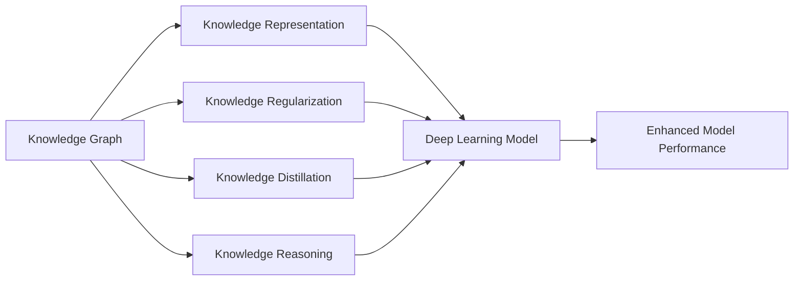

# AI人工智能深度学习算法：智能深度学习代理的知识图谱运用

关键词：人工智能、深度学习、知识图谱、智能代理、算法

## 1. 背景介绍
### 1.1 问题的由来
人工智能(Artificial Intelligence, AI)作为计算机科学领域最前沿、最具挑战性的研究方向之一,其终极目标是实现具有智能的机器。而深度学习(Deep Learning, DL)作为AI的一个重要分支,近年来取得了突破性进展,在计算机视觉、自然语言处理、语音识别等领域不断刷新性能记录。

然而,现有的深度学习算法大多是基于数据驱动的端到端学习范式,缺乏对知识的显式建模和利用。知识图谱(Knowledge Graph, KG)作为结构化知识表示的重要手段,可以为深度学习提供丰富的先验知识和语义信息。如何将知识图谱与深度学习相结合,构建知识驱动的智能深度学习代理,是一个亟待解决的重要问题。

### 1.2 研究现状
目前,知识图谱与深度学习的结合主要有以下几个研究方向:

(1)知识表示学习。旨在学习知识图谱中实体和关系的低维向量表示,将符号化的知识嵌入到连续的向量空间中,便于神经网络模型的处理。代表性工作有TransE、TransR、ComplEx等。

(2)知识感知推理。将外部知识引入深度学习模型中,增强模型的推理和决策能力。如将知识融入注意力机制,引导模型关注相关知识;将知识作为先验约束,正则化模型参数空间。

(3)知识驱动对话。利用知识图谱辅助对话系统,提高对话的连贯性、信息性和多样性。如根据对话上下文动态检索相关知识,引导对话主题;利用知识增强对话状态表示,改进对话策略学习。

(4)知识指导视觉推理。利用知识图谱辅助视觉推理任务,如视觉问答、图像字幕等。将视觉信息与知识图谱相联系,引入先验知识和常识推理能力。

尽管已有一些知识图谱与深度学习结合的有益探索,但现有工作大多局限于特定任务,缺乏通用的知识驱动学习框架。如何构建一个通用的、可解释的、鲁棒的智能深度学习代理,仍然是一个开放的研究问题。

### 1.3 研究意义
知识图谱驱动的智能深度学习代理研究具有重要意义:

(1)提高深度学习的可解释性。通过引入显式的知识表示和推理机制,使得深度学习模型的决策过程更加透明和可解释,有助于实现可解释AI。

(2)增强深度学习的泛化和鲁棒性。利用知识图谱提供的先验知识和逻辑约束,可以缓解深度学习模型的过拟合问题,提高模型的泛化能力和鲁棒性。

(3)实现知识的持续学习。通过知识图谱持续地学习和积累新知识,并将其应用于下游任务,实现智能代理的持续学习和进化。

(4)促进AI与人类的协同。基于知识图谱构建人机共享的知识库,实现人机之间的知识传递和交互,促进人工智能与人类智能的协同。

### 1.4 本文结构
本文将围绕知识图谱驱动的智能深度学习代理展开论述,内容组织如下:
第2节介绍相关背景知识,包括知识图谱、深度学习的基本概念和技术。
第3节详细阐述知识图谱驱动的深度学习核心算法原理和实现步骤。
第4节介绍算法涉及的数学模型和公式,并结合案例进行详细讲解。
第5节通过具体项目实践,给出算法的代码实现和详细解释。
第6节分析算法在实际应用场景中的运用情况和未来应用前景。
第7节推荐相关的学习资源、开发工具和研究文献。
第8节总结全文,展望知识图谱驱动深度学习的未来发展趋势和面临的挑战。
第9节附录,列举常见问题及解答。

## 2. 核心概念与联系

### 2.1 知识图谱
知识图谱是一种结构化的知识库,通过图的形式来表示实体(Entity)及其关系(Relation)。形式化地,知识图谱可定义为$KG=(E,R,S)$,其中$E$表示实体集合,$R$表示关系集合,$S$表示三元组知识陈述(Triple)的集合,即$S \subseteq E \times R \times E$。

知识图谱的核心要素包括:
- 实体(Entity):现实世界中的人、物、事、地点等可区分的对象,如"姚明"、"休斯顿火箭"等。
- 关系(Relation):实体之间的联系,表示实体在语义上的交互作用,如"效力"、"夺冠"等。
- 属性(Attribute):实体的内在特性,用于描述实体,如"身高"、"得分"等。

知识图谱的构建通常包括实体识别、关系抽取、知识融合等步骤。知识图谱可以从结构化数据(如Freebase)、半结构化数据(如Wikipedia)、非结构化数据(如文本)等多种来源构建。知识图谱具有高度结构化、语义丰富、易于理解等特点,在智能搜索、问答系统、推荐系统等领域有广泛应用。

### 2.2 深度学习
深度学习是机器学习的一个重要分支,其核心思想是利用多层神经网络对数据进行表示学习和特征提取。与传统的浅层学习方法相比,深度学习具有更强大的表示能力和学习能力,能够从海量复杂数据中自动学习多层次的特征表示。

深度学习的基本网络架构包括:
- 前馈神经网络(Feedforward Neural Network):信息单向传播,如多层感知机(MLP)。
- 卷积神经网络(Convolutional Neural Network):引入卷积和池化操作,主要用于图像处理。
- 循环神经网络(Recurrent Neural Network):引入循环连接,能够处理序列数据,如LSTM、GRU等。
- 图神经网络(Graph Neural Network):直接在图结构数据上进行学习,如GCN、GAT等。

深度学习的训练过程通常基于反向传播(Backpropagation)算法,通过最小化损失函数来优化网络参数。深度学习在计算机视觉、自然语言处理、语音识别、强化学习等领域取得了广泛成功,是当前人工智能的核心驱动力。

### 2.3 知识图谱与深度学习的结合
将知识图谱引入深度学习,可以从以下几个方面来提升深度学习系统的性能:

(1)知识表示增强。利用知识图谱对实体和关系进行向量化表示,作为深度学习模型的输入,提供先验知识。

(2)知识正则化。将知识图谱中的逻辑规则和约束引入深度学习目标函数,对模型参数空间进行约束和正则化。

(3)知识蒸馏。利用知识图谱对深度学习模型的中间表示进行约束和优化,使其符合先验知识,提高模型可解释性。

(4)知识推理。利用外部知识辅助深度学习进行推理和决策,增强模型的逻辑推理和常识推理能力。

下图展示了知识图谱与深度学习结合的总体框架:

## 3. 核心算法原理 & 具体操作步骤
### 3.1 算法原理概述
本节介绍一种基于知识图谱的智能深度学习代理算法。该算法利用知识图谱对深度学习模型进行增强,实现知识的显式表示和推理。算法的核心思想是将知识图谱嵌入到深度学习模型中,通过联合优化知识表示和任务目标,实现知识驱动的端到端学习。

### 3.2 算法步骤详解
算法主要分为以下几个步骤:

(1)知识图谱嵌入。对知识图谱中的实体和关系进行向量化表示学习,得到实体嵌入向量$\mathbf{e} \in \mathbb{R}^d$和关系嵌入向量$\mathbf{r} \in \mathbb{R}^d$,其中$d$为嵌入维度。嵌入学习的目标是最大化知识图谱中所有三元组的似然概率:

$$\max \sum_{(h,r,t) \in S} \log P(h|r,t)$$

其中$h$为头实体,$r$为关系,$t$为尾实体。三元组的似然概率可以用距离函数$f_r(\mathbf{h},\mathbf{t})$建模,常见的距离函数有TransE、TransR等。

(2)知识融入深度学习。将知识嵌入向量融入到深度学习模型中,增强模型的表示能力。以文本分类任务为例,可以将实体嵌入向量与词向量拼接,作为输入:

$$\mathbf{x}_i = [\mathbf{w}_i; \mathbf{e}_i]$$

其中$\mathbf{w}_i$为第$i$个词的词向量,$\mathbf{e}_i$为第$i$个词对应实体的嵌入向量(如果没有对应实体则为0向量)。

(3)知识正则化。在深度学习目标函数中引入知识图谱正则项,约束模型参数空间。以分类任务为例,知识正则化的损失函数可以定义为:

$$\mathcal{L}_{KG} = \sum_{(h,r,t) \in S} f_r(\mathbf{h},\mathbf{t}) + \lambda\|\Theta\|_2^2$$

其中$\Theta$为深度学习模型的参数,$\lambda$为正则化系数。该正则项鼓励深度学习模型的预测结果与知识图谱保持一致。

(4)联合优化。将深度学习目标函数与知识图谱正则项结合,得到联合优化目标:

$$\mathcal{L} = \mathcal{L}_{DL} + \alpha\mathcal{L}_{KG}$$

其中$\mathcal{L}_{DL}$为深度学习任务的损失函数,$\alpha$为平衡因子。通过联合优化,实现端到端的知识驱动学习。

(5)推理预测。在测试阶段,利用训练好的模型进行推理和预测。可以利用知识图谱辅助决策,提高预测的准确性和可解释性。

### 3.3 算法优缺点
优点:
- 显式利用知识,增强深度学习的表示能力和泛化能力。
- 提高模型的可解释性,决策过程更加透明。
- 可以持续学习新知识,实现模型的持续进化。

缺点:
- 依赖知识图谱质量,知识噪声和错误会影响性能。
- 增加模型复杂度,训练和推理成本较高。
- 知识融入方式有待进一步探索,如何更好地利用知识结构信息。

### 3.4 算法应用领域
知识图谱驱动的智能深度学习代理可以应用于以下领域:
- 智能问答:利用知识图谱进行问题理解和答案推理。
- 个性化推荐:利用知识图谱挖掘用户兴趣和物品关联。
- 自然语言理解:利用知识图谱进行实体链接、消歧和关系抽取。
- 多模态学习:利用知识图谱实现图像、文本等模态之间的语义对齐。
- 因果推理:利用知识图谱进行反事实推理和因果关系挖掘。

## 4. 数学模型和公式 & 详细讲解 & 举例说明
### 4.1 数学模型构建
知识图谱嵌入的数学模型可以表示为一个三元组$(h,r,t)$的打分函数$f_r(h,t)$。其中$h,t \in E$为实体,$r \in R$为关系。打分函数衡量三元组的合理性,得