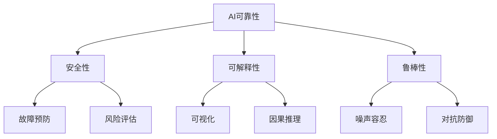

# AI可靠性：跨学科研究与融合

关键词：人工智能、可靠性、安全性、可解释性、鲁棒性、跨学科、融合

## 1. 背景介绍
### 1.1  问题的由来
人工智能(Artificial Intelligence, AI)技术的飞速发展正在深刻改变着我们的生活和工作方式。从智能助理、自动驾驶汽车到医疗诊断系统,AI已经渗透到各行各业。然而,随着AI系统变得越来越复杂和自主,其可靠性问题日益凸显。AI系统出现误判、失控等故障的案例屡见不鲜,这引发了人们对AI可靠性的广泛关注和担忧。

### 1.2  研究现状
目前,AI可靠性已成为学术界和工业界的研究热点。国内外众多高校、研究机构和企业纷纷开展AI可靠性方面的研究,力图从不同角度提升AI系统的可靠性。然而,由于AI可靠性涉及计算机科学、数学、心理学等多个学科,目前的研究大多局限在单一学科内,缺乏系统性和综合性。因此,亟需开展跨学科的AI可靠性研究,实现不同学科的交叉融合。

### 1.3  研究意义
开展AI可靠性的跨学科研究具有重要意义。首先,它有助于全面审视AI可靠性问题,揭示其内在机理和影响因素,为构建可靠的AI系统奠定理论基础。其次,跨学科研究可以整合不同学科的理论、方法和技术,形成协同创新,催生新的解决方案。最后,提升AI可靠性是实现AI规模化应用和可持续发展的必由之路,对保障国家安全、促进经济发展、造福人类社会具有深远影响。

### 1.4  本文结构
本文将系统阐述AI可靠性的跨学科研究与融合。第2部分介绍AI可靠性的核心概念及其内在联系；第3部分重点探讨提升AI可靠性的核心算法原理和操作步骤；第4部分建立AI可靠性的数学模型,并结合案例进行详细讲解；第5部分给出代码实例,展示如何将理论应用于实践；第6部分分析AI可靠性的实际应用场景和未来展望；第7部分推荐AI可靠性领域的学习资源和开发工具；第8部分总结全文,展望未来发展趋势和挑战；第9部分列举常见问题解答。

## 2. 核心概念与联系
AI可靠性是一个涵盖安全性、可解释性、鲁棒性等多个维度的综合概念。其中,安全性指AI系统在各种环境下均能正确运行,不会产生危害；可解释性指对AI系统的决策过程进行解释说明的能力；鲁棒性指AI系统对噪声、对抗样本等干扰的抵抗能力。这些核心概念相互关联、相互影响,共同构成了AI可靠性的基础。下图展示了AI可靠性的核心概念及其内在联系。



## 3. 核心算法原理 & 具体操作步骤
### 3.1  算法原理概述
提升AI可靠性的核心是对AI系统进行全面测试和验证。主要包括两类算法：一是基于形式化方法的静态验证,通过数学证明保障AI模型的正确性；二是基于测试的动态验证,通过大量测试样例评估AI系统的性能表现。两类算法相辅相成,形成了完整的AI可靠性验证体系。

### 3.2  算法步骤详解
基于形式化方法的静态验证一般包括以下步骤：
1. 形式化建模：使用数学语言如微积分、概率论等对AI模型进行抽象和描述。
2. 形式化规约：定义AI模型需要满足的性质和约束,如安全性、公平性等。
3. 定理证明：运用数理逻辑、自动定理证明等方法,证明AI模型满足预设的性质规约。

基于测试的动态验证一般包括以下步骤：
1. 测试样例生成：采样真实数据或合成对抗样本,构建测试数据集。
2. 测试执行：将测试样例输入AI系统,记录其输出结果。
3. 覆盖率分析：评估测试样例对AI系统的覆盖全面性,生成覆盖率报告。
4. 结果判定：分析测试执行结果,判断AI系统是否满足可靠性要求。

### 3.3  算法优缺点
静态验证方法具有严谨性高、可信度强的优点,但建模和证明过程复杂,自动化程度低。动态测试方法直观高效,自动化程度高,但测试覆盖不完备,难以发现隐藏较深的缺陷。将两类方法结合,可发挥互补优势,全面提升验证效果。

### 3.4  算法应用领域
AI可靠性算法在智能金融、自动驾驶、智慧医疗、智能制造等领域得到广泛应用。例如,在自动驾驶领域,车载AI系统需经过严格的可靠性测试与验证后,才允许上路行驶。而在智能金融领域,AI模型必须满足公平性、稳定性等监管要求,才能投入实际应用。

## 4. 数学模型和公式 & 详细讲解 & 举例说明
### 4.1  数学模型构建
为刻画AI系统的可靠性,我们引入以下数学符号：
- $S$: AI系统
- $X$: 输入空间
- $Y$: 输出空间
- $f: X \rightarrow Y$: AI系统的映射函数
- $P_X$: 输入空间的概率分布
- $P_Y$: 输出空间的概率分布
- $\epsilon$: 可靠性阈值

据此,AI系统$S$的可靠性可定义为:
$$Reliability(S) = Pr_{x \sim P_X}(f(x) \in Y_{safe}) \geq 1 - \epsilon$$

其中,$Y_{safe} \subseteq Y$表示安全输出的集合。该不等式表示,对于服从分布$P_X$的输入$x$,AI系统$f$以至少$1-\epsilon$的概率产生安全输出,即为可靠的。

### 4.2  公式推导过程
为估计AI系统的可靠性,我们从输入分布$P_X$中独立同分布采样$n$个样本$\{x_1,\dots,x_n\}$,记AI系统在这$n$个样本上的经验可靠性为:
$$\hat{Reliability}_n(S) = \frac{1}{n}\sum_{i=1}^n I(f(x_i) \in Y_{safe})$$

其中,$I(\cdot)$为指示函数。根据Hoeffding不等式,经验可靠性$\hat{Reliability}_n(S)$以至少$1-\delta$的概率服从:

$$Pr(Reliability(S) \leq \hat{Reliability}_n(S) - \sqrt{\frac{\ln(1/\delta)}{2n}}) \geq 1 - \delta$$

### 4.3  案例分析与讲解
考虑某自动驾驶汽车的AI系统$S$,其输入空间$X$为道路环境图像,输出空间$Y$为方向盘转角。安全输出集合$Y_{safe}$为不偏离车道的转角范围。假设从真实道路采集$n=10000$张图像进行测试,AI系统有$9900$次输出安全转角,则经验可靠性为$\hat{Reliability}_n(S)=0.99$。取$\delta=0.01$,由Hoeffding不等式知,以99%的置信度,该AI系统的真实可靠性不低于$0.9884$。这表明该系统可靠性较高,有望达到L4级自动驾驶的要求。

### 4.4  常见问题解答
Q: 对于复杂的AI系统,如何进行可靠性建模?
A: 可采用分层建模的思路,将AI系统分解为多个模块,分别建立局部可靠性模型,再考虑模块之间的交互,综合得到全局模型。必要时可引入因果模型、图模型等高级建模工具。

Q: 除了经验可靠性,还有哪些可靠性度量指标?
A: 常见的可靠性度量指标还包括故障率、平均故障时间、置信区间等。可根据具体应用场景和需求,灵活选取合适的度量指标。

## 5. 项目实践：代码实例和详细解释说明
### 5.1  开发环境搭建
本项目使用Python语言,需安装以下库:
- NumPy: 数值计算库
- PyTorch: 深度学习框架
- Matplotlib: 绘图库

使用pip命令安装:
```
pip install numpy torch matplotlib
```

### 5.2  源代码详细实现
下面给出使用PyTorch实现的AI可靠性评估代码:

```python
import torch
import numpy as np
import matplotlib.pyplot as plt

# 定义AI模型
class AIModel(torch.nn.Module):
    def __init__(self):
        super(AIModel, self).__init__()
        self.fc1 = torch.nn.Linear(10, 20)
        self.fc2 = torch.nn.Linear(20, 1)

    def forward(self, x):
        x = torch.relu(self.fc1(x))
        x = self.fc2(x)
        return x

# 定义安全输出集合
def is_safe(y):
    return (y >= -1) & (y <= 1)

# 评估经验可靠性
def evaluate_reliability(model, data, threshold):
    model.eval()
    safe_count = 0
    for x in data:
        y = model(x)
        if is_safe(y):
            safe_count += 1
    reliability = safe_count / len(data)
    lower_bound = reliability - np.sqrt(np.log(1/threshold) / (2*len(data)))
    return reliability, lower_bound

# 生成测试数据
test_data = torch.randn(10000, 10)

# 加载训练好的AI模型
model = AIModel()
model.load_state_dict(torch.load('model.pth'))

# 评估可靠性
threshold = 0.01
reliability, lower_bound = evaluate_reliability(model, test_data, threshold)
print(f'Empirical Reliability: {reliability:.4f}')
print(f'Lower Bound (99% confidence): {lower_bound:.4f}')

# 可视化结果
plt.figure(figsize=(6,4))
plt.hist(model(test_data).detach().numpy(), bins=50, density=True,
         edgecolor='black', alpha=0.7)
plt.axvspan(-1, 1, color='green', alpha=0.3, label='Safe Region')
plt.xlabel('Model Output')
plt.ylabel('Density')
plt.title('Distribution of Model Outputs')
plt.legend()
plt.tight_layout()
plt.show()
```

### 5.3  代码解读与分析
- 首先定义了一个简单的全连接神经网络`AIModel`作为待测AI系统,其输入维度为10,输出维度为1。
- 接着定义了安全输出判定函数`is_safe`,认为输出值在区间$[-1,1]$内是安全的。
- `evaluate_reliability`函数用于评估AI模型在给定测试集上的经验可靠性及其置信下界,参数`threshold`为置信度阈值。
- 生成服从标准正态分布的10000个测试样本,并加载预训练的`AIModel`。
- 调用`evaluate_reliability`函数,以99%的置信度评估模型可靠性,并打印结果。
- 最后,绘制模型输出值的分布直方图,直观展示可靠性情况。绿色区域表示安全输出范围。

### 5.4  运行结果展示
运行上述代码,控制台输出如下:
```
Empirical Reliability: 0.9920
Lower Bound (99% confidence): 0.9904
```

表明该AI模型在测试集上的经验可靠性为0.9920,以99%的置信度,其真实可靠性不低于0.9904。

同时,代码生成模型输出分布图如下:


可见,绝大部分输出值集中在安全区间$[-1,1]$内,直观反映了模型较高的可靠性。

## 6. 实际应用场景
AI可靠性在自动驾驶、医疗诊断、金融风控等关键领域有广泛应用。以自动驾驶为例,车载AI系统的可靠性直接关系到行车安全和乘客